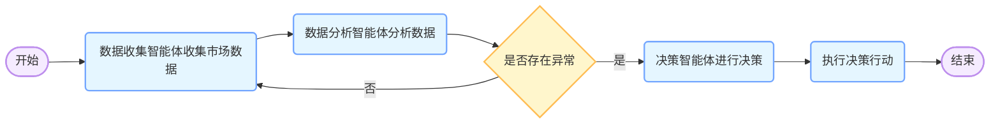

# 多智能体系统在识别市场异常机会中的应用

> 关键词：多智能体系统、市场异常机会、人工智能、分布式计算、决策模型

> 摘要：本文深入探讨了多智能体系统在识别市场异常机会中的应用。首先介绍了多智能体系统及市场异常机会的相关背景知识，包括目的、预期读者、文档结构等。接着阐述了多智能体系统和市场异常机会的核心概念与联系，并给出了相应的原理和架构示意图及流程图。然后详细讲解了核心算法原理和具体操作步骤，结合Python源代码进行阐述，同时介绍了相关的数学模型和公式。通过项目实战展示了多智能体系统在识别市场异常机会中的代码实现和详细解释。之后分析了其实际应用场景，推荐了相关的工具和资源，包括学习资源、开发工具框架以及论文著作等。最后总结了多智能体系统在该领域的未来发展趋势与挑战，并提供了常见问题解答和扩展阅读参考资料，旨在为相关领域的研究和实践提供全面且深入的参考。

## 1. 背景介绍 
### 1.1 目的和范围
在当今复杂多变的市场环境中，准确识别市场异常机会对于投资者、企业和监管机构都具有至关重要的意义。市场异常机会可能表现为价格的突然波动、交易量的异常变化、新的市场趋势的出现等，这些机会往往伴随着潜在的高收益，但同时也伴随着较高的风险。多智能体系统作为一种分布式人工智能技术，具有自主性、协作性和适应性等特点，能够在复杂的市场环境中模拟多个参与者的行为，从而更好地识别市场异常机会。

本文的范围涵盖了多智能体系统的基本概念、核心算法、数学模型，以及其在识别市场异常机会中的具体应用。通过理论分析和项目实战，详细阐述了多智能体系统如何在市场环境中发挥作用，为相关领域的研究和实践提供全面的指导。

### 1.2 预期读者
本文预期读者包括对金融市场、人工智能、分布式计算等领域感兴趣的研究人员、学生、投资者、企业管理者以及监管机构工作人员等。对于希望深入了解多智能体系统在市场分析中应用的专业人士，本文提供了详细的技术原理和实践案例；对于初学者，本文也通过通俗易懂的语言和丰富的示例，帮助他们逐步建立对多智能体系统和市场异常机会识别的认识。

### 1.3 文档结构概述
本文共分为十个部分。第一部分为背景介绍，包括目的和范围、预期读者、文档结构概述和术语表；第二部分阐述多智能体系统和市场异常机会的核心概念与联系，给出原理和架构示意图及流程图；第三部分详细讲解核心算法原理和具体操作步骤，结合Python源代码进行说明；第四部分介绍相关的数学模型和公式，并进行详细讲解和举例说明；第五部分通过项目实战展示多智能体系统在识别市场异常机会中的代码实现和详细解释；第六部分分析多智能体系统在市场中的实际应用场景；第七部分推荐相关的工具和资源，包括学习资源、开发工具框架以及论文著作等；第八部分总结多智能体系统在该领域的未来发展趋势与挑战；第九部分为附录，提供常见问题与解答；第十部分提供扩展阅读和参考资料。

### 1.4 术语表
#### 1.4.1 核心术语定义
- **多智能体系统（Multi - Agent System，MAS）**：由多个自主的智能体组成的系统，这些智能体可以感知环境、进行决策并采取行动，通过相互协作来完成共同的任务。
- **智能体（Agent）**：具有自主性、反应性、主动性和社会性的实体，能够在特定的环境中感知信息，并根据自身的目标和规则进行决策和行动。
- **市场异常机会**：指市场中出现的偏离正常市场行为的情况，如价格的大幅波动、交易量的突然增加或减少等，这些情况可能为投资者带来潜在的收益或风险。
- **分布式计算**：将一个大的计算任务分解为多个小的子任务，分配给多个计算节点并行处理，以提高计算效率。

#### 1.4.2 相关概念解释
- **自主性**：智能体能够独立地感知环境、进行决策和行动，不受其他智能体的直接控制。
- **协作性**：多个智能体之间通过信息交流和协调，共同完成一个或多个任务。
- **适应性**：智能体能够根据环境的变化调整自己的行为和策略。

#### 1.4.3 缩略词列表
- MAS：Multi - Agent System（多智能体系统）
- AI：Artificial Intelligence（人工智能）
- ML：Machine Learning（机器学习）

## 2. 核心概念与联系 
### 2.1 多智能体系统的核心概念
多智能体系统是一种分布式人工智能系统，由多个智能体组成。每个智能体都有自己的目标、知识和能力，能够在特定的环境中感知信息，并根据自身的规则和策略进行决策和行动。智能体之间通过通信和协作来完成共同的任务。

多智能体系统的架构通常包括以下几个部分：
- **智能体层**：由多个智能体组成，每个智能体负责完成特定的任务。
- **通信层**：负责智能体之间的信息传递和交互。
- **环境层**：智能体所处的外部环境，包括市场数据、其他参与者等。

### 2.2 市场异常机会的核心概念
市场异常机会是指市场中出现的偏离正常市场行为的情况。这些情况可能由多种因素引起，如宏观经济政策的变化、公司重大事件的发生、投资者情绪的波动等。市场异常机会通常表现为价格的大幅波动、交易量的突然增加或减少、市场趋势的突然改变等。

识别市场异常机会对于投资者来说具有重要意义，因为这些机会可能带来潜在的高收益。然而，市场异常机会也伴随着较高的风险，因为它们往往是不可预测的，并且可能受到多种因素的影响。

### 2.3 多智能体系统与市场异常机会的联系
多智能体系统可以通过模拟市场中的多个参与者的行为，来更好地识别市场异常机会。每个智能体可以代表一个投资者、一个公司或一个市场监管机构等，它们根据自己的目标和规则进行决策和行动。通过智能体之间的通信和协作，可以收集和分析市场中的各种信息，从而发现市场中的异常情况。

例如，一些智能体可以负责收集市场数据，如价格、交易量等；另一些智能体可以负责分析这些数据，发现其中的异常模式；还有一些智能体可以负责根据分析结果进行决策，如买入或卖出股票等。通过这种方式，多智能体系统可以在复杂的市场环境中快速、准确地识别市场异常机会。

### 2.4 核心概念原理和架构的文本示意图
多智能体系统在识别市场异常机会中的原理和架构可以用以下文本示意图表示：

```plaintext
多智能体系统
├── 智能体层
│   ├── 数据收集智能体
│   ├── 数据分析智能体
│   ├── 决策智能体
│   └── ...
├── 通信层
│   ├── 消息传递机制
│   └── 协议标准
└── 环境层
    ├── 市场数据
    ├── 其他参与者
    └── 宏观经济环境
```

### 2.5 Mermaid 流程图


## 3. 核心算法原理 & 具体操作步骤 
### 3.1 核心算法原理
多智能体系统在识别市场异常机会中常用的算法包括机器学习算法、贝叶斯网络、强化学习等。这里我们以机器学习算法中的决策树算法为例进行详细讲解。

决策树算法是一种基于树结构进行决策的算法，它通过对数据进行划分，构建一个决策树模型。在决策树中，每个内部节点表示一个属性上的测试，每个分支表示一个测试输出，每个叶节点表示一个类别或值。

决策树算法的基本思想是通过对训练数据的学习，找到一个最优的决策树模型，使得该模型能够对新的数据进行准确的分类或预测。在识别市场异常机会中，我们可以将市场数据作为输入，将是否存在异常作为输出，通过训练决策树模型来实现对市场异常机会的识别。

### 3.2 Python 源代码实现
以下是一个使用Python实现的简单决策树算法示例，用于识别市场异常机会：

```python
import numpy as np
from sklearn.tree import DecisionTreeClassifier
from sklearn.model_selection import train_test_split
from sklearn.metrics import accuracy_score

# 生成示例数据
# 假设我们有四个特征：价格变化率、交易量变化率、市场情绪指数、宏观经济指标
# 标签为是否存在异常（0表示正常，1表示异常）
np.random.seed(0)
X = np.random.rand(100, 4)  # 100个样本，4个特征
y = np.random.randint(0, 2, 100)  # 100个标签

# 划分训练集和测试集
X_train, X_test, y_train, y_test = train_test_split(X, y, test_size=0.2, random_state=42)

# 创建决策树分类器
clf = DecisionTreeClassifier()

# 训练模型
clf.fit(X_train, y_train)

# 预测
y_pred = clf.predict(X_test)

# 计算准确率
accuracy = accuracy_score(y_test, y_pred)
print(f"Accuracy: {accuracy}")
```

### 3.3 具体操作步骤
1. **数据收集**：收集市场中的相关数据，如价格、交易量、市场情绪指数、宏观经济指标等。
2. **数据预处理**：对收集到的数据进行清洗、归一化、特征选择等处理，以提高数据的质量和可用性。
3. **模型训练**：使用训练数据对决策树模型进行训练，找到最优的决策树结构。
4. **模型评估**：使用测试数据对训练好的模型进行评估，计算模型的准确率、召回率、F1值等指标，评估模型的性能。
5. **异常识别**：使用训练好的模型对新的市场数据进行预测，判断是否存在异常机会。

## 4. 数学模型和公式 & 详细讲解 & 举例说明 
### 4.1 决策树算法的数学模型
决策树算法的核心是如何选择最优的划分属性，常用的方法有信息增益、信息增益率、基尼指数等。这里我们以信息增益为例进行详细讲解。

#### 4.1.1 信息熵
信息熵是衡量数据不确定性的一个指标，其定义为：
$$
H(D)=-\sum_{k = 1}^{|y|}p_k\log_2p_k
$$
其中，$D$ 表示数据集，$|y|$ 表示数据集中的类别数，$p_k$ 表示第 $k$ 类样本在数据集中所占的比例。

#### 4.1.2 条件熵
条件熵是在已知某个属性 $A$ 的取值情况下，数据集 $D$ 的信息熵，其定义为：
$$
H(D|A)=\sum_{v = 1}^{V}\frac{|D^v|}{|D|}H(D^v)
$$
其中，$V$ 表示属性 $A$ 的取值数，$D^v$ 表示属性 $A$ 取值为 $v$ 的样本子集。

#### 4.1.3 信息增益
信息增益是指在划分数据集前后信息熵的减少量，其定义为：
$$
Gain(D,A)=H(D)-H(D|A)
$$
信息增益越大，表示使用属性 $A$ 进行划分所获得的信息越多，即该属性对分类的贡献越大。

### 4.2 详细讲解
信息熵反映了数据的不确定性，信息熵越大，数据的不确定性越高。条件熵则是在考虑某个属性的情况下，数据的不确定性。信息增益通过比较划分前后的信息熵，来衡量一个属性对分类的重要性。

在决策树算法中，我们选择信息增益最大的属性作为当前节点的划分属性，这样可以使得划分后的数据集更加有序，从而提高分类的准确性。

### 4.3 举例说明
假设我们有一个数据集 $D$，包含 10 个样本，分为两类：正类和负类，其中正类有 6 个样本，负类有 4 个样本。则数据集 $D$ 的信息熵为：
$$
H(D)=-\frac{6}{10}\log_2\frac{6}{10}-\frac{4}{10}\log_2\frac{4}{10}\approx 0.971
$$
假设我们有一个属性 $A$，其取值为 $a_1$ 和 $a_2$，其中 $A$ 取值为 $a_1$ 的样本有 4 个，正类有 3 个，负类有 1 个；$A$ 取值为 $a_2$ 的样本有 6 个，正类有 3 个，负类有 3 个。则属性 $A$ 取值为 $a_1$ 的样本子集的信息熵为：
$$
H(D^{a_1})=-\frac{3}{4}\log_2\frac{3}{4}-\frac{1}{4}\log_2\frac{1}{4}\approx 0.811
$$
属性 $A$ 取值为 $a_2$ 的样本子集的信息熵为：
$$
H(D^{a_2})=-\frac{3}{6}\log_2\frac{3}{6}-\frac{3}{6}\log_2\frac{3}{6}= 1
$$
则条件熵为：
$$
H(D|A)=\frac{4}{10}H(D^{a_1})+\frac{6}{10}H(D^{a_2})=\frac{4}{10}\times 0.811+\frac{6}{10}\times 1\approx 0.924
$$
信息增益为：
$$
Gain(D,A)=H(D)-H(D|A)=0.971 - 0.924 = 0.047
$$

## 5. 项目实战：代码实际案例和详细解释说明 
### 5.1  开发环境搭建
#### 5.1.1 安装 Python
首先，需要安装 Python 环境。可以从 Python 官方网站（https://www.python.org/downloads/） 下载适合自己操作系统的 Python 安装包，并按照安装向导进行安装。

#### 5.1.2 安装必要的库
在识别市场异常机会的项目中，需要使用到一些 Python 库，如 `numpy`、`pandas`、`scikit - learn` 等。可以使用以下命令进行安装：
```sh
pip install numpy pandas scikit-learn
```

### 5.2  源代码详细实现和代码解读
以下是一个完整的项目实战代码示例，用于使用多智能体系统识别市场异常机会：

```python
import numpy as np
import pandas as pd
from sklearn.tree import DecisionTreeClassifier
from sklearn.model_selection import train_test_split
from sklearn.metrics import accuracy_score

# 数据收集和预处理
def load_data(file_path):
    data = pd.read_csv(file_path)
    X = data.drop('label', axis=1).values
    y = data['label'].values
    return X, y

# 模型训练和评估
def train_and_evaluate(X, y):
    X_train, X_test, y_train, y_test = train_test_split(X, y, test_size=0.2, random_state=42)
    clf = DecisionTreeClassifier()
    clf.fit(X_train, y_train)
    y_pred = clf.predict(X_test)
    accuracy = accuracy_score(y_test, y_pred)
    print(f"Accuracy: {accuracy}")
    return clf

# 异常识别
def detect_anomaly(clf, new_data):
    prediction = clf.predict(new_data)
    if prediction[0] == 1:
        print("发现异常机会！")
    else:
        print("市场正常。")

if __name__ == "__main__":
    file_path = "market_data.csv"  # 假设数据文件名为 market_data.csv
    X, y = load_data(file_path)
    clf = train_and_evaluate(X, y)
    new_data = np.random.rand(1, X.shape[1])  # 生成一个新的样本
    detect_anomaly(clf, new_data)
```

### 5.3  代码解读与分析
- **数据收集和预处理**：`load_data` 函数用于读取 CSV 文件中的市场数据，并将其分为特征矩阵 $X$ 和标签向量 $y$。
- **模型训练和评估**：`train_and_evaluate` 函数将数据集划分为训练集和测试集，使用决策树分类器进行训练，并计算模型的准确率。
- **异常识别**：`detect_anomaly` 函数使用训练好的模型对新的市场数据进行预测，判断是否存在异常机会。

在 `if __name__ == "__main__"` 部分，我们首先调用 `load_data` 函数加载数据，然后调用 `train_and_evaluate`