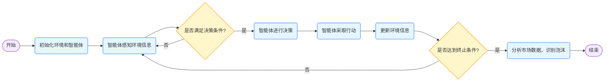

# 多智能体系统在识别市场泡沫形成中的应用

> 关键词：多智能体系统、市场泡沫识别、人工智能、金融市场、复杂系统

> 摘要：本文深入探讨了多智能体系统在识别市场泡沫形成中的应用。首先介绍了多智能体系统和市场泡沫的背景知识，阐述了研究目的和范围。接着详细讲解了多智能体系统的核心概念、架构和工作原理，包括其与市场泡沫形成机制的联系。通过Python代码详细阐述了核心算法原理和具体操作步骤，同时给出了相关的数学模型和公式，并进行举例说明。在项目实战部分，搭建了开发环境，给出了源代码实现和详细解读。还分析了多智能体系统在识别市场泡沫中的实际应用场景，推荐了相关的学习资源、开发工具框架和论文著作。最后总结了多智能体系统在该领域的未来发展趋势与挑战，并对常见问题进行了解答，提供了扩展阅读和参考资料。

## 1. 背景介绍 
### 1.1 目的和范围
市场泡沫的形成是金融市场中一个复杂且具有重大影响的现象。准确识别市场泡沫的形成对于投资者、监管机构和政策制定者都至关重要。投资者可以根据泡沫识别结果调整投资策略，避免资产损失；监管机构能够及时采取措施防范金融风险，维护市场稳定；政策制定者可以基于对市场泡沫的了解制定合理的宏观经济政策。

多智能体系统作为一种模拟复杂系统行为的有效工具，能够模拟市场中众多参与者的行为及其相互作用，从而为识别市场泡沫的形成提供了新的视角和方法。本文的目的在于详细探讨多智能体系统在识别市场泡沫形成中的应用，包括其原理、算法、实际案例以及未来发展趋势等方面。

研究范围主要集中在金融市场中的股票市场、房地产市场等常见出现泡沫的领域，通过对多智能体系统的建模和模拟，分析市场参与者的行为模式、信息传播机制等因素对市场泡沫形成的影响。

### 1.2 预期读者
本文的预期读者包括金融领域的专业人士，如投资者、金融分析师、监管机构工作人员等，他们可以通过本文了解多智能体系统在市场泡沫识别中的应用，为实际工作提供新的思路和方法。同时，计算机科学领域的研究人员和开发者也可以从中获取关于多智能体系统在金融领域应用的具体案例和技术细节，为相关研究和开发工作提供参考。此外，对金融市场和人工智能交叉领域感兴趣的学生和爱好者也能通过本文深入了解这一前沿领域的知识。

### 1.3 文档结构概述
本文共分为十个部分。第一部分为背景介绍，阐述了研究的目的和范围、预期读者以及文档结构概述，并给出了相关术语的定义和解释。第二部分介绍了多智能体系统和市场泡沫的核心概念，以及它们之间的联系，同时给出了核心概念的原理和架构的文本示意图以及Mermaid流程图。第三部分详细讲解了多智能体系统在识别市场泡沫形成中的核心算法原理，并给出了具体操作步骤，使用Python代码进行了详细阐述。第四部分给出了相关的数学模型和公式，并进行了详细讲解和举例说明。第五部分为项目实战，包括开发环境搭建、源代码详细实现和代码解读以及代码分析。第六部分分析了多智能体系统在识别市场泡沫中的实际应用场景。第七部分推荐了相关的学习资源、开发工具框架和论文著作。第八部分总结了多智能体系统在该领域的未来发展趋势与挑战。第九部分为附录，解答了常见问题。第十部分提供了扩展阅读和参考资料。

### 1.4 术语表
#### 1.4.1 核心术语定义
- **多智能体系统（Multi - Agent System，MAS）**：由多个自主的智能体组成的系统，这些智能体能够感知环境、进行决策并采取行动，通过相互之间的交互和协作来完成特定的任务。
- **市场泡沫**：指资产价格持续上涨，远远超过其内在价值的现象。市场泡沫通常伴随着投资者的过度乐观情绪和投机行为，最终可能导致资产价格的崩溃。
- **智能体（Agent）**：具有自主性、反应性、社会性和主动性的实体，能够在一定的环境中感知信息，根据自身的目标和规则进行决策，并采取相应的行动。
- **资产内在价值**：资产在合理的市场条件下所具有的真实价值，通常基于资产的基本面因素，如盈利能力、现金流等进行评估。

#### 1.4.2 相关概念解释
- **复杂系统**：由大量相互作用的组成部分构成的系统，其行为和特性不能简单地通过各个组成部分的特性来预测。金融市场就是一个典型的复杂系统，其中包含众多的投资者、交易品种和信息，它们之间的相互作用使得市场行为具有高度的不确定性和复杂性。
- **信息传播机制**：在市场中，信息的传播方式和速度对投资者的决策和市场价格的形成具有重要影响。信息传播机制包括直接传播、间接传播、网络传播等多种形式，不同的传播机制会导致信息在市场中的扩散速度和范围不同。
- **投资者情绪**：指投资者对市场的乐观或悲观态度，投资者情绪会影响他们的投资决策和行为。在市场泡沫形成过程中，投资者的过度乐观情绪往往会推动资产价格的持续上涨。

#### 1.4.3 缩略词列表
- **MAS**：Multi - Agent System（多智能体系统）

## 2. 核心概念与联系 

### 2.1 多智能体系统的核心概念
多智能体系统是一种模拟复杂系统行为的有效工具，它由多个智能体组成，每个智能体都具有一定的自主性和智能性。智能体可以是个体投资者、金融机构、监管机构等，它们在市场环境中感知信息、进行决策并采取行动。

多智能体系统的核心特点包括：
- **自主性**：每个智能体都能够独立地感知环境、进行决策和采取行动，不受其他智能体的直接控制。
- **反应性**：智能体能够对环境的变化做出及时的反应，根据感知到的信息调整自己的行为。
- **社会性**：智能体之间可以进行交互和协作，通过信息共享、合作竞争等方式来实现共同的目标或满足自身的利益。
- **主动性**：智能体具有一定的目标和规划能力，能够主动地寻找机会、探索环境，以实现自身的目标。

### 2.2 市场泡沫的形成机制
市场泡沫的形成通常与投资者的心理和行为、信息传播、市场结构等因素密切相关。以下是市场泡沫形成的一般机制：
- **投资者心理和行为**：投资者的过度乐观情绪和羊群行为是市场泡沫形成的重要因素。当市场出现上涨趋势时，投资者往往会产生过度乐观的情绪，认为市场会持续上涨，从而纷纷买入资产，推动资产价格进一步上涨。同时，投资者的羊群行为也会加剧市场泡沫的形成，当部分投资者买入资产获得收益时，其他投资者会盲目跟风买入，导致资产价格脱离其内在价值。
- **信息传播**：信息的不对称和传播速度的不均衡也会影响市场泡沫的形成。在市场中，一些投资者可能掌握了更多的信息，而其他投资者则可能信息不足。当有利好消息传播时，投资者可能会过度反应，推动资产价格上涨；而当利空消息传播时，投资者可能会恐慌抛售，导致资产价格下跌。
- **市场结构**：市场的流动性、交易规则、监管政策等因素也会对市场泡沫的形成产生影响。例如，宽松的货币政策和低利率环境会增加市场的流动性，使得投资者更容易获得资金进行投资，从而推动资产价格上涨；而不完善的监管政策则可能导致市场操纵和欺诈行为的发生，加剧市场泡沫的形成。

### 2.3 多智能体系统与市场泡沫形成的联系
多智能体系统可以很好地模拟市场中众多参与者的行为及其相互作用，从而为研究市场泡沫的形成机制提供了一种有效的方法。通过在多智能体系统中设置不同类型的智能体，如理性投资者、非理性投资者、机构投资者等，模拟它们的投资决策过程和信息传播机制，可以观察市场价格的动态变化，分析市场泡沫的形成和演化过程。

例如，在多智能体系统中，非理性投资者可能会受到情绪的影响，做出过度乐观或悲观的投资决策；而理性投资者则会根据资产的内在价值进行投资决策。当非理性投资者的行为占主导地位时，市场价格可能会偏离资产的内在价值，从而形成市场泡沫。同时，智能体之间的信息传播机制也会影响市场泡沫的形成和扩散速度。

### 2.4 核心概念原理和架构的文本示意图
多智能体系统在识别市场泡沫形成中的架构可以分为以下几个层次：
- **环境层**：包括金融市场的各种信息，如资产价格、交易量、宏观经济数据等，是智能体感知和交互的基础。
- **智能体层**：由多个不同类型的智能体组成，每个智能体都有自己的感知、决策和行动能力。智能体根据环境层提供的信息进行决策，并采取相应的投资行动。
- **交互层**：负责智能体之间的信息交互和协作，智能体可以通过交互层共享信息、交流意见，从而影响彼此的决策。
- **分析层**：对智能体的行为和市场价格的变化进行分析，识别市场泡沫的形成迹象，并提供相应的预警信号。

### 2.5 Mermaid流程图


## 3. 核心算法原理 & 具体操作步骤 

### 3.1 核心算法原理
在多智能体系统中识别市场泡沫形成的核心算法主要基于智能体的决策模型和市场价格的动态演化模型。以下是一种常见的算法原理：

#### 3.1.1 智能体决策模型
智能体的决策模型可以基于多种因素，如资产的内在价值、市场价格、投资者情绪等。一种简单的决策模型是基于价值投资和趋势投资的混合模型。

价值投资者会根据资产的内在价值进行投资决策，当市场价格低于资产的内在价值时，他们会买入资产；当市场价格高于资产的内在价值时，他们会卖出资产。趋势投资者则会根据市场价格的趋势进行投资决策，当市场价格上涨时，他们会买入资产；当市场价格下跌时，他们会卖出资产。

在Python中，可以用以下代码实现简单的智能体决策模型：
```python
class Agent:
    def __init__(self, type, intrinsic_value):
        self.type = type  # 智能体类型，'value' 或 'trend'
        self.intrinsic_value = intrinsic_value
        self.position = 0  # 持仓情况，正数表示买入，负数表示卖出

    def make_decision(self, market_price, price_trend):
        if self.type == 'value':
            if market_price < self.intrinsic_value:
                self.position = 1  # 买入
            elif market_price > self.intrinsic_value:
                self.position = -1  # 卖出
            else:
                self.position = 0  # 持有
        elif self.type == 'trend':
            if price_trend > 0:
                self.position = 1  # 买入
            elif price_trend < 0:
                self.position = -1  # 卖出
            else:
                self.position = 0  # 持有
        return self.position
```

#### 3.1.2 市场价格的动态演化模型
市场价格的动态演化模型可以基于供需关系和信息传播机制。在多智能体系统中，市场价格会随着智能体的买卖行为而发生变化。当买入的智能体数量多于卖出的智能体数量时，市场价格会上涨；反之，市场价格会下跌。

以下是一个简单的市场价格动态演化模型的Python代码：
```python
def update_market_price(market_price, agents):
    total_buy = 0
    total_sell = 0
    for agent in agents:
        if agent.position > 0:
            total_buy += 1
        elif agent.position < 0:
            total_sell += 1
    if total_buy > total_sell:
        market_price *= 1.01  # 价格上涨 1%
    elif total_buy < total_sell:
        market_price *= 0.99  # 价格下跌 1%
    return market_price
```

### 3.2 具体操作步骤
#### 3.2.1 初始化环境和智能体
首先，需要初始化市场环境和智能体。市场环境包括初始的市场价格、资产的内在价值等信息；智能体包括不同类型的投资者，如价值投资者和趋势投资者。

```python
# 初始化市场环境
initial_market_price = 100
intrinsic_value = 100

# 初始化智能体
num_agents = 100
agents = []
for _ in range(num_agents):
    agent_type = 'value' if _ % 2 == 0 else 'trend'
    agent = Agent(agent_type, intrinsic_value)
    agents.append(agent)
```

#### 3.2.2 模拟市场运行
在模拟市场运行过程中，智能体不断感知市场环境信息，进行决策并采取行动，同时市场价格也会根据智能体的买卖行为进行更新。

```python
num_steps = 100
market_prices = [initial_market_price]
for step in range(num_steps):
    current_market_price = market_prices[-1]
    if step > 0:
        price_trend = current_market_price - market_prices[-2]
    else:
        price_trend = 0
    # 智能体进行决策
    for agent in agents:
        agent.make_decision(current_market_price, price_trend)
    # 更新市场价格
    new_market_price = update_market_price(current_market_price, agents)
    market_prices.append(new_market_price)
```

#### 3.2.3 分析市场数据，识别泡沫
在模拟结束后，可以对市场价格的变化数据进行分析，识别市场泡沫的形成迹象。例如，可以计算市场价格与资产内在价值的偏离程度，如果偏离程度过大，则可能存在市场泡沫。

```python
import numpy as np

deviation = np.abs(np.array(market_prices) - intrinsic_value)
average_deviation = np.mean(deviation)
if average_deviation > 10:  # 假设偏离程度超过 10 表示存在泡沫
    print("市场可能存在泡沫")
else:
    print("市场未发现明显泡沫")
```

## 4. 数学模型和公式 & 详细讲解 & 举例说明 

### 4.1 智能体决策模型的数学公式
#### 4.1.1 价值投资者决策模型
价值投资者的决策主要基于资产的内在价值 $V$ 和市场价格 $P$。设 $x$ 为智能体的持仓决策，当 $P < V$ 时，$x = 1$（买入）；当 $P > V$ 时，$x = -1$（卖出）；当 $P = V$ 时，$x = 0$（持有）。可以用以下公式表示：
$$
x = 
\begin{cases}
1, & P < V \\
0, & P = V \\
-1, & P > V
\end{cases}
$$

例如，假设资产的内在价值 $V = 100$，市场价格 $P = 90$，则根据上述公式，价值投资者会做出买入决策，即 $x = 1$。

#### 4.1.2 趋势投资者决策模型
趋势投资者的决策主要基于市场价格的趋势 $\Delta P$，其中 $\Delta P = P_t - P_{t - 1}$，$P_t$ 为当前市场价格，$P_{t - 1}$ 为上一时刻的市场价格。设 $x$ 为智能体的持仓决策，当 $\Delta P > 0$ 时，$x = 1$（买入）；当 $\Delta P < 0$ 时，$x = -1$（卖出）；当 $\Delta P = 0$ 时，$x = 0$（持有）。可以用以下公式表示：
$$
x = 
\begin{cases}
1, & \Delta P > 0 \\
0, & \Delta P = 0 \\
-1, & \Delta P < 0
\end{cases}
$$

例如，假设上一时刻市场价格 $P_{t - 1} = 100$，当前市场价格 $P_t = 105$，则 $\Delta P = 105 - 100 = 5 > 0$，趋势投资者会做出买入决策，即 $x = 1$。

### 4.2 市场价格动态演化模型的数学公式
市场价格的动态演化模型基于供需关系，设 $B$ 为买入的智能体数量，$S$ 为卖出的智能体数量，$P_t$ 为当前市场价格，$P_{t + 1}$ 为下一时刻的市场价格。当 $B > S$ 时，市场价格上涨；当 $B < S$ 时，市场价格下跌。可以用以下公式表示：
$$
P_{t + 1} = 
\begin{cases}
P_t(1 + r), & B > S \\
P_t(1 - r), & B < S \\
P_t, & B = S
\end{cases}
$$
其中 $r$ 为价格涨跌的比例系数。

例如，假设当前市场价格 $P_t = 100$，买入的智能体数量 $B = 60$，卖出的智能体数量 $S = 40$，价格涨跌比例系数 $r = 0.01$，则根据上述公式，下一时刻的市场价格 $P_{t + 1} = 100\times(1 + 0.01) = 101$。

### 4.3 市场泡沫识别指标的数学公式
市场泡沫识别指标可以基于市场价格与资产内在价值的偏离程度。设 $P_i$ 为第 $i$ 时刻的市场价格，$V$ 为资产的内在价值，$n$ 为模拟的总步数，则市场价格与资产内在价值的平均偏离程度 $\bar{D}$ 可以用以下公式表示：
$$
\bar{D} = \frac{1}{n}\sum_{i = 1}^{n}|P_i - V|
$$

例如，假设模拟了 $n = 10$ 步，市场价格序列为 $[100, 102, 105, 108, 110, 109, 107, 105, 103, 101]$，资产的内在价值 $V = 100$，则平均偏离程度为：
$$
\begin{align*}
\bar{D} &= \frac{1}{10}\times(|100 - 100| + |102 - 100| + |105 - 100| + |108 - 100| + |110 - 100| + |109 - 100| + |107 - 100| + |105 - 100| + |103 - 100| + |101 - 100|) \\
&= \frac{1}{10}\times(0 + 2 + 5 + 8 + 10 + 9 + 7 + 5 + 3 + 1) \\
&= \frac{50}{10} \\
&= 5
\end{align*}
$$

如果设定平均偏离程度的阈值为 10，则根据上述计算结果，市场未发现明显泡沫。

## 5. 项目实战：代码实际案例和详细解释说明 

### 5.1  开发环境搭建
#### 5.1.1 安装Python
首先需要安装Python编程语言，建议使用Python 3.7及以上版本。可以从Python官方网站（https://www.python.org/downloads/）下载适合自己操作系统的安装包，并按照安装向导进行安装。

#### 5.1.2 安装必要的库
在本项目中，需要使用一些Python库来辅助开发，如`numpy`用于数值计算。可以使用以下命令来安装这些库：
```sh
pip install numpy
```

### 5.2  源代码详细实现和代码解读
```python
import numpy as np

# 定义智能体类
class Agent:
    def __init__(self, type, intrinsic_value):
        self.type = type  # 智能体类型，'value' 或 'trend'
        self.intrinsic_value = intrinsic_value
        self.position = 0  # 持仓情况，正数表示买入，负数表示卖出

    def make_decision(self, market_price, price_trend):
        if self.type == 'value':
            if market_price < self.intrinsic_value:
                self.position = 1  # 买入
            elif market_price > self.intrinsic_value:
                self.position = -1  # 卖出
            else:
                self.position = 0  # 持有
        elif self.type == 'trend':
            if price_trend > 0:
                self.position = 1  # 买入
            elif price_trend < 0:
                self.position = -1  # 卖出
            else:
                self.position = 0  # 持有
        return self.position

# 更新市场价格的函数
def update_market_price(market_price, agents):
    total_buy = 0
    total_sell = 0
    for agent in agents:
        if agent.position > 0:
            total_buy += 1
        elif agent.position < 0:
            total_sell += 1
    if total_buy > total_sell:
        market_price *= 1.01  # 价格上涨 1%
    elif total_buy < total_sell:
        market_price *= 0.99  # 价格下跌 1%
    return market_price

# 主函数，模拟市场运行
def simulate_market():
    # 初始化市场环境
    initial_market_price = 100
    intrinsic_value = 100

    # 初始化智能体
    num_agents = 100
    agents = []
    for _ in range(num_agents):
        agent_type = 'value' if _ % 2 == 0 else 'trend'
        agent = Agent(agent_type, intrinsic_value)
        agents.append(agent)

    num_steps = 100
    market_prices = [initial_market_price]
    for step in range(num_steps):
        current_market_price = market_prices[-1]
        if step > 0:
            price_trend = current_market_price - market_prices[-2]
        else:
            price_trend = 0
        # 智能体进行决策
        for agent in agents:
            agent.make_decision(current_market_price, price_trend)
        # 更新市场价格
        new_market_price = update_market_price(current_market_price, agents)
        market_prices.append(new_market_price)

    # 分析市场数据，识别泡沫
    deviation = np.abs(np.array(market_prices) - intrinsic_value)
    average_deviation = np.mean(deviation)
    if average_deviation > 10:  # 假设偏离程度超过 10 表示存在泡沫
        print("市场可能存在泡沫")
    else:
        print("市场未发现明显泡沫")

    return market_prices

if __name__ == "__main__":
    market_prices = simulate_market()
```

### 5.3  代码解读与分析
#### 5.3.1 智能体类 `Agent`
- `__init__` 方法：初始化智能体的类型（价值投资者或趋势投资者）、资产的内在价值和持仓情况。
- `make_decision` 方法：根据智能体的类型和市场价格、价格趋势信息，做出买入、卖出或持有的决策。

#### 5.3.2 `update_market_price` 函数
该函数根据智能体的持仓情况，计算买入和卖出的智能体数量，然后根据供需关系更新市场价格。如果买入的智能体数量多于卖出的智能体数量，市场价格上涨 1%；反之，市场价格下跌 1%。

#### 5.3.3 `simulate_market` 函数
- 初始化市场环境和智能体。
- 模拟市场运行过程，智能体不断感知市场环境信息，进行决策并采取行动，同时市场价格也会根据智能体的买卖行为进行更新。
- 分析市场价格的变化数据，计算市场价格与资产内在价值的平均偏离程度，根据设定的阈值判断市场是否存在泡沫。

#### 5.3.4 主程序
调用 `simulate_market` 函数进行市场模拟，并输出市场是否存在泡沫的判断结果。

## 6. 实际应用场景 
### 6.1 投资者决策支持
对于投资者来说，多智能体系统可以帮助他们更好地理解市场泡沫的形成机制，从而做出更明智的投资决策。通过模拟不同市场环境下的投资者行为和市场价格变化，投资者可以预测市场泡沫的形成和破裂时机，提前调整投资组合，避免资产损失。例如，当多智能体系统模拟结果显示市场可能存在泡沫时，投资者可以减少对高估值资产的持仓，增加对低估值资产或避险资产的配置。

### 6.2 监管机构风险监测
监管机构可以利用多智能体系统对金融市场进行实时监测，及时发现市场泡沫的形成迹象，采取相应的监管措施，防范金融风险。多智能体系统可以模拟市场参与者的行为和信息传播机制，分析市场价格的动态变化，识别异常的市场行为和潜在的风险点。例如，当模拟结果显示市场价格与资产内在价值的偏离程度过大，或者投资者的羊群行为过于明显时，监管机构可以加强对市场的监管，出台相关政策来抑制市场泡沫的进一步扩大。

### 6.3 政策制定参考
政策制定者可以通过多智能体系统研究不同政策对市场泡沫形成的影响，为制定合理的宏观经济政策提供参考。例如，通过模拟不同货币政策、财政政策和监管政策下的市场运行情况，政策制定者可以评估政策的有效性和潜在风险，选择最优的政策组合来促进金融市场的稳定发展。同时，多智能体系统还可以帮助政策制定者预测政策实施后的市场反应，提前做好应对措施。

### 6.4 学术研究
在学术研究领域，多智能体系统为研究市场泡沫的形成机制提供了一种新的方法和工具。学者们可以通过构建不同的多智能体模型，研究投资者的心理和行为、信息传播机制、市场结构等因素对市场泡沫形成的影响，深入探讨市场泡沫的本质和规律。同时，多智能体系统还可以用于验证和改进现有的金融理论和模型，推动金融学科的发展。

## 7. 工具和资源推荐
### 7.1 学习资源推荐
#### 7.1.1 书籍推荐
- 《多智能体系统：原理与编程》：这本书详细介绍了多智能体系统的基本原理、设计方法和编程技巧，适合初学者入门学习。
- 《金融市场的复杂性与非线性》：探讨了金融市场的复杂系统特性和非线性行为，对于理解市场泡沫的形成机制具有重要的参考价值。
- 《行为金融学》：介绍了投资者的心理和行为对金融市场的影响，有助于深入理解市场泡沫形成过程中投资者的行为模式。

#### 7.1.2 在线课程
- Coursera上的“Multi - Agent Systems”课程：由知名高校的教授授课，系统地介绍了多智能体系统的理论和应用。
- edX上的“Financial Markets”课程：讲解了金融市场的基本原理、市场结构和投资策略，对于了解金融市场和市场泡沫有很大帮助。

#### 7.1.3 技术博客和网站
- Towards Data Science：一个专注于数据科学和人工智能的技术博客平台，上面有很多关于多智能体系统和金融市场分析的优秀文章。
- SSRN（Social Science Research Network）：一个社会科学研究网络，提供了大量的金融领域研究论文和学术资源。

### 7.2 开发工具框架推荐
#### 7.2.1 IDE和编辑器
- PyCharm：一款专业的Python集成开发环境，具有代码编辑、调试、版本控制等强大功能，适合开发多智能体系统的Python代码。
- Jupyter Notebook：一个交互式的开发环境，支持Python代码的编写、运行和可视化展示，方便进行数据探索和模型验证。

#### 7.2.2 调试和性能分析工具
- PDB（Python Debugger）：Python自带的调试工具，可以帮助开发者定位代码中的错误和问题。
- cProfile：Python标准库中的性能分析工具，可以分析代码的运行时间和资源消耗情况，帮助优化代码性能。

#### 7.2.3 相关框架和库
- Mesa：一个用于构建多智能体系统的Python框架，提供了丰富的工具和接口，方便开发者快速搭建多智能体模型。
- NetworkX：一个用于创建、操作和研究复杂网络的Python库，可以用于模拟智能体之间的信息传播和交互关系。

### 7.3 相关论文著作推荐
#### 7.3.1 经典论文
- “Herd Behavior and Cascading in Capital Markets: A Review and Synthesis”：该论文对金融市场中的羊群行为和信息级联现象进行了全面的综述和分析，对于理解市场泡沫形成过程中投资者的行为具有重要意义。
- “Bubbles and Crashes in Experimental Asset Markets”：通过实验研究的方法，探讨了市场泡沫的形成和破裂机制，为理论研究提供了实证支持。

#### 7.3.2 最新研究成果
- 近年来，在《Journal of Financial Economics》《Review of Financial Studies》等金融领域顶级期刊上发表了很多关于多智能体系统在金融市场应用的研究论文，这些论文反映了该领域的最新研究动态和成果。

#### 7.3.3 应用案例分析
- 一些国际金融机构和研究机构发布的研究报告中包含了多智能体系统在市场泡沫识别和风险管理中的应用案例分析，这些案例可以为实际应用提供参考和借鉴。

## 8. 总结：未来发展趋势与挑战
### 8.1 未来发展趋势
#### 8.1.1 模型精细化
未来，多智能体系统在识别市场泡沫形成中的应用将朝着模型精细化的方向发展。目前的多智能体模型大多基于一些简化的假设和规则，对市场参与者的行为和市场环境的描述还不够准确和全面。未来的模型将更加注重对投资者心理和行为的深入研究，考虑更多的因素和复杂的交互关系，如投资者的异质性、信息传播的网络结构等，从而提高模型的准确性和预测能力。

#### 8.1.2 与大数据和人工智能技术的融合
随着大数据和人工智能技术的不断发展，多智能体系统将与这些技术进行更深入的融合。大数据可以为多智能体系统提供更丰富的市场信息和投资者行为数据，帮助模型更好地学习和适应市场变化。人工智能技术，如机器学习、深度学习等，可以用于优化多智能体系统的决策模型和算法，提高系统的智能水平和自适应能力。

#### 8.1.3 跨领域应用拓展
多智能体系统在识别市场泡沫形成中的应用将不仅仅局限于金融市场，还将拓展到其他领域，如房地产市场、能源市场等。不同领域的市场具有不同的特点和规律，通过将多智能体系统应用于这些领域，可以更好地理解和预测市场泡沫的形成，为相关领域的决策和管理提供支持。

### 8.2 挑战
#### 8.2.1 数据质量和获取难度
多智能体系统的建模和模拟需要大量的市场数据和投资者行为数据，然而，数据的质量和获取难度是一个挑战。一方面，市场数据可能存在噪声、缺失值等问题，需要进行清洗和预处理；另一方面，投资者行为数据往往难以直接获取，需要通过间接的方式进行推断和估计。

#### 8.2.2 模型验证和校准
多智能体系统的模型验证和校准是一个复杂的问题。由于市场环境的复杂性和不确定性，很难找到一个准确的标准来验证模型的准确性和有效性。同时，模型的参数需要根据实际市场情况进行校准，然而，参数的校准过程往往需要大量的实验和试错，具有一定的难度。

#### 8.2.3 计算资源和时间成本
随着多智能体系统模型的不断精细化和复杂化，计算资源和时间成本将成为一个重要的挑战。大规模的多智能体模型需要大量的计算资源来进行模拟和分析，而且模拟过程可能需要较长的时间。如何在有限的计算资源和时间内完成模型的模拟和分析，是一个亟待解决的问题。

## 9. 附录：常见问题与解答
### 9.1 多智能体系统在识别市场泡沫中的准确性如何？
多智能体系统的准确性受到多种因素的影响，如模型的假设和简化程度、数据的质量和完整性、参数的校准等。目前的多智能体系统模型还存在一定的局限性，不能完全准确地预测市场泡沫的形成和破裂。然而，通过不断地改进模型、提高数据质量和优化参数校准方法，可以逐步提高多智能体系统在识别市场泡沫中的准确性。

### 9.2 多智能体系统与传统的市场泡沫识别方法有什么区别？
传统的市场泡沫识别方法主要基于宏观经济指标、基本面分析和统计模型等，这些方法往往忽略了市场参与者的行为和心理因素对市场泡沫形成的影响。而多智能体系统可以模拟市场中众多参与者的行为及其相互作用，考虑了投资者的异质性、信息传播机制等因素，能够更全面地反映市场的复杂性和动态性，从而为市场泡沫的识别提供了一种新的视角和方法。

### 9.3 如何评估多智能体系统在识别市场泡沫中的有效性？
可以通过多种方式来评估多智能体系统在识别市场泡沫中的有效性。一种方法是将多智能体系统的模拟结果与实际市场数据进行对比，分析模型对市场泡沫的预测准确性和可靠性。另一种方法是进行敏感性分析，研究模型中不同参数和因素对市场泡沫识别结果的影响，评估模型的稳定性和鲁棒性。此外，还可以通过与其他市场泡沫识别方法进行比较，评估多智能体系统的优势和不足之处。

### 9.4 多智能体系统在实际应用中面临哪些困难？
多智能体系统在实际应用中面临的困难主要包括数据质量和获取难度、模型验证和校准、计算资源和时间成本等方面。如前文所述，市场数据可能存在噪声和缺失值，投资者行为数据难以直接获取；模型的验证和校准需要大量的实验和试错；大规模的多智能体模型需要大量的计算资源和较长的时间来进行模拟和分析。

## 10. 扩展阅读 & 参考资料
### 10.1 扩展阅读
- 《复杂经济学：经济思想的新框架》：深入探讨了复杂系统理论在经济学中的应用，对于理解金融市场的复杂性和多智能体系统的建模具有重要的启示作用。
- 《人工智能：一种现代的方法》：全面介绍了人工智能的基本概念、方法和技术，为多智能体系统的开发和应用提供了理论基础。

### 10.2 参考资料
- 文献 [1]：“A Multi - Agent Model of Financial Markets”，详细介绍了多智能体模型在金融市场中的应用原理和方法。
- 文献 [2]：“Detecting Financial Bubbles: A Review of the Literature”，对市场泡沫识别的相关文献进行了全面的综述和分析。

作者：AI天才研究院/AI Genius Institute & 禅与计算机程序设计艺术 /Zen And The Art of Computer Programming