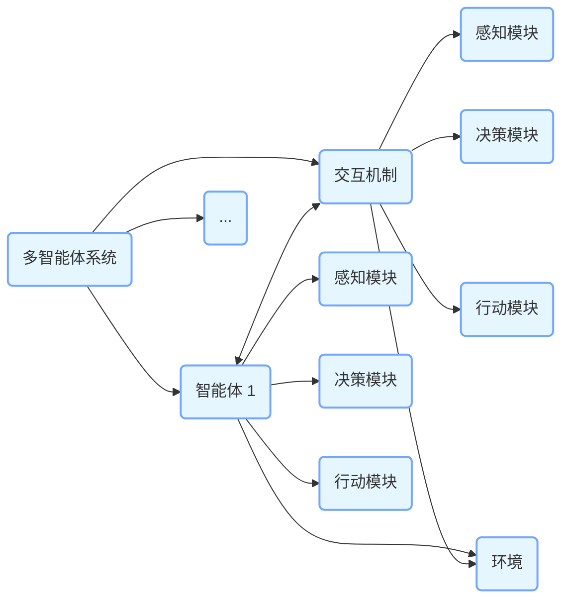

# 多智能体系统在识别行业转型和颠覆性创新中的作用

> 关键词：多智能体系统、行业转型、颠覆性创新、识别作用、人工智能

> 摘要：本文深入探讨了多智能体系统在识别行业转型和颠覆性创新方面的重要作用。首先介绍了相关背景知识，包括目的、预期读者等内容。接着阐述了多智能体系统的核心概念及其与行业转型和颠覆性创新的联系，详细讲解了核心算法原理和具体操作步骤，并给出了相应的数学模型和公式。通过项目实战案例展示了多智能体系统在实际中的应用，分析了其实际应用场景。同时推荐了相关的工具和资源，最后总结了未来发展趋势与挑战，并对常见问题进行了解答，为相关领域的研究和实践提供了全面的参考。

## 1. 背景介绍 
### 1.1 目的和范围
在当今快速发展的时代，行业转型和颠覆性创新不断涌现。准确识别这些变化对于企业、投资者和政策制定者至关重要。多智能体系统作为一种强大的建模和分析工具，能够模拟复杂的社会和经济系统。本文章的目的是深入探讨多智能体系统在识别行业转型和颠覆性创新方面的潜力和应用，涵盖了多智能体系统的基本原理、算法实现、实际案例以及相关工具资源等方面。

### 1.2 预期读者
本文的预期读者包括计算机科学、经济学、管理学等领域的研究人员，对行业趋势分析和创新管理感兴趣的企业管理人员，以及从事相关领域教学和学习的学生。

### 1.3 文档结构概述
本文首先介绍多智能体系统的背景知识，包括目的、读者和文档结构。然后阐述核心概念和联系，给出系统的原理和架构示意图。接着详细讲解核心算法原理和具体操作步骤，使用 Python 代码进行说明。之后介绍数学模型和公式，并举例说明。通过项目实战展示多智能体系统的应用，分析实际应用场景。推荐相关的工具和资源，最后总结未来发展趋势与挑战，解答常见问题，并提供扩展阅读和参考资料。

### 1.4 术语表
#### 1.4.1 核心术语定义
- **多智能体系统（Multi - Agent System，MAS）**：由多个智能体组成的系统，每个智能体具有一定的自主性和智能，能够感知环境、做出决策并与其他智能体进行交互。
- **行业转型**：指一个行业在技术、市场、商业模式等方面发生重大变化，导致行业结构和竞争格局的改变。
- **颠覆性创新**：是一种能够打破现有市场格局、创造新的市场和价值网络的创新形式。

#### 1.4.2 相关概念解释
- **智能体（Agent）**：可以是物理实体或软件程序，具有感知、决策和行动的能力。智能体能够根据自身的目标和环境信息做出自主决策，并采取相应的行动。
- **交互（Interaction）**：智能体之间通过某种通信机制进行信息交换和协作的过程。交互可以是直接的（如消息传递）或间接的（如通过环境变化）。

#### 1.4.3 缩略词列表
- **MAS**：Multi - Agent System（多智能体系统）

## 2. 核心概念与联系 

### 2.1 多智能体系统原理
多智能体系统由多个智能体组成，每个智能体具有一定的知识和能力，能够独立地感知环境、做出决策并采取行动。智能体之间通过交互来协调它们的行为，以实现共同的目标或解决复杂的问题。智能体的决策过程通常基于其内部的规则、模型或算法，同时也会考虑其他智能体的行为和环境的变化。

### 2.2 行业转型和颠覆性创新的特征
行业转型通常表现为技术的更新换代、市场需求的变化、商业模式的创新等。颠覆性创新则具有打破现有市场规则、创造新的市场需求和价值的特点。例如，互联网技术的发展导致了传统零售行业向电子商务的转型，共享经济模式的出现则是一种颠覆性创新，改变了交通、住宿等多个行业的格局。

### 2.3 多智能体系统与行业转型和颠覆性创新的联系
多智能体系统可以模拟行业中的各个参与者，如企业、消费者、政府等。通过设置智能体的行为规则和交互方式，可以模拟行业的动态变化过程。在这个过程中，多智能体系统可以捕捉到行业转型和颠覆性创新的迹象。例如，当某个智能体（企业）采用了新的技术或商业模式时，可能会引发其他智能体的响应，从而导致整个行业的结构发生变化。

### 2.4 核心概念原理和架构的文本示意图
```plaintext
多智能体系统
|-- 智能体 1
|   |-- 感知模块
|   |-- 决策模块
|   |-- 行动模块
|-- 智能体 2
|   |-- 感知模块
|   |-- 决策模块
|   |-- 行动模块
|--...
|-- 交互机制
|-- 环境
```

### 2.5 Mermaid 流程图


## 3. 核心算法原理 & 具体操作步骤 

### 3.1 核心算法原理
在多智能体系统中，常用的算法之一是基于规则的决策算法。每个智能体根据预先定义的规则来做出决策。例如，一个企业智能体可能根据市场需求、竞争对手的行为和自身的资源状况来决定是否进行技术创新。

以下是一个简单的基于规则的决策算法的 Python 实现：

```python
class Agent:
    def __init__(self, id, resources):
        self.id = id
        self.resources = resources

    def make_decision(self, market_demand, competitor_actions):
        # 简单规则：如果市场需求高且竞争对手没有创新，则进行创新
        if market_demand > 5 and not any(competitor_actions):
            if self.resources > 3:
                self.resources -= 3
                return "innovate"
            else:
                return "wait"
        else:
            return "wait"


# 创建智能体
agent1 = Agent(1, 5)
agent2 = Agent(2, 4)

# 模拟市场需求和竞争对手行为
market_demand = 7
competitor_actions = [False, False]

# 智能体做出决策
decision1 = agent1.make_decision(market_demand, competitor_actions)
decision2 = agent2.make_decision(market_demand, competitor_actions)

print(f"Agent 1 decision: {decision1}")
print(f"Agent 2 decision: {decision2}")
```

### 3.2 具体操作步骤
1. **定义智能体类**：确定智能体的属性和方法，如资源、决策函数等。
2. **初始化智能体**：为每个智能体分配初始资源和状态。
3. **设置环境参数**：如市场需求、竞争对手行为等。
4. **循环模拟**：在每个时间步，每个智能体根据环境信息和自身状态做出决策，并更新自身状态和环境。
5. **分析结果**：观察智能体的决策和行业的动态变化，识别行业转型和颠覆性创新的迹象。

## 4. 数学模型和公式 & 详细讲解 & 举例说明 

### 4.1 智能体决策模型
假设每个智能体 $i$ 有一个效用函数 $U_i$，用于评估不同决策的收益。智能体的决策目标是最大化其效用函数。

$$
U_i(d_i, s, a_{-i}) = f(d_i, s, a_{-i})
$$

其中，$d_i$ 是智能体 $i$ 的决策，$s$ 是环境状态，$a_{-i}$ 是其他智能体的行动。

### 4.2 环境状态更新模型
环境状态 $s$ 会随着智能体的行动而更新。假设环境状态的更新函数为 $g$：

$$
s_{t + 1} = g(s_t, a_1, a_2, \cdots, a_n)
$$

其中，$s_t$ 是时间步 $t$ 的环境状态，$a_1, a_2, \cdots, a_n$ 是所有智能体在时间步 $t$ 的行动。

### 4.3 举例说明
假设有两个智能体 $A$ 和 $B$，它们可以选择创新（$d = 1$）或不创新（$d = 0$）。环境状态 $s$ 表示市场需求，初始值为 $s_0 = 5$。

智能体 $A$ 的效用函数为：

$$
U_A(d_A, s, d_B) = 2d_A \times s - 3d_A
$$

智能体 $B$ 的效用函数为：

$$
U_B(d_B, s, d_A) = 2d_B \times s - 3d_B
$$

环境状态更新函数为：

$$
s_{t + 1} = s_t + d_A + d_B
$$

在初始时间步 $t = 0$，智能体 $A$ 和 $B$ 分别计算不同决策下的效用：

- 如果 $d_A = 0, d_B = 0$，则 $U_A(0, 5, 0) = 0$，$U_B(0, 5, 0) = 0$，$s_1 = 5$。
- 如果 $d_A = 1, d_B = 0$，则 $U_A(1, 5, 0) = 2\times1\times5 - 3\times1 = 7$，$U_B(0, 5, 1) = 0$，$s_1 = 6$。
- 如果 $d_A = 0, d_B = 1$，则 $U_A(0, 5, 1) = 0$，$U_B(1, 5, 0) = 2\times1\times5 - 3\times1 = 7$，$s_1 = 6$。
- 如果 $d_A = 1, d_B = 1$，则 $U_A(1, 5, 1) = 2\times1\times5 - 3\times1 = 7$，$U_B(1, 5, 1) = 2\times1\times5 - 3\times1 = 7$，$s_1 = 7$。

智能体 $A$ 和 $B$ 会根据计算结果选择使自己效用最大化的决策。

## 5. 项目实战：代码实际案例和详细解释说明 

### 5.1  开发环境搭建
- **操作系统**：推荐使用 Linux 或 macOS，也可以使用 Windows。
- **编程语言**：Python 3.x
- **开发工具**：可以使用 PyCharm、Jupyter Notebook 等。
- **安装依赖库**：使用 `pip` 安装必要的库，如 `numpy`、`matplotlib` 等。

```bash
pip install numpy matplotlib
```

### 5.2  源代码详细实现和代码解读
以下是一个更复杂的多智能体系统模拟行业转型的 Python 代码示例：

```python
import numpy as np
import matplotlib.pyplot as plt

# 定义智能体类
class Agent:
    def __init__(self, id, resources, innovation_threshold):
        self.id = id
        self.resources = resources
        self.innovation_threshold = innovation_threshold
        self.innovated = False

    def make_decision(self, market_demand):
        if market_demand > self.innovation_threshold and self.resources > 2:
            self.resources -= 2
            self.innovated = True
            return "innovate"
        else:
            return "wait"


# 定义环境类
class Environment:
    def __init__(self, initial_demand):
        self.market_demand = initial_demand

    def update_demand(self, innovation_count):
        # 创新会提高市场需求
        self.market_demand += 0.5 * innovation_count


# 模拟多智能体系统
def simulate(num_agents, initial_resources, innovation_threshold, initial_demand, num_steps):
    agents = [Agent(i, initial_resources, innovation_threshold) for i in range(num_agents)]
    environment = Environment(initial_demand)

    innovation_counts = []
    demand_history = []

    for step in range(num_steps):
        innovation_count = 0
        decisions = []
        for agent in agents:
            decision = agent.make_decision(environment.market_demand)
            decisions.append(decision)
            if decision == "innovate":
                innovation_count += 1

        environment.update_demand(innovation_count)
        innovation_counts.append(innovation_count)
        demand_history.append(environment.market_demand)

    return innovation_counts, demand_history


# 参数设置
num_agents = 10
initial_resources = 5
innovation_threshold = 3
initial_demand = 2
num_steps = 20

# 运行模拟
innovation_counts, demand_history = simulate(num_agents, initial_resources, innovation_threshold, initial_demand, num_steps)

# 绘制结果
plt.figure(figsize=(12, 6))
plt.subplot(1, 2, 1)
plt.plot(innovation_counts)
plt.title("Innovation Counts over Time")
plt.xlabel("Time Step")
plt.ylabel("Innovation Count")

plt.subplot(1, 2, 2)
plt.plot(demand_history)
plt.title("Market Demand over Time")
plt.xlabel("Time Step")
plt.ylabel("Market Demand")

plt.show()
```

### 5.3  代码解读与分析
- **智能体类（Agent）**：每个智能体有自己的资源和创新阈值。根据市场需求和自身资源状况，智能体决定是否进行创新。
- **环境类（Environment）**：模拟市场环境，市场需求会根据智能体的创新情况进行更新。
- **模拟函数（simulate）**：在每个时间步，每个智能体做出决策，环境根据创新情况更新市场需求。记录创新数量和市场需求的历史数据。
- **结果可视化**：使用 `matplotlib` 库绘制创新数量和市场需求随时间的变化曲线。

通过观察这些曲线，我们可以分析行业的动态变化，识别行业转型和颠覆性创新的迹象。例如，如果创新数量突然增加，市场需求也随之上升，可能意味着行业正在经历转型或出现了颠覆性创新。

## 6. 实际应用场景 
### 6.1 金融行业
在金融行业，多智能体系统可以模拟投资者、银行、监管机构等参与者的行为。通过分析智能体之间的交互和市场动态，识别金融市场的转型和颠覆性创新，如新型金融产品的出现、金融科技的应用等。例如，模拟投资者对区块链技术的接受程度和投资行为，预测加密货币市场的发展趋势。

### 6.2 医疗行业
多智能体系统可以模拟医院、药企、患者等参与者的行为。在医疗行业转型方面，如远程医疗、个性化医疗的发展，多智能体系统可以帮助分析不同参与者的决策和市场反应。例如，模拟药企在研发新药时考虑患者需求、医保政策和竞争对手的情况，预测新药的市场前景。

### 6.3 制造业
在制造业中，多智能体系统可以模拟企业、供应商、客户等的行为。分析智能制造、工业互联网等技术对行业的影响，识别制造业的转型趋势。例如，模拟企业采用智能制造技术后，对供应链、生产效率和市场竞争力的影响。

## 7. 工具和资源推荐
### 7.1 学习资源推荐
#### 7.1.1 书籍推荐
- 《多智能体系统：原理与编程》：全面介绍了多智能体系统的基本原理、算法和编程实现。
- 《复杂适应系统：社会生活计算模型引论》：探讨了复杂适应系统的概念，包括多智能体系统在社会科学中的应用。

#### 7.1.2 在线课程
- Coursera 上的“Multi - Agent Systems”课程：由知名教授授课，系统讲解多智能体系统的理论和实践。
- edX 上的“Artificial Intelligence: Multi - Agent Systems”课程：介绍了多智能体系统在人工智能领域的应用。

#### 7.1.3 技术博客和网站
- Agent - Based Modeling Network（ABM Network）：提供多智能体建模的最新研究成果和案例。
- Towards Data Science：有许多关于多智能体系统和数据分析的技术文章。

### 7.2 开发工具框架推荐
#### 7.2.1 IDE和编辑器
- PyCharm：功能强大的 Python 集成开发环境，适合开发多智能体系统的 Python 代码。
- Jupyter Notebook：交互式编程环境，方便进行代码测试和数据分析。

#### 7.2.2 调试和性能分析工具
- pdb：Python 自带的调试工具，用于调试多智能体系统的代码。
- cProfile：Python 的性能分析工具，可用于分析代码的运行时间和性能瓶颈。

#### 7.2.3 相关框架和库
- Mesa：Python 编写的多智能体建模框架，提供了丰富的工具和模型示例。
- Repast：一个跨平台的多智能体建模和仿真框架，支持多种编程语言。

### 7.3 相关论文著作推荐
#### 7.3.1 经典论文
- “Multi - Agent Systems: A Modern Approach to Distributed Artificial Intelligence”：介绍了多智能体系统的基本概念和理论框架。
- “Agent - Based Computational Economics: A Constructive Approach to Economic Theory”：探讨了多智能体系统在经济学中的应用。

#### 7.3.2 最新研究成果
- 可以在 IEEE Xplore、ACM Digital Library 等数据库中搜索关于多智能体系统在行业转型和颠覆性创新方面的最新研究论文。

#### 7.3.3 应用案例分析
- 一些行业报告和研究机构的网站会发布多智能体系统在不同行业的应用案例分析，如麦肯锡、波士顿咨询等。

## 8. 总结：未来发展趋势与挑战
### 8.1 未来发展趋势
- **与大数据和人工智能的融合**：多智能体系统可以结合大数据分析和人工智能技术，更准确地模拟和预测行业的发展趋势。例如，利用机器学习算法训练智能体的决策模型，提高决策的准确性和适应性。
- **跨学科应用**：多智能体系统将在更多的学科领域得到应用，如社会学、生态学、生物学等。通过模拟不同领域的复杂系统，解决跨学科的问题。
- **云平台和分布式计算**：随着云计算和分布式计算技术的发展，多智能体系统可以在大规模集群上运行，提高模拟的效率和规模。

### 8.2 挑战
- **模型的准确性和可靠性**：多智能体系统的模型需要准确地反映现实世界的复杂性，但由于现实世界的不确定性和多样性，模型的准确性和可靠性仍然是一个挑战。
- **计算资源的需求**：大规模的多智能体系统模拟需要大量的计算资源，如何在有限的资源下提高模拟的效率是一个亟待解决的问题。
- **伦理和法律问题**：多智能体系统的应用可能会涉及到伦理和法律问题，如智能体的责任界定、数据隐私保护等。

## 9. 附录：常见问题与解答
### 9.1 多智能体系统的开发难度大吗？
开发多智能体系统的难度取决于系统的规模和复杂度。对于简单的多智能体系统，使用 Python 等编程语言和现有的框架（如 Mesa）可以相对容易地实现。但对于大规模、复杂的系统，需要考虑更多的因素，如智能体的行为模型、交互机制、环境模拟等，开发难度会相应增加。

### 9.2 多智能体系统模拟的结果准确吗？
多智能体系统模拟的结果受到模型的准确性、参数设置和环境假设等因素的影响。虽然多智能体系统可以模拟复杂的系统行为，但它只是对现实世界的一种近似。因此，模拟结果需要结合实际情况进行分析和验证。

### 9.3 多智能体系统可以应用于哪些具体的行业？
多智能体系统可以应用于金融、医疗、制造业、交通、能源等多个行业。在不同的行业中，多智能体系统可以模拟不同的参与者和市场动态，帮助识别行业转型和颠覆性创新的迹象。

## 10. 扩展阅读 & 参考资料
### 10.1 扩展阅读
- 《人工智能：一种现代的方法》：全面介绍了人工智能的各个领域，包括多智能体系统。
- 《复杂系统理论基础》：深入探讨了复杂系统的理论和方法，为理解多智能体系统提供了理论支持。

### 10.2 参考资料
- 相关的学术期刊，如《Journal of Artificial Societies and Social Simulation》、《Autonomous Agents and Multi - Agent Systems》等。
- 行业报告和研究机构的网站，如 Gartner、Forrester 等。

作者：AI天才研究院/AI Genius Institute & 禅与计算机程序设计艺术 /Zen And The Art of Computer Programming