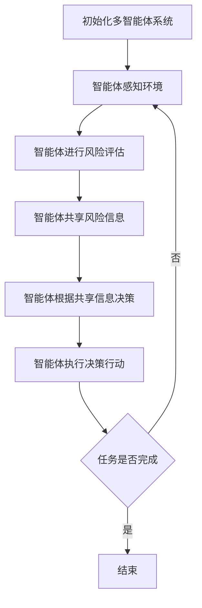

# 多智能体系统如何实现动态风险平衡

> 关键词：多智能体系统、动态风险平衡、风险评估、协作策略、分布式算法

> 摘要：本文围绕多智能体系统如何实现动态风险平衡展开深入探讨。首先介绍了多智能体系统和动态风险平衡的背景知识，包括目的、预期读者等。接着阐述了核心概念及联系，给出了相关原理和架构的示意图与流程图。详细讲解了实现动态风险平衡的核心算法原理，并用 Python 代码进行了说明。分析了其中涉及的数学模型和公式，还通过实际案例进行举例。在项目实战部分，搭建了开发环境，给出了源代码并进行解读。探讨了多智能体系统实现动态风险平衡的实际应用场景，推荐了学习资源、开发工具框架和相关论文著作。最后总结了未来发展趋势与挑战，并提供了常见问题解答和扩展阅读参考资料，旨在为相关领域的研究和实践提供全面且深入的指导。

## 1. 背景介绍 
### 1.1 目的和范围
多智能体系统（Multi - Agent System，MAS）由多个自主智能体组成，这些智能体通过交互和协作来完成特定任务。在许多实际应用场景中，如机器人协作、智能交通系统、金融市场交易等，多智能体系统会面临各种风险，而且这些风险会随着时间和环境的变化而动态改变。实现动态风险平衡的目的在于确保多智能体系统在整个运行过程中，各智能体所承担的风险能够在动态环境下保持相对均衡，避免个别智能体承担过高风险而导致系统整体性能下降甚至崩溃。

本文的范围涵盖了多智能体系统中动态风险平衡的基本概念、核心算法、数学模型、实际应用案例等方面，旨在为读者提供一个全面且深入的理解，帮助其掌握实现动态风险平衡的方法和技术。

### 1.2 预期读者
本文预期读者包括计算机科学、控制科学与工程、人工智能等相关专业的研究人员和学生，他们希望深入了解多智能体系统中动态风险平衡的理论和实践；也适用于从事机器人研发、智能交通系统设计、金融科技等领域的工程师和技术人员，为他们在实际项目中解决多智能体系统的风险平衡问题提供参考。

### 1.3 文档结构概述
本文首先介绍多智能体系统和动态风险平衡的背景知识，包括目的、预期读者和文档结构等。接着详细阐述核心概念及它们之间的联系，给出原理和架构的示意图与流程图。然后讲解实现动态风险平衡的核心算法原理，并通过 Python 代码进行具体说明。分析其中涉及的数学模型和公式，并用实际案例进行举例。在项目实战部分，搭建开发环境，给出源代码并进行解读。探讨实际应用场景，推荐相关的学习资源、开发工具框架和论文著作。最后总结未来发展趋势与挑战，提供常见问题解答和扩展阅读参考资料。

### 1.4 术语表
#### 1.4.1 核心术语定义
- **多智能体系统（Multi - Agent System，MAS）**：由多个自主智能体组成的系统，这些智能体具有感知、决策和行动的能力，能够通过交互和协作来完成特定任务。
- **智能体（Agent）**：具有自主性、反应性、社会性和主动性的实体，能够感知环境并根据自身的目标和知识进行决策和行动。
- **动态风险平衡**：在多智能体系统运行过程中，随着时间和环境的变化，各智能体所承担的风险能够保持相对均衡的状态。
- **风险评估**：对多智能体系统中各智能体面临的风险进行量化评估的过程。
- **协作策略**：多智能体系统中各智能体为实现共同目标而采取的协作方式和规则。

#### 1.4.2 相关概念解释
- **分布式系统**：多智能体系统通常是分布式系统的一种，其中各智能体分布在不同的物理位置或逻辑节点上，通过网络进行通信和协作。
- **自主决策**：智能体能够根据自身的感知和知识，独立地做出决策，而不需要外部的直接干预。
- **环境感知**：智能体通过传感器等设备获取周围环境的信息，以便做出合适的决策。

#### 1.4.3 缩略词列表
- MAS：Multi - Agent System（多智能体系统）

## 2. 核心概念与联系 
### 核心概念原理
在多智能体系统中，实现动态风险平衡的核心在于各智能体之间的协作和信息共享。每个智能体都有自己的目标和任务，同时也面临着不同类型的风险，如任务失败风险、资源耗尽风险、安全风险等。为了实现动态风险平衡，智能体需要实时评估自身和其他智能体的风险状况，并根据评估结果调整自己的行为和协作策略。

智能体的风险评估通常基于其自身的状态信息、任务要求和环境信息。例如，在一个机器人协作搬运任务中，一个机器人的风险可能与其当前的电量、负载重量、周围障碍物的分布等因素有关。通过对这些因素进行量化分析，可以得到该机器人面临的风险值。

各智能体之间通过通信网络进行信息交换，共享彼此的风险评估结果。基于这些共享信息，智能体可以采用不同的协作策略来调整风险分布。例如，当某个智能体发现自己承担的风险过高时，它可以向其他智能体请求协助，或者将部分任务转移给其他风险较低的智能体。

### 架构的文本示意图
```plaintext
+-----------------------+
| 多智能体系统           |
| +-------------------+ |
| | 智能体 1          | |
| | - 风险评估模块   | |
| | - 决策模块       | |
| | - 通信模块       | |
| +-------------------+ |
| +-------------------+ |
| | 智能体 2          | |
| | - 风险评估模块   | |
| | - 决策模块       | |
| | - 通信模块       | |
| +-------------------+ |
|...                   |
| +-------------------+ |
| | 智能体 n          | |
| | - 风险评估模块   | |
| | - 决策模块       | |
| | - 通信模块       | |
| +-------------------+ |
| +-------------------+ |
| | 通信网络          | |
| +-------------------+ |
+-----------------------+
```

### Mermaid 流程图


## 3. 核心算法原理 & 具体操作步骤 
### 核心算法原理
实现多智能体系统动态风险平衡的一种常见算法是基于分布式优化的算法。该算法的核心思想是将动态风险平衡问题转化为一个分布式优化问题，通过各智能体之间的局部信息交互和迭代更新，逐步找到最优的风险分配方案。

具体来说，每个智能体维护一个本地的风险函数，该函数表示该智能体所承担的风险与自身行为和其他智能体行为之间的关系。智能体通过与邻居智能体进行通信，交换彼此的风险信息和局部最优解。然后，根据这些信息更新自己的本地风险函数和局部最优解。经过多次迭代，各智能体的局部最优解将逐渐收敛到全局最优解，从而实现动态风险平衡。

### 具体操作步骤
1. **初始化**：每个智能体初始化自己的状态信息、风险函数和局部最优解。
2. **感知环境**：智能体通过传感器等设备感知周围环境的信息，更新自己的状态信息。
3. **风险评估**：根据自身的状态信息和任务要求，计算自己的风险值。
4. **信息共享**：智能体与邻居智能体进行通信，交换彼此的风险信息和局部最优解。
5. **局部优化**：根据共享的信息，更新自己的本地风险函数和局部最优解。
6. **迭代更新**：重复步骤 2 - 5，直到满足收敛条件。
7. **决策执行**：根据最终的局部最优解，智能体执行相应的决策行动。

### Python 源代码实现
```python
import numpy as np

# 定义智能体类
class Agent:
    def __init__(self, id, neighbors):
        self.id = id
        self.neighbors = neighbors
        self.state = np.random.rand(1)  # 初始化状态信息
        self.risk = 0  # 初始化风险值
        self.local_optimal = self.state  # 初始化局部最优解

    def sense_environment(self):
        # 模拟感知环境，更新状态信息
        self.state += np.random.randn(1) * 0.1

    def evaluate_risk(self):
        # 简单的风险评估函数，根据状态信息计算风险值
        self.risk = np.sum(self.state ** 2)

    def share_information(self, agents):
        # 与邻居智能体共享风险信息和局部最优解
        neighbor_risks = []
        neighbor_optimals = []
        for neighbor_id in self.neighbors:
            neighbor = agents[neighbor_id]
            neighbor_risks.append(neighbor.risk)
            neighbor_optimals.append(neighbor.local_optimal)
        return neighbor_risks, neighbor_optimals

    def local_optimization(self, neighbor_risks, neighbor_optimals):
        # 局部优化，更新局部最优解
        all_optimals = [self.local_optimal] + neighbor_optimals
        all_risks = [self.risk] + neighbor_risks
        min_index = np.argmin(all_risks)
        self.local_optimal = all_optimals[min_index]

    def execute_decision(self):
        # 执行决策行动，更新状态信息
        self.state = self.local_optimal

# 初始化多智能体系统
num_agents = 5
agents = []
neighbor_graph = {
    0: [1, 2],
    1: [0, 2, 3],
    2: [0, 1, 3, 4],
    3: [1, 2, 4],
    4: [2, 3]
}
for i in range(num_agents):
    agents.append(Agent(i, neighbor_graph[i]))

# 迭代更新
num_iterations = 10
for iteration in range(num_iterations):
    for agent in agents:
        agent.sense_environment()
        agent.evaluate_risk()
    for agent in agents:
        neighbor_risks, neighbor_optimals = agent.share_information(agents)
        agent.local_optimization(neighbor_risks, neighbor_optimals)
    for agent in agents:
        agent.execute_decision()

# 输出最终结果
for agent in agents:
    print(f"Agent {agent.id}: State = {agent.state}, Risk = {agent.risk}")
```

### 代码解释
1. **Agent 类**：定义了智能体的基本属性和方法，包括状态信息、风险值、局部最优解等。
2. **sense_environment 方法**：模拟智能体感知环境，更新自己的状态信息。
3. **evaluate_risk 方法**：根据状态信息计算智能体的风险值。
4. **share_information 方法**：与邻居智能体共享风险信息和局部最优解。
5. **local_optimization 方法**：根据共享的信息，更新自己的局部最优解。
6. **execute_decision 方法**：根据最终的局部最优解，执行相应的决策行动。
7. **主程序**：初始化多智能体系统，进行迭代更新，最终输出各智能体的状态信息和风险值。

## 4. 数学模型和公式 & 详细讲解 & 举例说明 
### 数学模型
假设多智能体系统中有 $n$ 个智能体，第 $i$ 个智能体的状态向量为 $\mathbf{x}_i \in \mathbb{R}^m$，风险函数为 $R_i(\mathbf{x}_1, \mathbf{x}_2, \cdots, \mathbf{x}_n)$，表示该智能体所承担的风险与所有智能体状态向量之间的关系。

动态风险平衡问题可以转化为一个分布式优化问题，目标是最小化所有智能体的风险总和，即：
$$
\min_{\mathbf{x}_1, \mathbf{x}_2, \cdots, \mathbf{x}_n} \sum_{i = 1}^{n} R_i(\mathbf{x}_1, \mathbf{x}_2, \cdots, \mathbf{x}_n)
$$

同时，每个智能体的状态向量需要满足一定的约束条件，例如：
$$
\mathbf{x}_i \in \Omega_i, \quad i = 1, 2, \cdots, n
$$
其中 $\Omega_i$ 是第 $i$ 个智能体的可行状态空间。

### 公式详细讲解
- **风险函数 $R_i(\mathbf{x}_1, \mathbf{x}_2, \cdots, \mathbf{x}_n)$**：该函数通常是一个非线性函数，具体形式取决于具体的应用场景。例如，在机器人协作搬运任务中，风险函数可以考虑机器人的电量、负载重量、运动速度等因素。
- **约束条件 $\mathbf{x}_i \in \Omega_i$**：可行状态空间 $\Omega_i$ 可以是一个凸集，例如一个超立方体或一个球体。约束条件的作用是确保智能体的状态在合理范围内，避免出现不合理的行为。

### 举例说明
假设在一个简单的多智能体系统中，有两个智能体，它们的状态向量分别为 $\mathbf{x}_1 = [x_{11}, x_{12}]^T$ 和 $\mathbf{x}_2 = [x_{21}, x_{22}]^T$。风险函数分别为：
$$
R_1(\mathbf{x}_1, \mathbf{x}_2) = (x_{11} - 1)^2 + (x_{12} - 2)^2 + 0.5(x_{21} - 3)^2 + 0.5(x_{22} - 4)^2
$$
$$
R_2(\mathbf{x}_1, \mathbf{x}_2) = (x_{21} - 3)^2 + (x_{22} - 4)^2 + 0.5(x_{11} - 1)^2 + 0.5(x_{12} - 2)^2
$$

可行状态空间分别为：
$$
\Omega_1 = \{ \mathbf{x}_1 \mid -1 \leq x_{11} \leq 1, -1 \leq x_{12} \leq 1 \}
$$
$$
\Omega_2 = \{ \mathbf{x}_2 \mid -2 \leq x_{21} \leq 2, -2 \leq x_{22} \leq 2 \}
$$

目标是最小化 $\sum_{i = 1}^{2} R_i(\mathbf{x}_1, \mathbf{x}_2)$，同时满足 $\mathbf{x}_1 \in \Omega_1$ 和 $\mathbf{x}_2 \in \Omega_2$。

可以使用拉格朗日乘子法或其他优化算法来求解这个优化问题，得到最优的状态向量 $\mathbf{x}_1^*$ 和 $\mathbf{x}_2^*$，从而实现动态风险平衡。

## 5. 项目实战：代码实际案例和详细解释说明 
### 5.1  开发环境搭建
#### 硬件环境
- 计算机：建议使用具有多核处理器和较大内存的计算机，以提高程序的运行效率。
- 网络设备：如果需要模拟多智能体之间的通信，需要一个稳定的网络环境。

#### 软件环境
- 操作系统：可以选择 Windows、Linux 或 macOS 等操作系统。
- Python 版本：建议使用 Python 3.7 及以上版本。
- 依赖库：需要安装 NumPy、Matplotlib 等常用的 Python 库，可以使用 pip 进行安装：
```sh
pip install numpy matplotlib
```

### 5.2  源代码详细实现和代码解读
```python
import numpy as np
import matplotlib.pyplot as plt

# 定义智能体类
class Agent:
    def __init__(self, id, neighbors, initial_state):
        self.id = id
        self.neighbors = neighbors
        self.state = initial_state
        self.risk = 0
        self.local_optimal = self.state
        self.history_states = [self.state]

    def sense_environment(self):
        # 模拟感知环境，添加随机噪声
        noise = np.random.randn(1) * 0.1
        self.state += noise
        self.history_states.append(self.state)

    def evaluate_risk(self):
        # 简单的风险评估函数，根据状态计算风险
        self.risk = np.abs(self.state)

    def share_information(self, agents):
        neighbor_risks = []
        neighbor_optimals = []
        for neighbor_id in self.neighbors:
            neighbor = agents[neighbor_id]
            neighbor_risks.append(neighbor.risk)
            neighbor_optimals.append(neighbor.local_optimal)
        return neighbor_risks, neighbor_optimals

    def local_optimization(self, neighbor_risks, neighbor_optimals):
        all_optimals = [self.local_optimal] + neighbor_optimals
        all_risks = [self.risk] + neighbor_risks
        min_index = np.argmin(all_risks)
        self.local_optimal = all_optimals[min_index]

    def execute_decision(self):
        self.state = self.local_optimal
        self.history_states[-1] = self.state

# 初始化多智能体系统
num_agents = 3
agents = []
neighbor_graph = {
    0: [1, 2],
    1: [0, 2],
    2: [0, 1]
}
initial_states = [np.random.rand(1) for _ in range(num_agents)]
for i in range(num_agents):
    agents.append(Agent(i, neighbor_graph[i], initial_states[i]))

# 迭代更新
num_iterations = 20
for iteration in range(num_iterations):
    for agent in agents:
        agent.sense_environment()
        agent.evaluate_risk()
    for agent in agents:
        neighbor_risks, neighbor_optimals = agent.share_information(agents)
        agent.local_optimization(neighbor_risks, neighbor_optimals)
    for agent in agents:
        agent.execute_decision()

# 绘制各智能体的状态变化曲线
plt.figure(figsize=(10, 6))
for agent in agents:
    plt.plot(agent.history_states, label=f"Agent {agent.id}")
plt.xlabel("Iteration")
plt.ylabel("State")
plt.title("State Evolution of Agents")
plt.legend()
plt.grid(True)
plt.show()
```

### 代码解读与分析
1. **Agent 类**：
    - `__init__` 方法：初始化智能体的基本属性，包括 ID、邻居列表、初始状态、风险值、局部最优解和历史状态列表。
    - `sense_environment` 方法：模拟智能体感知环境，通过添加随机噪声来更新状态信息，并记录历史状态。
    - `evaluate_risk` 方法：根据当前状态计算智能体的风险值，这里使用绝对值作为风险评估函数。
    - `share_information` 方法：与邻居智能体共享风险信息和局部最优解。
    - `local_optimization` 方法：根据共享的信息，选择风险最小的局部最优解。
    - `execute_decision` 方法：根据最终的局部最优解，更新智能体的状态信息。

2. **主程序**：
    - 初始化多智能体系统，包括智能体的数量、邻居关系和初始状态。
    - 进行迭代更新，每个迭代步骤包括感知环境、风险评估、信息共享、局部优化和决策执行。
    - 绘制各智能体的状态变化曲线，直观展示动态风险平衡的过程。

通过这个项目实战，我们可以看到多智能体系统如何通过信息共享和局部优化来实现动态风险平衡，并且可以观察到各智能体的状态在迭代过程中的变化情况。

## 6. 实际应用场景 
### 机器人协作任务
在机器人协作搬运、搜索救援等任务中，多个机器人组成一个多智能体系统。每个机器人面临着不同的风险，如电量不足、碰撞风险、任务失败风险等。通过实现动态风险平衡，机器人可以根据自身和其他机器人的风险状况，合理分配任务和资源，避免个别机器人承担过高风险。例如，当一个机器人电量较低时，它可以将部分搬运任务转移给其他电量充足的机器人，从而保证整个任务的顺利完成。

### 智能交通系统
在智能交通系统中，车辆可以看作是智能体。车辆在行驶过程中面临着交通拥堵、交通事故等风险。通过车辆之间的信息共享和协作，可以实现动态风险平衡。例如，当某条道路出现拥堵时，车辆可以根据其他车辆提供的信息，选择风险较低的路线行驶，从而缓解交通拥堵，提高整个交通系统的效率。

### 金融市场交易
在金融市场中，多个投资者或交易机构可以看作是智能体。每个投资者面临着市场波动、投资损失等风险。通过信息共享和协作，投资者可以根据其他投资者的风险状况，调整自己的投资策略，实现动态风险平衡。例如，当某个投资者发现自己的投资组合风险过高时，他可以参考其他投资者的投资策略，进行适当的调整，降低风险。

### 物联网系统
在物联网系统中，大量的传感器节点和设备组成一个多智能体系统。这些节点和设备面临着能量耗尽、数据传输失败等风险。通过节点之间的协作和信息共享，可以实现动态风险平衡。例如，当一个传感器节点能量较低时，它可以将部分数据传输任务转移给其他能量充足的节点，从而延长整个物联网系统的使用寿命。

## 7. 工具和资源推荐
### 7.1 学习资源推荐
#### 7.1.1 书籍推荐
- 《多智能体系统：原理与编程》：本书全面介绍了多智能体系统的基本原理、设计方法和编程技术，是学习多智能体系统的经典教材。
- 《人工智能：一种现代方法》：涵盖了人工智能的各个领域，包括多智能体系统，对多智能体系统的理论和应用进行了深入探讨。
- 《分布式优化与统计学习中的近似消息传递》：介绍了分布式优化的理论和算法，对于理解多智能体系统中动态风险平衡的算法原理有很大帮助。

#### 7.1.2 在线课程
- Coursera 上的“Multi - Agent Systems”课程：由知名教授授课，系统介绍了多智能体系统的基本概念、模型和算法。
- edX 上的“Artificial Intelligence”课程：涵盖了人工智能的多个方面，包括多智能体系统，课程内容丰富，讲解详细。

#### 7.1.3 技术博客和网站
- AI Stack Exchange：一个专门讨论人工智能相关问题的问答社区，其中有很多关于多智能体系统的讨论和解答。
- Towards Data Science：一个数据科学和人工智能领域的技术博客平台，经常发布关于多智能体系统的最新研究成果和实践经验。

### 7.2 开发工具框架推荐
#### 7.2.1 IDE和编辑器
- PyCharm：一款专业的 Python 集成开发环境，具有强大的代码编辑、调试和分析功能，适合开发多智能体系统的 Python 代码。
- Visual Studio Code：一款轻量级的代码编辑器，支持多种编程语言，具有丰富的插件扩展功能，可以方便地进行多智能体系统的开发。

#### 7.2.2 调试和性能分析工具
- PDB：Python 自带的调试器，可以帮助开发者在代码运行过程中进行调试，查找问题。
- cProfile：Python 的性能分析工具，可以分析代码的运行时间和资源消耗情况，帮助开发者优化代码性能。

#### 7.2.3 相关框架和库
- Mesa：一个用于构建基于代理的模型的 Python 框架，提供了丰富的工具和接口，方便开发者实现多智能体系统。
- NetworkX：一个用于创建、操作和研究复杂网络的 Python 库，可以用于模拟多智能体系统中智能体之间的通信网络。

### 7.3 相关论文著作推荐
#### 7.3.1 经典论文
- “Distributed Optimization and Statistical Learning via the Alternating Direction Method of Multipliers”：介绍了交替方向乘子法（ADMM）在分布式优化中的应用，是分布式优化领域的经典论文。
- “Multi - Agent Systems: A Modern Approach to Distributed Artificial Intelligence”：对多智能体系统的理论和应用进行了系统的阐述，是多智能体系统领域的奠基性论文之一。

#### 7.3.2 最新研究成果
- 关注 IEEE Transactions on Intelligent Systems、Artificial Intelligence 等顶级学术期刊，这些期刊经常发表关于多智能体系统的最新研究成果。
- 参加国际多智能体系统会议（International Conference on Autonomous Agents and Multi - Agent Systems，AAMAS），可以了解多智能体系统领域的最新研究动态。

#### 7.3.3 应用案例分析
- 研究一些实际应用案例的论文，如机器人协作、智能交通系统等领域的应用案例，学习如何将多智能体系统的理论和技术应用到实际问题中。

## 8. 总结：未来发展趋势与挑战
### 未来发展趋势
- **与其他技术的融合**：多智能体系统将与人工智能的其他领域，如深度学习、强化学习等进行更深入的融合。例如，利用深度学习技术提高智能体的感知和决策能力，利用强化学习技术优化智能体的协作策略，从而实现更高效的动态风险平衡。
- **大规模多智能体系统**：随着物联网、云计算等技术的发展，多智能体系统的规模将越来越大。未来的多智能体系统可能包含成千上万个智能体，如何在大规模系统中实现高效的动态风险平衡将是一个重要的研究方向。
- **跨领域应用**：多智能体系统的应用将不再局限于传统的领域，如机器人、交通等，还将拓展到医疗、教育、能源等更多领域。例如，在医疗领域，多智能体系统可以用于医疗资源的分配和患者的治疗决策，实现医疗风险的动态平衡。

### 挑战
- **通信与协调**：在多智能体系统中，智能体之间的通信和协调是实现动态风险平衡的关键。然而，随着智能体数量的增加和通信环境的复杂，通信延迟、丢包等问题将变得更加严重，如何保证智能体之间的高效通信和协调是一个挑战。
- **不确定性处理**：多智能体系统面临着各种不确定性，如环境的不确定性、其他智能体行为的不确定性等。如何在不确定性环境下准确评估风险，并实现动态风险平衡是一个亟待解决的问题。
- **安全与隐私**：在多智能体系统中，智能体之间需要共享大量的信息，这涉及到安全和隐私问题。如何保证信息的安全性和隐私性，防止信息泄露和恶意攻击，是多智能体系统实现动态风险平衡的重要挑战。

## 9. 附录：常见问题与解答
### 问题 1：多智能体系统中智能体的数量对动态风险平衡有什么影响？
解答：智能体的数量增加会使系统的复杂度增加。一方面，更多的智能体可以提供更多的资源和能力，有助于更好地实现风险分散；另一方面，智能体数量的增加会导致通信和协调的难度增大，可能会影响信息共享的效率，从而对动态风险平衡产生一定的挑战。在大规模多智能体系统中，需要采用更高效的分布式算法和通信协议来保证动态风险平衡的实现。

### 问题 2：如何选择合适的风险评估函数？
解答：选择合适的风险评估函数需要考虑具体的应用场景和任务要求。一般来说，风险评估函数应该能够反映智能体面临的主要风险因素，如任务失败概率、资源消耗情况、安全隐患等。可以通过分析历史数据、专家经验等方法来确定风险评估函数的形式和参数。同时，风险评估函数应该具有可量化、可比较的特点，以便于智能体之间进行信息共享和决策。

### 问题 3：多智能体系统中智能体之间的通信故障会对动态风险平衡产生什么影响？
解答：通信故障会导致智能体之间的信息共享不及时或不准确，从而影响智能体的决策和协作。如果部分智能体无法获取其他智能体的风险信息，它们可能会做出不合理的决策，导致风险分布不均衡。严重的通信故障甚至可能导致系统无法正常运行。为了应对通信故障，可以采用冗余通信、错误检测和纠正等技术，提高通信的可靠性。

### 问题 4：如何验证多智能体系统实现了动态风险平衡？
解答：可以通过以下几种方法来验证多智能体系统是否实现了动态风险平衡：
- **风险指标分析**：计算各智能体的风险值，并分析它们在不同时间点的变化情况。如果各智能体的风险值在动态环境下保持相对稳定且差异较小，则说明系统实现了动态风险平衡。
- **任务完成情况评估**：观察系统的任务完成情况，如果系统能够高效、稳定地完成任务，且没有出现个别智能体过度劳累或失败的情况，则说明动态风险平衡得到了较好的实现。
- **模拟实验和对比分析**：通过模拟实验，比较不同情况下系统的性能，如有无动态风险平衡机制的情况。如果有动态风险平衡机制的系统表现更优，则说明该机制起到了作用。

## 10. 扩展阅读 & 参考资料
### 扩展阅读
- 研究多智能体系统中的博弈论方法，了解智能体之间的策略交互和竞争关系。
- 学习强化学习在多智能体系统中的应用，探索如何通过强化学习算法优化智能体的协作策略。
- 关注区块链技术与多智能体系统的结合，研究如何利用区块链的特性提高多智能体系统的安全性和可靠性。

### 参考资料
- Shoham, Yoav, and Kevin Leyton - Brown. Multiagent Systems: Algorithmic, Game - Theoretic, and Logical Foundations. Cambridge University Press, 2008.
- Sutton, Richard S., and Andrew G. Barto. Reinforcement Learning: An Introduction. MIT Press, 2018.
- Boyd, Stephen, et al. "Distributed optimization and statistical learning via the alternating direction method of multipliers." Foundations and Trends® in Machine Learning 3.1 (2011): 1 - 122.

作者：AI天才研究院/AI Genius Institute & 禅与计算机程序设计艺术 /Zen And The Art of Computer Programming