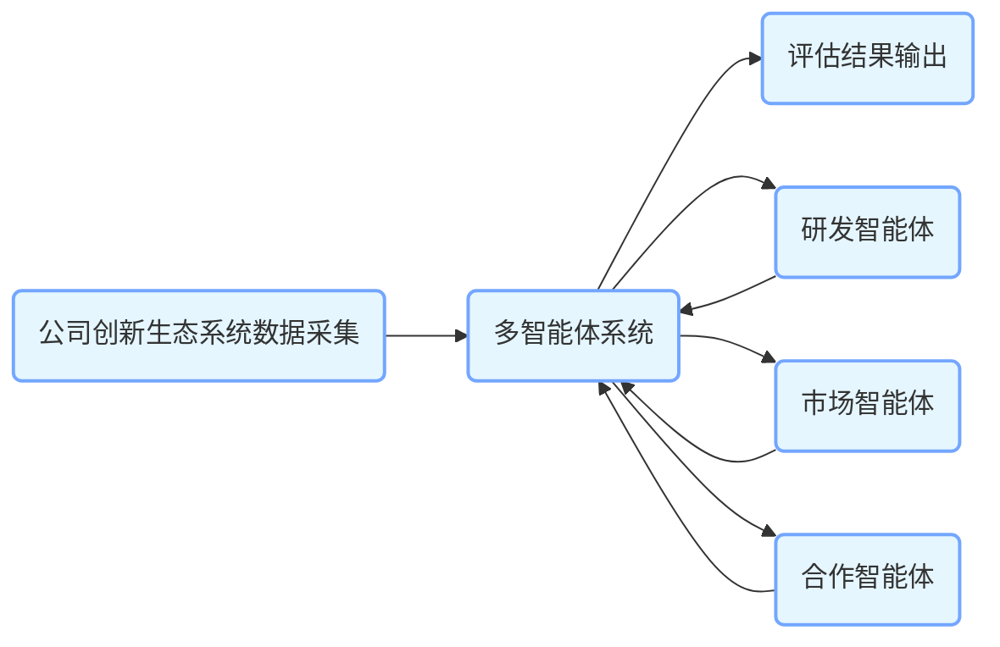

# 多智能体系统如何评估公司的创新生态系统

> 关键词：多智能体系统、公司创新生态系统、评估方法、数学模型、实际应用

> 摘要：本文深入探讨了多智能体系统在评估公司创新生态系统中的应用。首先介绍了研究的背景、目的、预期读者等内容，阐述了多智能体系统和公司创新生态系统的核心概念及其联系。详细讲解了核心算法原理和具体操作步骤，给出了相关数学模型和公式并举例说明。通过项目实战展示了代码的实际案例和详细解释。分析了多智能体系统评估公司创新生态系统的实际应用场景，推荐了学习资源、开发工具框架以及相关论文著作。最后总结了未来发展趋势与挑战，提供了常见问题解答和扩展阅读参考资料。

## 1. 背景介绍 
### 1.1 目的和范围
随着市场竞争的加剧，公司的创新能力成为其生存和发展的关键因素。创新生态系统涵盖了公司内部的各个部门、合作伙伴、客户等多个主体，以及技术、市场、文化等多个方面。多智能体系统作为一种模拟复杂系统中多个自主个体交互行为的技术手段，能够为评估公司的创新生态系统提供新的视角和方法。

本文的目的是探讨如何利用多智能体系统对公司的创新生态系统进行全面、客观的评估。具体范围包括多智能体系统的原理和架构、评估公司创新生态系统的核心算法、相关数学模型，以及通过实际案例展示如何应用多智能体系统进行评估。

### 1.2 预期读者
本文的预期读者包括对人工智能、创新管理等领域感兴趣的研究人员、企业管理人员、技术开发者等。对于研究人员，本文可以为其在多智能体系统和创新生态系统评估方面的研究提供参考；对于企业管理人员，有助于其了解如何利用多智能体系统评估公司的创新生态系统，从而制定更有效的创新战略；对于技术开发者，可作为开发相关评估系统的技术指南。

### 1.3 文档结构概述
本文将按照以下结构进行阐述：首先介绍多智能体系统和公司创新生态系统的核心概念及其联系；接着详细讲解核心算法原理和具体操作步骤，并给出相关数学模型和公式；然后通过项目实战展示代码的实际案例和详细解释；分析多智能体系统评估公司创新生态系统的实际应用场景；推荐相关的学习资源、开发工具框架以及论文著作；最后总结未来发展趋势与挑战，提供常见问题解答和扩展阅读参考资料。

### 1.4 术语表
#### 1.4.1 核心术语定义
- **多智能体系统（Multi - Agent System, MAS）**：由多个自主的智能体组成的系统，这些智能体能够感知环境、进行决策并采取行动，通过相互交互来实现系统的整体目标。
- **公司创新生态系统（Corporate Innovation Ecosystem）**：指公司内部和外部的各种创新相关主体（如员工、合作伙伴、客户等）以及创新资源（如技术、资金、知识等）相互作用、相互影响所形成的一个复杂系统。
- **智能体（Agent）**：具有自主性、反应性、社会性等特征的实体，能够在一定环境中感知信息、做出决策并执行相应的动作。

#### 1.4.2 相关概念解释
- **创新能力**：公司在产品、技术、管理等方面进行创新的能力，包括创新的速度、质量和持续性等方面。
- **协同创新**：不同创新主体之间通过合作、交流等方式共同开展创新活动，实现资源共享、优势互补，提高创新效率和效果。
- **生态系统健康度**：衡量公司创新生态系统的整体运行状况和可持续发展能力的指标，包括创新活力、创新资源配置效率、创新主体之间的协作程度等方面。

#### 1.4.3 缩略词列表
- MAS：Multi - Agent System（多智能体系统）
- AI：Artificial Intelligence（人工智能）

## 2. 核心概念与联系 
### 核心概念原理
#### 多智能体系统原理
多智能体系统的核心思想是将复杂的系统分解为多个相对简单的智能体，每个智能体具有一定的自主性和智能性，能够独立地感知环境、做出决策并采取行动。智能体之间通过通信和交互来协调彼此的行为，以实现系统的整体目标。

智能体通常由以下几个部分组成：
- **感知模块**：用于感知环境中的信息，如其他智能体的状态、环境的变化等。
- **决策模块**：根据感知到的信息，运用一定的算法和规则进行决策，确定下一步的行动。
- **行动模块**：执行决策模块所确定的行动，对环境产生影响。

#### 公司创新生态系统原理
公司创新生态系统是一个由多个创新主体和创新资源相互作用形成的复杂系统。创新主体包括公司内部的研发部门、市场营销部门、生产部门等，以及外部的合作伙伴、客户等。创新资源包括技术、资金、知识、人才等。

在公司创新生态系统中，各个创新主体之间通过合作、竞争等方式进行交互，创新资源在不同主体之间流动和配置。创新生态系统的健康运行依赖于创新主体之间的良好协作、创新资源的有效配置以及对市场变化的快速响应。

### 架构的文本示意图
以下是多智能体系统评估公司创新生态系统的架构文本描述：

整个架构主要由三部分组成：多智能体系统、公司创新生态系统数据采集模块和评估结果输出模块。

多智能体系统包含多个智能体，每个智能体代表公司创新生态系统中的一个主体，如研发智能体、市场智能体、合作智能体等。这些智能体通过通信机制进行交互，分享信息和协调行动。

公司创新生态系统数据采集模块负责收集与创新生态系统相关的数据，包括创新项目的进展情况、创新资源的投入和使用情况、创新主体之间的协作关系等。采集到的数据将作为多智能体系统的输入。

评估结果输出模块根据多智能体系统的计算和分析结果，生成公司创新生态系统的评估报告，包括创新能力评估、生态系统健康度评估等。

### Mermaid 流程图


该流程图展示了多智能体系统评估公司创新生态系统的主要流程。首先进行公司创新生态系统数据的采集，采集到的数据输入到多智能体系统中。多智能体系统由多个智能体组成，智能体之间相互交互。最后，多智能体系统输出评估结果。

## 3. 核心算法原理 & 具体操作步骤 
### 核心算法原理
在多智能体系统评估公司创新生态系统中，我们可以采用基于强化学习的算法。强化学习是一种机器学习方法，智能体通过与环境进行交互，根据环境反馈的奖励信号来学习最优的行为策略。

具体来说，每个智能体在感知到环境信息后，会根据当前的策略选择一个行动。环境会根据智能体的行动给予相应的奖励或惩罚，智能体根据这个奖励信号来调整自己的策略，以最大化长期的累积奖励。

在评估公司创新生态系统时，我们可以将创新生态系统看作环境，每个智能体代表一个创新主体。智能体的行动可以是创新项目的选择、资源的分配等，奖励信号可以根据创新项目的成果、资源的利用效率等因素来确定。

### Python 源代码实现
```python
import numpy as np

# 定义智能体类
class Agent:
    def __init__(self, num_actions, learning_rate=0.1, discount_factor=0.9):
        self.num_actions = num_actions
        self.learning_rate = learning_rate
        self.discount_factor = discount_factor
        # 初始化 Q 表
        self.q_table = np.zeros((1, num_actions))

    def choose_action(self, state):
        # 根据 Q 表选择行动
        if np.random.uniform(0, 1) < 0.1:
            # 以 10% 的概率进行随机探索
            action = np.random.choice(self.num_actions)
        else:
            # 选择 Q 值最大的行动
            action = np.argmax(self.q_table[state, :])
        return action

    def learn(self, state, action, reward, next_state):
        # 更新 Q 表
        q_predict = self.q_table[state, action]
        q_target = reward + self.discount_factor * np.max(self.q_table[next_state, :])
        self.q_table[state, action] += self.learning_rate * (q_target - q_predict)

# 定义环境类
class InnovationEcosystem:
    def __init__(self):
        self.state = 0
        self.num_actions = 3  # 假设有 3 种行动

    def step(self, action):
        # 模拟环境的反馈
        if action == 0:
            reward = 1
        elif action == 1:
            reward = -1
        else:
            reward = 0
        next_state = self.state
        done = False
        return next_state, reward, done

# 主程序
if __name__ == "__main__":
    env = InnovationEcosystem()
    agent = Agent(num_actions=env.num_actions)

    num_episodes = 1000
    for episode in range(num_episodes):
        state = env.state
        done = False
        while not done:
            action = agent.choose_action(state)
            next_state, reward, done = env.step(action)
            agent.learn(state, action, reward, next_state)
            state = next_state

    print("训练完成，最终 Q 表：", agent.q_table)
```
### 具体操作步骤
1. **初始化**：创建智能体和环境对象，初始化智能体的 Q 表。
2. **训练过程**：
    - 对于每个训练回合（episode）：
        - 重置环境状态。
        - 循环直到回合结束：
            - 智能体根据当前状态选择一个行动。
            - 环境根据智能体的行动给出反馈，包括下一个状态、奖励和是否结束的标志。
            - 智能体根据奖励信号更新 Q 表。
            - 更新当前状态为下一个状态。
3. **评估**：训练完成后，根据智能体的 Q 表评估其在创新生态系统中的表现。

## 4. 数学模型和公式 & 详细讲解 & 举例说明 
### 数学模型
在基于强化学习的多智能体系统评估公司创新生态系统中，核心的数学模型是 Q - learning 算法。Q - learning 算法通过不断更新 Q 表来学习最优的行为策略。

### 公式
Q - learning 算法的更新公式为：

$$Q(s_t, a_t) \leftarrow Q(s_t, a_t) + \alpha [r_{t + 1} + \gamma \max_{a} Q(s_{t + 1}, a) - Q(s_t, a_t)]$$

其中：
- $Q(s_t, a_t)$ 表示在状态 $s_t$ 下采取行动 $a_t$ 的 Q 值。
- $\alpha$ 是学习率，控制每次更新的步长。
- $r_{t + 1}$ 是在状态 $s_t$ 采取行动 $a_t$ 后获得的即时奖励。
- $\gamma$ 是折扣因子，用于权衡即时奖励和未来奖励的重要性。
- $s_{t + 1}$ 是采取行动 $a_t$ 后转移到的下一个状态。

### 详细讲解
Q - learning 算法的核心思想是通过不断地试错来学习最优的行为策略。智能体在每个状态下选择一个行动，根据环境的反馈获得奖励，然后根据奖励信号更新 Q 表。更新的目标是使得 Q 值能够反映在某个状态下采取某个行动的长期累积奖励。

学习率 $\alpha$ 控制了每次更新的幅度。如果 $\alpha$ 较大，智能体能够快速地适应环境的变化，但可能会导致学习不稳定；如果 $\alpha$ 较小，学习过程会比较缓慢，但更加稳定。

折扣因子 $\gamma$ 用于权衡即时奖励和未来奖励的重要性。如果 $\gamma$ 接近 1，智能体更注重未来的长期奖励；如果 $\gamma$ 接近 0，智能体更关注即时奖励。

### 举例说明
假设一个智能体在创新生态系统中有两个状态 $s_1$ 和 $s_2$，每个状态下有两个行动 $a_1$ 和 $a_2$。初始时，Q 表如下：

| 状态 | $a_1$ | $a_2$ |
| ---- | ---- | ---- |
| $s_1$ | 0 | 0 |
| $s_2$ | 0 | 0 |

智能体当前处于状态 $s_1$，选择了行动 $a_1$，获得即时奖励 $r = 1$，转移到状态 $s_2$。假设学习率 $\alpha = 0.1$，折扣因子 $\gamma = 0.9$。

根据 Q - learning 算法的更新公式，$Q(s_1, a_1)$ 的更新过程如下：

$Q(s_1, a_1) \leftarrow Q(s_1, a_1) + \alpha [r + \gamma \max_{a} Q(s_2, a) - Q(s_1, a_1)]$

由于 $Q(s_2, a_1) = Q(s_2, a_2) = 0$，$\max_{a} Q(s_2, a) = 0$，则：

$Q(s_1, a_1) \leftarrow 0 + 0.1 [1 + 0.9 \times 0 - 0] = 0.1$

更新后的 Q 表如下：

| 状态 | $a_1$ | $a_2$ |
| ---- | ---- | ---- |
| $s_1$ | 0.1 | 0 |
| $s_2$ | 0 | 0 |

## 5. 项目实战：代码实际案例和详细解释说明 
### 5.1  开发环境搭建
要运行上述代码，需要安装 Python 环境。建议使用 Python 3.6 及以上版本。可以从 Python 官方网站（https://www.python.org/downloads/）下载并安装。

同时，代码中使用了 `numpy` 库，需要安装该库。可以使用以下命令进行安装：

```sh
pip install numpy
```

### 5.2  源代码详细实现和代码解读
```python
import numpy as np

# 定义智能体类
class Agent:
    def __init__(self, num_actions, learning_rate=0.1, discount_factor=0.9):
        self.num_actions = num_actions
        self.learning_rate = learning_rate
        self.discount_factor = discount_factor
        # 初始化 Q 表
        self.q_table = np.zeros((1, num_actions))

    def choose_action(self, state):
        # 根据 Q 表选择行动
        if np.random.uniform(0, 1) < 0.1:
            # 以 10% 的概率进行随机探索
            action = np.random.choice(self.num_actions)
        else:
            # 选择 Q 值最大的行动
            action = np.argmax(self.q_table[state, :])
        return action

    def learn(self, state, action, reward, next_state):
        # 更新 Q 表
        q_predict = self.q_table[state, action]
        q_target = reward + self.discount_factor * np.max(self.q_table[next_state, :])
        self.q_table[state, action] += self.learning_rate * (q_target - q_predict)

# 定义环境类
class InnovationEcosystem:
    def __init__(self):
        self.state = 0
        self.num_actions = 3  # 假设有 3 种行动

    def step(self, action):
        # 模拟环境的反馈
        if action == 0:
            reward = 1
        elif action == 1:
            reward = -1
        else:
            reward = 0
        next_state = self.state
        done = False
        return next_state, reward, done

# 主程序
if __name__ == "__main__":
    env = InnovationEcosystem()
    agent = Agent(num_actions=env.num_actions)

    num_episodes = 1000
    for episode in range(num_episodes):
        state = env.state
        done = False
        while not done:
            action = agent.choose_action(state)
            next_state, reward, done = env.step(action)
            agent.learn(state, action, reward, next_state)
            state = next_state

    print("训练完成，最终 Q 表：", agent.q_table)
```

### 代码解读与分析
#### 智能体类 `Agent`
- `__init__` 方法：初始化智能体的参数，包括行动数量、学习率、折扣因子，并初始化 Q 表。
- `choose_action` 方法：根据当前状态选择一个行动。以 10% 的概率进行随机探索，以 90% 的概率选择 Q 值最大的行动。
- `learn` 方法：根据环境的反馈更新 Q 表，使用 Q - learning 算法的更新公式。

#### 环境类 `InnovationEcosystem`
- `__init__` 方法：初始化环境的状态和行动数量。
- `step` 方法：根据智能体的行动给出反馈，包括下一个状态、奖励和是否结束的标志。在这个简单的例子中，状态不发生变化，奖励根据行动的不同而不同。

#### 主程序
- 创建环境和智能体对象。
- 进行 1000 个训练回合，每个回合中智能体不断与环境交互，更新 Q 表。
- 训练完成后，打印最终的 Q 表。

通过这个项目实战，我们可以看到如何使用多智能体系统（这里简化为一个智能体）来模拟和评估公司创新生态系统中的创新决策过程。

## 6. 实际应用场景 
### 创新战略制定
公司可以利用多智能体系统评估创新生态系统，了解不同创新主体的优势和劣势，以及创新资源的配置情况。根据评估结果，制定更加合理的创新战略，如确定重点创新领域、优化创新资源分配等。

### 合作伙伴选择
在选择合作伙伴时，多智能体系统可以模拟不同合作伙伴与公司内部创新主体之间的协作效果，评估合作对公司创新生态系统的影响。从而选择最适合的合作伙伴，提高协同创新的效率。

### 创新项目评估
对于公司内部的创新项目，多智能体系统可以实时评估项目的进展情况、风险程度和预期收益。根据评估结果，及时调整项目的资源投入和方向，确保项目的顺利进行。

### 创新生态系统优化
通过持续监测和评估公司的创新生态系统，多智能体系统可以发现生态系统中存在的问题和瓶颈，如创新主体之间的协作不畅、创新资源的浪费等。然后提出针对性的优化建议，促进创新生态系统的健康发展。

## 7. 工具和资源推荐
### 7.1 学习资源推荐
#### 7.1.1 书籍推荐
- 《多智能体系统：原理与编程》：全面介绍了多智能体系统的基本原理、算法和编程实现，适合初学者系统学习多智能体系统的知识。
- 《创新生态系统：理论、实践与案例》：深入探讨了创新生态系统的概念、理论和实际应用案例，有助于读者理解公司创新生态系统的内涵和运作机制。
- 《强化学习：原理与Python实现》：详细讲解了强化学习的基本原理和算法，并通过 Python 代码进行实现，对于理解多智能体系统中使用的强化学习算法非常有帮助。

#### 7.1.2 在线课程
- Coursera 上的“多智能体系统”课程：由知名高校的教授授课，系统介绍了多智能体系统的理论和应用，课程内容丰富，讲解详细。
- edX 上的“创新管理与创新生态系统”课程：从管理学的角度出发，介绍了创新生态系统的管理方法和策略，适合企业管理人员学习。
- 中国大学MOOC上的“强化学习基础”课程：以通俗易懂的方式讲解了强化学习的基本概念和算法，通过实际案例帮助学员掌握强化学习的应用。

#### 7.1.3 技术博客和网站
- Medium 上的 AI 相关博客：有很多关于多智能体系统、强化学习和创新管理的文章，作者来自不同的领域，能够提供不同的视角和思路。
- 知乎上的人工智能和创新管理话题：有很多专业人士分享自己的经验和见解，对于解决实际问题和深入探讨相关理论非常有帮助。
- 开源中国（OSChina）：提供了丰富的开源项目和技术文章，对于学习和实践多智能体系统和创新生态系统评估有很大的帮助。

### 7.2 开发工具框架推荐
#### 7.2.1 IDE和编辑器
- PyCharm：是一款专门为 Python 开发设计的集成开发环境（IDE），具有强大的代码编辑、调试和自动补全功能，非常适合开发多智能体系统相关的 Python 代码。
- Visual Studio Code：是一款轻量级的代码编辑器，支持多种编程语言和插件扩展。可以通过安装 Python 相关的插件，实现高效的 Python 代码开发。

#### 7.2.2 调试和性能分析工具
- PySnooper：可以自动记录 Python 函数的执行过程，包括变量的值和函数的调用情况，方便调试代码。
- cProfile：Python 自带的性能分析工具，可以分析代码的运行时间和函数调用次数，帮助优化代码性能。

#### 7.2.3 相关框架和库
- Mesa：是一个用于构建基于智能体的模型的 Python 框架，提供了丰富的工具和接口，方便开发多智能体系统。
- Stable Baselines3：是一个基于 PyTorch 的强化学习库，提供了多种强化学习算法的实现，可用于多智能体系统中的强化学习训练。

### 7.3 相关论文著作推荐
#### 7.3.1 经典论文
- “Multi - Agent Systems: A Modern Approach to Distributed Artificial Intelligence”：这篇论文是多智能体系统领域的经典之作，系统介绍了多智能体系统的基本概念、理论和方法。
- “The Innovator's Dilemma: When New Technologies Cause Great Firms to Fail”：提出了创新者的困境这一重要概念，对公司的创新战略和创新生态系统的研究具有重要的启示作用。

#### 7.3.2 最新研究成果
- 在 ACM SIGKDD、NeurIPS 等顶级学术会议上发表的关于多智能体系统和创新生态系统评估的论文，反映了该领域的最新研究动态和技术进展。
- 《管理世界》《科研管理》等国内管理类期刊上发表的关于公司创新生态系统的研究论文，结合了中国企业的实际情况，具有一定的实践指导意义。

#### 7.3.3 应用案例分析
- 《华为的创新生态系统建设与实践》：详细介绍了华为公司在创新生态系统建设方面的经验和做法，对于其他企业具有借鉴意义。
- 《谷歌的创新管理与创新生态系统》：分析了谷歌公司的创新管理模式和创新生态系统的特点，为企业提供了创新管理的新思路。

## 8. 总结：未来发展趋势与挑战
### 未来发展趋势
#### 与大数据和人工智能技术的深度融合
随着大数据和人工智能技术的不断发展，多智能体系统在评估公司创新生态系统时将能够获取更丰富、更准确的数据，并利用先进的人工智能算法进行更深入的分析和预测。例如，通过自然语言处理技术分析大量的文本数据，了解创新生态系统中的知识流动和创新趋势。

#### 跨领域应用的拓展
多智能体系统评估公司创新生态系统的方法将不仅仅局限于传统的制造业和科技行业，还将拓展到金融、医疗、教育等多个领域。不同领域的创新生态系统具有不同的特点和需求，多智能体系统需要进行相应的调整和优化，以适应不同领域的应用。

#### 动态评估和实时反馈
未来的评估系统将更加注重动态性和实时性，能够实时监测公司创新生态系统的变化，并及时给出评估结果和反馈建议。这样公司可以根据实时情况及时调整创新战略和资源配置，提高创新效率和效果。

### 挑战
#### 数据获取和质量问题
要准确评估公司的创新生态系统，需要获取大量的相关数据，包括创新项目的进展情况、创新资源的投入和使用情况、创新主体之间的协作关系等。然而，数据的获取可能面临困难，例如数据的隐私保护、数据的分散性等问题。同时，数据的质量也会影响评估结果的准确性，需要对数据进行清洗和预处理。

#### 模型的复杂性和可解释性
多智能体系统和相关的评估模型往往比较复杂，包含多个智能体和多种算法。这使得模型的理解和解释变得困难，企业管理人员可能难以理解评估结果的含义和依据。因此，需要提高模型的可解释性，以便更好地应用于实际决策。

#### 智能体的行为模拟和交互建模
在模拟公司创新生态系统中的智能体行为和交互时，需要考虑到智能体的多样性和复杂性。不同的创新主体具有不同的目标、偏好和行为模式，如何准确地模拟这些行为和交互是一个挑战。同时，智能体之间的交互可能受到多种因素的影响，如信任关系、利益冲突等，需要建立更加复杂的交互模型。

## 9. 附录：常见问题与解答
### 多智能体系统评估公司创新生态系统的准确性如何保证？
要保证评估的准确性，需要从以下几个方面入手：
- 数据质量：确保采集到的数据准确、完整、可靠，对数据进行清洗和预处理，去除噪声和异常值。
- 模型选择和优化：选择合适的多智能体系统模型和评估算法，并根据实际情况进行优化和调整。
- 验证和校准：使用历史数据或实际案例对评估模型进行验证和校准，不断提高模型的准确性。

### 多智能体系统评估需要多长时间？
评估所需的时间取决于多个因素，如数据的规模、模型的复杂性、计算资源等。对于简单的模型和小规模的数据，评估可能只需要几分钟到几小时；对于复杂的模型和大规模的数据，评估可能需要几天甚至几周的时间。

### 如何将多智能体系统评估结果应用于实际决策？
可以将评估结果以直观的方式呈现给企业管理人员，如可视化报表、图表等。根据评估结果，分析公司创新生态系统的优势和劣势，提出针对性的改进建议和创新战略。同时，可以将评估结果与企业的绩效指标相结合，建立激励机制，促进创新生态系统的持续优化。

## 10. 扩展阅读 & 参考资料
### 扩展阅读
- 《复杂适应系统：社会生活计算模型导论》：深入探讨了复杂适应系统的理论和应用，对于理解多智能体系统和公司创新生态系统的复杂性具有重要的帮助。
- 《数字化转型：企业创新与变革的新路径》：介绍了企业在数字化时代的创新和转型策略，与多智能体系统评估公司创新生态系统的研究具有一定的关联性。

### 参考资料
- 相关学术期刊和会议论文，如《Artificial Intelligence》《ACM Transactions on Intelligent Systems and Technology》《AAAI Conference on Artificial Intelligence》等。
- 行业报告和研究机构的研究成果，如麦肯锡、波士顿咨询集团等发布的关于创新管理和企业战略的报告。

作者：AI天才研究院/AI Genius Institute & 禅与计算机程序设计艺术 /Zen And The Art of Computer Programming