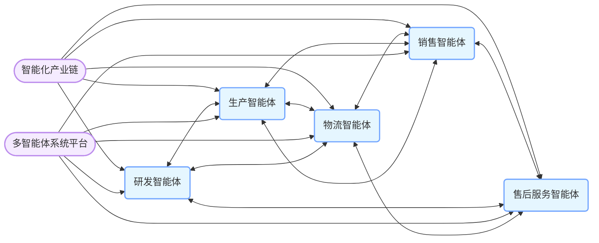

# 多智能体系统实现智能化产业链分析

> 关键词：多智能体系统、智能化产业链、智能体协作、产业链优化、人工智能

> 摘要：本文旨在深入探讨多智能体系统在实现智能化产业链过程中的作用、原理、算法及应用。首先介绍了多智能体系统和智能化产业链的背景知识，接着阐述了核心概念及其联系，详细讲解了核心算法原理与具体操作步骤，通过数学模型和公式进一步剖析其内在逻辑。结合项目实战案例，分析了开发环境搭建、源代码实现与解读。探讨了多智能体系统在智能化产业链中的实际应用场景，推荐了相关的学习资源、开发工具框架以及论文著作。最后总结了未来发展趋势与挑战，并对常见问题进行解答，为多智能体系统在智能化产业链中的应用提供全面的参考。

## 1. 背景介绍 
### 1.1 目的和范围
随着全球经济的快速发展和科技的不断进步，产业链的复杂性和动态性日益增加。传统的产业链管理模式已经难以满足高效、灵活、智能的发展需求。多智能体系统作为一种分布式人工智能技术，具有自主性、协作性、适应性等特点，为实现智能化产业链提供了新的思路和方法。

本文的范围涵盖多智能体系统的基本概念、核心算法、数学模型，以及其在智能化产业链中的具体应用。通过理论分析和实际案例相结合，全面探讨多智能体系统如何优化产业链的各个环节，提高产业链的整体效率和竞争力。

### 1.2 预期读者
本文预期读者包括从事人工智能、计算机科学、管理科学等领域的研究人员和学者，以及对智能化产业链升级改造感兴趣的企业管理人员、技术人员和决策者。希望通过本文的阐述，为他们在相关领域的研究、实践和决策提供有益的参考。

### 1.3 文档结构概述
本文共分为十个部分。第一部分为背景介绍，阐述了研究的目的、范围、预期读者和文档结构概述。第二部分介绍多智能体系统和智能化产业链的核心概念与联系。第三部分讲解核心算法原理及具体操作步骤。第四部分给出数学模型和公式，并进行详细讲解和举例说明。第五部分通过项目实战案例，介绍开发环境搭建、源代码实现和代码解读。第六部分探讨多智能体系统在智能化产业链中的实际应用场景。第七部分推荐相关的学习资源、开发工具框架和论文著作。第八部分总结未来发展趋势与挑战。第九部分为附录，解答常见问题。第十部分提供扩展阅读和参考资料。

### 1.4 术语表
#### 1.4.1 核心术语定义
- **多智能体系统（Multi - Agent System, MAS）**：由多个自主的智能体组成的系统，这些智能体通过相互协作和通信来完成复杂的任务。
- **智能体（Agent）**：具有自主性、反应性、主动性和社会性的实体，能够感知环境并根据自身的目标和知识采取行动。
- **智能化产业链**：利用先进的信息技术和人工智能手段，实现产业链各环节的智能化决策、协同和优化，提高产业链的整体效率和竞争力。

#### 1.4.2 相关概念解释
- **自主性**：智能体能够在没有外界直接干预的情况下，独立地完成任务和做出决策。
- **协作性**：多个智能体之间通过相互合作和协调，共同完成单个智能体无法完成的复杂任务。
- **适应性**：智能体能够根据环境的变化和自身的经验，调整自己的行为和策略。

#### 1.4.3 缩略词列表
- **MAS**：Multi - Agent System（多智能体系统）
- **AI**：Artificial Intelligence（人工智能）
- **IoT**：Internet of Things（物联网）

## 2. 核心概念与联系 

### 2.1 多智能体系统的原理
多智能体系统的基本原理是基于分布式计算和人工智能的思想。每个智能体都有自己的感知器、执行器和知识库，能够感知环境中的信息，并根据自身的目标和知识采取相应的行动。智能体之间通过通信机制进行信息交换和协作，共同完成系统的整体任务。

多智能体系统的架构通常包括智能体层、通信层和协调层。智能体层由多个独立的智能体组成，每个智能体负责完成特定的任务。通信层提供智能体之间的信息传输通道，确保智能体能够及时、准确地交换信息。协调层负责对智能体的行为进行协调和管理，避免智能体之间的冲突和重复工作。

### 2.2 智能化产业链的概念
智能化产业链是指在产业链的各个环节中，引入先进的信息技术和人工智能手段，实现产业链的智能化决策、协同和优化。智能化产业链的核心是利用数据和算法，对产业链中的各种资源进行合理配置和有效利用，提高产业链的整体效率和竞争力。

智能化产业链包括研发、生产、物流、销售、售后服务等多个环节。通过智能化技术的应用，这些环节可以实现信息的实时共享和协同工作，从而提高产业链的响应速度和灵活性。

### 2.3 多智能体系统与智能化产业链的联系
多智能体系统与智能化产业链之间存在着密切的联系。多智能体系统可以为智能化产业链提供一种有效的建模和实现方法。在智能化产业链中，每个企业或部门可以看作是一个智能体，它们具有自己的目标和利益，通过相互协作和竞争，共同完成产业链的整体任务。

多智能体系统的自主性、协作性和适应性特点，可以很好地满足智能化产业链的需求。智能体的自主性可以使企业或部门在一定程度上独立地做出决策，提高决策的效率和灵活性。智能体的协作性可以促进企业或部门之间的信息共享和协同工作，提高产业链的整体效率。智能体的适应性可以使企业或部门根据市场环境的变化及时调整自己的策略，提高产业链的竞争力。

### 2.4 文本示意图
多智能体系统与智能化产业链的关系可以用以下文本示意图表示：

智能化产业链由多个环节组成，包括研发、生产、物流、销售、售后服务等。每个环节可以看作是一个智能体，这些智能体之间通过通信和协作来实现产业链的整体目标。多智能体系统为这些智能体提供了一个分布式的计算和协作平台，使得它们能够更好地完成各自的任务，并协同工作。

### 2.5 Mermaid 流程图


## 3. 核心算法原理 & 具体操作步骤 

### 3.1 核心算法原理
在多智能体系统实现智能化产业链的过程中，常用的核心算法包括强化学习算法、博弈论算法和协商算法等。

#### 3.1.1 强化学习算法
强化学习是一种通过智能体与环境进行交互，不断尝试和学习，以最大化累积奖励的机器学习方法。在多智能体系统中，每个智能体可以看作是一个强化学习的智能体，通过与环境和其他智能体进行交互，学习最优的行为策略。

强化学习算法的基本原理可以用马尔可夫决策过程（Markov Decision Process, MDP）来描述。MDP 是一个五元组 $(S, A, P, R, \gamma)$，其中：
- $S$ 是状态空间，表示智能体所处的所有可能状态。
- $A$ 是动作空间，表示智能体可以采取的所有可能动作。
- $P$ 是状态转移概率，表示在当前状态 $s$ 下采取动作 $a$ 后转移到下一个状态 $s'$ 的概率，即 $P(s'|s, a)$。
- $R$ 是奖励函数，表示在当前状态 $s$ 下采取动作 $a$ 后获得的即时奖励 $R(s, a)$。
- $\gamma$ 是折扣因子，取值范围为 $[0, 1]$，用于衡量未来奖励的重要性。

智能体的目标是找到一个最优的策略 $\pi^*$，使得在该策略下的累积折扣奖励最大，即：
$$V^{\pi^*}(s) = \max_{\pi} \mathbb{E} \left[ \sum_{t = 0}^{\infty} \gamma^t R(S_t, A_t) | S_0 = s, \pi \right]$$

#### 3.1.2 博弈论算法
博弈论是研究多个智能体之间策略互动的数学理论。在多智能体系统中，智能体之间的决策往往相互影响，博弈论可以用于分析智能体之间的竞争和合作关系，找到最优的策略组合。

常见的博弈类型包括静态博弈和动态博弈。静态博弈是指智能体同时做出决策，而动态博弈是指智能体按照一定的顺序做出决策。在智能化产业链中，企业之间的竞争和合作可以看作是一种博弈过程，通过博弈论算法可以分析企业之间的策略选择和利益分配。

#### 3.1.3 协商算法
协商算法用于解决智能体之间的冲突和协调问题。在多智能体系统中，由于智能体的目标和利益可能存在冲突，需要通过协商来达成共识。协商算法可以分为基于规则的协商算法和基于效用的协商算法。

基于规则的协商算法通过预先定义的规则来指导智能体之间的协商过程，例如轮流发言、投票等。基于效用的协商算法则通过计算智能体的效用函数，找到使所有智能体效用最大化的协商结果。

### 3.2 具体操作步骤

#### 3.2.1 问题建模
首先，需要对智能化产业链中的问题进行建模。确定智能体的类型、数量和各自的目标，定义状态空间、动作空间、奖励函数和状态转移概率等。

#### 3.2.2 算法选择
根据问题的特点和需求，选择合适的算法。如果智能体需要与环境进行交互并学习最优策略，可以选择强化学习算法；如果智能体之间存在竞争和合作关系，可以选择博弈论算法；如果需要解决智能体之间的冲突和协调问题，可以选择协商算法。

#### 3.2.3 算法实现
使用编程语言实现所选的算法。以下是一个使用 Python 实现简单强化学习算法（Q - learning）的示例代码：

```python
import numpy as np

# 定义状态空间和动作空间
num_states = 10
num_actions = 4

# 初始化 Q 表
Q = np.zeros((num_states, num_actions))

# 定义超参数
alpha = 0.1  # 学习率
gamma = 0.9  # 折扣因子
epsilon = 0.1  # 探索率

# 定义环境的状态转移和奖励函数
def get_reward(state, action):
    # 简单示例，根据状态和动作返回奖励
    if state == 9 and action == 3:
        return 10
    else:
        return -1

def get_next_state(state, action):
    # 简单示例，根据状态和动作返回下一个状态
    if action == 0:  # 向上
        if state - 1 >= 0:
            return state - 1
        else:
            return state
    elif action == 1:  # 向下
        if state + 1 < num_states:
            return state + 1
        else:
            return state
    elif action == 2:  # 向左
        return state
    elif action == 3:  # 向右
        return state

# 训练过程
num_episodes = 1000
for episode in range(num_episodes):
    state = 0  # 初始状态
    done = False
    while not done:
        # 选择动作
        if np.random.uniform(0, 1) < epsilon:
            action = np.random.randint(0, num_actions)  # 探索
        else:
            action = np.argmax(Q[state, :])  # 利用

        # 执行动作，获取奖励和下一个状态
        reward = get_reward(state, action)
        next_state = get_next_state(state, action)

        # 更新 Q 表
        Q[state, action] = Q[state, action] + alpha * (reward + gamma * np.max(Q[next_state, :]) - Q[state, action])

        # 判断是否结束
        if state == 9 and action == 3:
            done = True
        else:
            state = next_state

# 输出最终的 Q 表
print(Q)
```

#### 3.2.4 实验和优化
在实现算法后，需要进行实验和优化。通过调整算法的超参数、改进模型结构等方式，提高算法的性能和效果。

#### 3.2.5 部署和应用
将优化后的算法部署到实际的智能化产业链系统中，并进行应用和验证。不断收集反馈信息，对算法进行进一步的优化和改进。

## 4. 数学模型和公式 & 详细讲解 & 举例说明 

### 4.1 马尔可夫决策过程（MDP）
马尔可夫决策过程（MDP）是强化学习的基础数学模型，用于描述智能体与环境的交互过程。如前所述，MDP 是一个五元组 $(S, A, P, R, \gamma)$。

#### 4.1.1 状态空间 $S$
状态空间 $S$ 表示智能体所处的所有可能状态。例如，在一个机器人导航问题中，状态可以表示机器人在地图上的位置。状态空间的大小和复杂度取决于具体的问题。

#### 4.1.2 动作空间 $A$
动作空间 $A$ 表示智能体可以采取的所有可能动作。例如，在机器人导航问题中，动作可以包括向前、向后、向左、向右等。动作空间的选择也取决于具体的问题。

#### 4.1.3 状态转移概率 $P$
状态转移概率 $P(s'|s, a)$ 表示在当前状态 $s$ 下采取动作 $a$ 后转移到下一个状态 $s'$ 的概率。例如，在一个不确定的环境中，机器人采取向前的动作后，可能由于地面的不平整等原因，以一定的概率转移到不同的位置。

#### 4.1.4 奖励函数 $R$
奖励函数 $R(s, a)$ 表示在当前状态 $s$ 下采取动作 $a$ 后获得的即时奖励。奖励函数的设计直接影响智能体的学习目标。例如，在机器人导航问题中，如果机器人到达目标位置，可以给予一个正的奖励；如果机器人碰撞到障碍物，可以给予一个负的奖励。

#### 4.1.5 折扣因子 $\gamma$
折扣因子 $\gamma$ 取值范围为 $[0, 1]$，用于衡量未来奖励的重要性。当 $\gamma$ 接近 1 时，智能体更注重未来的奖励；当 $\gamma$ 接近 0 时，智能体更注重即时奖励。

### 4.2 价值函数和策略
#### 4.2.1 状态价值函数 $V^{\pi}(s)$
状态价值函数 $V^{\pi}(s)$ 表示在策略 $\pi$ 下，从状态 $s$ 开始的累积折扣奖励的期望值，即：
$$V^{\pi}(s) = \mathbb{E} \left[ \sum_{t = 0}^{\infty} \gamma^t R(S_t, A_t) | S_0 = s, \pi \right]$$

#### 4.2.2 动作价值函数 $Q^{\pi}(s, a)$
动作价值函数 $Q^{\pi}(s, a)$ 表示在策略 $\pi$ 下，从状态 $s$ 采取动作 $a$ 后，再继续遵循策略 $\pi$ 的累积折扣奖励的期望值，即：
$$Q^{\pi}(s, a) = \mathbb{E} \left[ \sum_{t = 0}^{\infty} \gamma^t R(S_t, A_t) | S_0 = s, A_0 = a, \pi \right]$$

#### 4.2.3 最优策略 $\pi^*$
最优策略 $\pi^*$ 是使得状态价值函数 $V^{\pi}(s)$ 最大的策略，即：
$$V^{\pi^*}(s) = \max_{\pi} V^{\pi}(s)$$

### 4.3 举例说明
假设一个简单的网格世界问题，智能体在一个 $3 \times 3$ 的网格中移动，目标是从左上角 $(0, 0)$ 移动到右下角 $(2, 2)$。状态空间 $S$ 包含 9 个状态，动作空间 $A$ 包含 4 个动作（上、下、左、右）。

状态转移概率 $P$ 可以定义为：如果智能体采取的动作不会导致超出网格范围，则以 1 的概率转移到相应的状态；否则，保持当前状态不变。

奖励函数 $R$ 可以定义为：如果智能体到达目标状态 $(2, 2)$，获得奖励 10；如果智能体在其他状态，获得奖励 -1。

折扣因子 $\gamma$ 可以设置为 0.9。

使用 Q - learning 算法，智能体可以通过不断与环境交互，学习到最优的策略，使得从初始状态 $(0, 0)$ 