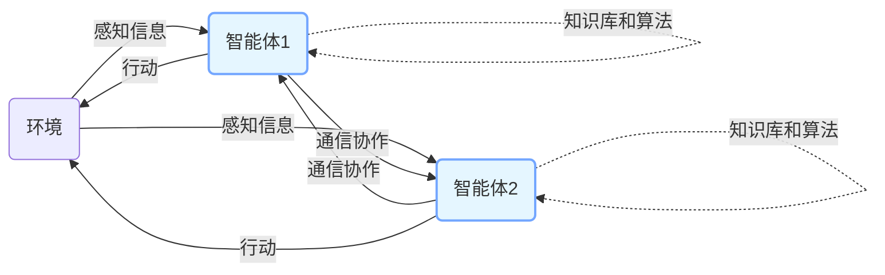
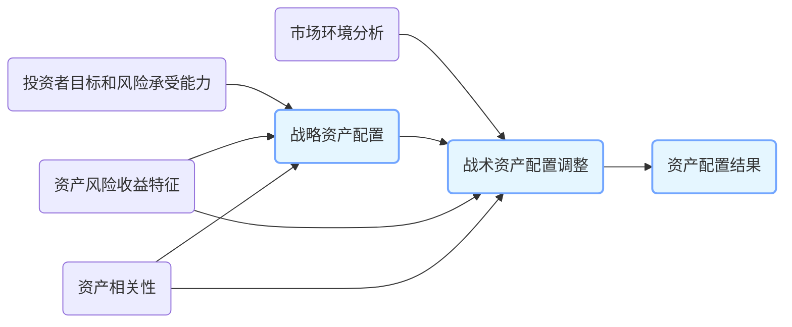

# 多智能体系统实现智能化全球资产配置

> 关键词：多智能体系统、智能化、全球资产配置、投资组合优化、人工智能

> 摘要：本文聚焦于多智能体系统在智能化全球资产配置中的应用。首先介绍了相关背景知识，包括目的、预期读者、文档结构和术语表。接着阐述了多智能体系统和全球资产配置的核心概念及其联系，通过文本示意图和 Mermaid 流程图进行清晰展示。详细讲解了核心算法原理，并用 Python 代码实现具体操作步骤。对涉及的数学模型和公式进行了深入剖析，并举例说明。通过项目实战展示了代码实际案例，包括开发环境搭建、源代码实现和解读。探讨了多智能体系统在全球资产配置中的实际应用场景。推荐了学习资源、开发工具框架以及相关论文著作。最后总结了未来发展趋势与挑战，并提供常见问题解答和扩展阅读参考资料，旨在为相关领域的研究者和从业者提供全面且深入的技术指导。

## 1. 背景介绍 
### 1.1 目的和范围
随着全球经济的一体化和金融市场的不断发展，全球资产配置成为投资者分散风险、实现资产增值的重要手段。传统的资产配置方法往往依赖于人工经验和简单的数学模型，难以应对复杂多变的全球金融市场。多智能体系统作为一种新兴的人工智能技术，具有分布式、自主性和协作性等特点，能够更好地模拟和处理复杂的金融市场环境。本文的目的在于探讨如何利用多智能体系统实现智能化的全球资产配置，提高资产配置的效率和收益。

本文的范围涵盖了多智能体系统的基本概念、核心算法原理、数学模型，以及如何将其应用于全球资产配置的实际项目中。同时，还将介绍相关的工具和资源，为读者提供全面的技术指导。

### 1.2 预期读者
本文的预期读者包括金融领域的从业者，如投资经理、分析师等，他们希望借助多智能体系统提升全球资产配置的水平；计算机科学领域的研究者和开发者，对人工智能在金融领域的应用感兴趣；以及对全球资产配置和人工智能技术有一定了解，希望深入学习相关知识的爱好者。

### 1.3 文档结构概述
本文共分为十个部分。第一部分为背景介绍，阐述了文章的目的、预期读者、文档结构和术语表。第二部分介绍多智能体系统和全球资产配置的核心概念及其联系，并通过文本示意图和 Mermaid 流程图进行展示。第三部分详细讲解核心算法原理，并用 Python 代码实现具体操作步骤。第四部分对涉及的数学模型和公式进行深入剖析，并举例说明。第五部分通过项目实战展示代码实际案例，包括开发环境搭建、源代码实现和解读。第六部分探讨多智能体系统在全球资产配置中的实际应用场景。第七部分推荐学习资源、开发工具框架以及相关论文著作。第八部分总结未来发展趋势与挑战。第九部分为附录，提供常见问题解答。第十部分列出扩展阅读和参考资料。

### 1.4 术语表
#### 1.4.1 核心术语定义
- **多智能体系统（Multi - Agent System, MAS）**：由多个智能体组成的系统，每个智能体具有自主决策和行动的能力，它们通过相互协作来完成共同的任务。
- **全球资产配置（Global Asset Allocation）**：投资者将资金分散投资于全球不同地区、不同类型的资产，以降低风险、提高收益的投资策略。
- **智能体（Agent）**：具有感知、决策和行动能力的实体，能够根据环境的变化自主地做出决策并采取行动。
- **投资组合（Portfolio）**：由多种资产组成的集合，投资者通过合理配置不同资产的比例来实现投资目标。

#### 1.4.2 相关概念解释
- **分布式计算**：将一个大型任务分解为多个小任务，由多个计算节点并行处理，以提高计算效率。多智能体系统采用分布式计算的思想，每个智能体可以独立地进行计算和决策。
- **协作机制**：多智能体系统中，智能体之间通过协作机制进行信息交流和任务分配，以实现共同的目标。常见的协作机制包括合同网协议、拍卖机制等。
- **资产类别**：全球资产配置中涉及的资产类别包括股票、债券、大宗商品、房地产等。不同资产类别具有不同的风险和收益特征。

#### 1.4.3 缩略词列表
- **MAS**：Multi - Agent System（多智能体系统）
- **MPT**：Modern Portfolio Theory（现代投资组合理论）
- **CAPM**：Capital Asset Pricing Model（资本资产定价模型）

## 2. 核心概念与联系 

### 多智能体系统的原理和架构
多智能体系统由多个智能体组成，每个智能体具有以下基本能力：
- **感知能力**：能够感知周围环境的信息，如市场行情、资产价格等。
- **决策能力**：根据感知到的信息和自身的目标，做出决策。
- **行动能力**：根据决策结果采取相应的行动，如买卖资产等。

多智能体系统的架构可以分为集中式、分布式和混合式三种。集中式架构中，有一个中心控制节点负责协调所有智能体的行动；分布式架构中，智能体之间通过平等的通信进行协作；混合式架构则结合了集中式和分布式的特点。

文本示意图如下：
多智能体系统由多个智能体组成，每个智能体与环境进行交互，感知环境信息并采取行动。智能体之间通过通信进行协作，共同完成全球资产配置的任务。智能体的决策过程受到其内部的知识库和算法的影响。

Mermaid 流程图如下：


### 全球资产配置的原理和架构
全球资产配置的目标是通过分散投资降低风险、提高收益。其基本原理是根据不同资产的风险和收益特征，合理配置资产的比例。常见的资产配置方法包括均值 - 方差模型、风险平价模型等。

全球资产配置的架构可以分为战略资产配置和战术资产配置。战略资产配置是基于长期投资目标和风险承受能力，确定各类资产的长期配置比例；战术资产配置则是根据市场短期变化，对资产配置比例进行调整。

文本示意图如下：
全球资产配置从投资者的目标和风险承受能力出发，确定战略资产配置比例。通过对市场环境的分析，进行战术资产配置调整。在资产配置过程中，需要考虑不同资产的风险和收益特征，以及它们之间的相关性。

Mermaid 流程图如下：


### 多智能体系统与全球资产配置的联系
多智能体系统可以为全球资产配置提供更高效、更灵活的解决方案。每个智能体可以代表不同的投资策略或投资者，它们通过协作和竞争来实现全球资产的最优配置。智能体可以根据市场变化实时调整投资策略，提高资产配置的适应性。同时，多智能体系统的分布式特性可以提高计算效率，处理大规模的金融数据。

## 3. 核心算法原理 & 具体操作步骤 

### 核心算法原理
在多智能体系统实现智能化全球资产配置中，常用的核心算法包括遗传算法、粒子群算法等。这里以遗传算法为例进行介绍。

遗传算法是一种模拟自然选择和遗传机制的优化算法，其基本思想是通过模拟生物的进化过程，不断迭代寻找最优解。在全球资产配置中，遗传算法可以用于寻找最优的资产配置比例。

遗传算法的基本步骤如下：
1. **编码**：将资产配置比例表示为染色体，每个基因代表一种资产的配置比例。
2. **初始化种群**：随机生成一组染色体作为初始种群。
3. **适应度评估**：根据投资组合的收益和风险，计算每个染色体的适应度值。
4. **选择操作**：根据适应度值选择优良的染色体进行繁殖。
5. **交叉操作**：对选择的染色体进行交叉，生成新的染色体。
6. **变异操作**：对新的染色体进行变异，引入新的基因。
7. **更新种群**：用新生成的染色体替换旧的种群。
8. **终止条件判断**：如果满足终止条件（如达到最大迭代次数），则停止迭代，输出最优解；否则，返回步骤 3。

### 具体操作步骤的 Python 代码实现
```python
import numpy as np

# 定义资产数量和种群大小
num_assets = 5
population_size = 100
max_generations = 200
mutation_rate = 0.01

# 初始化种群
def initialize_population():
    population = []
    for _ in range(population_size):
        # 随机生成资产配置比例，确保总和为 1
        weights = np.random.rand(num_assets)
        weights = weights / np.sum(weights)
        population.append(weights)
    return population

# 计算适应度值（这里简单假设为投资组合的收益）
def fitness_function(weights, returns):
    portfolio_return = np.dot(weights, returns)
    return portfolio_return

# 选择操作（轮盘赌选择）
def selection(population, returns):
    fitness_values = [fitness_function(weights, returns) for weights in population]
    total_fitness = sum(fitness_values)
    probabilities = [fit / total_fitness for fit in fitness_values]
    selected_indices = np.random.choice(range(population_size), size=population_size, p=probabilities)
    selected_population = [population[i] for i in selected_indices]
    return selected_population

# 交叉操作（单点交叉）
def crossover(parent1, parent2):
    crossover_point = np.random.randint(1, num_assets)
    child1 = np.concatenate((parent1[:crossover_point], parent2[crossover_point:]))
    child2 = np.concatenate((parent2[:crossover_point], parent1[crossover_point:]))
    return child1, child2

# 变异操作
def mutation(weights):
    for i in range(num_assets):
        if np.random.rand() < mutation_rate:
            # 随机调整资产配置比例
            weights[i] = np.random.rand()
    # 重新归一化
    weights = weights / np.sum(weights)
    return weights

# 遗传算法主函数
def genetic_algorithm(returns):
    population = initialize_population()
    for generation in range(max_generations):
        # 选择操作
        selected_population = selection(population, returns)
        new_population = []
        for i in range(0, population_size, 2):
            parent1 = selected_population[i]
            parent2 = selected_population[i + 1]
            # 交叉操作
            child1, child2 = crossover(parent1, parent2)
            # 变异操作
            child1 = mutation(child1)
            child2 = mutation(child2)
            new_population.extend([child1, child2])
        population = new_population
    # 选择最优解
    fitness_values = [fitness_function(weights, returns) for weights in population]
    best_index = np.argmax(fitness_values)
    best_weights = population[best_index]
    return best_weights

# 示例数据：资产的历史收益率
returns = np.array([0.1, 0.12, 0.08, 0.09, 0.11])

# 运行遗传算法
best_weights = genetic_algorithm(returns)
print("最优资产配置比例:", best_weights)
```

### 代码解释
1. **初始化种群**：`initialize_population` 函数随机生成一组资产配置比例，确保每个染色体的基因总和为 1。
2. **适应度评估**：`fitness_function` 函数计算每个染色体的适应度值，这里简单假设为投资组合的收益。
3. **选择操作**：`selection` 函数采用轮盘赌选择方法，根据适应度值选择优良的染色体进行繁殖。
4. **交叉操作**：`crossover` 函数采用单点交叉方法，生成新的染色体。
5. **变异操作**：`mutation` 函数以一定的概率对染色体的基因进行变异。
6. **遗传算法主函数**：`genetic_algorithm` 函数实现了遗传算法的主要流程，不断迭代直到满足终止条件。

## 4. 数学模型和公式 & 详细讲解 & 举例说明 

### 现代投资组合理论（MPT）
现代投资组合理论由哈里·马科维茨（Harry Markowitz）提出，其核心思想是通过分散投资降低风险。该理论基于以下假设：
- 投资者是风险厌恶的，追求在一定风险水平下的最大收益或在一定收益水平下的最小风险。
- 资产的收益服从正态分布。

#### 数学模型和公式
设投资组合包含 $n$ 种资产，第 $i$ 种资产的权重为 $w_i$，预期收益率为 $\mu_i$，资产之间的协方差矩阵为 $\Sigma$。则投资组合的预期收益率 $\mu_p$ 和方差 $\sigma_p^2$ 分别为：
$$\mu_p = \sum_{i = 1}^{n} w_i \mu_i$$
$$\sigma_p^2 = \sum_{i = 1}^{n} \sum_{j = 1}^{n} w_i w_j \sigma_{ij} = \mathbf{w}^T \Sigma \mathbf{w}$$
其中，$\mathbf{w} = [w_1, w_2, \cdots, w_n]^T$ 是资产权重向量，$\sigma_{ij}$ 是资产 $i$ 和资产 $j$ 的协方差。

投资者的目标是在给定预期收益率 $\mu_p$ 的情况下，最小化投资组合的方差 $\sigma_p^2$，即求解以下优化问题：
$$\min_{\mathbf{w}} \mathbf{w}^T \Sigma \mathbf{w}$$
$$\text{s.t.} \quad \sum_{i = 1}^{n} w_i \mu_i = \mu_p$$
$$\sum_{i = 1}^{n} w_i = 1$$
$$w_i \geq 0, \quad i = 1, 2, \cdots, n$$

#### 详细讲解
上述优化问题的目标是找到一组资产权重 $\mathbf{w}$，使得投资组合的方差最小，同时满足预期收益率和权重总和为 1 的约束条件。约束条件 $w_i \geq 0$ 表示不允许卖空资产。

#### 举例说明
假设有两种资产 A 和 B，资产 A 的预期收益率 $\mu_A = 0.1$，标准差 $\sigma_A = 0.2$；资产 B 的预期收益率 $\mu_B = 0.15$，标准差 $\sigma_B = 0.3$，资产 A 和 B 的相关系数 $\rho_{AB} = 0.5$。则协方差 $\sigma_{AB} = \rho_{AB} \sigma_A \sigma_B = 0.5 \times 0.2 \times 0.3 = 0.03$。协方差矩阵为：
$$\Sigma = \begin{bmatrix}
\sigma_A^2 & \sigma_{AB} \\
\sigma_{AB} & \sigma_B^2
\end{bmatrix} = \begin{bmatrix}
0.04 & 0.03 \\
0.03 & 0.09
\end{bmatrix}$$
设投资组合中资产 A 的权重为 $w_A$，资产 B 的权重为 $w_B = 1 - w_A$。投资组合的预期收益率为：
$$\mu_p = w_A \mu_A + w_B \mu_B = 0.1 w_A + 0.15 (1 - w_A) = 0.15 - 0.05 w_A$$
投资组合的方差为：
$$\sigma_p^2 = w_A^2 \sigma_A^2 + w_B^2 \sigma_B^2 + 2 w_A w_B \sigma_{AB}$$
$$= w_A^2 \times 0.04 + (1 - w_A)^2 \times 0.09 + 2 w_A (1 - w_A) \times 0.03$$
假设投资者要求的预期收益率 $\mu_p = 0.12$，则可以通过求解上述方程得到最优的资产权重 $w_A$ 和 $w_B$。

### 资本资产定价模型（CAPM）
资本资产定价模型由威廉·夏普（William Sharpe）提出，用于描述资产的预期收益率与系统性风险之间的关系。

#### 数学模型和公式
资本资产定价模型的公式为：
$$E(R_i) = R_f + \beta_i (E(R_m) - R_f)$$
其中，$E(R_i)$ 是资产 $i$ 的预期收益率，$R_f$ 是无风险利率，$E(R_m)$ 是市场组合的预期收益率，$\beta_i$ 是资产 $i$ 的贝塔系数，定义为：
$$\beta_i = \frac{\text{Cov}(R_i, R_m)}{\text{Var}(R_m)}$$
其中，$\text{Cov}(R_i, R_m)$ 是资产 $i$ 的收益率与市场组合收益率的协方差，$\text{Var}(R_m)$ 是市场组合收益率的方差。

#### 详细讲解
CAPM 模型认为，资产的预期收益率由两部分组成：无风险利率和风险溢价。风险溢价与资产的贝塔系数成正比，贝塔系数衡量了资产的系统性风险。如果 $\beta_i > 1$，则资产 $i$ 的系统性风险高于市场平均水平；如果 $\beta_i < 1$，则资产 $i$ 的系统性风险低于市场平均水平。

#### 举例说明
假设无风险利率 $R_f = 0.03$，市场组合的预期收益率 $E(R_m) = 0.1$，某资产的贝塔系数 $\beta_i = 1.2$。则该资产的预期收益率为：
$$E(R_i) = 0.03 + 1.2 \times (0.1 - 0.03) = 0.03 + 1.2 \times 0.07 = 0.114$$

## 5. 项目实战：代码实际案例和详细解释说明 

### 5.1  开发环境搭建
#### 操作系统
可以选择 Windows、Linux 或 macOS 操作系统。建议使用 Linux 系统，如 Ubuntu，因为它在数据处理和开发方面具有较好的稳定性和性能。

#### Python 环境
安装 Python 3.7 及以上版本。可以从 Python 官方网站（https://www.python.org/downloads/）下载并安装。安装完成后，建议使用虚拟环境来管理项目依赖。可以使用 `venv` 或 `conda` 来创建虚拟环境。

使用 `venv` 创建虚拟环境的命令如下：
```sh
python -m venv myenv
source myenv/bin/activate  # 在 Windows 上使用 myenv\Scripts\activate
```

#### 依赖库安装
安装项目所需的依赖库，包括 `numpy`、`pandas`、`scikit - learn` 等。可以使用 `pip` 进行安装：
```sh
pip install numpy pandas scikit-learn
```

### 5.2  源代码详细实现和代码解读
#### 数据获取和预处理
```python
import pandas as pd
import yfinance as yf

# 定义要获取数据的资产列表
tickers = ['AAPL', 'MSFT', 'GOOG', 'AMZN', 'TSLA']

# 获取历史数据
start_date = '2020-01-01'
end_date = '2023-01-01'
data = yf.download(tickers, start=start_date, end=end_date)['AdjClose']

# 计算收益率
returns = data.pct_change().dropna()

print(returns.head())
```
**代码解读**：
- 使用 `yfinance` 库从雅虎财经获取指定资产的历史调整收盘价数据。
- 计算资产的日收益率，并去除缺失值。

#### 多智能体系统实现
```python
import numpy as np

# 定义智能体类
class Agent:
    def __init__(self, num_assets):
        self.weights = np.random.rand(num_assets)
        self.weights = self.weights / np.sum(self.weights)

    def update_weights(self, returns):
        # 简单的权重更新策略，这里可以根据实际情况修改
        new_weights = self.weights + np.random.normal(0, 0.01, len(self.weights))
        new_weights = np.maximum(new_weights, 0)  # 确保权重非负
        new_weights = new_weights / np.sum(new_weights)
        self.weights = new_weights

    def calculate_fitness(self, returns):
        portfolio_return = np.dot(self.weights, returns.mean())
        return portfolio_return

# 定义多智能体系统类
class MultiAgentSystem:
    def __init__(self, num_agents, num_assets):
        self.agents = [Agent(num_assets) for _ in range(num_agents)]

    def run(self, returns, num_iterations):
        for iteration in range(num_iterations):
            for agent in self.agents:
                agent.update_weights(returns)
            fitness_values = [agent.calculate_fitness(returns) for agent in self.agents]
            best_agent_index = np.argmax(fitness_values)
            best_agent = self.agents[best_agent_index]
            print(f'Iteration {iteration + 1}, Best Fitness: {fitness_values[best_agent_index]}')
        return best_agent.weights

# 创建多智能体系统
num_agents = 50
num_assets = len(tickers)
mas = MultiAgentSystem(num_agents, num_assets)

# 运行多智能体系统
best_weights = mas.run(returns, num_iterations=100)
print("最优资产配置比例:", best_weights)
```
**代码解读**：
- `Agent` 类表示一个智能体，包含资产权重、权重更新方法和适应度计算方法。
- `MultiAgentSystem` 类表示多智能体系统，包含多个智能体，并实现了系统的运行逻辑。
- 在每次迭代中，每个智能体更新自己的权重，并计算适应度值。选择适应度值最高的智能体作为最优解。

### 5.3  代码解读与分析
#### 数据获取和预处理部分
- `yfinance` 库提供了方便的接口来获取金融数据，通过指定资产代码和日期范围，可以轻松获取历史数据。
- 计算收益率是资产配置中的重要步骤，收益率数据可以用于后续的分析和优化。

#### 多智能体系统部分
- 智能体的权重更新策略可以根据实际情况进行调整，例如使用更复杂的算法或结合市场信息。
- 适应度计算方法用于评估每个智能体的表现，这里简单地使用投资组合的平均收益率作为适应度值。
- 多智能体系统通过不断迭代，让智能体之间进行竞争和协作，最终找到最优的资产配置比例。

## 6. 实际应用场景 
### 投资机构
投资机构可以利用多智能体系统实现智能化的全球资产配置。不同的智能体可以代表不同的投资策略，如价值投资、成长投资等。通过多智能体系统的协作和竞争，投资机构可以找到最优的资产配置方案，提高投资组合的收益和风险控制能力。

### 个人投资者
个人投资者可以使用多智能体系统辅助自己进行全球资产配置。智能体可以根据投资者的风险承受能力和投资目标，为投资者提供个性化的资产配置建议。同时，多智能体系统可以实时监测市场变化，及时调整投资策略，帮助个人投资者更好地管理资产。

### 金融科技公司
金融科技公司可以开发基于多智能体系统的资产配置平台，为客户提供智能化的投资服务。平台可以集成多种数据源和分析工具，利用多智能体系统的优势，为客户提供更准确、更高效的资产配置方案。

## 7. 工具和资源推荐
### 7.1 学习资源推荐
#### 7.1.1 书籍推荐
- 《智能系统中的多智能体建模与仿真》：本书全面介绍了多智能体系统的理论、方法和应用，包括智能体的建模、仿真技术、协作机制等内容。
- 《现代投资组合理论与投资分析》：经典的投资组合理论著作，详细介绍了现代投资组合理论的原理、模型和应用，是学习资产配置的必备书籍。
- 《Python 金融数据分析实战》：本书结合 Python 语言，介绍了金融数据的获取、处理、分析和可视化方法，适合想通过 Python 进行金融数据分析的读者。

#### 7.1.2 在线课程
- Coursera 上的“Artificial Intelligence for Robotics”：该课程介绍了人工智能在机器人领域的应用，其中包括多智能体系统的相关知识。
- edX 上的“Finance for Everyone: Smart Tools for Decision-Making”：课程涵盖了金融决策的基本原理和方法，包括资产配置、风险管理等内容。
- 网易云课堂上的“Python 量化交易实战”：通过实际案例，介绍了如何使用 Python 进行量化交易和资产配置。

#### 7.1.3 技术博客和网站
- Towards Data Science：一个专注于数据科学和人工智能的博客平台，上面有很多关于多智能体系统和金融数据分析的文章。
- QuantNet：量化金融领域的专业论坛，提供了丰富的金融数据、模型和算法资源。
- Medium：一个开放的写作平台，有很多技术专家分享关于多智能体系统和资产配置的最新研究成果和实践经验。

### 7.2 开发工具框架推荐
#### 7.2.1 IDE和编辑器
- PyCharm：一款功能强大的 Python 集成开发环境，提供了代码编辑、调试、版本控制等功能，适合开发大型 Python 项目。
- Jupyter Notebook：一个交互式的开发环境，支持 Python、R 等多种编程语言，方便进行数据探索和分析。
- Visual Studio Code：一款轻量级的代码编辑器，支持多种编程语言和插件，具有良好的扩展性。

#### 7.2.2 调试和性能分析工具
- pdb：Python 内置的调试器，可以帮助开发者定位和解决代码中的问题。
- cProfile：Python 标准库中的性能分析工具，可以分析代码的运行时间和函数调用情况。
- Py-Spy：一个轻量级的 Python 性能分析工具，可以实时监测 Python 程序的性能。

#### 7.2.3 相关框架和库
- Mesa：一个用于构建多智能体系统的 Python 框架，提供了智能体建模、仿真和可视化的功能。
- TensorFlow：一个开源的机器学习框架，可用于构建和训练智能体的决策模型。
- scikit-learn：一个常用的机器学习库，提供了丰富的机器学习算法和工具，可用于资产配置中的数据分析和建模。

### 7.3 相关论文著作推荐
#### 7.3.1 经典论文
- Markowitz, H. M. (1952). Portfolio Selection. The Journal of Finance, 7(1), 77 - 91. 这篇论文提出了现代投资组合理论，奠定了资产配置的理论基础。
- Sharpe, W. F. (1964). Capital Asset Prices: A Theory of Market Equilibrium under Conditions of Risk. The Journal of Finance, 19(3), 425 - 442. 该论文提出了资本资产定价模型，为资产定价和风险管理提供了重要的理论支持。

#### 7.3.2 最新研究成果
- 近年来，关于多智能体系统在金融领域的应用研究不断涌现。可以通过 IEEE Xplore、ACM Digital Library 等学术数据库搜索相关的研究论文，了解最新的研究动态和技术进展。

#### 7.3.3 应用案例分析
- 一些知名金融机构和研究机构会发布关于资产配置的应用案例分析报告。可以关注这些报告，了解多智能体系统在实际应用中的效果和经验教训。

## 8. 总结：未来发展趋势与挑战
### 未来发展趋势
- **智能化程度不断提高**：随着人工智能技术的不断发展，多智能体系统的智能化程度将不断提高。智能体将具备更强的学习能力和决策能力，能够更好地适应复杂多变的金融市场环境。
- **与其他技术的融合**：多智能体系统将与区块链、大数据、云计算等技术深度融合。例如，区块链技术可以提供更安全、透明的交易环境；大数据和云计算技术可以为多智能体系统提供更强大的计算和数据处理能力。
- **个性化服务**：未来的全球资产配置将更加注重个性化服务。多智能体系统可以根据投资者的个人情况和需求，提供更加个性化的资产配置方案。

### 挑战
- **数据质量和安全**：多智能体系统需要大量的金融数据来进行学习和决策，数据的质量和安全至关重要。如何获取准确、可靠的数据，并保护数据的安全和隐私是面临的重要挑战。
- **模型的复杂性和可解释性**：随着多智能体系统的智能化程度提高，模型的复杂性也会增加。如何确保模型的可解释性，让投资者理解模型的决策过程和结果，是需要解决的问题。
- **市场不确定性**：金融市场具有高度的不确定性，多智能体系统需要具备更强的抗干扰能力和适应性，以应对市场的变化。

## 9. 附录：常见问题与解答
### 多智能体系统与传统资产配置方法有什么区别？
传统资产配置方法往往依赖于人工经验和简单的数学模型，难以应对复杂多变的金融市场。多智能体系统具有分布式、自主性和协作性等特点，能够更好地模拟和处理复杂的金融市场环境。每个智能体可以代表不同的投资策略或投资者，它们通过协作和竞争来实现全球资产的最优配置。

### 多智能体系统在全球资产配置中的计算复杂度高吗？
多智能体系统的计算复杂度取决于系统的规模和算法的复杂度。一般来说，多智能体系统采用分布式计算的思想，可以提高计算效率。但是，当系统规模较大或算法复杂度较高时，计算复杂度也会相应增加。可以通过优化算法、采用并行计算等方法来降低计算复杂度。

### 如何评估多智能体系统在全球资产配置中的效果？
可以从多个方面评估多智能体系统在全球资产配置中的效果，如投资组合的收益率、风险水平、夏普比率等。同时，还可以进行回测分析，将多智能体系统的配置结果与历史数据进行对比，评估其在不同市场环境下的表现。

## 10. 扩展阅读 & 参考资料
### 扩展阅读
- 《复杂适应系统：社会生活计算模型导论》：本书介绍了复杂适应系统的基本概念和方法，对于理解多智能体系统在复杂金融市场中的应用具有重要的参考价值。
- 《金融科技：重构未来金融生态》：探讨了金融科技的发展趋势和应用场景，包括多智能体系统在金融领域的应用前景。

### 参考资料
- Markowitz, H. M. (1952). Portfolio Selection. The Journal of Finance, 7(1), 77 - 91.
- Sharpe, W. F. (1964). Capital Asset Prices: A Theory of Market Equilibrium under Conditions of Risk. The Journal of Finance, 19(3), 425 - 442.
- Weiss, G. (Ed.). (1999). Multiagent Systems: A Modern Approach to Distributed Artificial Intelligence. MIT press.

作者：AI天才研究院/AI Genius Institute & 禅与计算机程序设计艺术 /Zen And The Art of Computer Programming