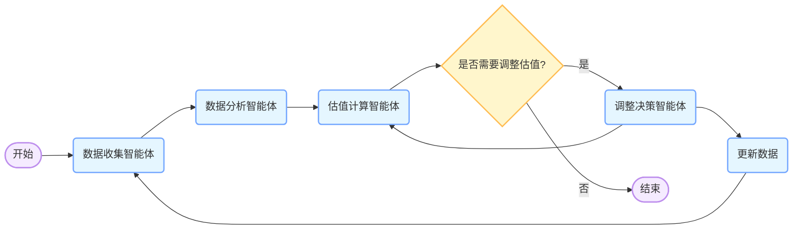

# 多智能体系统实现智能化公司估值调整

> 关键词：多智能体系统、智能化、公司估值调整、人工智能、决策模型

> 摘要：本文围绕多智能体系统实现智能化公司估值调整展开深入探讨。首先介绍多智能体系统和公司估值调整的背景知识，明确研究目的与范围以及预期读者。接着阐述多智能体系统和公司估值调整的核心概念及它们之间的联系，给出相应的文本示意图和 Mermaid 流程图。详细讲解核心算法原理，并用 Python 源代码进行具体操作步骤的阐述。引入相关数学模型和公式并举例说明。通过项目实战展示代码实际案例及详细解释。探讨多智能体系统在公司估值调整中的实际应用场景。推荐学习资源、开发工具框架和相关论文著作。最后总结未来发展趋势与挑战，提供常见问题解答和扩展阅读参考资料，旨在为实现智能化公司估值调整提供全面且深入的技术指导。

## 1. 背景介绍 
### 1.1 目的和范围
在当今复杂多变的商业环境中，公司估值是投资决策、企业战略规划等诸多活动的关键环节。传统的公司估值方法往往依赖于固定的模型和有限的数据，难以适应市场的动态变化和公司内部的复杂情况。多智能体系统（Multi - Agent System, MAS）作为一种新兴的人工智能技术，具有分布式、自主性、协作性等特点，能够模拟多个智能主体之间的交互和决策过程。本研究的目的在于探索如何利用多智能体系统实现智能化的公司估值调整，提高估值的准确性和灵活性。研究范围涵盖多智能体系统的原理、公司估值的基本方法、两者的结合方式以及在实际应用中的效果评估。

### 1.2 预期读者
本文预期读者包括人工智能领域的研究人员、金融分析师、企业管理人员、软件开发人员等。对于人工智能研究人员，本文提供了多智能体系统在金融领域的应用案例和研究思路；金融分析师可以从中获取新的估值方法和决策依据；企业管理人员能够了解如何利用先进技术优化公司的估值和战略决策；软件开发人员则可以借鉴相关的算法和代码实现，开发相关的应用系统。

### 1.3 文档结构概述
本文将按照以下结构展开：首先介绍多智能体系统和公司估值调整的核心概念及它们之间的联系，包括原理和架构的文本示意图及 Mermaid 流程图；接着详细讲解核心算法原理，并给出 Python 源代码说明具体操作步骤；引入相关数学模型和公式并进行详细讲解和举例；通过项目实战展示代码实际案例和详细解释；探讨多智能体系统在公司估值调整中的实际应用场景；推荐相关的学习资源、开发工具框架和论文著作；最后总结未来发展趋势与挑战，提供常见问题解答和扩展阅读参考资料。

### 1.4 术语表
#### 1.4.1 核心术语定义
- **多智能体系统（Multi - Agent System, MAS）**：由多个智能体组成的系统，每个智能体具有一定的自主性、感知能力、决策能力和通信能力，能够通过与其他智能体的交互实现共同的目标。
- **智能体（Agent）**：具有感知环境、自主决策和执行动作能力的实体，可以是软件程序、机器人等。
- **公司估值**：对公司的价值进行评估的过程，通常基于公司的财务状况、市场前景、行业竞争力等因素。
- **估值调整**：根据市场变化、公司内部情况等因素对公司的估值进行动态调整的过程。

#### 1.4.2 相关概念解释
- **分布式系统**：由多个独立的计算节点组成的系统，这些节点通过网络进行通信和协作，共同完成任务。多智能体系统是一种典型的分布式系统。
- **自主性**：智能体能够独立地感知环境、做出决策和执行动作，不受其他智能体的直接控制。
- **协作性**：多个智能体能够通过通信和协调，共同完成一个或多个任务。

#### 1.4.3 缩略词列表
- **MAS**：Multi - Agent System（多智能体系统）
- **AI**：Artificial Intelligence（人工智能）
- **ML**：Machine Learning（机器学习）

## 2. 核心概念与联系 
### 2.1 多智能体系统原理
多智能体系统的基本原理是由多个智能体组成一个系统，每个智能体具有自己的目标、知识和能力。智能体通过感知环境获取信息，根据自身的知识和目标进行决策，并执行相应的动作。智能体之间可以通过通信进行信息交换和协作，以实现共同的目标。

多智能体系统的架构通常包括以下几个部分：
- **智能体层**：包含多个智能体，每个智能体具有不同的功能和角色。
- **通信层**：负责智能体之间的信息交换和通信。
- **环境层**：智能体所处的环境，提供智能体感知和交互的对象。

### 2.2 公司估值调整原理
公司估值调整是一个动态的过程，需要考虑多个因素。传统的公司估值方法主要基于财务指标，如市盈率、市净率等。然而，在实际应用中，公司的价值还受到市场环境、行业趋势、管理团队等多种因素的影响。因此，公司估值调整需要综合考虑这些因素，根据市场变化和公司内部情况及时调整估值。

公司估值调整的主要步骤包括：
- **数据收集**：收集公司的财务数据、市场数据、行业数据等。
- **数据分析**：对收集到的数据进行分析，评估公司的价值和风险。
- **估值调整**：根据数据分析的结果，对公司的估值进行调整。

### 2.3 两者联系
多智能体系统可以应用于公司估值调整中，通过多个智能体的协作和交互，实现对公司估值的智能化调整。具体来说，不同的智能体可以负责不同的任务，如数据收集、数据分析、估值计算等。智能体之间通过通信和协作，共享信息和决策结果，提高估值调整的准确性和效率。

### 2.4 文本示意图
多智能体系统实现智能化公司估值调整的架构可以用以下文本示意图表示：

智能体 1（数据收集智能体）：负责收集公司的财务数据、市场数据、行业数据等。
智能体 2（数据分析智能体）：对收集到的数据进行分析，评估公司的价值和风险。
智能体 3（估值计算智能体）：根据数据分析的结果，计算公司的估值。
智能体 4（调整决策智能体）：根据市场变化和公司内部情况，做出估值调整的决策。

通信层：负责智能体之间的信息交换和通信。
环境层：包括公司的内部环境和外部市场环境。

### 2.5 Mermaid 流程图


## 3. 核心算法原理 & 具体操作步骤 
### 3.1 核心算法原理
在多智能体系统实现智能化公司估值调整中，核心算法包括数据收集算法、数据分析算法、估值计算算法和调整决策算法。

- **数据收集算法**：主要采用网络爬虫技术和数据接口技术，从各种数据源（如财务报表网站、行业报告数据库、新闻媒体等）收集公司的相关数据。
- **数据分析算法**：可以使用机器学习算法（如回归分析、决策树、神经网络等）对收集到的数据进行分析，挖掘数据中的潜在信息和规律。
- **估值计算算法**：基于传统的估值模型（如市盈率模型、市净率模型、现金流折现模型等），结合数据分析的结果，计算公司的估值。
- **调整决策算法**：根据市场变化和公司内部情况，使用规则推理、模糊逻辑等方法做出估值调整的决策。

### 3.2 具体操作步骤及 Python 源代码
#### 3.2.1 数据收集
以下是一个使用 Python 的 `requests` 库和 `BeautifulSoup` 库进行网页数据爬取的示例代码：
```python
import requests
from bs4 import BeautifulSoup

def collect_data(url):
    try:
        response = requests.get(url)
        response.raise_for_status()
        soup = BeautifulSoup(response.text, 'html.parser')
        # 这里可以根据具体的网页结构提取所需的数据
        data = soup.get_text()
        return data
    except Exception as e:
        print(f"数据收集失败: {e}")
        return None

# 示例使用
url = 'https://example.com'
data = collect_data(url)
if data:
    print(data)
```
#### 3.2.2 数据分析
以下是一个使用 Python 的 `scikit - learn` 库进行线性回归分析的示例代码：
```python
import numpy as np
from sklearn.linear_model import LinearRegression

# 示例数据
X = np.array([[1], [2], [3], [4], [5]])
y = np.array([2, 4, 6, 8, 10])

# 创建线性回归模型
model = LinearRegression()

# 拟合模型
model.fit(X, y)

# 预测
new_X = np.array([[6]])
prediction = model.predict(new_X)
print(f"预测结果: {prediction}")
```
#### 3.2.3 估值计算
以下是一个使用市盈率模型进行公司估值计算的示例代码：
```python
def pe_valuation(earnings_per_share, pe_ratio):
    return earnings_per_share * pe_ratio

# 示例使用
earnings_per_share = 2.0
pe_ratio = 15
valuation = pe_valuation(earnings_per_share, pe_ratio)
print(f"公司估值: {valuation}")
```
#### 3.2.4 调整决策
以下是一个简单的基于规则推理的调整决策示例代码：
```python
def adjustment_decision(valuation, market_trend):
    if market_trend == 'up':
        return valuation * 1.1
    elif market_trend == 'down':
        return valuation * 0.9
    else:
        return valuation

# 示例使用
valuation = 100.0
market_trend = 'up'
adjusted_valuation = adjustment_decision(valuation, market_trend)
print(f"调整后的估值: {adjusted_valuation}")
```

## 4. 数学模型和公式 & 详细讲解 & 举例说明 
### 4.1 市盈率模型
市盈率（Price - Earnings Ratio, PE）模型是一种常用的公司估值方法，其公式为：
$$V = EPS\times PE$$
其中，$V$ 表示公司的估值，$EPS$ 表示每股收益，$PE$ 表示市盈率。

详细讲解：市盈率反映了市场对公司盈利的预期，每股收益是公司盈利的指标。通过将每股收益乘以市盈率，可以得到公司的估值。市盈率的取值通常参考同行业其他公司的平均市盈率或市场整体的市盈率水平。

举例说明：假设某公司的每股收益为 $2$ 元，同行业平均市盈率为 $15$，则该公司的估值为：
$$V = 2\times15 = 30$$（元）

### 4.2 现金流折现模型
现金流折现模型（Discounted Cash Flow, DCF）是一种基于公司未来现金流的估值方法，其公式为：
$$V=\sum_{t = 1}^{n}\frac{CF_t}{(1 + r)^t}$$
其中，$V$ 表示公司的估值，$CF_t$ 表示第 $t$ 期的现金流，$r$ 表示折现率，$n$ 表示预测期数。

详细讲解：现金流折现模型的基本思想是将公司未来的现金流折现到当前时刻，以反映其现值。折现率反映了资金的时间价值和投资风险，通常根据市场利率和公司的风险水平确定。

举例说明：假设某公司未来三年的现金流分别为 $100$ 万元、$120$ 万元、$150$ 万元，折现率为 $10\%$，则该公司的估值为：
$$V=\frac{100}{(1 + 0.1)^1}+\frac{120}{(1 + 0.1)^2}+\frac{150}{(1 + 0.1)^3}$$
$$V=\frac{100}{1.1}+\frac{120}{1.21}+\frac{150}{1.331}$$
$$V\approx90.91 + 99.17+112.69 = 302.77$$（万元）

### 4.3 多智能体协作决策模型
在多智能体系统中，智能体之间的协作决策可以使用博弈论模型来描述。以简单的双人博弈为例，假设两个智能体 $A$ 和 $B$，它们的策略集合分别为 $S_A$ 和 $S_B$，收益函数分别为 $u_A(s_A, s_B)$ 和 $u_B(s_A, s_B)$，其中 $s_A\in S_A$，$s_B\in S_B$。

纳什均衡是博弈论中的一个重要概念，它是指在给定其他智能体策略的情况下，每个智能体都选择最优策略的一种状态。对于双人博弈，纳什均衡 $(s_A^*, s_B^*)$ 满足：
$$u_A(s_A^*, s_B^*)\geq u_A(s_A, s_B^*)\quad\forall s_A\in S_A$$
$$u_B(s_A^*, s_B^*)\geq u_B(s_A^*, s_B)\quad\forall s_B\in S_B$$

详细讲解：纳什均衡描述了智能体之间的一种稳定的策略选择状态，在这种状态下，没有智能体有动机单方面改变自己的策略。在多智能体系统实现公司估值调整中，智能体可以通过博弈论模型来协调各自的决策，以实现最优的估值调整结果。

举例说明：假设智能体 $A$ 和 $B$ 有两种策略：合作（$C$）和不合作（$D$），收益矩阵如下：

|  | $C$ | $D$ |
|---|---|---|
| $C$ | $(3, 3)$ | $(0, 5)$ |
| $D$ | $(5, 0)$ | $(1, 1)$ |

在这个例子中，$(D, D)$ 是一个纳什均衡，因为在对方选择不合作的情况下，每个智能体选择不合作的收益最大。

## 5. 项目实战：代码实际案例和详细解释说明 
### 5.1  开发环境搭建
#### 5.1.1 安装 Python
首先需要安装 Python 开发环境，建议使用 Python 3.7 及以上版本。可以从 Python 官方网站（https://www.python.org/downloads/） 下载并安装。

#### 5.1.2 安装必要的库
在项目中需要使用到一些 Python 库，如 `requests`、`BeautifulSoup`、`scikit - learn` 等。可以使用 `pip` 命令进行安装：
```sh
pip install requests beautifulsoup4 scikit-learn
```

### 5.2  源代码详细实现和代码解读
以下是一个完整的多智能体系统实现智能化公司估值调整的代码示例：
```python
import requests
from bs4 import BeautifulSoup
import numpy as np
from sklearn.linear_model import LinearRegression

# 数据收集智能体
class DataCollectorAgent:
    def collect_data(self, url):
        try:
            response = requests.get(url)
            response.raise_for_status()
            soup = BeautifulSoup(response.text, 'html.parser')
            data = soup.get_text()
            return data
        except Exception as e:
            print(f"数据收集失败: {e}")
            return None

# 数据分析智能体
class DataAnalyzerAgent:
    def analyze_data(self, X, y):
        model = LinearRegression()
        model.fit(X, y)
        return model

# 估值计算智能体
class ValuationCalculatorAgent:
    def pe_valuation(self, earnings_per_share, pe_ratio):
        return earnings_per_share * pe_ratio

# 调整决策智能体
class AdjustmentDecisionAgent:
    def adjustment_decision(self, valuation, market_trend):
        if market_trend == 'up':
            return valuation * 1.1
        elif market_trend == 'down':
            return valuation * 0.9
        else:
            return valuation

# 主程序
if __name__ == '__main__':
    # 数据收集
    data_collector = DataCollectorAgent()
    url = 'https://example.com'
    data = data_collector.collect_data(url)

    # 示例数据
    X = np.array([[1], [2], [3], [4], [5]])
    y = np.array([2, 4, 6, 8, 10])

    # 数据分析
    data_analyzer = DataAnalyzerAgent()
    model = data_analyzer.analyze_data(X, y)

    # 估值计算
    valuation_calculator = ValuationCalculatorAgent()
    earnings_per_share = 2.0
    pe_ratio = 15
    valuation = valuation_calculator.pe_valuation(earnings_per_share, pe