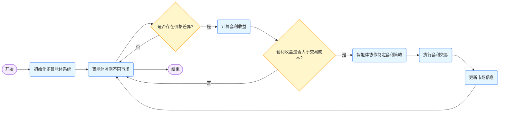

# 多智能体系统实现跨市场套利策略

> 关键词：多智能体系统、跨市场套利、策略实现、市场分析、智能决策

> 摘要：本文聚焦于利用多智能体系统实现跨市场套利策略。详细阐述了多智能体系统和跨市场套利的核心概念，深入分析了相关算法原理、数学模型及公式。通过项目实战展示了如何搭建开发环境、实现源代码并进行解读。探讨了该策略在实际市场中的应用场景，推荐了学习资源、开发工具框架以及相关论文著作。最后总结了未来发展趋势与挑战，并提供了常见问题解答和扩展阅读参考资料，旨在为研究者和开发者在多智能体系统实现跨市场套利策略方面提供全面而深入的指导。

## 1. 背景介绍 
### 1.1 目的和范围
跨市场套利是指利用不同市场之间的价格差异进行交易，以获取无风险或低风险利润的投资策略。在当今全球化的金融市场中，由于信息传递的不完全性、市场参与者的异质性等因素，不同市场上同一资产或相关资产的价格常常出现短暂的偏离。多智能体系统是一种由多个自主智能体组成的系统，这些智能体可以通过相互协作、通信和竞争来完成复杂的任务。本文章的目的在于研究如何运用多智能体系统来实现跨市场套利策略，通过智能体对不同市场的实时监测、分析和决策，捕捉套利机会并执行交易。文章的范围涵盖了多智能体系统的基本原理、跨市场套利的策略设计、相关算法的实现、实际应用案例以及未来发展趋势等方面。

### 1.2 预期读者
本文预期读者包括金融科技领域的研究者、开发者、量化投资分析师、金融市场从业者以及对多智能体系统和跨市场套利感兴趣的技术爱好者。这些读者具备一定的计算机编程基础、金融市场知识和数学建模能力，希望通过本文深入了解如何运用多智能体系统实现跨市场套利策略，并将相关技术应用到实际的投资决策中。

### 1.3 文档结构概述
本文将按照以下结构进行组织：首先介绍多智能体系统和跨市场套利的核心概念及其联系；接着详细阐述实现跨市场套利策略的核心算法原理和具体操作步骤，并使用 Python 源代码进行说明；然后介绍相关的数学模型和公式，并通过举例进行详细讲解；之后通过项目实战展示如何在实际中实现该策略，包括开发环境搭建、源代码实现和代码解读；再探讨该策略的实际应用场景；随后推荐相关的学习资源、开发工具框架和论文著作；最后总结未来发展趋势与挑战，提供常见问题解答和扩展阅读参考资料。

### 1.4 术语表
#### 1.4.1 核心术语定义
- **多智能体系统（Multi - Agent System，MAS）**：由多个自主智能体组成的系统，每个智能体具有一定的感知、决策和行动能力，它们通过相互协作、通信和竞争来完成共同的任务。
- **跨市场套利（Cross - Market Arbitrage）**：投资者利用不同市场上同一资产或相关资产的价格差异，同时在这些市场上进行相反方向的交易，以获取无风险或低风险利润的投资策略。
- **智能体（Agent）**：具有自主决策能力的实体，能够感知环境信息，根据自身的目标和规则进行决策，并采取相应的行动。
- **套利机会（Arbitrage Opportunity）**：不同市场之间存在的价格差异，使得投资者可以通过在低价市场买入、在高价市场卖出的方式获取利润。

#### 1.4.2 相关概念解释
- **市场效率（Market Efficiency）**：指市场价格反映所有可用信息的程度。在有效市场中，价格能够迅速调整以反映新的信息，套利机会很少出现；而在非有效市场中，价格可能会出现偏离，从而产生套利机会。
- **交易成本（Transaction Cost）**：包括佣金、手续费、印花税等在交易过程中产生的费用。在进行跨市场套利时，交易成本会影响套利的收益，只有当套利收益大于交易成本时，套利才是可行的。
- **信息不对称（Information Asymmetry）**：指市场参与者之间掌握的信息存在差异。信息优势方可以利用这种差异获取利润，而信息劣势方可能会做出错误的决策。多智能体系统可以通过信息共享和协作来减少信息不对称的影响。

#### 1.4.3 缩略词列表
- **MAS**：Multi - Agent System（多智能体系统）
- **API**：Application Programming Interface（应用程序编程接口）
- **GUI**：Graphical User Interface（图形用户界面）

## 2. 核心概念与联系 

### 2.1 多智能体系统原理
多智能体系统由多个智能体组成，每个智能体都有自己的目标、知识和行为规则。智能体可以感知周围环境的信息，根据自身的目标和规则进行决策，并采取相应的行动。智能体之间可以通过通信进行信息交换和协作，共同完成复杂的任务。

多智能体系统的架构可以分为集中式、分布式和混合式三种类型。集中式架构中，有一个中央控制智能体负责协调和管理其他智能体的行为；分布式架构中，智能体之间通过平等的通信和协作来完成任务，没有中央控制智能体；混合式架构则结合了集中式和分布式架构的特点。

### 2.2 跨市场套利原理
跨市场套利的基本原理是利用不同市场之间的价格差异。当同一资产或相关资产在不同市场上的价格出现偏离时，投资者可以在低价市场买入，在高价市场卖出，从而获取利润。例如，假设股票 A 在市场 X 的价格为 100 元，在市场 Y 的价格为 105 元，投资者可以在市场 X 买入股票 A，同时在市场 Y 卖出股票 A，每一股可以获得 5 元的利润。

跨市场套利可以分为空间套利和时间套利两种类型。空间套利是指利用不同地理位置的市场之间的价格差异进行套利；时间套利是指利用同一市场在不同时间的价格差异进行套利。

### 2.3 多智能体系统与跨市场套利的联系
多智能体系统可以为跨市场套利提供有效的支持。通过多智能体系统，每个智能体可以负责监测不同的市场，实时获取市场信息。智能体之间可以通过通信和协作，共享市场信息，分析套利机会，并共同制定和执行套利策略。例如，一个智能体可以负责监测市场 X 的价格，另一个智能体可以负责监测市场 Y 的价格，当两个智能体发现存在套利机会时，它们可以协作完成买入和卖出的交易操作。

### 2.4 核心概念的文本示意图
```plaintext
多智能体系统
├── 智能体 1（监测市场 X）
│   ├── 感知市场 X 信息
│   ├── 分析市场 X 价格
│   ├── 与其他智能体通信
│   └── 执行交易操作（买入或卖出）
├── 智能体 2（监测市场 Y）
│   ├── 感知市场 Y 信息
│   ├── 分析市场 Y 价格
│   ├── 与其他智能体通信
│   └── 执行交易操作（买入或卖出）
└── 智能体 n（可扩展）
    ├── 感知其他市场信息
    ├── 分析其他市场价格
    ├── 与其他智能体通信
    └── 执行交易操作（买入或卖出）

跨市场套利
├── 发现价格差异
│   ├── 市场 X 价格 < 市场 Y 价格
│   └── 市场 X 价格 > 市场 Y 价格
├── 计算套利收益
│   ├── 考虑交易成本
│   └── 确定可行套利机会
└── 执行套利交易
    ├── 在低价市场买入
    └── 在高价市场卖出

多智能体系统与跨市场套利的联系
├── 智能体协作发现套利机会
├── 信息共享支持套利决策
└── 共同执行套利交易操作
```

### 2.5 Mermaid 流程图


## 3. 核心算法原理 & 具体操作步骤 

### 3.1 核心算法原理
实现跨市场套利策略的核心算法主要包括市场监测算法、套利机会发现算法和交易执行算法。

#### 3.1.1 市场监测算法
市场监测算法的主要目的是实时获取不同市场的价格信息。可以通过调用金融市场的 API 来获取市场数据，例如股票价格、期货价格等。在 Python 中，可以使用第三方库如 `pandas-datareader` 来获取金融市场数据。

#### 3.1.2 套利机会发现算法
套利机会发现算法的核心是比较不同市场上同一资产或相关资产的价格，当价格差异超过一定阈值时，认为存在套利机会。可以使用简单的价格比较算法，也可以使用更复杂的统计套利算法，如协整分析等。

#### 3.1.3 交易执行算法
交易执行算法的作用是根据套利策略，在不同市场上执行买入和卖出的交易操作。可以通过调用金融交易平台的 API 来实现交易执行。在执行交易时，需要考虑交易成本、交易数量等因素。

### 3.2 具体操作步骤
#### 3.2.1 初始化多智能体系统
首先，需要创建多个智能体，并为每个智能体分配不同的任务，例如监测不同的市场。可以使用面向对象编程的思想，定义智能体类，并实例化多个智能体对象。

```python
class Agent:
    def __init__(self, market):
        self.market = market
        self.price = None

    def monitor_market(self):
        # 模拟获取市场价格
        # 实际应用中需要调用金融市场 API
        import random
        self.price = random.uniform(90, 110)
        print(f"Agent monitoring {self.market} market. Price: {self.price}")


# 初始化两个智能体，分别监测市场 X 和市场 Y
agent_x = Agent("X")
agent_y = Agent("Y")
```

#### 3.2.2 智能体监测市场
每个智能体根据自身的任务，定期监测所负责的市场，获取市场价格信息。

```python
agent_x.monitor_market()
agent_y.monitor_market()
```

#### 3.2.3 发现套利机会
比较不同智能体监测到的市场价格，判断是否存在套利机会。

```python
def find_arbitrage_opportunity(agent1, agent2):
    price1 = agent1.price
    price2 = agent2.price
    if price1 < price2:
        print(f"Arbitrage opportunity: Buy in {agent1.market} market and sell in {agent2.market} market.")
    elif price1 > price2:
        print(f"Arbitrage opportunity: Buy in {agent2.market} market and sell in {agent1.market} market.")
    else:
        print("No arbitrage opportunity.")


find_arbitrage_opportunity(agent_x, agent_y)
```

#### 3.2.4 执行套利交易
如果发现套利机会，智能体协作执行套利交易。在实际应用中，需要调用金融交易平台的 API 来完成交易操作。

```python
def execute_arbitrage(agent1, agent2):
    price1 = agent1.price
    price2 = agent2.price
    if price1 < price2:
        print(f"Buying in {agent1.market} market and selling in {agent2.market} market.")
        # 实际应用中调用交易平台 API 进行买入和卖出操作
    elif price1 > price2:
        print(f"Buying in {agent2.market} market and selling in {agent1.market} market.")
        # 实际应用中调用交易平台 API 进行买入和卖出操作


execute_arbitrage(agent_x, agent_y)
```

## 4. 数学模型和公式 & 详细讲解 & 举例说明 

### 4.1 基本套利收益公式
设 $P_1$ 为市场 1 上资产的价格，$P_2$ 为市场 2 上同一资产的价格，$C$ 为交易成本（包括买入和卖出的手续费、印花税等）。则套利收益 $R$ 的计算公式为：

$$R = |P_1 - P_2| - C$$

当 $R > 0$ 时，存在套利机会；当 $R \leq 0$ 时，套利不可行。

### 4.2 考虑交易数量的套利收益公式
设 $Q$ 为交易数量，则考虑交易数量后的套利收益 $R_Q$ 的计算公式为：

$$R_Q = Q \times (|P_1 - P_2| - C)$$

### 4.3 详细讲解
- **价格差异**：$|P_1 - P_2|$ 表示两个市场上资产价格的差异，这是套利的基础。只有当价格差异足够大时，才有可能覆盖交易成本并获得利润。
- **交易成本**：$C$ 是在交易过程中产生的费用，包括佣金、手续费、印花税等。交易成本会直接影响套利的收益，因此在进行套利决策时需要准确估算交易成本。
- **交易数量**：$Q$ 表示交易的资产数量。交易数量的选择需要考虑多个因素，如资金规模、市场流动性等。在实际应用中，需要根据具体情况合理确定交易数量，以最大化套利收益。

### 4.4 举例说明
假设股票 A 在市场 X 的价格 $P_X = 100$ 元，在市场 Y 的价格 $P_Y = 105$ 元，交易成本 $C = 1$ 元/股。

#### 4.4.1 不考虑交易数量的套利收益
根据基本套利收益公式 $R = |P_X - P_Y| - C$，可得：

$$R = |100 - 105| - 1 = 5 - 1 = 4$$

由于 $R > 0$，存在套利机会。投资者可以在市场 X 买入股票 A，在市场 Y 卖出股票 A，每股可获得 4 元的利润。

#### 4.4.2 考虑交易数量的套利收益
假设投资者决定交易的数量 $Q = 1000$ 股，则根据考虑交易数量的套利收益公式 $R_Q = Q \times (|P_X - P_Y| - C)$，可得：

$$R_Q = 1000 \times (|100 - 105| - 1) = 1000 \times 4 = 4000$$

投资者进行 1000 股的套利交易，可获得 4000 元的利润。

## 5. 项目实战：代码实际案例和详细解释说明 

### 5.1  开发环境搭建
#### 5.1.1 安装 Python
首先需要安装 Python 开发环境。可以从 Python 官方网站（https://www.python.org/downloads/）下载适合自己操作系统的 Python 版本，并按照安装向导进行安装。建议安装 Python 3.7 及以上版本。

#### 5.1.2 安装必要的库
在项目中，需要使用一些第三方库来获取金融市场数据和进行数据分析。可以使用 `pip` 命令来安装这些库：

```bash
pip install pandas pandas-datareader numpy matplotlib
```

- `pandas`：用于数据处理和分析。
- `pandas-datareader`：用于获取金融市场数据。
- `numpy`：用于数值计算。
- `matplotlib`：用于数据可视化。

#### 5.1.3 注册金融市场 API
为了获取金融市场数据，需要注册相应的金融市场 API。例如，可以注册雅虎财经 API，它提供了丰富的金融市场数据。注册完成后，获取 API 密钥，以便在代码中使用。

### 5.2  源代码详细实现和代码解读
#### 5.2.1 完整代码示例
```python
import pandas as pd
import pandas_datareader.data as web
import numpy as np
import matplotlib.pyplot as plt


class Agent:
    def __init__(self, market, symbol):
        self.market = market
        self.symbol = symbol
        self.price = None

    def monitor_market(self, start_date, end_date):
        try:
            # 使用 pandas-datareader 获取金融市场数据
            df = web.DataReader(self.symbol, 'yahoo', start_date, end_date)
            self.price = df['Close'].iloc[-1]
            print(f"Agent monitoring {self.market} market. Symbol: {self.symbol}, Price: {self.price}")
        except Exception as e:
            print(f"Error getting data for {self.market} market: {e}")


def find_arbitrage_opportunity(agent1, agent2, transaction_cost):
    price1 = agent1.price
    price2 = agent2.price
    if price1 is not None and price2 is not None:
        arbitrage_profit = abs(price1 - price2) - transaction_cost
        if arbitrage_profit > 0:
            if price1 < price2:
                print(f"Arbitrage opportunity: Buy in {agent1.market} market and sell in {agent2.market} market.")
            else:
                print(f"Arbitrage opportunity: Buy in {agent2.market} market and sell in {agent1.market} market.")
        else:
            print("No arbitrage opportunity.")
    else:
        print("Unable to calculate arbitrage opportunity due to missing price data.")


def execute_arbitrage(agent1, agent2, transaction_cost, quantity):
    price1 = agent1.price
    price2 = agent2.price
    if price1 is not None and price2 is not None:
        arbitrage_profit = abs(price1 - price2) - transaction_cost
        if arbitrage_profit > 0:
            if price1 < price2:
                print(f"Buying {quantity} shares in {agent1.market} market and selling {quantity} shares in {agent2.market} market.")
                total_profit = quantity * arbitrage_profit
                print(f"Estimated total profit: {total_profit}")
            else:
                print(f"Buying {quantity} shares in {agent2.market} market and selling {quantity} shares in {agent1.market} market.")
                total_profit = quantity * arbitrage_profit
                print(f"Estimated total profit: {total_profit}")
        else:
            print("No arbitrage opportunity to execute.")
    else:
        print("Unable to execute arbitrage due to missing price data.")


if __name__ == "__main__":
    # 初始化两个智能体，分别监测不同市场的同一只股票
    agent_x = Agent("X", "AAPL")
    agent_y = Agent("Y", "AAPL")

    # 设置数据获取的时间范围
    start_date = '2023-01-01'
    end_date = '2023-12-31'

    # 智能体监测市场
    agent_x.monitor_market(start_date, end_date)
    agent_y.monitor_market(start_date, end_date)

    # 设定交易成本
    transaction_cost = 1

    # 发现套利机会
    find_arbitrage_opportunity(agent_x, agent_y, transaction_cost)

    # 设定交易数量
    quantity = 100

    # 执行套利交易
    execute_arbitrage(agent_x, agent_y, transaction_cost, quantity)

    # 数据可视化
    df_x = web.DataReader(agent_x.symbol, 'yahoo', start_date, end_date)
    df_y = web.DataReader(agent_y.symbol, 'yahoo', start_date, end_date)

    plt.figure(figsize=(12, 6))
    plt.plot(df_x['Close'], label=f"{agent_x.market} market")
    plt.plot(df_y['Close'], label=f"{agent_y.market} market")
    plt.title(f"Stock Price Comparison in {agent_x.market} and {agent_y.market} Markets")
    plt.xlabel("Date")
    plt.ylabel("Price")
    plt.legend()
    plt.show()
```

#### 5.2.2 代码解读
- **Agent 类**：定义了智能体类，每个智能体负责监测一个市场上的特定资产。`__init__` 方法用于初始化智能体的属性，包括市场名称、资产代码和价格。`monitor_market` 方法用于获取指定时间范围内的市场价格数据，并将最新的收盘价赋值给 `self.price`。
- **find_arbitrage_opportunity 函数**：用于判断是否存在套利机会。通过比较两个智能体监测到的价格，计算套利收益，并考虑交易成本。如果套利收益大于 0，则认为存在套利机会，并输出相应的信息。
- **execute_arbitrage 函数**：根据套利机会执行套利交易。如果存在套利机会，根据交易数量计算总利润，并输出交易信息和估计的总利润。
- **主程序**：初始化两个智能体，分别监测市场 X 和市场 Y 上的苹果公司股票（AAPL）。设置数据获取的时间范围，调用智能体的 `monitor_market` 方法获取市场价格数据。设定交易成本和交易数量，调用 `find_arbitrage_opportunity` 函数发现套利机会，调用 `execute_arbitrage` 函数执行套利交易。最后，使用 `matplotlib` 库将两个市场的股票价格进行可视化展示。

### 5.3  代码解读与分析
#### 5.3.1 优点
- **模块化设计**：代码采用了模块化设计，将不同的功能封装在不同的类和函数中，提高了代码的可读性和可维护性。
- **数据获取方便**：使用 `pandas-datareader` 库可以方便地获取金融市场数据，减少了数据处理的工作量。
- **可视化展示**：使用 `matplotlib` 库将市场价格数据进行可视化展示，有助于直观地观察不同市场上资产价格的变化趋势。

#### 5.3.2 不足之处
- **模拟交易**：代码中的交易执行部分只是模拟输出交易信息，并没有真正调用金融交易平台的 API 进行实际交易。在实际应用中，需要实现与交易平台的对接。
- **简单套利策略**：代码中使用的套利策略比较简单，只是基于价格差异进行判断。在实际市场中，可能需要使用更复杂的统计套利算法，如协整分析等。
- **异常处理不完善**：代码中的异常处理比较简单，只是简单地输出错误信息。在实际应用中，需要更完善的异常处理机制，以确保程序的稳定性。

## 6. 实际应用场景 
### 6.1 股票市场跨市场套利
在不同国家或地区的股票市场中，同一公司的股票可能会出现价格差异。例如，一家中国公司的股票同时在上海证券交易所和香港证券交易所上市，由于两个市场的投资者结构、交易规则、信息传递等因素的不同，股票价格可能会出现短暂的偏离。投资者可以利用多智能体系统实时监测两个市场的股票价格，发现套利机会并执行交易。

### 6.2 期货市场跨市场套利
期货市场中，不同交易所的同一期货品种或相关期货品种的价格也可能存在差异。例如，上海期货交易所的铜期货和伦敦金属交易所的铜期货，由于国内外市场供需关系、汇率波动等因素的影响，价格可能会出现不一致。投资者可以通过多智能体系统对两个市场的期货价格进行监测和分析，捕捉套利机会。

### 6.3 外汇市场跨市场套利
外汇市场是全球最大的金融市场之一，不同外汇交易平台上的货币对汇率可能会存在微小的差异。投资者可以利用多智能体系统同时监测多个外汇交易平台的汇率，当发现某一货币对在不同平台上的汇率存在差异时，进行套利交易。

### 6.4 加密货币市场跨市场套利
加密货币市场具有高度的波动性和分散性，不同加密货币交易平台上的同一加密货币价格可能会出现较大的差异。多智能体系统可以实时监测多个加密货币交易平台的价格，发现套利机会并迅速执行交易。由于加密货币市场的交易速度快、价格波动大，多智能体系统的实时性和智能决策能力可以为投资者带来更多的套利机会。

## 7. 工具和资源推荐
### 7.1 学习资源推荐
#### 7.1.1 书籍推荐
- 《多智能体系统：原理与编程》：本书全面介绍了多智能体系统的基本原理、设计方法和编程实现，适合初学者系统地学习多智能体系统的知识。
- 《量化投资：策略与技术》：详细讲解了量化投资的各种策略和技术，包括跨市场套利策略，对于理解和应用跨市场套利具有重要的参考价值。
- 《金融市场技术分析》：介绍了金融市场的技术分析方法，如价格走势分析、指标分析等，有助于投资者更好地分析市场行情，发现套利机会。

#### 7.1.2 在线课程
- Coursera 上的“Multi - Agent Systems”课程：由知名高校的教授授课，系统地介绍了多智能体系统的理论和实践，通过在线视频、作业和讨论等方式进行学习。
- edX 上的“Quantitative Finance”课程：涵盖了量化投资的各个方面，包括跨市场套利策略的设计和实现，课程内容丰富，讲解详细。
- 网易云课堂上的“Python 金融数据分析与挖掘实战”课程：通过实际案例介绍了如何使用 Python 进行金融数据分析和挖掘，对于实现跨市场套利策略的编程部分有很大的帮助。

#### 7.1.3 技术博客和网站
- Medium 上的金融科技博客：有很多专业的金融科技博主分享关于多智能体系统、量化投资、跨市场套利等方面的技术文章和实践经验。
- 金融界网站：提供了丰富的金融市场数据和资讯，以及一些关于投资策略的分析文章，有助于了解市场动态和套利机会。
- 量化投资论坛：聚集了众多量化投资爱好者和从业者，在论坛上可以交流经验、分享代码和讨论问题。

### 7.2 开发工具框架推荐
#### 7.2.1 IDE和编辑器
- PyCharm：一款专业的 Python 集成开发环境，具有代码自动补全、调试、版本控制等功能，适合开发复杂的 Python 项目。
- Jupyter Notebook：一种交互式的开发环境，可以将代码、文本、图表等内容集成在一个文档中，方便进行数据分析和实验。
- Visual Studio Code：一款轻量级的代码编辑器，支持多种编程语言，具有丰富的插件扩展功能，可以根据需要安装 Python 相关的插件，提高开发效率。

#### 7.2.2 调试和性能分析工具
- pdb：Python 自带的调试工具，可以在代码中设置断点，逐步执行代码，查看变量的值和程序的执行流程，帮助定位和解决问题。
- cProfile：Python 标准库中的性能分析工具，可以分析代码的运行时间和函数调用次数，找出代码中的性能瓶颈。
- Py-Spy：一个用于分析 Python 程序性能的工具，可以实时监测 Python 程序的 CPU 使用率和函数调用情况，生成性能分析报告。

#### 7.2.3 相关框架和库
- Mesa：一个用于构建基于代理的模型的 Python 框架，提供了丰富的代理类和交互机制，方便开发多智能体系统。
- zipline：一个开源的 Python 量化交易回测框架，可以用于测试和优化跨市场套利策略，支持多种数据源和交易接口。
- TA - Lib：一个广泛使用的技术分析库，提供了各种技术指标的计算函数，如移动平均线、相对强弱指标等，有助于进行市场行情分析。

### 7.3 相关论文著作推荐
#### 7.3.1 经典论文
- “Multi - Agent Systems: A Modern Approach to Distributed Artificial Intelligence”：该论文系统地介绍了多智能体系统的理论和方法，是多智能体系统领域的经典之作。
- “Arbitrage Pricing Theory”：提出了套利定价理论，为跨市场套利策略的设计提供了理论基础。
- “Cointegration and Error Correction: Representation, Estimation, and Testing”：介绍了协整分析的方法和应用，对于利用协整关系进行跨市场套利具有重要的指导意义。

#### 7.3.2 最新研究成果
- 在 IEEE Transactions on Intelligent Systems、Journal of Financial Economics 等学术期刊上，经常发表关于多智能体系统和跨市场套利的最新研究成果。可以通过学术数据库如 IEEE Xplore、ScienceDirect 等查找相关论文。
- 参加国际学术会议如 AAMAS（International Conference on Autonomous Agents and Multi - agent Systems）、WIFS（Workshop on Information Forensics and Security）等，了解该领域的最新研究动态和发展趋势。

#### 7.3.3 应用案例分析
- 一些金融机构和量化投资公司会发布关于跨市场套利策略的应用案例分析报告。可以通过它们的官方网站或专业的金融资讯平台获取这些报告，学习实际应用中的经验和技巧。
- 一些量化投资比赛的获奖作品中也包含了跨市场套利策略的应用案例。可以通过比赛官网或相关论坛查找这些作品，进行学习和借鉴。

## 8. 总结：未来发展趋势与挑战
### 8.1 未来发展趋势
#### 8.1.1 智能化程度不断提高
随着人工智能技术的不断发展，多智能体系统的智能化程度将不断提高。智能体将具备更强的学习能力、推理能力和决策能力，能够自动适应市场环境的变化，优化套利策略。例如，智能体可以通过深度学习算法对大量的市场数据进行分析和学习，发现潜在的套利机会和市场规律。

#### 8.1.2 与区块链技术融合
区块链技术具有去中心化、不可篡改、安全可靠等特点，将多智能体系统与区块链技术融合，可以提高跨市场套利交易的安全性和透明度。例如，利用区块链技术记录交易信息，确保交易的真实性和可追溯性；通过智能合约实现自动化的交易执行，减少人为干预和交易风险。

#### 8.1.3 跨市场范围不断扩大
随着全球金融市场的不断融合和发展，跨市场套利的范围将不断扩大。不仅可以在传统的股票、期货、外汇市场进行套利，还可以拓展到新兴的金融市场，如数字货币市场、碳交易市场等。多智能体系统将能够同时监测和分析多个不同类型市场的信息，发现更多的套利机会。

### 8.2 挑战
#### 8.2.1 市场复杂性和不确定性
金融市场具有高度的复杂性和不确定性，价格波动受到多种因素的影响，如宏观经济数据、政策变化、突发事件等。多智能体系统需要具备更强的应对能力，能够准确地分析和预测市场变化，及时调整套利策略。同时，市场的复杂性也增加了套利机会的发现和判断难度。

#### 8.2.2 交易成本和流动性问题
交易成本是影响跨市场套利收益的重要因素之一。在不同市场进行交易时，需要考虑佣金、手续费、印花税等多种成本。此外，市场的流动性也会影响套利交易的执行。如果市场流动性不足，可能会导致交易无法及时成交，或者成交价格与预期价格存在较大差异，从而影响套利收益。

#### 8.2.3 法律法规和监管问题
不同国家和地区的金融市场有不同的法律法规和监管政策，跨市场套利需要遵守这些规定。在进行跨市场套利时，可能会面临法律法规的限制和监管的风险。例如，一些国家对跨境资本流动有严格的管制，可能会影响套利交易的执行。

## 9. 附录：常见问题与解答
### 9.1 多智能体系统如何保证信息的准确性和及时性？
多智能体系统可以通过多种方式保证信息的准确性和及时性。首先，智能体可以使用可靠的数据源，如金融市场的官方 API 或专业的数据提供商，确保获取的市场信息准确无误。其次，智能体可以定期更新信息，设置合理的监测频率，及时捕捉市场的变化。此外，智能体之间可以通过通信和协作，共享信息，互相验证和补充，提高信息的准确性和完整性。

### 9.2 跨市场套利策略是否一定能获得利润？
跨市场套利策略并不是一定能获得利润的。虽然套利的基本原理是利用市场价格差异获取无风险或低风险利润，但在实际操作中，存在多种因素会影响套利收益。例如，市场价格的波动可能会导致价格差异瞬间消失，交易成本可能会抵消套利收益，市场流动性不足可能会导致交易无法及时成交等。因此，在实施跨市场套利策略时，需要充分考虑各种风险因素，进行合理的风险控制。

### 9.3 如何选择合适的交易数量？
选择合适的交易数量需要考虑多个因素。首先，要考虑资金规模，交易数量不能超过自己的资金承受能力。其次，要考虑市场流动性，如果市场流动性不足，交易数量过大可能会导致价格波动，影响套利收益。此外，还可以根据套利机会的大小和风险程度来调整交易数量。一般来说，套利机会越大、风险越小，可以适当增加交易数量；反之，则应减少交易数量。

### 9.4 多智能体系统的开发难度大吗？
多智能体系统的开发难度相对较大，需要具备一定的计算机编程基础、人工智能知识和金融市场知识。开发过程中需要涉及到智能体的设计、通信协议的实现、算法的优化等多个方面。但是，随着相关技术的不断发展和开源框架的出现，开发难度也在逐渐降低。可以利用现有的开源框架，如 Mesa 等，快速搭建多智能体系统的开发环境，减少开发工作量。

## 10. 扩展阅读 & 参考资料
### 10.1 扩展阅读
- 《人工智能：一种现代的方法》：全面介绍了人工智能的基本概念、方法和技术，对于理解多智能体系统的原理和实现有很大的帮助。
- 《金融计量学：从基础到高级建模技术》：深入讲解了金融计量学的理论和方法，包括时间序列分析、协整分析等，有助于进一步研究跨市场套利的数学模型和算法。
- 《算法交易与人工智能》：结合算法交易和人工智能技术，介绍了如何利用人工智能算法进行交易决策和策略优化，为跨市场套利策略的设计提供了新的思路。

### 10.2 参考资料
- 金融市场官方网站，如上海证券交易所（https://www.sse.com.cn/）、香港证券交易所（https://www.hkex.com.hk/）等，获取市场数据和交易规则。
- 开源代码库，如 GitHub（https://github.com/），查找多智能体系统和量化投资相关的开源项目和代码示例。
- 学术数据库，如 IEEE Xplore（https://ieeexplore.ieee.org/）、ScienceDirect（https://www.sciencedirect.com/）等，查找相关的学术论文和研究报告。

作者：AI天才研究院/AI Genius Institute & 禅与计算机程序设计艺术 /Zen And The Art of Computer Programming