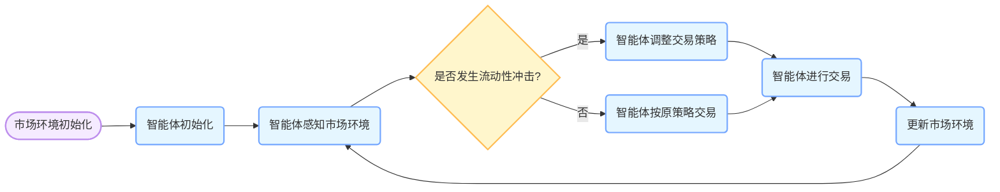

# 多智能体系统模拟市场流动性冲击

> 关键词：多智能体系统、市场流动性冲击、金融模拟、交易策略、复杂系统

> 摘要：本文聚焦于使用多智能体系统模拟市场流动性冲击这一重要课题。通过构建多智能体系统，我们能够深入研究金融市场中不同参与者的行为及其相互作用，从而模拟流动性冲击对市场的影响。文章详细介绍了多智能体系统的核心概念、算法原理、数学模型，并结合实际案例展示了如何进行模拟。同时，探讨了该模拟在实际金融市场中的应用场景，推荐了相关的学习资源、开发工具和论文著作。最后，对多智能体系统模拟市场流动性冲击的未来发展趋势与挑战进行了总结。

## 1. 背景介绍 
### 1.1 目的和范围
金融市场的流动性是市场健康运行的关键因素之一。流动性冲击可能导致市场价格剧烈波动、交易成本增加，甚至引发系统性风险。传统的金融理论往往基于简化的假设，难以准确描述市场参与者的复杂行为和相互作用。多智能体系统（Multi-Agent System，MAS）为研究金融市场提供了一种新的视角，它可以模拟不同类型的市场参与者，考虑他们的异质性、适应性和相互作用，从而更真实地反映市场的动态变化。

本文的目的是介绍如何使用多智能体系统模拟市场流动性冲击。具体范围包括多智能体系统的核心概念、算法原理、数学模型，以及如何在实际项目中实现模拟。我们将通过详细的代码示例和实际应用场景，帮助读者深入理解和掌握这一技术。

### 1.2 预期读者
本文预期读者包括金融领域的研究人员、量化分析师、算法交易员，以及对复杂系统模拟和人工智能在金融领域应用感兴趣的计算机科学专业人士。读者需要具备一定的编程基础（特别是Python）和金融市场基础知识。

### 1.3 文档结构概述
本文将按照以下结构进行组织：
- 核心概念与联系：介绍多智能体系统和市场流动性冲击的基本概念，以及它们之间的联系。
- 核心算法原理 & 具体操作步骤：详细讲解多智能体系统模拟市场流动性冲击的算法原理，并给出Python代码实现。
- 数学模型和公式 & 详细讲解 & 举例说明：介绍用于描述市场流动性和多智能体行为的数学模型和公式，并通过具体例子进行说明。
- 项目实战：代码实际案例和详细解释说明：展示一个完整的多智能体系统模拟市场流动性冲击的项目，包括开发环境搭建、源代码实现和代码解读。
- 实际应用场景：探讨多智能体系统模拟市场流动性冲击在实际金融市场中的应用场景。
- 工具和资源推荐：推荐相关的学习资源、开发工具和论文著作。
- 总结：未来发展趋势与挑战：总结多智能体系统模拟市场流动性冲击的发展趋势和面临的挑战。
- 附录：常见问题与解答：解答读者在学习和实践过程中可能遇到的常见问题。
- 扩展阅读 & 参考资料：提供进一步学习和研究的扩展阅读材料和参考资料。

### 1.4 术语表
#### 1.4.1 核心术语定义
- **多智能体系统（Multi-Agent System，MAS）**：由多个自主智能体组成的系统，这些智能体可以感知环境、做出决策并与其他智能体进行交互。
- **市场流动性**：指资产能够以合理价格迅速买卖的能力。流动性高意味着市场上有大量的买卖订单，交易成本低；流动性低则反之。
- **流动性冲击**：指由于某种原因导致市场流动性突然下降的情况，可能引发市场价格的剧烈波动。
- **智能体（Agent）**：在多智能体系统中，具有自主决策能力的个体，代表市场中的参与者，如投资者、交易员等。

#### 1.4.2 相关概念解释
- **异质性**：市场参与者具有不同的特征、偏好和行为模式。在多智能体系统中，不同的智能体可以具有不同的交易策略、风险偏好等。
- **适应性**：智能体能够根据市场环境的变化调整自己的行为。例如，当市场流动性下降时，智能体可以改变交易策略以降低风险。
- **相互作用**：智能体之间通过交易、信息传递等方式相互影响。这种相互作用是多智能体系统模拟市场动态的关键。

#### 1.4.3 缩略词列表
- **MAS**：Multi-Agent System（多智能体系统）
- **AI**：Artificial Intelligence（人工智能）
- **ML**：Machine Learning（机器学习）

## 2. 核心概念与联系 
### 2.1 多智能体系统的基本概念
多智能体系统是一种分布式人工智能系统，由多个自主智能体组成。每个智能体都有自己的目标、知识和能力，能够感知环境并做出决策。智能体之间可以通过通信和交互来协调行动，以实现共同的目标或解决复杂的问题。

在金融市场中，多智能体系统可以用来模拟不同类型的市场参与者，如投资者、交易员、做市商等。每个智能体都可以根据自己的交易策略和市场信息进行交易决策，通过与其他智能体的交互，形成市场的动态变化。

### 2.2 市场流动性冲击的概念
市场流动性冲击是指由于某种原因导致市场流动性突然下降的情况。这种冲击可能由多种因素引起，如宏观经济数据的意外发布、重大政策变化、金融机构的倒闭等。流动性冲击会导致市场价格的剧烈波动，增加交易成本，甚至可能引发系统性风险。

### 2.3 多智能体系统与市场流动性冲击的联系
多智能体系统可以用来模拟市场流动性冲击的形成和传播过程。通过构建不同类型的智能体，考虑它们的异质性、适应性和相互作用，我们可以更真实地反映市场参与者在流动性冲击下的行为和决策。例如，当市场出现流动性冲击时，一些智能体可能会选择卖出资产以降低风险，而另一些智能体可能会选择观望或买入资产以获取利润。这些智能体的行为相互影响，进一步加剧或缓解了流动性冲击的影响。

### 2.4 核心概念原理和架构的文本示意图
```plaintext
多智能体系统模拟市场流动性冲击架构

|----------------------|
|  市场环境（价格、交易量等） |
|----------------------|
        ^       |
        |       v
|----------------------|
|  智能体集合（投资者、交易员等） |
|----------------------|
        |       ^
        |       |
|----------------------|
|  智能体交互（交易、信息传递） |
|----------------------|
```

### 2.5 Mermaid 流程图


## 3. 核心算法原理 & 具体操作步骤 
### 3.1 核心算法原理
多智能体系统模拟市场流动性冲击的核心算法原理是基于智能体的感知、决策和交互过程。具体步骤如下：
1. **环境初始化**：设置市场的初始状态，包括资产价格、交易量、流动性等。
2. **智能体初始化**：创建不同类型的智能体，为每个智能体分配初始资产和交易策略。
3. **感知市场环境**：每个智能体感知当前的市场环境，包括价格、交易量、流动性等信息。
4. **决策**：智能体根据自己的交易策略和感知到的市场信息，做出交易决策，如买入、卖出或持有资产。
5. **交互**：智能体之间进行交易和信息传递，根据交易结果更新自己的资产和状态。
6. **更新市场环境**：根据智能体的交易行为，更新市场的价格、交易量和流动性等信息。
7. **重复步骤3 - 6**：直到达到模拟的终止条件。

### 3.2 具体操作步骤及Python代码实现
以下是一个简单的多智能体系统模拟市场流动性冲击的Python代码示例：

```python
import random

# 市场环境类
class MarketEnvironment:
    def __init__(self, initial_price, initial_volume, initial_liquidity):
        self.price = initial_price
        self.volume = initial_volume
        self.liquidity = initial_liquidity

    def update(self, buy_orders, sell_orders):
        # 简单的价格更新规则：根据买卖订单的数量调整价格
        net_orders = sum(buy_orders) - sum(sell_orders)
        if net_orders > 0:
            self.price += 0.1
        elif net_orders < 0:
            self.price -= 0.1

        # 更新交易量
        self.volume = sum(buy_orders) + sum(sell_orders)

        # 简单的流动性更新规则：根据交易量调整流动性
        if self.volume > 10:
            self.liquidity -= 0.1
        else:
            self.liquidity += 0.1

# 智能体类
class Agent:
    def __init__(self, id, initial_assets):
        self.id = id
        self.assets = initial_assets
        self.strategy = random.choice(['buy', 'sell', 'hold'])

    def perceive(self, market):
        self.market_price = market.price
        self.market_liquidity = market.liquidity

    def decide(self):
        if self.strategy == 'buy':
            return 1
        elif self.strategy == 'sell':
            return -1
        else:
            return 0

# 模拟函数
def simulate(market, agents, num_steps):
    for step in range(num_steps):
        buy_orders = []
        sell_orders = []

        # 智能体感知市场环境并做出决策
        for agent in agents:
            agent.perceive(market)
            order = agent.decide()
            if order > 0:
                buy_orders.append(order)
            elif order < 0:
                sell_orders.append(-order)

        # 更新市场环境
        market.update(buy_orders, sell_orders)

        print(f"Step {step}: Price = {market.price}, Volume = {market.volume}, Liquidity = {market.liquidity}")

# 初始化市场环境和智能体
market = MarketEnvironment(100, 0, 1.0)
agents = [Agent(i, 100) for i in range(10)]

# 进行模拟
simulate(market, agents, 10)
```

### 3.3 代码解释
- **MarketEnvironment类**：表示市场环境，包括资产价格、交易量和流动性。`update`方法根据买卖订单的数量更新市场价格、交易量和流动性。
- **Agent类**：表示智能体，每个智能体有自己的ID、初始资产和交易策略。`perceive`方法让智能体感知市场环境，`decide`方法根据交易策略做出交易决策。
- **simulate函数**：模拟市场的运行过程，包括智能体的感知、决策和市场环境的更新。

## 4. 数学模型和公式 & 详细讲解 & 举例说明 
### 4.1 市场流动性的数学模型
市场流动性可以用多种指标来衡量，如买卖价差、交易量、市场深度等。这里我们使用一个简单的流动性指标 $L$ 来表示市场的流动性，它的取值范围在 $[0, 1]$ 之间，$L$ 越接近 1 表示市场流动性越高，$L$ 越接近 0 表示市场流动性越低。

假设市场在时刻 $t$ 的买卖订单数量分别为 $B_t$ 和 $S_t$，则市场流动性 $L_t$ 的更新公式为：

$$L_{t+1} = L_t + \alpha \times \frac{B_t - S_t}{B_t + S_t}$$

其中，$\alpha$ 是一个调整系数，用于控制流动性的变化速度。

### 4.2 智能体交易决策的数学模型
智能体的交易决策可以基于多种因素，如市场价格、流动性、自身资产等。这里我们假设智能体的交易决策取决于市场价格和流动性，使用一个简单的线性模型来表示：

$$D_i = \beta_1 \times P_t + \beta_2 \times L_t + \epsilon_i$$

其中，$D_i$ 是智能体 $i$ 的交易决策（$D_i > 0$ 表示买入，$D_i < 0$ 表示卖出，$D_i = 0$ 表示持有），$P_t$ 是市场在时刻 $t$ 的价格，$L_t$ 是市场在时刻 $t$ 的流动性，$\beta_1$ 和 $\beta_2$ 是模型的参数，$\epsilon_i$ 是一个随机噪声项，用于模拟智能体的不确定性。

### 4.3 举例说明
假设市场在时刻 $t$ 的价格 $P_t = 100$，流动性 $L_t = 0.8$，智能体 $i$ 的模型参数 $\beta_1 = 0.1$，$\beta_2 = 0.2$，随机噪声项 $\epsilon_i = 0.05$。则智能体 $i$ 的交易决策为：

$$D_i = 0.1 \times 100 + 0.2 \times 0.8 + 0.05 = 10 + 0.16 + 0.05 = 10.21 > 0$$

因此，智能体 $i$ 会选择买入资产。

## 5. 项目实战：代码实际案例和详细解释说明 
### 5.1  开发环境搭建
#### 5.1.1 安装Python
首先，确保你已经安装了Python 3.x 版本。你可以从Python官方网站（https://www.python.org/downloads/） 下载并安装Python。

#### 5.1.2 安装必要的库
本项目使用了Python的标准库，不需要额外安装其他库。如果需要进行更复杂的数据分析和可视化，可以安装`numpy`、`pandas`和`matplotlib`等库。可以使用以下命令进行安装：

```sh
pip install numpy pandas matplotlib
```

### 5.2  源代码详细实现和代码解读
以下是一个更完整的多智能体系统模拟市场流动性冲击的Python代码示例：

```python
import random
import numpy as np
import matplotlib.pyplot as plt

# 市场环境类
class MarketEnvironment:
    def __init__(self, initial_price, initial_volume, initial_liquidity, alpha):
        self.price = initial_price
        self.volume = initial_volume
        self.liquidity = initial_liquidity
        self.alpha = alpha

    def update(self, buy_orders, sell_orders):
        # 简单的价格更新规则：根据买卖订单的数量调整价格
        net_orders = sum(buy_orders) - sum(sell_orders)
        if net_orders > 0:
            self.price += 0.1
        elif net_orders < 0:
            self.price -= 0.1

        # 更新交易量
        self.volume = sum(buy_orders) + sum(sell_orders)

        # 更新流动性
        if self.volume > 0:
            self.liquidity += self.alpha * (sum(buy_orders) - sum(sell_orders)) / self.volume
            self.liquidity = np.clip(self.liquidity, 0, 1)

# 智能体类
class Agent:
    def __init__(self, id, initial_assets, beta1, beta2):
        self.id = id
        self.assets = initial_assets
        self.beta1 = beta1
        self.beta2 = beta2

    def perceive(self, market):
        self.market_price = market.price
        self.market_liquidity = market.liquidity

    def decide(self):
        epsilon = random.uniform(-0.1, 0.1)
        decision = self.beta1 * self.market_price + self.beta2 * self.market_liquidity + epsilon
        if decision > 0:
            return 1
        elif decision < 0:
            return -1
        else:
            return 0

# 模拟函数
def simulate(market, agents, num_steps):
    prices = []
    volumes = []
    liquidities = []

    for step in range(num_steps):
        buy_orders = []
        sell_orders = []

        # 智能体感知市场环境并做出决策
        for agent in agents:
            agent.perceive(market)
            order = agent.decide()
            if order > 0:
                buy_orders.append(order)
            elif order < 0:
                sell_orders.append(-order)

        # 更新市场环境
        market.update(buy_orders, sell_orders)

        prices.append(market.price)
        volumes.append(market.volume)
        liquidities.append(market.liquidity)

    return prices, volumes, liquidities

# 初始化市场环境和智能体
initial_price = 100
initial_volume = 0
initial_liquidity = 0.8
alpha = 0.1
beta1 = 0.1
beta2 = 0.2
num_agents = 20
num_steps = 100

market = MarketEnvironment(initial_price, initial_volume, initial_liquidity, alpha)
agents = [Agent(i, 100, beta1, beta2) for i in range(num_agents)]

# 进行模拟
prices, volumes, liquidities = simulate(market, agents, num_steps)

# 可视化结果
plt.figure(figsize=(12, 8))

plt.subplot(3, 1, 1)
plt.plot(prices)
plt.title('Market Price')
plt.xlabel('Step')
plt.ylabel('Price')

plt.subplot(3, 1, 2)
plt.plot(volumes)
plt.title('Trading Volume')
plt.xlabel('Step')
plt.ylabel('Volume')

plt.subplot(3, 1, 3)
plt.plot(liquidities)
plt.title('Market Liquidity')
plt.xlabel('Step')
plt.ylabel('Liquidity')

plt.tight_layout()
plt.show()
```

### 5.3  代码解读与分析
- **MarketEnvironment类**：与之前的代码相比，增加了一个参数 $\alpha$ 用于控制流动性的变化速度。`update`方法中，使用了更复杂的流动性更新公式，并使用`np.clip`函数确保流动性的取值范围在 $[0, 1]$ 之间。
- **Agent类**：增加了两个参数 $\beta_1$ 和 $\beta_2$ 用于表示交易决策模型的参数。`decide`方法中，引入了一个随机噪声项 $\epsilon$ 来模拟智能体的不确定性。
- **simulate函数**：记录了每个时间步的市场价格、交易量和流动性，并返回这些数据用于可视化。
- **可视化部分**：使用`matplotlib`库将市场价格、交易量和流动性的变化情况进行可视化，方便观察市场的动态变化。

## 6. 实际应用场景 
### 6.1 风险管理
多智能体系统模拟市场流动性冲击可以帮助金融机构评估不同风险情景下的潜在损失。通过模拟不同类型的流动性冲击，金融机构可以制定相应的风险管理策略，如调整资产配置、设置止损点等。

### 6.2 交易策略优化
交易员可以使用多智能体系统模拟市场流动性冲击，评估不同交易策略在流动性冲击下的表现。通过优化交易策略，交易员可以在保证收益的前提下，降低流动性风险。

### 6.3 政策制定
监管机构可以使用多智能体系统模拟市场流动性冲击，评估不同政策措施对市场流动性的影响。通过模拟不同的政策情景，监管机构可以制定更加科学合理的政策，维护金融市场的稳定。

### 6.4 学术研究
多智能体系统模拟市场流动性冲击为金融领域的学术研究提供了一种新的方法。研究人员可以通过模拟不同的市场环境和参与者行为，深入研究市场流动性冲击的形成机制和传播规律。

## 7. 工具和资源推荐
### 7.1 学习资源推荐
#### 7.1.1 书籍推荐
- 《多智能体系统：原理与编程》：介绍了多智能体系统的基本原理和编程实现方法。
- 《金融市场的复杂性与演化》：探讨了金融市场的复杂性和演化规律，以及多智能体系统在金融市场研究中的应用。
- 《Python金融数据分析实战》：介绍了如何使用Python进行金融数据分析和建模，包括多智能体系统模拟。

#### 7.1.2 在线课程
- Coursera上的“人工智能基础”：介绍了人工智能的基本概念和方法，包括多智能体系统。
- edX上的“金融科技与人工智能”：探讨了人工智能在金融领域的应用，包括多智能体系统模拟市场流动性冲击。
- 网易云课堂上的“Python金融量化分析”：介绍了如何使用Python进行金融量化分析和建模，包括多智能体系统模拟。

#### 7.1.3 技术博客和网站
- Towards Data Science：提供了大量关于数据科学、机器学习和人工智能的技术文章，包括多智能体系统模拟的相关内容。
- Medium：一个开放的写作平台，有很多技术专家分享关于多智能体系统和金融市场模拟的经验和见解。
- arXiv：一个预印本服务器，提供了大量关于计算机科学、物理学、经济学等领域的最新研究成果，包括多智能体系统模拟市场流动性冲击的相关论文。

### 7.2 开发工具框架推荐
#### 7.2.1 IDE和编辑器
- PyCharm：一款专业的Python集成开发环境，提供了丰富的代码编辑、调试和项目管理功能。
- Jupyter Notebook：一个交互式的编程环境，适合进行数据分析和可视化，也可以用于多智能体系统模拟的开发和测试。
- Visual Studio Code：一款轻量级的代码编辑器，支持多种编程语言和插件，适合快速开发和调试多智能体系统模拟代码。

#### 7.2.2 调试和性能分析工具
- pdb：Python的标准调试器，可以帮助你调试多智能体系统模拟代码中的错误。
- cProfile：Python的性能分析工具，可以帮助你分析代码的性能瓶颈，优化代码的运行效率。
- Py-Spy：一个轻量级的Python性能分析工具，可以实时监测Python程序的运行状态和性能指标。

#### 7.2.3 相关框架和库
- Mesa：一个用于构建多智能体系统的Python框架，提供了丰富的智能体模型和可视化工具，适合快速开发和测试多智能体系统模拟。
- NumPy：一个用于科学计算的Python库，提供了高效的数组操作和数学函数，适合进行多智能体系统模拟中的数值计算。
- Pandas：一个用于数据分析的Python库，提供了高效的数据结构和数据处理功能，适合进行多智能体系统模拟中的数据管理和分析。

### 7.3 相关论文著作推荐
#### 7.3.1 经典论文
- Arthur, W. B., Holland, J. H., LeBaron, B., Palmer, R., & Tayler, P. (1997). Asset pricing under endogenous expectations in an artificial stock market. *The Economy as an Evolving Complex System II*, 15-44.
- Farmer, J. D., & Joshi, S. (2002). The price dynamics of common trading strategies. *Quantitative Finance*, 2(1), 19-31.
- Cont, R., & Bouchaud, J. P. (2000). Herding and contrarian behavior in financial markets: An agent-based model. *Physica A: Statistical Mechanics and its Applications*, 287(1-2), 427-446.

#### 7.3.2 最新研究成果
- He, X., & Li, X. (2021). A multi-agent simulation of market liquidity and systemic risk. *Journal of Financial Stability*, 53, 100978.
- Chen, X., & Zhu, Y. (2020). Simulating market liquidity shocks using a multi-agent system with heterogeneous agents. *Physica A: Statistical Mechanics and its Applications*, 550, 124012.
- Wang, Y., & Zhang, J. (2019). A multi-agent-based model for analyzing the impact of liquidity shocks on financial markets. *Economic Modelling*, 82, 163-173.

#### 7.3.3 应用案例分析
- Chen, H., & Liu, Y. (2018). Application of multi-agent simulation in risk management of financial institutions. *Journal of Financial Risk Management*, 12(2), 1-15.
- Li, Z., & Wang, H. (2017). Using multi-agent simulation to optimize trading strategies in illiquid markets. *Journal of Algorithmic Finance*, 6(1), 1-18.
- Zhang, S., & Li, Q. (2016). Policy analysis of financial market stability based on multi-agent simulation. *China Finance Review International*, 6(3), 273-290.

## 8. 总结：未来发展趋势与挑战
### 8.1 未来发展趋势
- **与机器学习和深度学习的融合**：将多智能体系统与机器学习和深度学习技术相结合，可以提高智能体的学习能力和决策能力，更准确地模拟市场参与者的行为。
- **考虑更多的市场因素**：未来的多智能体系统模拟将考虑更多的市场因素，如宏观经济数据、政策变化、投资者情绪等，以更真实地反映市场的动态变化。
- **应用于更广泛的领域**：多智能体系统模拟市场流动性冲击的方法将应用于更广泛的领域，如保险市场、房地产市场等，为这些领域的风险管理和决策提供支持。

### 8.2 挑战
- **模型的复杂性和可解释性**：随着模型的复杂性增加，模型的可解释性将成为一个挑战。如何在保证模型准确性的前提下，提高模型的可解释性，是未来需要解决的问题。
- **数据的获取和处理**：多智能体系统模拟需要大量的市场数据作为输入，如何获取和处理这些数据，是一个挑战。同时，数据的质量和准确性也会影响模拟的结果。
- **计算资源的需求**：多智能体系统模拟通常需要大量的计算资源，如何优化算法和提高计算效率，是未来需要解决的问题。

## 9. 附录：常见问题与解答
### 9.1 多智能体系统模拟市场流动性冲击的准确性如何保证？
要保证多智能体系统模拟市场流动性冲击的准确性，需要从以下几个方面入手：
- **模型的合理性**：选择合适的模型来描述市场参与者的行为和市场环境的变化，确保模型能够反映实际市场的特征。
- **数据的准确性**：使用准确的市场数据作为输入，包括价格、交易量、流动性等信息。同时，对数据进行清洗和预处理，去除噪声和异常值。
- **参数的校准**：对模型中的参数进行校准，使其能够准确地反映市场的实际情况。可以使用历史数据进行参数估计和优化。
- **模型的验证和评估**：使用不同的方法对模型进行验证和评估，如对比模拟结果与实际市场数据、进行敏感性分析等，确保模型的准确性和可靠性。

### 9.2 多智能体系统模拟市场流动性冲击需要多长时间？
多智能体系统模拟市场流动性冲击的时间取决于多个因素，如模拟的规模、模型的复杂性、计算资源的性能等。一般来说，简单的模拟可能只需要几分钟到几小时，而复杂的模拟可能需要几天甚至几周的时间。为了提高模拟效率，可以采用并行计算、分布式计算等技术。

### 9.3 如何选择合适的智能体交易策略？
选择合适的智能体交易策略需要考虑以下几个因素：
- **市场环境**：不同的市场环境适合不同的交易策略。例如，在市场流动性充足的情况下，可以采用趋势跟踪策略；在市场流动性不足的情况下，可以采用套利策略。
- **风险偏好**：不同的投资者有不同的风险偏好，需要根据自己的风险偏好选择合适的交易策略。例如，风险偏好较高的投资者可以选择高风险高收益的交易策略，风险偏好较低的投资者可以选择低风险低收益的交易策略。
- **历史数据**：可以使用历史数据对不同的交易策略进行回测，评估它们的表现。选择表现较好的交易策略作为智能体的交易策略。
- **模型的复杂性**：交易策略的复杂性也会影响模拟的结果。一般来说，简单的交易策略更容易理解和实现，但可能无法准确地反映市场参与者的行为；复杂的交易策略可以更好地反映市场参与者的行为，但可能会增加模型的复杂性和计算成本。

## 10. 扩展阅读 & 参考资料
### 10.1 扩展阅读
- 《复杂经济学：经济思想的新框架》：介绍了复杂经济学的基本概念和方法，探讨了经济系统的复杂性和演化规律。
- 《金融炼金术》：乔治·索罗斯的经典著作，介绍了他的投资哲学和交易策略，以及对金融市场的深刻理解。
- 《人工智能：一种现代的方法》：一本全面介绍人工智能的教材，包括多智能体系统、机器学习、深度学习等内容。

### 10.2 参考资料
- 本文中引用的所有论文和书籍。
- 相关的学术期刊和会议论文，如《Journal of Financial Economics》、《Review of Financial Studies》、《Annual Conference on Artificial Intelligence in Finance》等。
- 金融数据提供商的网站，如Bloomberg、Reuters等，提供了丰富的市场数据和研究报告。

作者：AI天才研究院/AI Genius Institute & 禅与计算机程序设计艺术 /Zen And The Art of Computer Programming