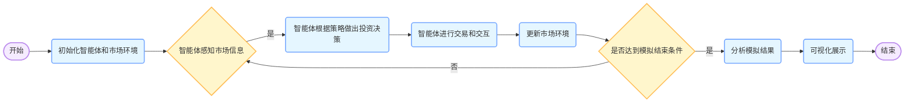

# 多智能体系统模拟机构投资行为

> 关键词：多智能体系统、机构投资行为、模拟、投资决策、市场动态

> 摘要：本文聚焦于利用多智能体系统来模拟机构投资行为。首先介绍了研究的背景、目的、预期读者和文档结构等内容。接着阐述了多智能体系统和机构投资行为的核心概念及相互联系，并给出了相应的原理和架构示意图与流程图。详细讲解了核心算法原理，结合Python源代码进行说明，同时给出了相关的数学模型和公式，并举例分析。通过项目实战，展示了如何搭建开发环境、实现源代码以及对代码进行解读分析。探讨了多智能体系统模拟机构投资行为在实际中的应用场景，推荐了相关的学习资源、开发工具框架和论文著作。最后总结了未来的发展趋势与挑战，解答了常见问题，并提供了扩展阅读和参考资料，旨在为该领域的研究和实践提供全面且深入的指导。

## 1. 背景介绍 
### 1.1 目的和范围
在金融市场中，机构投资者的行为对市场的动态变化有着深远的影响。机构投资者通常拥有大量的资金、专业的投资团队和复杂的投资策略，他们的决策不仅受到自身的投资目标、风险偏好等因素的影响，还会与其他机构投资者以及市场环境相互作用。本研究的目的在于利用多智能体系统（Multi-Agent System, MAS）来模拟机构投资行为，深入理解机构投资者之间的交互机制、投资决策过程以及这些行为如何影响金融市场的整体表现。

研究范围涵盖了多智能体系统的基本原理、机构投资行为的建模、模拟算法的设计与实现，以及对模拟结果的分析和解读。通过建立一个基于多智能体系统的模拟平台，我们可以模拟不同类型的机构投资者在各种市场条件下的投资行为，研究市场的稳定性、波动性、价格形成机制等问题。

### 1.2 预期读者
本文的预期读者包括金融领域的研究人员、投资从业者、计算机科学领域中对多智能体系统和金融模拟感兴趣的学者和开发者。对于金融研究人员来说，本文可以提供一种新的研究方法和视角，帮助他们更好地理解机构投资行为和金融市场的运行规律。投资从业者可以通过模拟结果了解不同投资策略的效果，优化自己的投资决策。计算机科学领域的读者则可以学习如何将多智能体系统应用到金融领域，掌握相关的算法和技术。

### 1.3 文档结构概述
本文共分为十个部分。第一部分为背景介绍，阐述了研究的目的、范围、预期读者和文档结构。第二部分介绍了多智能体系统和机构投资行为的核心概念及其相互联系，并给出了相应的原理和架构示意图与流程图。第三部分详细讲解了核心算法原理，结合Python源代码进行说明。第四部分给出了相关的数学模型和公式，并举例分析。第五部分通过项目实战，展示了如何搭建开发环境、实现源代码以及对代码进行解读分析。第六部分探讨了多智能体系统模拟机构投资行为在实际中的应用场景。第七部分推荐了相关的学习资源、开发工具框架和论文著作。第八部分总结了未来的发展趋势与挑战。第九部分解答了常见问题。第十部分提供了扩展阅读和参考资料。

### 1.4 术语表
#### 1.4.1 核心术语定义
- **多智能体系统（Multi-Agent System, MAS）**：由多个智能体组成的系统，每个智能体具有自主决策能力，能够感知环境并与其他智能体进行交互，共同完成系统的目标。
- **机构投资者**：指用自有资金或者从分散的公众手中筹集的资金专门进行有价证券投资活动的法人机构，如银行、保险公司、基金公司等。
- **投资决策**：投资者为了实现其预期的投资目标，运用一定的科学理论、方法和手段，通过一定的程序对投资的必要性、投资目标、投资规模、投资方向、投资结构、投资成本与收益等经济活动中的重大问题所进行的分析、判断和方案选择。
- **市场动态**：指金融市场中各种因素（如价格、交易量、投资者情绪等）随时间的变化情况。

#### 1.4.2 相关概念解释
- **智能体（Agent）**：在多智能体系统中，智能体是具有自主性、反应性、社会性和主动性的实体。自主性意味着智能体能够独立地做出决策和行动；反应性表示智能体能够感知环境的变化并做出相应的反应；社会性指智能体能够与其他智能体进行交互；主动性表示智能体能够主动地发起行动以实现自己的目标。
- **投资策略**：机构投资者为了实现投资目标而采用的一系列投资方法和原则，如价值投资、成长投资、动量投资等。

#### 1.4.3 缩略词列表
- **MAS**：Multi-Agent System（多智能体系统）

## 2. 核心概念与联系 
### 核心概念原理
#### 多智能体系统原理
多智能体系统的核心思想是将复杂的系统分解为多个相互独立又相互协作的智能体。每个智能体具有自己的目标、知识和能力，能够根据自身的感知和决策规则自主地进行行动。智能体之间通过通信和交互来协调各自的行为，以实现整个系统的目标。

在金融市场模拟中，每个机构投资者可以看作一个智能体。这些智能体具有不同的投资目标、风险偏好和投资策略，它们通过观察市场信息（如价格、交易量等）来做出投资决策，并与其他智能体进行交互（如交易、信息共享等）。

#### 机构投资行为原理
机构投资行为受到多种因素的影响，主要包括投资目标、风险偏好、市场信息和投资策略等。投资目标通常包括资产增值、收益稳定、风险控制等。风险偏好反映了机构投资者对风险的承受能力和态度，不同的风险偏好会导致不同的投资决策。市场信息是机构投资者做出决策的重要依据，包括宏观经济数据、行业动态、公司财务报表等。投资策略则是机构投资者根据自身的投资目标和风险偏好，结合市场信息制定的具体投资方法。

### 架构的文本示意图
```plaintext
多智能体系统模拟机构投资行为架构

|---------------------|
|  多智能体系统核心  |
|---------------------|
| 智能体1  智能体2 ... 智能体n |
|  （机构投资者1）  （机构投资者2） ... （机构投资者n） |
|---------------------|
|  市场环境模拟模块  |
|  （价格、交易量、信息传播等） |
|---------------------|
|  交互与通信模块  |
|  （智能体之间的交易、信息共享等） |
|---------------------|
|  结果分析与可视化模块  |
|  （分析模拟结果、展示市场动态等） |
|---------------------|
```

### Mermaid 流程图


## 3. 核心算法原理 & 具体操作步骤 
### 核心算法原理
在多智能体系统模拟机构投资行为中，核心算法主要包括智能体的决策算法和市场环境的更新算法。

#### 智能体决策算法
智能体的决策过程可以看作是一个基于规则或模型的优化问题。智能体根据自身的投资目标、风险偏好和市场信息，选择最优的投资策略。常见的决策算法包括基于规则的决策算法、基于机器学习的决策算法等。

基于规则的决策算法是根据预先设定的规则来做出决策。例如，如果市场价格低于某个阈值，智能体就买入；如果市场价格高于某个阈值，智能体就卖出。

基于机器学习的决策算法则是通过学习历史数据来建立决策模型。例如，使用神经网络、决策树等模型来预测市场走势，并根据预测结果做出决策。

#### 市场环境更新算法
市场环境的更新算法根据智能体的交易行为和外部信息来更新市场的价格、交易量等参数。常见的市场环境更新算法包括基于供需关系的算法、基于随机过程的算法等。

基于供需关系的算法认为市场价格是由供需关系决定的。当智能体的买入需求大于卖出供给时，市场价格上涨；反之，市场价格下跌。

基于随机过程的算法则认为市场价格的变化是一个随机过程，如布朗运动、随机游走等。

### 具体操作步骤
#### 步骤1：初始化智能体和市场环境
- 定义每个智能体的属性，包括投资目标、风险偏好、初始资金、初始资产组合等。
- 初始化市场环境的参数，包括初始价格、初始交易量等。

#### 步骤2：智能体感知市场信息
每个智能体通过传感器或其他方式感知市场的价格、交易量、宏观经济数据等信息。

#### 步骤3：智能体做出投资决策
智能体根据自身的投资目标、风险偏好和感知到的市场信息，使用决策算法做出投资决策，包括买入、卖出或持有等操作。

#### 步骤4：智能体进行交易和交互
智能体根据投资决策进行交易，并与其他智能体进行信息共享和交互。

#### 步骤5：更新市场环境
根据智能体的交易行为和外部信息，使用市场环境更新算法更新市场的价格、交易量等参数。

#### 步骤6：判断是否达到模拟结束条件
如果达到模拟结束条件（如模拟时间达到预设值），则停止模拟；否则，返回步骤2继续模拟。

#### 步骤7：分析模拟结果
对模拟结果进行分析，包括市场的稳定性、波动性、价格走势等。

#### 步骤8：可视化展示
将模拟结果以图表、报表等形式进行可视化展示，以便于分析和理解。

### Python源代码示例
```python
import random

# 定义智能体类
class Agent:
    def __init__(self, initial_funds, risk_preference):
        self.funds = initial_funds
        self.risk_preference = risk_preference
        self.assets = 0

    def perceive_market(self, market_price):
        return market_price

    def make_decision(self, market_price):
        # 简单的基于规则的决策算法
        if market_price < 100 and self.risk_preference > 0.5:
            # 买入
            if self.funds > 0:
                amount = min(self.funds // market_price, 10)
                self.assets += amount
                self.funds -= amount * market_price
        elif market_price > 120 and self.risk_preference < 0.5:
            # 卖出
            if self.assets > 0:
                self.funds += self.assets * market_price
                self.assets = 0
        return self.assets

# 定义市场环境类
class Market:
    def __init__(self, initial_price):
        self.price = initial_price

    def update_price(self, agents):
        # 简单的基于供需关系的价格更新算法
        total_buy = 0
        total_sell = 0
        for agent in agents:
            if agent.assets > 0:
                total_sell += agent.assets
            elif agent.funds > 0:
                total_buy += agent.funds // self.price

        if total_buy > total_sell:
            self.price += random.uniform(0, 2)
        elif total_buy < total_sell:
            self.price -= random.uniform(0, 2)
        return self.price

# 模拟函数
def simulate(num_agents, initial_funds, risk_preference, initial_price, num_steps):
    agents = [Agent(initial_funds, risk_preference) for _ in range(num_agents)]
    market = Market(initial_price)
    prices = []

    for _ in range(num_steps):
        market_price = market.price
        for agent in agents:
            agent.perceive_market(market_price)
            agent.make_decision(market_price)
        new_price = market.update_price(agents)
        prices.append(new_price)

    return prices

# 运行模拟
num_agents = 10
initial_funds = 1000
risk_preference = 0.6
initial_price = 110
num_steps = 100

prices = simulate(num_agents, initial_funds, risk_preference, initial_price, num_steps)
print(prices)
```

## 4. 数学模型和公式 & 详细讲解 & 举例说明 
### 智能体决策模型
#### 基于效用最大化的决策模型
智能体的决策目标通常是最大化自身的效用。效用函数可以表示为资产组合的预期收益和风险的函数。假设智能体的资产组合由现金 $C$ 和股票 $S$ 组成，股票的价格为 $P$，预期收益率为 $r$，风险为 $\sigma$。智能体的效用函数可以表示为：

$$U(C, S) = E(R) - \lambda \cdot \sigma^2$$

其中，$E(R)$ 是资产组合的预期收益，$\lambda$ 是风险厌恶系数。

资产组合的预期收益可以表示为：

$$E(R) = \frac{C + S \cdot P \cdot (1 + r)}{C + S \cdot P}$$

智能体的决策就是在预算约束 $C + S \cdot P \leq W$（$W$ 是智能体的初始资金）下，最大化效用函数 $U(C, S)$。

#### 举例说明
假设智能体的初始资金 $W = 1000$，股票价格 $P = 100$，预期收益率 $r = 0.1$，风险 $\sigma = 0.2$，风险厌恶系数 $\lambda = 0.5$。智能体需要决定买入多少股股票 $S$。

预算约束为 $C + 100S \leq 1000$，即 $C = 1000 - 100S$。

资产组合的预期收益为：

$$E(R) = \frac{(1000 - 100S) + S \cdot 100 \cdot (1 + 0.1)}{1000} = \frac{1000 + 10S}{1000}$$

风险为 $\sigma^2 = 0.2^2 = 0.04$。

效用函数为：

$$U(S) = \frac{1000 + 10S}{1000} - 0.5 \cdot 0.04$$

为了最大化效用函数，对 $U(S)$ 求导数并令其等于 0：

$$U'(S) = \frac{10}{1000} = 0$$

由于导数恒大于 0，说明效用函数是单调递增的。在预算约束下，智能体应该尽可能多地买入股票，即 $S = 10$（此时 $C = 0$）。

### 市场价格更新模型
#### 基于供需关系的价格更新模型
市场价格的变化可以用供需关系来描述。假设市场上的总买入需求为 $D$，总卖出供给为 $S$，市场价格的变化率 $\Delta P$ 可以表示为：

$$\Delta P = k \cdot \frac{D - S}{D + S}$$

其中，$k$ 是价格调整系数。

#### 举例说明
假设市场上的总买入需求 $D = 200$，总卖出供给 $S = 150$，价格调整系数 $k = 0.1$。

市场价格的变化率为：

$$\Delta P = 0.1 \cdot \frac{200 - 150}{200 + 150} = 0.1 \cdot \frac{50}{350} \approx 0.014$$

如果初始价格 $P_0 = 100$，则更新后的价格为：

$$P_1 = P_0 + \Delta P \cdot P_0 = 100 + 0.014 \cdot 100 = 101.4$$

## 5. 项目实战：代码实际案例和详细解释说明 
### 5.1  开发环境搭建
#### 安装Python
首先需要安装Python编程语言。可以从Python官方网站（https://www.python.org/downloads/）下载适合自己操作系统的Python版本，并按照安装向导进行安装。

#### 安装必要的库
在本项目中，我们主要使用Python的内置库，不需要额外安装其他库。如果需要对模拟结果进行可视化展示，可以安装 `matplotlib` 库。可以使用以下命令进行安装：

```sh
pip install matplotlib
```

### 5.2  源代码详细实现和代码解读
```python
import random
import matplotlib.pyplot as plt

# 定义智能体类
class Agent:
    def __init__(self, initial_funds, risk_preference):
        # 初始化智能体的初始资金
        self.funds = initial_funds
        # 初始化智能体的风险偏好
        self.risk_preference = risk_preference
        # 初始化智能体持有的资产数量
        self.assets = 0

    def perceive_market(self, market_price):
        # 智能体感知市场价格
        return market_price

    def make_decision(self, market_price):
        # 简单的基于规则的决策算法
        if market_price < 100 and self.risk_preference > 0.5:
            # 如果市场价格低于100且风险偏好大于0.5，则买入
            if self.funds > 0:
                # 计算最多可以买入的资产数量
                amount = min(self.funds // market_price, 10)
                # 更新资产数量
                self.assets += amount
                # 更新资金数量
                self.funds -= amount * market_price
        elif market_price > 120 and self.risk_preference < 0.5:
            # 如果市场价格高于120且风险偏好小于0.5，则卖出
            if self.assets > 0:
                # 更新资金数量
                self.funds += self.assets * market_price
                # 更新资产数量
                self.assets = 0
        return self.assets

# 定义市场环境类
class Market:
    def __init__(self, initial_price):
        # 初始化市场的初始价格
        self.price = initial_price

    def update_price(self, agents):
        # 简单的基于供需关系的价格更新算法
        total_buy = 0
        total_sell = 0
        for agent in agents:
            if agent.assets > 0:
                # 统计总卖出数量
                total_sell += agent.assets
            elif agent.funds > 0:
                # 统计总买入数量
                total_buy += agent.funds // self.price

        if total_buy > total_sell:
            # 如果总买入大于总卖出，则价格上涨
            self.price += random.uniform(0, 2)
        elif total_buy < total_sell:
            # 如果总买入小于总卖出，则价格下跌
            self.price -= random.uniform(0, 2)
        return self.price

# 模拟函数
def simulate(num_agents, initial_funds, risk_preference, initial_price, num_steps):
    # 创建智能体列表
    agents = [Agent(initial_funds, risk_preference) for _ in range(num_agents)]
    # 创建市场环境对象
    market = Market(initial_price)
    # 存储每一步的市场价格
    prices = []

    for _ in range(num_steps):
        # 获取当前市场价格
        market_price = market.price
        for agent in agents:
            # 智能体感知市场价格
            agent.perceive_market(market_price)
            # 智能体做出投资决策
            agent.make_decision(market_price)
        # 更新市场价格
        new_price = market.update_price(agents)
        # 存储更新后的市场价格
        prices.append(new_price)

    return prices

# 运行模拟
num_agents = 10
initial_funds = 1000
risk_preference = 0.6
initial_price = 110
num_steps = 100

prices = simulate(num_agents, initial_funds, risk_preference, initial_price, num_steps)

# 可视化展示
plt.plot(prices)
plt.xlabel('Time Step')
plt.ylabel('Market Price')
plt.title('Market Price Simulation')
plt.show()
```

### 5.3  代码解读与分析
#### 智能体类（`Agent`）
- `__init__` 方法：初始化智能体的初始资金、风险偏好和持有的资产数量。
- `perceive_market` 方法：智能体感知市场价格。
- `make_decision` 方法：根据市场价格和风险偏好做出投资决策，包括买入和卖出操作。

#### 市场环境类（`Market`）
- `__init__` 方法：初始化市场的初始价格。
- `update_price` 方法：根据智能体的买卖行为更新市场价格。

#### 模拟函数（`simulate`）
- 创建智能体列表和市场环境对象。
- 在每一步中，智能体感知市场价格并做出投资决策，然后更新市场价格。
- 存储每一步的市场价格。

#### 可视化展示
使用 `matplotlib` 库将模拟结果以折线图的形式展示出来，横坐标为时间步，纵坐标为市场价格。

通过分析模拟结果，我们可以观察到市场价格的波动情况，以及智能体的投资行为对市场价格的影响。

## 6. 实际应用场景 
### 金融市场研究
多智能体系统模拟机构投资行为可以用于金融市场的研究。通过模拟不同类型的机构投资者在各种市场条件下的投资行为，研究人员可以深入理解市场的稳定性、波动性、价格形成机制等问题。例如，可以研究不同投资策略对市场的影响，以及市场监管政策的有效性。

### 投资决策辅助
对于投资从业者来说，多智能体系统模拟可以作为投资决策的辅助工具。通过模拟不同投资策略在不同市场环境下的效果，投资者可以选择最优的投资策略，降低投资风险，提高投资收益。例如，可以模拟不同资产配置方案在市场波动时的表现，帮助投资者制定合理的资产配置计划。

### 风险管理
金融机构可以利用多智能体系统模拟来进行风险管理。通过模拟市场的极端情况和机构投资者的行为，评估金融机构的风险承受能力，制定相应的风险控制措施。例如，可以模拟在金融危机等极端情况下，机构投资者的恐慌性抛售行为对金融机构资产负债表的影响，提前做好风险防范。

### 政策制定
政府和监管机构可以利用多智能体系统模拟来制定金融政策。通过模拟不同政策对市场和机构投资者行为的影响，评估政策的有效性和可行性，制定更加科学合理的金融政策。例如，可以模拟提高利率、加强监管等政策对市场流动性和机构投资者投资行为的影响，为政策制定提供参考。

## 7. 工具和资源推荐
### 7.1 学习资源推荐
#### 7.1.1 书籍推荐
- 《多智能体系统：原理与编程》：本书系统地介绍了多智能体系统的基本原理、设计方法和编程技术，是学习多智能体系统的经典教材。
- 《金融市场学》：全面介绍了金融市场的基本概念、运行机制和投资策略，对于理解金融市场和机构投资行为具有重要的参考价值。
- 《Python金融数据分析》：详细介绍了如何使用Python进行金融数据分析和建模，对于实现多智能体系统模拟机构投资行为的代码实现非常有帮助。

#### 7.1.2 在线课程
- Coursera上的“Multi-Agent Systems”课程：由知名高校的教授授课，系统地介绍了多智能体系统的理论和应用。
- edX上的“Financial Markets”课程：由著名经济学家授课，深入讲解了金融市场的运行规律和投资决策方法。
- 中国大学MOOC上的“Python编程基础”课程：适合初学者学习Python编程语言，为实现多智能体系统模拟提供编程基础。

#### 7.1.3 技术博客和网站
- Agent-Based Modeling.org：提供了多智能体系统建模的相关资源和案例，包括模型代码、研究论文等。
- QuantNet：是一个金融量化分析的社区，提供了大量的金融数据分析和建模的经验分享和技术文章。
- Towards Data Science：是一个数据科学领域的博客平台，有很多关于金融数据分析和多智能体系统的文章。

### 7.2 开发工具框架推荐
#### 7.2.1 IDE和编辑器
- PyCharm：是一款专业的Python集成开发环境，提供了丰富的代码编辑、调试和项目管理功能，适合开发多智能体系统模拟的Python代码。
- Jupyter Notebook：是一个交互式的开发环境，支持Python代码的实时运行和可视化展示，非常适合进行数据分析和模型验证。

#### 7.2.2 调试和性能分析工具
- pdb：是Python的内置调试工具，可以帮助开发者定位代码中的错误和问题。
- cProfile：是Python的性能分析工具，可以分析代码的运行时间和内存使用情况，帮助开发者优化代码性能。

#### 7.2.3 相关框架和库
- Mesa：是一个基于Python的多智能体系统建模框架，提供了丰富的智能体和环境类，方便开发者快速搭建多智能体系统模拟平台。
- NumPy：是Python的数值计算库，提供了高效的数组操作和数学函数，对于实现多智能体系统模拟中的数值计算非常有帮助。
- Pandas：是Python的数据分析库，提供了灵活的数据结构和数据处理方法，适合处理和分析模拟结果。

### 7.3 相关论文著作推荐
#### 7.3.1 经典论文
- "An Introduction to MultiAgent Systems" by Michael Wooldridge：是多智能体系统领域的经典论文，系统地介绍了多智能体系统的基本概念、理论和方法。
- "Agent-Based Computational Finance" by Leigh Tesfatsion：介绍了如何使用多智能体系统来模拟金融市场，是该领域的开创性论文。

#### 7.3.2 最新研究成果
- 可以关注《Journal of Artificial Societies and Social Simulation》《Journal of Financial Economics》等学术期刊，了解多智能体系统模拟机构投资行为的最新研究成果。

#### 7.3.3 应用案例分析
- 可以参考一些实际的金融机构或研究机构发布的报告和案例分析，了解多智能体系统在金融领域的应用实践和效果。

## 8. 总结：未来发展趋势与挑战
### 未来发展趋势
#### 与人工智能技术的深度融合
随着人工智能技术的不断发展，多智能体系统模拟机构投资行为将与机器学习、深度学习等技术深度融合。智能体可以通过学习大量的历史数据和市场信息，不断优化自己的投资策略，提高决策的准确性和效率。例如，使用深度学习模型来预测市场走势，智能体可以根据预测结果做出更加合理的投资决策。

#### 考虑更多的市场因素和行为因素
未来的多智能体系统模拟将考虑更多的市场因素和行为因素，如投资者情绪、政策变化、宏观经济环境等。这些因素会对机构投资行为产生重要的影响，考虑这些因素可以使模拟结果更加贴近实际市场情况。例如，可以引入投资者情绪指标，模拟投资者在不同情绪状态下的投资行为。

#### 大规模并行模拟
随着计算机性能的不断提高，未来的多智能体系统模拟将实现大规模并行模拟。可以同时模拟大量的智能体和复杂的市场环境，提高模拟的效率和准确性。例如，使用云计算平台和分布式计算技术，实现大规模多智能体系统的并行模拟。

### 挑战
#### 数据的获取和处理
多智能体系统模拟需要大量的历史数据和市场信息作为输入。然而，金融市场数据通常具有高维度、噪声大、不完整等特点，数据的获取和处理是一个挑战。如何从海量的数据中提取有用的信息，以及如何处理数据中的噪声和缺失值，是需要解决的问题。

#### 模型的验证和校准
多智能体系统模拟的模型需要进行验证和校准，以确保模拟结果的准确性和可靠性。然而，由于金融市场的复杂性和不确定性，很难找到一个完全准确的模型来描述市场行为。如何验证和校准模型，以及如何评估模拟结果的可信度，是一个挑战。

#### 计算资源的需求
大规模多智能体系统模拟需要大量的计算资源，包括计算能力和内存。随着模拟规模的不断增大，计算资源的需求也会不断增加。如何有效地利用计算资源，以及如何降低模拟的计算成本，是需要解决的问题。

## 9. 附录：常见问题与解答
### 问题1：多智能体系统模拟机构投资行为的准确性如何？
解答：多智能体系统模拟机构投资行为的准确性受到多种因素的影响，包括模型的合理性、数据的质量、参数的设置等。虽然多智能体系统可以模拟复杂的市场环境和机构投资者的行为，但由于金融市场的不确定性和复杂性，模拟结果只能作为参考，不能完全准确地预测市场走势。

### 问题2：如何选择合适的智能体决策算法？
解答：选择合适的智能体决策算法需要考虑多个因素，如投资目标、风险偏好、市场环境等。基于规则的决策算法简单易懂，适合处理简单的投资决策问题；基于机器学习的决策算法可以学习历史数据和市场信息，适合处理复杂的投资决策问题。可以根据具体情况选择合适的决策算法，也可以将多种决策算法结合使用。

### 问题3：如何评估模拟结果的有效性？
解答：评估模拟结果的有效性可以从多个方面进行，如与实际市场数据的对比、统计分析、敏感性分析等。可以将模拟结果与实际市场数据进行对比，看模拟结果是否能够反映市场的主要特征；可以进行统计分析，计算模拟结果的均值、方差等统计指标，评估模拟结果的稳定性和可靠性；可以进行敏感性分析，研究不同参数对模拟结果的影响，评估模拟结果的鲁棒性。

## 10. 扩展阅读 & 参考资料
### 扩展阅读
- 《复杂经济学：经济思想的新框架》：介绍了复杂经济学的基本概念和方法，对于理解金融市场的复杂性和多智能体系统模拟有很大的帮助。
- 《行为金融学》：探讨了投资者的心理和行为对金融市场的影响，为多智能体系统模拟机构投资行为提供了行为学基础。

### 参考资料
- Wooldridge, M. (2009). An Introduction to MultiAgent Systems. John Wiley & Sons.
- Tesfatsion, L. (2002). Agent-Based Computational Finance. Handbook of Computational Economics, 2, 831-880.

作者：AI天才研究院/AI Genius Institute & 禅与计算机程序设计艺术 /Zen And The Art of Computer Programming