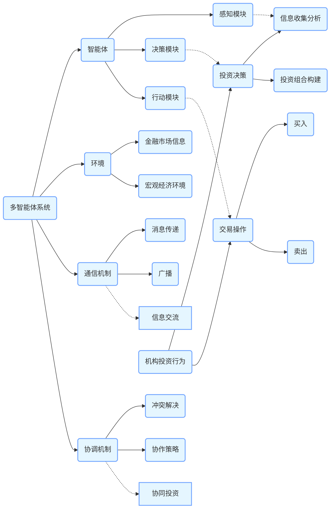

# 多智能体系统模拟机构投资行为

> 关键词：多智能体系统、机构投资行为、模拟、金融市场、人工智能

> 摘要：本文聚焦于利用多智能体系统来模拟机构投资行为。首先介绍了相关背景，包括目的范围、预期读者等内容。详细阐述了多智能体系统和机构投资行为的核心概念及联系，并给出了相应的文本示意图和 Mermaid 流程图。深入探讨了核心算法原理，使用 Python 源代码进行了详细说明，同时讲解了相关的数学模型和公式，并举例分析。通过项目实战，展示了如何搭建开发环境、实现源代码并进行解读。列举了多智能体系统模拟机构投资行为在金融领域的实际应用场景。推荐了学习资源、开发工具框架以及相关论文著作。最后总结了未来发展趋势与挑战，还提供了常见问题解答和扩展阅读参考资料，旨在为相关领域的研究和实践提供全面且深入的指导。

## 1. 背景介绍 
### 1.1 目的和范围
机构投资行为在金融市场中占据着重要地位，其决策和操作会对市场的稳定性、资产价格等产生显著影响。本研究的目的是利用多智能体系统来模拟机构投资行为，以更好地理解机构投资者在不同市场环境下的决策过程和行为模式，预测市场的动态变化，为金融监管、投资策略制定等提供理论支持和实践参考。

本研究的范围涵盖了多智能体系统的基本原理、机构投资行为的主要特征和影响因素、多智能体系统模拟机构投资行为的算法和模型，以及模拟结果的分析和应用。同时，还会涉及到相关的开发工具和技术，以及实际应用场景的探讨。

### 1.2 预期读者
本文的预期读者包括金融领域的研究人员、投资者、金融监管机构的工作人员，以及对人工智能和多智能体系统在金融领域应用感兴趣的计算机科学专业人士。对于金融从业者来说，可以通过本文了解如何利用多智能体系统来深入分析机构投资行为，为投资决策和监管政策制定提供依据；对于计算机科学专业人士来说，可以学习如何将多智能体系统应用到金融领域的实际问题中，拓展研究和应用的领域。

### 1.3 文档结构概述
本文将按照以下结构进行组织：
1. 背景介绍：阐述研究的目的和范围、预期读者、文档结构概述以及相关术语表。
2. 核心概念与联系：介绍多智能体系统和机构投资行为的核心概念，分析它们之间的联系，并给出相应的文本示意图和 Mermaid 流程图。
3. 核心算法原理 & 具体操作步骤：详细讲解多智能体系统模拟机构投资行为的核心算法原理，使用 Python 源代码进行具体操作步骤的说明。
4. 数学模型和公式 & 详细讲解 & 举例说明：介绍相关的数学模型和公式，进行详细讲解，并通过具体例子进行分析。
5. 项目实战：代码实际案例和详细解释说明：包括开发环境搭建、源代码详细实现和代码解读、代码解读与分析。
6. 实际应用场景：列举多智能体系统模拟机构投资行为在金融领域的实际应用场景。
7. 工具和资源推荐：推荐学习资源、开发工具框架以及相关论文著作。
8. 总结：未来发展趋势与挑战：总结研究的主要成果，分析未来的发展趋势和面临的挑战。
9. 附录：常见问题与解答：提供常见问题的解答，帮助读者更好地理解本文的内容。
10. 扩展阅读 & 参考资料：提供扩展阅读的建议和相关的参考资料，方便读者进一步深入研究。

### 1.4 术语表
#### 1.4.1 核心术语定义
- **多智能体系统（Multi - Agent System, MAS）**：由多个自主的智能体组成的系统，这些智能体能够感知环境、进行决策并采取行动，它们之间可以通过通信和协作来完成共同的任务或实现各自的目标。
- **机构投资者**：指用自有资金或者从分散的公众手中筹集的资金专门进行有价证券投资活动的法人机构，如银行、保险公司、基金公司等。
- **投资行为**：机构投资者在金融市场中进行的各种投资决策和操作，包括资产选择、投资组合构建、交易时机选择等。

#### 1.4.2 相关概念解释
- **智能体的自主性**：智能体能够独立地感知环境信息，根据自身的目标和策略进行决策和行动，不受其他智能体或外部因素的直接控制。
- **投资组合**：机构投资者将资金分散投资于不同的资产（如股票、债券、基金等）所形成的资产集合，目的是在风险和收益之间达到平衡。

#### 1.4.3 缩略词列表
- MAS：Multi - Agent System（多智能体系统）
- MPT：Modern Portfolio Theory（现代投资组合理论）

## 2. 核心概念与联系 

### 多智能体系统核心概念
多智能体系统是一种分布式人工智能系统，由多个智能体组成。每个智能体都具有一定的智能和自主性，能够感知周围环境的信息，并根据自身的目标和规则进行决策和行动。智能体之间可以通过通信机制进行信息交换和协作，以实现共同的目标或解决复杂的问题。

多智能体系统的架构通常包括以下几个部分：
1. **智能体**：是系统的基本组成单元，具有感知、决策和行动的能力。
2. **环境**：智能体所处的外部世界，提供了智能体感知和行动的对象。
3. **通信机制**：智能体之间进行信息交换的方式，如消息传递、广播等。
4. **协调机制**：用于协调智能体之间的行动，避免冲突和实现协作。

### 机构投资行为核心概念
机构投资行为是指机构投资者在金融市场中的各种投资决策和操作。机构投资者通常具有专业的投资团队和丰富的资金资源，其投资决策会受到多种因素的影响，包括市场行情、宏观经济环境、公司基本面、投资策略等。

机构投资行为的主要特征包括：
1. **专业性**：机构投资者拥有专业的投资知识和技能，能够进行深入的市场分析和研究。
2. **大规模性**：机构投资者通常管理着大量的资金，其投资行为会对市场产生较大的影响。
3. **多元化**：为了降低风险，机构投资者会将资金分散投资于不同的资产和市场。
4. **长期性**：机构投资者更注重长期投资回报，不会轻易受到短期市场波动的影响。

### 核心概念联系
多智能体系统可以很好地模拟机构投资行为。在多智能体系统中，每个智能体可以代表一个机构投资者，智能体的感知能力对应于机构投资者对市场信息的收集和分析能力，智能体的决策能力对应于机构投资者的投资决策过程，智能体的行动能力对应于机构投资者的交易操作。智能体之间的通信和协作可以模拟机构投资者之间的信息交流和协同投资行为。

通过多智能体系统模拟机构投资行为，可以考虑到机构投资者之间的相互作用和市场的动态变化，从而更真实地反映金融市场的运行机制。

### 文本示意图
```plaintext
多智能体系统
├── 智能体
│   ├── 感知模块
│   ├── 决策模块
│   ├── 行动模块
├── 环境
│   ├── 金融市场信息
│   ├── 宏观经济环境
├── 通信机制
│   ├── 消息传递
│   ├── 广播
├── 协调机制
│   ├── 冲突解决
│   ├── 协作策略

机构投资行为
├── 投资决策
│   ├── 资产选择
│   ├── 投资组合构建
├── 交易操作
│   ├── 买入
│   ├── 卖出

联系：
智能体 - 机构投资者
感知模块 - 信息收集分析
决策模块 - 投资决策
行动模块 - 交易操作
通信机制 - 信息交流
协调机制 - 协同投资
```

### Mermaid 流程图


## 3. 核心算法原理 & 具体操作步骤 

### 核心算法原理
在多智能体系统模拟机构投资行为中，常用的算法原理包括强化学习算法和基于规则的算法。

#### 强化学习算法
强化学习是一种机器学习方法，智能体通过与环境进行交互，根据环境反馈的奖励信号来学习最优的行为策略。在模拟机构投资行为中，智能体可以将投资收益作为奖励信号，通过不断地尝试不同的投资决策，学习如何在不同的市场环境下获得最大的投资回报。

常见的强化学习算法有 Q - learning 算法和深度 Q 网络（Deep Q - Network, DQN）算法。以 Q - learning 算法为例，其核心思想是通过维护一个 Q 表来记录每个状态 - 动作对的价值。智能体在每个时间步根据当前状态选择一个动作，执行该动作后，环境会反馈一个奖励和下一个状态，智能体根据奖励和下一个状态更新 Q 表中的值，不断迭代更新，直到找到最优的策略。

#### 基于规则的算法
基于规则的算法是根据预先定义的规则来进行决策。在模拟机构投资行为中，可以根据机构投资者的投资策略和经验，定义一系列的规则，如买入规则、卖出规则、止损规则等。智能体在每个时间步根据当前的市场信息和自身的状态，检查是否满足规则的条件，如果满足则执行相应的动作。

### 具体操作步骤及 Python 源代码

#### 强化学习算法（Q - learning）实现步骤及代码
```python
import numpy as np

# 定义环境参数
num_states = 10  # 状态数量
num_actions = 3  # 动作数量（买入、卖出、持有）
learning_rate = 0.1  # 学习率
discount_factor = 0.9  # 折扣因子
num_episodes = 1000  # 训练轮数

# 初始化 Q 表
Q_table = np.zeros((num_states, num_actions))

# 定义环境反馈函数
def get_reward(state, action):
    # 简单示例：随机生成奖励
    return np.random.randint(-10, 10)

# 定义状态转移函数
def get_next_state(state, action):
    # 简单示例：随机转移到下一个状态
    return np.random.randint(0, num_states)

# Q - learning 算法主循环
for episode in range(num_episodes):
    state = np.random.randint(0, num_states)  # 随机初始化状态
    done = False
    while not done:
        # 选择动作
        if np.random.uniform(0, 1) < 0.1:  # 探索率为 0.1
            action = np.random.randint(0, num_actions)
        else:
            action = np.argmax(Q_table[state, :])
        
        # 执行动作，获取奖励和下一个状态
        reward = get_reward(state, action)
        next_state = get_next_state(state, action)
        
        # 更新 Q 表
        Q_table[state, action] = (1 - learning_rate) * Q_table[state, action] + \
                                 learning_rate * (reward + discount_factor * np.max(Q_table[next_state, :]))
        
        state = next_state
        
        # 判断是否结束
        if np.random.uniform(0, 1) < 0.05:  # 结束概率为 0.05
            done = True

print("训练完成后的 Q 表：")
print(Q_table)
```

#### 基于规则的算法实现步骤及代码
```python
# 定义市场信息
market_prices = [100, 102, 105, 103, 101, 104, 106, 108, 107, 109]

# 定义规则
buy_threshold = 102
sell_threshold = 107

# 模拟机构投资行为
position = 0  # 持仓状态，0 表示空仓，1 表示持仓
for price in market_prices:
    if position == 0 and price < buy_threshold:
        print(f"价格 {price}，买入")
        position = 1
    elif position == 1 and price > sell_threshold:
        print(f"价格 {price}，卖出")
        position = 0
    else:
        print(f"价格 {price}，持有")
```

## 4. 数学模型和公式 & 详细讲解 & 举例说明 

### 强化学习中的数学模型和公式

#### Q - learning 算法公式
Q - learning 算法的核心公式是 Q 值更新公式：

$$Q(s_t, a_t) \leftarrow (1 - \alpha)Q(s_t, a_t) + \alpha\left[r_t + \gamma\max_{a}Q(s_{t + 1}, a)\right]$$

其中：
- $Q(s_t, a_t)$ 表示在时间步 $t$ 处于状态 $s_t$ 并执行动作 $a_t$ 的 Q 值。
- $\alpha$ 是学习率，控制新信息对旧 Q 值的更新程度。
- $r_t$ 是在时间步 $t$ 执行动作 $a_t$ 后获得的奖励。
- $\gamma$ 是折扣因子，用于权衡当前奖励和未来奖励的重要性。
- $s_{t + 1}$ 是执行动作 $a_t$ 后转移到的下一个状态。

#### 详细讲解
Q - learning 算法的目标是通过不断更新 Q 表，使得每个状态 - 动作对的 Q 值能够反映该动作在该状态下的长期价值。学习率 $\alpha$ 决定了新的经验对旧的 Q 值的影响程度，如果 $\alpha$ 较大，新的经验会更快地覆盖旧的 Q 值；如果 $\alpha$ 较小，旧的 Q 值会更稳定。折扣因子 $\gamma$ 表示对未来奖励的重视程度，$\gamma$ 越接近 1，智能体越注重未来的奖励；$\gamma$ 越接近 0，智能体越注重当前的奖励。

#### 举例说明
假设我们有一个简单的投资环境，状态 $s$ 表示股票价格的区间（如低、中、高），动作 $a$ 表示买入、卖出、持有。初始时，Q 表中的所有值都为 0。在某一时刻，智能体处于状态 $s_t$（股票价格为低），选择了动作 $a_t$（买入），执行该动作后获得奖励 $r_t = 5$，并转移到下一个状态 $s_{t + 1}$（股票价格为中）。假设学习率 $\alpha = 0.1$，折扣因子 $\gamma = 0.9$，$Q(s_{t + 1}, \text{买入}) = 2$，$Q(s_{t + 1}, \text{卖出}) = 3$，$Q(s_{t + 1}, \text{持有}) = 1$。

根据 Q 值更新公式：

$$
\begin{align*}
Q(s_t, a_t) &\leftarrow (1 - 0.1)Q(s_t, a_t) + 0.1\times(5 + 0.9\times\max\{2, 3, 1\})\\
&= 0.9\times0 + 0.1\times(5 + 0.9\times3)\\
&= 0.1\times(5 + 2.7)\\
&= 0.77
\end{align*}
$$

更新后的 $Q(s_t, a_t)$ 值为 0.77。

### 现代投资组合理论（MPT）中的数学模型和公式

#### 投资组合的期望收益率公式
设投资组合中包含 $n$ 种资产，第 $i$ 种资产的权重为 $w_i$，期望收益率为 $E(R_i)$，则投资组合的期望收益率 $E(R_p)$ 为：

$$E(R_p)=\sum_{i = 1}^{n}w_iE(R_i)$$

其中 $\sum_{i = 1}^{n}w_i = 1$。

#### 投资组合的方差公式
投资组合的方差 $\sigma_p^2$ 为：

$$\sigma_p^2=\sum_{i = 1}^{n}\sum_{j = 1}^{n}w_iw_j\sigma_{ij}$$

其中 $\sigma_{ij}$ 是资产 $i$ 和资产 $j$ 的协方差。当 $i = j$ 时，$\sigma_{ij}=\sigma_i^2$ 是资产 $i$ 的方差。

#### 详细讲解
现代投资组合理论的核心思想是通过资产的分散投资来降低风险。投资组合的期望收益率是各资产期望收益率的加权平均，反映了投资组合的预期收益水平。投资组合的方差衡量了投资组合的风险，通过合理选择资产的权重，可以在一定的预期收益率下降低投资组合的风险。

#### 举例说明
假设投资组合包含两种资产 A 和 B，资产 A 的权重 $w_A = 0.6$，期望收益率 $E(R_A)=0.1$，方差 $\sigma_A^2 = 0.04$；资产 B 的权重 $w_B = 0.4$，期望收益率 $E(R_B)=0.15$，方差 $\sigma_B^2 = 0.09$，资产 A 和 B 的协方差 $\sigma_{AB}=0.02$。

投资组合的期望收益率：

$$E(R_p)=0.6\times0.1 + 0.4\times0.15=0.12$$

投资组合的方差：

$$
\begin{align*}
\sigma_p^2&=0.6^2\times0.04 + 0.4^2\times0.09+2\times0.6\times0.4\times0.02\\
&=0.0144 + 0.0144+0.0096\\
&=0.0384
\end{align*}
$$

投资组合的标准差 $\sigma_p=\sqrt{0.0384}\approx0.196$。

## 5. 项目实战：代码实际案例和详细解释说明 

### 5.1  开发环境搭建
#### 安装 Python
首先需要安装 Python 环境，建议使用 Python 3.7 及以上版本。可以从 Python 官方网站（https://www.python.org/downloads/）下载适合自己操作系统的安装包，按照安装向导进行安装。

#### 安装必要的库
在模拟机构投资行为的项目中，需要使用一些 Python 库，如 NumPy、Pandas、Matplotlib 等。可以使用以下命令进行安装：
```sh
pip install numpy pandas matplotlib
```

#### 安装强化学习库（可选）
如果使用强化学习算法，还可以安装一些强化学习库，如 Gym、Stable - Baselines3 等。安装命令如下：
```sh
pip install gym stable - baselines3
```

### 5.2  源代码详细实现和代码解读

#### 项目概述
本项目将使用多智能体系统模拟多个机构投资者在股票市场中的投资行为。每个智能体代表一个机构投资者，根据市场信息和自身的投资策略进行投资决策。

#### 代码实现
```python
import numpy as np
import pandas as pd
import matplotlib.pyplot as plt

# 定义市场环境类
class MarketEnvironment:
    def __init__(self, num_stocks, num_periods):
        self.num_stocks = num_stocks
        self.num_periods = num_periods
        # 随机生成股票价格序列
        self.stock_prices = np.random.randn(num_stocks, num_periods) + 100
    
    def get_stock_prices(self, period):
        return self.stock_prices[:, period]

# 定义机构投资者智能体类
class InstitutionalInvestor:
    def __init__(self, initial_funds, num_stocks):
        self.funds = initial_funds
        self.portfolio = np.zeros(num_stocks)
    
    def make_decision(self, stock_prices):
        # 简单的投资策略：随机选择买入或卖出
        action = np.random.choice([-1, 0, 1], size=self.portfolio.shape)
        for i in range(len(action)):
            if action[i] == 1 and self.funds >= stock_prices[i]:
                self.portfolio[i] += 1
                self.funds -= stock_prices[i]
            elif action[i] == -1 and self.portfolio[i] > 0:
                self.portfolio[i] -= 1
                self.funds += stock_prices[i]
    
    def get_portfolio_value(self, stock_prices):
        return np.sum(self.portfolio * stock_prices) + self.funds

# 主模拟函数
def simulate(num_investors, num_stocks, num_periods, initial_funds):
    market = MarketEnvironment(num_stocks, num_periods)
    investors = [InstitutionalInvestor(initial_funds, num_stocks) for _ in range(num_investors)]
    
    portfolio_values = []
    for period in range(num_periods):
        stock_prices = market.get_stock_prices(period)
        for investor in investors:
            investor.make_decision(stock_prices)
        total_portfolio_value = np.sum([investor.get_portfolio_value(stock_prices) for investor in investors])
        portfolio_values.append(total_portfolio_value)
    
    # 绘制投资组合价值随时间的变化曲线
    plt.plot(range(num_periods), portfolio_values)
    plt.xlabel('Period')
    plt.ylabel('Total Portfolio Value')
    plt.title('Simulation of Institutional Investment Behavior')
    plt.show()

# 运行模拟
simulate(num_investors=5, num_stocks=3, num_periods=100, initial_funds=1000)
```

#### 代码解读
1. **MarketEnvironment 类**：用于模拟股票市场环境，包含股票价格序列的生成和获取方法。
2. **InstitutionalInvestor 类**：代表机构投资者智能体，包含初始资金、投资组合等属性，以及决策方法和计算投资组合价值的方法。
3. **simulate 函数**：主模拟函数，初始化市场环境和多个机构投资者智能体，在每个时间步获取股票价格，让每个智能体进行决策，并记录总投资组合价值，最后绘制投资组合价值随时间的变化曲线。

### 5.3  代码解读与分析
#### 投资策略分析
在上述代码中，机构投资者的投资策略是随机选择买入、卖出或持有。这种简单的策略在实际应用中可能不太合理，但可以作为一个基础的示例。在实际应用中，可以根据更复杂的规则或强化学习算法来制定投资策略。

#### 模拟结果分析
通过绘制投资组合价值随时间的变化曲线，可以观察到投资组合价值的波动情况。如果曲线呈现上升趋势，说明整体投资收益较好；如果曲线波动较大，说明投资风险较高。可以根据模拟结果调整投资策略和参数，以优化投资效果。

## 6. 实际应用场景 
### 金融监管
多智能体系统模拟机构投资行为可以帮助金融监管机构更好地理解市场的运行机制和机构投资者的行为模式。通过模拟不同市场环境下机构投资者的决策和操作，监管机构可以预测市场的潜在风险，提前采取措施进行防范。例如，模拟机构投资者在市场恐慌时的抛售行为，监管机构可以制定相应的政策来稳定市场，避免系统性风险的发生。

### 投资策略制定
投资者可以利用多智能体系统模拟不同投资策略在不同市场环境下的表现。通过模拟多个机构投资者采用不同的投资策略进行竞争和协作，可以找出最优的投资策略。例如，模拟价值投资策略和成长投资策略在不同市场周期中的收益情况，投资者可以根据模拟结果选择适合自己的投资策略。

### 风险管理
金融机构可以使用多智能体系统来评估投资组合的风险。通过模拟机构投资者在不同风险因素下的投资行为，金融机构可以计算投资组合的风险暴露程度，采取相应的措施进行风险对冲。例如，模拟利率变动、汇率波动等因素对投资组合的影响，金融机构可以调整投资组合的资产配置，降低风险。

### 市场预测
多智能体系统可以模拟市场参与者的行为，从而对市场的未来走势进行预测。通过考虑机构投资者之间的相互作用和市场的动态变化，模拟结果可以更真实地反映市场的实际情况。例如，预测股票市场的涨跌趋势、债券市场的利率走势等，为投资者和金融机构提供决策参考。

## 7. 工具和资源推荐
### 7.1 学习资源推荐
#### 7.1.1 书籍推荐
- 《多智能体系统》：全面介绍了多智能体系统的基本概念、理论和方法，是学习多智能体系统的经典教材。
- 《金融市场的行为经济学》：探讨了投资者的行为心理和决策过程，对于理解机构投资行为有很大的帮助。
- 《Python 机器学习实战》：介绍了 Python 在机器学习领域的应用，包括强化学习等算法的实现，适合学习如何使用 Python 进行多智能体系统模拟。

#### 7.1.2 在线课程
- Coursera 上的“多智能体系统”课程：由知名高校的教授授课，系统地讲解了多智能体系统的知识。
- edX 上的“金融市场与投资策略”课程：涵盖了金融市场的基本原理和投资策略的制定方法。
- 网易云课堂上的“Python 数据分析与机器学习实战”课程：提供了丰富的 Python 代码示例和实践项目，有助于掌握 Python 编程和机器学习算法。

#### 7.1.3 技术博客和网站
- Towards Data Science：是一个专注于数据科学和机器学习的技术博客，上面有很多关于多智能体系统和金融领域应用的文章。
- arXiv：是一个预印本平台，提供了大量的学术论文，包括多智能体系统和金融领域的最新研究成果。
- GitHub：是一个代码托管平台，上面有很多开源的多智能体系统和金融模拟项目，可以参考学习。

### 7.2 开发工具框架推荐
#### 7.2.1 IDE和编辑器
- PyCharm：是一款专业的 Python 集成开发环境，提供了丰富的代码编辑、调试和版本控制功能，适合开发大型的 Python 项目。
- Jupyter Notebook：是一个交互式的开发环境，支持 Python 代码的编写、运行和可视化，适合进行数据探索和模型实验。

#### 7.2.2 调试和性能分析工具
- PDB：是 Python 自带的调试工具，可以帮助开发者定位代码中的错误。
- cProfile：是 Python 的性能分析工具，可以分析代码的运行时间和函数调用情况，帮助优化代码性能。

#### 7.2.3 相关框架和库
- NumPy：是 Python 的一个基础科学计算库，提供了高效的数组操作和数学函数，是进行多智能体系统模拟的必备库。
- Pandas：是一个数据处理和分析库，提供了数据结构和数据分析工具，方便处理金融市场数据。
- Gym：是一个强化学习环境库，提供了各种模拟环境，可用于开发和测试强化学习算法。
- Stable - Baselines3：是一个基于 PyTorch 的强化学习库，提供了多种预训练的强化学习算法，方便快速实现强化学习模型。

### 7.3 相关论文著作推荐
#### 7.3.1 经典论文
- "Multi - Agent Systems: A Modern Approach to Distributed Artificial Intelligence"：介绍了多智能体系统的基本概念和理论，是多智能体系统领域的经典论文。
- "Portfolio Selection"：由 Harry Markowitz 发表，提出了现代投资组合理论，奠定了投资组合优化的基础。

#### 7.3.2 最新研究成果
- 在 arXiv 和各大金融学术期刊上可以找到关于多智能体系统模拟机构投资行为的最新研究成果，如使用深度学习方法改进多智能体系统的模拟效果、考虑更多市场因素的机构投资行为模型等。

#### 7.3.3 应用案例分析
- 一些金融机构和研究机构会发布多智能体系统在金融领域的应用案例分析报告，如使用多智能体系统进行风险管理、投资策略优化等实际案例，这些案例可以为实际应用提供参考。

## 8. 总结：未来发展趋势与挑战
### 未来发展趋势
#### 融合更多技术
未来，多智能体系统模拟机构投资行为将融合更多的技术，如深度学习、区块链等。深度学习可以用于处理复杂的市场数据和提高智能体的决策能力，区块链可以提供更安全、透明的交易环境，保证模拟结果的可信度。

#### 考虑更多因素
在模拟机构投资行为时，将考虑更多的市场因素和投资者行为因素。除了市场行情、宏观经济环境等传统因素外，还将考虑社交媒体情绪、政策变化等因素对机构投资行为的影响，使模拟结果更加真实和准确。

#### 应用领域拓展
多智能体系统模拟机构投资行为的应用领域将不断拓展，不仅局限于金融市场，还将应用于保险、房地产等领域。例如，在保险领域，可以模拟保险公司的投资行为和风险管理策略，优化保险产品的设计和定价。

### 面临的挑战
#### 数据质量和获取
多智能体系统模拟需要大量的市场数据和投资者行为数据，数据的质量和获取难度是一个挑战。市场数据可能存在噪声和缺失值，投资者行为数据的获取也比较困难，需要通过合理的数据处理和挖掘方法来解决。

#### 模型复杂度和计算资源
随着考虑的因素越来越多，多智能体系统的模型复杂度也会不断增加，对计算资源的要求也会越来越高。如何在有限的计算资源下实现高效的模拟是一个需要解决的问题。

#### 模型验证和解释
多智能体系统模拟机构投资行为的模型需要进行验证和解释，以确保模拟结果的可靠性和可理解性。由于模型的复杂性，模型验证和解释的难度较大，需要开发有效的方法来解决。

## 9. 附录：常见问题与解答
### 1. 多智能体系统模拟机构投资行为的准确性如何保证？
可以通过以下方法保证模拟的准确性：
- 使用高质量的市场数据和投资者行为数据，进行数据清洗和预处理，减少噪声和缺失值的影响。
- 对模型进行验证和校准，使用历史数据进行回测，调整模型参数，使模拟结果与实际情况相符。
- 考虑多种市场因素和投资者行为因素，提高模型的复杂度和真实性。

### 2. 多智能体系统模拟机构投资行为需要多长时间？
模拟所需的时间取决于模型的复杂度、计算资源的配置和模拟的时间跨度。简单的模型和较短的时间跨度可能只需要几分钟到几小时，而复杂的模型和较长的时间跨度可能需要数天甚至数周。可以通过优化模型算法、并行计算等方法来缩短模拟时间。

### 3. 如何选择合适的投资策略进行模拟？
可以根据自己的投资目标、风险承受能力和市场环境选择合适的投资策略。常见的投资策略包括价值投资、成长投资、动量投资等。可以使用多智能体系统模拟不同投资策略在不同市场环境下的表现，选择表现最优的投资策略。

### 4. 多智能体系统模拟机构投资行为可以用于实际投资决策吗？
多智能体系统模拟机构投资行为可以为实际投资决策提供参考，但不能完全替代实际投资决策。模拟结果是基于一定的假设和模型，实际市场情况可能会更加复杂和多变。在实际投资决策中，还需要考虑其他因素，如个人经验、市场情绪等。

## 10. 扩展阅读 & 参考资料
### 扩展阅读
- 《人工智能：一种现代的方法》：全面介绍了人工智能的基本概念、理论和方法，包括多智能体系统、机器学习等领域，有助于深入理解多智能体系统模拟机构投资行为的技术基础。
- 《金融科技前沿：技术驱动的金融创新》：探讨了金融科技的发展趋势和应用，包括多智能体系统在金融领域的创新应用，为进一步拓展应用领域提供思路。

### 参考资料
- Wooldridge, M. (2009). An Introduction to MultiAgent Systems. Wiley.
- Markowitz, H. M. (1952). Portfolio Selection. The Journal of Finance, 7(1), 77 - 91.
- Sutton, R. S., & Barto, A. G. (2018). Reinforcement Learning: An Introduction. MIT Press.

作者：AI天才研究院/AI Genius Institute & 禅与计算机程序设计艺术 /Zen And The Art of Computer Programming