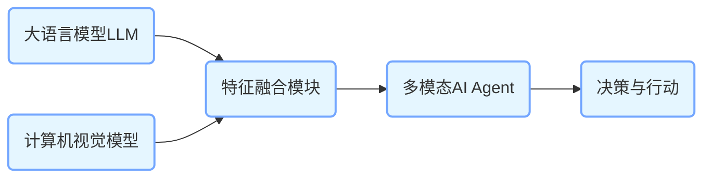

# 多模态AI Agent：整合LLM与计算机视觉的最佳实践

> 关键词：多模态AI Agent、大语言模型（LLM）、计算机视觉、整合、最佳实践

> 摘要：本文围绕多模态AI Agent整合大语言模型（LLM）与计算机视觉展开，深入探讨了其核心概念、算法原理、数学模型等理论知识，通过项目实战展示了具体的开发流程和代码实现，分析了其实际应用场景，推荐了相关的工具和资源，并对未来发展趋势与挑战进行了总结。旨在为开发者和研究者提供全面且深入的技术指导，助力多模态AI Agent技术的进一步发展。

## 1. 背景介绍 
### 1.1 目的和范围
本文章的目的在于深入探讨多模态AI Agent整合大语言模型（LLM）与计算机视觉的最佳实践。随着人工智能技术的不断发展，单一模态的智能系统已经难以满足复杂的现实需求，多模态技术成为了研究和应用的热点。我们将研究如何将大语言模型强大的语言理解和生成能力与计算机视觉对图像、视频等视觉信息的感知和处理能力相结合，构建出更智能、更强大的多模态AI Agent。文章的范围涵盖了从核心概念的介绍、算法原理的分析、数学模型的推导，到实际项目的开发和应用场景的探讨，以及相关工具和资源的推荐等多个方面。

### 1.2 预期读者
本文预期读者包括人工智能领域的开发者、研究人员，以及对多模态AI Agent技术感兴趣的学生和爱好者。对于开发者来说，文章提供了具体的实现思路和代码示例，有助于他们在实际项目中应用相关技术；研究人员可以从文章中获取最新的研究动态和理论知识，为进一步的研究提供参考；学生和爱好者则可以通过阅读本文，了解多模态AI Agent的基本概念和应用场景，激发他们对该领域的学习兴趣。

### 1.3 文档结构概述
本文共分为十个部分。第一部分为背景介绍，阐述了文章的目的、范围、预期读者和文档结构概述，并对相关术语进行了解释。第二部分介绍了多模态AI Agent、大语言模型和计算机视觉的核心概念，以及它们之间的联系，并给出了文本示意图和Mermaid流程图。第三部分详细讲解了核心算法原理，包括特征提取、融合和决策等算法，并使用Python源代码进行了阐述。第四部分介绍了数学模型和公式，如注意力机制的公式等，并进行了详细讲解和举例说明。第五部分是项目实战，包括开发环境搭建、源代码详细实现和代码解读。第六部分分析了多模态AI Agent的实际应用场景。第七部分推荐了学习资源、开发工具框架和相关论文著作。第八部分总结了未来发展趋势与挑战。第九部分为附录，解答了常见问题。第十部分提供了扩展阅读和参考资料。

### 1.4 术语表
#### 1.4.1 核心术语定义
- **多模态AI Agent**：能够同时处理多种模态信息（如文本、图像、音频等）的智能体，通过整合不同模态的信息来完成各种任务。
- **大语言模型（LLM）**：一种基于深度学习的语言模型，具有强大的语言理解和生成能力，通常在大规模文本数据上进行训练。
- **计算机视觉**：研究如何使计算机“看”的科学，包括图像识别、目标检测、图像分割等技术，旨在让计算机从图像或视频中提取有意义的信息。
- **特征提取**：从原始数据中提取出具有代表性的特征，以便后续的处理和分析。
- **特征融合**：将不同模态的特征进行整合，形成更全面、更有效的特征表示。

#### 1.4.2 相关概念解释
- **注意力机制**：一种在深度学习中广泛应用的机制，用于模拟人类的注意力，使模型能够聚焦于输入数据的重要部分。
- **Transformer架构**：一种基于注意力机制的深度学习架构，在自然语言处理和计算机视觉等领域取得了巨大成功。
- **预训练模型**：在大规模数据集上进行无监督或有监督训练得到的模型，这些模型可以作为初始化模型，在特定任务上进行微调，以提高模型的性能。

#### 1.4.3 缩略词列表
- **LLM**：大语言模型（Large Language Model）
- **CNN**：卷积神经网络（Convolutional Neural Network）
- **RNN**：循环神经网络（Recurrent Neural Network）
- **Transformer**：变换器架构（Transformer Architecture）

## 2. 核心概念与联系 

### 核心概念原理
#### 多模态AI Agent
多模态AI Agent是一种智能体，它能够感知和处理多种模态的信息，如文本、图像、音频等，并根据这些信息做出决策和行动。多模态AI Agent的核心思想是将不同模态的信息进行整合，以获得更全面、更准确的理解，从而更好地完成各种任务。例如，在一个智能客服系统中，多模态AI Agent可以同时处理用户的文本提问和上传的图片，提供更精准的解决方案。

#### 大语言模型（LLM）
大语言模型是基于深度学习的语言模型，通常采用Transformer架构。这些模型在大规模的文本数据上进行训练，学习语言的语法、语义和上下文信息，从而能够生成高质量的文本。大语言模型具有强大的语言理解和生成能力，可以用于文本生成、问答系统、机器翻译等任务。例如，GPT系列模型就是典型的大语言模型，它们可以生成自然流畅的文本，回答各种问题。

#### 计算机视觉
计算机视觉是研究如何使计算机“看”的科学，它涉及到图像和视频的处理、分析和理解。计算机视觉的主要任务包括图像分类、目标检测、图像分割、人脸识别等。计算机视觉技术通常基于卷积神经网络（CNN）等深度学习模型，通过对大量图像数据的学习，提取图像的特征，从而实现对图像的理解和分析。例如，在安防领域，计算机视觉技术可以用于监控视频中的目标检测和识别。

### 架构的文本示意图
```plaintext
+-------------------+         +-------------------+
| 大语言模型 (LLM)  |         | 计算机视觉模型    |
+-------------------+         +-------------------+
| 语言理解与生成    |         | 图像特征提取      |
| 文本处理能力      |         | 视觉信息分析      |
+-------------------+         +-------------------+
              \                   /
               \                 /
                +----------------+
                | 特征融合模块   |
                | 整合多模态特征 |
                +----------------+
                       |
                       |
                +----------------+
                | 多模态AI Agent |
                | 决策与行动     |
                +----------------+
```

### Mermaid流程图


从流程图可以看出，大语言模型和计算机视觉模型分别对文本和图像信息进行处理，提取各自的特征。然后，这些特征在特征融合模块中进行整合，形成多模态特征。最后，多模态AI Agent根据这些融合后的特征进行决策和行动。

## 3. 核心算法原理 & 具体操作步骤 

### 特征提取算法
#### 大语言模型的特征提取
大语言模型通常采用Transformer架构，其特征提取过程主要是通过多层的自注意力机制和前馈神经网络来实现的。以下是一个简单的Python代码示例，使用Hugging Face的Transformers库来提取文本的特征：

```python
from transformers import AutoTokenizer, AutoModel
import torch

# 加载预训练的大语言模型和分词器
model_name = "bert-base-uncased"
tokenizer = AutoTokenizer.from_pretrained(model_name)
model = AutoModel.from_pretrained(model_name)

# 输入文本
text = "This is an example sentence."

# 对文本进行分词
inputs = tokenizer(text, return_tensors="pt")

# 通过模型获取特征
with torch.no_grad():
    outputs = model(**inputs)

# 获取最后一层的隐藏状态作为特征
text_features = outputs.last_hidden_state.mean(dim=1).squeeze()

print(text_features.shape)
```

#### 计算机视觉模型的特征提取
计算机视觉模型通常采用卷积神经网络（CNN）来提取图像的特征。以下是一个使用PyTorch和ResNet模型提取图像特征的示例：

```python
import torch
import torchvision.models as models
from torchvision import transforms
from PIL import Image

# 加载预训练的ResNet模型
model = models.resnet18(pretrained=True)
model.eval()

# 定义图像预处理转换
preprocess = transforms.Compose([
    transforms.Resize(256),
    transforms.CenterCrop(224),
    transforms.ToTensor(),
    transforms.Normalize(mean=[0.485, 0.456, 0.406], std=[0.229, 0.224, 0.225])
])

# 加载图像
image = Image.open("example.jpg")

# 对图像进行预处理
input_tensor = preprocess(image)
input_batch = input_tensor.unsqueeze(0)

# 通过模型获取特征
with torch.no_grad():
    features = model(input_batch)

print(features.shape)
```

### 特征融合算法
特征融合的目的是将不同模态的特征进行整合，形成更全面、更有效的特征表示。常见的特征融合方法包括早期融合、晚期融合和混合融合。以下是一个简单的晚期融合示例，将文本特征和图像特征进行拼接：

```python
import torch

# 假设text_features和image_features已经提取好
# 这里简单生成示例特征
text_features = torch.randn(1, 768)
image_features = torch.randn(1, 512)

# 晚期融合：特征拼接
fused_features = torch.cat((text_features, image_features), dim=1)

print(fused_features.shape)
```

### 决策算法
决策算法根据融合后的特征来做出决策和行动。在实际应用中，通常会使用分类器或回归器等模型。以下是一个简单的使用逻辑回归分类器进行决策的示例：

```python
from sklearn.linear_model import LogisticRegression
import numpy as np

# 假设fused_features是融合后的特征，labels是对应的标签
# 这里简单生成示例数据
fused_features = np.random.randn(100, 768 + 512)
labels = np.random.randint(0, 2, 100)

# 创建逻辑回归分类器
clf = LogisticRegression()

# 训练分类器
clf.fit(fused_features, labels)

# 预测新的样本
new_sample = np.random.randn(1, 768 + 512)
prediction = clf.predict(new_sample)

print(prediction)
```

## 4. 数学模型和公式 & 详细讲解 & 举例说明 

### 自注意力机制公式
自注意力机制是Transformer架构的核心，它允许模型在处理输入序列时，关注序列中的不同部分。自注意力机制的计算公式如下：

$$
\text{Attention}(Q, K, V) = \text{softmax}(\frac{QK^T}{\sqrt{d_k}})V
$$

其中，$Q$ 是查询矩阵，$K$ 是键矩阵，$V$ 是值矩阵，$d_k$ 是键的维度。$\text{softmax}$ 函数用于对注意力分数进行归一化，使得所有注意力分数之和为1。

详细讲解：
- 查询矩阵 $Q$、键矩阵 $K$ 和值矩阵 $V$ 是通过对输入序列进行线性变换得到的。
- $QK^T$ 计算了查询和键之间的相似度，得到注意力分数矩阵。
- $\frac{1}{\sqrt{d_k}}$ 是缩放因子，用于防止点积结果过大，导致 $\text{softmax}$ 函数的梯度消失。
- $\text{softmax}$ 函数将注意力分数矩阵转换为注意力权重矩阵，使得每个位置的注意力权重之和为1。
- 最后，将注意力权重矩阵与值矩阵 $V$ 相乘，得到加权和，即自注意力机制的输出。

举例说明：
假设输入序列为 $x = [x_1, x_2, x_3]$，每个 $x_i$ 的维度为 $d$。首先，通过线性变换得到 $Q$、$K$ 和 $V$：

$$
Q = W_qx, \quad K = W_kx, \quad V = W_vx
$$

其中，$W_q$、$W_k$ 和 $W_v$ 是可学习的权重矩阵。然后，计算注意力分数矩阵：

$$
\text{Score} = QK^T = \begin{bmatrix}
q_1^Tk_1 & q_1^Tk_2 & q_1^Tk_3 \\
q_2^Tk_1 & q_2^Tk_2 & q_2^Tk_3 \\
q_3^Tk_1 & q_3^Tk_2 & q_3^Tk_3
\end{bmatrix}
$$

接着，对注意力分数矩阵进行缩放和 $\text{softmax}$ 操作：

$$
\text{AttentionWeights} = \text{softmax}(\frac{\text{Score}}{\sqrt{d_k}})
$$

最后，计算自注意力机制的输出：

$$
\text{Output} = \text{AttentionWeights}V
$$

### 卷积神经网络的卷积操作公式
卷积神经网络（CNN）中的卷积操作是其核心操作，用于提取图像的特征。卷积操作的公式如下：

$$
y_{i,j} = \sum_{m=0}^{M-1} \sum_{n=0}^{N-1} x_{i+m,j+n} \cdot w_{m,n} + b
$$

其中，$x$ 是输入图像，$y$ 是卷积输出，$w$ 是卷积核，$b$ 是偏置项，$M$ 和 $N$ 是卷积核的大小。

详细讲解：
- 卷积核 $w$ 在输入图像 $x$ 上滑动，每次与输入图像的一个局部区域进行逐元素相乘并求和，得到卷积输出的一个元素。
- 偏置项 $b$ 是一个常数，用于调整卷积输出的偏移量。
- 卷积操作可以通过共享卷积核的参数，减少模型的参数数量，提高模型的训练效率。

举例说明：
假设输入图像 $x$ 是一个 $3\times3$ 的矩阵，卷积核 $w$ 是一个 $2\times2$ 的矩阵，偏置项 $b = 1$：

$$
x = \begin{bmatrix}
1 & 2 & 3 \\
4 & 5 & 6 \\
7 & 8 & 9
\end{bmatrix}, \quad w = \begin{bmatrix}
1 & 0 \\
0 & 1
\end{bmatrix}
$$

卷积操作的过程如下：

$$
y_{0,0} = x_{0,0} \cdot w_{0,0} + x_{0,1} \cdot w_{0,1} + x_{1,0} \cdot w_{1,0} + x_{1,1} \cdot w_{1,1} + b = 1 \cdot 1 + 2 \cdot 0 + 4 \cdot 0 + 5 \cdot 1 + 1 = 7
$$

$$
y_{0,1} = x_{0,1} \cdot w_{0,0} + x_{0,2} \cdot w_{0,1} + x_{1,1} \cdot w_{1,0} + x_{1,2} \cdot w_{1,1} + b = 2 \cdot 1 + 3 \cdot 0 + 5 \cdot 0 + 6 \cdot 1 + 1 = 9
$$

$$
y_{1,0} = x_{1,0} \cdot w_{0,0} + x_{1,1} \cdot w_{0,1} + x_{2,0} \cdot w_{1,0} + x_{2,1} \cdot w_{1,1} + b = 4 \cdot 1 + 5 \cdot 0 + 7 \cdot 0 + 8 \cdot 1 + 1 = 13
$$

$$
y_{1,1} = x_{1,1} \cdot w_{0,0} + x_{1,2} \cdot w_{0,1} + x_{2,1} \cdot w_{1,0} + x_{2,2} \cdot w_{1,1} + b = 5 \cdot 1 + 6 \cdot 0 + 8 \cdot 0 + 9 \cdot 1 + 1 = 15
$$

因此，卷积输出 $y$ 是一个 $2\times2$ 的矩阵：

$$
y = \begin{bmatrix}
7 & 9 \\
13 & 15
\end{bmatrix}
$$

## 5. 项目实战：代码实际案例和详细解释说明 

### 5.1  开发环境搭建
#### 操作系统
建议使用Ubuntu 20.04或更高版本的Linux系统，或者Windows 10/11操作系统。

#### Python环境
安装Python 3.8或更高版本。可以使用Anaconda来管理Python环境，以下是创建和激活虚拟环境的命令：

```bash
conda create -n multimodal_agent python=3.8
conda activate multimodal_agent
```

#### 依赖库安装
安装必要的Python库，包括PyTorch、Transformers、torchvision等：

```bash
pip install torch torchvision
pip install transformers
pip install scikit-learn
```

### 5.2  源代码详细实现和代码解读
以下是一个完整的多模态AI Agent示例，用于图像描述生成任务。该示例整合了大语言模型（GPT-2）和计算机视觉模型（ResNet-18）。

```python
import torch
import torchvision.models as models
from torchvision import transforms
from transformers import GPT2LMHeadModel, GPT2Tokenizer
from PIL import Image

# 加载预训练的计算机视觉模型（ResNet-18）
vision_model = models.resnet18(pretrained=True)
vision_model.eval()

# 定义图像预处理转换
preprocess = transforms.Compose([
    transforms.Resize(256),
    transforms.CenterCrop(224),
    transforms.ToTensor(),
    transforms.Normalize(mean=[0.485, 0.456, 0.406], std=[0.229, 0.224, 0.225])
])

# 加载预训练的大语言模型（GPT-2）和分词器
language_model = GPT2LMHeadModel.from_pretrained('gpt2')
tokenizer = GPT2Tokenizer.from_pretrained('gpt2')

def extract_image_features(image_path):
    # 加载图像
    image = Image.open(image_path)
    # 对图像进行预处理
    input_tensor = preprocess(image)
    input_batch = input_tensor.unsqueeze(0)

    # 通过视觉模型获取特征
    with torch.no_grad():
        features = vision_model(input_batch)

    return features

def generate_image_description(image_features):
    # 这里简单地将图像特征转换为文本输入格式
    # 实际应用中可能需要更复杂的处理
    input_text = f"Image features: {image_features.flatten().tolist()}"
    input_ids = tokenizer.encode(input_text, return_tensors='pt')

    # 通过语言模型生成图像描述
    with torch.no_grad():
        output = language_model.generate(input_ids, max_length=50, num_beams=5, no_repeat_ngram_size=2, early_stopping=True)

    description = tokenizer.decode(output[0], skip_special_tokens=True)
    return description

# 示例图像路径
image_path = "example.jpg"

# 提取图像特征
image_features = extract_image_features(image_path)

# 生成图像描述
description = generate_image_description(image_features)

print("Generated image description:", description)
```

### 5.3  代码解读与分析
- **图像特征提取**：`extract_image_features` 函数负责加载图像并通过ResNet-18模型提取图像特征。首先，使用 `torchvision.transforms` 对图像进行预处理，然后将预处理后的图像输入到ResNet-18模型中，得到图像特征。
- **图像描述生成**：`generate_image_description` 函数将提取的图像特征转换为文本输入格式，并使用GPT-2模型生成图像描述。通过 `tokenizer.encode` 将输入文本转换为输入ID，然后使用 `language_model.generate` 生成图像描述。
- **主程序**：加载示例图像，调用 `extract_image_features` 函数提取图像特征，再调用 `generate_image_description` 函数生成图像描述，并打印结果。

需要注意的是，这个示例只是一个简单的演示，实际应用中可能需要更复杂的特征融合和模型训练过程。

## 6. 实际应用场景 
### 智能客服系统
在智能客服系统中，多模态AI Agent可以同时处理用户的文本提问和上传的图片。例如，用户在咨询产品问题时，可以上传产品的图片，多模态AI Agent可以通过计算机视觉技术识别图片中的产品特征，结合用户的文本提问，提供更精准的解决方案。这可以大大提高客服的效率和用户满意度。

### 自动驾驶
在自动驾驶领域，多模态AI Agent可以整合摄像头、雷达等多种传感器的数据。摄像头提供的图像信息可以通过计算机视觉技术进行处理，识别道路、交通标志和其他车辆等；雷达数据可以提供距离和速度等信息。大语言模型可以用于处理复杂的决策和规划任务，如根据交通情况和目的地生成最佳行驶路线。通过整合多模态信息，自动驾驶系统可以更加安全和可靠。

### 智能家居
在智能家居系统中，多模态AI Agent可以通过摄像头识别用户的手势和表情，通过语音识别技术理解用户的语音指令。例如，用户可以通过手势控制灯光的开关和亮度，通过语音指令控制家电的运行。多模态AI Agent可以根据用户的不同模态输入，智能地控制家居设备，提供更加便捷和个性化的服务。

### 医疗诊断
在医疗诊断领域，多模态AI Agent可以整合医学图像（如X光、CT等）和患者的病历文本信息。计算机视觉技术可以对医学图像进行分析，检测病变和异常；大语言模型可以对病历文本进行理解和分析，提供诊断建议。通过整合多模态信息，医生可以更准确地进行诊断和治疗。

## 7. 工具和资源推荐
### 7.1 学习资源推荐
#### 7.1.1 书籍推荐
- 《深度学习》（Deep Learning）：由Ian Goodfellow、Yoshua Bengio和Aaron Courville所著，是深度学习领域的经典教材，涵盖了神经网络、卷积神经网络、循环神经网络等基础知识。
- 《Python深度学习》（Deep Learning with Python）：由Francois Chollet所著，介绍了如何使用Python和Keras库进行深度学习开发，适合初学者。
- 《动手学深度学习》（Dive into Deep Learning）：由李沐等人所著，提供了丰富的代码示例和详细的解释，适合实践学习。

#### 7.1.2 在线课程
- Coursera上的“深度学习专项课程”（Deep Learning Specialization）：由Andrew Ng教授授课，包括神经网络、卷积神经网络、循环神经网络等多个课程，内容全面。
- edX上的“计算机视觉：从基础到实践”（Computer Vision: From Basics to Practice）：介绍了计算机视觉的基本概念和技术，包括图像分类、目标检测等。
- 吴恩达的“机器学习”课程：虽然不是专门针对多模态AI，但对于理解机器学习的基本原理和算法非常有帮助。

#### 7.1.3 技术博客和网站
- Hugging Face博客：提供了关于大语言模型和自然语言处理的最新研究和技术分享。
- Medium上的AI相关博客：有很多作者分享关于人工智能、计算机视觉和多模态技术的文章。
- 计算机视觉基金会（CVF）的官方网站：提供了计算机视觉领域的最新研究成果和会议信息。

### 7.2 开发工具框架推荐
#### 7.2.1 IDE和编辑器
- PyCharm：是一款专门为Python开发设计的集成开发环境，具有代码自动补全、调试、版本控制等功能。
- Jupyter Notebook：一种交互式的开发环境，适合进行数据探索和模型实验，可以方便地展示代码和结果。
- Visual Studio Code：一款轻量级的代码编辑器，支持多种编程语言，有丰富的插件可以扩展功能。

#### 7.2.2 调试和性能分析工具
- PyTorch Profiler：可以帮助开发者分析PyTorch模型的性能瓶颈，找出耗时的操作和内存使用情况。
- TensorBoard：是TensorFlow的可视化工具，也可以与PyTorch集成，用于可视化模型的训练过程和性能指标。
- cProfile：Python自带的性能分析工具，可以分析Python代码的执行时间和函数调用关系。

#### 7.2.3 相关框架和库
- PyTorch：一个开源的深度学习框架，具有动态图和丰富的模型库，广泛应用于自然语言处理和计算机视觉领域。
- Hugging Face Transformers：提供了各种预训练的大语言模型和工具，方便开发者进行自然语言处理任务。
- torchvision：是PyTorch的计算机视觉库，包含了常用的数据集、模型和图像变换函数。

### 7.3 相关论文著作推荐
#### 7.3.1 经典论文
- “Attention Is All You Need”：介绍了Transformer架构，是自然语言处理领域的里程碑论文。
- “ImageNet Classification with Deep Convolutional Neural Networks”：提出了AlexNet模型，开启了深度学习在计算机视觉领域的应用。
- “Show and Tell: A Neural Image Caption Generator”：提出了一种基于神经网络的图像描述生成模型。

#### 7.3.2 最新研究成果
- 在NeurIPS、ICCV、CVPR等顶级学术会议上发表的关于多模态AI Agent的研究论文，这些论文反映了该领域的最新研究动态和技术趋势。
- arXiv上的预印本论文，很多研究人员会在arXiv上提前发表自己的研究成果。

#### 7.3.3 应用案例分析
- 一些知名科技公司（如Google、Microsoft、Facebook等）发表的关于多模态AI Agent在实际应用中的案例分析报告，这些报告可以帮助开发者了解如何将技术应用到实际项目中。

## 8. 总结：未来发展趋势与挑战
### 未来发展趋势
#### 更强大的多模态融合能力
未来的多模态AI Agent将具备更强大的多模态融合能力，能够更深入地理解不同模态信息之间的关系。例如，不仅能够简单地拼接不同模态的特征，还能够挖掘出模态之间的语义关联，从而实现更准确的决策和行动。

#### 跨领域应用拓展
多模态AI Agent将在更多的领域得到应用，如教育、金融、娱乐等。在教育领域，多模态AI Agent可以根据学生的学习行为数据（文本、图像、视频等）提供个性化的学习方案；在金融领域，可以用于风险评估和投资决策等。

#### 与物联网的深度融合
随着物联网技术的发展，多模态AI Agent将与物联网设备深度融合。例如，智能传感器可以收集各种模态的数据，多模态AI Agent可以对这些数据进行实时分析和处理，实现智能家居、智能城市等应用。

### 挑战
#### 数据获取和标注困难
多模态数据的获取和标注比单模态数据更加困难。不同模态的数据来源不同，格式也不同，需要进行复杂的预处理和对齐。同时，标注多模态数据需要专业的知识和大量的人力成本。

#### 计算资源需求大
多模态AI Agent通常需要处理大量的数据和复杂的模型，对计算资源的需求非常大。训练和部署多模态模型需要高性能的GPU和服务器，这增加了开发和应用的成本。

#### 模型解释性差
多模态AI Agent的模型通常比较复杂，缺乏良好的解释性。在一些对安全性和可靠性要求较高的应用场景中，如医疗诊断和自动驾驶，模型的解释性是一个关键问题。

## 9. 附录：常见问题与解答
### 问题1：多模态AI Agent和单模态AI系统有什么区别？
解答：单模态AI系统只能处理单一类型的信息，如文本、图像或音频。而多模态AI Agent能够同时处理多种模态的信息，并将这些信息进行整合，从而获得更全面、更准确的理解。例如，单模态的图像识别系统只能识别图像中的物体，而多模态AI Agent可以结合图像和文本信息，提供更详细的描述和解释。

### 问题2：如何选择合适的大语言模型和计算机视觉模型进行整合？
解答：选择合适的模型需要考虑多个因素，如任务需求、数据规模、计算资源等。对于大语言模型，如果任务对语言生成能力要求较高，可以选择GPT系列模型；如果对语言理解能力要求较高，可以选择BERT系列模型。对于计算机视觉模型，如果任务是图像分类，可以选择ResNet、VGG等模型；如果是目标检测，可以选择Faster R-CNN、YOLO等模型。

### 问题3：多模态AI Agent的训练过程有什么特殊之处？
解答：多模态AI Agent的训练过程比单模态模型更加复杂。首先，需要处理不同模态的数据，包括数据的预处理、对齐和融合。其次，训练过程中需要考虑不同模态之间的平衡，避免某个模态的信息主导训练结果。此外，多模态AI Agent的训练通常需要更多的计算资源和更长的训练时间。

### 问题4：如何评估多模态AI Agent的性能？
解答：评估多模态AI Agent的性能需要综合考虑多个指标。对于不同的任务，可以使用不同的评估指标。例如，在图像描述生成任务中，可以使用BLEU、ROUGE等指标来评估生成的描述与真实描述的相似度；在分类任务中，可以使用准确率、召回率、F1值等指标来评估模型的分类性能。同时，还可以进行人工评估，通过用户的反馈来评估多模态AI Agent的性能。

## 10. 扩展阅读 & 参考资料
### 扩展阅读
- 《多模态机器学习：基础与应用》（Multimodal Machine Learning: Foundations and Applications）：深入介绍了多模态机器学习的理论和方法。
- 《人工智能：一种现代的方法》（Artificial Intelligence: A Modern Approach）：涵盖了人工智能的各个领域，包括多模态AI Agent。
- 相关的学术期刊和会议论文集，如《Journal of Artificial Intelligence Research》、《ACM Transactions on Intelligent Systems and Technology》等。

### 参考资料
- Hugging Face官方文档：https://huggingface.co/docs
- PyTorch官方文档：https://pytorch.org/docs/stable/index.html
- torchvision官方文档：https://pytorch.org/vision/stable/index.html

作者：AI天才研究院/AI Genius Institute & 禅与计算机程序设计艺术 /Zen And The Art of Computer Programming