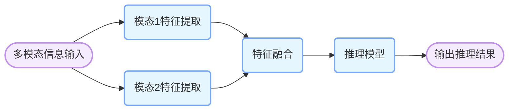

# 多模态信息整合推理的神经网络架构设计

> 关键词：多模态信息、整合推理、神经网络架构、深度学习、特征融合

> 摘要：本文聚焦于多模态信息整合推理的神经网络架构设计。首先介绍了多模态信息处理的背景，包括其目的、预期读者和文档结构等。详细阐述了多模态信息整合推理的核心概念，通过文本示意图和Mermaid流程图进行直观展示。深入分析了核心算法原理，并给出Python代码示例。讲解了相关的数学模型和公式，并举例说明。通过项目实战，展示了代码的实际应用和详细解读。探讨了多模态信息整合推理在不同场景下的实际应用，推荐了学习资源、开发工具框架以及相关论文著作。最后总结了未来发展趋势与挑战，并提供了常见问题的解答和扩展阅读参考资料。

## 1. 背景介绍 
### 1.1 目的和范围
在现实世界中，信息通常以多种模态的形式存在，如文本、图像、音频等。多模态信息整合推理旨在将这些不同模态的信息进行有效的融合和处理，以实现更准确、更智能的决策和理解。本文章的目的是深入探讨如何设计神经网络架构来实现多模态信息的整合推理，涵盖了从核心概念到实际应用的多个方面，包括算法原理、数学模型、项目实战等。

### 1.2 预期读者
本文预期读者包括人工智能领域的研究人员、开发者、数据科学家以及对多模态信息处理感兴趣的学生。无论是初学者希望了解多模态信息整合推理的基本原理，还是有一定经验的专业人士寻求更深入的技术细节和创新思路，都能从本文中获得有价值的信息。

### 1.3 文档结构概述
本文将按照以下结构进行阐述：首先介绍多模态信息整合推理的背景知识，包括目的、读者群体和文档结构等。接着详细讲解核心概念，通过示意图和流程图进行直观展示。然后深入分析核心算法原理，并给出Python代码示例。之后介绍相关的数学模型和公式，并举例说明。通过项目实战，展示代码的实际应用和详细解读。探讨多模态信息整合推理在不同场景下的实际应用。推荐学习资源、开发工具框架以及相关论文著作。最后总结未来发展趋势与挑战，并提供常见问题的解答和扩展阅读参考资料。

### 1.4 术语表
#### 1.4.1 核心术语定义
- **多模态信息**：指来自不同来源、具有不同表现形式的信息，如文本、图像、音频、视频等。
- **信息整合**：将不同模态的信息进行融合，以获取更全面、更准确的信息表示。
- **推理**：根据整合后的信息进行逻辑判断和决策的过程。
- **神经网络架构**：指神经网络的结构和组织方式，包括神经元的连接方式、层数、激活函数等。

#### 1.4.2 相关概念解释
- **特征提取**：从原始数据中提取出具有代表性的特征，以便后续的处理和分析。
- **特征融合**：将不同模态的特征进行合并，以实现信息的整合。
- **深度学习**：一种基于神经网络的机器学习方法，通过多层神经网络自动学习数据的特征和模式。

#### 1.4.3 缩略词列表
- **CNN**：Convolutional Neural Network，卷积神经网络
- **RNN**：Recurrent Neural Network，循环神经网络
- **LSTM**：Long Short-Term Memory，长短期记忆网络
- **GRU**：Gated Recurrent Unit，门控循环单元
- **Transformer**：一种基于自注意力机制的神经网络架构

## 2. 核心概念与联系 
### 核心概念原理
多模态信息整合推理的核心在于如何有效地将不同模态的信息进行融合，并利用融合后的信息进行推理。一般来说，多模态信息整合推理的过程可以分为以下几个步骤：
1. **特征提取**：从不同模态的原始数据中提取出具有代表性的特征。例如，对于图像数据，可以使用卷积神经网络（CNN）提取图像的视觉特征；对于文本数据，可以使用循环神经网络（RNN）或Transformer提取文本的语义特征。
2. **特征融合**：将不同模态的特征进行合并，以实现信息的整合。常见的特征融合方法包括早期融合、晚期融合和混合融合等。
3. **推理**：根据融合后的特征进行逻辑判断和决策。可以使用全连接神经网络、支持向量机等分类器进行推理。

### 架构的文本示意图
```plaintext
多模态信息输入
|
|-- 模态1特征提取（如CNN提取图像特征）
|-- 模态2特征提取（如RNN提取文本特征）
|
|-- 特征融合（早期融合、晚期融合或混合融合）
|
|-- 推理模型（如全连接神经网络）
|
输出推理结果
```

### Mermaid流程图


## 3. 核心算法原理 & 具体操作步骤 
### 特征提取算法原理
#### 图像特征提取（以CNN为例）
卷积神经网络（CNN）是一种专门用于处理图像数据的神经网络架构。它通过卷积层、池化层和全连接层等组件，自动学习图像的特征。以下是一个简单的Python代码示例，使用PyTorch实现一个简单的CNN进行图像特征提取：

```python
import torch
import torch.nn as nn

class SimpleCNN(nn.Module):
    def __init__(self):
        super(SimpleCNN, self).__init__()
        self.conv1 = nn.Conv2d(3, 16, kernel_size=3, padding=1)
        self.relu1 = nn.ReLU()
        self.pool1 = nn.MaxPool2d(2)
        self.conv2 = nn.Conv2d(16, 32, kernel_size=3, padding=1)
        self.relu2 = nn.ReLU()
        self.pool2 = nn.MaxPool2d(2)

    def forward(self, x):
        x = self.pool1(self.relu1(self.conv1(x)))
        x = self.pool2(self.relu2(self.conv2(x)))
        return x

# 示例使用
model = SimpleCNN()
input_image = torch.randn(1, 3, 32, 32)  # 假设输入图像为3通道，尺寸为32x32
features = model(input_image)
print(features.shape)
```

#### 文本特征提取（以LSTM为例）
长短期记忆网络（LSTM）是一种特殊的循环神经网络，能够有效地处理序列数据，如文本。以下是一个简单的Python代码示例，使用PyTorch实现一个简单的LSTM进行文本特征提取：

```python
import torch
import torch.nn as nn

class SimpleLSTM(nn.Module):
    def __init__(self, input_size, hidden_size, num_layers):
        super(SimpleLSTM, self).__init__()
        self.lstm = nn.LSTM(input_size, hidden_size, num_layers, batch_first=True)

    def forward(self, x):
        out, _ = self.lstm(x)
        return out[:, -1, :]  # 取最后一个时间步的输出作为特征

# 示例使用
input_size = 100
hidden_size = 200
num_layers = 1
model = SimpleLSTM(input_size, hidden_size, num_layers)
input_text = torch.randn(1, 10, input_size)  # 假设输入文本序列长度为10
features = model(input_text)
print(features.shape)
```

### 特征融合算法原理
#### 早期融合
早期融合是指在特征提取之前将不同模态的原始数据进行合并，然后一起进行特征提取。以下是一个简单的Python代码示例，展示早期融合的实现：

```python
import torch

# 假设图像特征和文本特征的输入
image_features = torch.randn(1, 100)
text_features = torch.randn(1, 100)

# 早期融合
merged_features = torch.cat((image_features, text_features), dim=1)
print(merged_features.shape)
```

#### 晚期融合
晚期融合是指在特征提取之后将不同模态的特征进行合并，然后进行推理。以下是一个简单的Python代码示例，展示晚期融合的实现：

```python
import torch
import torch.nn as nn

# 假设图像特征和文本特征的输入
image_features = torch.randn(1, 100)
text_features = torch.randn(1, 100)

# 定义一个简单的全连接层进行推理
class InferenceModel(nn.Module):
    def __init__(self, input_size, output_size):
        super(InferenceModel, self).__init__()
        self.fc = nn.Linear(input_size, output_size)

    def forward(self, x):
        return self.fc(x)

# 晚期融合
merged_features = torch.cat((image_features, text_features), dim=1)

# 推理
input_size = 200
output_size = 10
model = InferenceModel(input_size, output_size)
output = model(merged_features)
print(output.shape)
```

### 推理算法原理
推理过程通常使用分类器或回归器根据融合后的特征进行决策。以下是一个简单的Python代码示例，使用全连接神经网络进行推理：

```python
import torch
import torch.nn as nn

# 假设融合后的特征输入
merged_features = torch.randn(1, 200)

# 定义一个简单的全连接神经网络进行推理
class InferenceModel(nn.Module):
    def __init__(self, input_size, hidden_size, output_size):
        super(InferenceModel, self).__init__()
        self.fc1 = nn.Linear(input_size, hidden_size)
        self.relu = nn.ReLU()
        self.fc2 = nn.Linear(hidden_size, output_size)

    def forward(self, x):
        x = self.relu(self.fc1(x))
        x = self.fc2(x)
        return x

# 推理
input_size = 200
hidden_size = 100
output_size = 10
model = InferenceModel(input_size, hidden_size, output_size)
output = model(merged_features)
print(output.shape)
```

## 4. 数学模型和公式 & 详细讲解 & 举例说明 
### 特征提取的数学模型
#### 卷积操作
在卷积神经网络中，卷积操作是核心操作之一。卷积操作可以表示为：

$$y_{i,j}^k = \sum_{m=0}^{M-1} \sum_{n=0}^{N-1} x_{i+m,j+n}^l \cdot w_{m,n}^{l,k} + b^k$$

其中，$x$ 是输入特征图，$w$ 是卷积核，$b$ 是偏置项，$y$ 是输出特征图。$i$ 和 $j$ 是输出特征图的位置索引，$k$ 是输出通道索引，$l$ 是输入通道索引，$M$ 和 $N$ 是卷积核的大小。

#### LSTM单元
LSTM单元的数学模型可以表示为：

$$i_t = \sigma(W_{ii}x_t + W_{hi}h_{t-1} + b_i)$$
$$f_t = \sigma(W_{if}x_t + W_{hf}h_{t-1} + b_f)$$
$$o_t = \sigma(W_{io}x_t + W_{ho}h_{t-1} + b_o)$$
$$\tilde{C}_t = \tanh(W_{ic}x_t + W_{hc}h_{t-1} + b_c)$$
$$C_t = f_t \odot C_{t-1} + i_t \odot \tilde{C}_t$$
$$h_t = o_t \odot \tanh(C_t)$$

其中，$i_t$ 是输入门，$f_t$ 是遗忘门，$o_t$ 是输出门，$\tilde{C}_t$ 是候选记忆单元，$C_t$ 是记忆单元，$h_t$ 是隐藏状态，$\sigma$ 是sigmoid函数，$\tanh$ 是双曲正切函数，$W$ 是权重矩阵，$b$ 是偏置项，$\odot$ 是逐元素相乘。

### 特征融合的数学模型
#### 早期融合
早期融合可以表示为：

$$\mathbf{x}_{merged} = [\mathbf{x}_{image}; \mathbf{x}_{text}]$$

其中，$\mathbf{x}_{image}$ 是图像特征，$\mathbf{x}_{text}$ 是文本特征，$[\cdot; \cdot]$ 表示向量拼接操作。

#### 晚期融合
晚期融合可以表示为：

$$\mathbf{y} = f([\mathbf{h}_{image}; \mathbf{h}_{text}])$$

其中，$\mathbf{h}_{image}$ 是图像特征，$\mathbf{h}_{text}$ 是文本特征，$f$ 是推理模型。

### 推理的数学模型
推理过程通常使用线性变换和激活函数。对于一个简单的全连接神经网络，其数学模型可以表示为：

$$\mathbf{y} = \sigma(W_2 \cdot \sigma(W_1 \cdot \mathbf{x} + b_1) + b_2)$$

其中，$\mathbf{x}$ 是输入特征，$W_1$ 和 $W_2$ 是权重矩阵，$b_1$ 和 $b_2$ 是偏置项，$\sigma$ 是激活函数。

### 举例说明
假设我们有一个图像分类任务，输入图像的尺寸为 $32 \times 32$，通道数为 3，文本描述的长度为 10，每个词的向量维度为 100。我们使用上述的CNN进行图像特征提取，LSTM进行文本特征提取，早期融合进行特征融合，全连接神经网络进行推理。

#### 图像特征提取
输入图像 $\mathbf{x}_{image}$ 的形状为 $(1, 3, 32, 32)$，经过CNN后得到的图像特征 $\mathbf{h}_{image}$ 的形状为 $(1, 32, 8, 8)$。

#### 文本特征提取
输入文本 $\mathbf{x}_{text}$ 的形状为 $(1, 10, 100)$，经过LSTM后得到的文本特征 $\mathbf{h}_{text}$ 的形状为 $(1, 200)$。

#### 特征融合
将图像特征 $\mathbf{h}_{image}$ 展平为 $(1, 2048)$，然后与文本特征 $\mathbf{h}_{text}$ 进行早期融合，得到融合后的特征 $\mathbf{x}_{merged}$ 的形状为 $(1, 2248)$。

#### 推理
将融合后的特征 $\mathbf{x}_{merged}$ 输入到全连接神经网络中，经过推理得到输出 $\mathbf{y}$ 的形状为 $(1, 10)$，表示分类结果的概率分布。

## 5. 项目实战：代码实际案例和详细解释说明 
### 5.1  开发环境搭建
#### 安装Python和Anaconda
首先，确保你已经安装了Python和Anaconda。可以从Python官方网站（https://www.python.org/downloads/） 下载Python，从Anaconda官方网站（https://www.anaconda.com/products/individual） 下载Anaconda。

#### 创建虚拟环境
使用Anaconda创建一个新的虚拟环境：

```bash
conda create -n multimodal python=3.8
conda activate multimodal
```

#### 安装必要的库
在虚拟环境中安装必要的库，如PyTorch、NumPy、Pandas等：

```bash
pip install torch torchvision numpy pandas
```

### 5.2  源代码详细实现和代码解读
#### 数据准备
假设我们有一个多模态数据集，包含图像和文本信息。我们可以使用以下代码读取和预处理数据：

```python
import torch
from torch.utils.data import Dataset, DataLoader
import numpy as np
import pandas as pd
from PIL import Image

class MultimodalDataset(Dataset):
    def __init__(self, csv_file, image_dir):
        self.data = pd.read_csv(csv_file)
        self.image_dir = image_dir

    def __len__(self):
        return len(self.data)

    def __getitem__(self, idx):
        # 读取图像
        image_path = self.image_dir + self.data.iloc[idx, 0]
        image = Image.open(image_path).convert('RGB')
        image = np.array(image) / 255.0
        image = torch.tensor(image, dtype=torch.float32).permute(2, 0, 1)

        # 读取文本
        text = self.data.iloc[idx, 1]
        # 这里可以进行文本预处理，如分词、编码等

        # 读取标签
        label = self.data.iloc[idx, 2]
        label = torch.tensor(label, dtype=torch.long)

        return image, text, label

# 示例使用
csv_file = 'data.csv'
image_dir = 'images/'
dataset = MultimodalDataset(csv_file, image_dir)
dataloader = DataLoader(dataset, batch_size=32, shuffle=True)
```

#### 模型定义
我们可以使用前面介绍的CNN和LSTM进行特征提取，早期融合进行特征融合，全连接神经网络进行推理。以下是模型的定义代码：

```python
import torch
import torch.nn as nn

class ImageFeatureExtractor(nn.Module):
    def __init__(self):
        super(ImageFeatureExtractor, self).__init__()
        self.conv1 = nn.Conv2d(3, 16, kernel_size=3, padding=1)
        self.relu1 = nn.ReLU()
        self.pool1 = nn.MaxPool2d(2)
        self.conv2 = nn.Conv2d(16, 32, kernel_size=3, padding=1)
        self.relu2 = nn.ReLU()
        self.pool2 = nn.MaxPool2d(2)

    def forward(self, x):
        x = self.pool1(self.relu1(self.conv1(x)))
        x = self.pool2(self.relu2(self.conv2(x)))
        x = x.view(x.size(0), -1)
        return x

class TextFeatureExtractor(nn.Module):
    def __init__(self, input_size, hidden_size, num_layers):
        super(TextFeatureExtractor, self).__init__()
        self.lstm = nn.LSTM(input_size, hidden_size, num_layers, batch_first=True)

    def forward(self, x):
        out, _ = self.lstm(x)
        return out[:, -1, :]

class MultimodalModel(nn.Module):
    def __init__(self, image_feature_size, text_feature_size, hidden_size, output_size):
        super(MultimodalModel, self).__init__()
        self.image_extractor = ImageFeatureExtractor()
        self.text_extractor = TextFeatureExtractor(input_size=100, hidden_size=200, num_layers=1)
        self.fc1 = nn.Linear(image_feature_size + text_feature_size, hidden_size)
        self.relu = nn.ReLU()
        self.fc2 = nn.Linear(hidden_size, output_size)

    def forward(self, image, text):
        image_features = self.image_extractor(image)
        text_features = self.text_extractor(text)
        merged_features = torch.cat((image_features, text_features), dim=1)
        x = self.relu(self.fc1(merged_features))
        x = self.fc2(x)
        return x

# 示例使用
image_feature_size = 2048
text_feature_size = 200
hidden_size = 100
output_size = 10
model = MultimodalModel(image_feature_size, text_feature_size, hidden_size, output_size)
```

#### 训练模型
使用以下代码训练模型：

```python
import torch.optim as optim

# 定义损失函数和优化器
criterion = nn.CrossEntropyLoss()
optimizer = optim.Adam(model.parameters(), lr=0.001)

# 训练模型
num_epochs = 10
for epoch in range(num_epochs):
    running_loss = 0.0
    for images, texts, labels in dataloader:
        optimizer.zero_grad()

        # 前向传播
        outputs = model(images, texts)
        loss = criterion(outputs, labels)

        # 反向传播和优化
        loss.backward()
        optimizer.step()

        running_loss += loss.item()

    print(f'Epoch {epoch+1}, Loss: {running_loss / len(dataloader)}')
```

### 5.3  代码解读与分析
#### 数据准备部分
`MultimodalDataset` 类继承自 `torch.utils.data.Dataset`，用于读取和预处理多模态数据。`__getitem__` 方法返回图像、文本和标签。`DataLoader` 用于批量加载数据。

#### 模型定义部分
`ImageFeatureExtractor` 类使用CNN提取图像特征，`TextFeatureExtractor` 类使用LSTM提取文本特征。`MultimodalModel` 类将图像特征和文本特征进行早期融合，然后通过全连接神经网络进行推理。

#### 训练模型部分
使用交叉熵损失函数和Adam优化器进行模型训练。在每个epoch中，遍历数据集，进行前向传播、反向传播和优化。

## 6. 实际应用场景 
### 智能安防
在智能安防领域，多模态信息整合推理可以结合视频监控和传感器数据，实现更准确的异常检测和预警。例如，通过分析监控视频中的图像和声音信息，以及传感器采集的温度、湿度等数据，可以及时发现火灾、入侵等异常情况。

### 医疗诊断
在医疗诊断中，多模态信息整合推理可以结合医学影像（如X光、CT、MRI等）和临床文本（如病历、检查报告等），辅助医生进行更准确的疾病诊断。例如，通过分析医学影像中的病变特征和临床文本中的症状描述，可以提高疾病诊断的准确性和效率。

### 智能交通
在智能交通领域，多模态信息整合推理可以结合交通摄像头的图像数据、车辆传感器的数据和地图信息，实现智能交通管理和自动驾驶。例如，通过分析交通摄像头的图像数据和车辆传感器的数据，可以实时监测交通流量、预测交通事故，并为自动驾驶车辆提供导航和决策支持。

### 情感分析
在情感分析中，多模态信息整合推理可以结合文本、语音和面部表情等信息，更准确地判断用户的情感状态。例如，通过分析用户的文本评论、语音语调、面部表情等信息，可以更全面地了解用户的情感倾向。

## 7. 工具和资源推荐
### 7.1 学习资源推荐
#### 7.1.1 书籍推荐
- 《深度学习》（Deep Learning）：由Ian Goodfellow、Yoshua Bengio和Aaron Courville合著，是深度学习领域的经典教材。
- 《动手学深度学习》（Dive into Deep Learning）：由李沐等人编写，提供了丰富的代码示例和实践指导。
- 《多模态机器学习》（Multimodal Machine Learning）：全面介绍了多模态机器学习的理论和方法。

#### 7.1.2 在线课程
- Coursera上的“深度学习专项课程”（Deep Learning Specialization）：由Andrew Ng教授授课，涵盖了深度学习的各个方面。
- edX上的“强化学习基础”（Fundamentals of Reinforcement Learning）：介绍了强化学习的基本概念和算法。
- 中国大学MOOC上的“人工智能导论”：由国内知名高校的教授授课，适合初学者入门。

#### 7.1.3 技术博客和网站
- Medium：有很多关于人工智能和深度学习的优质博客文章。
- arXiv：提供了大量的学术论文，涵盖了多模态信息处理的最新研究成果。
- AI研习社：专注于人工智能领域的技术交流和学习，提供了丰富的教程和案例。

### 7.2 开发工具框架推荐
#### 7.2.1 IDE和编辑器
- PyCharm：是一款专门用于Python开发的集成开发环境，提供了丰富的功能和插件。
- Jupyter Notebook：是一个交互式的开发环境，适合进行数据分析和模型实验。
- Visual Studio Code：是一款轻量级的代码编辑器，支持多种编程语言和插件。

#### 7.2.2 调试和性能分析工具
- PyTorch Profiler：是PyTorch自带的性能分析工具，可以帮助开发者找出代码中的性能瓶颈。
- TensorBoard：是TensorFlow的可视化工具，也可以用于PyTorch模型的可视化和调试。
- NVIDIA Nsight Systems：是一款用于GPU性能分析的工具，可以帮助开发者优化GPU代码。

#### 7.2.3 相关框架和库
- PyTorch：是一个开源的深度学习框架，提供了丰富的神经网络模块和工具。
- TensorFlow：是另一个广泛使用的深度学习框架，具有强大的分布式训练和部署能力。
- Scikit-learn：是一个用于机器学习的Python库，提供了各种机器学习算法和工具。

### 7.3 相关论文著作推荐
#### 7.3.1 经典论文
- “Attention Is All You Need”：提出了Transformer架构，是自然语言处理领域的重要突破。
- “Convolutional Neural Networks for Sentence Classification”：将卷积神经网络应用于文本分类任务。
- “Multimodal Deep Learning”：介绍了多模态深度学习的基本概念和方法。

#### 7.3.2 最新研究成果
- 可以通过arXiv等学术平台搜索多模态信息处理领域的最新研究成果。

#### 7.3.3 应用案例分析
- 可以参考一些顶级学术会议（如CVPR、ICML、NeurIPS等）上的论文，了解多模态信息处理在不同领域的应用案例。

## 8. 总结：未来发展趋势与挑战
### 未来发展趋势
- **更复杂的模态融合**：未来的多模态信息整合推理将不仅仅局限于图像、文本和音频等常见模态，还将涉及更多复杂的模态，如触觉、嗅觉等。
- **端到端的学习**：通过端到端的学习方法，直接从原始多模态数据中学习到最终的推理结果，避免了手工特征工程的繁琐。
- **跨领域应用**：多模态信息整合推理将在更多领域得到应用，如教育、娱乐、金融等。

### 挑战
- **数据对齐问题**：不同模态的数据在时间和空间上可能存在不对齐的问题，如何有效地解决数据对齐问题是一个挑战。
- **计算资源需求**：多模态信息整合推理通常需要大量的计算资源，如何在有限的计算资源下实现高效的推理是一个挑战。
- **模型可解释性**：多模态信息整合推理模型通常是复杂的深度学习模型，如何提高模型的可解释性是一个挑战。

## 9. 附录：常见问题与解答
### 问题1：如何选择合适的特征融合方法？
答：选择合适的特征融合方法需要考虑多个因素，如数据的特点、任务的需求、计算资源等。早期融合适用于数据相关性较强的情况，晚期融合适用于数据相关性较弱的情况，混合融合则结合了早期融合和晚期融合的优点。

### 问题2：多模态信息整合推理模型的训练时间通常较长，如何加速训练过程？
答：可以采用以下方法加速训练过程：使用GPU进行计算、采用分布式训练、优化模型架构、使用数据增强技术等。

### 问题3：如何评估多模态信息整合推理模型的性能？
答：可以使用常见的评估指标，如准确率、召回率、F1值、均方误差等。同时，还可以根据具体的任务需求，设计专门的评估指标。

## 10. 扩展阅读 & 参考资料
### 扩展阅读
- 《人工智能：一种现代的方法》（Artificial Intelligence: A Modern Approach）：全面介绍了人工智能的各个方面。
- 《自然语言处理入门》（Natural Language Processing with Python）：介绍了自然语言处理的基本概念和方法。

### 参考资料
- Goodfellow, I., Bengio, Y., & Courville, A. (2016). Deep Learning. MIT Press.
- Li, M., Zhang, A., Li, Z., & Smola, A. J. (2020). Dive into Deep Learning.
- Baltrušaitis, T., Ahuja, C., & Morency, L.-P. (2018). Multimodal Machine Learning: A Survey and Taxonomy. IEEE Transactions on Pattern Analysis and Machine Intelligence, 41(2), 423-443.

作者：AI天才研究院/AI Genius Institute & 禅与计算机程序设计艺术 /Zen And The Art of Computer Programming