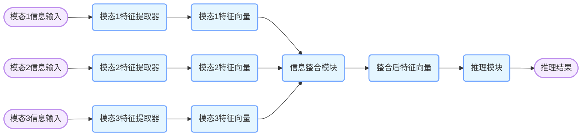

# 多模态信息整合推理的神经认知模型构建

> 关键词：多模态信息整合、神经认知模型、推理机制、深度学习、认知计算

> 摘要：本文聚焦于多模态信息整合推理的神经认知模型构建。多模态信息在现实世界中广泛存在，如何有效地整合这些不同模态的信息并进行推理是当前人工智能和认知科学领域的重要研究课题。文章首先介绍了多模态信息整合推理的背景，包括目的、预期读者、文档结构和相关术语。接着阐述了核心概念及其联系，给出了原理和架构的文本示意图与Mermaid流程图。详细讲解了核心算法原理和具体操作步骤，结合Python源代码进行说明。同时，介绍了相关的数学模型和公式，并举例说明。通过项目实战展示了代码的实际案例和详细解释。探讨了该模型的实际应用场景，推荐了学习资源、开发工具框架和相关论文著作。最后总结了未来发展趋势与挑战，并提供了常见问题解答和扩展阅读参考资料。

## 1. 背景介绍 
### 1.1 目的和范围
在当今数字化时代，信息以多种模态的形式大量涌现，如文本、图像、音频等。多模态信息整合推理旨在将这些不同模态的信息进行融合，并从中提取有价值的知识，以支持更复杂、智能的决策和推理任务。本研究的目的是构建一个神经认知模型，能够有效地整合多模态信息并进行推理，提高系统对复杂环境的理解和处理能力。

本研究的范围涵盖了多模态信息整合推理的理论基础、算法设计、模型构建以及实际应用。重点关注如何模拟人类大脑的认知机制，将不同模态的信息在神经层面进行整合和处理，以实现高效、准确的推理。

### 1.2 预期读者
本文的预期读者包括人工智能领域的研究人员、工程师、认知科学爱好者以及对多模态信息处理感兴趣的专业人士。对于希望深入了解多模态信息整合推理技术，以及如何构建神经认知模型的读者，本文将提供有价值的参考和指导。

### 1.3 文档结构概述
本文将按照以下结构进行组织：
1. **背景介绍**：阐述研究的目的、范围、预期读者和文档结构，以及相关术语的定义。
2. **核心概念与联系**：介绍多模态信息整合推理的核心概念，包括模态、信息整合、推理机制等，并给出原理和架构的文本示意图与Mermaid流程图。
3. **核心算法原理 & 具体操作步骤**：详细讲解用于多模态信息整合推理的核心算法原理，并结合Python源代码说明具体操作步骤。
4. **数学模型和公式 & 详细讲解 & 举例说明**：介绍相关的数学模型和公式，对其进行详细讲解，并通过具体例子说明其应用。
5. **项目实战：代码实际案例和详细解释说明**：通过一个实际项目，展示如何使用上述算法和模型进行多模态信息整合推理，包括开发环境搭建、源代码实现和代码解读。
6. **实际应用场景**：探讨多模态信息整合推理的神经认知模型在不同领域的实际应用场景。
7. **工具和资源推荐**：推荐学习多模态信息整合推理的相关资源，包括书籍、在线课程、技术博客和网站，以及开发工具框架和相关论文著作。
8. **总结：未来发展趋势与挑战**：总结多模态信息整合推理的神经认知模型的发展现状，分析未来发展趋势和面临的挑战。
9. **附录：常见问题与解答**：提供常见问题的解答，帮助读者更好地理解和应用本文介绍的技术。
10. **扩展阅读 & 参考资料**：提供相关的扩展阅读材料和参考资料，供读者进一步深入研究。

### 1.4 术语表
#### 1.4.1 核心术语定义
- **多模态信息**：指来自不同感知通道或数据类型的信息，如文本、图像、音频、视频等。
- **信息整合**：将不同模态的信息进行融合，提取出统一的表示形式，以便后续处理和分析。
- **推理机制**：根据整合后的信息，运用一定的规则和方法进行逻辑推理，得出结论或预测结果。
- **神经认知模型**：模拟人类大脑的神经结构和认知机制，用于处理和分析信息的模型。
- **深度学习**：一种基于人工神经网络的机器学习方法，能够自动从大量数据中学习特征和模式。

#### 1.4.2 相关概念解释
- **模态特征提取**：从不同模态的信息中提取出具有代表性的特征，以便后续的信息整合和推理。
- **跨模态交互**：不同模态信息之间的相互作用和影响，通过跨模态交互可以更好地理解和整合多模态信息。
- **注意力机制**：一种模拟人类注意力分配的机制，能够自动关注信息中的重要部分，提高信息处理的效率和准确性。

#### 1.4.3 缩略词列表
- **CNN**：卷积神经网络（Convolutional Neural Network）
- **RNN**：循环神经网络（Recurrent Neural Network）
- **LSTM**：长短期记忆网络（Long Short-Term Memory）
- **Transformer**：一种基于注意力机制的深度学习模型
- **API**：应用程序编程接口（Application Programming Interface）

## 2. 核心概念与联系 

### 核心概念原理
多模态信息整合推理的核心在于将不同模态的信息进行有效的融合，并利用融合后的信息进行推理。其基本原理可以概括为以下几个步骤：
1. **模态特征提取**：对不同模态的信息进行特征提取，将原始信息转换为具有代表性的特征向量。例如，对于文本信息，可以使用词嵌入技术将文本转换为向量表示；对于图像信息，可以使用卷积神经网络提取图像的特征。
2. **信息整合**：将提取的不同模态的特征向量进行融合，得到统一的表示形式。信息整合的方法有很多种，如拼接、加权求和、注意力机制等。
3. **推理机制**：根据整合后的信息，运用一定的推理规则和方法进行逻辑推理，得出结论或预测结果。推理机制可以基于传统的逻辑推理方法，也可以基于深度学习模型。

### 架构的文本示意图
以下是一个多模态信息整合推理的神经认知模型的架构示意图：

```plaintext
+-------------------+       +-------------------+       +-------------------+
|   模态1信息输入   |       |   模态2信息输入   |       |   模态3信息输入   |
+-------------------+       +-------------------+       +-------------------+
         |                          |                          |
         v                          v                          v
+-------------------+       +-------------------+       +-------------------+
|  模态1特征提取器  |       |  模态2特征提取器  |       |  模态3特征提取器  |
+-------------------+       +-------------------+       +-------------------+
         |                          |                          |
         v                          v                          v
+-------------------+       +-------------------+       +-------------------+
|   模态1特征向量   |       |   模态2特征向量   |       |   模态3特征向量   |
+-------------------+       +-------------------+       +-------------------+
         |                          |                          |
         |                          |                          |
         +--------------------------+--------------------------+
                                    |
                                    v
+-------------------+
|   信息整合模块   |
+-------------------+
         |
         v
+-------------------+
|   整合后特征向量  |
+-------------------+
         |
         v
+-------------------+
|   推理模块       |
+-------------------+
         |
         v
+-------------------+
|   推理结果       |
+-------------------+
```

### Mermaid流程图


这个流程图展示了多模态信息整合推理的主要流程，从不同模态的信息输入开始，经过特征提取、信息整合，最后进行推理得出结果。

## 3. 核心算法原理 & 具体操作步骤 

### 核心算法原理
在多模态信息整合推理中，常用的算法包括深度学习中的卷积神经网络（CNN）、循环神经网络（RNN）及其变体（如LSTM）、Transformer等。下面以Transformer为例，介绍其在多模态信息整合推理中的应用原理。

Transformer是一种基于注意力机制的深度学习模型，它通过多头注意力机制能够有效地捕捉输入序列中不同位置之间的依赖关系。在多模态信息整合推理中，Transformer可以用于对不同模态的特征向量进行处理和融合。

Transformer的核心组件包括多头注意力机制和前馈神经网络。多头注意力机制可以表示为：

$$
\text{MultiHead}(Q, K, V) = \text{Concat}(\text{head}_1, \cdots, \text{head}_h)W^O
$$

其中，$\text{head}_i = \text{Attention}(QW_i^Q, KW_i^K, VW_i^V)$，$\text{Attention}(Q, K, V) = \text{softmax}(\frac{QK^T}{\sqrt{d_k}})V$。

$Q$、$K$、$V$分别是查询（Query）、键（Key）和值（Value）矩阵，$W_i^Q$、$W_i^K$、$W_i^V$和$W^O$是可学习的权重矩阵，$h$是头的数量，$d_k$是键的维度。

### 具体操作步骤及Python源代码
以下是一个使用PyTorch实现的简单的Transformer-based多模态信息整合推理模型的示例代码：

```python
import torch
import torch.nn as nn

# 定义多头注意力机制
class MultiHeadAttention(nn.Module):
    def __init__(self, d_model, num_heads):
        super(MultiHeadAttention, self).__init__()
        assert d_model % num_heads == 0, "d_model must be divisible by num_heads"
        
        self.d_model = d_model
        self.num_heads = num_heads
        self.d_k = d_model // num_heads
        
        self.W_q = nn.Linear(d_model, d_model)
        self.W_k = nn.Linear(d_model, d_model)
        self.W_v = nn.Linear(d_model, d_model)
        self.W_o = nn.Linear(d_model, d_model)
        
    def scaled_dot_product_attention(self, Q, K, V, mask=None):
        attn_scores = torch.matmul(Q, K.transpose(-2, -1)) / torch.sqrt(torch.tensor(self.d_k, dtype=torch.float32))
        if mask is not None:
            attn_scores = attn_scores.masked_fill(mask == 0, -1e9)
        attn_probs = torch.softmax(attn_scores, dim=-1)
        output = torch.matmul(attn_probs, V)
        return output
        
    def split_heads(self, x):
        batch_size, seq_length, d_model = x.size()
        return x.view(batch_size, seq_length, self.num_heads, self.d_k).transpose(1, 2)
        
    def combine_heads(self, x):
        batch_size, num_heads, seq_length, d_k = x.size()
        return x.transpose(1, 2).contiguous().view(batch_size, seq_length, self.d_model)
        
    def forward(self, Q, K, V, mask=None):
        Q = self.split_heads(self.W_q(Q))
        K = self.split_heads(self.W_k(K))
        V = self.split_heads(self.W_v(V))
        
        attn_output = self.scaled_dot_product_attention(Q, K, V, mask)
        output = self.W_o(self.combine_heads(attn_output))
        return output

# 定义前馈神经网络
class PositionwiseFeedForward(nn.Module):
    def __init__(self, d_model, d_ff):
        super(PositionwiseFeedForward, self).__init__()
        self.fc1 = nn.Linear(d_model, d_ff)
        self.fc2 = nn.Linear(d_ff, d_model)
        self.relu = nn.ReLU()
        
    def forward(self, x):
        return self.fc2(self.relu(self.fc1(x)))

# 定义Transformer编码器层
class EncoderLayer(nn.Module):
    def __init__(self, d_model, num_heads, d_ff, dropout):
        super(EncoderLayer, self).__init__()
        self.self_attn = MultiHeadAttention(d_model, num_heads)
        self.feed_forward = PositionwiseFeedForward(d_model, d_ff)
        self.norm1 = nn.LayerNorm(d_model)
        self.norm2 = nn.LayerNorm(d_model)
        self.dropout = nn.Dropout(dropout)
        
    def forward(self, x, mask):
        attn_output = self.self_attn(x, x, x, mask)
        x = self.norm1(x + self.dropout(attn_output))
        ff_output = self.feed_forward(x)
        x = self.norm2(x + self.dropout(ff_output))
        return x

# 定义多模态信息整合推理模型
class MultimodalTransformer(nn.Module):
    def __init__(self, d_model, num_heads, d_ff, num_layers, dropout):
        super(MultimodalTransformer, self).__init__()
        self.encoder_layers = nn.ModuleList([EncoderLayer(d_model, num_heads, d_ff, dropout) for _ in range(num_layers)])
        self.fc = nn.Linear(d_model, 1)  # 假设是二分类问题
        
    def forward(self, multimodal_input, mask=None):
        x = multimodal_input
        for layer in self.encoder_layers:
            x = layer(x, mask)
        output = self.fc(x.mean(dim=1))  # 对序列维度取平均
        return output


# 示例使用
d_model = 128
num_heads = 8
d_ff = 512
num_layers = 3
dropout = 0.1

model = MultimodalTransformer(d_model, num_heads, d_ff, num_layers, dropout)

# 模拟多模态输入
batch_size = 16
seq_length = 10
multimodal_input = torch.randn(batch_size, seq_length, d_model)

# 前向传播
output = model(multimodal_input)
print(output.shape)
```

### 代码解释
1. **MultiHeadAttention类**：实现了多头注意力机制，包括缩放点积注意力和头的拆分与合并操作。
2. **PositionwiseFeedForward类**：实现了前馈神经网络，由两个全连接层和一个ReLU激活函数组成。
3. **EncoderLayer类**：定义了Transformer编码器层，包括多头注意力机制和前馈神经网络，以及层归一化和Dropout操作。
4. **MultimodalTransformer类**：定义了多模态信息整合推理模型，由多个编码器层和一个全连接层组成。
5. **示例使用部分**：创建了一个模型实例，模拟了多模态输入，并进行了前向传播。

## 4. 数学模型和公式 & 详细讲解 & 举例说明 

### 数学模型和公式
#### 1. 缩放点积注意力公式
在多头注意力机制中，缩放点积注意力是核心操作，其公式为：

$$
\text{Attention}(Q, K, V) = \text{softmax}(\frac{QK^T}{\sqrt{d_k}})V
$$

其中，$Q$是查询矩阵，$K$是键矩阵，$V$是值矩阵，$d_k$是键的维度。$\frac{QK^T}{\sqrt{d_k}}$计算了查询和键之间的相似度得分，通过除以$\sqrt{d_k}$进行缩放，以避免点积结果过大导致梯度消失或爆炸。$\text{softmax}$函数将相似度得分转换为概率分布，最后与值矩阵相乘得到注意力输出。

#### 2. 多头注意力公式
多头注意力机制通过多个头并行计算注意力，然后将结果拼接起来，其公式为：

$$
\text{MultiHead}(Q, K, V) = \text{Concat}(\text{head}_1, \cdots, \text{head}_h)W^O
$$

其中，$\text{head}_i = \text{Attention}(QW_i^Q, KW_i^K, VW_i^V)$，$W_i^Q$、$W_i^K$、$W_i^V$和$W^O$是可学习的权重矩阵，$h$是头的数量。

#### 3. 前馈神经网络公式
前馈神经网络由两个全连接层组成，其公式为：

$$
FFN(x) = \text{ReLU}(xW_1 + b_1)W_2 + b_2
$$

其中，$W_1$和$W_2$是权重矩阵，$b_1$和$b_2$是偏置向量，$\text{ReLU}$是激活函数。

### 详细讲解
#### 缩放点积注意力
缩放点积注意力的主要作用是计算查询和键之间的相似度，并根据相似度对值进行加权求和。通过缩放操作，可以使相似度得分更加稳定，避免梯度问题。$\text{softmax}$函数将相似度得分转换为概率分布，使得模型能够自动关注重要的信息。

#### 多头注意力
多头注意力机制通过多个头并行计算注意力，可以捕捉不同方面的信息。每个头学习不同的表示，然后将这些表示拼接起来，得到更丰富的信息。这样可以提高模型的表达能力和泛化能力。

#### 前馈神经网络
前馈神经网络在Transformer中起到非线性变换的作用，增加模型的表达能力。通过两个全连接层和ReLU激活函数，可以对输入进行复杂的非线性变换，从而更好地捕捉数据中的模式和特征。

### 举例说明
假设我们有一个查询向量$Q = [1, 2, 3]$，键矩阵$K = \begin{bmatrix}1 & 0 & 0 \\ 0 & 1 & 0 \\ 0 & 0 & 1\end{bmatrix}$，值矩阵$V = \begin{bmatrix}4 & 5 & 6 \\ 7 & 8 & 9 \\ 10 & 11 & 12\end{bmatrix}$，键的维度$d_k = 3$。

首先计算相似度得分：

$$
\frac{QK^T}{\sqrt{d_k}} = \frac{[1, 2, 3]\begin{bmatrix}1 & 0 & 0 \\ 0 & 1 & 0 \\ 0 & 0 & 1\end{bmatrix}}{\sqrt{3}} = \frac{[1, 2, 3]}{\sqrt{3}} \approx [0.58, 1.15, 1.73]
$$

然后计算$\text{softmax}$：

$$
\text{softmax}([0.58, 1.15, 1.73]) = \left[\frac{e^{0.58}}{e^{0.58}+e^{1.15}+e^{1.73}}, \frac{e^{1.15}}{e^{0.58}+e^{1.15}+e^{1.73}}, \frac{e^{1.73}}{e^{0.58}+e^{1.15}+e^{1.73}}\right] \approx [0.16, 0.34, 0.5]
$$

最后计算注意力输出：

$$
\text{Attention}(Q, K, V) = [0.16, 0.34, 0.5]\begin{bmatrix}4 & 5 & 6 \\ 7 & 8 & 9 \\ 10 & 11 & 12\end{bmatrix} = [7.68, 8.64, 9.6]
$$

这个例子展示了缩放点积注意力的计算过程，通过计算相似度得分、$\text{softmax}$和加权求和，得到了注意力输出。

## 5. 项目实战：代码实际案例和详细解释说明 

### 5.1  开发环境搭建
在进行多模态信息整合推理的项目实战之前，需要搭建相应的开发环境。以下是具体步骤：

#### 1. 安装Python
首先，确保你已经安装了Python 3.6或更高版本。可以从Python官方网站（https://www.python.org/downloads/）下载并安装。

#### 2. 创建虚拟环境
为了避免不同项目之间的依赖冲突，建议使用虚拟环境。可以使用`venv`或`conda`来创建虚拟环境。

使用`venv`创建虚拟环境的命令如下：

```sh
python -m venv multimodal_env
```

激活虚拟环境：

- 在Windows上：
```sh
multimodal_env\Scripts\activate
```

- 在Linux或Mac上：
```sh
source multimodal_env/bin/activate
```

#### 3. 安装必要的库
在虚拟环境中，安装项目所需的库，包括`torch`、`torchvision`、`numpy`等。可以使用`pip`进行安装：

```sh
pip install torch torchvision numpy
```

### 5.2  源代码详细实现和代码解读
以下是一个完整的多模态信息整合推理的项目实战代码示例，假设我们要处理的是文本和图像两种模态的信息：

```python
import torch
import torch.nn as nn
import torchvision.models as models
from transformers import BertModel, BertTokenizer

# 定义文本特征提取器
class TextFeatureExtractor(nn.Module):
    def __init__(self):
        super(TextFeatureExtractor, self).__init__()
        self.bert = BertModel.from_pretrained('bert-base-uncased')
        
    def forward(self, input_ids, attention_mask):
        outputs = self.bert(input_ids=input_ids, attention_mask=attention_mask)
        pooled_output = outputs.pooler_output
        return pooled_output

# 定义图像特征提取器
class ImageFeatureExtractor(nn.Module):
    def __init__(self):
        super(ImageFeatureExtractor, self).__init__()
        self.resnet = models.resnet18(pretrained=True)
        self.resnet.fc = nn.Identity()  # 去掉最后一层全连接层
        
    def forward(self, images):
        features = self.resnet(images)
        return features

# 定义多模态信息整合推理模型
class MultimodalModel(nn.Module):
    def __init__(self, d_model, num_heads, d_ff, num_layers, dropout):
        super(MultimodalModel, self).__init__()
        self.text_extractor = TextFeatureExtractor()
        self.image_extractor = ImageFeatureExtractor()
        self.transformer = MultimodalTransformer(d_model, num_heads, d_ff, num_layers, dropout)
        self.fc = nn.Linear(d_model, 1)  # 假设是二分类问题
        
    def forward(self, input_ids, attention_mask, images):
        text_features = self.text_extractor(input_ids, attention_mask)
        image_features = self.image_extractor(images)
        
        # 拼接文本和图像特征
        multimodal_features = torch.cat((text_features, image_features), dim=1)
        
        # 添加序列维度
        multimodal_features = multimodal_features.unsqueeze(1)
        
        output = self.transformer(multimodal_features)
        output = self.fc(output.squeeze(1))
        return output


# 示例使用
d_model = 128
num_heads = 8
d_ff = 512
num_layers = 3
dropout = 0.1

model = MultimodalModel(d_model, num_heads, d_ff, num_layers, dropout)

# 模拟文本输入
tokenizer = BertTokenizer.from_pretrained('bert-base-uncased')
text = "This is a sample text."
inputs = tokenizer(text, return_tensors='pt')
input_ids = inputs['input_ids']
attention_mask = inputs['attention_mask']

# 模拟图像输入
images = torch.randn(1, 3, 224, 224)

# 前向传播
output = model(input_ids, attention_mask, images)
print(output.shape)
```

### 代码解读
1. **TextFeatureExtractor类**：使用预训练的BERT模型提取文本特征。`BertModel.from_pretrained('bert-base-uncased')`加载预训练的BERT模型，通过`forward`方法输入文本的`input_ids`和`attention_mask`，得到文本的特征表示。
2. **ImageFeatureExtractor类**：使用预训练的ResNet-18模型提取图像特征。将ResNet-18的最后一层全连接层替换为`nn.Identity()`，以获取图像的特征向量。
3. **MultimodalModel类**：整合文本和图像特征，并使用之前定义的`MultimodalTransformer`进行推理。在`forward`方法中，首先分别提取文本和图像特征，然后将它们拼接起来，添加序列维度后输入到Transformer模型中，最后通过全连接层得到预测结果。
4. **示例使用部分**：创建了一个模型实例，模拟了文本和图像输入，并进行了前向传播。

### 5.3  代码解读与分析
#### 特征提取
通过使用预训练的BERT和ResNet-18模型，我们可以有效地提取文本和图像的特征。预训练模型在大规模数据集上进行了训练，能够学习到丰富的语义和视觉特征，为后续的信息整合和推理提供了良好的基础。

#### 信息整合
将文本和图像特征拼接起来是一种简单而有效的信息整合方法。通过拼接，我们可以将不同模态的信息在特征层面进行融合，让模型能够同时考虑文本和图像的信息。

#### 推理过程
使用Transformer模型进行推理，Transformer的多头注意力机制能够捕捉不同模态特征之间的依赖关系，提高模型的推理能力。最后通过全连接层将Transformer的输出转换为预测结果。

## 6. 实际应用场景 
多模态信息整合推理的神经认知模型在许多领域都有广泛的应用，以下是一些具体的应用场景：

### 智能安防
在智能安防领域，多模态信息整合推理可以结合视频监控、音频检测和传感器数据等多种模态的信息。例如，通过分析监控视频中的人员行为、音频中的异常声音以及传感器检测到的环境变化，系统可以更准确地判断是否存在安全隐患，并及时发出警报。

### 智能医疗
在智能医疗中，多模态信息整合推理可以融合患者的病历文本、医学影像（如X光、CT、MRI等）和生命体征数据等。医生可以利用整合后的信息进行更准确的疾病诊断和治疗方案制定。例如，通过分析病历文本中的症状描述、医学影像中的病变特征以及生命体征数据的变化趋势，模型可以辅助医生判断疾病的类型和严重程度。

### 智能交通
在智能交通领域，多模态信息整合推理可以结合车辆的传感器数据（如雷达、摄像头、GPS等）、交通路况信息和天气预报等多种模态的信息。通过整合这些信息，自动驾驶车辆可以更准确地感知周围环境，做出合理的决策，提高行驶的安全性和效率。

### 智能教育
在智能教育中，多模态信息整合推理可以融合学生的学习记录、课堂表现视频、语音交互数据等多种模态的信息。教师可以根据整合后的信息了解学生的学习情况和需求，提供个性化的教学服务。例如，通过分析学生的学习记录和课堂表现视频，模型可以评估学生的学习进度和掌握程度，为教师提供教学建议。

### 情感分析
在情感分析领域，多模态信息整合推理可以结合文本、语音和面部表情等多种模态的信息。通过分析这些信息，模型可以更准确地判断人们的情感状态。例如，在客户服务中，通过分析客户的文本反馈、语音语调以及面部表情，系统可以更好地了解客户的满意度和需求，提供更优质的服务。

## 7. 工具和资源推荐
### 7.1 学习资源推荐
#### 7.1.1 书籍推荐
- 《深度学习》（Deep Learning）：由Ian Goodfellow、Yoshua Bengio和Aaron Courville撰写，是深度学习领域的经典教材，涵盖了深度学习的基本原理、算法和应用。
- 《Python深度学习》（Deep Learning with Python）：由Francois Chollet撰写，以Python和Keras为工具，介绍了深度学习的实践方法，适合初学者入门。
- 《动手学深度学习》（Dive into Deep Learning）：由 Aston Zhang、Zachary C. Lipton、Mu Li和Alexander J. Smola撰写，提供了丰富的代码示例和实践项目，帮助读者更好地理解和应用深度学习。

#### 7.1.2 在线课程
- Coursera上的“深度学习专项课程”（Deep Learning Specialization）：由Andrew Ng教授授课，包括五门课程，系统地介绍了深度学习的各个方面。
- edX上的“强化学习基础”（Fundamentals of Reinforcement Learning）：介绍了强化学习的基本概念、算法和应用。
- 哔哩哔哩上的“李宏毅机器学习”：由台湾大学李宏毅教授授课，课程内容生动有趣，适合初学者入门。

#### 7.1.3 技术博客和网站
- Medium：有许多深度学习和人工智能领域的优秀博客文章，如Towards Data Science等。
- arXiv：是一个预印本数据库，包含了大量的学术论文，可及时了解最新的研究成果。
- 机器之心：专注于人工智能领域的技术资讯和研究动态，提供了丰富的技术文章和案例分析。

### 7.2 开发工具框架推荐
#### 7.2.1 IDE和编辑器
- PyCharm：是一款专业的Python集成开发环境，提供了丰富的代码编辑、调试和项目管理功能。
- Jupyter Notebook：是一个交互式的开发环境，适合进行数据探索和模型实验，支持多种编程语言。
- Visual Studio Code：是一款轻量级的代码编辑器，支持多种编程语言和插件扩展，具有良好的开发体验。

#### 7.2.2 调试和性能分析工具
- PyTorch Profiler：是PyTorch自带的性能分析工具，可以帮助用户分析模型的性能瓶颈，优化代码。
- TensorBoard：是TensorFlow的可视化工具，也可以与PyTorch集成，用于可视化模型的训练过程和性能指标。
- cProfile：是Python的内置性能分析工具，可以分析代码的运行时间和函数调用情况。

#### 7.2.3 相关框架和库
- PyTorch：是一个开源的深度学习框架，具有动态图、易于使用和高效的特点，广泛应用于学术界和工业界。
- TensorFlow：是另一个流行的深度学习框架，提供了丰富的工具和库，支持分布式训练和模型部署。
- Transformers：是Hugging Face开发的一个自然语言处理库，提供了多种预训练模型和工具，方便进行文本处理和分析。

### 7.3 相关论文著作推荐
#### 7.3.1 经典论文
- “Attention Is All You Need”：提出了Transformer模型，为自然语言处理和多模态信息处理带来了革命性的变化。
- “ImageNet Classification with Deep Convolutional Neural Networks”：介绍了AlexNet模型，开启了深度学习在计算机视觉领域的应用热潮。
- “Long Short-Term Memory”：提出了LSTM模型，解决了传统循环神经网络的梯度消失问题。

#### 7.3.2 最新研究成果
- 在arXiv上搜索“Multimodal Information Integration”、“Neural Cognitive Model”等关键词，可以找到最新的研究论文。
- 关注顶级学术会议，如NeurIPS、ICML、CVPR、ACL等，了解最新的研究动态和成果。

#### 7.3.3 应用案例分析
- 可以在ACM Digital Library、IEEE Xplore等数据库中搜索多模态信息整合推理在不同领域的应用案例分析，学习实际应用中的经验和方法。

## 8. 总结：未来发展趋势与挑战
### 未来发展趋势
#### 更复杂的多模态融合
未来的多模态信息整合推理模型将能够处理更复杂的多模态信息，如融合文本、图像、音频、视频、传感器数据等多种模态的信息。同时，模型将更加注重不同模态信息之间的深度交互和融合，以提高信息处理的效率和准确性。

#### 结合知识图谱
将多模态信息整合推理与知识图谱相结合是未来的一个重要发展方向。知识图谱可以提供丰富的语义知识，帮助模型更好地理解和处理多模态信息。通过将多模态信息映射到知识图谱中，模型可以利用知识图谱的推理能力进行更复杂的推理和决策。

#### 自适应学习和个性化服务
未来的多模态信息整合推理模型将具备自适应学习能力，能够根据不同的应用场景和用户需求自动调整模型的参数和结构。同时，模型将提供个性化的服务，根据用户的偏好和历史数据为用户提供定制化的信息和建议。

#### 跨领域应用拓展
多模态信息整合推理技术将在更多的领域得到应用，如智能家居、智能金融、智能农业等。通过将多模态信息整合推理技术与不同领域的知识和需求相结合，可以为这些领域带来新的发展机遇和创新解决方案。

### 面临的挑战
#### 数据获取和标注
多模态信息的数据获取和标注是一个具有挑战性的问题。不同模态的信息需要不同的采集设备和方法，而且数据的标注需要专业的知识和技能。此外，多模态数据的标注成本较高，数据的质量和一致性也难以保证。

#### 计算资源和效率
多模态信息整合推理模型通常需要大量的计算资源和时间来训练和推理。随着模型的复杂度不断增加，计算资源和效率的问题将变得更加突出。如何优化模型的结构和算法，提高计算效率，是当前需要解决的一个重要问题。

#### 模型解释和可解释性
多模态信息整合推理模型通常是基于深度学习的黑盒模型，其决策过程和结果难以解释。在一些对安全性和可靠性要求较高的领域，如医疗、金融等，模型的可解释性是一个关键问题。如何提高模型的可解释性，让用户能够理解模型的决策过程和结果，是未来需要研究的一个重要方向。

#### 跨模态语义理解
不同模态的信息具有不同的语义表示和特征，如何实现跨模态的语义理解是一个具有挑战性的问题。例如，如何将文本中的语义信息与图像中的视觉信息进行有效的关联和融合，是多模态信息整合推理的一个核心问题。

## 9. 附录：常见问题与解答
### 1. 多模态信息整合推理与单模态信息处理有什么区别？
多模态信息整合推理需要处理来自不同模态的信息，如文本、图像、音频等，并将这些信息进行融合和推理。与单模态信息处理相比，多模态信息整合推理能够利用不同模态信息之间的互补性，提供更丰富、准确的信息。例如，在情感分析中，结合文本和语音信息可以更准确地判断人们的情感状态。

### 2. 如何选择合适的特征提取方法？
选择合适的特征提取方法需要考虑数据的模态、特点和应用场景。对于文本数据，可以使用词嵌入、BERT等方法进行特征提取；对于图像数据，可以使用卷积神经网络（如ResNet、VGG等）进行特征提取；对于音频数据，可以使用梅尔频率倒谱系数（MFCC）、卷积神经网络等方法进行特征提取。此外，还可以根据具体的应用场景选择合适的预训练模型，以提高特征提取的效果。

### 3. 多模态信息整合的方法有哪些？
常见的多模态信息整合方法包括拼接、加权求和、注意力机制、融合网络等。拼接是将不同模态的特征向量直接拼接在一起；加权求和是根据不同模态的重要性对特征向量进行加权求和；注意力机制可以自动关注不同模态信息中的重要部分，提高信息整合的效果；融合网络则通过构建专门的神经网络来实现多模态信息的融合。

### 4. 如何评估多模态信息整合推理模型的性能？
评估多模态信息整合推理模型的性能可以使用多种指标，如准确率、召回率、F1值、均方误差（MSE）等。具体选择哪种指标需要根据具体的应用场景和任务来确定。此外，还可以使用交叉验证、留一法等方法来评估模型的泛化能力。

### 5. 多模态信息整合推理模型的训练过程中需要注意什么？
在多模态信息整合推理模型的训练过程中，需要注意以下几点：
- 数据的预处理：对不同模态的数据进行统一的预处理，如归一化、裁剪、填充等，以确保数据的一致性和可比性。
- 模型的初始化：选择合适的初始化方法，如随机初始化、预训练模型初始化等，以提高模型的收敛速度和性能。
- 超参数的调整：调整模型的超参数，如学习率、批次大小、迭代次数等，以找到最优的模型参数。
- 防止过拟合：可以使用正则化、Dropout等方法来防止模型过拟合，提高模型的泛化能力。

## 10. 扩展阅读 & 参考资料
### 扩展阅读
- 《人工智能：现代方法》（Artificial Intelligence: A Modern Approach）：全面介绍了人工智能的基本概念、算法和应用，是人工智能领域的经典教材。
- 《自然语言处理入门》（Natural Language Processing with Python）：以Python为工具，介绍了自然语言处理的基本方法和技术，适合初学者入门。
- 《计算机视觉：算法与应用》（Computer Vision: Algorithms and Applications）：介绍了计算机视觉的基本算法和应用，包括图像特征提取、目标检测、图像分割等。

### 参考资料
- Goodfellow, I., Bengio, Y., & Courville, A. (2016). Deep Learning. MIT Press.
- Chollet, F. (2018). Deep Learning with Python. Manning Publications.
- Vaswani, A., Shazeer, N., Parmar, N., Uszkoreit, J., Jones, L., Gomez, A. N.,... & Polosukhin, I. (2017). Attention is all you need. In Advances in neural information processing systems (pp. 5998-6008).
- Krizhevsky, A., Sutskever, I., & Hinton, G. E. (2012). ImageNet classification with deep convolutional neural networks. In Advances in neural information processing systems (pp. 1097-1105).
- Hochreiter, S., & Schmidhuber, J. (1997). Long short-term memory. Neural computation, 9(8), 1735-1780.

作者：AI天才研究院/AI Genius Institute & 禅与计算机程序设计艺术 /Zen And The Art of Computer Programming