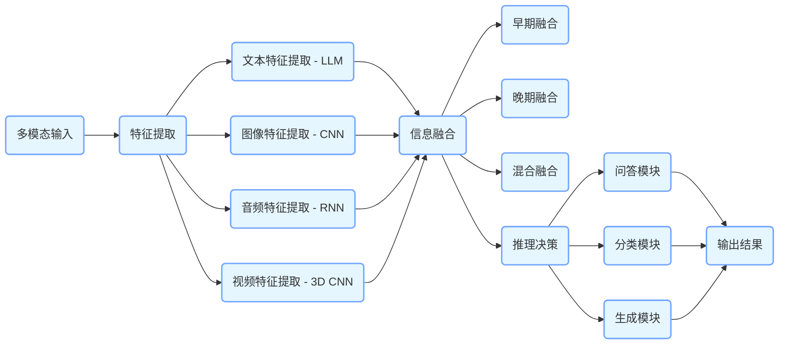

# 多模态内容理解AI Agent：整合LLM与多媒体分析

> 关键词：多模态内容理解、AI Agent、大语言模型（LLM）、多媒体分析、信息整合

> 摘要：本文聚焦于多模态内容理解AI Agent，深入探讨如何将大语言模型（LLM）与多媒体分析进行有效整合。首先介绍了该领域的背景知识，包括目的、预期读者、文档结构和相关术语。接着阐述了核心概念及其联系，给出了原理和架构的示意图与流程图。详细讲解了核心算法原理，并结合Python源代码进行说明。同时，介绍了相关的数学模型和公式，通过具体例子加深理解。通过项目实战，展示了代码的实际应用和详细解读。分析了多模态内容理解AI Agent的实际应用场景，推荐了学习、开发所需的工具和资源，涵盖书籍、在线课程、技术博客、开发工具、框架和相关论文等。最后总结了未来发展趋势与挑战，还给出了常见问题解答和扩展阅读参考资料，为读者全面了解和应用多模态内容理解AI Agent提供了深入且系统的指导。

## 1. 背景介绍 
### 1.1 目的和范围
在当今数字化时代，信息呈现出多样化的形式，不仅有文本信息，还包含图像、音频、视频等多媒体内容。多模态内容理解旨在综合处理这些不同类型的信息，以获取更全面、准确的语义理解。本文章的目的是详细探讨如何构建一个能够整合大语言模型（LLM）和多媒体分析的AI Agent，使其能够理解和处理多模态内容。范围涵盖了从核心概念的介绍、算法原理的讲解、数学模型的分析，到实际项目的开发和应用场景的讨论，为读者提供一个全面的多模态内容理解AI Agent的知识体系。

### 1.2 预期读者
本文预期读者包括人工智能领域的研究者、开发者、数据科学家，以及对多模态技术和AI Agent感兴趣的学生和专业人士。对于希望深入了解如何将大语言模型与多媒体分析相结合的技术人员，以及想要探索多模态内容理解在实际应用中可能性的从业者，本文都具有一定的参考价值。

### 1.3 文档结构概述
本文将按照以下结构进行阐述：首先介绍多模态内容理解AI Agent的核心概念及其联系，通过示意图和流程图直观展示其原理和架构；接着详细讲解核心算法原理，并使用Python源代码进行具体说明；然后分析相关的数学模型和公式，并通过举例加深理解；随后通过项目实战，从开发环境搭建到源代码实现和解读，展示如何实际应用这些技术；之后探讨多模态内容理解AI Agent的实际应用场景；再推荐相关的学习资源、开发工具和论文著作；最后总结未来发展趋势与挑战，给出常见问题解答和扩展阅读参考资料。

### 1.4 术语表
#### 1.4.1 核心术语定义
- **多模态内容理解**：指对包含多种模态（如文本、图像、音频、视频等）信息的内容进行综合分析和理解，以获取其完整语义的过程。
- **AI Agent**：即人工智能智能体，是一种能够感知环境、根据环境信息做出决策并采取行动的智能实体。在本文中，AI Agent负责整合多模态信息并进行处理。
- **大语言模型（LLM）**：是一种基于深度学习的语言模型，通过大量文本数据训练得到，能够生成自然语言文本、回答问题、进行推理等。
- **多媒体分析**：对图像、音频、视频等多媒体数据进行处理和分析的技术，包括图像识别、语音识别、视频理解等。

#### 1.4.2 相关概念解释
- **特征提取**：从多模态数据中提取具有代表性的特征，以便后续处理和分析。例如，从图像中提取视觉特征，从音频中提取声学特征。
- **信息融合**：将不同模态的特征或信息进行整合，以获得更全面的语义表示。常见的融合方法包括早期融合、晚期融合等。
- **语义表示**：将多模态数据转换为计算机能够理解的语义表示形式，以便进行推理和决策。

#### 1.4.3 缩略词列表
- **LLM**：Large Language Model（大语言模型）
- **CNN**：Convolutional Neural Network（卷积神经网络）
- **RNN**：Recurrent Neural Network（循环神经网络）
- **Transformer**：一种基于注意力机制的深度学习模型架构
- **NLP**：Natural Language Processing（自然语言处理）
- **CV**：Computer Vision（计算机视觉）

## 2. 核心概念与联系 
### 核心概念原理
多模态内容理解AI Agent的核心在于整合大语言模型（LLM）和多媒体分析技术，以实现对多模态内容的全面理解。大语言模型具有强大的语言处理能力，能够理解和生成自然语言文本，进行推理和知识问答。而多媒体分析技术则可以对图像、音频、视频等多媒体数据进行处理和分析，提取其中的语义信息。通过将两者结合，AI Agent可以利用LLM的语言能力来整合和解释多媒体信息，从而实现更高级的多模态内容理解。

具体来说，AI Agent首先对输入的多模态数据进行特征提取。对于文本数据，可以使用LLM进行编码，将其转换为语义向量；对于图像、音频、视频等多媒体数据，可以使用相应的多媒体分析模型（如CNN、RNN等）提取特征。然后，将不同模态的特征进行融合，得到统一的语义表示。最后，AI Agent根据这个语义表示进行推理和决策，完成各种任务，如问答、分类、生成等。

### 架构的文本示意图
```plaintext
+----------------------+
| 多模态内容理解AI Agent |
+----------------------+
| 输入层               |
| - 文本输入           |
| - 图像输入           |
| - 音频输入           |
| - 视频输入           |
+----------------------+
| 特征提取层           |
| - 文本特征提取（LLM） |
| - 图像特征提取（CNN） |
| - 音频特征提取（RNN） |
| - 视频特征提取（3D CNN）|
+----------------------+
| 信息融合层           |
| - 早期融合           |
| - 晚期融合           |
| - 混合融合           |
+----------------------+
| 推理决策层           |
| - 问答模块           |
| - 分类模块           |
| - 生成模块           |
+----------------------+
| 输出层               |
| - 文本回答           |
| - 分类结果           |
| - 生成内容           |
+----------------------+
```

### Mermaid流程图


## 3. 核心算法原理 & 具体操作步骤 
### 核心算法原理
#### 特征提取
- **文本特征提取**：使用大语言模型（LLM）进行文本特征提取。以GPT系列模型为例，输入文本经过分词后，模型将其转换为词向量序列，然后通过多层Transformer编码器进行处理，最终得到文本的语义表示。在Python中，可以使用Hugging Face的`transformers`库来实现：
```python
from transformers import AutoTokenizer, AutoModel
import torch

# 加载预训练的语言模型和分词器
tokenizer = AutoTokenizer.from_pretrained('bert-base-uncased')
model = AutoModel.from_pretrained('bert-base-uncased')

# 输入文本
text = "This is a sample sentence."

# 分词
inputs = tokenizer(text, return_tensors='pt')

# 提取特征
with torch.no_grad():
    outputs = model(**inputs)

# 获取文本特征
text_features = outputs.last_hidden_state.mean(dim=1).squeeze()
```
- **图像特征提取**：使用卷积神经网络（CNN）进行图像特征提取。以ResNet为例，输入图像经过多个卷积层和池化层的处理，提取出不同层次的特征。在Python中，可以使用`torchvision`库来实现：
```python
import torch
import torchvision.models as models
import torchvision.transforms as transforms
from PIL import Image

# 加载预训练的ResNet模型
resnet = models.resnet18(pretrained=True)
resnet.eval()

# 图像预处理
transform = transforms.Compose([
    transforms.Resize(256),
    transforms.CenterCrop(224),
    transforms.ToTensor(),
    transforms.Normalize(mean=[0.485, 0.456, 0.406], std=[0.229, 0.224, 0.225])
])

# 加载图像
image = Image.open('example.jpg')
image = transform(image).unsqueeze(0)

# 提取特征
with torch.no_grad():
    features = resnet(image)

# 获取图像特征
image_features = features.squeeze()
```
#### 信息融合
- **早期融合**：在特征提取阶段就将不同模态的特征进行拼接，然后一起输入到后续的模型中进行处理。例如，将文本特征和图像特征拼接起来：
```python
import torch

# 假设text_features和image_features已经提取好
combined_features = torch.cat((text_features, image_features), dim=0)
```
- **晚期融合**：先分别对不同模态的特征进行处理，然后在决策阶段将处理结果进行融合。例如，分别使用文本特征和图像特征进行分类，然后将分类结果进行加权平均：
```python
import torch

# 假设text_output和image_output是文本和图像的分类结果
text_weight = 0.6
image_weight = 0.4
final_output = text_weight * text_output + image_weight * image_output
```
#### 推理决策
根据融合后的特征进行推理和决策。例如，使用全连接层进行分类任务：
```python
import torch
import torch.nn as nn

# 定义全连接层
fc = nn.Linear(combined_features.size(0), num_classes)

# 进行分类
output = fc(combined_features)
```

### 具体操作步骤
1. **数据准备**：收集和整理多模态数据，包括文本、图像、音频、视频等。对数据进行预处理，如文本分词、图像缩放、音频降噪等。
2. **特征提取**：使用相应的模型对不同模态的数据进行特征提取，得到文本、图像、音频、视频等特征。
3. **信息融合**：选择合适的融合方法，将不同模态的特征进行融合，得到统一的语义表示。
4. **推理决策**：根据融合后的特征，使用相应的模型进行推理和决策，完成各种任务，如问答、分类、生成等。
5. **模型训练和评估**：使用训练数据对模型进行训练，并使用验证数据和测试数据对模型进行评估，调整模型参数，提高模型性能。

## 4. 数学模型和公式 & 详细讲解 & 举例说明 
### 特征提取
#### 文本特征提取
对于文本特征提取，使用大语言模型（LLM）进行编码。假设输入文本为 $x = [x_1, x_2, \cdots, x_n]$，其中 $x_i$ 表示第 $i$ 个词的词向量。LLM 通过多层Transformer编码器进行处理，输出为 $h = [h_1, h_2, \cdots, h_n]$，其中 $h_i$ 表示第 $i$ 个词的隐藏状态。最终的文本特征可以表示为 $h_{avg} = \frac{1}{n} \sum_{i=1}^{n} h_i$。

例如，对于输入文本 "This is a sample sentence."，经过分词后得到 $x = [\text{"This"}, \text{"is"}, \text{"a"}, \text{"sample"}, \text{"sentence"}, \text{"."}]$，经过LLM处理后得到 $h$，然后计算 $h_{avg}$ 作为文本特征。

#### 图像特征提取
对于图像特征提取，使用卷积神经网络（CNN）进行处理。假设输入图像为 $I \in \mathbb{R}^{H \times W \times C}$，其中 $H$、$W$ 和 $C$ 分别表示图像的高度、宽度和通道数。CNN 通过多个卷积层和池化层进行处理，输出为 $F \in \mathbb{R}^{h \times w \times c}$，其中 $h$、$w$ 和 $c$ 分别表示特征图的高度、宽度和通道数。最终的图像特征可以表示为 $f_{avg} = \frac{1}{h \times w} \sum_{i=1}^{h} \sum_{j=1}^{w} F_{i,j}$。

例如，对于输入图像 $I$，经过ResNet处理后得到 $F$，然后计算 $f_{avg}$ 作为图像特征。

### 信息融合
#### 早期融合
早期融合是将不同模态的特征进行拼接。假设文本特征为 $h_{text}$，图像特征为 $f_{image}$，则融合后的特征为 $f_{combined} = [h_{text}; f_{image}]$，其中 $[;]$ 表示拼接操作。

例如，$h_{text} = [0.1, 0.2, 0.3]$，$f_{image} = [0.4, 0.5, 0.6]$，则 $f_{combined} = [0.1, 0.2, 0.3, 0.4, 0.5, 0.6]$。

#### 晚期融合
晚期融合是在决策阶段将不同模态的处理结果进行融合。假设文本分类结果为 $y_{text}$，图像分类结果为 $y_{image}$，则最终分类结果为 $y_{final} = \alpha y_{text} + (1 - \alpha) y_{image}$，其中 $\alpha$ 是权重系数，$0 \leq \alpha \leq 1$。

例如，$y_{text} = [0.2, 0.3, 0.5]$，$y_{image} = [0.1, 0.4, 0.5]$，$\alpha = 0.6$，则 $y_{final} = 0.6 \times [0.2, 0.3, 0.5] + 0.4 \times [0.1, 0.4, 0.5] = [0.16, 0.34, 0.5]$。

### 推理决策
对于分类任务，使用全连接层进行处理。假设融合后的特征为 $f_{combined}$，全连接层的权重矩阵为 $W \in \mathbb{R}^{num\_classes \times d}$，偏置向量为 $b \in \mathbb{R}^{num\_classes}$，其中 $d$ 是特征的维度，$num\_classes$ 是分类的类别数。则分类结果为 $y = \text{softmax}(W f_{combined} + b)$，其中 $\text{softmax}$ 是激活函数，用于将输出转换为概率分布。

例如，$f_{combined} = [0.1, 0.2, 0.3]$，$W = \begin{bmatrix} 0.1 & 0.2 & 0.3 \\ 0.4 & 0.5 & 0.6 \\ 0.7 & 0.8 & 0.9 \end{bmatrix}$，$b = [0.1, 0.2, 0.3]$，则 $y = \text{softmax}(W f_{combined} + b)$。

## 5. 项目实战：代码实际案例和详细解释说明 
### 5.1  开发环境搭建
#### 安装Python和相关库
首先，确保你已经安装了Python 3.7或更高版本。然后，使用以下命令安装所需的库：
```bash
pip install torch torchvision transformers pillow
```
#### 下载预训练模型
可以使用Hugging Face的`transformers`库自动下载预训练的语言模型，如BERT、GPT等。对于图像模型，如ResNet，可以使用`torchvision`库自动下载预训练权重。

### 5.2  源代码详细实现和代码解读
```python
import torch
import torchvision.models as models
import torchvision.transforms as transforms
from transformers import AutoTokenizer, AutoModel
from PIL import Image

# 加载预训练的语言模型和分词器
tokenizer = AutoTokenizer.from_pretrained('bert-base-uncased')
model = AutoModel.from_pretrained('bert-base-uncased')

# 加载预训练的ResNet模型
resnet = models.resnet18(pretrained=True)
resnet.eval()

# 图像预处理
transform = transforms.Compose([
    transforms.Resize(256),
    transforms.CenterCrop(224),
    transforms.ToTensor(),
    transforms.Normalize(mean=[0.485, 0.456, 0.406], std=[0.229, 0.224, 0.225])
])

# 输入文本和图像
text = "This is a sample sentence."
image = Image.open('example.jpg')

# 文本特征提取
inputs = tokenizer(text, return_tensors='pt')
with torch.no_grad():
    outputs = model(**inputs)
text_features = outputs.last_hidden_state.mean(dim=1).squeeze()

# 图像特征提取
image = transform(image).unsqueeze(0)
with torch.no_grad():
    features = resnet(image)
image_features = features.squeeze()

# 早期融合
combined_features = torch.cat((text_features, image_features), dim=0)

# 定义全连接层进行分类
num_classes = 10
fc = torch.nn.Linear(combined_features.size(0), num_classes)

# 进行分类
output = fc(combined_features)
```
### 代码解读与分析
1. **模型加载**：使用`transformers`库加载预训练的BERT模型和分词器，使用`torchvision`库加载预训练的ResNet模型。
2. **数据预处理**：对文本进行分词处理，对图像进行缩放、裁剪、归一化等预处理操作。
3. **特征提取**：使用BERT模型提取文本特征，使用ResNet模型提取图像特征。
4. **信息融合**：使用早期融合方法将文本特征和图像特征拼接起来。
5. **推理决策**：定义全连接层进行分类，将融合后的特征输入到全连接层中，得到分类结果。

## 6. 实际应用场景 
### 智能客服
多模态内容理解AI Agent可以应用于智能客服系统，处理用户的多模态咨询。用户可以通过文本、语音、图片等方式提出问题，AI Agent可以综合理解这些信息，提供更准确、全面的回答。例如，用户在咨询电子产品时，可以上传产品图片并描述问题，AI Agent可以根据图片和文本信息，提供详细的解决方案。

### 多媒体搜索
在多媒体搜索领域，多模态内容理解AI Agent可以实现更精准的搜索。用户可以使用文本、图像、音频等多种方式进行搜索，AI Agent可以理解这些多模态查询，从海量的多媒体数据中找到相关的内容。例如，用户可以输入一段文字描述和一张图片，AI Agent可以搜索出与描述和图片相关的视频、音频等内容。

### 自动驾驶
在自动驾驶中，多模态内容理解AI Agent可以综合处理来自摄像头、雷达、激光雷达等多种传感器的数据，理解周围环境的语义信息。例如，通过分析图像和雷达数据，AI Agent可以识别道路、车辆、行人等物体，预测它们的运动轨迹，从而做出安全的驾驶决策。

### 智能家居
在智能家居系统中，多模态内容理解AI Agent可以接收用户的语音指令和图像信息，控制家居设备。例如，用户可以通过语音说出“打开客厅的灯”，同时AI Agent可以通过摄像头识别用户的位置和手势，进一步优化控制策略。

## 7. 工具和资源推荐
### 7.1 学习资源推荐
#### 7.1.1 书籍推荐
- 《深度学习》（Deep Learning）：由Ian Goodfellow、Yoshua Bengio和Aaron Courville撰写，是深度学习领域的经典教材，涵盖了神经网络、卷积神经网络、循环神经网络等基础知识。
- 《自然语言处理入门》：何晗著，介绍了自然语言处理的基本概念、算法和应用，适合初学者入门。
- 《计算机视觉：算法与应用》（Computer Vision: Algorithms and Applications）：Richard Szeliski著，详细介绍了计算机视觉的各种算法和应用，包括图像特征提取、目标检测、图像分割等。

#### 7.1.2 在线课程
- Coursera上的“深度学习专项课程”（Deep Learning Specialization）：由Andrew Ng教授授课，涵盖了深度学习的基础知识和应用，包括神经网络、卷积神经网络、循环神经网络等。
- edX上的“自然语言处理基础”（Foundations of Natural Language Processing）：介绍了自然语言处理的基本概念、算法和应用，适合初学者入门。
- Udemy上的“计算机视觉实战：从零到一掌握OpenCV和深度学习”：通过实际项目介绍计算机视觉的应用，包括图像识别、目标检测、图像分割等。

#### 7.1.3 技术博客和网站
- Hugging Face博客：提供了关于大语言模型、自然语言处理等方面的最新技术和研究成果。
- TensorFlow官方博客：介绍了TensorFlow深度学习框架的最新进展和应用案例。
- PyTorch官方博客：提供了PyTorch深度学习框架的最新技术和研究成果。

### 7.2 开发工具框架推荐
#### 7.2.1 IDE和编辑器
- PyCharm：是一款专门为Python开发设计的集成开发环境，提供了代码编辑、调试、版本控制等功能。
- Jupyter Notebook：是一个交互式的开发环境，适合进行数据探索、模型训练和实验。
- Visual Studio Code：是一款轻量级的代码编辑器，支持多种编程语言，具有丰富的插件和扩展功能。

#### 7.2.2 调试和性能分析工具
- PyTorch Profiler：是PyTorch提供的性能分析工具，可以帮助开发者分析模型的性能瓶颈，优化代码。
- TensorBoard：是TensorFlow提供的可视化工具，可以帮助开发者可视化模型的训练过程、性能指标等。
- VS Code Debugger：是Visual Studio Code提供的调试工具，可以帮助开发者调试Python代码。

#### 7.2.3 相关框架和库
- PyTorch：是一个开源的深度学习框架，提供了丰富的神经网络层和优化算法，支持GPU加速。
- TensorFlow：是一个开源的深度学习框架，提供了高级的机器学习和深度学习功能，支持分布式训练。
- Hugging Face Transformers：是一个开源的自然语言处理库，提供了多种预训练的语言模型，如BERT、GPT等。

### 7.3 相关论文著作推荐
#### 7.3.1 经典论文
- “Attention Is All You Need”：提出了Transformer模型，是自然语言处理领域的经典论文。
- “ImageNet Classification with Deep Convolutional Neural Networks”：介绍了AlexNet模型，开启了深度学习在计算机视觉领域的应用。
- “Sequence to Sequence Learning with Neural Networks”：提出了序列到序列（Seq2Seq）模型，用于处理自然语言处理中的序列生成任务。

#### 7.3.2 最新研究成果
- “Multimodal Transformer for Unaligned Multimodal Language Sequences”：提出了一种多模态Transformer模型，用于处理未对齐的多模态语言序列。
- “Fusing Modality-Specific Representations via Attention for Multimodal Sentiment Analysis”：提出了一种基于注意力机制的多模态情感分析方法。
- “VideoBERT: A Joint Model for Video and Language Representation Learning”：提出了VideoBERT模型，用于视频和语言的联合表示学习。

#### 7.3.3 应用案例分析
- “Multimodal AI in Healthcare: A Survey”：介绍了多模态人工智能在医疗领域的应用案例和研究进展。
- “Multimodal Machine Learning for Autonomous Driving: A Review”：综述了多模态机器学习在自动驾驶领域的应用和挑战。
- “Multimodal Information Retrieval: A Survey”：介绍了多模态信息检索的研究现状和应用案例。

## 8. 总结：未来发展趋势与挑战
### 未来发展趋势
- **更强大的模型架构**：未来可能会出现更强大的多模态模型架构，能够更好地整合不同模态的信息，提高多模态内容理解的性能。
- **跨模态迁移学习**：通过跨模态迁移学习，可以将在一个模态上学习到的知识迁移到其他模态上，减少数据标注的工作量，提高模型的泛化能力。
- **实时多模态处理**：随着硬件技术的发展，未来的多模态内容理解AI Agent将能够实现实时处理，应用于更多实时性要求较高的场景，如自动驾驶、智能安防等。
- **与其他技术的融合**：多模态内容理解AI Agent将与其他技术，如物联网、区块链等进行融合，创造出更多的应用场景和商业价值。

### 挑战
- **数据标注难题**：多模态数据的标注工作非常困难和耗时，需要大量的人力和物力。如何高效地进行多模态数据标注是一个亟待解决的问题。
- **模态间语义鸿沟**：不同模态的数据具有不同的语义表示，如何跨越模态间的语义鸿沟，实现有效的信息融合是一个挑战。
- **计算资源需求**：多模态内容理解需要处理大量的数据和复杂的模型，对计算资源的需求非常高。如何在有限的计算资源下实现高效的多模态处理是一个挑战。
- **伦理和安全问题**：多模态内容理解AI Agent可能会涉及到用户的隐私和安全问题，如何保障用户的权益和数据安全是一个重要的挑战。

## 9. 附录：常见问题与解答
### 多模态内容理解AI Agent需要多少数据进行训练？
多模态内容理解AI Agent的训练数据量取决于模型的复杂度和任务的难度。一般来说，需要大量的多模态数据进行训练，以提高模型的泛化能力。对于一些简单的任务，可能需要几千条数据；对于复杂的任务，可能需要数万甚至数百万条数据。

### 如何选择合适的信息融合方法？
选择合适的信息融合方法需要考虑多个因素，如数据的特点、任务的要求、模型的复杂度等。早期融合方法简单直接，适合数据维度较低的情况；晚期融合方法可以保留不同模态的信息，适合数据维度较高的情况；混合融合方法结合了早期融合和晚期融合的优点，可以根据具体情况进行选择。

### 多模态内容理解AI Agent的性能如何评估？
多模态内容理解AI Agent的性能评估可以使用多种指标，如准确率、召回率、F1值、均方误差等。具体选择哪些指标需要根据任务的类型和要求来确定。例如，对于分类任务，可以使用准确率、召回率、F1值等指标；对于回归任务，可以使用均方误差等指标。

### 如何解决多模态数据的不平衡问题？
多模态数据的不平衡问题可以通过以下方法解决：
- **数据增强**：对少数类数据进行数据增强，如图像的旋转、翻转、裁剪等，增加少数类数据的数量。
- **采样方法**：使用过采样或欠采样方法，调整不同类别的数据比例。
- **损失函数调整**：使用加权损失函数，对少数类数据的损失进行加权，提高模型对少数类数据的关注度。

## 10. 扩展阅读 & 参考资料
- Goodfellow, I., Bengio, Y., & Courville, A. (2016). Deep Learning. MIT Press.
- 何晗. (2019). 自然语言处理入门. 人民邮电出版社.
- Szeliski, R. (2010). Computer Vision: Algorithms and Applications. Springer.
- Vaswani, A., Shazeer, N., Parmar, N., Uszkoreit, J., Jones, L., Gomez, A. N.,... & Polosukhin, I. (2017). Attention is all you need. In Advances in neural information processing systems (pp. 5998-6008).
- Krizhevsky, A., Sutskever, I., & Hinton, G. E. (2012). ImageNet classification with deep convolutional neural networks. In Advances in neural information processing systems (pp. 1097-1105).
- Sutskever, I., Vinyals, O., & Le, Q. V. (2014). Sequence to sequence learning with neural networks. In Advances in neural information processing systems (pp. 3104-3112).
- Hugging Face官方文档：https://huggingface.co/docs
- PyTorch官方文档：https://pytorch.org/docs/stable/index.html
- TensorFlow官方文档：https://www.tensorflow.org/api_docs

作者：AI天才研究院/AI Genius Institute & 禅与计算机程序设计艺术 /Zen And The Art of Computer Programming