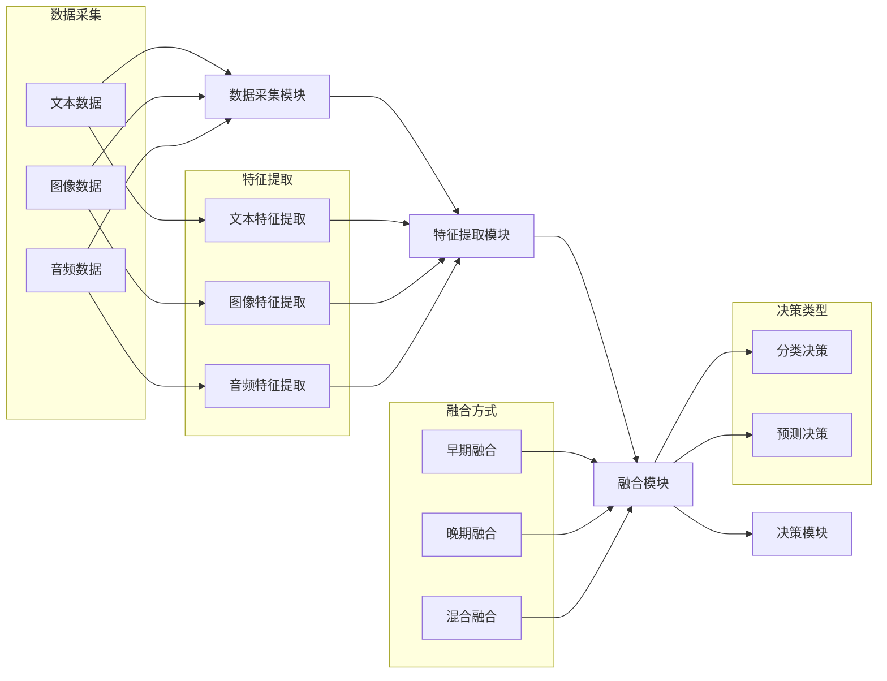

# 多模态融合:整合不同类型的输入数据

> 关键词：多模态融合、输入数据整合、跨模态交互、深度学习、信息互补

> 摘要：本文聚焦于多模态融合技术，旨在深入探讨如何整合不同类型的输入数据。首先介绍了多模态融合的背景信息，包括目的、预期读者、文档结构和相关术语。接着阐述了核心概念及其联系，通过文本示意图和 Mermaid 流程图进行直观展示。详细讲解了核心算法原理，并用 Python 代码进行说明，同时给出了相关的数学模型和公式。通过项目实战，展示了代码的实际案例及详细解释。探讨了多模态融合的实际应用场景，推荐了学习、开发所需的工具和资源，包括书籍、在线课程、技术博客、IDE 等。最后总结了多模态融合的未来发展趋势与挑战，并提供了常见问题解答和扩展阅读参考资料，帮助读者全面了解多模态融合技术。

## 1. 背景介绍 
### 1.1 目的和范围
在当今数字化时代，数据呈现出多样化的特点，不仅包括文本、图像、音频等不同类型的数据，而且这些数据往往相互关联、相互补充。多模态融合技术的目的就是将这些不同类型的输入数据进行有效的整合，挖掘出数据背后更丰富、更全面的信息。本文章的范围涵盖了多模态融合的基本概念、核心算法、数学模型、实际应用案例以及相关的工具和资源等方面，旨在为读者提供一个全面而深入的多模态融合技术的知识体系。

### 1.2 预期读者
本文预期读者包括对人工智能、机器学习、深度学习等领域感兴趣的研究人员、工程师、学生等。无论是希望深入了解多模态融合技术原理的学术研究者，还是想要将多模态融合应用到实际项目中的开发人员，都可以从本文中获取有价值的信息。

### 1.3 文档结构概述
本文将按照以下结构进行组织：首先介绍多模态融合的背景信息，包括目的、预期读者、文档结构和相关术语；接着阐述核心概念及其联系，并用文本示意图和 Mermaid 流程图进行直观展示；详细讲解核心算法原理，并用 Python 代码进行说明；给出相关的数学模型和公式；通过项目实战，展示代码的实际案例及详细解释；探讨多模态融合的实际应用场景；推荐学习、开发所需的工具和资源；总结多模态融合的未来发展趋势与挑战；提供常见问题解答和扩展阅读参考资料。

### 1.4 术语表
#### 1.4.1 核心术语定义
- **多模态数据**：指包含多种不同类型的数据，如文本、图像、音频、视频等。这些数据具有不同的特征和表示方式，反映了事物的不同方面。
- **多模态融合**：将不同模态的数据进行整合，以获取更全面、更准确的信息。融合的方式可以是早期融合、晚期融合或混合融合等。
- **特征表示**：将原始数据转换为一种适合计算机处理的数值表示形式。在多模态融合中，不同模态的数据需要进行适当的特征表示，以便后续的融合操作。
- **跨模态交互**：不同模态数据之间的相互作用和影响。通过跨模态交互，可以挖掘出不同模态数据之间的潜在关系。

#### 1.4.2 相关概念解释
- **模态独立性**：不同模态的数据具有各自独立的特征和信息，在一定程度上可以独立进行分析和处理。
- **信息互补性**：不同模态的数据包含的信息可以相互补充，通过融合可以获得更完整的信息。例如，图像可以提供物体的外观信息，而文本可以提供物体的名称和描述信息。
- **模态一致性**：在多模态融合中，不同模态的数据需要在语义、时间等方面保持一致，以便进行有效的融合。

#### 1.4.3 缩略词列表
- **CNN**：Convolutional Neural Network，卷积神经网络，常用于图像和视频数据的特征提取。
- **RNN**：Recurrent Neural Network，循环神经网络，常用于处理序列数据，如文本和音频。
- **LSTM**：Long Short-Term Memory，长短期记忆网络，是一种特殊的 RNN，能够有效处理长序列数据。
- **Transformer**：一种基于注意力机制的深度学习模型，在自然语言处理和图像等领域取得了很好的效果。

## 2. 核心概念与联系 

### 核心概念原理
多模态融合的核心思想是将不同模态的数据进行整合，以充分利用各模态数据的优势，提高信息处理的准确性和全面性。不同模态的数据具有不同的特征和表示方式，需要通过适当的方法将它们转换为统一的特征空间，然后进行融合。常见的融合方式有早期融合、晚期融合和混合融合。

- **早期融合**：在特征提取之前将不同模态的数据进行合并，然后一起进行特征提取和处理。这种方式可以充分利用不同模态数据之间的相关性，但可能会导致特征空间的维度过高，增加计算复杂度。
- **晚期融合**：先对不同模态的数据分别进行特征提取和处理，然后在决策层将各个模态的结果进行融合。这种方式可以避免早期融合带来的维度灾难问题，但可能会忽略不同模态数据之间的相互作用。
- **混合融合**：结合了早期融合和晚期融合的优点，在特征提取的不同阶段进行融合操作。

### 架构的文本示意图
多模态融合系统的基本架构可以分为以下几个部分：

- **数据采集模块**：负责收集不同模态的数据，如文本、图像、音频等。
- **特征提取模块**：对不同模态的数据进行特征提取，将原始数据转换为适合计算机处理的数值表示形式。
- **融合模块**：将不同模态的特征进行融合，得到统一的特征表示。
- **决策模块**：根据融合后的特征进行决策，如分类、预测等。

```plaintext
+----------------+
| 数据采集模块   |
| （文本、图像、 |
| 音频等）       |
+----------------+
        |
        v
+----------------+
| 特征提取模块   |
| （CNN、RNN等） |
+----------------+
        |
        v
+----------------+
| 融合模块       |
| （早期、晚期、 |
| 混合融合）     |
+----------------+
        |
        v
+----------------+
| 决策模块       |
| （分类、预测等）|
+----------------+
```

### Mermaid 流程图


## 3. 核心算法原理 & 具体操作步骤 

### 早期融合算法原理及 Python 代码实现
早期融合算法是在特征提取之前将不同模态的数据进行合并。以下是一个简单的早期融合示例，假设我们有文本数据和图像数据，将它们合并后进行特征提取。

```python
import numpy as np
from sklearn.feature_extraction.text import TfidfVectorizer
from sklearn.preprocessing import StandardScaler
from sklearn.ensemble import RandomForestClassifier

# 模拟文本数据
text_data = ["This is a sample text", "Another sample text"]
# 模拟图像数据
image_data = np.array([[1, 2, 3], [4, 5, 6]])

# 文本特征提取
vectorizer = TfidfVectorizer()
text_features = vectorizer.fit_transform(text_data).toarray()

# 图像数据标准化
scaler = StandardScaler()
image_features = scaler.fit_transform(image_data)

# 早期融合：合并文本和图像特征
merged_features = np.hstack((text_features, image_features))

# 模拟标签
labels = [0, 1]

# 训练模型
model = RandomForestClassifier()
model.fit(merged_features, labels)

# 预测
new_text = ["New sample text"]
new_image = np.array([[7, 8, 9]])
new_text_features = vectorizer.transform(new_text).toarray()
new_image_features = scaler.transform(new_image)
new_merged_features = np.hstack((new_text_features, new_image_features))
prediction = model.predict(new_merged_features)
print("早期融合预测结果:", prediction)
```

### 晚期融合算法原理及 Python 代码实现
晚期融合算法是先对不同模态的数据分别进行特征提取和处理，然后在决策层将各个模态的结果进行融合。以下是一个晚期融合的示例。

```python
import numpy as np
from sklearn.feature_extraction.text import TfidfVectorizer
from sklearn.preprocessing import StandardScaler
from sklearn.ensemble import RandomForestClassifier
from sklearn.linear_model import LogisticRegression

# 模拟文本数据
text_data = ["This is a sample text", "Another sample text"]
# 模拟图像数据
image_data = np.array([[1, 2, 3], [4, 5, 6]])

# 文本特征提取
vectorizer = TfidfVectorizer()
text_features = vectorizer.fit_transform(text_data).toarray()

# 图像数据标准化
scaler = StandardScaler()
image_features = scaler.fit_transform(image_data)

# 模拟标签
labels = [0, 1]

# 分别训练文本和图像模型
text_model = RandomForestClassifier()
text_model.fit(text_features, labels)

image_model = LogisticRegression()
image_model.fit(image_features, labels)

# 预测
new_text = ["New sample text"]
new_image = np.array([[7, 8, 9]])
new_text_features = vectorizer.transform(new_text).toarray()
new_image_features = scaler.transform(new_image)

text_prediction = text_model.predict_proba(new_text_features)
image_prediction = image_model.predict_proba(new_image_features)

# 晚期融合：简单平均
final_prediction = (text_prediction + image_prediction) / 2
final_result = np.argmax(final_prediction)
print("晚期融合预测结果:", final_result)
```

### 具体操作步骤
1. **数据预处理**：对不同模态的数据进行清洗、归一化等预处理操作，以提高数据的质量。
2. **特征提取**：根据不同模态的数据特点，选择合适的特征提取方法，如 CNN 用于图像特征提取，RNN 用于文本和音频特征提取。
3. **融合操作**：根据具体需求选择早期融合、晚期融合或混合融合方法，将不同模态的特征进行融合。
4. **模型训练**：使用融合后的特征训练机器学习或深度学习模型。
5. **模型评估**：使用测试数据对训练好的模型进行评估，评估指标可以包括准确率、召回率、F1 值等。

## 4. 数学模型和公式 & 详细讲解 & 举例说明 

### 特征提取的数学模型
#### 文本特征提取 - TF-IDF
TF-IDF（Term Frequency-Inverse Document Frequency）是一种常用的文本特征提取方法，用于衡量一个词在文档中的重要性。

- **词频（TF）**：指一个词在文档中出现的频率。计算公式为：
$$TF_{t,d}=\frac{n_{t,d}}{\sum_{i}n_{i,d}}$$
其中，$n_{t,d}$ 表示词 $t$ 在文档 $d$ 中出现的次数，$\sum_{i}n_{i,d}$ 表示文档 $d$ 中所有词的出现次数之和。

- **逆文档频率（IDF）**：指一个词在整个文档集合中的普遍重要性。计算公式为：
$$IDF_{t}=\log\frac{N}{df_{t}}$$
其中，$N$ 表示文档集合中的文档总数，$df_{t}$ 表示包含词 $t$ 的文档数。

- **TF-IDF 值**：词 $t$ 在文档 $d$ 中的 TF-IDF 值为：
$$TF - IDF_{t,d}=TF_{t,d}\times IDF_{t}$$

**举例说明**：假设有一个文档集合包含 3 个文档：
- $d_1$: "This is a sample text"
- $d_2$: "Another sample text"
- $d_3$: "This is another example"

对于词 "sample" 在文档 $d_1$ 中的 TF-IDF 值计算如下：
- $n_{sample,d_1}=1$，$\sum_{i}n_{i,d_1}=5$，所以 $TF_{sample,d_1}=\frac{1}{5}=0.2$。
- $df_{sample}=2$，$N = 3$，所以 $IDF_{sample}=\log\frac{3}{2}\approx0.176$。
- $TF - IDF_{sample,d_1}=0.2\times0.176 = 0.0352$。

#### 图像特征提取 - 卷积神经网络（CNN）
CNN 通过卷积层、池化层和全连接层对图像进行特征提取。卷积层的卷积操作可以用以下公式表示：
$$y_{i,j}^l=\sum_{m=0}^{M - 1}\sum_{n=0}^{N - 1}x_{i + m,j + n}^{l - 1}w_{m,n}^l + b^l$$
其中，$y_{i,j}^l$ 表示第 $l$ 层卷积层的输出特征图中第 $(i,j)$ 位置的值，$x_{i + m,j + n}^{l - 1}$ 表示第 $l - 1$ 层输入特征图中第 $(i + m,j + n)$ 位置的值，$w_{m,n}^l$ 表示第 $l$ 层的卷积核权重，$b^l$ 表示第 $l$ 层的偏置，$M$ 和 $N$ 分别表示卷积核的高度和宽度。

### 融合操作的数学模型
#### 早期融合
早期融合是将不同模态的特征直接拼接在一起。假设我们有文本特征向量 $\mathbf{x}_t\in\mathbb{R}^{n_t}$ 和图像特征向量 $\mathbf{x}_i\in\mathbb{R}^{n_i}$，则融合后的特征向量 $\mathbf{x}_f$ 为：
$$\mathbf{x}_f = [\mathbf{x}_t;\mathbf{x}_i]\in\mathbb{R}^{n_t + n_i}$$

#### 晚期融合 - 简单平均
晚期融合的简单平均方法是将不同模态的预测概率进行平均。假设文本模型的预测概率向量为 $\mathbf{p}_t\in\mathbb{R}^{C}$，图像模型的预测概率向量为 $\mathbf{p}_i\in\mathbb{R}^{C}$，其中 $C$ 表示类别数，则最终的预测概率向量 $\mathbf{p}_f$ 为：
$$\mathbf{p}_f=\frac{\mathbf{p}_t+\mathbf{p}_i}{2}$$

## 5. 项目实战：代码实际案例和详细解释说明 

### 5.1  开发环境搭建
- **操作系统**：推荐使用 Linux 系统，如 Ubuntu 18.04 及以上版本。
- **Python 版本**：Python 3.6 及以上版本。
- **依赖库安装**：使用 `pip` 安装以下必要的库：
```bash
pip install numpy scikit-learn tensorflow torch
```
其中，`numpy` 用于数值计算，`scikit-learn` 提供了常用的机器学习工具，`tensorflow` 和 `torch` 是深度学习框架。

### 5.2  源代码详细实现和代码解读
我们以一个简单的多模态情感分析项目为例，该项目融合了文本和图像数据进行情感分类。

```python
import numpy as np
import tensorflow as tf
from tensorflow.keras.preprocessing.text import Tokenizer
from tensorflow.keras.preprocessing.sequence import pad_sequences
from tensorflow.keras.applications.vgg16 import VGG16
from tensorflow.keras.layers import Input, Embedding, LSTM, Dense, Concatenate
from tensorflow.keras.models import Model

# 模拟文本数据
texts = ["This is a great movie", "This movie is terrible"]
labels = [1, 0]

# 文本预处理
tokenizer = Tokenizer(num_words=1000)
tokenizer.fit_on_texts(texts)
sequences = tokenizer.texts_to_sequences(texts)
max_length = 10
padded_sequences = pad_sequences(sequences, maxlen=max_length)

# 模拟图像数据
images = np.random.rand(2, 224, 224, 3)

# 图像特征提取模型
base_model = VGG16(weights='imagenet', include_top=False)
for layer in base_model.layers:
    layer.trainable = False
image_input = Input(shape=(224, 224, 3))
image_features = base_model(image_input)
image_features = tf.keras.layers.GlobalAveragePooling2D()(image_features)

# 文本特征提取模型
text_input = Input(shape=(max_length,))
embedding_layer = Embedding(input_dim=1000, output_dim=100)(text_input)
lstm_layer = LSTM(100)(embedding_layer)

# 融合层
merged = Concatenate()([image_features, lstm_layer])

# 输出层
output = Dense(1, activation='sigmoid')(merged)

# 构建模型
model = Model(inputs=[image_input, text_input], outputs=output)

# 编译模型
model.compile(optimizer='adam', loss='binary_crossentropy', metrics=['accuracy'])

# 训练模型
model.fit([images, padded_sequences], np.array(labels), epochs=10, batch_size=1)
```

### 代码解读与分析
1. **文本预处理**：使用 `Tokenizer` 对文本数据进行分词，并将文本转换为序列。使用 `pad_sequences` 对序列进行填充，使其长度一致。
2. **图像特征提取**：使用预训练的 VGG16 模型提取图像特征。为了减少计算量，将 VGG16 模型的前几层设置为不可训练。
3. **文本特征提取**：使用 `Embedding` 层将文本序列转换为向量表示，然后使用 `LSTM` 层提取文本特征。
4. **融合层**：使用 `Concatenate` 层将图像特征和文本特征进行拼接。
5. **输出层**：使用 `Dense` 层进行二分类，激活函数为 `sigmoid`。
6. **模型编译和训练**：使用 `adam` 优化器和 `binary_crossentropy` 损失函数编译模型，并进行训练。

## 6. 实际应用场景 
### 智能安防
在智能安防领域，多模态融合技术可以将视频监控数据和传感器数据（如声音、温度、湿度等）进行融合。通过分析视频中的人员行为和传感器采集的环境信息，可以更准确地检测异常事件，如入侵、火灾等。例如，当视频监控系统检测到有人进入敏感区域，同时声音传感器检测到异常声响时，系统可以及时发出警报。

### 医疗诊断
在医疗诊断中，多模态融合技术可以将医学影像数据（如 X 光、CT、MRI 等）和临床文本数据（如病历、症状描述等）进行融合。医生可以结合影像数据直观地观察患者的病情，同时参考文本数据了解患者的病史和症状，从而做出更准确的诊断。例如，在诊断肺癌时，结合 CT 影像和患者的病历信息，可以更准确地判断肿瘤的性质和分期。

### 自动驾驶
在自动驾驶领域，多模态融合技术可以将激光雷达、摄像头、毫米波雷达等传感器的数据进行融合。不同传感器具有不同的优缺点，通过融合可以充分发挥各传感器的优势，提高自动驾驶系统的感知能力和安全性。例如，激光雷达可以提供高精度的三维环境信息，摄像头可以提供丰富的视觉信息，将两者的数据融合可以更准确地识别道路、车辆和行人。

### 智能客服
在智能客服系统中，多模态融合技术可以将语音、文本和图像等数据进行融合。用户可以通过语音、文字或发送图片的方式与客服系统进行交互，系统可以根据不同模态的数据理解用户的需求，并提供相应的服务。例如，用户在咨询商品信息时，可以发送商品的图片，客服系统可以结合图片和用户的文本描述，更准确地为用户提供商品信息。

## 7. 工具和资源推荐
### 7.1 学习资源推荐
#### 7.1.1 书籍推荐
- 《深度学习》（Deep Learning）：由 Ian Goodfellow、Yoshua Bengio 和 Aaron Courville 撰写，是深度学习领域的经典教材，涵盖了深度学习的基本概念、算法和应用。
- 《Python 深度学习》（Deep Learning with Python）：由 Francois Chollet 撰写，以 Keras 深度学习框架为基础，介绍了深度学习的实践方法。
- 《多模态机器学习：基础与应用》（Multimodal Machine Learning: Foundations and Applications）：全面介绍了多模态机器学习的理论和方法，包括多模态数据的表示、融合和应用等方面。

#### 7.1.2 在线课程
- Coursera 上的“深度学习专项课程”（Deep Learning Specialization）：由 Andrew Ng 教授授课，包括五门课程，系统地介绍了深度学习的基础知识和应用。
- edX 上的“人工智能基础”（Introduction to Artificial Intelligence）：介绍了人工智能的基本概念、算法和应用，包括多模态融合技术。
- Udemy 上的“多模态机器学习实战”（Multimodal Machine Learning in Practice）：通过实际项目介绍多模态机器学习的应用和实现方法。

#### 7.1.3 技术博客和网站
- arXiv.org：是一个预印本服务器，提供了大量的学术论文，包括多模态融合领域的最新研究成果。
- Medium 上的 AI 相关博客：有很多专业的 AI 博主分享多模态融合技术的研究和实践经验。
- Towards Data Science：是一个数据科学和机器学习领域的博客平台，有很多关于多模态融合的文章。

### 7.2 开发工具框架推荐
#### 7.2.1 IDE和编辑器
- PyCharm：是一款专门为 Python 开发设计的集成开发环境，提供了丰富的代码编辑、调试和分析功能。
- Jupyter Notebook：是一个交互式的开发环境，适合进行数据探索和模型实验。用户可以在浏览器中编写和运行代码，并实时查看结果。
- Visual Studio Code：是一款轻量级的代码编辑器，支持多种编程语言和插件，具有强大的代码编辑和调试功能。

#### 7.2.2 调试和性能分析工具
- TensorBoard：是 TensorFlow 提供的可视化工具，可以用于监控模型的训练过程、查看模型的结构和性能指标等。
- PyTorch Profiler：是 PyTorch 提供的性能分析工具，可以帮助用户分析模型的性能瓶颈，优化代码。
- cProfile：是 Python 内置的性能分析工具，可以用于分析 Python 代码的运行时间和函数调用情况。

#### 7.2.3 相关框架和库
- TensorFlow：是一个开源的深度学习框架，提供了丰富的工具和库，支持多模态融合技术的开发。
- PyTorch：是另一个流行的深度学习框架，具有简洁易用的 API 和动态计算图的特点，适合快速开发和实验。
- Scikit-learn：是一个常用的机器学习库，提供了多种机器学习算法和工具，可用于多模态数据的预处理和模型训练。

### 7.3 相关论文著作推荐
#### 7.3.1 经典论文
- "Multimodal Machine Learning: A Survey and Taxonomy"：该论文对多模态机器学习进行了全面的综述和分类，介绍了多模态融合的基本概念、方法和应用。
- "Attention Is All You Need"：提出了 Transformer 模型，该模型基于注意力机制，在自然语言处理和图像等领域取得了很好的效果，也为多模态融合提供了新的思路。
- "Fusion of Text, Audio, and Visual Information in Spoken Language Systems"：研究了在口语系统中融合文本、音频和视觉信息的方法，为多模态融合在语音交互领域的应用提供了理论基础。

#### 7.3.2 最新研究成果
可以通过 arXiv.org、ACM Digital Library、IEEE Xplore 等学术数据库查找多模态融合领域的最新研究论文。例如，近年来一些研究致力于将多模态融合技术应用于医疗、教育、娱乐等领域，取得了一些有价值的成果。

#### 7.3.3 应用案例分析
一些学术会议和期刊会发表多模态融合技术的应用案例分析论文，如 ACM Multimedia、IEEE International Conference on Multimedia and Expo 等。这些案例分析可以帮助读者了解多模态融合技术在实际应用中的具体实现方法和效果。

## 8. 总结：未来发展趋势与挑战
### 未来发展趋势
- **跨领域融合**：多模态融合技术将与更多的领域进行深度融合，如生物医学、农业、金融等。通过融合不同领域的数据，可以挖掘出更多有价值的信息，为各领域的发展提供支持。
- **强化学习与多模态融合**：将强化学习与多模态融合技术相结合，可以使智能系统在复杂环境中更好地进行决策和行动。例如，在自动驾驶领域，强化学习可以根据多模态传感器的数据学习最优的驾驶策略。
- **端到端的多模态模型**：未来的多模态模型将朝着端到端的方向发展，即从原始数据输入到最终结果输出，整个过程由一个模型完成。这样可以减少中间环节的信息损失，提高模型的性能和效率。

### 挑战
- **数据异构性**：不同模态的数据具有不同的特征和表示方式，如何有效地处理数据的异构性是多模态融合面临的一个挑战。需要研究更有效的特征提取和融合方法，以充分利用不同模态数据的信息。
- **计算资源需求**：多模态融合技术通常需要处理大量的数据和复杂的模型，对计算资源的需求较高。如何在有限的计算资源下实现高效的多模态融合是一个亟待解决的问题。
- **语义一致性**：不同模态的数据在语义上可能存在不一致性，如何保证不同模态数据之间的语义一致性是多模态融合的另一个挑战。需要研究语义对齐和融合的方法，以提高多模态融合的准确性和可靠性。

## 9. 附录：常见问题与解答
### 多模态融合技术与单模态技术相比有哪些优势？
多模态融合技术可以充分利用不同模态数据的优势，挖掘出数据背后更丰富、更全面的信息。与单模态技术相比，多模态融合技术可以提高信息处理的准确性和全面性，减少单一模态数据的局限性。例如，在情感分析中，结合文本和语音信息可以更准确地判断用户的情感状态。

### 多模态融合有哪些常见的融合方法？
常见的融合方法有早期融合、晚期融合和混合融合。早期融合是在特征提取之前将不同模态的数据进行合并；晚期融合是先对不同模态的数据分别进行特征提取和处理，然后在决策层将各个模态的结果进行融合；混合融合结合了早期融合和晚期融合的优点，在特征提取的不同阶段进行融合操作。

### 如何选择合适的特征提取方法？
选择合适的特征提取方法需要考虑数据的类型和特点。对于图像数据，常用的特征提取方法有卷积神经网络（CNN）；对于文本数据，常用的方法有词袋模型、TF-IDF、词嵌入等；对于音频数据，常用的方法有梅尔频率倒谱系数（MFCC）等。此外，还可以根据具体的应用场景和任务需求选择合适的特征提取方法。

### 多模态融合技术在实际应用中面临哪些挑战？
多模态融合技术在实际应用中面临数据异构性、计算资源需求高、语义一致性等挑战。数据异构性导致不同模态的数据难以直接融合，需要研究更有效的特征提取和融合方法；计算资源需求高限制了多模态融合技术的应用范围，需要优化算法和模型以减少计算量；语义一致性问题影响了多模态融合的准确性和可靠性，需要研究语义对齐和融合的方法。

## 10. 扩展阅读 & 参考资料
- Goodfellow, I., Bengio, Y., & Courville, A. (2016). Deep Learning. MIT Press.
- Chollet, F. (2017). Deep Learning with Python. Manning Publications.
- Baltrušaitis, T., Ahuja, C., & Morency, L.-P. (2018). Multimodal Machine Learning: A Survey and Taxonomy. IEEE Transactions on Pattern Analysis and Machine Intelligence, 41(2), 423-443.
- Vaswani, A., Shazeer, N., Parmar, N., Uszkoreit, J., Jones, L., Gomez, A. N.,... & Polosukhin, I. (2017). Attention Is All You Need. Advances in Neural Information Processing Systems, 5998-6008.
- Deng, L., & Yu, D. (2014). Automatic Speech Recognition: A Deep Learning Approach. Springer.

作者：AI天才研究院/AI Genius Institute & 禅与计算机程序设计艺术 /Zen And The Art of Computer Programming