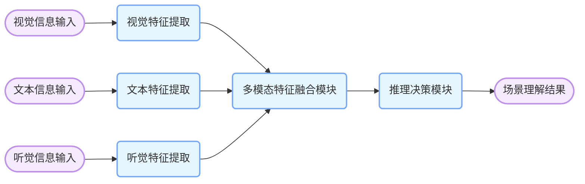

# 多模态融合推理在复杂场景理解中的新方法

> 关键词：多模态融合推理、复杂场景理解、深度学习、跨模态交互、信息互补

> 摘要：本文聚焦于多模态融合推理在复杂场景理解中的新方法。随着人工智能的发展，复杂场景理解面临着巨大挑战，单一模态信息难以满足需求，多模态融合推理应运而生。文章详细介绍了多模态融合推理的核心概念、算法原理、数学模型，通过实际项目案例展示其应用过程，分析了在不同实际场景中的应用，推荐了相关学习资源、开发工具和论文著作，最后对未来发展趋势与挑战进行总结，并提供常见问题解答和扩展阅读参考资料，旨在为该领域的研究和应用提供全面而深入的指导。

## 1. 背景介绍 
### 1.1 目的和范围
在当今的人工智能和计算机视觉领域，复杂场景理解是一个极具挑战性的任务。复杂场景往往包含丰富多样的信息，如视觉图像中的物体、场景布局、语义信息，听觉中的声音特征，文本中的描述等。单一模态的信息通常不足以全面、准确地理解这些复杂场景。多模态融合推理的目的就是整合多种不同模态的信息，发挥各模态信息的优势，实现更精准、更深入的复杂场景理解。

本文章的范围涵盖了多模态融合推理的基本概念、核心算法、数学模型、实际应用案例，以及相关的学习资源和未来发展趋势等方面。通过对这些内容的详细阐述，为读者提供一个全面了解多模态融合推理在复杂场景理解中应用的知识体系。

### 1.2 预期读者
本文预期读者包括人工智能、计算机科学、模式识别等相关领域的研究人员、工程师和学生。对于希望深入了解多模态融合推理技术，将其应用于复杂场景理解任务的专业人士，文章提供了从理论到实践的全面指导。同时，对于对人工智能技术有一定兴趣，希望了解多模态信息处理前沿进展的爱好者，也具有一定的参考价值。

### 1.3 文档结构概述
本文共分为十个部分。第一部分是背景介绍，阐述了文章的目的、预期读者和文档结构。第二部分介绍多模态融合推理的核心概念与联系，包括基本原理和架构，并通过文本示意图和 Mermaid 流程图进行直观展示。第三部分详细讲解核心算法原理和具体操作步骤，结合 Python 源代码进行说明。第四部分介绍数学模型和公式，并给出详细讲解和举例说明。第五部分是项目实战，包括开发环境搭建、源代码详细实现和代码解读。第六部分分析多模态融合推理在实际场景中的应用。第七部分推荐相关的学习资源、开发工具和论文著作。第八部分总结未来发展趋势与挑战。第九部分是附录，解答常见问题。第十部分提供扩展阅读和参考资料。

### 1.4 术语表
#### 1.4.1 核心术语定义
- **多模态**：指的是包含多种不同类型信息的形式，常见的模态有视觉（如图像、视频）、听觉（如音频）、文本等。
- **多模态融合推理**：将来自不同模态的信息进行整合，并基于整合后的信息进行推理和决策的过程。
- **复杂场景理解**：对包含多种元素、具有复杂结构和语义的场景进行分析、理解和解释的任务。

#### 1.4.2 相关概念解释
- **跨模态交互**：不同模态之间的信息交流和相互作用，通过跨模态交互可以挖掘各模态信息之间的关联和互补性。
- **信息互补**：不同模态的信息在描述场景时具有各自的优势和局限性，通过融合可以弥补彼此的不足，实现更全面的信息表示。

#### 1.4.3 缩略词列表
- **CNN**：Convolutional Neural Network，卷积神经网络，常用于处理视觉信息。
- **RNN**：Recurrent Neural Network，循环神经网络，常用于处理序列信息，如文本。
- **LSTM**：Long Short-Term Memory，长短期记忆网络，是 RNN 的一种变体，能够更好地处理长序列信息。

## 2. 核心概念与联系 
### 核心概念原理
多模态融合推理的核心思想是整合不同模态的信息，以获得更全面、准确的场景理解。不同模态的信息具有各自的特点和优势，例如视觉信息可以直观地展示场景的外观和布局，文本信息可以提供详细的语义描述，听觉信息可以反映场景中的声音特征。通过融合这些信息，可以充分发挥各模态的优势，实现信息的互补。

在复杂场景理解中，多模态融合推理通常包括以下几个步骤：首先，对不同模态的信息进行特征提取，将原始数据转换为具有代表性的特征向量。然后，通过一定的融合策略将这些特征向量进行整合。最后，基于融合后的特征进行推理和决策，例如对场景进行分类、目标检测、语义理解等。

### 架构示意图
下面是一个简单的多模态融合推理架构的文本示意图：

```plaintext
+----------------+       +----------------+       +----------------+
| 视觉信息输入   |       | 文本信息输入   |       | 听觉信息输入   |
+----------------+       +----------------+       +----------------+
       |                        |                        |
       v                        v                        v
+----------------+       +----------------+       +----------------+
| 视觉特征提取   |       | 文本特征提取   |       | 听觉特征提取   |
+----------------+       +----------------+       +----------------+
       |                        |                        |
       v                        v                        v
+------------------------------+
| 多模态特征融合模块           |
+------------------------------+
       |
       v
+----------------+
| 推理决策模块   |
+----------------+
       |
       v
+----------------+
| 场景理解结果   |
+----------------+
```

### Mermaid 流程图


## 3. 核心算法原理 & 具体操作步骤 
### 特征提取算法
在多模态融合推理中，首先需要对不同模态的信息进行特征提取。下面分别介绍视觉、文本和听觉信息的特征提取算法。

#### 视觉特征提取
对于视觉信息，常用的特征提取方法是使用卷积神经网络（CNN）。以下是一个使用 PyTorch 实现的简单示例：

```python
import torch
import torchvision.models as models

# 加载预训练的 ResNet 模型
resnet = models.resnet18(pretrained=True)
# 移除最后一层全连接层
feature_extractor = torch.nn.Sequential(*list(resnet.children())[:-1])

# 假设输入图像
input_image = torch.randn(1, 3, 224, 224)
# 提取特征
visual_features = feature_extractor(input_image)
visual_features = visual_features.view(visual_features.size(0), -1)

print("视觉特征形状:", visual_features.shape)
```

#### 文本特征提取
对于文本信息，常用的方法是使用预训练的语言模型，如 BERT。以下是一个使用 Hugging Face 的 Transformers 库实现的示例：

```python
from transformers import BertTokenizer, BertModel

# 加载预训练的 BERT 模型和分词器
tokenizer = BertTokenizer.from_pretrained('bert-base-uncased')
model = BertModel.from_pretrained('bert-base-uncased')

# 假设输入文本
input_text = "This is an example sentence."
# 分词
inputs = tokenizer(input_text, return_tensors='pt')
# 提取特征
outputs = model(**inputs)
text_features = outputs.last_hidden_state.mean(dim=1)

print("文本特征形状:", text_features.shape)
```

#### 听觉特征提取
对于听觉信息，常用的特征提取方法是使用 Mel 频率倒谱系数（MFCC）。以下是一个使用 Librosa 库实现的示例：

```python
import librosa
import numpy as np

# 加载音频文件
audio_file = 'example_audio.wav'
audio, sr = librosa.load(audio_file)
# 提取 MFCC 特征
mfccs = librosa.feature.mfcc(y=audio, sr=sr, n_mfcc=13)
# 取均值作为特征向量
audio_features = np.mean(mfccs, axis=1)

print("听觉特征形状:", audio_features.shape)
```

### 多模态特征融合算法
在提取了不同模态的特征后，需要将这些特征进行融合。常见的融合方法有早期融合、晚期融合和混合融合。这里以早期融合为例，介绍具体实现：

```python
# 假设已经提取了视觉、文本和听觉特征
# visual_features, text_features, audio_features

# 早期融合：简单拼接
fused_features = torch.cat((visual_features, text_features, torch.tensor(audio_features).unsqueeze(0)), dim=1)

print("融合特征形状:", fused_features.shape)
```

### 推理决策算法
在获得融合特征后，可以使用全连接神经网络进行推理决策。以下是一个简单的示例：

```python
import torch.nn as nn

# 定义一个简单的全连接网络
class InferenceNetwork(nn.Module):
    def __init__(self, input_size, output_size):
        super(InferenceNetwork, self).__init__()
        self.fc1 = nn.Linear(input_size, 128)
        self.relu = nn.ReLU()
        self.fc2 = nn.Linear(128, output_size)

    def forward(self, x):
        x = self.fc1(x)
        x = self.relu(x)
        x = self.fc2(x)
        return x

# 假设融合特征的维度和输出类别的数量
input_size = fused_features.shape[1]
output_size = 10

# 初始化推理网络
inference_net = InferenceNetwork(input_size, output_size)
# 进行推理
output = inference_net(fused_features)

print("推理输出形状:", output.shape)
```

## 4. 数学模型和公式 & 详细讲解 & 举例说明 
### 特征提取的数学模型
#### 卷积神经网络（CNN）
在视觉特征提取中，卷积神经网络的核心操作是卷积运算。对于输入图像 $X \in \mathbb{R}^{H \times W \times C}$（其中 $H$ 是高度，$W$ 是宽度，$C$ 是通道数）和卷积核 $K \in \mathbb{R}^{h \times w \times C \times N}$（其中 $h$ 和 $w$ 是卷积核的高度和宽度，$N$ 是卷积核的数量），卷积运算可以表示为：

$$
Y_{i,j,k} = \sum_{m=0}^{h-1} \sum_{n=0}^{w-1} \sum_{c=0}^{C-1} X_{i+m,j+n,c} \cdot K_{m,n,c,k} + b_k
$$

其中 $Y \in \mathbb{R}^{(H - h + 1) \times (W - w + 1) \times N}$ 是卷积输出，$b_k$ 是偏置项。

举例说明：假设输入图像是一个 $3 \times 3$ 的单通道图像 $X = \begin{bmatrix} 1 & 2 & 3 \\ 4 & 5 & 6 \\ 7 & 8 & 9 \end{bmatrix}$，卷积核是一个 $2 \times 2$ 的单通道卷积核 $K = \begin{bmatrix} 1 & 0 \\ 0 & 1 \end{bmatrix}$，偏置项 $b = 0$。则卷积输出 $Y$ 的计算如下：

$$
Y_{0,0} = 1 \times 1 + 2 \times 0 + 4 \times 0 + 5 \times 1 = 6
$$
$$
Y_{0,1} = 2 \times 1 + 3 \times 0 + 5 \times 0 + 6 \times 1 = 8
$$
$$
Y_{1,0} = 4 \times 1 + 5 \times 0 + 7 \times 0 + 8 \times 1 = 12
$$
$$
Y_{1,1} = 5 \times 1 + 6 \times 0 + 8 \times 0 + 9 \times 1 = 14
$$

所以 $Y = \begin{bmatrix} 6 & 8 \\ 12 & 14 \end{bmatrix}$。

#### 预训练语言模型（如 BERT）
在文本特征提取中，BERT 模型基于 Transformer 架构。Transformer 的核心是多头自注意力机制，其计算公式如下：

$$
\text{Attention}(Q, K, V) = \text{softmax}(\frac{QK^T}{\sqrt{d_k}})V
$$

其中 $Q$ 是查询矩阵，$K$ 是键矩阵，$V$ 是值矩阵，$d_k$ 是键向量的维度。多头自注意力机制是将多个单头注意力的结果拼接起来：

$$
\text{MultiHead}(Q, K, V) = \text{Concat}(\text{head}_1, \cdots, \text{head}_h)W^O
$$

其中 $\text{head}_i = \text{Attention}(QW_i^Q, KW_i^K, VW_i^V)$，$W_i^Q$、$W_i^K$、$W_i^V$ 和 $W^O$ 是可学习的参数矩阵。

### 多模态特征融合的数学模型
#### 早期融合
早期融合是将不同模态的特征向量直接拼接在一起。假设视觉特征向量 $v \in \mathbb{R}^{d_v}$，文本特征向量 $t \in \mathbb{R}^{d_t}$，听觉特征向量 $a \in \mathbb{R}^{d_a}$，则融合后的特征向量 $f$ 为：

$$
f = [v; t; a] \in \mathbb{R}^{d_v + d_t + d_a}
$$

#### 晚期融合
晚期融合是先对不同模态的特征分别进行处理，然后将处理后的结果进行融合。例如，对于视觉特征 $v$ 和文本特征 $t$，分别通过全连接网络 $F_v$ 和 $F_t$ 进行处理，得到 $y_v = F_v(v)$ 和 $y_t = F_t(t)$，然后将 $y_v$ 和 $y_t$ 进行融合：

$$
y = \text{Combine}(y_v, y_t)
$$

其中 $\text{Combine}$ 可以是简单的相加、拼接等操作。

### 推理决策的数学模型
在推理决策阶段，通常使用全连接神经网络。对于输入特征向量 $x \in \mathbb{R}^{d}$，全连接层的输出 $y$ 可以表示为：

$$
y = Wx + b
$$

其中 $W \in \mathbb{R}^{m \times d}$ 是权重矩阵，$b \in \mathbb{R}^{m}$ 是偏置向量，$m$ 是输出的维度。

举例说明：假设输入特征向量 $x = \begin{bmatrix} 1 \\ 2 \\ 3 \end{bmatrix}$，权重矩阵 $W = \begin{bmatrix} 1 & 2 & 3 \\ 4 & 5 & 6 \end{bmatrix}$，偏置向量 $b = \begin{bmatrix} 1 \\ 1 \end{bmatrix}$，则输出 $y$ 为：

$$
y = \begin{bmatrix} 1 & 2 & 3 \\ 4 & 5 & 6 \end{bmatrix} \begin{bmatrix} 1 \\ 2 \\ 3 \end{bmatrix} + \begin{bmatrix} 1 \\ 1 \end{bmatrix} = \begin{bmatrix} 1 \times 1 + 2 \times 2 + 3 \times 3 \\ 4 \times 1 + 5 \times 2 + 6 \times 3 \end{bmatrix} + \begin{bmatrix} 1 \\ 1 \end{bmatrix} = \begin{bmatrix} 14 \\ 32 \end{bmatrix} + \begin{bmatrix} 1 \\ 1 \end{bmatrix} = \begin{bmatrix} 15 \\ 33 \end{bmatrix}
$$

## 5. 项目实战：代码实际案例和详细解释说明 
### 5.1  开发环境搭建
#### 安装 Python
首先，确保你已经安装了 Python 3.6 或更高版本。可以从 Python 官方网站（https://www.python.org/downloads/）下载并安装。

#### 安装依赖库
使用 pip 安装所需的依赖库，包括 PyTorch、torchvision、transformers、librosa 等：

```sh
pip install torch torchvision
pip install transformers
pip install librosa
```

### 5.2  源代码详细实现和代码解读
以下是一个完整的多模态融合推理项目的代码示例，包括特征提取、特征融合和推理决策：

```python
import torch
import torchvision.models as models
from transformers import BertTokenizer, BertModel
import librosa
import numpy as np
import torch.nn as nn

# 视觉特征提取
def extract_visual_features(input_image):
    resnet = models.resnet18(pretrained=True)
    feature_extractor = torch.nn.Sequential(*list(resnet.children())[:-1])
    visual_features = feature_extractor(input_image)
    visual_features = visual_features.view(visual_features.size(0), -1)
    return visual_features

# 文本特征提取
def extract_text_features(input_text):
    tokenizer = BertTokenizer.from_pretrained('bert-base-uncased')
    model = BertModel.from_pretrained('bert-base-uncased')
    inputs = tokenizer(input_text, return_tensors='pt')
    outputs = model(**inputs)
    text_features = outputs.last_hidden_state.mean(dim=1)
    return text_features

# 听觉特征提取
def extract_audio_features(audio_file):
    audio, sr = librosa.load(audio_file)
    mfccs = librosa.feature.mfcc(y=audio, sr=sr, n_mfcc=13)
    audio_features = np.mean(mfccs, axis=1)
    return torch.tensor(audio_features).unsqueeze(0)

# 多模态特征融合
def fuse_features(visual_features, text_features, audio_features):
    fused_features = torch.cat((visual_features, text_features, audio_features), dim=1)
    return fused_features

# 推理决策网络
class InferenceNetwork(nn.Module):
    def __init__(self, input_size, output_size):
        super(InferenceNetwork, self).__init__()
        self.fc1 = nn.Linear(input_size, 128)
        self.relu = nn.ReLU()
        self.fc2 = nn.Linear(128, output_size)

    def forward(self, x):
        x = self.fc1(x)
        x = self.relu(x)
        x = self.fc2(x)
        return x

# 主函数
def main():
    # 假设输入图像、文本和音频文件
    input_image = torch.randn(1, 3, 224, 224)
    input_text = "This is an example sentence."
    audio_file = 'example_audio.wav'

    # 提取特征
    visual_features = extract_visual_features(input_image)
    text_features = extract_text_features(input_text)
    audio_features = extract_audio_features(audio_file)

    # 特征融合
    fused_features = fuse_features(visual_features, text_features, audio_features)

    # 初始化推理网络
    input_size = fused_features.shape[1]
    output_size = 10
    inference_net = InferenceNetwork(input_size, output_size)

    # 进行推理
    output = inference_net(fused_features)

    print("推理输出:", output)

if __name__ == "__main__":
    main()
```

### 5.3  代码解读与分析
- **特征提取部分**：`extract_visual_features` 函数使用预训练的 ResNet 模型提取视觉特征；`extract_text_features` 函数使用预训练的 BERT 模型提取文本特征；`extract_audio_features` 函数使用 Librosa 库提取听觉特征。
- **特征融合部分**：`fuse_features` 函数将提取的视觉、文本和听觉特征进行早期融合，通过简单的拼接操作得到融合特征。
- **推理决策部分**：`InferenceNetwork` 类定义了一个简单的全连接神经网络，用于进行推理决策。在 `main` 函数中，首先提取特征，然后进行特征融合，最后使用推理网络进行推理。

## 6. 实际应用场景 
### 智能安防
在智能安防领域，多模态融合推理可以用于复杂场景下的目标检测和行为分析。通过融合监控摄像头的视觉信息、麦克风的听觉信息和门禁系统的文本信息，可以更准确地识别异常行为和目标人物。例如，当视觉信息检测到有人在敏感区域徘徊，听觉信息捕捉到异常声音，文本信息显示该区域有禁止进入的提示时，系统可以及时发出警报。

### 自动驾驶
在自动驾驶中，多模态融合推理对于复杂场景理解至关重要。车辆需要融合摄像头的视觉图像、雷达的距离信息和激光雷达的三维点云数据，以准确感知周围环境，识别道路、交通标志、其他车辆和行人等。通过多模态融合，可以提高自动驾驶系统的可靠性和安全性。

### 医疗诊断
在医疗诊断中，多模态融合推理可以整合医学图像（如 X 光、CT、MRI）、病历文本和生命体征数据（如心率、血压）等信息，辅助医生进行更准确的疾病诊断。例如，结合医学图像中的病变特征和病历文本中的症状描述，可以提高疾病诊断的准确性和效率。

### 智能家居
在智能家居系统中，多模态融合推理可以实现更智能的交互和场景理解。通过融合摄像头的视觉信息、麦克风的语音信息和传感器的环境数据（如温度、湿度），智能家居系统可以根据用户的行为和环境变化自动调整设备状态。例如，当视觉信息检测到用户回家，语音信息识别出用户的指令，环境数据显示室内温度过高时，系统可以自动打开空调。

## 7. 工具和资源推荐
### 7.1 学习资源推荐
#### 7.1.1 书籍推荐
- 《深度学习》（Deep Learning）：由 Ian Goodfellow、Yoshua Bengio 和 Aaron Courville 编写，是深度学习领域的经典教材，涵盖了神经网络、卷积神经网络、循环神经网络等基础内容。
- 《模式识别与机器学习》（Pattern Recognition and Machine Learning）：由 Christopher M. Bishop 编写，介绍了模式识别和机器学习的基本概念、算法和应用，对理解多模态融合推理的理论基础有很大帮助。
- 《多模态机器学习：基础与应用》（Multimodal Machine Learning: Foundations and Applications）：专门介绍多模态机器学习的书籍，详细讲解了多模态数据的处理、融合和推理方法。

#### 7.1.2 在线课程
- Coursera 上的“深度学习专项课程”（Deep Learning Specialization）：由 Andrew Ng 教授授课，包括神经网络、卷积神经网络、循环神经网络等深度学习的核心内容。
- edX 上的“人工智能基础”（Introduction to Artificial Intelligence）：介绍人工智能的基本概念、算法和应用，对理解多模态融合推理的背景和应用场景有帮助。
- 哔哩哔哩上有很多关于深度学习和多模态融合推理的教学视频，如李沐的“动手学深度学习”系列课程。

#### 7.1.3 技术博客和网站
- arXiv（https://arxiv.org/）：一个预印本论文库，包含了大量关于多模态融合推理的最新研究成果。
- Medium（https://medium.com/）：有很多技术博客文章，涵盖了多模态融合推理的理论、算法和应用案例。
- 机器之心（https://www.alitavern.com/）：关注人工智能领域的最新动态和技术发展，提供了很多关于多模态融合推理的解读和分析文章。

### 7.2 开发工具框架推荐
#### 7.2.1 IDE和编辑器
- PyCharm：一款专门为 Python 开发设计的集成开发环境，具有代码编辑、调试、自动补全、版本控制等功能，适合开发多模态融合推理项目。
- Jupyter Notebook：一个交互式的开发环境，可以将代码、文本、图像等内容整合在一个文档中，方便进行代码测试和结果展示，常用于多模态融合推理的实验和研究。
- Visual Studio Code：一款轻量级的代码编辑器，支持多种编程语言和插件扩展，具有丰富的代码编辑和调试功能，也可以用于多模态融合推理项目的开发。

#### 7.2.2 调试和性能分析工具
- PyTorch Profiler：PyTorch 自带的性能分析工具，可以帮助开发者分析模型的运行时间、内存使用等性能指标，优化模型的性能。
- TensorBoard：一个可视化工具，可以用于监控模型的训练过程、可视化模型的结构和参数等，方便开发者调试和优化模型。
- cProfile：Python 标准库中的性能分析工具，可以分析 Python 代码的运行时间和函数调用情况，帮助开发者找出代码中的性能瓶颈。

#### 7.2.3 相关框架和库
- PyTorch：一个开源的深度学习框架，提供了丰富的神经网络层和优化算法，支持 GPU 加速，广泛用于多模态融合推理的模型开发。
- TensorFlow：另一个流行的深度学习框架，具有强大的分布式训练和部署能力，也可以用于多模态融合推理项目的开发。
- Hugging Face Transformers：一个用于自然语言处理的开源库，提供了多种预训练的语言模型，如 BERT、GPT 等，方便进行文本特征提取。
- Librosa：一个用于音频处理的 Python 库，提供了丰富的音频特征提取方法，如 MFCC、谱图等，可用于听觉特征提取。

### 7.3 相关论文著作推荐
#### 7.3.1 经典论文
- "Attention Is All You Need"：提出了 Transformer 架构，为自然语言处理和多模态融合推理提供了重要的基础。
- "Deep Residual Learning for Image Recognition"：提出了残差网络（ResNet），解决了深度神经网络训练中的梯度消失问题，在视觉特征提取中得到了广泛应用。
- "Long Short-Term Memory"：介绍了长短期记忆网络（LSTM），是处理序列信息的经典模型，常用于文本和音频特征提取。

#### 7.3.2 最新研究成果
- 在 arXiv 上搜索“Multimodal Fusion Reasoning”可以找到很多关于多模态融合推理的最新研究论文，这些论文涵盖了新的融合方法、算法和应用场景。
- 顶级学术会议如 CVPR（Computer Vision and Pattern Recognition）、ICML（International Conference on Machine Learning）、NeurIPS（Neural Information Processing Systems）等会发表多模态融合推理领域的最新研究成果。

#### 7.3.3 应用案例分析
- 一些学术期刊和会议论文会介绍多模态融合推理在实际应用场景中的案例分析，如智能安防、自动驾驶、医疗诊断等。通过阅读这些案例分析，可以了解多模态融合推理在实际应用中的挑战和解决方案。

## 8. 总结：未来发展趋势与挑战
### 未来发展趋势
- **更复杂的融合方法**：未来的多模态融合推理将探索更复杂、更有效的融合方法，以更好地挖掘不同模态信息之间的关联和互补性。例如，引入注意力机制、图神经网络等方法，实现更细粒度的跨模态交互。
- **多模态预训练模型**：类似于自然语言处理中的预训练模型，未来可能会出现多模态预训练模型，通过大规模的多模态数据进行预训练，然后在具体任务上进行微调，提高模型的泛化能力和性能。
- **跨领域应用拓展**：多模态融合推理将在更多领域得到应用，如教育、娱乐、工业制造等。例如，在教育领域，可以融合视频、文本和音频信息，实现更智能的教学辅助系统。

### 挑战
- **数据获取和标注**：多模态数据的获取和标注是一个挑战。不同模态的数据来源不同，数据格式和质量也存在差异，同时标注多模态数据需要耗费大量的人力和时间。
- **计算资源需求**：多模态融合推理通常需要处理大量的数据和复杂的模型，对计算资源的需求较高。如何在有限的计算资源下实现高效的多模态融合推理是一个亟待解决的问题。
- **模型解释性**：多模态融合推理模型通常是复杂的深度学习模型，缺乏良好的解释性。在一些对安全性和可靠性要求较高的应用场景中，如医疗诊断和自动驾驶，模型的解释性是一个重要的问题。

## 9. 附录：常见问题与解答
### 1. 多模态融合推理和单模态推理有什么区别？
单模态推理只使用单一类型的信息进行推理，如只使用视觉图像或文本信息。而多模态融合推理整合了多种不同模态的信息，能够充分发挥各模态信息的优势，实现更全面、准确的场景理解。多模态融合推理可以弥补单模态推理在信息表达上的不足，提高推理的准确性和可靠性。

### 2. 如何选择合适的多模态融合方法？
选择合适的多模态融合方法需要考虑多个因素，如数据特点、任务需求和模型复杂度等。早期融合方法简单直接，适用于数据维度较低、各模态信息相关性较强的情况；晚期融合方法可以分别对各模态信息进行处理，适用于数据维度较高、各模态信息独立性较强的情况；混合融合方法结合了早期融合和晚期融合的优点，能够更好地处理复杂的多模态数据。

### 3. 多模态融合推理模型的训练需要注意什么？
在训练多模态融合推理模型时，需要注意以下几点：
- 数据预处理：对不同模态的数据进行统一的预处理，如归一化、缩放等，以保证数据的一致性。
- 损失函数设计：根据任务需求设计合适的损失函数，考虑各模态信息的权重和贡献。
- 模型调优：使用合适的优化算法和超参数调整方法，如随机梯度下降、Adam 优化器等，对模型进行调优。

### 4. 多模态融合推理在实际应用中面临哪些挑战？
多模态融合推理在实际应用中面临以下挑战：
- 数据质量问题：不同模态的数据质量可能存在差异，如视觉图像的清晰度、文本信息的准确性等，会影响模型的性能。
- 跨模态语义对齐：不同模态的信息在语义上可能存在差异，如何实现跨模态的语义对齐是一个挑战。
- 实时性要求：在一些实时应用场景中，如自动驾驶和智能安防，需要模型能够在短时间内完成推理，对模型的计算效率提出了较高的要求。

## 10. 扩展阅读 & 参考资料
### 扩展阅读
- 《人工智能：一种现代的方法》（Artificial Intelligence: A Modern Approach）：全面介绍了人工智能的各个领域，包括机器学习、自然语言处理、计算机视觉等，对理解多模态融合推理的背景和相关技术有帮助。
- 《计算机视觉：算法与应用》（Computer Vision: Algorithms and Applications）：详细介绍了计算机视觉的基本算法和应用，包括图像特征提取、目标检测、图像分类等，对多模态融合推理中的视觉信息处理有参考价值。

### 参考资料
- Goodfellow, I., Bengio, Y., & Courville, A. (2016). Deep Learning. MIT Press.
- Bishop, C. M. (2006). Pattern Recognition and Machine Learning. Springer.
- Ngiam, J., Khosla, A., Kim, M., Nam, J., Lee, H., & Ng, A. Y. (2011). Multimodal Deep Learning. Proceedings of the 28th International Conference on Machine Learning (ICML-11).

作者：AI天才研究院/AI Genius Institute & 禅与计算机程序设计艺术 /Zen And The Art of Computer Programming