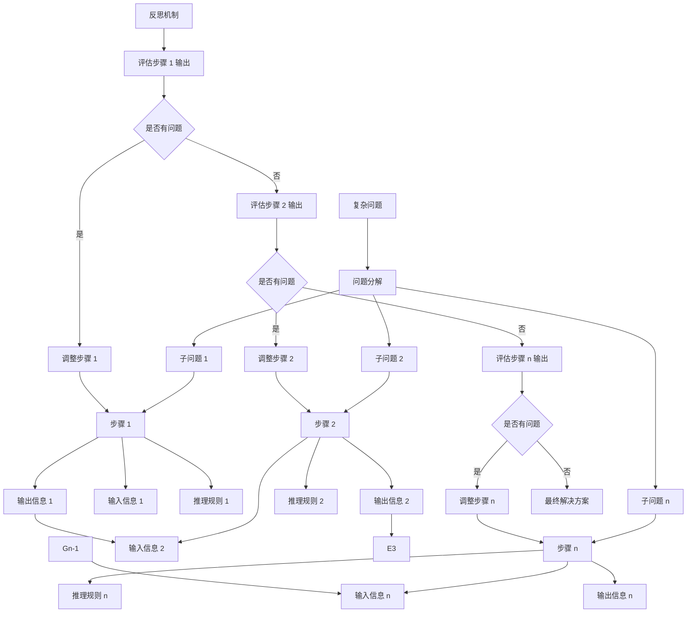

# 多步推理与反思:解决复杂问题的新思路

> 关键词：多步推理、反思机制、复杂问题解决、问题分解、迭代优化

> 摘要：本文聚焦于多步推理与反思这一解决复杂问题的新思路。首先介绍了该思路提出的背景，明确其目的和适用范围以及预期读者。接着详细阐述了多步推理和反思的核心概念、联系以及架构原理，并通过 Mermaid 流程图进行直观展示。深入讲解了多步推理的核心算法原理，给出 Python 源代码示例。同时，对涉及的数学模型和公式进行详细推导和举例说明。通过项目实战案例，展示了该思路在实际开发中的应用，包括开发环境搭建、源代码实现与解读。探讨了多步推理与反思在不同领域的实际应用场景，推荐了相关的学习资源、开发工具框架以及论文著作。最后总结了其未来发展趋势与挑战，并对常见问题进行了解答，提供了扩展阅读和参考资料。

## 1. 背景介绍 
### 1.1 目的和范围
在当今的科技与社会发展中，我们面临着越来越多的复杂问题，这些问题往往具有高度的不确定性、多维度的影响因素以及复杂的因果关系。传统的解决问题方法在面对这类复杂问题时，常常显得力不从心。多步推理与反思的新思路旨在提供一种更有效的方法来应对这些挑战。

本文章的范围涵盖了多步推理与反思的基本概念、核心算法原理、数学模型、实际应用案例等方面。通过对这些内容的详细阐述，帮助读者理解和掌握这一思路，并能够将其应用到实际的问题解决中。

### 1.2 预期读者
本文的预期读者包括但不限于计算机科学领域的专业人士，如程序员、软件架构师、人工智能研究者等。同时，对于对解决复杂问题感兴趣的其他领域的研究人员、工程师以及学生等也具有一定的参考价值。无论您是想要提升自己解决问题的能力，还是在寻找一种新的技术方法来应对工作中的挑战，都可以从本文中获得有益的启示。

### 1.3 文档结构概述
本文将按照以下结构进行组织：
1. 背景介绍：阐述多步推理与反思思路提出的背景、目的、预期读者以及文档结构概述。
2. 核心概念与联系：详细解释多步推理和反思的核心概念，展示它们之间的联系，并通过文本示意图和 Mermaid 流程图进行直观呈现。
3. 核心算法原理 & 具体操作步骤：深入讲解多步推理的核心算法原理，并给出具体的 Python 代码实现和操作步骤。
4. 数学模型和公式 & 详细讲解 & 举例说明：介绍多步推理与反思中涉及的数学模型和公式，进行详细推导和举例说明。
5. 项目实战：代码实际案例和详细解释说明：通过一个具体的项目实战案例，展示多步推理与反思在实际开发中的应用，包括开发环境搭建、源代码实现与解读。
6. 实际应用场景：探讨多步推理与反思在不同领域的实际应用场景。
7. 工具和资源推荐：推荐相关的学习资源、开发工具框架以及论文著作。
8. 总结：未来发展趋势与挑战：总结多步推理与反思的未来发展趋势，并分析可能面临的挑战。
9. 附录：常见问题与解答：对读者可能关心的常见问题进行解答。
10. 扩展阅读 & 参考资料：提供相关的扩展阅读内容和参考资料。

### 1.4 术语表
#### 1.4.1 核心术语定义
- **多步推理**：指在解决问题的过程中，将一个复杂问题分解为多个连续的步骤，通过逐步推导和计算，最终得出问题的解决方案。
- **反思机制**：在多步推理的过程中，对每一步的推理结果进行评估和检查，发现推理过程中的错误或不合理之处，并进行修正和调整。
- **复杂问题**：具有高度的不确定性、多维度的影响因素以及复杂的因果关系，难以通过简单的方法直接解决的问题。

#### 1.4.2 相关概念解释
- **问题分解**：将一个复杂问题分解为多个相对简单的子问题，以便于分别进行处理和解决。
- **迭代优化**：在多步推理的过程中，通过不断地对推理结果进行评估和调整，逐步提高解决方案的质量和准确性。

#### 1.4.3 缩略词列表
暂无

## 2. 核心概念与联系 

### 核心概念原理
多步推理的核心思想是将复杂问题分解为多个简单的子问题，通过逐步解决这些子问题，最终得到原问题的解决方案。在每一步推理中，我们根据已知的信息和规则，推导出新的信息和结论。这个过程可以看作是一个逐步深入的探索过程，每一步都在前一步的基础上进行扩展和深化。

反思机制则是对多步推理过程的一种监控和调整手段。在推理过程中，我们可能会遇到各种错误或不合理的情况，例如推理结果与实际情况不符、推理步骤存在逻辑漏洞等。反思机制可以帮助我们及时发现这些问题，并对推理过程进行修正和调整，以确保推理结果的准确性和可靠性。

### 架构的文本示意图
```plaintext
复杂问题
|
|-- 问题分解
|     |
|     |-- 子问题 1
|     |-- 子问题 2
|     |--...
|     |-- 子问题 n
|
|-- 多步推理
|     |
|     |-- 步骤 1（处理子问题 1）
|     |     |
|     |     |-- 输入信息 1
|     |     |-- 推理规则 1
|     |     |-- 输出信息 1
|     |
|     |-- 步骤 2（处理子问题 2）
|     |     |
|     |     |-- 输入信息 2（包含步骤 1 的输出信息）
|     |     |-- 推理规则 2
|     |     |-- 输出信息 2
|     |
|     |--...
|     |
|     |-- 步骤 n（处理子问题 n）
|           |
|           |-- 输入信息 n（包含步骤 n-1 的输出信息）
|           |-- 推理规则 n
|           |-- 输出信息 n
|
|-- 反思机制
|     |
|     |-- 评估步骤 1 的输出信息
|     |-- 若存在问题，调整步骤 1 的推理规则或输入信息
|     |-- 评估步骤 2 的输出信息
|     |-- 若存在问题，调整步骤 2 的推理规则或输入信息
|     |--...
|     |-- 评估步骤 n 的输出信息
|     |-- 若存在问题，调整步骤 n 的推理规则或输入信息
|
|-- 最终解决方案（综合步骤 n 的输出信息）
```

### Mermaid 流程图


## 3. 核心算法原理 & 具体操作步骤 

### 核心算法原理
多步推理的核心算法可以看作是一个迭代的过程，每一次迭代都处理一个子问题，并根据前一步的输出信息和当前的推理规则，推导出新的信息和结论。具体来说，算法的步骤如下：
1. **问题分解**：将复杂问题分解为多个子问题。
2. **初始化**：设置初始的输入信息和推理规则。
3. **迭代推理**：
    - 对于每个子问题，根据当前的输入信息和推理规则，进行推理计算，得到输出信息。
    - 将当前步骤的输出信息作为下一个步骤的输入信息。
4. **反思机制**：
    - 在每一步推理完成后，对输出信息进行评估，检查是否存在问题。
    - 如果存在问题，调整推理规则或输入信息，并重新进行推理。
5. **终止条件**：当所有子问题都处理完毕，且反思机制未发现问题时，算法终止，输出最终的解决方案。

### 具体操作步骤及 Python 源代码示例
下面通过一个简单的示例来演示多步推理与反思的过程。假设我们要解决一个简单的数学问题：计算 $1 + 2 + 3 +... + 10$。我们可以将这个问题分解为多个子问题，每个子问题是计算前 $i$ 个数的和。

```python
# 问题分解：将计算 1 到 10 的和分解为多个子问题
# 步骤 1：计算 1 的和
# 步骤 2：计算 1 + 2 的和
#...
# 步骤 10：计算 1 + 2 +... + 10 的和

# 初始化
current_sum = 0
step = 1

# 迭代推理
while step <= 10:
    # 当前步骤的推理规则：将当前数加到总和中
    current_sum += step
    
    # 反思机制：检查计算结果是否合理
    if current_sum < 0:
        print(f"步骤 {step} 计算结果不合理，需要调整。")
        break
    
    step += 1

# 输出最终结果
print(f"1 到 10 的和为: {current_sum}")
```

### 代码解释
1. **问题分解**：将计算 $1$ 到 $10$ 的和分解为 $10$ 个子问题，每个子问题是计算前 $i$ 个数的和。
2. **初始化**：设置初始的总和 `current_sum` 为 $0$，当前步骤 `step` 为 $1$。
3. **迭代推理**：在每次迭代中，将当前步骤的数加到总和中，并更新当前步骤。
4. **反思机制**：在每次迭代中，检查计算结果是否小于 $0$，如果小于 $0$，则认为计算结果不合理，输出错误信息并终止循环。
5. **终止条件**：当步骤数达到 $10$ 时，循环终止，输出最终的总和。

## 4. 数学模型和公式 & 详细讲解 & 举例说明 

### 数学模型
多步推理可以用一个递归的数学模型来表示。假设我们要解决的复杂问题可以表示为一个函数 $f(x)$，其中 $x$ 是输入信息。我们将这个问题分解为 $n$ 个子问题，每个子问题可以表示为一个函数 $f_i(x_i)$，其中 $x_i$ 是第 $i$ 个子问题的输入信息。

多步推理的过程可以表示为：
$$
\begin{cases}
x_1 = x \\
y_1 = f_1(x_1) \\
x_2 = g_1(y_1) \\
y_2 = f_2(x_2) \\
\cdots \\
x_n = g_{n-1}(y_{n-1}) \\
y_n = f_n(x_n)
\end{cases}
$$
其中，$y_i$ 是第 $i$ 个子问题的输出信息，$g_i$ 是一个转换函数，用于将第 $i$ 个子问题的输出信息转换为第 $i+1$ 个子问题的输入信息。

### 反思机制的数学表示
反思机制可以用一个评估函数 $h(y_i)$ 来表示，用于评估第 $i$ 个子问题的输出信息 $y_i$ 是否合理。如果 $h(y_i) = 0$，则认为输出信息合理；如果 $h(y_i) \neq 0$，则认为输出信息存在问题，需要调整推理规则或输入信息。

### 举例说明
继续以上面计算 $1$ 到 $10$ 的和的例子为例。我们可以将每个子问题表示为一个函数 $f_i(x_i)$，其中 $x_i$ 是前 $i-1$ 个数的和，$f_i(x_i) = x_i + i$。转换函数 $g_i(y_i) = y_i$，即直接将第 $i$ 个子问题的输出信息作为第 $i+1$ 个子问题的输入信息。

评估函数 $h(y_i)$ 可以定义为：
$$
h(y_i) = 
\begin{cases}
0, & y_i \geq 0 \\
1, & y_i < 0
\end{cases}
$$

当 $h(y_i) = 1$ 时，说明计算结果不合理，需要调整推理规则或输入信息。

## 5. 项目实战：代码实际案例和详细解释说明 

### 5.1  开发环境搭建
假设我们要开发一个简单的智能问答系统，使用多步推理与反思的思路来解决复杂的问题。我们将使用 Python 作为开发语言，Flask 作为 Web 框架，NLTK 作为自然语言处理工具。

#### 安装 Python
首先，确保你已经安装了 Python 3.x 版本。你可以从 Python 官方网站（https://www.python.org/downloads/） 下载并安装 Python。

#### 安装 Flask
使用以下命令安装 Flask：
```sh
pip install flask
```

#### 安装 NLTK
使用以下命令安装 NLTK：
```sh
pip install nltk
```

#### 下载 NLTK 数据
在 Python 交互式环境中运行以下代码下载 NLTK 数据：
```python
import nltk
nltk.download('punkt')
```

### 5.2  源代码详细实现和代码解读
```python
from flask import Flask, request, jsonify
import nltk
from nltk.tokenize import word_tokenize

app = Flask(__name__)

# 模拟问题分解函数
def decompose_question(question):
    # 简单的问题分解，将问题按空格分割为子问题
    sub_questions = question.split(" ")
    return sub_questions

# 模拟推理规则函数
def inference_rule(sub_question):
    # 简单的推理规则，返回子问题的长度
    return len(sub_question)

# 模拟反思机制函数
def reflection_mechanism(result):
    # 简单的反思机制，检查结果是否小于 0
    if result < 0:
        return True
    return False

# 多步推理函数
def multi_step_reasoning(question):
    sub_questions = decompose_question(question)
    final_result = 0
    for sub_question in sub_questions:
        result = inference_rule(sub_question)
        if reflection_mechanism(result):
            print("推理结果不合理，需要调整。")
            return None
        final_result += result
    return final_result

# 定义 API 接口
@app.route('/ask', methods=['POST'])
def ask():
    data = request.get_json()
    question = data.get('question')
    if question:
        result = multi_step_reasoning(question)
        if result is not None:
            return jsonify({"answer": result})
        else:
            return jsonify({"error": "推理过程出现问题"}), 500
    else:
        return jsonify({"error": "未提供问题"}), 400

if __name__ == '__main__':
    app.run(debug=True)
```

### 5.3  代码解读与分析
1. **问题分解函数 `decompose_question`**：将输入的问题按空格分割为多个子问题。
2. **推理规则函数 `inference_rule`**：对于每个子问题，返回其长度作为推理结果。
3. **反思机制函数 `reflection_mechanism`**：检查推理结果是否小于 $0$，如果小于 $0$，则认为推理结果不合理。
4. **多步推理函数 `multi_step_reasoning`**：对每个子问题进行推理计算，并将结果累加。在每一步推理完成后，调用反思机制函数检查推理结果是否合理。
5. **API 接口 `/ask`**：接收用户的问题，调用多步推理函数进行推理，并返回推理结果。

## 6. 实际应用场景 
### 智能客服系统
在智能客服系统中，用户提出的问题可能非常复杂，涉及多个方面的信息。多步推理与反思的思路可以帮助智能客服系统将用户的问题分解为多个子问题，逐步进行推理和解答。同时，反思机制可以确保推理结果的准确性和合理性，提高用户满意度。

### 医疗诊断系统
医疗诊断是一个复杂的过程，需要综合考虑患者的症状、病史、检查结果等多个因素。多步推理与反思的思路可以帮助医疗诊断系统将诊断过程分解为多个步骤，逐步排除不可能的疾病，最终确定最可能的诊断结果。反思机制可以帮助医生检查诊断结果是否合理，避免误诊。

### 金融风险评估系统
金融风险评估需要考虑多个因素，如市场波动、信用评级、行业趋势等。多步推理与反思的思路可以帮助金融风险评估系统将风险评估过程分解为多个子问题，逐步计算风险指标。反思机制可以帮助评估人员检查评估结果是否合理，及时调整评估模型。

## 7. 工具和资源推荐
### 7.1 学习资源推荐
#### 7.1.1 书籍推荐
- 《人工智能：一种现代的方法》：这是一本经典的人工智能教材，涵盖了人工智能的各个方面，包括多步推理、知识表示、机器学习等。
- 《Python 自然语言处理》：介绍了使用 Python 进行自然语言处理的方法和技术，对于开发智能问答系统等应用非常有帮助。
- 《算法导论》：详细介绍了各种算法的原理和实现，对于理解多步推理的算法原理有很大的帮助。

#### 7.1.2 在线课程
- Coursera 上的“人工智能基础”课程：由知名教授授课，系统地介绍了人工智能的基本概念和方法。
- edX 上的“Python 编程基础”课程：适合初学者学习 Python 编程，为后续的项目开发打下基础。
- 网易云课堂上的“自然语言处理实战”课程：通过实际项目案例，介绍了自然语言处理的应用和开发技巧。

#### 7.1.3 技术博客和网站
- Medium：上面有很多关于人工智能、机器学习、自然语言处理等领域的技术文章和博客，内容丰富多样。
- Towards Data Science：专注于数据科学和人工智能领域的技术博客，提供了很多实用的教程和案例。
- 开源中国：国内知名的开源技术社区，有很多关于 Python、人工智能等方面的技术文章和讨论。

### 7.2 开发工具框架推荐
#### 7.2.1 IDE和编辑器
- PyCharm：一款专业的 Python 集成开发环境，提供了丰富的代码编辑、调试、版本控制等功能。
- Visual Studio Code：一款轻量级的代码编辑器，支持多种编程语言，通过安装插件可以实现 Python 开发的各种功能。
- Jupyter Notebook：一种交互式的开发环境，适合进行数据分析、机器学习等领域的开发和实验。

#### 7.2.2 调试和性能分析工具
- PDB：Python 自带的调试工具，可以帮助开发者定位和解决代码中的问题。
- cProfile：Python 自带的性能分析工具，可以分析代码的运行时间和资源消耗情况。
- Py-Spy：一款轻量级的 Python 性能分析工具，可以实时监控 Python 程序的运行状态。

#### 7.2.3 相关框架和库
- Flask：一个轻量级的 Python Web 框架，适合快速开发 Web 应用和 API 接口。
- Django：一个功能强大的 Python Web 框架，提供了丰富的组件和工具，适合开发大型的 Web 应用。
- NLTK：一个流行的 Python 自然语言处理库，提供了丰富的工具和数据集，方便进行自然语言处理任务。

### 7.3 相关论文著作推荐
#### 7.3.1 经典论文
- “A Logical Calculus of the Ideas Immanent in Nervous Activity”：由 Warren McCulloch 和 Walter Pitts 发表于 1943 年，提出了人工神经网络的基本模型，为人工智能的发展奠定了基础。
- “A Mathematical Theory of Communication”：由 Claude Shannon 发表于 1948 年，提出了信息论的基本概念和理论，对自然语言处理等领域产生了深远的影响。
- “Machine Learning”：由 Tom Mitchell 编写的经典教材，系统地介绍了机器学习的基本概念、算法和应用。

#### 7.3.2 最新研究成果
- 关注顶级学术会议如 NeurIPS、ICML、ACL 等的论文，这些会议上发表的论文代表了人工智能领域的最新研究成果。
- 关注知名学术期刊如 Journal of Artificial Intelligence Research (JAIR)、Artificial Intelligence 等的论文，这些期刊上发表的论文具有较高的学术水平和影响力。

#### 7.3.3 应用案例分析
- 可以参考一些知名公司的技术博客和开源项目，了解他们在实际应用中使用多步推理与反思等技术的案例和经验。例如，谷歌、微软、百度等公司的技术博客上经常会分享他们在人工智能领域的研究成果和应用案例。

## 8. 总结：未来发展趋势与挑战
### 未来发展趋势
- **与深度学习的融合**：多步推理与反思可以与深度学习技术相结合，进一步提高模型的推理能力和泛化能力。例如，在深度学习模型中引入多步推理机制，可以让模型更好地处理复杂的任务和问题。
- **跨领域应用**：随着技术的不断发展，多步推理与反思的思路将在更多的领域得到应用，如交通、能源、教育等。通过将该思路应用到不同的领域，可以解决更多的复杂问题，推动各领域的发展。
- **自动化和智能化**：未来，多步推理与反思的过程将更加自动化和智能化。例如，通过引入元学习、强化学习等技术，可以让系统自动学习推理规则和反思策略，提高系统的自主学习能力和适应性。

### 挑战
- **计算资源需求**：多步推理与反思通常需要进行多次迭代计算，对计算资源的需求较大。如何在有限的计算资源下提高推理效率，是一个需要解决的问题。
- **知识表示和获取**：多步推理需要大量的知识和规则作为支撑。如何有效地表示和获取这些知识和规则，是一个具有挑战性的问题。
- **反思策略的设计**：反思机制的有效性取决于反思策略的设计。如何设计出合理的反思策略，能够准确地发现推理过程中的问题并进行有效的调整，是一个需要深入研究的问题。

## 9. 附录：常见问题与解答
### 问题 1：多步推理与反思和传统的问题解决方法有什么区别？
答：传统的问题解决方法通常是一次性地尝试找到问题的解决方案，而多步推理与反思则是将复杂问题分解为多个子问题，通过逐步推理和反思来解决问题。多步推理与反思更加注重推理过程的监控和调整，能够及时发现和纠正推理过程中的错误，提高解决方案的准确性和可靠性。

### 问题 2：如何确定问题的分解方式？
答：问题的分解方式通常取决于问题的性质和特点。可以根据问题的逻辑结构、时间顺序、空间分布等因素进行分解。在实际应用中，可以通过经验、领域知识和尝试不同的分解方式来找到最合适的分解方法。

### 问题 3：反思机制的实现难度大吗？
答：反思机制的实现难度取决于具体的应用场景和要求。对于一些简单的应用场景，可以通过定义一些简单的评估函数来实现反思机制。对于复杂的应用场景，可能需要使用机器学习、深度学习等技术来实现更智能的反思机制。

## 10. 扩展阅读 & 参考资料
### 扩展阅读
- 《深度学习》：详细介绍了深度学习的基本原理、算法和应用，对于理解多步推理与反思和深度学习的融合有很大的帮助。
- 《知识图谱：方法、实践与应用》：介绍了知识图谱的构建、表示和应用，对于解决多步推理中的知识表示和获取问题有一定的参考价值。
- 《强化学习：原理与Python实现》：介绍了强化学习的基本原理和算法，对于设计多步推理中的自动化和智能化机制有一定的启发作用。

### 参考资料
- McCarthy, J. (1959). Programs with common sense. In Proceedings of the Teddington Conference on the Mechanization of Thought Processes.
- Simon, H. A. (1969). The sciences of the artificial. MIT press.
- Minsky, M. L. (1975). A framework for representing knowledge. In The psychology of computer vision.

作者：AI天才研究院/AI Genius Institute & 禅与计算机程序设计艺术 /Zen And The Art of Computer Programming