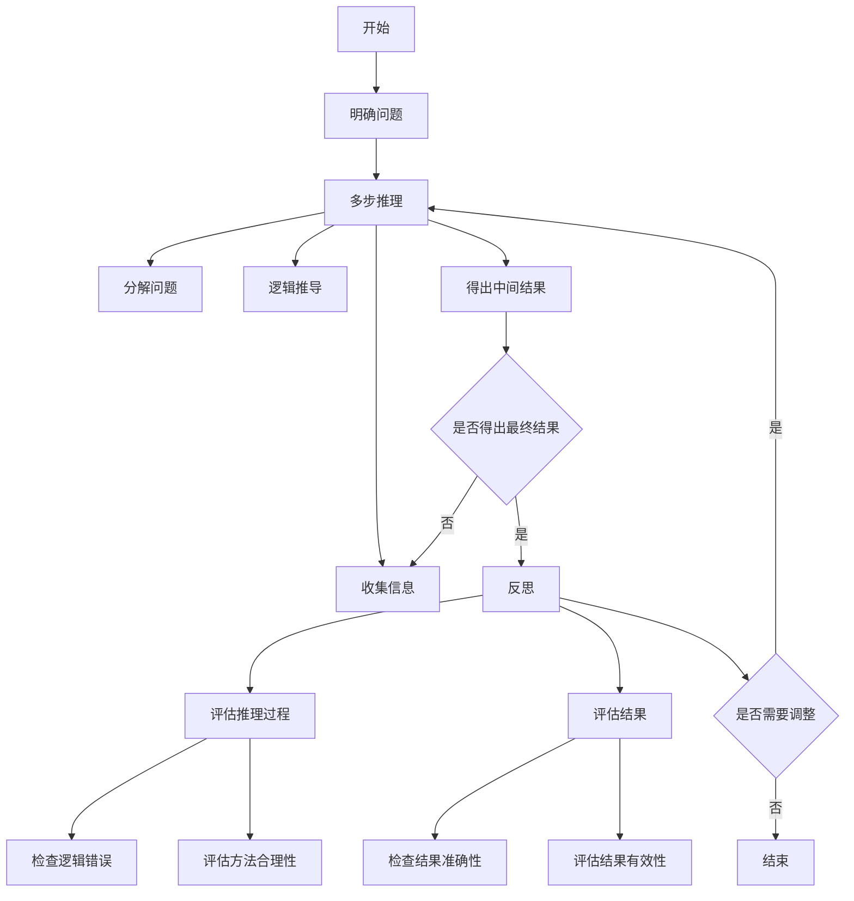

# 多步推理和反思在解决复杂问题中的应用

> 关键词：多步推理、反思、复杂问题解决、逻辑思维、迭代优化

> 摘要：本文深入探讨了多步推理和反思在解决复杂问题中的应用。详细介绍了多步推理和反思的核心概念及其相互联系，阐述了相关算法原理和具体操作步骤，并结合数学模型和公式进行说明。通过项目实战案例展示了如何运用多步推理和反思来解决实际问题，同时分析了其在不同领域的实际应用场景。此外，还推荐了一系列学习资源、开发工具框架以及相关论文著作。最后总结了未来发展趋势与挑战，并对常见问题进行了解答，为读者提供了全面而深入的关于多步推理和反思在复杂问题解决中的知识体系。

## 1. 背景介绍 
### 1.1 目的和范围
在当今复杂多变的世界中，无论是科学研究、工程技术、商业决策还是日常生活，我们都会遇到各种各样的复杂问题。这些问题往往具有多个相互关联的因素、不确定性和模糊性，难以通过简单的方法直接解决。本文章的目的在于深入探讨多步推理和反思这两种重要的思维方法在解决复杂问题中的应用，详细阐述其原理、操作步骤、数学模型以及实际案例，为读者提供一套系统的方法和思路，帮助他们更好地应对复杂问题。文章的范围涵盖了多步推理和反思的基本概念、算法原理、数学模型、项目实战、应用场景以及相关的学习资源和工具推荐等方面。

### 1.2 预期读者
本文的预期读者包括但不限于计算机科学、人工智能、数学、工程学等领域的专业人士和研究人员，他们希望深入了解多步推理和反思在解决复杂问题中的理论和实践应用；同时也适合对逻辑思维和问题解决方法感兴趣的爱好者，无论是学生、职场人士还是其他对提升思维能力有需求的人群，都可以从本文中获得有价值的信息和启示。

### 1.3 文档结构概述
本文将按照以下结构进行组织：首先介绍多步推理和反思的背景知识，包括目的、预期读者和文档结构概述等内容；接着阐述核心概念与联系，通过文本示意图和 Mermaid 流程图来展示其原理和架构；然后详细讲解核心算法原理和具体操作步骤，并使用 Python 源代码进行说明；随后介绍数学模型和公式，并通过举例进行详细讲解；再通过项目实战展示代码实际案例和详细解释说明；之后分析实际应用场景；接着推荐相关的工具和资源；最后总结未来发展趋势与挑战，解答常见问题，并提供扩展阅读和参考资料。

### 1.4 术语表
#### 1.4.1 核心术语定义
- **多步推理**：是指在解决问题的过程中，通过一系列连续的逻辑步骤，从已知信息逐步推导出未知信息的思维过程。每一步推理都基于前一步的结果，形成一个逻辑链条，最终达到解决问题的目的。
- **反思**：是指在解决问题的过程中，对已经进行的推理步骤、方法和结果进行回顾、分析和评估的过程。通过反思，可以发现推理过程中的错误、不合理之处，或者寻找更优的解决方案。
- **复杂问题**：是指具有多个相互关联的因素、不确定性、模糊性和动态性的问题，难以通过简单的方法直接解决。复杂问题通常需要综合运用多种知识和技能，进行多步推理和反思才能得到有效的解决。

#### 1.4.2 相关概念解释
- **逻辑推理**：是指根据已知的事实和规则，通过合理的推导得出结论的过程。逻辑推理是多步推理的基础，包括演绎推理、归纳推理和类比推理等多种形式。
- **元认知**：是指对自己的认知过程和认知结果的认识和监控。反思是元认知的重要组成部分，通过反思可以提高元认知能力，从而更好地控制和调节自己的思维过程。
- **问题空间**：是指问题的所有可能状态和解决方案的集合。在解决复杂问题时，需要在问题空间中进行搜索和探索，多步推理和反思可以帮助我们更有效地在问题空间中找到最优解。

#### 1.4.3 缩略词列表
本文中未使用缩略词。

## 2. 核心概念与联系 

### 核心概念原理
多步推理和反思是解决复杂问题的两个关键要素，它们相互关联、相互促进。多步推理是一个从已知信息出发，通过一系列逻辑步骤逐步推导出未知信息的过程。在这个过程中，我们需要运用各种逻辑规则和知识，将问题分解为多个子问题，并逐步解决这些子问题。例如，在数学证明中，我们需要从已知的定理和条件出发，通过一系列的推导得出待证明的结论。

反思则是在多步推理的过程中，对已经进行的推理步骤、方法和结果进行回顾、分析和评估的过程。通过反思，我们可以发现推理过程中的错误、不合理之处，或者寻找更优的解决方案。例如，在解决一个数学问题后，我们可以反思解题的方法是否合理，是否有其他更简便的方法。

### 架构的文本示意图
```plaintext
开始
|
|-- 明确问题
|
|-- 多步推理
|   |-- 收集信息
|   |-- 分解问题
|   |-- 逻辑推导
|   |-- 得出中间结果
|   |-- 重复上述步骤直到得出最终结果
|
|-- 反思
|   |-- 评估推理过程
|   |   |-- 检查逻辑错误
|   |   |-- 评估方法合理性
|   |-- 评估结果
|   |   |-- 检查结果准确性
|   |   |-- 评估结果有效性
|   |-- 根据反思结果调整推理过程或方法
|
|-- 循环（如果需要）
|
|-- 结束
```

### Mermaid 流程图


## 3. 核心算法原理 & 具体操作步骤 

### 核心算法原理
多步推理和反思的核心算法原理可以概括为以下几个步骤：
1. **问题表示**：将复杂问题转化为计算机可以处理的形式，例如使用图、树等数据结构来表示问题的状态和关系。
2. **推理规则定义**：定义一系列的推理规则，这些规则描述了如何从已知信息推导出新的信息。推理规则可以是逻辑规则、数学公式、专家经验等。
3. **推理过程控制**：控制推理的方向和步骤，确保推理过程朝着解决问题的方向进行。可以使用搜索算法，如广度优先搜索、深度优先搜索等，来遍历问题空间。
4. **反思机制**：在推理过程中，定期对推理步骤和结果进行反思，检查是否存在错误或不合理之处。如果发现问题，及时调整推理过程或方法。

### 具体操作步骤
以下是使用 Python 实现多步推理和反思的具体操作步骤和代码示例：

```python
# 定义问题表示
# 假设我们要解决一个简单的逻辑推理问题，有三个命题 A、B、C
# 已知规则：如果 A 为真且 B 为真，则 C 为真
# 初始状态：A 为真，B 为真

# 定义命题
propositions = {
    'A': True,
    'B': True,
    'C': False
}

# 定义推理规则
rules = [
    lambda props: props['A'] and props['B'] and (props['C'] is False)
]

# 多步推理函数
def multi_step_reasoning(propositions, rules):
    changed = True
    while changed:
        changed = False
        for rule in rules:
            if rule(propositions):
                # 根据规则更新命题状态
                propositions['C'] = True
                changed = True
    return propositions

# 反思函数
def reflection(propositions, rules):
    # 检查推理结果是否符合所有规则
    for rule in rules:
        if not rule(propositions):
            print("推理结果不符合规则，需要重新推理")
            return False
    print("推理结果符合规则")
    return True

# 执行多步推理
result = multi_step_reasoning(propositions, rules)

# 进行反思
reflection(result, rules)

print("最终结果:", result)
```

### 代码解释
1. **问题表示**：使用字典 `propositions` 来表示命题的状态，每个命题对应一个布尔值。
2. **推理规则定义**：使用匿名函数列表 `rules` 来定义推理规则，每个规则是一个函数，接受命题字典作为输入，返回一个布尔值。
3. **多步推理函数**：`multi_step_reasoning` 函数使用一个循环来不断应用推理规则，直到没有更多的命题状态可以更新为止。
4. **反思函数**：`reflection` 函数检查推理结果是否符合所有规则，如果不符合则提示需要重新推理。
5. **执行推理和反思**：调用 `multi_step_reasoning` 函数进行推理，然后调用 `reflection` 函数进行反思，最后输出最终结果。

## 4. 数学模型和公式 & 详细讲解 & 举例说明 

### 数学模型
多步推理和反思可以用图论和逻辑推理的数学模型来描述。假设我们有一个问题空间，其中每个节点表示问题的一个状态，每条边表示状态之间的转换关系。多步推理可以看作是在这个图中从初始状态到目标状态的路径搜索过程。

### 逻辑公式
在逻辑推理中，我们可以使用命题逻辑和谓词逻辑来表示推理规则和命题。例如，命题逻辑中的合取（$\land$）、析取（$\lor$）、否定（$\neg$）等运算符可以用来组合命题。

假设我们有三个命题 $A$、$B$、$C$，推理规则可以表示为：
$$(A \land B) \to C$$
这个公式表示如果 $A$ 和 $B$ 都为真，则 $C$ 为真。

### 详细讲解
在多步推理过程中，我们可以根据已知的命题和推理规则，使用逻辑推导来得出新的命题。例如，已知 $A$ 为真，$B$ 为真，根据上述推理规则，我们可以得出 $C$ 为真。

### 举例说明
假设我们要解决一个简单的逻辑谜题：有三个人，分别是 Alice、Bob 和 Charlie，他们中只有一个人会弹钢琴。已知以下条件：
1. 如果 Alice 会弹钢琴，那么 Bob 也会弹钢琴。
2. Charlie 不会弹钢琴。

我们可以用命题逻辑来表示这个问题：
- 令 $A$ 表示 “Alice 会弹钢琴”。
- 令 $B$ 表示 “Bob 会弹钢琴”。
- 令 $C$ 表示 “Charlie 会弹钢琴”。

则条件可以表示为：
1. $A \to B$
2. $\neg C$

由于只有一个人会弹钢琴，我们还可以得到约束条件：
$$A \oplus B \oplus C$$
其中 $\oplus$ 表示异或运算符。

通过多步推理，我们可以得出结论：因为 $C$ 为假，且 $A \to B$，如果 $A$ 为真，则 $B$ 也为真，这与只有一个人会弹钢琴矛盾，所以 $A$ 为假，那么 $B$ 为真，即 Bob 会弹钢琴。

## 5. 项目实战：代码实际案例和详细解释说明 

### 5.1  开发环境搭建
为了实现多步推理和反思的项目实战，我们需要搭建一个 Python 开发环境。以下是具体步骤：
1. **安装 Python**：从 Python 官方网站（https://www.python.org/downloads/）下载并安装最新版本的 Python。
2. **安装开发工具**：推荐使用 PyCharm 或 VS Code 作为开发工具，它们都提供了丰富的代码编辑和调试功能。
3. **创建虚拟环境**：使用 `venv` 模块创建一个虚拟环境，避免不同项目之间的依赖冲突。
```bash
python -m venv myenv
```
4. **激活虚拟环境**：
- 在 Windows 上：
```bash
myenv\Scripts\activate
```
- 在 Linux 或 macOS 上：
```bash
source myenv/bin/activate
```

### 5.2  源代码详细实现和代码解读
以下是一个更复杂的项目实战案例，我们要解决一个数独问题，使用多步推理和反思的方法。

```python
# 数独问题求解
class SudokuSolver:
    def __init__(self, board):
        self.board = board
        self.size = len(board)
        self.box_size = int(self.size ** 0.5)

    def is_valid(self, row, col, num):
        # 检查行
        for i in range(self.size):
            if self.board[row][i] == num:
                return False
        # 检查列
        for i in range(self.size):
            if self.board[i][col] == num:
                return False
        # 检查 3x3 子网格
        start_row = (row // self.box_size) * self.box_size
        start_col = (col // self.box_size) * self.box_size
        for i in range(start_row, start_row + self.box_size):
            for j in range(start_col, start_col + self.box_size):
                if self.board[i][j] == num:
                    return False
        return True

    def solve(self):
        for row in range(self.size):
            for col in range(self.size):
                if self.board[row][col] == 0:
                    for num in range(1, self.size + 1):
                        if self.is_valid(row, col, num):
                            self.board[row][col] = num
                            if self.solve():
                                return True
                            # 反思：如果当前选择导致无解，回溯
                            self.board[row][col] = 0
                    return False
        return True

    def print_board(self):
        for row in self.board:
            print(row)

# 示例数独棋盘
board = [
    [5, 3, 0, 0, 7, 0, 0, 0, 0],
    [6, 0, 0, 1, 9, 5, 0, 0, 0],
    [0, 9, 8, 0, 0, 0, 0, 6, 0],
    [8, 0, 0, 0, 6, 0, 0, 0, 3],
    [4, 0, 0, 8, 0, 3, 0, 0, 1],
    [7, 0, 0, 0, 2, 0, 0, 0, 6],
    [0, 6, 0, 0, 0, 0, 2, 8, 0],
    [0, 0, 0, 4, 1, 9, 0, 0, 5],
    [0, 0, 0, 0, 8, 0, 0, 7, 9]
]

solver = SudokuSolver(board)
if solver.solve():
    solver.print_board()
else:
    print("无解")
```

### 代码解读与分析
1. **类的定义**：`SudokuSolver` 类用于解决数独问题，包含初始化方法 `__init__`、检查数字是否合法的方法 `is_valid`、求解方法 `solve` 和打印棋盘的方法 `print_board`。
2. **多步推理**：在 `solve` 方法中，我们使用递归的方式进行多步推理。对于每个空白格子，尝试填入 1 到 9 的数字，如果填入的数字合法，则继续递归求解下一个空白格子。
3. **反思**：如果当前填入的数字导致后续无解，我们进行反思，将该格子的值重置为 0，回溯到上一个状态，尝试其他数字。
4. **最终结果**：如果所有格子都被填满且满足数独规则，则返回 `True`，表示求解成功；否则返回 `False`，表示无解。

## 6. 实际应用场景 
### 科学研究
在科学研究中，多步推理和反思是解决复杂问题的重要方法。例如，在物理学中，科学家需要通过多步推理来建立物理模型，解释实验现象，并预测未来的结果。在天文学中，天文学家需要通过多步推理来分析天体的运动轨迹和演化过程。在生物学中，生物学家需要通过多步推理来研究生物的遗传机制和进化规律。在研究过程中，科学家需要不断反思自己的推理过程和结果，检查是否存在错误或不合理之处，以确保研究的准确性和可靠性。

### 工程技术
在工程技术领域，多步推理和反思被广泛应用于系统设计、故障诊断和优化等方面。例如，在软件开发中，程序员需要通过多步推理来设计软件架构、编写代码和调试程序。在硬件设计中，工程师需要通过多步推理来设计电路、选择元器件和进行性能测试。在故障诊断中，技术人员需要通过多步推理来分析故障原因，找出故障点，并采取相应的修复措施。在优化过程中，工程师需要通过多步推理来寻找最优的解决方案，提高系统的性能和效率。在这些过程中，工程师需要不断反思自己的设计和决策，检查是否存在潜在的问题和风险，以确保工程的质量和安全。

### 商业决策
在商业决策中，多步推理和反思可以帮助企业管理者分析市场趋势、制定战略规划和评估投资项目。例如，企业管理者需要通过多步推理来分析市场需求、竞争对手和自身优势，制定出适合企业发展的战略规划。在评估投资项目时，管理者需要通过多步推理来分析项目的可行性、风险和收益，做出明智的投资决策。在决策过程中，管理者需要不断反思自己的决策依据和过程，检查是否存在信息不充分、判断失误等问题，以确保决策的科学性和合理性。

### 日常生活
在日常生活中，多步推理和反思也有很多应用。例如，在解决生活中的难题时，我们需要通过多步推理来分析问题的本质，找出解决问题的方法。在学习新知识时，我们需要通过多步推理来理解知识的内涵和逻辑关系，提高学习效果。在人际交往中，我们需要通过多步推理来理解他人的意图和情感，做出合适的反应。在日常生活中，我们也需要不断反思自己的行为和决策，总结经验教训，提高自己的生活质量和能力水平。

## 7. 工具和资源推荐
### 7.1 学习资源推荐
#### 7.1.1 书籍推荐
- 《思考，快与慢》（*Thinking, Fast and Slow*）：作者丹尼尔·卡尼曼（Daniel Kahneman）是诺贝尔经济学奖得主，这本书介绍了人类思维的两种模式：快思考和慢思考，以及它们在决策、判断和推理中的应用。通过阅读这本书，读者可以了解到人类思维的局限性和优势，学会如何运用多步推理和反思来提高决策的质量。
- 《金字塔原理》（*The Pyramid Principle*）：作者芭芭拉·明托（Barbara Minto）介绍了一种逻辑清晰、层次分明的思考和表达方法。这本书可以帮助读者学会如何将复杂的问题分解为多个子问题，通过多步推理来构建解决方案，并清晰地表达自己的观点。
- 《算法导论》（*Introduction to Algorithms*）：这本书是计算机科学领域的经典教材，介绍了各种算法的设计和分析方法。通过学习这本书，读者可以了解到多步推理在算法设计中的应用，学会如何运用算法来解决复杂的问题。

#### 7.1.2 在线课程
- Coursera 上的 “逻辑学基础”（*Fundamentals of Logic*）课程：该课程介绍了逻辑学的基本概念和方法，包括命题逻辑、谓词逻辑和模态逻辑等。通过学习这门课程，读者可以掌握逻辑推理的基本技巧，提高多步推理的能力。
- edX 上的 “人工智能基础”（*Foundations of Artificial Intelligence*）课程：该课程介绍了人工智能的基本概念和方法，包括搜索算法、知识表示和推理等。通过学习这门课程，读者可以了解到多步推理在人工智能中的应用，学会如何运用人工智能技术来解决复杂的问题。
- Udemy 上的 “批判性思维和问题解决”（*Critical Thinking and Problem Solving*）课程：该课程介绍了批判性思维的基本概念和方法，包括分析问题、评估证据、提出解决方案等。通过学习这门课程，读者可以学会如何运用批判性思维来进行多步推理和反思，提高解决复杂问题的能力。

#### 7.1.3 技术博客和网站
- Medium 上的 “Towards Data Science”：这是一个专注于数据科学和人工智能的技术博客，上面有很多关于多步推理、机器学习和深度学习的文章。读者可以通过阅读这些文章，了解到最新的技术动态和研究成果。
- Stack Overflow：这是一个程序员社区，上面有很多关于编程和算法的问题和解决方案。读者可以通过搜索相关的问题，了解到多步推理在实际编程中的应用和技巧。
- Hacker News：这是一个科技新闻网站，上面有很多关于科技行业的最新消息和技术文章。读者可以通过阅读这些文章，了解到多步推理和反思在不同领域的应用和发展趋势。

### 7.2 开发工具框架推荐
#### 7.2.1 IDE和编辑器
- PyCharm：这是一个专门为 Python 开发设计的集成开发环境（IDE），提供了丰富的代码编辑、调试和测试功能。PyCharm 可以帮助程序员更高效地开发和调试多步推理和反思相关的代码。
- VS Code：这是一个轻量级的代码编辑器，支持多种编程语言和插件。VS Code 提供了丰富的代码编辑和调试功能，同时还可以通过安装插件来扩展其功能。程序员可以使用 VS Code 来开发和调试多步推理和反思相关的代码。
- Jupyter Notebook：这是一个交互式的开发环境，支持多种编程语言，如 Python、R 等。Jupyter Notebook 可以让程序员以笔记本的形式编写和运行代码，方便进行数据分析和可视化。程序员可以使用 Jupyter Notebook 来进行多步推理和反思的实验和验证。

#### 7.2.2 调试和性能分析工具
- PDB：这是 Python 自带的调试工具，可以帮助程序员在代码中设置断点、单步执行代码和查看变量的值。通过使用 PDB，程序员可以深入了解多步推理和反思的执行过程，找出代码中的错误和问题。
- cProfile：这是 Python 自带的性能分析工具，可以帮助程序员分析代码的性能瓶颈和执行时间。通过使用 cProfile，程序员可以找出多步推理和反思代码中耗时较长的部分，进行优化和改进。
- Py-Spy：这是一个第三方的性能分析工具，可以实时监控 Python 程序的性能。Py-Spy 可以帮助程序员快速定位代码中的性能问题，提高多步推理和反思代码的执行效率。

#### 7.2.3 相关框架和库
- NetworkX：这是一个用于创建、操作和研究复杂网络的 Python 库。NetworkX 提供了丰富的图算法和数据结构，可以帮助程序员实现多步推理中的图搜索和路径规划等功能。
- SymPy：这是一个用于符号计算的 Python 库。SymPy 可以进行代数运算、微积分、方程求解等操作，帮助程序员实现多步推理中的数学计算和逻辑推导。
- scikit-learn：这是一个用于机器学习的 Python 库。scikit-learn 提供了丰富的机器学习算法和工具，可以帮助程序员实现多步推理中的机器学习模型训练和预测等功能。

### 7.3 相关论文著作推荐
#### 7.3.1 经典论文
- 《人工智能中的逻辑推理》（*Logical Reasoning in Artificial Intelligence*）：这篇论文介绍了逻辑推理在人工智能中的应用，包括命题逻辑、谓词逻辑和非单调逻辑等。通过阅读这篇论文，读者可以了解到多步推理在人工智能中的理论基础和发展历程。
- 《问题解决的心理学》（*The Psychology of Problem Solving*）：这篇论文介绍了人类问题解决的心理过程和机制，包括问题表征、策略选择和反思等。通过阅读这篇论文，读者可以了解到多步推理和反思在人类问题解决中的重要性和作用。
- 《多步推理的算法设计与分析》（*Algorithm Design and Analysis for Multi-step Reasoning*）：这篇论文介绍了多步推理的算法设计和分析方法，包括搜索算法、动态规划和启发式算法等。通过阅读这篇论文，读者可以了解到如何设计和分析高效的多步推理算法。

#### 7.3.2 最新研究成果
- 《基于深度学习的多步推理模型》（*Multi-step Reasoning Models Based on Deep Learning*）：这篇论文介绍了基于深度学习的多步推理模型的最新研究成果，包括循环神经网络、卷积神经网络和图神经网络等。通过阅读这篇论文，读者可以了解到深度学习在多步推理中的应用和发展趋势。
- 《多步推理中的反思机制研究》（*Research on Reflection Mechanisms in Multi-step Reasoning*）：这篇论文介绍了多步推理中的反思机制的最新研究成果，包括元认知理论、强化学习和贝叶斯推理等。通过阅读这篇论文，读者可以了解到反思机制在多步推理中的作用和实现方法。
- 《多步推理在复杂系统中的应用》（*Applications of Multi-step Reasoning in Complex Systems*）：这篇论文介绍了多步推理在复杂系统中的应用的最新研究成果，包括生物系统、社会系统和工程系统等。通过阅读这篇论文，读者可以了解到多步推理在不同领域的应用和挑战。

#### 7.3.3 应用案例分析
- 《多步推理在医疗诊断中的应用案例分析》（*Case Analysis of Multi-step Reasoning in Medical Diagnosis*）：这篇论文介绍了多步推理在医疗诊断中的应用案例，包括疾病诊断、治疗方案选择和预后评估等。通过阅读这篇论文，读者可以了解到多步推理在医疗领域的实际应用和效果。
- 《多步推理在金融风险评估中的应用案例分析》（*Case Analysis of Multi-step Reasoning in Financial Risk Assessment*）：这篇论文介绍了多步推理在金融风险评估中的应用案例，包括信用风险评估、市场风险评估和操作风险评估等。通过阅读这篇论文，读者可以了解到多步推理在金融领域的实际应用和挑战。
- 《多步推理在交通规划中的应用案例分析》（*Case Analysis of Multi-step Reasoning in Transportation Planning*）：这篇论文介绍了多步推理在交通规划中的应用案例，包括交通流量预测、交通拥堵缓解和交通设施规划等。通过阅读这篇论文，读者可以了解到多步推理在交通领域的实际应用和效果。

## 8. 总结：未来发展趋势与挑战
### 未来发展趋势
#### 与人工智能的深度融合
随着人工智能技术的不断发展，多步推理和反思将与人工智能技术进行更深度的融合。例如，在深度学习模型中引入多步推理和反思机制，可以提高模型的可解释性和泛化能力。通过多步推理，模型可以逐步分析输入数据，得出更准确的结论；通过反思，模型可以对自己的推理过程进行评估和调整，提高模型的性能和可靠性。

#### 跨领域应用的拓展
多步推理和反思的应用将不再局限于传统的科学研究、工程技术和商业决策等领域，而是会拓展到更多的跨领域应用中。例如，在智能医疗领域，多步推理和反思可以帮助医生更准确地诊断疾病、制定治疗方案；在智能交通领域，多步推理和反思可以帮助交通管理部门更有效地规划交通流量、缓解交通拥堵；在智能家居领域，多步推理和反思可以帮助智能家居系统更好地理解用户需求、提供个性化的服务。

#### 自动化和智能化的发展
未来，多步推理和反思的过程将越来越自动化和智能化。通过开发更先进的算法和工具，计算机可以自动完成多步推理和反思的过程，大大提高解决复杂问题的效率和准确性。例如，在软件开发中，自动化测试工具可以自动进行多步推理和反思，找出代码中的漏洞和问题；在数据分析中，智能数据分析工具可以自动进行多步推理和反思，发现数据中的规律和趋势。

### 挑战
#### 数据的质量和可用性
多步推理和反思需要大量的高质量数据作为支持。然而，在实际应用中，数据的质量和可用性往往是一个挑战。例如，数据可能存在噪声、缺失值和不一致性等问题，这些问题会影响多步推理和反思的准确性和可靠性。因此，如何获取高质量的数据，并对数据进行有效的预处理和清洗，是未来需要解决的一个重要问题。

#### 算法的复杂度和效率
多步推理和反思的算法往往比较复杂，计算量较大。在处理大规模数据和复杂问题时，算法的效率会成为一个瓶颈。因此，如何设计高效的算法，提高多步推理和反思的效率，是未来需要解决的另一个重要问题。

#### 人类思维与机器推理的结合
虽然计算机在多步推理和反思方面具有很强的计算能力和速度，但人类的思维方式和创造力在解决复杂问题中仍然具有不可替代的作用。如何将人类思维与机器推理有机地结合起来，发挥各自的优势，是未来需要解决的一个关键问题。例如，在决策过程中，如何让计算机的推理结果为人类提供参考，同时让人类的经验和直觉对计算机的推理过程进行修正和优化，是一个值得研究的方向。

## 9. 附录：常见问题与解答
### 问题 1：多步推理和反思与普通的推理有什么区别？
多步推理和反思与普通的推理的主要区别在于，多步推理强调通过一系列连续的逻辑步骤来逐步推导出结论，而普通的推理可能只涉及简单的一步或几步推导。反思是多步推理过程中的一个重要环节，它要求对已经进行的推理步骤、方法和结果进行回顾、分析和评估，以发现问题并进行调整。而普通的推理可能不强调反思这一环节。

### 问题 2：如何提高多步推理和反思的能力？
提高多步推理和反思的能力可以从以下几个方面入手：
1. **学习逻辑知识**：掌握逻辑推理的基本规则和方法，如演绎推理、归纳推理和类比推理等。
2. **多做练习题**：通过做逻辑推理题、数学题等，锻炼自己的推理能力和思维能力。
3. **培养反思习惯**：在解决问题后，及时对自己的推理过程和结果进行反思，总结经验教训，发现问题并进行改进。
4. **学习相关领域的知识**：多步推理和反思往往需要结合具体领域的知识，因此学习相关领域的知识可以帮助我们更好地进行推理和反思。
5. **与他人交流合作**：与他人交流合作可以分享不同的观点和思路，拓宽自己的视野，同时也可以从他人的反馈中发现自己的问题和不足。

### 问题 3：多步推理和反思在人工智能中有哪些应用？
多步推理和反思在人工智能中有很多应用，例如：
1. **知识推理**：在知识图谱中，通过多步推理可以从已知的知识中推导出新的知识。
2. **问题求解**：在人工智能规划、搜索等领域，多步推理可以帮助计算机找到解决问题的最优方案。
3. **机器学习**：在深度学习模型中，引入多步推理和反思机制可以提高模型的可解释性和泛化能力。
4. **自然语言处理**：在机器翻译、问答系统等领域，多步推理可以帮助计算机更好地理解自然语言的含义，提高处理效果。

### 问题 4：多步推理和反思需要哪些数学基础？
多步推理和反思需要一定的数学基础，主要包括以下几个方面：
1. **逻辑代数**：逻辑代数是研究逻辑推理的数学工具，包括命题逻辑、谓词逻辑等。掌握逻辑代数的基本概念和运算规则，可以帮助我们更好地进行逻辑推理。
2. **集合论**：集合论是研究集合的性质和运算的数学分支，它是现代数学的基础之一。在多步推理中，集合论可以用来表示问题的状态和关系。
3. **概率论与数理统计**：概率论与数理统计是研究随机现象的数学分支，它在机器学习、数据分析等领域有广泛的应用。在多步推理中，概率论与数理统计可以用来处理不确定性和随机性。
4. **图论**：图论是研究图的性质和应用的数学分支，它在计算机科学、网络科学等领域有广泛的应用。在多步推理中，图论可以用来表示问题的状态空间和搜索路径。

## 10. 扩展阅读 & 参考资料
### 扩展阅读
- 《人工智能：一种现代方法》（*Artificial Intelligence: A Modern Approach*）：这本书是人工智能领域的经典教材，全面介绍了人工智能的基本概念、方法和技术，包括多步推理、机器学习、自然语言处理等方面的内容。
- 《批判性思维工具》（*Critical Thinking: Tools for Taking Charge of Your Learning and Your Life*）：这本书介绍了批判性思维的基本概念和方法，包括分析问题、评估证据、提出解决方案等。通过阅读这本书，读者可以学会如何运用批判性思维来进行多步推理和反思。
- 《数据结构与算法分析》（*Data Structures and Algorithm Analysis*）：这本书介绍了数据结构和算法的基本概念和方法，包括搜索算法、排序算法、图算法等。通过阅读这本书，读者可以了解到多步推理中常用的算法和数据结构。

### 参考资料
- 相关学术论文：在学术数据库（如 IEEE Xplore、ACM Digital Library、ScienceDirect 等）中搜索关于多步推理和反思的学术论文，这些论文可以提供最新的研究成果和技术方法。
- 开源项目：在 GitHub 等开源代码托管平台上搜索与多步推理和反思相关的开源项目，这些项目可以提供实际的代码实现和应用案例。
- 行业报告：关注相关行业的研究报告，如人工智能、数据科学、计算机科学等领域的研究报告，这些报告可以提供行业的发展趋势和应用案例。

作者：AI天才研究院/AI Genius Institute & 禅与计算机程序设计艺术 /Zen And The Art of Computer Programming