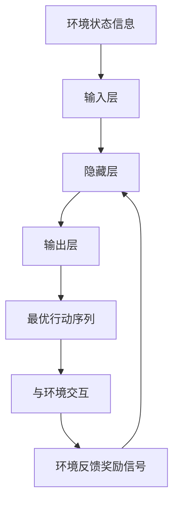

# 多步推理策略生成中神经规划器的优化方法

> 关键词：多步推理、神经规划器、优化方法、策略生成、深度学习

> 摘要：本文聚焦于多步推理策略生成中神经规划器的优化方法。首先介绍了相关背景知识，包括目的、预期读者、文档结构等。接着阐述了核心概念及联系，分析了神经规划器的工作原理和架构。详细讲解了核心算法原理，通过Python代码示例展示具体操作步骤，并给出相应的数学模型和公式。在项目实战部分，搭建开发环境，实现并解读了源代码。探讨了实际应用场景，推荐了学习资源、开发工具框架和相关论文著作。最后总结了未来发展趋势与挑战，解答了常见问题并提供扩展阅读和参考资料，旨在为研究和应用神经规划器进行多步推理策略生成的人员提供全面且深入的指导。

## 1. 背景介绍 
### 1.1 目的和范围
多步推理策略生成在许多领域都具有重要意义，如人工智能、机器人技术、游戏开发等。神经规划器作为实现多步推理策略生成的关键工具，其性能直接影响到系统的表现。本文的目的在于深入探讨神经规划器在多步推理策略生成中的优化方法，旨在提高神经规划器的效率、准确性和泛化能力。

本文的范围涵盖了神经规划器的核心概念、算法原理、数学模型、项目实战、实际应用场景等方面。通过对这些内容的详细阐述，为读者提供全面且深入的了解，帮助读者掌握神经规划器优化的方法和技巧。

### 1.2 预期读者
本文预期读者包括人工智能、计算机科学、机器人技术等领域的研究人员和开发者。对于正在学习或研究多步推理策略生成和神经规划器的学生和爱好者，本文也具有一定的参考价值。同时，对于希望将神经规划器应用于实际项目的工程师和技术人员，本文提供的项目实战和应用场景分析将具有实际指导意义。

### 1.3 文档结构概述
本文的结构如下：
- 核心概念与联系：介绍神经规划器和多步推理策略生成的核心概念，以及它们之间的联系。
- 核心算法原理 & 具体操作步骤：详细讲解神经规划器的核心算法原理，并通过Python代码示例展示具体操作步骤。
- 数学模型和公式 & 详细讲解 & 举例说明：给出神经规划器的数学模型和公式，并进行详细讲解和举例说明。
- 项目实战：代码实际案例和详细解释说明：搭建开发环境，实现神经规划器的源代码，并对代码进行详细解读和分析。
- 实际应用场景：探讨神经规划器在不同领域的实际应用场景。
- 工具和资源推荐：推荐学习资源、开发工具框架和相关论文著作。
- 总结：未来发展趋势与挑战：总结神经规划器的未来发展趋势和面临的挑战。
- 附录：常见问题与解答：解答读者在学习和应用神经规划器过程中常见的问题。
- 扩展阅读 & 参考资料：提供扩展阅读和参考资料，方便读者进一步深入学习。

### 1.4 术语表
#### 1.4.1 核心术语定义
- **多步推理策略生成**：指在复杂环境中，通过一系列步骤的推理来生成有效的策略，以实现特定的目标。
- **神经规划器**：基于神经网络的规划工具，用于解决多步推理问题，通过学习环境的动态和目标，生成最优的行动序列。
- **策略**：在特定环境下，为实现目标而采取的一系列行动的组合。
- **优化方法**：用于提高神经规划器性能的技术和算法，如调整神经网络的参数、改进训练方法等。

#### 1.4.2 相关概念解释
- **深度学习**：一种基于神经网络的机器学习方法，通过多层神经网络自动学习数据的特征和模式。
- **强化学习**：一种通过智能体与环境进行交互，根据环境反馈的奖励信号来学习最优策略的机器学习方法。
- **规划**：在给定目标和环境约束的情况下，寻找实现目标的最优行动序列的过程。

#### 1.4.3 缩略词列表
- **DNN**：深度神经网络（Deep Neural Network）
- **RL**：强化学习（Reinforcement Learning）
- **MDP**：马尔可夫决策过程（Markov Decision Process）

## 2. 核心概念与联系 
### 核心概念原理
#### 多步推理策略生成
多步推理策略生成是在复杂环境中，通过一系列步骤的推理来生成有效的策略以实现特定目标的过程。在这个过程中，智能体需要考虑当前状态、未来可能的状态以及每个状态下的可行行动，通过不断地推理和决策，生成最优的行动序列。

例如，在机器人导航问题中，机器人需要根据当前的位置、地图信息和目标位置，通过多步推理生成一条最优的路径。在每一步，机器人需要考虑当前位置的可行移动方向、障碍物信息以及移动到下一个位置的代价，通过不断地推理和决策，最终到达目标位置。

#### 神经规划器
神经规划器是基于神经网络的规划工具，用于解决多步推理问题。它通过学习环境的动态和目标，生成最优的行动序列。神经规划器通常由输入层、隐藏层和输出层组成，输入层接收环境的状态信息，隐藏层对输入信息进行处理和特征提取，输出层输出最优的行动序列。

神经规划器的工作原理是通过训练神经网络，使其能够学习环境的动态和目标，从而生成最优的行动序列。在训练过程中，神经规划器通过与环境进行交互，根据环境反馈的奖励信号来调整神经网络的参数，使得神经规划器能够生成更优的行动序列。

### 架构的文本示意图
神经规划器的架构可以用以下文本示意图表示：

```plaintext
输入层（环境状态信息） -> 隐藏层（特征提取和处理） -> 输出层（最优行动序列）
```

### Mermaid流程图


在这个流程图中，环境状态信息首先输入到神经规划器的输入层，经过隐藏层的特征提取和处理，输出层生成最优行动序列。最优行动序列与环境进行交互，环境反馈奖励信号，奖励信号用于调整隐藏层的参数，从而不断优化神经规划器的性能。

## 3. 核心算法原理 & 具体操作步骤 
### 核心算法原理
神经规划器的核心算法通常基于强化学习，特别是深度强化学习。强化学习是一种通过智能体与环境进行交互，根据环境反馈的奖励信号来学习最优策略的机器学习方法。在神经规划器中，智能体通过神经网络来表示策略，通过与环境进行交互，根据环境反馈的奖励信号来调整神经网络的参数，使得智能体能够学习到最优的策略。

一种常见的深度强化学习算法是深度Q网络（Deep Q-Network，DQN）。DQN通过神经网络来近似Q值函数，Q值函数表示在某个状态下采取某个行动的预期累积奖励。DQN的目标是通过不断地更新神经网络的参数，使得Q值函数能够准确地估计每个状态-行动对的Q值，从而选择最优的行动。

### 具体操作步骤
以下是使用DQN算法实现神经规划器的具体操作步骤：

#### 步骤1：定义环境和状态空间
首先，需要定义环境和状态空间。环境是智能体交互的对象，状态空间是环境的所有可能状态的集合。例如，在机器人导航问题中，环境可以是地图，状态空间可以是机器人的所有可能位置。

#### 步骤2：定义行动空间
行动空间是智能体在每个状态下可以采取的所有可能行动的集合。例如，在机器人导航问题中，行动空间可以是机器人的所有可能移动方向。

#### 步骤3：初始化神经网络
初始化一个深度神经网络，用于近似Q值函数。神经网络的输入是环境的状态，输出是每个行动的Q值。

#### 步骤4：初始化经验回放缓冲区
经验回放缓冲区用于存储智能体与环境交互的经验，包括状态、行动、奖励和下一个状态。经验回放缓冲区的作用是打破数据之间的相关性，提高训练的稳定性。

#### 步骤5：训练神经网络
在训练过程中，智能体不断地与环境进行交互，将每次交互的经验存储到经验回放缓冲区中。然后，从经验回放缓冲区中随机采样一批经验，使用这些经验来更新神经网络的参数。具体来说，使用以下损失函数来更新神经网络的参数：

$$L(\theta) = \mathbb{E}_{(s,a,r,s') \sim D}[(r + \gamma \max_{a'} Q(s', a'; \theta^-) - Q(s, a; \theta))^2]$$

其中，$\theta$ 是神经网络的参数，$\theta^-$ 是目标网络的参数，$D$ 是经验回放缓冲区，$s$ 是当前状态，$a$ 是当前行动，$r$ 是奖励，$s'$ 是下一个状态，$\gamma$ 是折扣因子。

#### 步骤6：选择行动
在每个状态下，智能体根据当前的Q值函数选择最优的行动。通常，使用 $\epsilon$-贪心策略来平衡探索和利用。具体来说，以 $\epsilon$ 的概率随机选择一个行动，以 $1 - \epsilon$ 的概率选择Q值最大的行动。

### Python源代码示例
```python
import numpy as np
import torch
import torch.nn as nn
import torch.optim as optim
import random
from collections import deque

# 定义神经网络
class DQN(nn.Module):
    def __init__(self, state_size, action_size):
        super(DQN, self).__init__()
        self.fc1 = nn.Linear(state_size, 64)
        self.fc2 = nn.Linear(64, 64)
        self.fc3 = nn.Linear(64, action_size)

    def forward(self, x):
        x = torch.relu(self.fc1(x))
        x = torch.relu(self.fc2(x))
        return self.fc3(x)

# 定义神经规划器
class NeuralPlanner:
    def __init__(self, state_size, action_size, gamma=0.99, epsilon=1.0, epsilon_decay=0.995, epsilon_min=0.01, batch_size=64, memory_size=10000):
        self.state_size = state_size
        self.action_size = action_size
        self.gamma = gamma
        self.epsilon = epsilon
        self.epsilon_decay = epsilon_decay
        self.epsilon_min = epsilon_min
        self.batch_size = batch_size
        self.memory = deque(maxlen=memory_size)

        self.model = DQN(state_size, action_size)
        self.target_model = DQN(state_size, action_size)
        self.target_model.load_state_dict(self.model.state_dict())
        self.optimizer = optim.Adam(self.model.parameters(), lr=0.001)

    def remember(self, state, action, reward, next_state, done):
        self.memory.append((state, action, reward, next_state, done))

    def act(self, state):
        if np.random.rand() <= self.epsilon:
            return random.randrange(self.action_size)
        state = torch.FloatTensor(state).unsqueeze(0)
        q_values = self.model(state)
        action = torch.argmax(q_values, dim=1).item()
        return action

    def replay(self):
        if len(self.memory) < self.batch_size:
            return
        minibatch = random.sample(self.memory, self.batch_size)
        states, actions, rewards, next_states, dones = zip(*minibatch)

        states = torch.FloatTensor(states)
        actions = torch.LongTensor(actions)
        rewards = torch.FloatTensor(rewards)
        next_states = torch.FloatTensor(next_states)
        dones = torch.FloatTensor(dones)

        q_values = self.model(states)
        q_values = q_values.gather(1, actions.unsqueeze(1)).squeeze(1)

        next_q_values = self.target_model(next_states)
        next_q_values = next_q_values.max(1)[0]
        target_q_values = rewards + (1 - dones) * self.gamma * next_q_values

        loss = nn.MSELoss()(q_values, target_q_values)
        self.optimizer.zero_grad()
        loss.backward()
        self.optimizer.step()

        if self.epsilon > self.epsilon_min:
            self.epsilon *= self.epsilon_decay

    def update_target_model(self):
        self.target_model.load_state_dict(self.model.state_dict())

# 示例使用
if __name__ == "__main__":
    state_size = 4
    action_size = 2
    planner = NeuralPlanner(state_size, action_size)

    for episode in range(100):
        state = np.random.rand(state_size)
        done = False
        while not done:
            action = planner.act(state)
            next_state = np.random.rand(state_size)
            reward = np.random.rand()
            done = random.random() < 0.1
            planner.remember(state, action, reward, next_state, done)
            planner.replay()
            state = next_state
        planner.update_target_model()
        print(f"Episode: {episode}, Epsilon: {planner.epsilon}")
```

在这个示例中，我们定义了一个简单的神经规划器，使用DQN算法进行训练。在每个训练周期中，智能体与环境进行交互，将经验存储到经验回放缓冲区中，并使用经验回放缓冲区中的经验来更新神经网络的参数。同时，我们使用 $\epsilon$-贪心策略来选择行动，随着训练的进行，$\epsilon$ 值逐渐减小，使得智能体逐渐从探索转向利用。

## 4. 数学模型和公式 & 详细讲解 & 举例说明 
### 马尔可夫决策过程（MDP）
多步推理策略生成问题可以用马尔可夫决策过程（MDP）来建模。MDP是一个五元组 $(S, A, P, R, \gamma)$，其中：
- $S$ 是状态空间，表示环境的所有可能状态的集合。
- $A$ 是行动空间，表示智能体在每个状态下可以采取的所有可能行动的集合。
- $P(s'|s, a)$ 是状态转移概率，表示在状态 $s$ 下采取行动 $a$ 后转移到状态 $s'$ 的概率。
- $R(s, a, s')$ 是奖励函数，表示在状态 $s$ 下采取行动 $a$ 后转移到状态 $s'$ 所获得的奖励。
- $\gamma \in [0, 1]$ 是折扣因子，表示未来奖励的重要性。

### 价值函数
在MDP中，有两种重要的价值函数：状态价值函数 $V(s)$ 和行动价值函数 $Q(s, a)$。

#### 状态价值函数
状态价值函数 $V(s)$ 表示从状态 $s$ 开始，遵循某个策略 $\pi$ 所能获得的预期累积奖励：

$$V^{\pi}(s) = \mathbb{E}_{\pi}\left[\sum_{t=0}^{\infty} \gamma^t R(s_t, a_t, s_{t+1}) | s_0 = s\right]$$

其中，$\pi$ 是策略，表示在每个状态下选择行动的概率分布。

#### 行动价值函数
行动价值函数 $Q(s, a)$ 表示在状态 $s$ 下采取行动 $a$，然后遵循某个策略 $\pi$ 所能获得的预期累积奖励：

$$Q^{\pi}(s, a) = \mathbb{E}_{\pi}\left[\sum_{t=0}^{\infty} \gamma^t R(s_t, a_t, s_{t+1}) | s_0 = s, a_0 = a\right]$$

### 最优价值函数和最优策略
最优状态价值函数 $V^*(s)$ 和最优行动价值函数 $Q^*(s, a)$ 分别表示在所有可能的策略中，从状态 $s$ 开始和在状态 $s$ 下采取行动 $a$ 所能获得的最大预期累积奖励：

$$V^*(s) = \max_{\pi} V^{\pi}(s)$$

$$Q^*(s, a) = \max_{\pi} Q^{\pi}(s, a)$$

最优策略 $\pi^*$ 是使得 $V^{\pi}(s)$ 或 $Q^{\pi}(s, a)$ 达到最大值的策略。

### Bellman方程
Bellman方程是MDP中的核心方程，它描述了价值函数之间的递推关系。

#### 状态价值函数的Bellman方程
对于状态价值函数 $V(s)$，有以下Bellman方程：

$$V^{\pi}(s) = \sum_{a \in A} \pi(a|s) \sum_{s' \in S} P(s'|s, a) [R(s, a, s') + \gamma V^{\pi}(s')]$$

#### 行动价值函数的Bellman方程
对于行动价值函数 $Q(s, a)$，有以下Bellman方程：

$$Q^{\pi}(s, a) = \sum_{s' \in S} P(s'|s, a) [R(s, a, s') + \gamma \sum_{a' \in A} \pi(a'|s') Q^{\pi}(s', a')]$$

#### 最优行动价值函数的Bellman方程
对于最优行动价值函数 $Q^*(s, a)$，有以下Bellman方程：

$$Q^*(s, a) = \sum_{s' \in S} P(s'|s, a) [R(s, a, s') + \gamma \max_{a'} Q^*(s', a')]$$

### 举例说明
考虑一个简单的网格世界问题，智能体在一个 $3 \times 3$ 的网格中移动，目标是到达右上角的网格。智能体可以采取上、下、左、右四个行动。每个行动的奖励为 -1，到达目标网格的奖励为 100。

#### 状态空间
状态空间 $S$ 是网格中所有可能的位置，共有 $3 \times 3 = 9$ 个状态。

#### 行动空间
行动空间 $A$ 是上、下、左、右四个行动。

#### 状态转移概率
状态转移概率 $P(s'|s, a)$ 表示在状态 $s$ 下采取行动 $a$ 后转移到状态 $s'$ 的概率。在这个问题中，状态转移是确定性的，即如果智能体采取一个合法的行动，它将确定性地转移到下一个状态；如果采取一个非法的行动，它将停留在当前状态。

#### 奖励函数
奖励函数 $R(s, a, s')$ 表示在状态 $s$ 下采取行动 $a$ 后转移到状态 $s'$ 所获得的奖励。在这个问题中，每个行动的奖励为 -1，到达目标网格的奖励为 100。

#### 求解最优策略
我们可以使用价值迭代算法或策略迭代算法来求解最优策略。价值迭代算法通过不断迭代更新最优行动价值函数 $Q^*(s, a)$，直到收敛。具体来说，价值迭代算法的更新公式为：

$$Q_{k+1}(s, a) = \sum_{s' \in S} P(s'|s, a) [R(s, a, s') + \gamma \max_{a'} Q_k(s', a')]$$

其中，$k$ 是迭代次数。

在这个问题中，我们可以使用Python代码来实现价值迭代算法：

```python
import numpy as np

# 定义网格世界的参数
grid_size = 3
num_states = grid_size * grid_size
num_actions = 4
gamma = 0.9

# 定义状态转移概率和奖励函数
P = np.zeros((num_states, num_actions, num_states))
R = np.zeros((num_states, num_actions, num_states))

# 定义行动的偏移量
actions = [(0, -1), (-1, 0), (0, 1), (1, 0)]  # 左，上，右，下

# 计算状态转移概率和奖励函数
for s in range(num_states):
    x = s % grid_size
    y = s // grid_size
    for a in range(num_actions):
        dx, dy = actions[a]
        new_x = max(0, min(x + dx, grid_size - 1))
        new_y = max(0, min(y + dy, grid_size - 1))
        new_s = new_y * grid_size + new_x
        P[s, a, new_s] = 1.0
        if new_s == num_states - 1:
            R[s, a, new_s] = 100
        else:
            R[s, a, new_s] = -1

# 初始化Q值函数
Q = np.zeros((num_states, num_actions))

# 价值迭代算法
num_iterations = 100
for k in range(num_iterations):
    Q_new = np.zeros((num_states, num_actions))
    for s in range(num_states):
        for a in range(num_actions):
            Q_new[s, a] = np.sum(P[s, a, :] * (R[s, a, :] + gamma * np.max(Q, axis=1)))
    Q = Q_new

# 输出最优策略
optimal_policy = np.argmax(Q, axis=1)
print("Optimal Policy:")
for y in range(grid_size):
    for x in range(grid_size):
        s = y * grid_size + x
        action = optimal_policy[s]
        print(f"State ({x}, {y}): Action {action}")
```

在这个代码中，我们首先定义了网格世界的参数，包括网格大小、状态数、行动数和折扣因子。然后，我们计算了状态转移概率和奖励函数。接着，我们初始化了Q值函数，并使用价值迭代算法更新Q值函数，直到收敛。最后，我们输出了最优策略。

## 5. 项目实战：代码实际案例和详细解释说明 
### 5.1  开发环境搭建
#### 安装Python
首先，需要安装Python。建议使用Python 3.6或更高版本。可以从Python官方网站（https://www.python.org/downloads/）下载并安装Python。

#### 安装必要的库
在本项目中，我们需要使用以下库：
- PyTorch：用于构建和训练神经网络。
- NumPy：用于数值计算。
- Matplotlib：用于可视化结果。

可以使用以下命令来安装这些库：
```sh
pip install torch numpy matplotlib
```

### 5.2  源代码详细实现和代码解读
#### 定义环境
我们使用OpenAI Gym库中的CartPole环境作为示例。CartPole环境是一个经典的强化学习环境，智能体需要控制一个杆子保持平衡。

```python
import gym

# 创建CartPole环境
env = gym.make('CartPole-v1')
```

#### 定义神经网络
我们使用一个简单的全连接神经网络来近似Q值函数。

```python
import torch
import torch.nn as nn

class DQN(nn.Module):
    def __init__(self, state_size, action_size):
        super(DQN, self).__init__()
        self.fc1 = nn.Linear(state_size, 64)
        self.fc2 = nn.Linear(64, 64)
        self.fc3 = nn.Linear(64, action_size)

    def forward(self, x):
        x = torch.relu(self.fc1(x))
        x = torch.relu(self.fc2(x))
        return self.fc3(x)
```

#### 定义神经规划器
我们定义一个神经规划器类，包含经验回放缓冲区、行动选择策略和训练方法。

```python
import random
from collections import deque

class NeuralPlanner:
    def __init__(self, state_size, action_size, gamma=0.99, epsilon=1.0, epsilon_decay=0.995, epsilon_min=0.01, batch_size=64, memory_size=10000):
        self.state_size = state_size
        self.action_size = action_size
        self.gamma = gamma
        self.epsilon = epsilon
        self.epsilon_decay = epsilon_decay
        self.epsilon_min = epsilon_min
        self.batch_size = batch_size
        self.memory = deque(maxlen=memory_size)

        self.model = DQN(state_size, action_size)
        self.target_model = DQN(state_size, action_size)
        self.target_model.load_state_dict(self.model.state_dict())
        self.optimizer = torch.optim.Adam(self.model.parameters(), lr=0.001)

    def remember(self, state, action, reward, next_state, done):
        self.memory.append((state, action, reward, next_state, done))

    def act(self, state):
        if random.random() <= self.epsilon:
            return random.randrange(self.action_size)
        state = torch.FloatTensor(state).unsqueeze(0)
        q_values = self.model(state)
        action = torch.argmax(q_values, dim=1).item()
        return action

    def replay(self):
        if len(self.memory) < self.batch_size:
            return
        minibatch = random.sample(self.memory, self.batch_size)
        states, actions, rewards, next_states, dones = zip(*minibatch)

        states = torch.FloatTensor(states)
        actions = torch.LongTensor(actions)
        rewards = torch.FloatTensor(rewards)
        next_states = torch.FloatTensor(next_states)
        dones = torch.FloatTensor(dones)

        q_values = self.model(states)
        q_values = q_values.gather(1, actions.unsqueeze(1)).squeeze(1)

        next_q_values = self.target_model(next_states)
        next_q_values = next_q_values.max(1)[0]
        target_q_values = rewards + (1 - dones) * self.gamma * next_q_values

        loss = nn.MSELoss()(q_values, target_q_values)
        self.optimizer.zero_grad()
        loss.backward()
        self.optimizer.step()

        if self.epsilon > self.epsilon_min:
            self.epsilon *= self.epsilon_decay

    def update_target_model(self):
        self.target_model.load_state_dict(self.model.state_dict())
```

#### 训练神经规划器
我们使用以下代码来训练神经规划器：

```python
import numpy as np

state_size = env.observation_space.shape[0]
action_size = env.action_space.n
planner = NeuralPlanner(state_size, action_size)

num_episodes = 1000
for episode in range(num_episodes):
    state = env.reset()
    done = False
    total_reward = 0
    while not done:
        action = planner.act(state)
        next_state, reward, done, _ = env.step(action)
        planner.remember(state, action, reward, next_state, done)
        planner.replay()
        state = next_state
        total_reward += reward
    planner.update_target_model()
    print(f"Episode: {episode}, Total Reward: {total_reward}, Epsilon: {planner.epsilon}")

env.close()
```

### 5.3  代码解读与分析
#### 环境部分
我们使用OpenAI Gym库创建了CartPole环境。CartPole环境的状态空间是一个四维向量，行动空间是一个二维向量，分别表示向左和向右推动小车。

#### 神经网络部分
我们定义了一个简单的全连接神经网络，包含三个全连接层。输入层的大小是状态空间的维度，输出层的大小是行动空间的维度。

#### 神经规划器部分
神经规划器类包含经验回放缓冲区、行动选择策略和训练方法。经验回放缓冲区用于存储智能体与环境交互的经验，行动选择策略使用 $\epsilon$-贪心策略，训练方法使用DQN算法。

#### 训练部分
在训练过程中，智能体不断地与环境进行交互，将每次交互的经验存储到经验回放缓冲区中，并使用经验回放缓冲区中的经验来更新神经网络的参数。同时，我们使用 $\epsilon$-贪心策略来选择行动，随着训练的进行，$\epsilon$ 值逐渐减小，使得智能体逐渐从探索转向利用。

## 6. 实际应用场景 
### 机器人导航
在机器人导航中，神经规划器可以用于生成机器人的最优路径。机器人需要根据当前的位置、地图信息和目标位置，通过多步推理生成一条最优的路径。神经规划器可以学习环境的动态和目标，根据当前状态选择最优的行动，从而实现机器人的自主导航。

### 游戏开发
在游戏开发中，神经规划器可以用于生成游戏角色的智能行为。游戏角色需要根据当前的游戏状态、对手的行为和游戏目标，通过多步推理生成最优的行动策略。神经规划器可以学习游戏的规则和策略，根据当前状态选择最优的行动，从而提高游戏角色的智能水平。

### 智能交通
在智能交通中，神经规划器可以用于交通流量控制和路径规划。交通系统需要根据当前的交通流量、道路状况和目的地，通过多步推理生成最优的交通控制策略和路径规划方案。神经规划器可以学习交通系统的动态和目标，根据当前状态选择最优的行动，从而提高交通系统的效率和安全性。

### 金融投资
在金融投资中，神经规划器可以用于生成投资策略。投资者需要根据当前的市场行情、资产价格和投资目标，通过多步推理生成最优的投资策略。神经规划器可以学习市场的动态和规律，根据当前状态选择最优的投资行动，从而提高投资的收益和降低风险。

## 7. 工具和资源推荐
### 7.1 学习资源推荐
#### 7.1.1 书籍推荐
- 《Reinforcement Learning: An Introduction》：这是一本经典的强化学习教材，详细介绍了强化学习的基本概念、算法和应用。
- 《Deep Learning》：这是一本深度学习的经典教材，介绍了深度学习的基本原理、算法和应用。
- 《Artificial Intelligence: A Modern Approach》：这是一本人工智能的经典教材，介绍了人工智能的基本概念、算法和应用。

#### 7.1.2 在线课程
- Coursera上的“Reinforcement Learning Specialization”：这是一个由DeepMind和UC Berkeley联合开设的强化学习专项课程，介绍了强化学习的基本概念、算法和应用。
- edX上的“Introduction to Artificial Intelligence”：这是一个由MIT开设的人工智能入门课程，介绍了人工智能的基本概念、算法和应用。
- Udemy上的“Deep Learning A-Z™: Hands-On Artificial Neural Networks”：这是一个深度学习的入门课程，介绍了深度学习的基本原理、算法和应用。

#### 7.1.3 技术博客和网站
- OpenAI Blog：OpenAI的官方博客，发布了许多关于人工智能和强化学习的最新研究成果和应用案例。
- DeepMind Blog：DeepMind的官方博客，发布了许多关于人工智能和强化学习的最新研究成果和应用案例。
- Towards Data Science：一个数据科学和机器学习的技术博客，发布了许多关于人工智能、深度学习和强化学习的技术文章和教程。

### 7.2 开发工具框架推荐
#### 7.2.1 IDE和编辑器
- PyCharm：一个功能强大的Python集成开发环境，支持代码编辑、调试、测试等功能。
- Jupyter Notebook：一个交互式的Python开发环境，支持代码编辑、运行和可视化等功能。
- Visual Studio Code：一个轻量级的代码编辑器，支持多种编程语言和插件扩展。

#### 7.2.2 调试和性能分析工具
- PyTorch Profiler：PyTorch的性能分析工具，用于分析神经网络的性能瓶颈和优化。
- TensorBoard：TensorFlow的可视化工具，用于可视化神经网络的训练过程和性能指标。
- cProfile：Python的性能分析工具，用于分析Python代码的性能瓶颈和优化。

#### 7.2.3 相关框架和库
- PyTorch：一个开源的深度学习框架，支持动态图和静态图，具有高效的计算性能和丰富的工具库。
- TensorFlow：一个开源的深度学习框架，支持静态图和分布式训练，具有广泛的应用场景和丰富的工具库。
- OpenAI Gym：一个开源的强化学习环境库，提供了许多经典的强化学习环境和工具。

### 7.3 相关论文著作推荐
#### 7.3.1 经典论文
- “Human-level control through deep reinforcement learning”：这篇论文介绍了深度Q网络（DQN）算法，是深度强化学习领域的经典论文。
- “Mastering the game of Go with deep neural networks and tree search”：这篇论文介绍了AlphaGo算法，是人工智能领域的里程碑式论文。
- “Proximal Policy Optimization Algorithms”：这篇论文介绍了近端策略优化（PPO）算法，是一种高效的强化学习算法。

#### 7.3.2 最新研究成果
- 关注NeurIPS、ICML、AAAI等顶级人工智能会议的最新研究成果，了解神经规划器和多步推理策略生成领域的最新进展。
- 关注arXiv.org上的预印本论文，及时了解最新的研究动态和成果。

#### 7.3.3 应用案例分析
- 关注各大科技公司的技术博客和开源项目，了解神经规划器在实际应用中的案例和经验。
- 阅读相关的行业报告和白皮书，了解神经规划器在不同领域的应用现状和发展趋势。

## 8. 总结：未来发展趋势与挑战
### 未来发展趋势
#### 与其他技术的融合
神经规划器将与其他技术如计算机视觉、自然语言处理等进行深度融合，实现更加复杂和智能的应用。例如，在机器人导航中，神经规划器可以结合计算机视觉技术，实现对环境的感知和理解，从而生成更加准确和高效的路径规划方案。

#### 强化学习算法的改进
未来的研究将致力于改进强化学习算法，提高神经规划器的学习效率和性能。例如，研究更加高效的探索策略、更加稳定的训练方法和更加复杂的奖励函数设计，以提高神经规划器在复杂环境中的表现。

#### 大规模应用
随着计算能力的不断提升和数据的不断丰富，神经规划器将在更多的领域得到大规模应用。例如，在智能交通、金融投资、医疗保健等领域，神经规划器可以帮助解决复杂的决策问题，提高系统的效率和性能。

### 挑战
#### 数据效率问题
强化学习通常需要大量的数据来进行训练，这在实际应用中可能会面临数据收集和存储的困难。因此，如何提高神经规划器的数据效率，减少对数据的依赖，是未来需要解决的一个重要问题。

#### 可解释性问题
神经规划器通常是基于神经网络的黑盒模型，其决策过程难以解释。在一些对安全性和可靠性要求较高的领域，如医疗保健和自动驾驶，可解释性问题是一个必须解决的问题。

#### 环境复杂性问题
实际环境往往非常复杂，具有不确定性和动态性。如何让神经规划器在复杂环境中表现良好，适应环境的变化，是未来需要解决的一个挑战。

## 9. 附录：常见问题与解答
### 问题1：神经规划器和传统规划器有什么区别？
传统规划器通常基于符号推理和搜索算法，需要对环境进行精确的建模和表示。而神经规划器基于神经网络，通过学习环境的动态和目标，自动生成最优的行动序列。神经规划器具有更强的适应性和泛化能力，能够处理复杂和不确定的环境。

### 问题2：如何选择合适的优化方法来优化神经规划器？
选择合适的优化方法需要考虑多个因素，如问题的复杂度、数据的规模、计算资源等。常见的优化方法包括调整神经网络的结构和参数、改进训练方法、使用正则化技术等。可以通过实验和比较不同的优化方法，选择最适合的方法来优化神经规划器。

### 问题3：神经规划器在实际应用中可能会遇到哪些问题？
神经规划器在实际应用中可能会遇到以下问题：
- 数据效率问题：强化学习通常需要大量的数据来进行训练，数据收集和存储可能会面临困难。
- 可解释性问题：神经规划器通常是基于神经网络的黑盒模型，其决策过程难以解释。
- 环境复杂性问题：实际环境往往非常复杂，具有不确定性和动态性，神经规划器可能难以适应环境的变化。

### 问题4：如何评估神经规划器的性能？
评估神经规划器的性能可以使用以下指标：
- 累积奖励：表示智能体在一个训练周期内获得的总奖励，累积奖励越高，说明神经规划器的性能越好。
- 成功率：表示智能体在多次试验中成功完成任务的比例，成功率越高，说明神经规划器的性能越好。
- 收敛速度：表示神经规划器在训练过程中收敛到最优策略的速度，收敛速度越快，说明神经规划器的性能越好。

## 10. 扩展阅读 & 参考资料
### 扩展阅读
- 《Deep Reinforcement Learning Hands-On》：这本书提供了更多关于深度强化学习的实践案例和代码实现。
- 《Grokking Deep Reinforcement Learning》：这本书以通俗易懂的方式介绍了深度强化学习的基本概念和算法。
- 《Reinforcement Learning: Theory and Algorithms》：这本书深入介绍了强化学习的理论和算法。

### 参考资料
- Sutton, R. S., & Barto, A. G. (2018). Reinforcement Learning: An Introduction. MIT Press.
- Goodfellow, I. J., Bengio, Y., & Courville, A. (2016). Deep Learning. MIT Press.
- Russell, S. J., & Norvig, P. (2020). Artificial Intelligence: A Modern Approach. Pearson.
- Mnih, V., Kavukcuoglu, K., Silver, D., Rusu, A. A., Veness, J., Bellemare, M. G.,... & Hassabis, D. (2015). Human-level control through deep reinforcement learning. Nature, 518(7540), 529-533.
- Silver, D., Huang, A., Maddison, C. J., Guez, A., Sifre, L., Van Den Driessche, G.,... & Hassabis, D. (2016). Mastering the game of Go with deep neural networks and tree search. Nature, 529(7587), 484-489.
- Schulman, J., Wolski, F., Dhariwal, P., Radford, A., & Klimov, O. (2017). Proximal Policy Optimization Algorithms. arXiv preprint arXiv:1707.06347.

作者：AI天才研究院/AI Genius Institute & 禅与计算机程序设计艺术 /Zen And The Art of Computer Programming