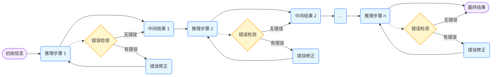

# 多步骤推理任务中的错误传播控制与修正策略

> 关键词：多步骤推理任务、错误传播控制、错误修正策略、推理准确性、不确定性管理

> 摘要：本文聚焦于多步骤推理任务中的错误传播控制与修正策略。在多步骤推理过程中，错误传播可能导致最终结果的巨大偏差，因此有效控制和修正错误至关重要。文章首先介绍了多步骤推理任务的背景，包括目的、预期读者等信息。接着阐述了核心概念及联系，详细讲解了核心算法原理和具体操作步骤，给出了相应的数学模型和公式，并通过举例进行说明。通过项目实战，展示了代码的实际案例及详细解释。分析了实际应用场景，推荐了相关的工具和资源。最后对未来发展趋势与挑战进行了总结，还提供了常见问题与解答以及扩展阅读和参考资料，旨在为解决多步骤推理任务中的错误问题提供全面且深入的指导。

## 1. 背景介绍 
### 1.1 目的和范围
多步骤推理任务在许多领域都有广泛应用，如自然语言处理中的文本生成、问答系统，计算机视觉中的目标跟踪、场景理解，以及人工智能中的规划和决策等。然而，在这些任务中，每一步推理都可能引入错误，并且这些错误会随着推理步骤的增加而不断传播和累积，最终严重影响整个推理过程的准确性和可靠性。

本文的目的在于深入研究多步骤推理任务中错误传播的机制，探讨有效的控制和修正策略，以提高推理的准确性和稳定性。我们将涵盖多种类型的多步骤推理任务，包括基于规则的推理、机器学习模型的序列推理等，分析不同任务中错误传播的特点，并提出相应的解决方案。

### 1.2 预期读者
本文的预期读者包括人工智能领域的研究人员、开发者，以及对多步骤推理任务感兴趣的技术爱好者。对于研究人员，本文可以为他们在错误传播理论和算法设计方面提供新的思路和研究方向；对于开发者，本文将介绍实用的错误控制和修正策略，帮助他们在实际项目中提高推理系统的性能；对于技术爱好者，本文可以帮助他们深入理解多步骤推理任务的复杂性和挑战。

### 1.3 文档结构概述
本文将按照以下结构进行组织：
- 核心概念与联系：介绍多步骤推理任务、错误传播和错误修正的核心概念，以及它们之间的联系，并通过示意图和流程图进行直观展示。
- 核心算法原理 & 具体操作步骤：详细讲解控制和修正错误传播的核心算法原理，使用 Python 代码进行阐述，并给出具体的操作步骤。
- 数学模型和公式 & 详细讲解 & 举例说明：建立错误传播和修正的数学模型，给出相关公式，并通过具体例子进行详细讲解。
- 项目实战：通过一个实际的多步骤推理项目，展示代码的实现和详细解释，包括开发环境搭建、源代码实现和代码解读。
- 实际应用场景：分析多步骤推理任务中错误传播控制与修正策略的实际应用场景。
- 工具和资源推荐：推荐相关的学习资源、开发工具和框架，以及经典论文和最新研究成果。
- 总结：对未来发展趋势与挑战进行总结。
- 附录：提供常见问题与解答。
- 扩展阅读 & 参考资料：列出相关的扩展阅读材料和参考资料。

### 1.4 术语表
#### 1.4.1 核心术语定义
- **多步骤推理任务**：指需要通过多个连续的推理步骤才能得出最终结果的任务。每个步骤的推理结果会作为下一个步骤的输入，形成一个推理链。
- **错误传播**：在多步骤推理过程中，某一步骤引入的错误会影响后续步骤的推理结果，导致错误随着推理链不断累积和扩散的现象。
- **错误修正策略**：为了减少或消除错误传播的影响，采取的一系列方法和技术，包括对错误的检测、定位和纠正。
- **推理准确性**：指推理结果与真实结果的接近程度，是衡量多步骤推理任务性能的重要指标。
- **不确定性管理**：在推理过程中，对由于数据不完整、噪声等因素导致的不确定性进行处理和控制的过程。

#### 1.4.2 相关概念解释
- **推理链**：多步骤推理任务中各个推理步骤按照先后顺序组成的链条。每个节点代表一个推理步骤，边表示推理步骤之间的依赖关系。
- **错误累积**：错误传播过程中，随着推理步骤的增加，错误的影响不断累加，导致最终结果的误差越来越大的现象。
- **回溯修正**：一种错误修正策略，当发现推理结果出现错误时，回溯到之前的某个推理步骤，重新进行推理，以修正错误。
- **置信度**：表示对推理结果的信任程度，通常用概率或数值来表示。在错误控制和修正中，可以根据置信度来判断推理结果的可靠性。

#### 1.4.3 缩略词列表
- **NLP**：Natural Language Processing，自然语言处理
- **CV**：Computer Vision，计算机视觉
- **ML**：Machine Learning，机器学习

## 2. 核心概念与联系 

### 核心概念原理
多步骤推理任务的核心在于通过一系列有序的推理步骤，从初始信息逐步推导出最终结果。每个推理步骤都基于一定的规则或模型，对输入信息进行处理，产生新的输出信息。然而，由于各种原因，如数据噪声、模型误差、规则不完善等，每个步骤都可能引入错误。

错误传播是指这些错误在推理链中不断传递和放大的过程。例如，在一个三步推理任务中，第一步推理引入了一个小的错误，这个错误会影响第二步的输入，导致第二步的推理结果也出现偏差，而第二步的偏差又会进一步影响第三步的推理，最终使得最终结果与真实结果产生较大的差异。

错误修正策略的目的是在错误传播过程中进行干预，减少或消除错误的影响。常见的错误修正策略包括实时监测推理结果的置信度，当置信度低于某个阈值时，进行错误检测和定位，然后采取相应的修正措施，如回溯修正、重新推理等。

### 架构的文本示意图
```plaintext
初始信息 -> 推理步骤 1 -> 中间结果 1 -> 推理步骤 2 -> 中间结果 2 ->... -> 推理步骤 n -> 最终结果
               |                      |                          |
               | 可能引入错误         | 错误传播                 | 错误累积
               v                      v                          v
            错误检测                 错误检测                 错误检测
               |                      |                          |
               v                      v                          v
            错误修正                 错误修正                 错误修正
```

### Mermaid 流程图


## 3. 核心算法原理 & 具体操作步骤 

### 核心算法原理
我们可以采用一种基于置信度的错误控制和修正算法。该算法的核心思想是在每个推理步骤中，计算推理结果的置信度，并根据置信度来判断是否需要进行错误检测和修正。

具体来说，在每个推理步骤中，我们使用一个置信度计算函数 $C(x)$ 来计算推理结果 $x$ 的置信度。如果置信度 $C(x)$ 低于一个预设的阈值 $\theta$，则认为该推理结果可能存在错误，需要进行错误检测和修正。

错误检测可以通过多种方式进行，例如比较当前推理结果与历史推理结果的一致性，或者使用一个独立的验证模型来验证推理结果的正确性。一旦检测到错误，我们可以采用回溯修正策略，回溯到之前的某个推理步骤，重新进行推理，直到得到一个置信度高于阈值的结果。

### 具体操作步骤
1. **初始化**：设置置信度阈值 $\theta$，初始化推理链，将初始信息作为第一个推理步骤的输入。
2. **推理步骤循环**：
    - 执行当前推理步骤，得到推理结果 $x$。
    - 计算推理结果 $x$ 的置信度 $C(x)$。
    - 如果 $C(x) < \theta$，则进行错误检测：
        - 采用合适的错误检测方法，判断推理结果是否错误。
        - 如果检测到错误，采用回溯修正策略，回溯到之前的某个推理步骤，重新进行推理。
    - 如果 $C(x) \geq \theta$，则将推理结果作为下一个推理步骤的输入，继续进行推理。
3. **终止条件**：当完成所有推理步骤，得到最终结果时，结束推理过程。

### Python 源代码实现
```python
# 模拟推理步骤的函数
def inference_step(input_data, model):
    # 这里简单模拟推理过程，实际应用中需要根据具体模型实现
    output = model.predict(input_data)
    return output

# 模拟置信度计算函数
def calculate_confidence(result):
    # 这里简单模拟置信度计算，实际应用中需要根据具体情况实现
    confidence = 0.8  # 假设初始置信度为 0.8
    # 可以根据结果的特征等因素调整置信度
    return confidence

# 错误检测函数
def error_detection(result):
    # 这里简单模拟错误检测，实际应用中需要根据具体情况实现
    # 例如，可以比较结果与历史结果的差异
    return False  # 假设没有错误

# 回溯修正函数
def backtrack_correction(step_index, input_data, model):
    # 回溯到指定步骤，重新进行推理
    new_result = inference_step(input_data, model)
    return new_result

# 主推理函数
def multi_step_inference(initial_data, models, confidence_threshold=0.7):
    current_input = initial_data
    for i, model in enumerate(models):
        result = inference_step(current_input, model)
        confidence = calculate_confidence(result)
        while confidence < confidence_threshold:
            if error_detection(result):
                # 进行回溯修正
                if i > 0:
                    # 回溯到上一步
                    new_input = initial_data if i == 1 else previous_result
                    result = backtrack_correction(i - 1, new_input, models[i - 1])
                else:
                    # 如果是第一步，可能需要重新获取初始数据等操作
                    print("Error in the first step, need further handling.")
                    break
            confidence = calculate_confidence(result)
        current_input = result
        previous_result = result
    return current_input

# 示例使用
initial_data = [1, 2, 3]
models = [lambda x: [i * 2 for i in x], lambda x: [i + 1 for i in x]]
final_result = multi_step_inference(initial_data, models)
print("Final result:", final_result)
```

## 4. 数学模型和公式 & 详细讲解 & 举例说明 

### 数学模型
设多步骤推理任务的推理链包含 $n$ 个推理步骤，第 $i$ 个推理步骤的输入为 $x_{i - 1}$，输出为 $x_i$，推理函数为 $f_i$，则有：
$$x_i = f_i(x_{i - 1}), \quad i = 1, 2, \cdots, n$$

每个推理结果 $x_i$ 都有一个对应的置信度 $C(x_i)$，置信度计算函数为 $C$。我们可以将置信度看作是推理结果正确的概率。

当 $C(x_i) < \theta$ 时，需要进行错误检测和修正。假设错误检测函数为 $E(x_i)$，如果 $E(x_i) = 1$，表示检测到错误；如果 $E(x_i) = 0$，表示没有检测到错误。

回溯修正可以表示为回到第 $j$ 个推理步骤（$j < i$），重新计算推理结果：
$$x_i' = f_i(f_{i - 1}(\cdots f_{j + 1}(x_j') \cdots))$$

### 详细讲解
- **推理函数 $f_i$**：表示第 $i$ 个推理步骤的具体操作，可以是基于规则的推理，也可以是机器学习模型的预测。
- **置信度计算函数 $C$**：根据推理结果的特征、历史数据等因素计算置信度。例如，可以使用概率模型来计算推理结果的概率，将其作为置信度。
- **错误检测函数 $E$**：可以采用多种方法实现，如比较当前推理结果与历史结果的差异，或者使用一个独立的验证模型来验证推理结果的正确性。
- **回溯修正**：当检测到错误时，回溯到之前的某个推理步骤，重新进行推理，以修正错误。

### 举例说明
假设我们有一个简单的多步骤推理任务，包括两个推理步骤：
- 第一步：将输入数据乘以 2。
- 第二步：将第一步的结果加 1。

设初始数据 $x_0 = 1$，推理函数分别为 $f_1(x) = 2x$ 和 $f_2(x) = x + 1$。

第一步推理：
$$x_1 = f_1(x_0) = 2 \times 1 = 2$$
假设置信度计算函数为 $C(x) = 0.9$（表示推理结果比较可靠），由于 $C(x_1) = 0.9 > \theta$（假设 $\theta = 0.7$），不需要进行错误检测和修正。

第二步推理：
$$x_2 = f_2(x_1) = 2 + 1 = 3$$
假设由于某种原因，第二步推理引入了错误，得到的结果为 $x_2' = 5$。此时，置信度计算函数计算得到 $C(x_2') = 0.3 < \theta$，需要进行错误检测。

假设错误检测函数检测到错误（$E(x_2') = 1$），则进行回溯修正，回到第一步，重新计算第一步的结果：
$$x_1' = f_1(x_0) = 2 \times 1 = 2$$
然后重新进行第二步推理：
$$x_2'' = f_2(x_1') = 2 + 1 = 3$$
再次计算置信度 $C(x_2'') = 0.9 > \theta$，推理过程继续进行。

## 5. 项目实战：代码实际案例和详细解释说明 

### 5.1  开发环境搭建
我们将使用 Python 语言进行开发，以下是所需的开发环境和库：
- **Python**：建议使用 Python 3.7 及以上版本。
- **NumPy**：用于数值计算。
- **Scikit-learn**：用于机器学习模型的构建和训练。

可以使用以下命令安装所需的库：
```sh
pip install numpy scikit-learn
```

### 5.2  源代码详细实现和代码解读
```python
import numpy as np
from sklearn.linear_model import LinearRegression

# 模拟推理步骤的函数
def inference_step(input_data, model):
    """
    执行推理步骤
    :param input_data: 输入数据
    :param model: 推理模型
    :return: 推理结果
    """
    input_data = np.array(input_data).reshape(-1, 1)
    output = model.predict(input_data)
    return output.flatten()

# 模拟置信度计算函数
def calculate_confidence(result):
    """
    计算推理结果的置信度
    :param result: 推理结果
    :return: 置信度
    """
    # 这里简单假设置信度与结果的方差有关
    variance = np.var(result)
    confidence = 1 / (1 + variance)
    return confidence

# 错误检测函数
def error_detection(result, previous_result=None):
    """
    错误检测函数
    :param result: 当前推理结果
    :param previous_result: 上一步推理结果
    :return: 是否检测到错误
    """
    if previous_result is not None:
        # 比较当前结果与上一步结果的差异
        diff = np.abs(result - previous_result)
        threshold = 0.5  # 差异阈值
        if np.max(diff) > threshold:
            return True
    return False

# 回溯修正函数
def backtrack_correction(step_index, input_data, models):
    """
    回溯修正函数
    :param step_index: 回溯到的步骤索引
    :param input_data: 输入数据
    :param models: 推理模型列表
    :return: 修正后的结果
    """
    new_result = input_data
    for i in range(step_index, len(models)):
        new_result = inference_step(new_result, models[i])
    return new_result

# 主推理函数
def multi_step_inference(initial_data, models, confidence_threshold=0.7):
    """
    多步骤推理函数
    :param initial_data: 初始数据
    :param models: 推理模型列表
    :param confidence_threshold: 置信度阈值
    :return: 最终推理结果
    """
    current_input = initial_data
    previous_result = None
    for i, model in enumerate(models):
        result = inference_step(current_input, model)
        confidence = calculate_confidence(result)
        while confidence < confidence_threshold:
            if error_detection(result, previous_result):
                # 进行回溯修正
                if i > 0:
                    # 回溯到上一步
                    new_input = initial_data if i == 1 else previous_result
                    result = backtrack_correction(i - 1, new_input, models)
                else:
                    # 如果是第一步，可能需要重新获取初始数据等操作
                    print("Error in the first step, need further handling.")
                    break
            confidence = calculate_confidence(result)
        current_input = result
        previous_result = result
    return current_input

# 示例数据和模型
initial_data = [1, 2, 3]
# 训练两个简单的线性回归模型
model1 = LinearRegression()
X1 = np.array([[1], [2], [3]])
y1 = np.array([2, 4, 6])
model1.fit(X1, y1)

model2 = LinearRegression()
X2 = np.array([[2], [4], [6]])
y2 = np.array([3, 5, 7])
model2.fit(X2, y2)

models = [model1, model2]

# 进行多步骤推理
final_result = multi_step_inference(initial_data, models)
print("Final result:", final_result)
```

### 5.3  代码解读与分析
- **推理步骤函数 `inference_step`**：该函数接受输入数据和推理模型作为参数，使用模型对输入数据进行预测，并返回推理结果。
- **置信度计算函数 `calculate_confidence`**：该函数根据推理结果的方差计算置信度，方差越小，置信度越高。
- **错误检测函数 `error_detection`**：该函数比较当前推理结果与上一步推理结果的差异，如果差异超过阈值，则认为检测到错误。
- **回溯修正函数 `backtrack_correction`**：该函数回溯到指定步骤，重新进行推理，直到得到修正后的结果。
- **主推理函数 `multi_step_inference`**：该函数实现了多步骤推理的主逻辑，在每个推理步骤中，计算推理结果的置信度，并根据置信度进行错误检测和修正。

通过这个项目实战，我们可以看到如何在实际代码中实现多步骤推理任务的错误传播控制和修正策略。

## 6. 实际应用场景 
### 自然语言处理
在自然语言处理中的文本生成任务中，例如机器翻译、对话系统等，通常需要进行多个步骤的推理。在机器翻译中，首先需要对源语言文本进行分词、词性标注、句法分析等预处理步骤，然后根据这些分析结果进行翻译生成。每个步骤都可能引入错误，例如分词错误可能导致后续的词性标注和句法分析错误，进而影响最终的翻译结果。通过错误传播控制和修正策略，可以提高翻译的准确性和流畅性。

在对话系统中，系统需要根据用户的输入进行意图识别、实体提取、知识推理等多个步骤，以生成合适的回复。错误的意图识别可能导致错误的回复，通过实时监测和修正推理过程中的错误，可以提高对话系统的交互质量。

### 计算机视觉
在计算机视觉中的目标跟踪任务中，需要在连续的视频帧中跟踪目标的位置。每个帧的目标检测和跟踪结果会作为下一个帧的输入，形成一个多步骤推理过程。由于光照变化、目标遮挡等因素，每个帧的检测和跟踪结果可能存在错误，这些错误会随着帧的推进不断传播，导致目标跟踪失败。通过错误传播控制和修正策略，可以及时发现和纠正跟踪过程中的错误，提高目标跟踪的稳定性和准确性。

在场景理解任务中，需要对图像或视频中的场景进行分类、物体识别、语义分析等多个步骤的推理。错误的物体识别可能导致对场景的错误理解，通过有效的错误控制和修正策略，可以提高场景理解的准确性。

### 人工智能规划和决策
在人工智能规划和决策任务中，例如机器人路径规划、智能交通系统的调度等，需要进行多个步骤的推理和决策。在机器人路径规划中，机器人需要根据当前的环境信息、目标位置等因素，逐步规划出一条最优路径。每个步骤的规划结果会影响后续的决策，如果某个步骤的规划出现错误，可能导致机器人陷入困境或无法到达目标位置。通过错误传播控制和修正策略，可以及时调整规划和决策，提高机器人的自主性和适应性。

在智能交通系统的调度中，需要根据交通流量、车辆位置等信息，对交通信号灯、车辆行驶路线等进行调度。每个调度决策都会影响后续的交通状况，如果某个决策出现错误，可能导致交通拥堵加剧。通过错误控制和修正策略，可以优化交通调度，提高交通效率。

## 7. 工具和资源推荐
### 7.1 学习资源推荐
#### 7.1.1 书籍推荐
- 《人工智能：一种现代的方法》（Artificial Intelligence: A Modern Approach）：这是一本经典的人工智能教材，涵盖了人工智能的各个领域，包括多步骤推理、错误处理等内容，对理解多步骤推理任务的基本原理和方法有很大帮助。
- 《自然语言处理入门》：介绍了自然语言处理的基本概念和方法，对于理解自然语言处理中的多步骤推理任务有很好的指导作用。
- 《计算机视觉：算法与应用》：详细介绍了计算机视觉的各种算法和应用，包括目标跟踪、场景理解等多步骤推理任务的相关内容。

#### 7.1.2 在线课程
- Coursera 上的“人工智能基础”课程：由知名高校的教授授课，系统地介绍了人工智能的基本概念和方法，包括多步骤推理的相关知识。
- edX 上的“自然语言处理”课程：深入讲解了自然语言处理的技术和应用，对于理解自然语言处理中的错误传播和修正有很大帮助。
- Udemy 上的“计算机视觉实战”课程：通过实际项目案例，介绍了计算机视觉中的各种算法和技术，包括目标跟踪和场景理解的多步骤推理任务。

#### 7.1.3 技术博客和网站
- Medium 上的人工智能相关博客：有许多专业的人工智能博主分享他们的研究成果和实践经验，对于了解多步骤推理任务的最新进展有很大帮助。
- arXiv 网站：是一个预印本数据库，包含了大量的人工智能研究论文，其中有很多关于多步骤推理和错误处理的最新研究成果。
- 开源中国：提供了丰富的技术文章和开源项目，对于学习和实践多步骤推理任务的错误控制和修正策略有很大帮助。

### 7.2 开发工具框架推荐
#### 7.2.1 IDE和编辑器
- PyCharm：是一款专业的 Python 集成开发环境，提供了丰富的代码编辑、调试、版本控制等功能，对于开发多步骤推理任务的 Python 代码非常方便。
- Jupyter Notebook：是一个交互式的开发环境，适合进行数据探索、模型实验和代码演示，对于学习和实践多步骤推理任务的算法和代码非常有用。
- Visual Studio Code：是一款轻量级的代码编辑器，支持多种编程语言和插件，具有丰富的扩展功能，对于开发多步骤推理任务的代码也非常方便。

#### 7.2.2 调试和性能分析工具
- PDB：是 Python 自带的调试器，可以帮助开发者在代码中设置断点、单步执行、查看变量值等，对于调试多步骤推理任务的代码非常有用。
- cProfile：是 Python 自带的性能分析工具，可以帮助开发者分析代码的性能瓶颈，找出代码中耗时较长的部分，对于优化多步骤推理任务的代码性能非常有帮助。
- TensorBoard：是 TensorFlow 提供的可视化工具，可以帮助开发者可视化模型的训练过程、性能指标等，对于调试和优化深度学习模型在多步骤推理任务中的应用非常有用。

#### 7.2.3 相关框架和库
- TensorFlow：是一个开源的深度学习框架，提供了丰富的深度学习模型和工具，对于实现基于深度学习的多步骤推理任务非常方便。
- PyTorch：是另一个流行的深度学习框架，具有简洁的 API 和动态计算图的特点，对于快速开发和实验多步骤推理任务的深度学习模型非常有用。
- Scikit-learn：是一个开源的机器学习库，提供了各种机器学习算法和工具，对于实现基于传统机器学习的多步骤推理任务非常方便。

### 7.3 相关论文著作推荐
#### 7.3.1 经典论文
- “Probabilistic Reasoning in Intelligent Systems: Networks of Plausible Inference”：介绍了概率推理的基本原理和方法，对于理解多步骤推理任务中的不确定性管理和错误传播有重要意义。
- “A Mathematical Theory of Communication”：奠定了信息论的基础，对于理解推理过程中的信息传递和错误处理有很大帮助。
- “Learning Representations by Back-propagating Errors”：提出了反向传播算法，是深度学习领域的经典论文，对于理解基于深度学习的多步骤推理任务的训练和优化有重要作用。

#### 7.3.2 最新研究成果
- 关注 arXiv 上关于多步骤推理、错误传播控制和修正策略的最新论文，了解该领域的最新研究进展和技术趋势。
- 参加国际人工智能会议，如 AAAI、ICML、NeurIPS 等，阅读会议上发表的相关论文，获取最新的研究成果。

#### 7.3.3 应用案例分析
- 研究一些实际应用中的多步骤推理任务案例，如 AlphaGo 在围棋比赛中的多步骤决策过程，分析其错误控制和修正策略的应用。
- 参考一些开源项目中的多步骤推理任务实现，如开源的自然语言处理系统、计算机视觉算法库等，学习其中的错误处理和修正方法。

## 8. 总结：未来发展趋势与挑战
### 未来发展趋势
- **融合多模态信息**：未来的多步骤推理任务将越来越多地融合多模态信息，如文本、图像、音频等。通过综合利用不同模态的信息，可以提高推理的准确性和可靠性。例如，在智能客服系统中，结合用户的语音输入和文本聊天记录进行推理，可以更好地理解用户的意图。
- **强化学习与多步骤推理的结合**：强化学习可以在多步骤推理任务中学习最优的决策策略，通过与环境的交互不断优化推理过程。例如，在机器人路径规划中，强化学习可以帮助机器人在复杂环境中找到最优路径，同时有效地控制和修正推理过程中的错误。
- **可解释性推理**：随着人工智能在一些关键领域的应用越来越广泛，对推理过程的可解释性要求也越来越高。未来的多步骤推理系统需要能够提供清晰的解释，说明每个推理步骤的依据和决策过程，以便用户能够理解和信任推理结果。

### 挑战
- **不确定性管理**：多步骤推理任务中存在大量的不确定性，如数据的不完整性、噪声、模型的误差等。如何有效地管理这些不确定性，减少错误传播的影响，是一个亟待解决的问题。
- **计算资源和效率**：随着推理步骤的增加，计算复杂度也会呈指数级增长。如何在有限的计算资源下，高效地完成多步骤推理任务，同时保证错误控制和修正的效果，是一个巨大的挑战。
- **数据隐私和安全**：在多步骤推理任务中，往往需要处理大量的敏感数据。如何在保证推理准确性的同时，保护数据的隐私和安全，防止数据泄露和恶意攻击，是一个重要的挑战。

## 9. 附录：常见问题与解答
### 问题 1：如何选择合适的置信度阈值？
选择合适的置信度阈值需要根据具体的应用场景和任务要求进行调整。一般来说，可以通过实验的方法，在不同的阈值下进行测试，比较推理结果的准确性和召回率，选择一个能够平衡两者的阈值。例如，在对推理结果准确性要求较高的场景中，可以适当提高阈值；在对召回率要求较高的场景中，可以适当降低阈值。

### 问题 2：错误检测函数的实现方法有哪些？
错误检测函数的实现方法有很多种，常见的方法包括：
- **比较法**：比较当前推理结果与历史推理结果的差异，如果差异超过一定阈值，则认为检测到错误。
- **验证模型法**：使用一个独立的验证模型对推理结果进行验证，如果验证模型判断推理结果错误，则认为检测到错误。
- **统计分析法**：对推理结果进行统计分析，例如计算结果的方差、均值等统计量，如果统计量超出正常范围，则认为检测到错误。

### 问题 3：回溯修正策略是否会导致计算效率降低？
回溯修正策略在一定程度上会导致计算效率降低，因为需要重新进行部分推理步骤。但是，通过合理的设计和优化，可以减少回溯的次数和范围，从而降低对计算效率的影响。例如，可以采用增量推理的方法，只重新计算受影响的部分推理步骤，而不是整个推理链。

### 问题 4：如何处理多步骤推理任务中的实时性要求？
对于有实时性要求的多步骤推理任务，可以采用以下方法来处理：
- **并行计算**：利用多核处理器或分布式计算平台，并行执行多个推理步骤，提高推理速度。
- **近似推理**：采用近似推理算法，在保证一定推理准确性的前提下，降低计算复杂度，提高推理效率。
- **缓存机制**：对于一些经常使用的推理结果，可以采用缓存机制进行存储，避免重复计算，提高推理速度。

## 10. 扩展阅读 & 参考资料
### 扩展阅读
- 《深度学习》（Deep Learning）：深入介绍了深度学习的原理和方法，对于理解基于深度学习的多步骤推理任务有很大帮助。
- 《机器学习》（Machine Learning）：系统地介绍了机器学习的各种算法和技术，对于实现多步骤推理任务的机器学习模型有很好的指导作用。
- 《人工智能中的不确定性推理》：专门讨论了人工智能中不确定性推理的方法和技术，对于处理多步骤推理任务中的不确定性有重要参考价值。

### 参考资料
- 相关学术论文：在学术数据库（如 IEEE Xplore、ACM Digital Library 等）中搜索关于多步骤推理任务、错误传播控制和修正策略的论文，获取最新的研究成果和技术方法。
- 开源项目：参考一些开源的多步骤推理任务实现，如 Hugging Face 的 Transformers 库、OpenCV 的计算机视觉库等，学习其中的代码实现和技术细节。
- 官方文档：查阅相关工具和框架的官方文档，如 TensorFlow、PyTorch、Scikit-learn 等，了解其功能和使用方法。

作者：AI天才研究院/AI Genius Institute & 禅与计算机程序设计艺术 /Zen And The Art of Computer Programming