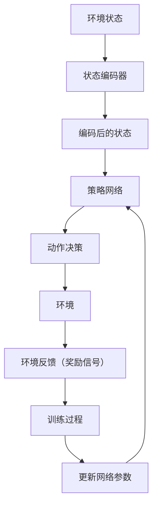

# 多步骤推理策略生成中神经规划器的突破

> 关键词：多步骤推理、神经规划器、策略生成、深度学习、人工智能

> 摘要：本文聚焦于多步骤推理策略生成中神经规划器的突破。详细介绍了神经规划器的核心概念、算法原理、数学模型，通过项目实战展示其代码实现和应用。探讨了神经规划器在多个实际场景中的应用，推荐了相关的学习资源、开发工具和论文著作。最后总结了神经规划器的未来发展趋势与挑战，并对常见问题进行了解答。旨在为读者全面深入地呈现神经规划器在多步骤推理策略生成领域的重要进展和应用价值。

## 1. 背景介绍 
### 1.1 目的和范围
多步骤推理策略生成在人工智能、机器人技术、自动化决策等众多领域具有至关重要的意义。神经规划器作为一种新兴的技术手段，旨在解决传统规划方法在处理复杂、动态环境时的局限性。本文的目的在于深入探讨神经规划器在多步骤推理策略生成方面的最新突破，涵盖其原理、算法、应用等多个层面，为相关领域的研究人员和开发者提供全面而深入的技术参考。

### 1.2 预期读者
本文预期读者包括人工智能、机器学习、计算机科学等领域的研究人员、工程师和学生，以及对智能规划和决策技术感兴趣的专业人士。对于希望了解神经规划器在多步骤推理中的应用和发展的读者，本文将提供有价值的信息和见解。

### 1.3 文档结构概述
本文将按照以下结构进行组织：首先介绍核心概念与联系，包括神经规划器的基本原理和架构；接着详细阐述核心算法原理和具体操作步骤，并使用 Python 源代码进行说明；然后介绍相关的数学模型和公式，并通过举例进行详细讲解；通过项目实战展示神经规划器的代码实际案例和详细解释；探讨神经规划器的实际应用场景；推荐相关的工具和资源；总结神经规划器的未来发展趋势与挑战；最后提供附录，解答常见问题，并列出扩展阅读和参考资料。

### 1.4 术语表
#### 1.4.1 核心术语定义
- **多步骤推理**：指在解决复杂问题时，需要通过多个连续的推理步骤来得出最终结论的过程。
- **神经规划器**：一种基于神经网络的规划算法，用于生成解决问题的策略。
- **策略生成**：根据给定的目标和环境信息，生成一系列动作或决策的过程。
- **深度学习**：一类基于人工神经网络的机器学习技术，通过多层神经网络自动学习数据的特征和模式。

#### 1.4.2 相关概念解释
- **强化学习**：一种机器学习范式，智能体通过与环境进行交互，根据环境反馈的奖励信号来学习最优策略。
- **搜索算法**：用于在状态空间中寻找最优解的算法，如 A* 算法、广度优先搜索等。
- **神经网络架构**：神经网络的结构和组织方式，如多层感知机、卷积神经网络、循环神经网络等。

#### 1.4.3 缩略词列表
- **DNN**：深度神经网络（Deep Neural Network）
- **RL**：强化学习（Reinforcement Learning）
- **MDP**：马尔可夫决策过程（Markov Decision Process）

## 2. 核心概念与联系 
### 2.1 神经规划器的基本原理
神经规划器的核心思想是利用神经网络的强大表示能力来学习复杂的规划策略。传统的规划方法通常基于符号推理和搜索算法，在处理大规模、复杂的环境时效率较低。而神经规划器通过学习环境的特征和状态，直接生成动作序列，避免了复杂的搜索过程。

神经规划器通常由两部分组成：一个是状态编码器，用于将环境的状态信息转换为神经网络可以处理的向量表示；另一个是策略网络，根据编码后的状态信息生成动作决策。在训练过程中，神经规划器通过与环境进行交互，根据环境反馈的奖励信号来调整网络参数，以学习最优的规划策略。

### 2.2 神经规划器与多步骤推理的联系
多步骤推理要求智能体能够在一系列连续的步骤中做出合理的决策，以达到最终的目标。神经规划器通过学习多步骤的规划策略，能够有效地解决多步骤推理问题。在多步骤推理中，神经规划器可以根据当前的状态信息预测未来的状态，并根据目标和奖励函数选择最优的动作序列。

### 2.3 核心概念的文本示意图
神经规划器的核心概念可以用以下文本示意图表示：

```plaintext
环境状态 -> 状态编码器 -> 编码后的状态 -> 策略网络 -> 动作决策
    |                                               |
    |                                               |
    V                                               V
环境反馈（奖励信号） -> 训练过程 -> 更新网络参数
```

### 2.4 Mermaid 流程图


## 3. 核心算法原理 & 具体操作步骤 
### 3.1 核心算法原理
神经规划器的核心算法通常基于强化学习。强化学习的目标是学习一个最优策略 $\pi(s)$，使得智能体在环境中获得最大的累积奖励。在多步骤推理策略生成中，我们可以将问题建模为一个马尔可夫决策过程（MDP），其中 $S$ 表示状态空间，$A$ 表示动作空间，$P(s'|s,a)$ 表示状态转移概率，$R(s,a)$ 表示奖励函数。

策略网络 $\pi_{\theta}(a|s)$ 是一个参数化的神经网络，其中 $\theta$ 是网络的参数。在每个时间步 $t$，智能体根据当前状态 $s_t$ 从策略网络中采样一个动作 $a_t$，并执行该动作。环境根据状态转移概率 $P(s_{t+1}|s_t,a_t)$ 转移到下一个状态 $s_{t+1}$，并给出奖励 $R(s_t,a_t)$。

训练过程的目标是最大化累积奖励的期望：
$$J(\theta) = \mathbb{E}_{\tau \sim \pi_{\theta}} \left[ \sum_{t=0}^{T} \gamma^t R(s_t,a_t) \right]$$
其中 $\tau = (s_0,a_0,s_1,a_1,\cdots,s_T,a_T)$ 是一个轨迹，$\gamma$ 是折扣因子，用于平衡短期和长期奖励。

为了最大化 $J(\theta)$，我们可以使用梯度上升算法，计算 $J(\theta)$ 关于 $\theta$ 的梯度：
$$\nabla_{\theta} J(\theta) = \mathbb{E}_{\tau \sim \pi_{\theta}} \left[ \sum_{t=0}^{T} \nabla_{\theta} \log \pi_{\theta}(a_t|s_t) \sum_{k=t}^{T} \gamma^{k-t} R(s_k,a_k) \right]$$

### 3.2 具体操作步骤
以下是使用 Python 和 PyTorch 实现神经规划器的具体操作步骤：

```python
import torch
import torch.nn as nn
import torch.optim as optim
import numpy as np

# 定义策略网络
class PolicyNetwork(nn.Module):
    def __init__(self, input_dim, output_dim):
        super(PolicyNetwork, self).__init__()
        self.fc1 = nn.Linear(input_dim, 64)
        self.fc2 = nn.Linear(64, output_dim)
        self.softmax = nn.Softmax(dim=-1)

    def forward(self, x):
        x = torch.relu(self.fc1(x))
        x = self.fc2(x)
        x = self.softmax(x)
        return x

# 定义环境
class Environment:
    def __init__(self):
        self.state_dim = 10
        self.action_dim = 4

    def reset(self):
        return np.random.randn(self.state_dim)

    def step(self, action):
        next_state = np.random.randn(self.state_dim)
        reward = np.random.randn()
        done = np.random.rand() < 0.1
        return next_state, reward, done

# 训练神经规划器
def train():
    env = Environment()
    input_dim = env.state_dim
    output_dim = env.action_dim
    policy_network = PolicyNetwork(input_dim, output_dim)
    optimizer = optim.Adam(policy_network.parameters(), lr=0.001)
    num_episodes = 1000
    gamma = 0.9

    for episode in range(num_episodes):
        state = env.reset()
        states = []
        actions = []
        rewards = []
        done = False

        while not done:
            state_tensor = torch.FloatTensor(state).unsqueeze(0)
            action_probs = policy_network(state_tensor)
            action = torch.multinomial(action_probs, 1).item()
            next_state, reward, done = env.step(action)

            states.append(state)
            actions.append(action)
            rewards.append(reward)

            state = next_state

        # 计算累积奖励
        discounted_rewards = []
        cumulative_reward = 0
        for reward in reversed(rewards):
            cumulative_reward = reward + gamma * cumulative_reward
            discounted_rewards.insert(0, cumulative_reward)

        discounted_rewards = torch.FloatTensor(discounted_rewards)
        discounted_rewards = (discounted_rewards - discounted_rewards.mean()) / (discounted_rewards.std() + 1e-9)

        # 计算损失
        states_tensor = torch.FloatTensor(states)
        actions_tensor = torch.LongTensor(actions)
        action_probs = policy_network(states_tensor)
        log_probs = torch.log(action_probs.gather(1, actions_tensor.unsqueeze(1)).squeeze(1))
        loss = -(log_probs * discounted_rewards).mean()

        # 更新网络参数
        optimizer.zero_grad()
        loss.backward()
        optimizer.step()

        if episode % 100 == 0:
            print(f"Episode {episode}: Loss = {loss.item()}")

if __name__ == "__main__":
    train()
```

### 3.3 代码解释
- **PolicyNetwork**：定义了一个简单的策略网络，由两个全连接层和一个 Softmax 层组成。
- **Environment**：定义了一个简单的环境，包含状态维度、动作维度、重置函数和步函数。
- **train**：训练神经规划器的主函数，通过与环境进行交互，收集轨迹数据，计算累积奖励和损失，并更新网络参数。

## 4. 数学模型和公式 & 详细讲解 & 举例说明 
### 4.1 马尔可夫决策过程（MDP）
马尔可夫决策过程是一个五元组 $(S,A,P,R,\gamma)$，其中：
- $S$ 是状态空间，表示环境的所有可能状态。
- $A$ 是动作空间，表示智能体可以执行的所有可能动作。
- $P(s'|s,a)$ 是状态转移概率，表示在状态 $s$ 执行动作 $a$ 后转移到状态 $s'$ 的概率。
- $R(s,a)$ 是奖励函数，表示在状态 $s$ 执行动作 $a$ 后获得的奖励。
- $\gamma$ 是折扣因子，用于平衡短期和长期奖励，取值范围为 $[0,1]$。

### 4.2 策略和价值函数
策略 $\pi(s)$ 是一个从状态空间 $S$ 到动作空间 $A$ 的映射，表示在状态 $s$ 下选择动作的概率分布。价值函数 $V^{\pi}(s)$ 表示在策略 $\pi$ 下从状态 $s$ 开始的期望累积奖励：
$$V^{\pi}(s) = \mathbb{E}_{\tau \sim \pi} \left[ \sum_{t=0}^{\infty} \gamma^t R(s_t,a_t) | s_0 = s \right]$$

动作价值函数 $Q^{\pi}(s,a)$ 表示在策略 $\pi$ 下从状态 $s$ 执行动作 $a$ 后开始的期望累积奖励：
$$Q^{\pi}(s,a) = \mathbb{E}_{\tau \sim \pi} \left[ \sum_{t=0}^{\infty} \gamma^t R(s_t,a_t) | s_0 = s, a_0 = a \right]$$

### 4.3 最优策略和最优价值函数
最优策略 $\pi^*$ 是使得价值函数 $V^{\pi}(s)$ 最大的策略，即：
$$\pi^* = \arg \max_{\pi} V^{\pi}(s)$$

最优价值函数 $V^*(s)$ 和最优动作价值函数 $Q^*(s,a)$ 分别为：
$$V^*(s) = \max_{\pi} V^{\pi}(s)$$
$$Q^*(s,a) = \max_{\pi} Q^{\pi}(s,a)$$

### 4.4 贝尔曼方程
贝尔曼方程描述了价值函数的递归关系。对于最优价值函数 $V^*(s)$，有：
$$V^*(s) = \max_{a \in A} \left[ R(s,a) + \gamma \sum_{s' \in S} P(s'|s,a) V^*(s') \right]$$

对于最优动作价值函数 $Q^*(s,a)$，有：
$$Q^*(s,a) = R(s,a) + \gamma \sum_{s' \in S} P(s'|s,a) \max_{a' \in A} Q^*(s',a')$$

### 4.5 举例说明
考虑一个简单的网格世界环境，智能体可以在一个 $3 \times 3$ 的网格中移动，目标是到达右上角的网格。状态 $s$ 表示智能体在网格中的位置，动作 $a$ 表示智能体的移动方向（上、下、左、右）。奖励函数 $R(s,a)$ 在到达目标时为 1，否则为 0。

假设折扣因子 $\gamma = 0.9$，我们可以使用贝尔曼方程来计算最优价值函数 $V^*(s)$。从目标状态开始，逐步迭代更新其他状态的价值函数，直到收敛。

## 5. 项目实战：代码实际案例和详细解释说明 
### 5.1  开发环境搭建
为了运行神经规划器的代码，我们需要搭建以下开发环境：
- **Python**：建议使用 Python 3.7 及以上版本。
- **PyTorch**：一个开源的深度学习框架，用于构建和训练神经网络。可以使用以下命令安装 PyTorch：
```bash
pip install torch torchvision
```

### 5.2  源代码详细实现和代码解读
以下是一个完整的神经规划器代码示例，用于解决一个简单的迷宫问题：

```python
import torch
import torch.nn as nn
import torch.optim as optim
import numpy as np
import random

# 定义迷宫环境
class MazeEnv:
    def __init__(self, maze_size):
        self.maze_size = maze_size
        self.maze = np.zeros((maze_size, maze_size))
        self.start = (0, 0)
        self.goal = (maze_size - 1, maze_size - 1)
        self.current_state = self.start
        self.actions = [(0, 1), (0, -1), (1, 0), (-1, 0)]  # 右、左、下、上

    def reset(self):
        self.current_state = self.start
        return self._state_to_array(self.current_state)

    def step(self, action):
        dx, dy = self.actions[action]
        x, y = self.current_state
        new_x = max(0, min(x + dx, self.maze_size - 1))
        new_y = max(0, min(y + dy, self.maze_size - 1))
        self.current_state = (new_x, new_y)
        done = self.current_state == self.goal
        reward = 1 if done else -0.1
        return self._state_to_array(self.current_state), reward, done

    def _state_to_array(self, state):
        x, y = state
        state_array = np.zeros((self.maze_size, self.maze_size))
        state_array[x, y] = 1
        return state_array.flatten()

# 定义策略网络
class PolicyNetwork(nn.Module):
    def __init__(self, input_dim, output_dim):
        super(PolicyNetwork, self).__init__()
        self.fc1 = nn.Linear(input_dim, 128)
        self.fc2 = nn.Linear(128, output_dim)
        self.softmax = nn.Softmax(dim=-1)

    def forward(self, x):
        x = torch.relu(self.fc1(x))
        x = self.fc2(x)
        x = self.softmax(x)
        return x

# 训练神经规划器
def train():
    maze_size = 5
    env = MazeEnv(maze_size)
    input_dim = maze_size * maze_size
    output_dim = 4
    policy_network = PolicyNetwork(input_dim, output_dim)
    optimizer = optim.Adam(policy_network.parameters(), lr=0.001)
    num_episodes = 1000
    gamma = 0.9

    for episode in range(num_episodes):
        state = env.reset()
        states = []
        actions = []
        rewards = []
        done = False

        while not done:
            state_tensor = torch.FloatTensor(state).unsqueeze(0)
            action_probs = policy_network(state_tensor)
            action = torch.multinomial(action_probs, 1).item()
            next_state, reward, done = env.step(action)

            states.append(state)
            actions.append(action)
            rewards.append(reward)

            state = next_state

        # 计算累积奖励
        discounted_rewards = []
        cumulative_reward = 0
        for reward in reversed(rewards):
            cumulative_reward = reward + gamma * cumulative_reward
            discounted_rewards.insert(0, cumulative_reward)

        discounted_rewards = torch.FloatTensor(discounted_rewards)
        discounted_rewards = (discounted_rewards - discounted_rewards.mean()) / (discounted_rewards.std() + 1e-9)

        # 计算损失
        states_tensor = torch.FloatTensor(states)
        actions_tensor = torch.LongTensor(actions)
        action_probs = policy_network(states_tensor)
        log_probs = torch.log(action_probs.gather(1, actions_tensor.unsqueeze(1)).squeeze(1))
        loss = -(log_probs * discounted_rewards).mean()

        # 更新网络参数
        optimizer.zero_grad()
        loss.backward()
        optimizer.step()

        if episode % 100 == 0:
            print(f"Episode {episode}: Loss = {loss.item()}")

if __name__ == "__main__":
    train()
```

### 5.3  代码解读与分析
- **MazeEnv**：定义了一个迷宫环境，包含迷宫的大小、起点、终点、动作空间等信息。`reset` 函数用于重置环境，`step` 函数用于执行动作并返回下一个状态、奖励和是否完成的信息。
- **PolicyNetwork**：定义了一个策略网络，用于根据当前状态生成动作概率分布。
- **train**：训练神经规划器的主函数，通过与迷宫环境进行交互，收集轨迹数据，计算累积奖励和损失，并更新网络参数。

## 6. 实际应用场景 
### 6.1 机器人路径规划
在机器人领域，神经规划器可以用于解决机器人的路径规划问题。机器人需要在复杂的环境中找到一条从起点到终点的最优路径，同时避免障碍物。神经规划器可以学习环境的特征和机器人的运动模型，生成高效的路径规划策略。

### 6.2 游戏策略生成
在游戏领域，神经规划器可以用于生成游戏策略。例如，在棋类游戏中，神经规划器可以学习游戏规则和对手的策略，生成最优的落子策略。在实时策略游戏中，神经规划器可以根据游戏状态和目标，生成资源管理、部队调度等策略。

### 6.3 自动化决策系统
在自动化决策系统中，神经规划器可以用于处理复杂的决策问题。例如，在交通管理中，神经规划器可以根据交通流量、路况等信息，生成最优的交通调度策略。在金融投资中，神经规划器可以根据市场行情、风险偏好等信息，生成投资组合策略。

### 6.4 智能客服
在智能客服领域，神经规划器可以用于处理用户的复杂问题。例如，当用户提出一个需要多步骤解答的问题时，神经规划器可以根据问题的语义和知识库，生成一系列的回答步骤，逐步引导用户解决问题。

## 7. 工具和资源推荐
### 7.1 学习资源推荐
#### 7.1.1 书籍推荐
- 《深度学习》（Deep Learning）：由 Ian Goodfellow、Yoshua Bengio 和 Aaron Courville 编写，是深度学习领域的经典教材，涵盖了神经网络、卷积神经网络、循环神经网络等多个方面的内容。
- 《强化学习：原理与Python实现》（Reinforcement Learning: An Introduction）：由 Richard S. Sutton 和 Andrew G. Barto 编写，是强化学习领域的经典教材，详细介绍了强化学习的基本概念、算法和应用。
- 《Python深度学习》（Deep Learning with Python）：由 Francois Chollet 编写，通过大量的代码示例和实际案例，介绍了如何使用 Python 和 Keras 进行深度学习开发。

#### 7.1.2 在线课程
- Coursera 上的“深度学习专项课程”（Deep Learning Specialization）：由 Andrew Ng 教授授课，涵盖了深度学习的基础知识、卷积神经网络、循环神经网络、强化学习等多个方面的内容。
- edX 上的“强化学习基础”（Foundations of Reinforcement Learning）：由 Pieter Abbeel 教授授课，介绍了强化学习的基本概念、算法和应用。
- 哔哩哔哩上的“李宏毅机器学习课程”：由李宏毅教授授课，课程内容生动有趣，涵盖了机器学习、深度学习、强化学习等多个方面的内容。

#### 7.1.3 技术博客和网站
- Medium：一个技术博客平台，上面有很多关于深度学习、强化学习、神经规划器等领域的优秀文章。
- arXiv：一个预印本网站，上面有很多最新的学术论文，涵盖了人工智能、机器学习等多个领域。
- OpenAI Blog：OpenAI 官方博客，上面有很多关于人工智能技术的最新进展和应用案例。

### 7.2 开发工具框架推荐
#### 7.2.1 IDE和编辑器
- PyCharm：一个专业的 Python 集成开发环境，提供了代码编辑、调试、版本控制等功能。
- Jupyter Notebook：一个交互式的笔记本环境，适合进行数据探索、模型训练和结果展示。
- Visual Studio Code：一个轻量级的代码编辑器，支持多种编程语言和插件扩展。

#### 7.2.2 调试和性能分析工具
- TensorBoard：一个用于可视化深度学习模型训练过程的工具，可以查看损失曲线、准确率曲线、模型结构等信息。
- PyTorch Profiler：一个用于分析 PyTorch 模型性能的工具，可以查看模型的计算时间、内存使用情况等信息。
- NVIDIA Nsight Systems：一个用于分析 GPU 性能的工具，可以查看 GPU 的利用率、内存带宽等信息。

#### 7.2.3 相关框架和库
- PyTorch：一个开源的深度学习框架，提供了丰富的神经网络层和优化算法，支持 GPU 加速。
- TensorFlow：一个开源的深度学习框架，由 Google 开发，提供了高级的深度学习 API 和分布式训练功能。
- Stable Baselines3：一个基于 PyTorch 的强化学习库，提供了多种强化学习算法的实现，如 A2C、PPO、DQN 等。

### 7.3 相关论文著作推荐
#### 7.3.1 经典论文
- “Playing Atari with Deep Reinforcement Learning”：介绍了使用深度强化学习解决 Atari 游戏问题的方法，开创了深度强化学习在游戏领域的应用。
- “Asynchronous Methods for Deep Reinforcement Learning”：提出了异步优势演员 - 评论家（A3C）算法，提高了深度强化学习的训练效率。
- “Proximal Policy Optimization Algorithms”：提出了近端策略优化（PPO）算法，是一种高效的无模型强化学习算法。

#### 7.3.2 最新研究成果
- “Mastering Atari, Go, Chess and Shogi by Planning with a Learned Model”：介绍了使用学习模型进行规划的方法，在 Atari 游戏、围棋、国际象棋和将棋等领域取得了优异的成绩。
- “Neural Network Planning for Efficient Multi-Step Reasoning”：提出了一种基于神经网络的规划方法，用于解决多步骤推理问题。
- “Learning to Plan in Semantic Memory for Robotic Manipulation”：介绍了使用语义记忆进行规划的方法，用于解决机器人操作问题。

#### 7.3.3 应用案例分析
- “Deep Reinforcement Learning for Autonomous Driving”：介绍了深度强化学习在自动驾驶领域的应用，包括路径规划、决策控制等方面。
- “Reinforcement Learning in Healthcare: A Survey”：介绍了强化学习在医疗保健领域的应用，包括疾病诊断、治疗方案选择等方面。
- “Applying Deep Reinforcement Learning to Stock Trading”：介绍了深度强化学习在股票交易领域的应用，包括交易策略生成、风险控制等方面。

## 8. 总结：未来发展趋势与挑战
### 8.1 未来发展趋势
- **结合符号推理和神经网络**：将符号推理的逻辑表达能力和神经网络的强大学习能力相结合，开发更加高效、可解释的神经规划器。
- **多智能体协作规划**：研究多个智能体之间的协作规划问题，提高智能体在复杂环境中的协同工作能力。
- **迁移学习和元学习**：利用迁移学习和元学习技术，使神经规划器能够快速适应新的环境和任务。
- **与物理世界的交互**：将神经规划器应用于机器人、自动驾驶等领域，实现与物理世界的高效交互。

### 8.2 挑战
- **可解释性问题**：神经网络的黑盒特性使得神经规划器的决策过程难以解释，需要研究可解释的神经网络模型和规划算法。
- **数据效率问题**：神经规划器通常需要大量的数据进行训练，如何提高数据效率是一个亟待解决的问题。
- **环境适应性问题**：在复杂、动态的环境中，神经规划器的性能可能会受到影响，需要研究具有更强环境适应性的规划算法。
- **计算资源问题**：神经规划器的训练和推理过程通常需要大量的计算资源，如何优化算法和模型结构，降低计算成本是一个重要的挑战。

## 9. 附录：常见问题与解答
### 9.1 神经规划器与传统规划方法有什么区别？
传统规划方法通常基于符号推理和搜索算法，在处理大规模、复杂的环境时效率较低。而神经规划器利用神经网络的强大表示能力来学习复杂的规划策略，避免了复杂的搜索过程，具有更高的效率和灵活性。

### 9.2 神经规划器的训练过程需要多长时间？
神经规划器的训练时间取决于多个因素，如环境的复杂度、神经网络的规模、训练数据的数量等。一般来说，训练时间可能从几小时到几天甚至更长。

### 9.3 如何评估神经规划器的性能？
可以使用多种指标来评估神经规划器的性能，如累积奖励、成功率、规划时间等。在实际应用中，需要根据具体的任务和需求选择合适的评估指标。

### 9.4 神经规划器可以应用于哪些领域？
神经规划器可以应用于机器人路径规划、游戏策略生成、自动化决策系统、智能客服等多个领域。

## 10. 扩展阅读 & 参考资料
- Silver, D., Huang, A., Maddison, C. J., Guez, A., Sifre, L., van den Driessche, G.,... & Dieleman, S. (2016). Mastering the game of Go with deep neural networks and tree search. nature, 529(7587), 484-489.
- Mnih, V., Kavukcuoglu, K., Silver, D., Rusu, A. A., Veness, J., Bellemare, M. G.,... & Petersen, S. (2015). Human-level control through deep reinforcement learning. nature, 518(7540), 529-533.
- Schulman, J., Wolski, F., Dhariwal, P., Radford, A., & Klimov, O. (2017). Proximal policy optimization algorithms. arXiv preprint arXiv:1707.06347.

作者：AI天才研究院/AI Genius Institute & 禅与计算机程序设计艺术 /Zen And The Art of Computer Programming