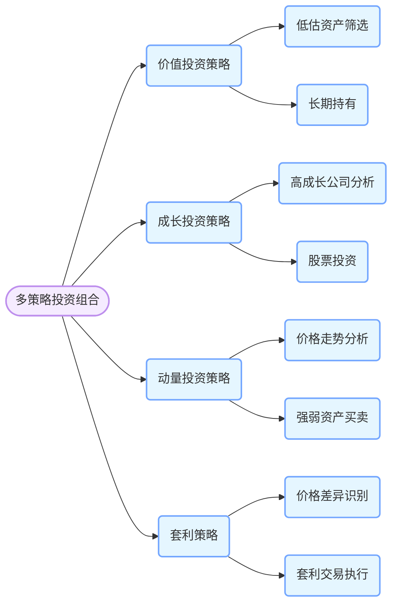

# 多策略投资组合：综合运用不同投资方法

> 关键词：多策略投资组合、投资方法、资产配置、风险管理、收益优化

> 摘要：本文围绕多策略投资组合展开，详细阐述了综合运用不同投资方法构建投资组合的相关内容。首先介绍了多策略投资组合的背景，包括目的、预期读者、文档结构和术语表。接着深入探讨了核心概念、算法原理、数学模型等理论知识，并通过 Python 代码进行算法实现示例。然后通过项目实战，展示了开发环境搭建、源代码实现及解读。还分析了多策略投资组合的实际应用场景，推荐了学习资源、开发工具框架和相关论文著作。最后总结了未来发展趋势与挑战，提供了常见问题解答和扩展阅读参考资料，旨在帮助投资者全面了解并运用多策略投资组合进行有效的投资决策。

## 1. 背景介绍 
### 1.1 目的和范围
多策略投资组合的目的在于通过综合运用不同的投资方法，分散投资风险，提高投资组合的收益稳定性和回报率。在金融市场中，单一投资策略往往受限于市场环境和特定资产表现，而多策略投资组合可以利用不同策略在不同市场条件下的优势，实现资产的稳健增长。

本文的范围涵盖了多策略投资组合的核心概念、算法原理、数学模型、项目实战、实际应用场景等方面。旨在为投资者、金融从业者和相关研究人员提供全面的理论知识和实践指导，帮助他们理解和运用多策略投资组合进行有效的投资决策。

### 1.2 预期读者
本文的预期读者包括：
- **投资者**：希望通过综合运用不同投资方法优化投资组合，降低风险并提高收益的个人和机构投资者。
- **金融从业者**：如基金经理、投资顾问、分析师等，需要深入了解多策略投资组合的理论和实践，为客户提供专业的投资建议。
- **研究人员**：从事金融工程、投资学等领域研究的学者和学生，对多策略投资组合的理论和实证研究感兴趣。

### 1.3 文档结构概述
本文的结构如下：
- **核心概念与联系**：介绍多策略投资组合的核心概念，包括不同投资策略的分类和相互关系，并通过文本示意图和 Mermaid 流程图进行直观展示。
- **核心算法原理 & 具体操作步骤**：详细讲解多策略投资组合的核心算法原理，如均值 - 方差优化算法，并使用 Python 源代码进行具体实现。
- **数学模型和公式 & 详细讲解 & 举例说明**：阐述多策略投资组合的数学模型和相关公式，如马科维茨均值 - 方差模型，并通过具体例子进行详细说明。
- **项目实战：代码实际案例和详细解释说明**：通过一个实际的项目案例，展示多策略投资组合的开发环境搭建、源代码实现和代码解读。
- **实际应用场景**：分析多策略投资组合在不同金融市场和投资领域的实际应用场景。
- **工具和资源推荐**：推荐学习多策略投资组合的相关资源，包括书籍、在线课程、技术博客和网站，以及开发工具框架和相关论文著作。
- **总结：未来发展趋势与挑战**：总结多策略投资组合的未来发展趋势和面临的挑战。
- **附录：常见问题与解答**：提供多策略投资组合相关的常见问题及解答。
- **扩展阅读 & 参考资料**：列出扩展阅读的相关资料和参考文献。

### 1.4 术语表
#### 1.4.1 核心术语定义
- **多策略投资组合**：将多种不同的投资策略组合在一起，以实现投资目标的投资方式。
- **投资策略**：投资者根据市场情况和自身投资目标制定的投资方法和规则。
- **资产配置**：将资金分配到不同的资产类别中，如股票、债券、现金等，以实现风险分散和收益优化。
- **风险管理**：识别、评估和控制投资风险的过程，以确保投资组合的稳定性和安全性。
- **收益优化**：通过合理的资产配置和投资策略选择，最大化投资组合的预期收益。

#### 1.4.2 相关概念解释
- **均值 - 方差优化**：一种基于资产预期收益率和方差的资产配置方法，旨在在给定风险水平下最大化预期收益，或在给定预期收益下最小化风险。
- **夏普比率**：衡量投资组合每承担一单位风险所获得的超过无风险收益的额外收益的指标。
- **最大回撤**：在选定的时间段内，投资组合净值从最高点到最低点的最大跌幅，反映了投资组合的最大潜在损失。

#### 1.4.3 缩略词列表
- **MPT**：Modern Portfolio Theory，现代投资组合理论
- **CAPM**：Capital Asset Pricing Model，资本资产定价模型
- **ETF**：Exchange - Traded Fund，交易型开放式指数基金

## 2. 核心概念与联系 

### 核心概念原理
多策略投资组合的核心原理是通过综合运用不同的投资策略，实现风险分散和收益优化。不同的投资策略在不同的市场环境下表现各异，例如，价值投资策略在市场低估时可能表现较好，而成长投资策略在市场处于上升趋势时可能更具优势。通过将这些不同的策略组合在一起，可以降低单一策略的风险，提高投资组合的整体稳定性。

常见的投资策略包括：
- **价值投资策略**：寻找被市场低估的资产，通过长期持有获取资产价值回归的收益。
- **成长投资策略**：关注具有高成长潜力的公司，投资于其股票以分享公司成长带来的收益。
- **动量投资策略**：根据资产的历史价格走势，买入近期表现强势的资产，卖出表现弱势的资产。
- **套利策略**：利用不同市场或资产之间的价格差异，进行无风险或低风险的套利交易。

### 架构的文本示意图
```plaintext
多策略投资组合
|-- 价值投资策略
|   |-- 低估资产筛选
|   |-- 长期持有
|-- 成长投资策略
|   |-- 高成长公司分析
|   |-- 股票投资
|-- 动量投资策略
|   |-- 价格走势分析
|   |-- 强弱资产买卖
|-- 套利策略
|   |-- 价格差异识别
|   |-- 套利交易执行
```

### Mermaid 流程图


## 3. 核心算法原理 & 具体操作步骤 

### 均值 - 方差优化算法原理
均值 - 方差优化算法是现代投资组合理论（MPT）的核心算法，由哈里·马科维茨（Harry Markowitz）提出。该算法的目标是在给定风险水平下最大化预期收益，或在给定预期收益下最小化风险。

设投资组合中包含 $n$ 种资产，资产 $i$ 的预期收益率为 $\mu_i$，投资组合的权重向量为 $\mathbf{w} = [w_1, w_2, \cdots, w_n]^T$，其中 $\sum_{i = 1}^{n} w_i = 1$，资产收益率的协方差矩阵为 $\mathbf{\Sigma}$。投资组合的预期收益率 $\mu_p$ 和方差 $\sigma_p^2$ 分别为：

$$\mu_p = \mathbf{w}^T \boldsymbol{\mu}$$

$$\sigma_p^2 = \mathbf{w}^T \mathbf{\Sigma} \mathbf{w}$$

均值 - 方差优化问题可以表示为以下两种形式：

#### 最小方差优化
在给定预期收益率 $\mu_{target}$ 的条件下，最小化投资组合的方差：

$$\min_{\mathbf{w}} \mathbf{w}^T \mathbf{\Sigma} \mathbf{w}$$

$$\text{s.t. } \mathbf{w}^T \boldsymbol{\mu} = \mu_{target}$$

$$\sum_{i = 1}^{n} w_i = 1$$

#### 最大夏普比率优化
最大化投资组合的夏普比率，夏普比率定义为：

$$S_p = \frac{\mu_p - r_f}{\sigma_p}$$

其中 $r_f$ 为无风险收益率。

### Python 代码实现
```python
import numpy as np
import pandas as pd
from scipy.optimize import minimize

# 模拟资产预期收益率和协方差矩阵
n_assets = 3
np.random.seed(42)
mu = np.random.rand(n_assets)
Sigma = np.random.randn(n_assets, n_assets)
Sigma = np.dot(Sigma, Sigma.T)

# 最小方差优化目标函数
def min_variance(w, Sigma):
    return np.dot(w.T, np.dot(Sigma, w))

# 约束条件：权重之和为 1
constraints = ({'type': 'eq', 'fun': lambda w: np.sum(w) - 1})

# 权重范围
bounds = [(0, 1) for _ in range(n_assets)]

# 初始权重
initial_weights = np.ones(n_assets) / n_assets

# 最小方差优化
result = minimize(min_variance, initial_weights, args=(Sigma,), constraints=constraints, bounds=bounds)
optimal_weights = result.x

print("最小方差优化的最优权重:", optimal_weights)

# 最大夏普比率优化目标函数
def max_sharpe_ratio(w, mu, Sigma, r_f=0.02):
    mu_p = np.dot(w.T, mu)
    sigma_p = np.sqrt(np.dot(w.T, np.dot(Sigma, w)))
    sharpe_ratio = (mu_p - r_f) / sigma_p
    return -sharpe_ratio

# 最大夏普比率优化
result_sharpe = minimize(max_sharpe_ratio, initial_weights, args=(mu, Sigma), constraints=constraints, bounds=bounds)
optimal_weights_sharpe = result_sharpe.x

print("最大夏普比率优化的最优权重:", optimal_weights_sharpe)
```

### 具体操作步骤
1. **数据收集**：收集各种资产的历史收益率数据，用于计算预期收益率和协方差矩阵。
2. **参数估计**：根据历史数据估计资产的预期收益率和协方差矩阵。
3. **确定优化目标**：选择最小方差优化或最大夏普比率优化等目标。
4. **设置约束条件**：设置权重之和为 1 等约束条件。
5. **求解优化问题**：使用优化算法求解最优权重。
6. **构建投资组合**：根据最优权重构建投资组合。

## 4. 数学模型和公式 & 详细讲解 & 举例说明 

### 马科维茨均值 - 方差模型
马科维茨均值 - 方差模型是多策略投资组合的基础数学模型。该模型假设投资者是风险厌恶的，他们在选择投资组合时会考虑预期收益和风险两个因素。

#### 模型假设
- 投资者是理性的，追求预期收益最大化和风险最小化。
- 资产收益率服从正态分布。
- 投资者可以以无风险利率借入或贷出资金。

#### 模型公式
设投资组合中包含 $n$ 种资产，资产 $i$ 的预期收益率为 $\mu_i$，投资组合的权重向量为 $\mathbf{w} = [w_1, w_2, \cdots, w_n]^T$，其中 $\sum_{i = 1}^{n} w_i = 1$，资产收益率的协方差矩阵为 $\mathbf{\Sigma}$。投资组合的预期收益率 $\mu_p$ 和方差 $\sigma_p^2$ 分别为：

$$\mu_p = \mathbf{w}^T \boldsymbol{\mu}$$

$$\sigma_p^2 = \mathbf{w}^T \mathbf{\Sigma} \mathbf{w}$$

#### 详细讲解
- **预期收益率**：投资组合的预期收益率是各资产预期收益率的加权平均值，权重为各资产在投资组合中的比例。
- **方差**：投资组合的方差反映了投资组合的风险，它不仅与各资产的方差有关，还与资产之间的协方差有关。资产之间的协方差越小，投资组合的风险分散效果越好。

#### 举例说明
假设有两种资产 A 和 B，资产 A 的预期收益率为 0.1，方差为 0.04，资产 B 的预期收益率为 0.15，方差为 0.09，资产 A 和 B 的协方差为 0.01。设投资组合中资产 A 的权重为 $w_A$，资产 B 的权重为 $w_B = 1 - w_A$。

投资组合的预期收益率为：

$$\mu_p = w_A \times 0.1 + (1 - w_A) \times 0.15 = 0.15 - 0.05w_A$$

投资组合的方差为：

$$\sigma_p^2 = w_A^2 \times 0.04 + (1 - w_A)^2 \times 0.09 + 2w_A(1 - w_A) \times 0.01$$

假设我们希望投资组合的预期收益率为 0.12，则可以通过以下方程求解 $w_A$：

$$0.15 - 0.05w_A = 0.12$$

解得 $w_A = 0.6$，$w_B = 0.4$。

将 $w_A = 0.6$ 和 $w_B = 0.4$ 代入方差公式，可得投资组合的方差为：

$$\sigma_p^2 = 0.6^2 \times 0.04 + 0.4^2 \times 0.09 + 2 \times 0.6 \times 0.4 \times 0.01 = 0.0336$$


## 5. 项目实战：代码实际案例和详细解释说明 

### 5.1  开发环境搭建
为了实现多策略投资组合的项目实战，我们需要搭建以下开发环境：
- **Python 环境**：建议使用 Python 3.7 及以上版本。可以从 Python 官方网站（https://www.python.org/downloads/）下载并安装。
- **必要的 Python 库**：
    - **pandas**：用于数据处理和分析。
    - **numpy**：用于数值计算。
    - **scipy**：用于优化算法。
    - **matplotlib**：用于数据可视化。

可以使用以下命令安装这些库：
```bash
pip install pandas numpy scipy matplotlib
```

### 5.2  源代码详细实现和代码解读
以下是一个基于 Python 的多策略投资组合项目实战代码示例：

```python
import pandas as pd
import numpy as np
import matplotlib.pyplot as plt
from scipy.optimize import minimize

# 读取历史数据
data = pd.read_csv('historical_returns.csv', index_col=0)

# 计算资产的预期收益率和协方差矩阵
returns = data.pct_change().dropna()
mu = returns.mean()
Sigma = returns.cov()

# 最小方差优化目标函数
def min_variance(w, Sigma):
    return np.dot(w.T, np.dot(Sigma, w))

# 约束条件：权重之和为 1
constraints = ({'type': 'eq', 'fun': lambda w: np.sum(w) - 1})

# 权重范围
n_assets = len(mu)
bounds = [(0, 1) for _ in range(n_assets)]

# 初始权重
initial_weights = np.ones(n_assets) / n_assets

# 最小方差优化
result = minimize(min_variance, initial_weights, args=(Sigma,), constraints=constraints, bounds=bounds)
optimal_weights = result.x

# 计算最优投资组合的预期收益率和方差
mu_p = np.dot(optimal_weights, mu)
sigma_p = np.sqrt(np.dot(optimal_weights.T, np.dot(Sigma, optimal_weights)))

print("最小方差优化的最优权重:", optimal_weights)
print("最优投资组合的预期收益率:", mu_p)
print("最优投资组合的标准差:", sigma_p)

# 绘制有效前沿
num_portfolios = 1000
portfolios = []
for _ in range(num_portfolios):
    weights = np.random.random(n_assets)
    weights /= np.sum(weights)
    mu_portfolio = np.dot(weights, mu)
    sigma_portfolio = np.sqrt(np.dot(weights.T, np.dot(Sigma, weights)))
    portfolios.append([mu_portfolio, sigma_portfolio, weights])

portfolios = np.array(portfolios)

plt.figure(figsize=(10, 6))
plt.scatter(portfolios[:, 1], portfolios[:, 0], c=portfolios[:, 0] / portfolios[:, 1], cmap='viridis')
plt.colorbar(label='Sharpe Ratio')
plt.scatter(sigma_p, mu_p, marker='*', color='r', s=200, label='Minimum Variance Portfolio')
plt.xlabel('Standard Deviation')
plt.ylabel('Expected Return')
plt.title('Efficient Frontier')
plt.legend()
plt.show()
```

### 代码解读与分析
1. **数据读取**：使用 `pandas` 库读取历史收益率数据文件 `historical_returns.csv`，并计算资产的日收益率。
2. **参数估计**：根据历史收益率数据计算资产的预期收益率和协方差矩阵。
3. **最小方差优化**：定义最小方差优化的目标函数和约束条件，使用 `scipy.optimize.minimize` 函数求解最优权重。
4. **计算最优投资组合的指标**：根据最优权重计算最优投资组合的预期收益率和标准差。
5. **绘制有效前沿**：随机生成 1000 个投资组合，计算它们的预期收益率和标准差，并绘制散点图。同时，将最小方差投资组合用红色星号标记出来。

通过这个项目实战，我们可以直观地看到多策略投资组合的优化过程和效果，以及如何通过有效前沿来选择最优投资组合。

## 6. 实际应用场景 
多策略投资组合在金融市场中有广泛的实际应用场景，以下是一些常见的场景：

### 基金投资
基金公司可以采用多策略投资组合的方法，将不同类型的基金（如股票型基金、债券型基金、混合型基金等）组合在一起，以满足不同投资者的风险偏好和收益目标。例如，对于风险偏好较低的投资者，基金公司可以构建一个以债券型基金为主，搭配少量股票型基金的投资组合；对于风险偏好较高的投资者，则可以增加股票型基金的比例。

### 资产配置
个人和机构投资者在进行资产配置时，可以运用多策略投资组合的思想，将资金分配到不同的资产类别中，如股票、债券、现金、房地产等。通过合理的资产配置，可以降低投资组合的风险，提高收益的稳定性。例如，在经济衰退时期，投资者可以增加债券和现金的比例，以抵御市场风险；在经济复苏时期，则可以增加股票的投资比例，以获取更高的收益。

### 量化投资
量化投资策略通常会综合运用多种技术指标和模型，构建多策略投资组合。例如，量化投资经理可以结合动量策略、价值策略和套利策略，通过计算机程序自动执行交易。这种方法可以提高投资决策的效率和准确性，减少人为因素的干扰。

### 风险管理
金融机构在进行风险管理时，可以使用多策略投资组合来降低风险敞口。例如，银行可以通过投资不同行业、不同地区的资产，构建一个多元化的投资组合，以分散信用风险和市场风险。同时，金融机构还可以运用套期保值策略，如期货、期权等衍生品，来对冲投资组合的风险。

## 7. 工具和资源推荐
### 7.1 学习资源推荐
#### 7.1.1 书籍推荐
- 《聪明的投资者》（The Intelligent Investor）：本杰明·格雷厄姆（Benjamin Graham）著，被誉为投资界的圣经，介绍了价值投资的基本原理和方法。
- 《漫步华尔街》（A Random Walk Down Wall Street）：伯顿·马尔基尔（Burton Malkiel）著，探讨了股票市场的有效性和投资策略，对投资者有很大的启发。
- 《金融市场与金融机构》（Financial Markets and Institutions）：弗雷德里克·米什金（Frederic Mishkin）著，系统介绍了金融市场和金融机构的基本知识和运行机制。

#### 7.1.2 在线课程
- Coursera 上的“投资学原理”（Principles of Investing）课程：由耶鲁大学教授陈志武主讲，介绍了投资学的基本概念、理论和方法。
- edX 上的“金融市场”（Financial Markets）课程：由耶鲁大学教授罗伯特·席勒（Robert Shiller）主讲，探讨了金融市场的运行机制和投资策略。

#### 7.1.3 技术博客和网站
- 雪球（https://xueqiu.com/）：国内知名的投资社区，提供股票、基金、债券等金融产品的行情、分析和讨论。
- Seeking Alpha（https://seekingalpha.com/）：全球知名的金融分析网站，提供专业的股票分析、投资策略和市场评论。

### 7.2 开发工具框架推荐
#### 7.2.1 IDE和编辑器
- PyCharm：一款专业的 Python 集成开发环境，提供代码编辑、调试、版本控制等功能。
- Jupyter Notebook：一种交互式的开发环境，适合进行数据分析和模型验证。

#### 7.2.2 调试和性能分析工具
- pdb：Python 内置的调试工具，可以帮助开发者定位和解决代码中的问题。
- cProfile：Python 标准库中的性能分析工具，可以分析代码的运行时间和函数调用次数。

#### 7.2.3 相关框架和库
- pandas：用于数据处理和分析的 Python 库，提供了高效的数据结构和数据分析工具。
- numpy：用于数值计算的 Python 库，提供了高效的数组操作和数学函数。
- scipy：用于科学计算和优化的 Python 库，提供了丰富的优化算法和数学模型。

### 7.3 相关论文著作推荐
#### 7.3.1 经典论文
- Markowitz, H. M. (1952). Portfolio Selection. The Journal of Finance, 7(1), 77 - 91. 这篇论文提出了现代投资组合理论（MPT），奠定了多策略投资组合的理论基础。
- Sharpe, W. F. (1964). Capital Asset Prices: A Theory of Market Equilibrium Under Conditions of Risk. The Journal of Finance, 19(3), 425 - 442. 这篇论文提出了资本资产定价模型（CAPM），为投资组合的风险和收益评估提供了重要的理论框架。

#### 7.3.2 最新研究成果
- 近年来，随着人工智能和机器学习技术的发展，越来越多的研究将这些技术应用于多策略投资组合的构建和优化。例如，使用深度学习模型预测资产收益率，使用强化学习算法进行投资决策等。可以关注相关领域的学术期刊，如《Journal of Financial Economics》《Review of Financial Studies》等，获取最新的研究成果。

#### 7.3.3 应用案例分析
- 许多金融机构和投资公司会发布多策略投资组合的应用案例分析报告，可以通过这些报告了解实际应用中的经验和教训。例如，桥水基金（Bridgewater Associates）的投资策略和业绩报告，对投资者有很大的参考价值。

## 8. 总结：未来发展趋势与挑战
### 未来发展趋势
- **智能化和自动化**：随着人工智能和机器学习技术的不断发展，多策略投资组合将越来越智能化和自动化。投资者可以利用算法模型自动分析市场数据、筛选投资标的和调整投资组合，提高投资决策的效率和准确性。
- **多元化和个性化**：投资者的需求越来越多元化和个性化，多策略投资组合将更加注重满足不同投资者的风险偏好、收益目标和投资期限。未来的投资组合将不仅仅局限于传统的资产类别，还将包括新兴资产，如数字货币、绿色能源等。
- **全球化和跨市场**：金融市场的全球化趋势日益明显，多策略投资组合将更加注重跨市场和跨地区的投资。投资者可以通过投资不同国家和地区的资产，进一步分散风险，提高收益。

### 挑战
- **数据质量和可靠性**：多策略投资组合的构建和优化依赖于大量的市场数据，数据的质量和可靠性直接影响投资决策的准确性。然而，市场数据往往存在噪声、缺失值和异常值等问题，如何处理这些问题是一个挑战。
- **模型的有效性和稳定性**：虽然人工智能和机器学习模型在多策略投资组合中具有很大的潜力，但这些模型的有效性和稳定性还需要进一步验证。模型可能存在过拟合、欠拟合等问题，如何选择合适的模型和参数是一个挑战。
- **监管和合规**：随着金融市场的发展和创新，监管机构对投资行业的监管也越来越严格。多策略投资组合需要遵守各种监管规定和合规要求，如何在合规的前提下实现投资目标是一个挑战。

## 9. 附录：常见问题与解答
### 问题 1：多策略投资组合一定能降低风险吗？
多策略投资组合通常可以降低风险，但并不能保证一定能降低风险。如果不同策略之间的相关性较高，或者市场出现极端情况，投资组合的风险可能仍然较高。因此，在构建多策略投资组合时，需要选择相关性较低的策略，并进行充分的风险评估和管理。

### 问题 2：如何选择适合自己的投资策略？
选择适合自己的投资策略需要考虑多个因素，如风险偏好、投资目标、投资期限等。一般来说，风险偏好较低的投资者可以选择价值投资、债券投资等稳健型策略；风险偏好较高的投资者可以选择成长投资、动量投资等激进型策略。同时，投资者还可以根据市场情况和自身经验进行适当的调整。

### 问题 3：多策略投资组合的构建需要哪些数据？
多策略投资组合的构建需要以下数据：
- 资产的历史收益率数据：用于计算资产的预期收益率和协方差矩阵。
- 宏观经济数据：如 GDP、通货膨胀率、利率等，用于分析市场环境和宏观经济趋势。
- 公司财务数据：如营业收入、净利润、资产负债表等，用于评估公司的基本面和投资价值。

### 问题 4：如何评估多策略投资组合的绩效？
评估多策略投资组合的绩效可以使用以下指标：
- 预期收益率：反映投资组合的平均收益水平。
- 标准差：反映投资组合的风险水平。
- 夏普比率：衡量投资组合每承担一单位风险所获得的超过无风险收益的额外收益。
- 最大回撤：反映投资组合在特定时间段内的最大损失。

## 10. 扩展阅读 & 参考资料
### 扩展阅读
- 《行为金融学》：探讨了投资者的心理和行为对金融市场的影响，对于理解多策略投资组合中的投资者行为有很大的帮助。
- 《量化投资：策略与技术》：介绍了量化投资的基本原理、方法和技术，对于构建多策略投资组合的量化模型有很大的参考价值。

### 参考资料
- Markowitz, H. M. (1952). Portfolio Selection. The Journal of Finance, 7(1), 77 - 91.
- Sharpe, W. F. (1964). Capital Asset Prices: A Theory of Market Equilibrium Under Conditions of Risk. The Journal of Finance, 19(3), 425 - 442.
- Bodie, Z., Kane, A., & Marcus, A. J. (2018). Investments. McGraw - Hill Education.

作者：AI天才研究院/AI Genius Institute & 禅与计算机程序设计艺术 /Zen And The Art of Computer Programming