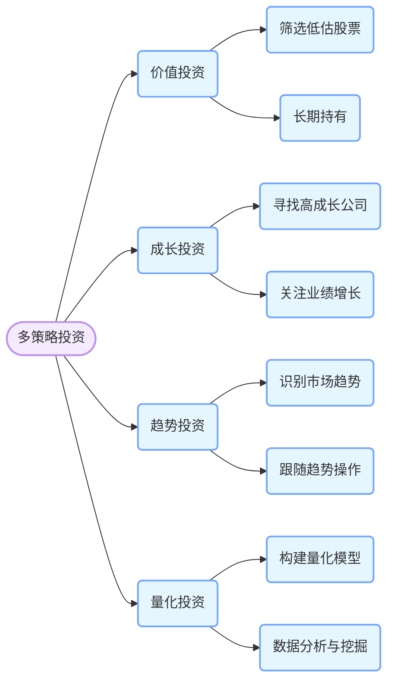

# 多策略投资：综合运用不同投资方法分散风险

> 关键词：多策略投资、投资方法、风险分散、资产配置、投资组合

> 摘要：本文围绕多策略投资展开，深入探讨了综合运用不同投资方法以分散风险的相关内容。首先介绍了多策略投资的背景，包括目的、预期读者等信息。接着阐述了核心概念及联系，详细讲解了核心算法原理与操作步骤，给出了相关数学模型和公式。通过项目实战案例，对代码进行了详细实现和解读。分析了多策略投资的实际应用场景，推荐了相关的工具和资源。最后总结了多策略投资的未来发展趋势与挑战，并对常见问题进行了解答，还提供了扩展阅读和参考资料，旨在为投资者提供全面的多策略投资知识和实践指导。

## 1. 背景介绍 
### 1.1 目的和范围
多策略投资的主要目的在于通过综合运用多种不同的投资方法，降低单一投资策略所带来的风险，实现更为稳定和可持续的投资回报。在金融市场中，不同的投资策略受到各种因素的影响，如市场行情、宏观经济环境、行业动态等。单一策略可能在某些特定情况下表现出色，但在其他情况下则可能遭受较大损失。多策略投资通过将多种策略组合在一起，利用它们之间的低相关性甚至负相关性，来平衡投资组合的风险和收益。

本文的范围涵盖了多策略投资的基本概念、核心算法原理、数学模型、实际应用案例，以及相关的工具和资源推荐等方面。旨在为投资者和相关从业者提供一个全面的多策略投资知识体系，帮助他们更好地理解和应用多策略投资方法。

### 1.2 预期读者
本文的预期读者包括各类投资者，如个人投资者、机构投资者等，他们希望通过多策略投资来优化自己的投资组合，降低风险并提高收益。同时，也适合金融领域的从业者，如基金经理、投资顾问等，他们需要深入了解多策略投资的理论和实践，以提供更专业的投资建议和服务。此外，对于对金融投资感兴趣的学生和研究人员，本文也能为他们提供有价值的学习资料和研究参考。

### 1.3 文档结构概述
本文将按照以下结构进行组织：
1. 背景介绍：阐述多策略投资的目的、范围、预期读者和文档结构概述，以及相关术语的定义和解释。
2. 核心概念与联系：介绍多策略投资的核心概念，包括不同投资策略的分类和特点，以及它们之间的相互关系。通过文本示意图和Mermaid流程图直观展示这些概念之间的联系。
3. 核心算法原理 & 具体操作步骤：详细讲解多策略投资中常用的核心算法原理，如资产配置算法、风险评估算法等，并给出具体的操作步骤，同时使用Python源代码进行详细阐述。
4. 数学模型和公式 & 详细讲解 & 举例说明：介绍多策略投资中涉及的数学模型和公式，如均值 - 方差模型、资本资产定价模型等，并进行详细讲解，通过具体的例子说明这些模型和公式的应用。
5. 项目实战：代码实际案例和详细解释说明：通过一个具体的项目实战案例，介绍多策略投资的代码实现过程，包括开发环境搭建、源代码详细实现和代码解读。
6. 实际应用场景：分析多策略投资在不同金融市场和投资领域的实际应用场景，如股票市场、债券市场、期货市场等。
7. 工具和资源推荐：推荐一些学习多策略投资的资源，包括书籍、在线课程、技术博客和网站等，以及相关的开发工具框架，如IDE和编辑器、调试和性能分析工具、相关框架和库等。同时，推荐一些经典论文和最新研究成果，以及应用案例分析。
8. 总结：未来发展趋势与挑战：总结多策略投资的发展现状，分析其未来发展趋势和面临的挑战。
9. 附录：常见问题与解答：对多策略投资中常见的问题进行解答，帮助读者更好地理解和应用多策略投资方法。
10. 扩展阅读 & 参考资料：提供一些扩展阅读的建议和相关的参考资料，方便读者进一步深入学习和研究多策略投资。

### 1.4 术语表
#### 1.4.1 核心术语定义
- **多策略投资**：指同时运用两种或两种以上不同的投资策略进行投资，以达到分散风险、优化收益的目的。
- **投资策略**：是指投资者为了实现投资目标而采取的一系列投资方法和决策规则，如价值投资、成长投资、趋势投资等。
- **风险分散**：通过投资于不同的资产或采用不同的投资策略，降低投资组合的整体风险。
- **资产配置**：将资金分配到不同的资产类别中，如股票、债券、现金等，以实现投资组合的风险和收益平衡。
- **投资组合**：由多种资产或投资策略组成的集合，旨在通过资产之间的组合来实现特定的投资目标。

#### 1.4.2 相关概念解释
- **相关性**：衡量两个或多个变量之间的关联程度。在投资中，资产之间的相关性越低，通过组合投资分散风险的效果越好。
- **夏普比率**：用于衡量投资组合的风险调整后收益，计算公式为 $(R_p - R_f) / \sigma_p$，其中 $R_p$ 是投资组合的预期收益率，$R_f$ 是无风险收益率，$\sigma_p$ 是投资组合的标准差。
- **最大回撤**：在选定的周期内，投资组合净值从最高点到最低点的最大跌幅，反映了投资组合可能面临的最大损失。

#### 1.4.3 缩略词列表
- **CAPM**：Capital Asset Pricing Model，资本资产定价模型
- **MPT**：Modern Portfolio Theory，现代投资组合理论
- **VaR**：Value at Risk，风险价值

## 2. 核心概念与联系 

### 核心概念原理
多策略投资的核心在于利用不同投资策略之间的差异，通过合理的组合来实现风险分散和收益优化。常见的投资策略包括价值投资、成长投资、趋势投资、量化投资等。

- **价值投资**：基于对股票内在价值的评估，寻找价格低于其内在价值的股票进行投资。价值投资者认为，市场有时会低估某些股票的价值，通过长期持有这些被低估的股票，等待市场发现其价值，从而获得超额收益。
- **成长投资**：关注公司的成长潜力，选择具有高成长率的公司进行投资。成长投资者相信，这些公司的业绩在未来会持续增长，从而推动股价上涨。
- **趋势投资**：根据市场趋势进行投资决策，当市场呈现上升趋势时买入，当市场呈现下降趋势时卖出。趋势投资者认为，市场趋势具有一定的持续性，通过跟随趋势可以获得收益。
- **量化投资**：利用数学模型和计算机算法进行投资决策，通过对大量历史数据的分析和挖掘，寻找投资机会。量化投资者认为，市场存在一些可预测的规律，通过量化模型可以捕捉这些规律。

### 架构的文本示意图
```plaintext
多策略投资
|-- 价值投资
|   |-- 筛选低估股票
|   |-- 长期持有
|-- 成长投资
|   |-- 寻找高成长公司
|   |-- 关注业绩增长
|-- 趋势投资
|   |-- 识别市场趋势
|   |-- 跟随趋势操作
|-- 量化投资
|   |-- 构建量化模型
|   |-- 数据分析与挖掘
```

### Mermaid流程图


从上述示意图和流程图可以看出，多策略投资包含了多种不同的投资策略，每种策略都有其独特的投资方法和决策依据。这些策略之间相互独立又相互补充，通过合理的组合可以实现投资组合的多样化和风险分散。

## 3. 核心算法原理 & 具体操作步骤 

### 资产配置算法原理
资产配置是多策略投资中的核心环节，其目的是将资金合理分配到不同的资产或投资策略中，以实现投资组合的风险和收益平衡。常用的资产配置算法是均值 - 方差模型（Markowitz模型），该模型由哈里·马科维茨（Harry Markowitz）于1952年提出，是现代投资组合理论的基础。

均值 - 方差模型的基本思想是在给定预期收益率的情况下，通过优化资产配置来最小化投资组合的方差（即风险）；或者在给定风险水平的情况下，最大化投资组合的预期收益率。

#### Python源代码实现
```python
import numpy as np
import pandas as pd
from scipy.optimize import minimize

# 假设我们有三种资产，其预期收益率和协方差矩阵如下
expected_returns = np.array([0.1, 0.15, 0.2])
cov_matrix = np.array([[0.04, 0.01, 0.02],
                       [0.01, 0.09, 0.03],
                       [0.02, 0.03, 0.16]])

# 定义目标函数：最小化投资组合的方差
def portfolio_variance(weights, cov_matrix):
    return np.dot(weights.T, np.dot(cov_matrix, weights))

# 定义约束条件：权重之和为1
def weight_constraint(weights):
    return np.sum(weights) - 1

# 初始权重猜测
initial_weights = np.ones(len(expected_returns)) / len(expected_returns)

# 边界条件：权重范围在0到1之间
bounds = [(0, 1) for _ in range(len(expected_returns))]

# 约束条件
constraints = ({'type': 'eq', 'fun': weight_constraint})

# 最小化方差
result = minimize(portfolio_variance, initial_weights, args=(cov_matrix,),
                  method='SLSQP', bounds=bounds, constraints=constraints)

# 最优权重
optimal_weights = result.x

print("最优权重:", optimal_weights)
```

### 具体操作步骤
1. **确定投资范围**：明确可供投资的资产类别或投资策略，如股票、债券、基金等。
2. **估计预期收益率和协方差矩阵**：通过历史数据或其他方法估计每种资产的预期收益率和资产之间的协方差矩阵。
3. **设定目标函数和约束条件**：根据投资目标，设定目标函数，如最小化方差或最大化预期收益率。同时，设定约束条件，如权重之和为1、权重非负等。
4. **求解最优权重**：使用优化算法求解目标函数，得到最优的资产配置权重。
5. **构建投资组合**：根据最优权重，将资金分配到不同的资产或投资策略中，构建投资组合。

### 风险评估算法原理
除了资产配置，风险评估也是多策略投资中的重要环节。常用的风险评估指标是风险价值（VaR），它衡量在一定的置信水平下，投资组合在未来一定时间内可能遭受的最大损失。

#### Python源代码实现
```python
import numpy as np
import pandas as pd
from scipy.stats import norm

# 假设我们有一个投资组合的日收益率数据
returns = np.random.normal(0.001, 0.01, 1000)

# 置信水平
confidence_level = 0.95

# 计算VaR
var = np.percentile(returns, 100 * (1 - confidence_level))

print("VaR ({}%置信水平): {:.2f}%".format(confidence_level * 100, var * 100))
```

### 具体操作步骤
1. **收集收益率数据**：收集投资组合的历史收益率数据。
2. **确定置信水平和时间范围**：根据投资需求，确定置信水平和时间范围，如95%置信水平、1天时间范围。
3. **计算VaR**：使用历史模拟法、参数法或蒙特卡罗模拟法等方法计算VaR。
4. **分析风险**：根据计算得到的VaR值，评估投资组合的风险水平，并采取相应的风险管理措施。

## 4. 数学模型和公式 & 详细讲解 & 举例说明 

### 均值 - 方差模型
均值 - 方差模型的数学表达式如下：

#### 目标函数
在给定预期收益率 $R_p$ 的情况下，最小化投资组合的方差 $\sigma_p^2$：

$$
\min_{\mathbf{w}} \sigma_p^2 = \mathbf{w}^T \mathbf{\Sigma} \mathbf{w}
$$

其中，$\mathbf{w}$ 是投资组合的权重向量，$\mathbf{\Sigma}$ 是资产的协方差矩阵。

#### 约束条件
- 权重之和为1：

$$
\sum_{i=1}^{n} w_i = 1
$$

- 预期收益率约束：

$$
\mathbf{w}^T \mathbf{R} = R_p
$$

其中，$\mathbf{R}$ 是资产的预期收益率向量。

#### 举例说明
假设我们有两种资产，资产A的预期收益率为10%，标准差为20%；资产B的预期收益率为15%，标准差为30%。两种资产的相关系数为0.5。我们希望构建一个预期收益率为12%的投资组合，求最优的资产配置权重。

首先，计算协方差矩阵：

$$
\mathbf{\Sigma} = \begin{bmatrix}
\sigma_A^2 & \rho_{AB} \sigma_A \sigma_B \\
\rho_{AB} \sigma_A \sigma_B & \sigma_B^2
\end{bmatrix} = \begin{bmatrix}
0.2^2 & 0.5 \times 0.2 \times 0.3 \\
0.5 \times 0.2 \times 0.3 & 0.3^2
\end{bmatrix} = \begin{bmatrix}
0.04 & 0.03 \\
0.03 & 0.09
\end{bmatrix}
$$

预期收益率向量为：

$$
\mathbf{R} = \begin{bmatrix}
0.1 \\
0.15
\end{bmatrix}
$$

设资产A的权重为 $w_A$，资产B的权重为 $w_B = 1 - w_A$。根据预期收益率约束：

$$
w_A \times 0.1 + (1 - w_A) \times 0.15 = 0.12
$$

解得 $w_A = 0.6$，$w_B = 0.4$。

投资组合的方差为：

$$
\sigma_p^2 = \begin{bmatrix}
0.6 & 0.4
\end{bmatrix} \begin{bmatrix}
0.04 & 0.03 \\
0.03 & 0.09
\end{bmatrix} \begin{bmatrix}
0.6 \\
0.4
\end{bmatrix} = 0.0288
$$

### 资本资产定价模型（CAPM）
资本资产定价模型用于描述资产的预期收益率与市场风险之间的关系，其数学表达式为：

$$
R_i = R_f + \beta_i (R_m - R_f)
$$

其中，$R_i$ 是资产 $i$ 的预期收益率，$R_f$ 是无风险收益率，$R_m$ 是市场组合的预期收益率，$\beta_i$ 是资产 $i$ 的贝塔系数，衡量资产 $i$ 的收益率对市场组合收益率的敏感程度。

#### 举例说明
假设无风险收益率为3%，市场组合的预期收益率为10%，某股票的贝塔系数为1.2。则该股票的预期收益率为：

$$
R_i = 0.03 + 1.2 \times (0.1 - 0.03) = 0.114 = 11.4\%
$$

### 风险价值（VaR）
风险价值（VaR）的计算方法有多种，这里介绍历史模拟法。历史模拟法的基本思想是利用历史收益率数据来估计未来的风险。

假设我们有 $n$ 个历史收益率数据 $r_1, r_2, \cdots, r_n$，按照从小到大的顺序排序得到 $r_{(1)}, r_{(2)}, \cdots, r_{(n)}$。在置信水平为 $c$ 的情况下，VaR的计算公式为：

$$
VaR = r_{(k)}
$$

其中，$k = \lfloor n \times (1 - c) \rfloor$，$\lfloor \cdot \rfloor$ 表示向下取整。

#### 举例说明
假设我们有1000个历史收益率数据，置信水平为95%。则 $k = \lfloor 1000 \times (1 - 0.95) \rfloor = 50$。将历史收益率数据排序后，第50个数据即为VaR值。

## 5. 项目实战：代码实际案例和详细解释说明 

### 5.1  开发环境搭建
在进行多策略投资的项目实战之前，需要搭建相应的开发环境。以下是具体的步骤：

#### 安装Python
Python是一种广泛使用的编程语言，在金融领域也有很多应用。可以从Python官方网站（https://www.python.org/downloads/）下载并安装Python 3.x版本。

#### 安装必要的库
在Python中，有很多用于金融数据分析和投资组合优化的库，如NumPy、Pandas、Scipy等。可以使用以下命令安装这些库：

```sh
pip install numpy pandas scipy
```

#### 安装集成开发环境（IDE）
为了方便代码的编写和调试，可以安装一个集成开发环境，如PyCharm、Jupyter Notebook等。

### 5.2  源代码详细实现和代码解读
以下是一个简单的多策略投资项目实战案例，使用均值 - 方差模型进行资产配置。

```python
import numpy as np
import pandas as pd
from scipy.optimize import minimize

# 模拟三种资产的预期收益率和协方差矩阵
expected_returns = np.array([0.1, 0.15, 0.2])
cov_matrix = np.array([[0.04, 0.01, 0.02],
                       [0.01, 0.09, 0.03],
                       [0.02, 0.03, 0.16]])

# 定义目标函数：最小化投资组合的方差
def portfolio_variance(weights, cov_matrix):
    return np.dot(weights.T, np.dot(cov_matrix, weights))

# 定义约束条件：权重之和为1
def weight_constraint(weights):
    return np.sum(weights) - 1

# 初始权重猜测
initial_weights = np.ones(len(expected_returns)) / len(expected_returns)

# 边界条件：权重范围在0到1之间
bounds = [(0, 1) for _ in range(len(expected_returns))]

# 约束条件
constraints = ({'type': 'eq', 'fun': weight_constraint})

# 最小化方差
result = minimize(portfolio_variance, initial_weights, args=(cov_matrix,),
                  method='SLSQP', bounds=bounds, constraints=constraints)

# 最优权重
optimal_weights = result.x

# 计算投资组合的预期收益率和标准差
portfolio_return = np.dot(optimal_weights, expected_returns)
portfolio_std = np.sqrt(portfolio_variance(optimal_weights, cov_matrix))

print("最优权重:", optimal_weights)
print("投资组合预期收益率:", portfolio_return)
print("投资组合标准差:", portfolio_std)
```

### 代码解读与分析
1. **数据准备**：首先，我们模拟了三种资产的预期收益率和协方差矩阵。这些数据可以通过历史数据或其他方法进行估计。
2. **目标函数定义**：定义了目标函数 `portfolio_variance`，用于计算投资组合的方差。
3. **约束条件定义**：定义了约束条件 `weight_constraint`，确保权重之和为1。
4. **初始权重猜测**：使用等权重作为初始权重猜测。
5. **边界条件和约束条件设置**：设置了权重的边界条件为0到1之间，并将约束条件传递给优化算法。
6. **优化求解**：使用 `scipy.optimize.minimize` 函数求解最优权重。
7. **结果计算和输出**：计算投资组合的预期收益率和标准差，并输出最优权重、预期收益率和标准差。

通过这个项目实战案例，我们可以看到如何使用均值 - 方差模型进行资产配置，以及如何使用Python代码实现这一过程。

## 6. 实际应用场景 
### 股票市场
在股票市场中，多策略投资可以通过综合运用价值投资、成长投资、趋势投资等策略来分散风险。例如，价值投资者可以寻找被低估的股票进行长期投资，成长投资者可以关注具有高成长潜力的公司，趋势投资者可以根据市场趋势进行短期操作。通过将这些策略组合在一起，可以降低单一策略的风险，提高投资组合的稳定性和收益。

### 债券市场
在债券市场中，多策略投资可以通过投资不同类型的债券，如国债、企业债、可转债等，以及采用不同的投资策略，如久期匹配、骑乘收益率曲线等，来实现风险分散和收益优化。例如，久期匹配策略可以通过调整债券组合的久期来匹配投资者的投资期限，降低利率风险；骑乘收益率曲线策略可以通过选择收益率曲线较陡的债券进行投资，获取更高的收益。

### 期货市场
在期货市场中，多策略投资可以通过运用不同的交易策略，如趋势跟踪、套利交易等，来降低市场波动带来的风险。趋势跟踪策略可以根据期货价格的趋势进行交易，当价格上涨时买入，当价格下跌时卖出；套利交易策略可以通过同时买入和卖出相关的期货合约，利用价格差异获取收益。

### 基金投资
在基金投资中，多策略投资可以通过投资不同类型的基金，如股票型基金、债券型基金、混合型基金等，以及采用不同的投资策略，如定期定额投资、资产配置等，来实现风险分散和长期投资目标。例如，定期定额投资可以通过定期投入固定金额的资金，平均成本，降低市场波动的影响；资产配置可以根据投资者的风险承受能力和投资目标，将资金分配到不同类型的基金中，实现风险和收益的平衡。

## 7. 工具和资源推荐
### 7.1 学习资源推荐
#### 7.1.1 书籍推荐
- 《聪明的投资者》（The Intelligent Investor）：本杰明·格雷厄姆（Benjamin Graham）著，被誉为投资界的圣经，介绍了价值投资的基本理念和方法。
- 《证券分析》（Security Analysis）：本杰明·格雷厄姆和大卫·多德（David Dodd）著，是价值投资领域的经典著作，详细阐述了股票和债券的分析方法。
- 《漫步华尔街》（A Random Walk Down Wall Street）：伯顿·马尔基尔（Burton Malkiel）著，介绍了有效市场假说和随机漫步理论，对投资策略和资产配置有深入的探讨。
- 《量化投资：策略与技术》：丁鹏著，系统介绍了量化投资的理论和实践，包括量化模型的构建、数据处理、策略回测等方面的内容。

#### 7.1.2 在线课程
- Coursera上的“投资学原理”（Principles of Investments）：由哥伦比亚大学教授授课，介绍了投资组合理论、资产定价模型、风险管理等投资学的基础知识。
- edX上的“金融市场”（Financial Markets）：由耶鲁大学教授授课，涵盖了金融市场的各个方面，包括股票市场、债券市场、期货市场等。
- 中国大学MOOC上的“量化投资基础”：由上海财经大学教授授课，介绍了量化投资的基本概念、方法和工具。

#### 7.1.3 技术博客和网站
- 雪球（https://xueqiu.com/）：国内知名的投资社区，提供股票、基金、债券等金融产品的行情、分析和讨论。
- 优矿（https://uqer.datayes.com/）：一个量化投资平台，提供丰富的金融数据和量化工具，还有很多量化策略的分享和交流。
- Seeking Alpha（https://seekingalpha.com/）：国外知名的投资研究网站，提供全球金融市场的分析和评论，以及投资策略和股票推荐。

### 7.2 开发工具框架推荐
#### 7.2.1 IDE和编辑器
- PyCharm：一款专业的Python集成开发环境，提供代码编辑、调试、版本控制等功能，适合大规模项目的开发。
- Jupyter Notebook：一个交互式的开发环境，支持Python、R等多种编程语言，适合数据分析和模型开发。
- Visual Studio Code：一款轻量级的代码编辑器，支持多种编程语言和插件扩展，具有良好的代码编辑体验。

#### 7.2.2 调试和性能分析工具
- PySnooper：一个简单易用的Python调试工具，可以自动记录函数的执行过程和变量的值，方便调试代码。
- cProfile：Python内置的性能分析工具，可以分析代码的运行时间和函数调用情况，帮助优化代码性能。
- line_profiler：一个用于逐行分析代码性能的工具，可以找出代码中的性能瓶颈。

#### 7.2.3 相关框架和库
- NumPy：Python中用于科学计算的基础库，提供了高效的数组操作和数学函数。
- Pandas：用于数据处理和分析的库，提供了数据结构和数据分析工具，方便处理金融数据。
- Scipy：一个用于科学计算和优化的库，提供了线性代数、优化算法、统计分析等功能。
- Zipline：一个开源的量化交易回测框架，支持多种交易策略的回测和优化。

### 7.3 相关论文著作推荐
#### 7.3.1 经典论文
- Markowitz, H. M. (1952). Portfolio Selection. The Journal of Finance, 7(1), 77 - 91. 这篇论文提出了均值 - 方差模型，开创了现代投资组合理论的先河。
- Sharpe, W. F. (1964). Capital Asset Prices: A Theory of Market Equilibrium under Conditions of Risk. The Journal of Finance, 19(3), 425 - 442. 这篇论文提出了资本资产定价模型（CAPM），为资产定价和风险管理提供了重要的理论基础。

#### 7.3.2 最新研究成果
- 可以关注《Journal of Financial Economics》、《Review of Financial Studies》等金融领域的顶级学术期刊，获取多策略投资领域的最新研究成果。

#### 7.3.3 应用案例分析
- 《多策略对冲基金：从理念到实践》：介绍了多策略对冲基金的投资策略、风险管理和绩效评估等方面的内容，并通过实际案例进行了分析。
- 《量化投资实战案例解析》：通过实际案例介绍了量化投资的策略设计、模型构建、回测和优化等过程。

## 8. 总结：未来发展趋势与挑战
### 未来发展趋势
- **智能化和自动化**：随着人工智能和机器学习技术的不断发展，多策略投资将越来越智能化和自动化。通过机器学习算法，可以对大量的金融数据进行分析和挖掘，发现投资机会和风险，实现自动化的投资决策和交易执行。
- **全球化和多元化**：金融市场的全球化趋势将使得多策略投资更加注重全球资产配置和多元化投资。投资者可以通过投资不同国家和地区的资产，进一步分散风险，提高投资组合的收益。
- **绿色投资和社会责任投资**：随着社会对环境保护和社会责任的关注度不断提高，绿色投资和社会责任投资将成为多策略投资的重要方向。投资者将更加注重企业的环境、社会和治理（ESG）表现，将ESG因素纳入投资决策过程中。

### 挑战
- **数据质量和可靠性**：多策略投资依赖于大量的金融数据，数据的质量和可靠性直接影响投资决策的准确性。然而，金融数据往往存在噪声、缺失值和错误等问题，需要进行有效的数据清洗和预处理。
- **模型风险**：多策略投资中使用的各种模型和算法都存在一定的局限性和风险。例如，均值 - 方差模型假设资产收益率服从正态分布，但实际市场中资产收益率往往存在肥尾现象，导致模型的预测结果与实际情况存在偏差。
- **市场不确定性**：金融市场充满了不确定性，各种宏观经济因素、政策变化、突发事件等都可能对市场产生重大影响。多策略投资需要能够适应市场的变化，及时调整投资策略，以应对市场不确定性带来的风险。

## 9. 附录：常见问题与解答
### 多策略投资是否一定能降低风险？
多策略投资通过综合运用不同的投资策略，可以在一定程度上降低风险，但并不能完全消除风险。如果不同策略之间的相关性较高，或者市场出现极端情况，多策略投资仍然可能遭受损失。

### 如何选择适合自己的投资策略？
选择适合自己的投资策略需要考虑多个因素，如投资目标、风险承受能力、投资期限等。例如，如果投资者的投资目标是长期增值，风险承受能力较高，可以选择成长投资或量化投资策略；如果投资者的投资目标是保值和稳定收益，风险承受能力较低，可以选择价值投资或债券投资策略。

### 多策略投资需要多少资金？
多策略投资所需的资金量取决于投资策略的类型和投资组合的规模。一般来说，一些量化投资策略可能需要较大的资金量来实现有效的分散投资；而一些简单的价值投资或成长投资策略，所需的资金量相对较小。投资者可以根据自己的资金状况和投资目标，合理确定投资规模。

### 如何评估多策略投资组合的绩效？
评估多策略投资组合的绩效可以使用多种指标，如收益率、夏普比率、最大回撤等。收益率反映了投资组合的盈利情况，夏普比率衡量了投资组合的风险调整后收益，最大回撤反映了投资组合可能面临的最大损失。综合考虑这些指标，可以更全面地评估投资组合的绩效。

## 10. 扩展阅读 & 参考资料
### 扩展阅读
- 《金融炼金术》（The Alchemy of Finance）：乔治·索罗斯（George Soros）著，介绍了索罗斯的投资哲学和反射理论，对理解金融市场的运行机制有很大的帮助。
- 《黑天鹅》（The Black Swan）：纳西姆·尼古拉斯·塔勒布（Nassim Nicholas Taleb）著，探讨了不可预测的重大事件对金融市场和投资的影响，提醒投资者要关注极端风险。

### 参考资料
- 哈里·马科维茨. 投资组合选择：有效分散化（第2版）[M]. 机械工业出版社, 2012.
- 威廉·夏普. 投资学（第9版）[M]. 中国人民大学出版社, 2012.
- 丁鹏. 量化投资：策略与技术（第2版）[M]. 电子工业出版社, 2016.

作者：AI天才研究院/AI Genius Institute & 禅与计算机程序设计艺术 /Zen And The Art of Computer Programming