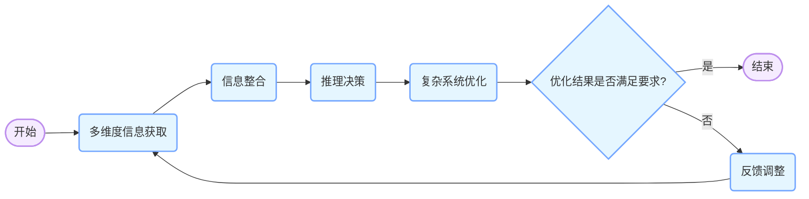

# 多维度推理能力在复杂系统优化中的应用研究

> 关键词：多维度推理能力、复杂系统优化、推理算法、数学模型、实际应用

> 摘要：本文深入探讨了多维度推理能力在复杂系统优化中的应用。首先介绍了研究的背景，包括目的、预期读者、文档结构和相关术语。接着阐述了多维度推理能力和复杂系统优化的核心概念及其联系，并给出了相应的文本示意图和 Mermaid 流程图。详细讲解了核心算法原理及具体操作步骤，结合 Python 源代码进行说明。通过数学模型和公式进一步剖析了其理论基础，并举例说明。以项目实战展示了代码的实际应用，包括开发环境搭建、源代码实现与解读。分析了多维度推理能力在不同实际场景中的应用，推荐了相关的学习资源、开发工具框架和论文著作。最后总结了未来发展趋势与挑战，解答了常见问题，并提供了扩展阅读和参考资料。

## 1. 背景介绍 
### 1.1 目的和范围
在当今科技飞速发展的时代，复杂系统无处不在，如交通系统、能源系统、金融系统等。这些系统通常具有高度的复杂性、不确定性和动态性，传统的优化方法往往难以满足其优化需求。多维度推理能力能够综合考虑多个因素和维度的信息，为复杂系统的优化提供更全面、更准确的决策依据。本研究的目的在于深入探讨多维度推理能力在复杂系统优化中的应用，揭示其内在机制和规律，为实际应用提供理论支持和实践指导。研究范围涵盖了多维度推理能力的基本概念、核心算法、数学模型，以及在不同复杂系统中的具体应用。

### 1.2 预期读者
本文的预期读者包括计算机科学、控制科学、运筹学等领域的研究人员和学者，他们可以从本文中获取多维度推理能力在复杂系统优化方面的最新研究成果和理论方法。同时，从事复杂系统设计、开发和管理的工程师和技术人员也能从本文中得到实际应用的启示和指导，将多维度推理能力应用到实际项目中。此外，对人工智能、优化算法等领域感兴趣的学生和爱好者也可以通过本文了解多维度推理能力在复杂系统优化中的应用价值和潜力。

### 1.3 文档结构概述
本文共分为十个部分。第一部分为背景介绍，阐述了研究的目的、预期读者、文档结构和相关术语。第二部分介绍了多维度推理能力和复杂系统优化的核心概念及其联系，并给出了相应的示意图和流程图。第三部分详细讲解了核心算法原理及具体操作步骤，结合 Python 源代码进行说明。第四部分通过数学模型和公式进一步剖析了其理论基础，并举例说明。第五部分以项目实战展示了代码的实际应用，包括开发环境搭建、源代码实现与解读。第六部分分析了多维度推理能力在不同实际场景中的应用。第七部分推荐了相关的学习资源、开发工具框架和论文著作。第八部分总结了未来发展趋势与挑战。第九部分解答了常见问题。第十部分提供了扩展阅读和参考资料。

### 1.4 术语表
#### 1.4.1 核心术语定义
- **多维度推理能力**：指能够同时考虑多个不同维度的信息，并基于这些信息进行逻辑推理和决策的能力。在复杂系统优化中，多维度推理能力可以帮助我们综合考虑系统的各种因素，如性能、成本、可靠性等，从而找到最优的解决方案。
- **复杂系统优化**：是指对具有高度复杂性、不确定性和动态性的系统进行优化的过程。复杂系统通常由多个相互关联的子系统组成，其行为和性能受到多种因素的影响。优化的目标是在满足一定约束条件的前提下，使系统的性能达到最优。
- **推理算法**：是实现多维度推理能力的具体方法和步骤。常见的推理算法包括基于规则的推理算法、基于机器学习的推理算法等。
- **数学模型**：是对复杂系统的一种抽象和描述，通过数学公式和方程来表达系统的行为和性能。数学模型可以帮助我们更好地理解系统的本质和规律，为优化提供理论支持。

#### 1.4.2 相关概念解释
- **维度**：在数学和物理学中，维度是指描述一个对象或系统所需的独立参数的数量。在多维度推理中，维度可以表示不同的属性、特征或因素。
- **优化目标**：是指在复杂系统优化中需要达到的目标，如最大化系统的性能、最小化系统的成本等。优化目标通常是一个或多个函数，需要在一定的约束条件下进行求解。
- **约束条件**：是指在复杂系统优化中需要满足的条件，如资源限制、技术要求等。约束条件通常是一些不等式或等式，限制了优化问题的可行解空间。

#### 1.4.3 缩略词列表
- **AI**：Artificial Intelligence，人工智能
- **ML**：Machine Learning，机器学习
- **RL**：Reinforcement Learning，强化学习

## 2. 核心概念与联系 
### 核心概念原理
#### 多维度推理能力
多维度推理能力的核心在于能够从多个不同的角度和层面获取信息，并对这些信息进行整合和分析。在复杂系统中，不同的维度可能代表着不同的因素，如时间、空间、性能指标等。通过对这些维度的信息进行推理，可以更全面地了解系统的状态和行为。例如，在交通系统中，我们可以从时间维度考虑不同时间段的交通流量，从空间维度考虑不同路段的拥堵情况，通过多维度推理来预测交通拥堵的发生，并制定相应的疏导策略。

#### 复杂系统优化
复杂系统优化的目标是在满足一定约束条件的前提下，使系统的性能达到最优。复杂系统通常具有高度的非线性、不确定性和动态性，因此优化过程需要综合考虑多个因素。例如，在能源系统中，优化的目标可能是在满足能源需求的前提下，最小化能源消耗和环境污染。这就需要考虑能源的生产、传输、分配等多个环节，以及不同能源的特性和成本。

### 架构的文本示意图
```plaintext
多维度推理能力
|-- 信息获取（多个维度）
|   |-- 时间维度信息
|   |-- 空间维度信息
|   |-- 性能维度信息
|   |--...
|-- 信息整合
|   |-- 数据融合
|   |-- 特征提取
|-- 推理决策
|   |-- 规则推理
|   |-- 机器学习推理
|   |-- 强化学习推理

复杂系统优化
|-- 系统建模
|   |-- 数学模型
|   |-- 仿真模型
|-- 优化目标设定
|   |-- 性能指标
|   |-- 成本指标
|   |-- 可靠性指标
|-- 约束条件定义
|   |-- 资源限制
|   |-- 技术要求
|-- 优化算法选择
|   |-- 遗传算法
|   |-- 粒子群算法
|   |-- 模拟退火算法

多维度推理能力与复杂系统优化的联系
|-- 多维度推理为复杂系统优化提供决策依据
|-- 复杂系统优化的结果反馈给多维度推理进行调整和优化
```

### Mermaid 流程图


## 3. 核心算法原理 & 具体操作步骤 
### 核心算法原理
在多维度推理能力在复杂系统优化中的应用中，一种常用的算法是基于机器学习的推理算法，特别是强化学习算法。强化学习是一种通过智能体与环境进行交互，不断尝试和学习，以最大化累积奖励的算法。在复杂系统优化中，智能体可以看作是优化策略的决策者，环境则是复杂系统本身。智能体通过观察系统的状态，采取相应的行动，并根据行动的结果获得奖励或惩罚。通过不断地学习和调整策略，智能体可以找到最优的优化方案。

### 具体操作步骤
#### 步骤 1：定义状态空间、动作空间和奖励函数
- **状态空间**：是指复杂系统的所有可能状态的集合。在交通系统中，状态空间可以包括不同路段的交通流量、车速、拥堵情况等。
- **动作空间**：是指智能体可以采取的所有可能行动的集合。在交通系统中，动作空间可以包括调整交通信号灯的时间、引导车辆行驶路线等。
- **奖励函数**：是用于评估智能体采取的行动的好坏的函数。在交通系统中，奖励函数可以根据交通拥堵的缓解程度、车辆行驶时间的减少等因素来定义。

#### 步骤 2：选择强化学习算法
常见的强化学习算法包括 Q - learning、Deep Q - Network (DQN)、Actor - Critic 等。选择合适的算法需要考虑系统的复杂性、数据的规模等因素。

#### 步骤 3：训练智能体
使用训练数据对智能体进行训练，智能体通过不断地与环境进行交互，学习最优的策略。训练过程中，智能体根据当前状态选择动作，执行动作后观察环境的反馈（奖励和下一个状态），并根据强化学习算法更新策略。

#### 步骤 4：应用优化策略
训练完成后，将智能体学习到的最优策略应用到实际的复杂系统中，实现系统的优化。

### Python 源代码实现
```python
import numpy as np
import random

# 定义状态空间和动作空间
state_space = 10
action_space = 5

# 初始化 Q 表
Q = np.zeros((state_space, action_space))

# 定义超参数
alpha = 0.1  # 学习率
gamma = 0.9  # 折扣因子
epsilon = 0.1  # 探索率

# 定义奖励函数（示例）
def reward_function(state, action):
    # 这里简单返回一个随机奖励，实际应用中需要根据具体问题定义
    return random.randint(-10, 10)

# 定义 Q - learning 算法
def q_learning(num_episodes):
    for episode in range(num_episodes):
        state = random.randint(0, state_space - 1)
        done = False
        while not done:
            if random.uniform(0, 1) < epsilon:
                action = random.randint(0, action_space - 1)  # 探索
            else:
                action = np.argmax(Q[state, :])  # 利用

            reward = reward_function(state, action)
            next_state = random.randint(0, state_space - 1)

            # Q - learning 更新公式
            Q[state, action] = Q[state, action] + alpha * (reward + gamma * np.max(Q[next_state, :]) - Q[state, action])

            state = next_state

            # 假设达到一定条件后结束当前回合
            if random.random() < 0.1:
                done = True

    return Q

# 训练智能体
num_episodes = 1000
Q = q_learning(num_episodes)

print("训练后的 Q 表：")
print(Q)
```

## 4. 数学模型和公式 & 详细讲解 & 举例说明 
### 数学模型
在强化学习中，常用的数学模型是马尔可夫决策过程（Markov Decision Process, MDP）。一个 MDP 可以用一个五元组 $\langle S, A, P, R, \gamma \rangle$ 来表示，其中：
- $S$ 是状态空间，即系统的所有可能状态的集合。
- $A$ 是动作空间，即智能体可以采取的所有可能行动的集合。
- $P: S \times A \times S \to [0, 1]$ 是状态转移概率函数，表示在状态 $s \in S$ 下采取动作 $a \in A$ 后转移到状态 $s' \in S$ 的概率。
- $R: S \times A \to \mathbb{R}$ 是奖励函数，表示在状态 $s \in S$ 下采取动作 $a \in A$ 后获得的即时奖励。
- $\gamma \in [0, 1]$ 是折扣因子，用于权衡即时奖励和未来奖励的重要性。

### 公式
#### Q - learning 更新公式
Q - learning 是一种无模型的强化学习算法，其核心是通过更新 Q 表来学习最优策略。Q 表 $Q(s, a)$ 表示在状态 $s$ 下采取动作 $a$ 的预期累积奖励。Q - learning 的更新公式如下：
$$Q(s, a) \leftarrow Q(s, a) + \alpha [R(s, a) + \gamma \max_{a'} Q(s', a') - Q(s, a)]$$
其中：
- $\alpha$ 是学习率，控制每次更新的步长。
- $R(s, a)$ 是在状态 $s$ 下采取动作 $a$ 后获得的即时奖励。
- $\gamma$ 是折扣因子，用于权衡即时奖励和未来奖励的重要性。
- $s'$ 是采取动作 $a$ 后转移到的下一个状态。

#### 策略选择公式
在 Q - learning 中，通常采用 $\epsilon$-贪心策略来选择动作：
$$
a = 
\begin{cases}
\arg \max_{a'} Q(s, a') & \text{with probability } 1 - \epsilon \\
\text{random action from } A & \text{with probability } \epsilon
\end{cases}
$$
其中 $\epsilon$ 是探索率，控制智能体进行探索和利用的比例。

### 详细讲解
- **马尔可夫决策过程**：MDP 假设系统的状态转移具有马尔可夫性，即下一个状态只与当前状态和采取的动作有关，而与历史状态和动作无关。这种假设使得问题的求解更加简化，同时也符合很多实际系统的特点。
- **Q - learning 更新公式**：Q - learning 的更新公式是基于贝尔曼方程推导而来的。其基本思想是通过不断地更新 Q 表，使得 $Q(s, a)$ 逐渐逼近在状态 $s$ 下采取动作 $a$ 的最优预期累积奖励。学习率 $\alpha$ 控制了每次更新的步长，如果 $\alpha$ 过大，可能会导致算法不稳定；如果 $\alpha$ 过小，算法的收敛速度会很慢。折扣因子 $\gamma$ 用于权衡即时奖励和未来奖励的重要性，$\gamma$ 越接近 1，表示更注重未来奖励；$\gamma$ 越接近 0，表示更注重即时奖励。
- **策略选择公式**：$\epsilon$-贪心策略是一种平衡探索和利用的策略。在训练初期，为了让智能体能够探索更多的状态和动作，通常会设置较大的 $\epsilon$ 值；随着训练的进行，逐渐减小 $\epsilon$ 值，让智能体更多地利用已经学习到的知识。

### 举例说明
假设我们有一个简单的网格世界，智能体需要从起点移动到终点。状态空间 $S$ 是网格世界中所有可能的位置，动作空间 $A$ 是智能体可以采取的四个方向（上、下、左、右）。奖励函数 $R$ 可以定义为：当智能体到达终点时，获得正奖励；当智能体撞到墙壁或超出边界时，获得负奖励；其他情况下，获得零奖励。

我们使用 Q - learning 算法来训练智能体。初始时，Q 表中的所有值都为 0。在每个回合中，智能体从起点开始，根据 $\epsilon$-贪心策略选择动作，执行动作后观察环境的反馈（奖励和下一个状态），并根据 Q - learning 更新公式更新 Q 表。经过多次训练后，智能体可以学习到从起点到终点的最优路径。

## 5. 项目实战：代码实际案例和详细解释说明 
### 5.1  开发环境搭建
#### 安装 Python
首先，需要安装 Python 编程语言。可以从 Python 官方网站（https://www.python.org/downloads/） 下载适合自己操作系统的 Python 版本，并按照安装向导进行安装。建议安装 Python 3.6 及以上版本。

#### 安装必要的库
在本项目中，我们需要使用 `numpy` 库进行数值计算。可以使用以下命令来安装 `numpy` 库：
```sh
pip install numpy
```

### 5.2  源代码详细实现和代码解读
```python
import numpy as np
import random

# 定义状态空间和动作空间
state_space = 10
action_space = 5

# 初始化 Q 表
Q = np.zeros((state_space, action_space))

# 定义超参数
alpha = 0.1  # 学习率
gamma = 0.9  # 折扣因子
epsilon = 0.1  # 探索率

# 定义奖励函数（示例）
def reward_function(state, action):
    # 这里简单返回一个随机奖励，实际应用中需要根据具体问题定义
    return random.randint(-10, 10)

# 定义 Q - learning 算法
def q_learning(num_episodes):
    for episode in range(num_episodes):
        state = random.randint(0, state_space - 1)
        done = False
        while not done:
            if random.uniform(0, 1) < epsilon:
                action = random.randint(0, action_space - 1)  # 探索
            else:
                action = np.argmax(Q[state, :])  # 利用

            reward = reward_function(state, action)
            next_state = random.randint(0, state_space - 1)

            # Q - learning 更新公式
            Q[state, action] = Q[state, action] + alpha * (reward + gamma * np.max(Q[next_state, :]) - Q[state, action])

            state = next_state

            # 假设达到一定条件后结束当前回合
            if random.random() < 0.1:
                done = True

    return Q

# 训练智能体
num_episodes = 1000
Q = q_learning(num_episodes)

print("训练后的 Q 表：")
print(Q)
```

#### 代码解读
1. **导入必要的库**：`numpy` 用于数值计算，`random` 用于生成随机数。
2. **定义状态空间和动作空间**：`state_space` 和 `action_space` 分别表示状态空间和动作空间的大小。
3. **初始化 Q 表**：`Q` 是一个二维数组，用于存储在每个状态下采取每个动作的预期累积奖励。初始时，所有值都为 0。
4. **定义超参数**：`alpha` 是学习率，`gamma` 是折扣因子，`epsilon` 是探索率。
5. **定义奖励函数**：`reward_function` 用于根据当前状态和动作返回相应的奖励。在本示例中，奖励是随机生成的，实际应用中需要根据具体问题进行定义。
6. **定义 Q - learning 算法**：`q_learning` 函数实现了 Q - learning 算法的核心逻辑。在每个回合中，智能体从随机状态开始，根据 $\epsilon$-贪心策略选择动作，执行动作后观察环境的反馈（奖励和下一个状态），并根据 Q - learning 更新公式更新 Q 表。当满足一定条件时，结束当前回合。
7. **训练智能体**：调用 `q_learning` 函数进行训练，训练完成后打印训练后的 Q 表。

### 5.3  代码解读与分析
#### 优点
- **简单易懂**：Q - learning 算法的实现相对简单，代码结构清晰，易于理解和实现。
- **无模型**：Q - learning 是一种无模型的强化学习算法，不需要对环境的状态转移概率进行建模，适用于很多复杂系统。
- **可扩展性**：可以通过调整超参数和奖励函数，应用于不同的复杂系统优化问题。

#### 缺点
- **收敛速度慢**：在某些情况下，Q - learning 算法的收敛速度可能较慢，需要大量的训练时间。
- **不适用于高维状态空间**：当状态空间和动作空间非常大时，Q 表的规模会变得非常大，导致内存消耗过大，计算效率低下。

#### 改进方向
- **使用深度 Q 网络（DQN）**：DQN 可以使用神经网络来近似 Q 表，从而解决高维状态空间的问题。
- **采用经验回放机制**：经验回放可以提高数据的利用率，加快算法的收敛速度。

## 6. 实际应用场景 
### 交通系统优化
在交通系统中，多维度推理能力可以综合考虑时间、空间、交通流量等多个维度的信息，实现交通系统的优化。例如，通过实时监测不同路段的交通流量、车速、拥堵情况等信息，利用多维度推理算法预测交通拥堵的发生，并提前调整交通信号灯的时间、引导车辆行驶路线，以缓解交通拥堵。此外，还可以结合历史交通数据和天气信息等，对交通需求进行预测，优化交通资源的分配。

### 能源系统优化
能源系统是一个复杂的系统，涉及到能源的生产、传输、分配和消费等多个环节。多维度推理能力可以帮助我们综合考虑能源的类型、成本、可靠性、环境影响等多个维度的因素，实现能源系统的优化。例如，在能源生产环节，可以根据不同能源的特性和成本，结合实时的能源需求和天气条件等信息，优化能源的生产计划；在能源分配环节，可以根据用户的需求和能源的供应情况，合理分配能源资源，提高能源的利用效率。

### 金融系统优化
在金融系统中，多维度推理能力可以用于风险评估、投资决策等方面。例如，通过分析市场趋势、宏观经济数据、企业财务状况等多个维度的信息，利用多维度推理算法评估投资风险，制定合理的投资策略。此外，还可以结合用户的风险偏好和投资目标等信息，为用户提供个性化的投资建议。

### 医疗系统优化
在医疗系统中，多维度推理能力可以用于疾病诊断、治疗方案制定等方面。例如，通过分析患者的症状、病史、检查结果等多个维度的信息，利用多维度推理算法辅助医生进行疾病诊断，提高诊断的准确性和效率。此外，还可以结合患者的身体状况、治疗效果等信息，为患者制定个性化的治疗方案。

## 7. 工具和资源推荐
### 7.1 学习资源推荐
#### 7.1.1 书籍推荐
- 《强化学习：原理与Python实现》：本书系统地介绍了强化学习的基本原理、算法和应用，通过Python代码实现了各种强化学习算法，适合初学者入门。
- 《人工智能：一种现代的方法》：这是一本经典的人工智能教材，涵盖了人工智能的各个领域，包括机器学习、强化学习等，内容丰富，讲解详细。
- 《深度学习》：由深度学习领域的三位领军人物 Ian Goodfellow、Yoshua Bengio 和 Aaron Courville 合著，是深度学习领域的权威教材，适合有一定基础的读者深入学习。

#### 7.1.2 在线课程
- Coursera 上的 “Reinforcement Learning Specialization”：由 University of Alberta 的 Richard S. Sutton 教授等授课，系统地介绍了强化学习的理论和实践，包括动态规划、蒙特卡罗方法、时间差分学习等内容。
- edX 上的 “Artificial Intelligence”：由 Berkeley 大学的 Pieter Abbeel 教授等授课，涵盖了人工智能的各个领域，包括搜索算法、机器学习、强化学习等内容。
- 吴恩达的 “Machine Learning”：虽然主要介绍机器学习的基础知识，但也涉及到了一些强化学习的内容，适合初学者入门。

#### 7.1.3 技术博客和网站
- OpenAI Blog：OpenAI 是人工智能领域的领先研究机构，其博客上经常发布关于强化学习、人工智能等领域的最新研究成果和技术文章。
- Medium 上的 “Towards Data Science”：这是一个专注于数据科学和机器学习的技术博客，上面有很多关于强化学习的文章和教程。
- 强化学习中文社区：提供了丰富的强化学习资源，包括论文解读、代码实现、案例分析等，适合中文读者学习和交流。

### 7.2 开发工具框架推荐
#### 7.2.1 IDE和编辑器
- PyCharm：是一款专门为 Python 开发设计的集成开发环境（IDE），具有代码编辑、调试、代码分析等功能，适合开发 Python 项目。
- Jupyter Notebook：是一个基于网页的交互式开发环境，支持多种编程语言，特别适合进行数据分析和机器学习实验。
- Visual Studio Code：是一款轻量级的代码编辑器，支持多种编程语言，具有丰富的插件和扩展功能，适合快速开发和调试代码。

#### 7.2.2 调试和性能分析工具
- PDB：是 Python 自带的调试工具，可以帮助我们在代码中设置断点、单步执行、查看变量值等，方便调试代码。
- cProfile：是 Python 自带的性能分析工具，可以帮助我们分析代码的运行时间和性能瓶颈，优化代码性能。
- TensorBoard：是 TensorFlow 提供的可视化工具，可以帮助我们可视化模型的训练过程、损失函数的变化、网络结构等信息，方便调试和优化模型。

#### 7.2.3 相关框架和库
- OpenAI Gym：是一个用于开发和比较强化学习算法的工具包，提供了各种不同类型的环境，如经典控制问题、Atari 游戏等，方便我们进行强化学习实验。
- Stable Baselines3：是一个基于 PyTorch 的强化学习库，提供了多种强化学习算法的实现，如 A2C、PPO、DQN 等，具有简单易用、性能高效等特点。
- TensorFlow 和 PyTorch：是两个流行的深度学习框架，提供了丰富的工具和接口，支持强化学习算法的开发和训练。

### 7.3 相关论文著作推荐
#### 7.3.1 经典论文
- “Reinforcement Learning: An Introduction” by Richard S. Sutton and Andrew G. Barto：这是强化学习领域的经典著作，系统地介绍了强化学习的基本原理、算法和应用，是学习强化学习的必读之作。
- “Human - level control through deep reinforcement learning” by Volodymyr Mnih et al.：该论文提出了深度 Q 网络（DQN）算法，通过结合深度学习和强化学习，实现了在 Atari 游戏上达到人类水平的控制，是强化学习领域的重要突破。
- “Proximal Policy Optimization Algorithms” by John Schulman et al.：该论文提出了近端策略优化（PPO）算法，是一种高效的策略梯度算法，在很多强化学习任务中取得了优异的性能。

#### 7.3.2 最新研究成果
- 可以关注 NeurIPS、ICML、AAAI 等人工智能领域的顶级学术会议，这些会议上经常发布关于强化学习、多维度推理等领域的最新研究成果。
- 还可以关注一些知名的学术期刊，如 Journal of Artificial Intelligence Research (JAIR)、Artificial Intelligence 等，这些期刊上也会发表一些高质量的研究论文。

#### 7.3.3 应用案例分析
- 《AI 赋能：强化学习商业应用实战》：本书介绍了强化学习在金融、医疗、交通等多个领域的应用案例，通过实际案例分析，展示了强化学习在实际应用中的价值和潜力。
- 一些企业的技术博客和开源项目中也会分享强化学习在实际项目中的应用案例，如 Google、Facebook 等公司的技术博客。

## 8. 总结：未来发展趋势与挑战
### 未来发展趋势
#### 与深度学习的深度融合
多维度推理能力与深度学习的结合将成为未来的一个重要发展趋势。深度学习可以用于处理高维、复杂的数据，而多维度推理能力可以为深度学习提供更全面、更准确的决策依据。例如，将深度学习模型与强化学习算法相结合，可以实现更智能、更高效的决策和优化。

#### 跨领域应用拓展
多维度推理能力在复杂系统优化中的应用将不断拓展到更多的领域，如工业制造、农业、教育等。通过综合考虑不同领域的多个维度的信息，可以实现这些领域的系统优化和智能化升级。

#### 可解释性和可靠性增强
随着多维度推理能力在关键领域的应用越来越广泛，对其可解释性和可靠性的要求也越来越高。未来的研究将更加注重提高多维度推理算法的可解释性和可靠性，以满足实际应用的需求。

### 挑战
#### 数据质量和数量问题
多维度推理能力的实现需要大量高质量的数据支持。然而，在实际应用中，数据往往存在噪声、缺失值等问题，而且数据的获取和标注成本较高。因此，如何处理数据质量和数量问题是一个亟待解决的挑战。

#### 计算资源和效率问题
多维度推理算法通常需要大量的计算资源和时间，特别是在处理高维、复杂的数据时。如何提高算法的计算效率，减少计算资源的消耗，是一个需要解决的问题。

#### 伦理和法律问题
多维度推理能力的应用可能会涉及到一些伦理和法律问题，如隐私保护、数据安全、算法偏见等。如何在应用多维度推理能力的同时，保障用户的权益和社会的公平正义，是一个需要关注的问题。

## 9. 附录：常见问题与解答
### 问题 1：多维度推理能力与传统推理能力有什么区别？
传统推理能力通常只考虑单一维度或少数几个维度的信息，而多维度推理能力能够同时考虑多个不同维度的信息，并进行综合分析和推理。多维度推理能力可以更全面、更准确地了解系统的状态和行为，从而做出更合理的决策。

### 问题 2：如何选择合适的强化学习算法？
选择合适的强化学习算法需要考虑多个因素，如系统的复杂性、数据的规模、状态空间和动作空间的大小等。如果状态空间和动作空间较小，可以选择传统的强化学习算法，如 Q - learning；如果状态空间和动作空间较大，可以选择基于深度学习的强化学习算法，如 DQN、PPO 等。

### 问题 3：如何评估多维度推理算法的性能？
可以使用多种指标来评估多维度推理算法的性能，如准确率、召回率、F1 值、平均奖励等。具体选择哪些指标需要根据具体的应用场景和优化目标来确定。此外，还可以通过与传统算法进行对比实验，评估多维度推理算法的优势和劣势。

### 问题 4：多维度推理能力在实际应用中面临哪些困难？
多维度推理能力在实际应用中面临着数据质量和数量问题、计算资源和效率问题、伦理和法律问题等。例如，数据可能存在噪声、缺失值等问题，影响推理的准确性；算法的计算复杂度较高，需要大量的计算资源和时间；应用过程中可能会涉及到隐私保护、数据安全等伦理和法律问题。

## 10. 扩展阅读 & 参考资料
### 扩展阅读
- 《智能优化算法及其应用》：本书介绍了多种智能优化算法，如遗传算法、粒子群算法、蚁群算法等，这些算法可以与多维度推理能力相结合，用于复杂系统的优化。
- 《数据挖掘：概念与技术》：数据挖掘是从大量数据中发现有价值信息的过程，与多维度推理能力密切相关。本书介绍了数据挖掘的基本概念、算法和应用。

### 参考资料
- Sutton, R. S., & Barto, A. G. (2018). Reinforcement Learning: An Introduction. MIT press.
- Mnih, V., Kavukcuoglu, K., Silver, D., Rusu, A. A., Veness, J., Bellemare, M. G.,... & Petersen, S. (2015). Human - level control through deep reinforcement learning. Nature, 518(7540), 529 - 533.
- Schulman, J., Wolski, F., Dhariwal, P., Radford, A., & Klimov, O. (2017). Proximal Policy Optimization Algorithms. arXiv preprint arXiv:1707.06347.

作者：AI天才研究院/AI Genius Institute & 禅与计算机程序设计艺术 /Zen And The Art of Computer Programming