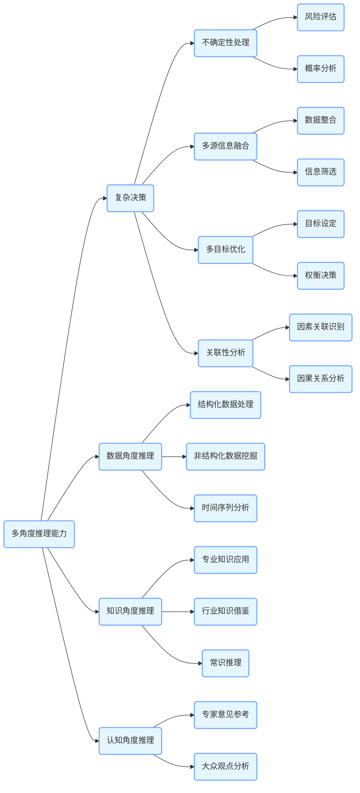

# 多角度推理能力在复杂决策中的应用研究

> 关键词：多角度推理能力、复杂决策、决策模型、信息融合、不确定性处理

> 摘要：本文聚焦于多角度推理能力在复杂决策中的应用。首先介绍了研究的背景、目的、预期读者和文档结构等内容。详细阐述了多角度推理和复杂决策的核心概念及相互联系，并给出相应的示意图和流程图。深入讲解了核心算法原理，结合Python代码说明具体操作步骤。同时，介绍了相关的数学模型和公式，并举例说明。通过项目实战，展示了多角度推理能力在复杂决策中的具体应用，包括开发环境搭建、源代码实现与解读。探讨了其实际应用场景，推荐了学习资源、开发工具框架以及相关论文著作。最后总结了未来发展趋势与挑战，提供了常见问题解答和扩展阅读参考资料，旨在为复杂决策提供更有效的方法和思路。

## 1. 背景介绍 
### 1.1 目的和范围
在当今社会，无论是商业领域的战略规划、医疗行业的疾病诊断，还是政府部门的政策制定，都面临着复杂的决策情境。这些决策往往涉及大量的不确定性、多源信息以及相互关联的因素。多角度推理能力作为一种综合分析和判断的能力，可以从不同的视角、层面和维度对问题进行深入思考，从而帮助决策者更全面、准确地理解问题，做出更合理的决策。

本研究的目的在于深入探讨多角度推理能力在复杂决策中的应用机制、方法和效果。具体范围包括多角度推理的核心概念、相关算法原理、数学模型，以及如何将其应用于实际的复杂决策场景中，同时分析其在实际应用中面临的挑战和未来发展趋势。

### 1.2 预期读者
本文的预期读者包括从事决策科学、人工智能、管理科学等领域的研究人员，他们可以从本文中获取关于多角度推理能力在复杂决策中应用的最新研究成果和方法；企业的管理人员和决策者，能够借鉴文中的理论和实践案例，提升自身在复杂决策中的能力和水平；以及对人工智能和决策科学感兴趣的爱好者，通过阅读本文可以了解该领域的基础知识和前沿动态。

### 1.3 文档结构概述
本文将按照以下结构进行组织：
- 核心概念与联系：介绍多角度推理能力和复杂决策的核心概念，以及它们之间的相互关系，并通过示意图和流程图进行直观展示。
- 核心算法原理 & 具体操作步骤：详细讲解多角度推理的核心算法原理，结合Python代码说明具体的操作步骤。
- 数学模型和公式 & 详细讲解 & 举例说明：介绍相关的数学模型和公式，并通过具体的例子进行详细说明。
- 项目实战：代码实际案例和详细解释说明：通过一个实际的项目案例，展示多角度推理能力在复杂决策中的具体应用，包括开发环境搭建、源代码实现和代码解读。
- 实际应用场景：探讨多角度推理能力在不同领域的实际应用场景。
- 工具和资源推荐：推荐相关的学习资源、开发工具框架和论文著作。
- 总结：未来发展趋势与挑战：总结多角度推理能力在复杂决策中的应用现状，分析未来的发展趋势和面临的挑战。
- 附录：常见问题与解答：提供常见问题的解答，帮助读者更好地理解和应用相关知识。
- 扩展阅读 & 参考资料：提供扩展阅读的建议和相关的参考资料。

### 1.4 术语表
#### 1.4.1 核心术语定义
- **多角度推理能力**：指从多个不同的视角、层面和维度对问题进行分析、推理和判断的能力，能够综合考虑各种因素和信息，以更全面、准确地理解问题。
- **复杂决策**：指在具有大量不确定性、多源信息、相互关联的因素以及多个目标的情况下进行的决策过程。
- **信息融合**：将来自多个不同来源的信息进行整合和处理，以获取更全面、准确的信息。
- **不确定性处理**：对决策过程中存在的不确定性因素进行分析、评估和处理的方法和技术。

#### 1.4.2 相关概念解释
- **决策模型**：用于描述决策过程和决策规则的数学模型或逻辑模型，帮助决策者在不同的情况下做出最优决策。
- **推理规则**：用于指导推理过程的规则和方法，根据已知的信息和条件推导出新的结论。
- **证据理论**：一种处理不确定性信息的数学理论，通过对证据的组合和分析来进行推理和决策。

#### 1.4.3 缩略词列表
- **AI**：Artificial Intelligence，人工智能
- **ML**：Machine Learning，机器学习
- **DL**：Deep Learning，深度学习
- **D-S**：Dempster-Shafer，证据理论

## 2. 核心概念与联系 

### 2.1 多角度推理能力的核心概念
多角度推理能力强调从多个不同的角度对问题进行思考和分析。这些角度可以包括但不限于以下几个方面：
- **数据角度**：从不同的数据来源和数据类型中提取信息，例如结构化数据、非结构化数据、时间序列数据等。
- **知识角度**：运用不同领域的知识和经验，如专业知识、行业知识、常识等。
- **认知角度**：考虑不同人的认知方式和思维模式，包括专家的意见、大众的观点等。

通过从多个角度进行推理，可以避免单一视角带来的局限性，更全面地了解问题的本质。

### 2.2 复杂决策的核心概念
复杂决策通常具有以下特点：
- **不确定性**：决策过程中存在大量的不确定性因素，如市场变化、技术发展、自然环境等。
- **多源信息**：需要考虑来自多个不同来源的信息，这些信息可能具有不同的格式、质量和可靠性。
- **多目标性**：决策往往需要同时满足多个不同的目标，这些目标之间可能存在冲突和矛盾。
- **关联性**：决策中的各个因素之间相互关联、相互影响，一个因素的变化可能会导致其他因素的改变。

### 2.3 核心概念的联系
多角度推理能力与复杂决策之间存在着密切的联系。在复杂决策中，由于决策问题的复杂性和不确定性，单一的推理方法往往难以满足决策的需求。多角度推理能力可以从多个不同的角度对决策问题进行分析和推理，帮助决策者更全面、准确地了解决策问题的本质，从而做出更合理的决策。

例如，在投资决策中，决策者可以从市场趋势、公司财务状况、行业竞争等多个角度进行分析，综合考虑各种因素的影响，从而做出更明智的投资决策。

### 2.4 文本示意图
```plaintext
多角度推理能力
|-- 数据角度推理
|   |-- 结构化数据处理
|   |-- 非结构化数据挖掘
|   |-- 时间序列分析
|-- 知识角度推理
|   |-- 专业知识应用
|   |-- 行业知识借鉴
|   |-- 常识推理
|-- 认知角度推理
|   |-- 专家意见参考
|   |-- 大众观点分析

复杂决策
|-- 不确定性处理
|   |-- 风险评估
|   |-- 概率分析
|-- 多源信息融合
|   |-- 数据整合
|   |-- 信息筛选
|-- 多目标优化
|   |-- 目标设定
|   |-- 权衡决策
|-- 关联性分析
|   |-- 因素关联识别
|   |-- 因果关系分析

联系：多角度推理能力为复杂决策提供全面、准确的信息和分析，帮助决策者应对复杂决策中的不确定性、多源信息、多目标性和关联性问题。
```

### 2.5 Mermaid流程图


## 3. 核心算法原理 & 具体操作步骤 

### 3.1 证据理论算法原理
证据理论（Dempster-Shafer理论）是一种处理不确定性信息的数学理论，它可以将多个不同来源的证据进行组合，从而得到更准确的结论。

#### 3.1.1 基本概念
- **识别框架**：用 $\Theta$ 表示，是所有可能的结果组成的集合。例如，在疾病诊断中，$\Theta$ 可以是所有可能的疾病种类。
- **基本概率分配函数（BPA）**：用 $m$ 表示，是一个从识别框架的幂集 $2^{\Theta}$ 到 $[0, 1]$ 的函数，满足 $\sum_{A \subseteq \Theta} m(A) = 1$，其中 $m(A)$ 表示对命题 $A$ 的信任程度。
- **信任函数**：$Bel(A) = \sum_{B \subseteq A} m(B)$，表示对命题 $A$ 的总信任程度。
- **似然函数**：$Pl(A) = 1 - Bel(\overline{A}) = \sum_{B \cap A \neq \varnothing} m(B)$，表示对命题 $A$ 的似然程度。

#### 3.1.2 Dempster组合规则
设 $m_1$ 和 $m_2$ 是两个独立的基本概率分配函数，它们的组合结果 $m = m_1 \oplus m_2$ 定义为：
$$m(A) = \frac{1}{1 - K} \sum_{B \cap C = A} m_1(B) m_2(C)$$
其中 $K = \sum_{B \cap C = \varnothing} m_1(B) m_2(C)$ 是冲突系数。

### 3.2 Python代码实现
```python
from itertools import product

def dempster_rule(m1, m2):
    # 计算冲突系数 K
    K = 0
    for B, C in product(m1.keys(), m2.keys()):
        if set(B).isdisjoint(set(C)):
            K += m1[B] * m2[C]
    # 计算组合后的基本概率分配函数
    m = {}
    for B, C in product(m1.keys(), m2.keys()):
        intersection = ''.join(sorted(set(B).intersection(set(C))))
        if intersection:
            if intersection not in m:
                m[intersection] = 0
            m[intersection] += m1[B] * m2[C]
    # 归一化
    normalization_factor = 1 - K
    for key in m:
        m[key] /= normalization_factor
    return m

# 示例使用
# 定义两个基本概率分配函数
m1 = {'A': 0.3, 'B': 0.6, 'AB': 0.1}
m2 = {'A': 0.4, 'B': 0.5, 'AB': 0.1}
# 组合两个基本概率分配函数
m_combined = dempster_rule(m1, m2)
print("组合后的基本概率分配函数:", m_combined)
```

### 3.3 具体操作步骤
1. **确定识别框架**：明确所有可能的结果，构建识别框架 $\Theta$。
2. **获取证据**：从不同的来源获取证据，并将其转化为基本概率分配函数。
3. **证据组合**：使用Dempster组合规则将多个基本概率分配函数进行组合，得到综合的基本概率分配函数。
4. **决策**：根据组合后的基本概率分配函数，计算信任函数和似然函数，进行决策。

## 4. 数学模型和公式 & 详细讲解 & 举例说明 

### 4.1 证据理论的数学模型
证据理论的核心是基本概率分配函数和Dempster组合规则。基本概率分配函数 $m$ 描述了对不同命题的信任程度，而Dempster组合规则用于将多个基本概率分配函数进行组合。

### 4.2 详细讲解
#### 4.2.1 基本概率分配函数
基本概率分配函数 $m$ 满足 $\sum_{A \subseteq \Theta} m(A) = 1$，其中 $m(A)$ 表示对命题 $A$ 的信任程度。例如，在一个疾病诊断问题中，识别框架 $\Theta = \{D_1, D_2, D_3\}$ 表示三种可能的疾病，基本概率分配函数 $m$ 可以是：
$$m(\{D_1\}) = 0.3, m(\{D_2\}) = 0.5, m(\{D_3\}) = 0.1, m(\{D_1, D_2\}) = 0.1$$
这表示对疾病 $D_1$ 的信任程度为 0.3，对疾病 $D_2$ 的信任程度为 0.5，对疾病 $D_3$ 的信任程度为 0.1，对疾病 $D_1$ 或 $D_2$ 的信任程度为 0.1。

#### 4.2.2 Dempster组合规则
Dempster组合规则用于将两个独立的基本概率分配函数 $m_1$ 和 $m_2$ 进行组合。组合后的基本概率分配函数 $m = m_1 \oplus m_2$ 由以下公式计算：
$$m(A) = \frac{1}{1 - K} \sum_{B \cap C = A} m_1(B) m_2(C)$$
其中 $K = \sum_{B \cap C = \varnothing} m_1(B) m_2(C)$ 是冲突系数。冲突系数 $K$ 表示两个证据之间的冲突程度，当 $K$ 接近 1 时，说明两个证据之间的冲突很大。

### 4.3 举例说明
假设在一个故障诊断问题中，有两个专家给出了关于故障原因的证据。识别框架 $\Theta = \{F_1, F_2, F_3\}$ 表示三种可能的故障原因。

专家 1 的基本概率分配函数为：
$$m_1(\{F_1\}) = 0.4, m_1(\{F_2\}) = 0.3, m_1(\{F_3\}) = 0.2, m_1(\{F_1, F_2\}) = 0.1$$

专家 2 的基本概率分配函数为：
$$m_2(\{F_1\}) = 0.3, m_2(\{F_2\}) = 0.4, m_2(\{F_3\}) = 0.2, m_2(\{F_1, F_2\}) = 0.1$$

首先计算冲突系数 $K$：
$$K = m_1(\{F_1\}) m_2(\{F_2\}) + m_1(\{F_1\}) m_2(\{F_3\}) + m_1(\{F_2\}) m_2(\{F_1\}) + m_1(\{F_2\}) m_2(\{F_3\}) + m_1(\{F_3\}) m_2(\{F_1\}) + m_1(\{F_3\}) m_2(\{F_2\})$$
$$= 0.4 \times 0.4 + 0.4 \times 0.2 + 0.3 \times 0.3 + 0.3 \times 0.2 + 0.2 \times 0.3 + 0.2 \times 0.4 = 0.43$$

然后计算组合后的基本概率分配函数 $m$：
对于 $A = \{F_1\}$：
$$\sum_{B \cap C = \{F_1\}} m_1(B) m_2(C) = m_1(\{F_1\}) m_2(\{F_1\}) + m_1(\{F_1\}) m_2(\{F_1, F_2\}) + m_1(\{F_1, F_2\}) m_2(\{F_1\})$$
$$= 0.4 \times 0.3 + 0.4 \times 0.1 + 0.1 \times 0.3 = 0.19$$
$$m(\{F_1\}) = \frac{0.19}{1 - 0.43} \approx 0.333$$

同理，可以计算出 $m(\{F_2\}) \approx 0.404$，$m(\{F_3\}) \approx 0.14$，$m(\{F_1, F_2\}) \approx 0.123$。

通过比较组合后的基本概率分配函数，可以得出故障原因更可能是 $F_2$。

## 5. 项目实战：代码实际案例和详细解释说明 

### 5.1  开发环境搭建
#### 5.1.1 Python环境安装
首先，需要安装Python环境。可以从Python官方网站（https://www.python.org/downloads/）下载适合自己操作系统的Python版本，并按照安装向导进行安装。

#### 5.1.2 必要库的安装
在本项目中，主要使用Python的基本库，不需要额外安装复杂的第三方库。如果需要进行数据可视化等操作，可以安装 `matplotlib` 库，使用以下命令进行安装：
```sh
pip install matplotlib
```

### 5.2  源代码详细实现和代码解读
以下是一个完整的项目代码示例，用于模拟多角度推理在故障诊断中的应用：
```python
from itertools import product

# Dempster组合规则
def dempster_rule(m1, m2):
    # 计算冲突系数 K
    K = 0
    for B, C in product(m1.keys(), m2.keys()):
        if set(B).isdisjoint(set(C)):
            K += m1[B] * m2[C]
    # 计算组合后的基本概率分配函数
    m = {}
    for B, C in product(m1.keys(), m2.keys()):
        intersection = ''.join(sorted(set(B).intersection(set(C))))
        if intersection:
            if intersection not in m:
                m[intersection] = 0
            m[intersection] += m1[B] * m2[C]
    # 归一化
    normalization_factor = 1 - K
    for key in m:
        m[key] /= normalization_factor
    return m

# 计算信任函数
def belief_function(m, A):
    belief = 0
    for B in m.keys():
        if set(B).issubset(set(A)):
            belief += m[B]
    return belief

# 计算似然函数
def plausibility_function(m, A):
    plausibility = 0
    for B in m.keys():
        if set(B).intersection(set(A)):
            plausibility += m[B]
    return plausibility

# 示例使用
# 定义识别框架
theta = {'F1', 'F2', 'F3'}
# 定义两个专家的基本概率分配函数
m1 = {'F1': 0.4, 'F2': 0.3, 'F3': 0.2, 'F1F2': 0.1}
m2 = {'F1': 0.3, 'F2': 0.4, 'F3': 0.2, 'F1F2': 0.1}
# 组合两个基本概率分配函数
m_combined = dempster_rule(m1, m2)
print("组合后的基本概率分配函数:", m_combined)

# 计算每个故障原因的信任函数和似然函数
for fault in theta:
    belief = belief_function(m_combined, fault)
    plausibility = plausibility_function(m_combined, fault)
    print(f"故障原因 {fault}: 信任函数 = {belief}, 似然函数 = {plausibility}")
```

### 5.3  代码解读与分析
#### 5.3.1 `dempster_rule` 函数
该函数实现了Dempster组合规则，用于将两个基本概率分配函数进行组合。首先计算冲突系数 $K$，然后根据Dempster组合规则计算组合后的基本概率分配函数，并进行归一化处理。

#### 5.3.2 `belief_function` 函数
该函数用于计算给定基本概率分配函数下，某个命题的信任函数。信任函数表示对该命题的总信任程度。

#### 5.3.3 `plausibility_function` 函数
该函数用于计算给定基本概率分配函数下，某个命题的似然函数。似然函数表示对该命题的似然程度。

#### 5.3.4 主程序
主程序中，首先定义了识别框架和两个专家的基本概率分配函数，然后调用 `dempster_rule` 函数将两个基本概率分配函数进行组合，得到组合后的基本概率分配函数。最后，计算每个故障原因的信任函数和似然函数，并输出结果。

通过比较每个故障原因的信任函数和似然函数，可以判断哪个故障原因更可能发生。

## 6. 实际应用场景 
### 6.1 医疗诊断
在医疗诊断中，医生需要综合考虑患者的症状、体征、检查结果等多方面的信息，做出准确的诊断。多角度推理能力可以帮助医生从不同的角度对患者的病情进行分析，例如从疾病的病理机制、临床经验、遗传学等角度。同时，证据理论可以用于整合不同医生的诊断意见和各种检查结果，提高诊断的准确性。

### 6.2 金融投资
在金融投资领域，投资者需要考虑市场趋势、公司财务状况、行业竞争等多个因素，做出合理的投资决策。多角度推理能力可以帮助投资者从宏观经济、行业发展、公司基本面等多个角度进行分析，同时结合证据理论对不同来源的信息进行融合，降低投资风险。

### 6.3 智能交通
在智能交通系统中，需要对交通流量、交通事故、道路状况等多方面的信息进行实时监测和分析，以实现交通的优化和管理。多角度推理能力可以从交通工程、计算机科学、统计学等多个角度对交通问题进行研究，同时运用证据理论对多源的交通信息进行融合，提高交通决策的准确性和效率。

### 6.4 环境监测
在环境监测中，需要对空气质量、水质、土壤污染等多个指标进行监测和分析，以评估环境质量和制定环境保护策略。多角度推理能力可以从环境科学、生态学、地理学等多个角度对环境问题进行研究，同时利用证据理论对不同监测站点的数据进行融合，提高环境监测的准确性和可靠性。

## 7. 工具和资源推荐
### 7.1 学习资源推荐
#### 7.1.1 书籍推荐
- 《人工智能：一种现代的方法》：这是一本经典的人工智能教材，涵盖了人工智能的各个领域，包括推理、决策等方面的内容。
- 《决策理论与方法》：详细介绍了决策科学的基本理论和方法，包括复杂决策的建模和求解。
- 《证据理论及其应用》：专门介绍证据理论的原理、方法和应用，对于深入理解证据理论在多角度推理中的应用有很大帮助。

#### 7.1.2 在线课程
- Coursera上的“人工智能基础”课程：由知名高校的教授授课，系统介绍人工智能的基础知识和方法。
- edX上的“决策分析”课程：讲解决策分析的基本原理和方法，包括多属性决策、不确定性决策等内容。

#### 7.1.3 技术博客和网站
- Medium：上面有很多关于人工智能、决策科学等领域的技术文章和研究成果分享。
- arXiv：提供最新的学术论文预印本，对于了解该领域的前沿动态非常有帮助。

### 7.2 开发工具框架推荐
#### 7.2.1 IDE和编辑器
- PyCharm：一款专业的Python集成开发环境，提供丰富的代码编辑、调试和项目管理功能。
- Jupyter Notebook：一种交互式的开发环境，适合进行数据分析和代码演示。

#### 7.2.2 调试和性能分析工具
- PDB：Python自带的调试工具，可以帮助开发者定位代码中的问题。
- cProfile：Python的性能分析工具，可以分析代码的运行时间和资源占用情况。

#### 7.2.3 相关框架和库
- NumPy：用于高效的数值计算和数组操作。
- Pandas：用于数据处理和分析，提供了丰富的数据结构和数据操作方法。

### 7.3 相关论文著作推荐
#### 7.3.1 经典论文
- "A Mathematical Theory of Evidence" by Glenn Shafer：证据理论的经典论文，奠定了证据理论的基础。
- "Decision Making with Multiple Objectives: Preferences and Value Trade-Offs" by Ralph L. Keeney and Howard Raiffa：多目标决策领域的经典著作，介绍了多目标决策的基本理论和方法。

#### 7.3.2 最新研究成果
可以通过学术搜索引擎（如Google Scholar、IEEE Xplore等）搜索关于多角度推理能力在复杂决策中应用的最新研究论文，了解该领域的前沿动态。

#### 7.3.3 应用案例分析
- 一些知名企业的技术博客和研究报告中会分享他们在实际项目中应用多角度推理和复杂决策的案例，可以从中学习到实际应用的经验和方法。

## 8. 总结：未来发展趋势与挑战
### 8.1 未来发展趋势
- **与人工智能技术的深度融合**：随着人工智能技术的不断发展，多角度推理能力将与机器学习、深度学习等技术深度融合，实现更智能、更高效的复杂决策。例如，利用深度学习模型自动提取多源信息中的特征，然后结合证据理论进行信息融合和决策。
- **跨领域应用的拓展**：多角度推理能力将在更多的领域得到应用，如教育、文化、艺术等。通过综合考虑不同领域的知识和信息，可以为这些领域的决策提供更全面、深入的支持。
- **实时决策支持**：在一些实时性要求较高的场景中，如金融交易、智能交通等，多角度推理能力将朝着实时决策支持的方向发展。通过优化算法和提高计算效率，实现对多源信息的实时处理和决策。

### 8.2 挑战
- **信息质量和可靠性**：在复杂决策中，多源信息的质量和可靠性往往参差不齐。如何对信息进行有效的筛选和评估，确保推理结果的准确性，是一个亟待解决的问题。
- **计算复杂度**：随着信息源的增加和问题复杂度的提高，多角度推理的计算复杂度会显著增加。如何设计高效的算法和数据结构，降低计算成本，是提高推理效率的关键。
- **不确定性处理的局限性**：虽然证据理论等方法可以处理一定程度的不确定性，但在面对高度复杂和模糊的不确定性时，仍然存在局限性。如何进一步完善不确定性处理方法，提高决策的可靠性，是未来研究的重要方向。

## 9. 附录：常见问题与解答
### 9.1 什么是多角度推理能力？
多角度推理能力是指从多个不同的视角、层面和维度对问题进行分析、推理和判断的能力，能够综合考虑各种因素和信息，以更全面、准确地理解问题。

### 9.2 证据理论有哪些局限性？
证据理论的局限性主要包括：
- 冲突处理问题：当证据之间的冲突较大时，Dempster组合规则可能会产生不合理的结果。
- 计算复杂度：随着识别框架的增大，证据理论的计算复杂度会显著增加。
- 基本概率分配函数的确定：基本概率分配函数的确定往往依赖于专家的主观判断，缺乏客观的方法。

### 9.3 如何提高多角度推理的效率？
可以从以下几个方面提高多角度推理的效率：
- 优化算法：采用更高效的算法和数据结构，降低计算复杂度。
- 并行计算：利用多核处理器或分布式计算平台，实现并行计算，提高计算速度。
- 信息筛选：在推理前对多源信息进行筛选和预处理，减少不必要的信息干扰。

### 9.4 多角度推理能力在复杂决策中的应用前景如何？
多角度推理能力在复杂决策中具有广阔的应用前景。随着社会的发展，决策问题越来越复杂，单一的推理方法往往难以满足决策的需求。多角度推理能力可以从多个不同的角度对决策问题进行分析和推理，帮助决策者更全面、准确地了解决策问题的本质，从而做出更合理的决策。未来，多角度推理能力将与人工智能技术深度融合，在更多的领域得到应用。

## 10. 扩展阅读 & 参考资料
### 10.1 扩展阅读
- 《智能决策支持系统》：介绍智能决策支持系统的原理、方法和应用，对于进一步了解复杂决策的技术支持有很大帮助。
- 《数据挖掘：概念与技术》：讲解数据挖掘的基本概念、算法和应用，对于多源信息的处理和分析有一定的参考价值。

### 10.2 参考资料
- Shafer, Glenn. A Mathematical Theory of Evidence. Princeton University Press, 1976.
- Keeney, Ralph L., and Howard Raiffa. Decision Making with Multiple Objectives: Preferences and Value Trade-Offs. Cambridge University Press, 1993.

作者：AI天才研究院/AI Genius Institute & 禅与计算机程序设计艺术 /Zen And The Art of Computer Programming