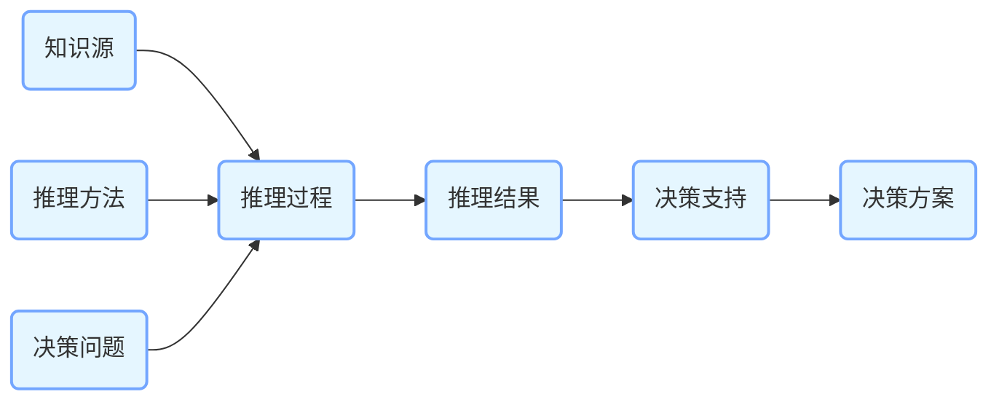

# 多角度推理能力在复杂决策支持中的作用分析

> 关键词：多角度推理能力、复杂决策支持、推理方法、决策模型、应用场景

> 摘要：本文深入探讨了多角度推理能力在复杂决策支持中的作用。首先介绍了研究的背景、目的、预期读者等信息，明确了文档结构和相关术语。接着阐述了多角度推理的核心概念、原理和架构，通过Mermaid流程图进行直观展示。详细讲解了核心算法原理，并给出Python源代码示例。运用数学模型和公式对推理过程进行分析，辅以实际举例说明。通过项目实战，从开发环境搭建、源代码实现到代码解读，全面展示了多角度推理在实际中的应用。分析了其在不同领域的实际应用场景，推荐了相关的学习资源、开发工具框架和论文著作。最后总结了未来发展趋势与挑战，解答了常见问题，并提供了扩展阅读和参考资料，旨在为理解和应用多角度推理能力提供全面且深入的指导。

## 1. 背景介绍 
### 1.1 目的和范围
在当今复杂多变的社会和经济环境中，决策所面临的问题日益复杂，涉及众多的因素和不确定性。单一角度的推理往往无法全面、准确地评估各种情况，从而导致决策的偏差和失误。本研究的目的在于深入分析多角度推理能力在复杂决策支持中的作用，探讨如何运用多角度推理提高决策的科学性、合理性和有效性。

研究范围涵盖了多角度推理的基本概念、原理、算法，以及在不同领域（如商业、医疗、金融等）复杂决策中的应用。通过理论分析和实际案例研究，揭示多角度推理能力与复杂决策支持之间的内在联系和作用机制。

### 1.2 预期读者
本文的预期读者包括从事决策科学、人工智能、管理科学等领域的研究人员和学者，他们可以从本文中获取关于多角度推理在复杂决策中的最新研究成果和理论方法；企业的管理者和决策者，能够通过本文了解如何运用多角度推理提高企业决策的质量和效率；以及对人工智能和决策技术感兴趣的技术爱好者，可借此深入了解相关的技术原理和应用场景。

### 1.3 文档结构概述
本文共分为十个部分。第一部分为背景介绍，阐述了研究的目的、范围、预期读者和文档结构概述，并给出了相关术语的定义和解释。第二部分介绍多角度推理的核心概念与联系，包括原理和架构，并通过Mermaid流程图进行直观展示。第三部分详细讲解核心算法原理，并使用Python源代码进行说明。第四部分运用数学模型和公式对推理过程进行分析，并举例说明。第五部分通过项目实战，介绍开发环境搭建、源代码实现和代码解读。第六部分分析多角度推理在实际中的应用场景。第七部分推荐相关的学习资源、开发工具框架和论文著作。第八部分总结未来发展趋势与挑战。第九部分解答常见问题。第十部分提供扩展阅读和参考资料。

### 1.4 术语表
#### 1.4.1 核心术语定义
- **多角度推理能力**：指从多个不同的维度、视角和层面进行逻辑推理和分析的能力，综合考虑各种因素和信息，以更全面、深入地理解问题和得出结论。
- **复杂决策支持**：针对具有多个目标、多种约束条件、大量不确定性因素和复杂相互关系的决策问题，提供系统的方法、技术和工具，以辅助决策者做出更优决策的过程。
- **推理方法**：用于从已知信息推导出新信息的规则和方式，如演绎推理、归纳推理、类比推理等。
- **决策模型**：对决策问题进行抽象和简化，用数学公式、逻辑关系或计算机程序等形式描述决策过程和决策要素之间关系的模型。

#### 1.4.2 相关概念解释
- **不确定性**：在决策过程中，由于信息不完全、环境变化等原因，导致对决策结果的预测存在一定的模糊性和不可预测性。
- **多目标优化**：决策问题中存在多个相互冲突或关联的目标，需要在这些目标之间进行权衡和协调，以找到最优或满意的解决方案。
- **信息融合**：将来自不同来源、不同类型的信息进行整合和处理，以提高信息的质量和可用性，为决策提供更全面、准确的依据。

#### 1.4.3 缩略词列表
- AI：Artificial Intelligence，人工智能
- DSS：Decision Support System，决策支持系统
- MCDM：Multi-Criteria Decision Making，多准则决策

## 2. 核心概念与联系 
### 核心概念原理
多角度推理能力的核心在于打破单一思维模式的局限，从多个方面对问题进行分析和推理。它基于不同的知识体系、经验和视角，运用多种推理方法，对决策问题进行全面的审视。

例如，在商业决策中，可以从市场需求、竞争态势、技术发展、财务状况等多个角度进行推理。市场需求角度可以通过市场调研、数据分析等方法了解消费者的需求和偏好，预测市场趋势；竞争态势角度则需要分析竞争对手的产品、价格、营销策略等，评估自身的竞争优势和劣势；技术发展角度关注行业内的新技术、新产品，判断其对企业业务的影响；财务状况角度则通过财务报表分析企业的盈利能力、偿债能力、资金流动性等。

### 架构的文本示意图
```plaintext
多角度推理能力架构
|-- 知识源
|   |-- 领域知识
|   |-- 经验知识
|   |-- 数据知识
|-- 推理方法
|   |-- 演绎推理
|   |-- 归纳推理
|   |-- 类比推理
|   |-- 其他推理方法
|-- 决策问题
|   |-- 问题描述
|   |-- 约束条件
|   |-- 目标函数
|-- 推理过程
|   |-- 信息收集与整合
|   |-- 多角度分析
|   |-- 推理结果生成
|-- 决策支持
|   |-- 方案评估
|   |-- 建议生成
|   |-- 决策优化
```

### Mermaid流程图


这个流程图展示了多角度推理能力的基本架构和工作流程。知识源、推理方法和决策问题作为输入，经过推理过程生成推理结果，推理结果用于提供决策支持，最终得出决策方案。

## 3. 核心算法原理 & 具体操作步骤 
### 核心算法原理
在多角度推理中，我们可以采用一种基于证据理论的算法。证据理论（Dempster-Shafer theory）是一种处理不确定性信息的数学方法，它允许我们对不同的证据进行组合和推理。

假设我们有多个证据源，每个证据源可以提供关于某个命题的支持程度。我们可以用信任函数（Belief function）和似然函数（Plausibility function）来表示证据的支持和可能性。

设 $\Theta$ 是一个有限的命题集合，称为识别框架。对于 $\Theta$ 的任意子集 $A$，信任函数 $Bel(A)$ 表示对 $A$ 的信任程度，似然函数 $Pl(A)$ 表示 $A$ 的似然程度，它们的定义如下：

$$Bel(A) = \sum_{B \subseteq A} m(B)$$

$$Pl(A) = 1 - Bel(\overline{A})$$

其中，$m$ 是基本概率赋值（Basic Probability Assignment，BPA），它满足 $\sum_{B \subseteq \Theta} m(B) = 1$ 且 $m(\varnothing) = 0$。

### 具体操作步骤
1. **证据收集**：从不同的角度收集关于决策问题的证据，每个证据可以表示为一个基本概率赋值。
2. **证据组合**：使用Dempster组合规则将多个证据进行组合。Dempster组合规则定义如下：

设 $m_1$ 和 $m_2$ 是两个基本概率赋值，它们的组合结果 $m = m_1 \oplus m_2$ 为：

$$m(A) = \frac{1}{1 - K} \sum_{B \cap C = A} m_1(B) m_2(C)$$

其中，$K = \sum_{B \cap C = \varnothing} m_1(B) m_2(C)$ 是冲突系数。

3. **推理结果生成**：根据组合后的基本概率赋值，计算每个命题的信任函数和似然函数，从而得到推理结果。

### Python源代码示例
```python
from itertools import product

def dempster_rule(m1, m2):
    """
    实现Dempster组合规则
    :param m1: 第一个基本概率赋值
    :param m2: 第二个基本概率赋值
    :return: 组合后的基本概率赋值
    """
    m = {}
    K = 0
    for A, B in product(m1.keys(), m2.keys()):
        if set(A).intersection(set(B)):
            key = ''.join(sorted(set(A).intersection(set(B))))
            if key not in m:
                m[key] = 0
            m[key] += m1[A] * m2[B]
        else:
            K += m1[A] * m2[B]
    # 归一化
    for key in m:
        m[key] = m[key] / (1 - K)
    return m

# 示例基本概率赋值
m1 = {'A': 0.3, 'B': 0.5, 'AB': 0.2}
m2 = {'A': 0.4, 'B': 0.4, 'AB': 0.2}

# 组合证据
m_combined = dempster_rule(m1, m2)
print("组合后的基本概率赋值:", m_combined)
```

这段代码实现了Dempster组合规则，通过输入两个基本概率赋值，输出组合后的基本概率赋值。

## 4. 数学模型和公式 & 详细讲解 & 举例说明 
### 数学模型和公式
#### 信任函数和似然函数
如前所述，信任函数 $Bel(A)$ 和似然函数 $Pl(A)$ 的定义为：

$$Bel(A) = \sum_{B \subseteq A} m(B)$$

$$Pl(A) = 1 - Bel(\overline{A})$$

其中，$A$ 是识别框架 $\Theta$ 的子集，$m$ 是基本概率赋值。

#### Dempster组合规则
设 $m_1$ 和 $m_2$ 是两个基本概率赋值，它们的组合结果 $m = m_1 \oplus m_2$ 为：

$$m(A) = \frac{1}{1 - K} \sum_{B \cap C = A} m_1(B) m_2(C)$$

其中，$K = \sum_{B \cap C = \varnothing} m_1(B) m_2(C)$ 是冲突系数。

### 详细讲解
- **信任函数**：信任函数 $Bel(A)$ 表示对命题 $A$ 的完全信任程度，它是所有支持 $A$ 的子集的基本概率赋值之和。例如，如果我们有一个识别框架 $\Theta = \{A, B\}$，基本概率赋值 $m(\{A\}) = 0.3$，$m(\{B\}) = 0.5$，$m(\{A, B\}) = 0.2$，那么 $Bel(\{A\}) = m(\{A\}) = 0.3$，$Bel(\{A, B\}) = m(\{A\}) + m(\{B\}) + m(\{A, B\}) = 1$。
- **似然函数**：似然函数 $Pl(A)$ 表示命题 $A$ 的似然程度，即 $A$ 可能为真的程度。它等于 $1$ 减去对 $A$ 的补集的信任程度。例如，$Pl(\{A\}) = 1 - Bel(\{B\}) = 1 - 0.5 = 0.5$。
- **Dempster组合规则**：Dempster组合规则用于将多个证据进行组合。它通过计算不同证据之间的交集，并将相应的基本概率赋值相乘，然后对结果进行归一化处理，以消除冲突。冲突系数 $K$ 表示两个证据之间的冲突程度，当 $K$ 接近 $1$ 时，说明两个证据之间的冲突很大，组合结果可能不太可靠。

### 举例说明
假设我们要对一个产品的市场前景进行评估，识别框架 $\Theta = \{Good, Bad\}$。有两个专家分别给出了他们的意见，对应的基本概率赋值如下：

专家1：$m_1(\{Good\}) = 0.6$，$m_1(\{Bad\}) = 0.2$，$m_1(\{Good, Bad\}) = 0.2$

专家2：$m_2(\{Good\}) = 0.7$，$m_2(\{Bad\}) = 0.1$，$m_2(\{Good, Bad\}) = 0.2$

首先，计算冲突系数 $K$：

$$K = m_1(\{Good\}) m_2(\{Bad\}) + m_1(\{Bad\}) m_2(\{Good\}) = 0.6 \times 0.1 + 0.2 \times 0.7 = 0.2$$

然后，使用Dempster组合规则计算组合后的基本概率赋值：

$$m(\{Good\}) = \frac{1}{1 - 0.2} (m_1(\{Good\}) m_2(\{Good\}) + m_1(\{Good\}) m_2(\{Good, Bad\}) + m_1(\{Good, Bad\}) m_2(\{Good\}))$$

$$= \frac{1}{0.8} (0.6 \times 0.7 + 0.6 \times 0.2 + 0.2 \times 0.7) = 0.8$$

$$m(\{Bad\}) = \frac{1}{1 - 0.2} (m_1(\{Bad\}) m_2(\{Bad\}) + m_1(\{Bad\}) m_2(\{Good, Bad\}) + m_1(\{Good, Bad\}) m_2(\{Bad\}))$$

$$= \frac{1}{0.8} (0.2 \times 0.1 + 0.2 \times 0.2 + 0.2 \times 0.1) = 0.1$$

$$m(\{Good, Bad\}) = \frac{1}{1 - 0.2} (m_1(\{Good, Bad\}) m_2(\{Good, Bad\})) = \frac{1}{0.8} (0.2 \times 0.2) = 0.1$$

最后，计算信任函数和似然函数：

$Bel(\{Good\}) = m(\{Good\}) = 0.8$

$Pl(\{Good\}) = 1 - Bel(\{Bad\}) = 1 - 0.1 = 0.9$

这表明，综合两个专家的意见，我们对产品市场前景为“Good”的信任程度为 $0.8$，似然程度为 $0.9$。

## 5. 项目实战：代码实际案例和详细解释说明 
### 5.1  开发环境搭建
为了实现多角度推理在复杂决策支持中的应用，我们可以使用Python作为开发语言。以下是开发环境搭建的步骤：

1. **安装Python**：从Python官方网站（https://www.python.org/downloads/）下载并安装Python 3.x版本。
2. **安装必要的库**：使用pip命令安装所需的库，如`numpy`、`pandas`等。

```bash
pip install numpy pandas
```

### 5.2  源代码详细实现和代码解读
假设我们要解决一个投资决策问题，有三个投资项目 $A$、$B$、$C$，我们从市场前景、财务状况、技术实力三个角度进行评估。每个角度都有一个基本概率赋值，我们使用Dempster组合规则将这些证据进行组合，最终得到每个项目的综合评估结果。

```python
import numpy as np
import pandas as pd

def dempster_rule(m1, m2):
    """
    实现Dempster组合规则
    :param m1: 第一个基本概率赋值
    :param m2: 第二个基本概率赋值
    :return: 组合后的基本概率赋值
    """
    m = {}
    K = 0
    for A, B in product(m1.keys(), m2.keys()):
        if set(A).intersection(set(B)):
            key = ''.join(sorted(set(A).intersection(set(B))))
            if key not in m:
                m[key] = 0
            m[key] += m1[A] * m2[B]
        else:
            K += m1[A] * m2[B]
    # 归一化
    for key in m:
        m[key] = m[key] / (1 - K)
    return m

# 市场前景角度的基本概率赋值
m_market = {'A': 0.3, 'B': 0.4, 'C': 0.2, 'ABC': 0.1}

# 财务状况角度的基本概率赋值
m_finance = {'A': 0.4, 'B': 0.3, 'C': 0.2, 'ABC': 0.1}

# 技术实力角度的基本概率赋值
m_technology = {'A': 0.3, 'B': 0.3, 'C': 0.3, 'ABC': 0.1}

# 组合市场前景和财务状况的证据
m_market_finance = dempster_rule(m_market, m_finance)

# 组合市场前景、财务状况和技术实力的证据
m_combined = dempster_rule(m_market_finance, m_technology)

# 输出结果
print("组合后的基本概率赋值:", m_combined)

# 计算每个项目的信任函数
def belief_function(m, item):
    bel = 0
    for key in m:
        if item in key:
            bel += m[key]
    return bel

# 计算每个项目的信任函数值
bel_A = belief_function(m_combined, 'A')
bel_B = belief_function(m_combined, 'B')
bel_C = belief_function(m_combined, 'C')

# 输出每个项目的信任函数值
print("项目A的信任函数值:", bel_A)
print("项目B的信任函数值:", bel_B)
print("项目C的信任函数值:", bel_C)

# 根据信任函数值进行决策
projects = ['A', 'B', 'C']
beliefs = [bel_A, bel_B, bel_C]
best_project = projects[np.argmax(beliefs)]
print("最优投资项目:", best_project)
```

### 5.3  代码解读与分析
- **Dempster组合规则函数**：`dempster_rule` 函数实现了Dempster组合规则，用于将两个基本概率赋值进行组合。它首先计算冲突系数 $K$，然后根据规则计算组合后的基本概率赋值，并进行归一化处理。
- **证据组合过程**：我们分别定义了市场前景、财务状况和技术实力三个角度的基本概率赋值，然后使用 `dempster_rule` 函数将它们依次组合，得到最终的组合结果。
- **信任函数计算**：`belief_function` 函数用于计算每个项目的信任函数值，它遍历组合后的基本概率赋值，将包含该项目的子集的基本概率赋值相加。
- **决策过程**：根据每个项目的信任函数值，我们使用 `np.argmax` 函数找到信任函数值最大的项目，将其作为最优投资项目。

通过这个项目实战，我们展示了如何使用多角度推理来解决复杂的投资决策问题。

## 6. 实际应用场景 
### 商业决策
在商业领域，多角度推理能力在市场进入决策、产品研发决策、战略规划等方面具有重要作用。例如，在市场进入决策中，企业需要从市场需求、竞争态势、政策法规、文化差异等多个角度进行分析。市场需求角度可以通过市场调研了解目标市场的规模、增长趋势、消费者需求等；竞争态势角度需要分析竞争对手的市场份额、产品特点、营销策略等；政策法规角度关注目标市场的相关政策、法规和行业标准；文化差异角度则考虑不同地区的文化习俗、消费习惯等因素。通过综合考虑这些因素，企业可以做出更明智的市场进入决策。

### 医疗决策
在医疗领域，多角度推理可用于疾病诊断、治疗方案选择等方面。在疾病诊断中，医生需要从患者的症状、体征、病史、实验室检查结果、影像学检查结果等多个角度进行分析。不同的症状和体征可能提示不同的疾病，病史可以帮助医生了解患者的既往健康状况和疾病史，实验室检查和影像学检查结果则提供了更客观的诊断依据。通过综合分析这些信息，医生可以更准确地诊断疾病，并制定合适的治疗方案。

### 金融决策
在金融领域，多角度推理能力在投资决策、风险管理等方面发挥着重要作用。在投资决策中，投资者需要从宏观经济环境、行业发展趋势、公司基本面、财务指标、市场情绪等多个角度进行分析。宏观经济环境影响着整个金融市场的走势，行业发展趋势决定了不同行业的投资前景，公司基本面包括公司的业务模式、管理团队、市场竞争力等，财务指标如盈利能力、偿债能力、现金流等反映了公司的财务状况，市场情绪则影响着投资者的买卖行为。通过综合考虑这些因素，投资者可以做出更合理的投资决策。

### 交通规划决策
在交通规划领域，多角度推理可用于城市交通网络规划、公交线路优化、交通枢纽布局等方面。在城市交通网络规划中，需要从人口分布、土地利用、交通流量、环境影响、经济成本等多个角度进行分析。人口分布和土地利用决定了交通需求的分布，交通流量数据可以帮助了解现有交通状况，环境影响考虑交通建设对生态环境的影响，经济成本则涉及到交通建设和运营的费用。通过综合考虑这些因素，可以制定出更科学、合理的交通规划方案。

## 7. 工具和资源推荐
### 7.1 学习资源推荐
#### 7.1.1 书籍推荐
- 《人工智能：一种现代的方法》（Artificial Intelligence: A Modern Approach）：这本书是人工智能领域的经典教材，全面介绍了人工智能的基本概念、方法和技术，包括推理、搜索、机器学习、自然语言处理等方面的内容。
- 《决策分析原理与应用》：系统阐述了决策分析的基本理论和方法，包括多准则决策、风险决策、不确定性决策等，对理解复杂决策支持有很大帮助。
- 《证据理论及其应用》：专门介绍证据理论的原理、算法和应用，对于深入学习多角度推理中的证据组合方法有重要参考价值。

#### 7.1.2 在线课程
- Coursera上的“人工智能基础”课程：由知名高校的教授授课，涵盖了人工智能的基础知识和核心技术，包括推理和决策部分。
- edX上的“决策科学与分析”课程：讲解决策科学的基本原理和方法，通过实际案例介绍如何运用决策模型和工具解决复杂决策问题。
- 中国大学MOOC上的“人工智能导论”课程：国内高校的优质课程，对人工智能的各个领域进行了全面介绍，适合初学者入门。

#### 7.1.3 技术博客和网站
- Medium：上面有很多关于人工智能、决策科学的技术博客文章，作者来自不同的领域和背景，分享了他们的研究成果和实践经验。
- AI社区：专注于人工智能领域的技术交流和分享，提供了大量的技术文章、教程和案例分析。
- 决策科学论坛：专门讨论决策科学相关问题的论坛，用户可以在这里交流决策理论、方法和应用的经验。

### 7.2 开发工具框架推荐
#### 7.2.1 IDE和编辑器
- PyCharm：是一款专门为Python开发设计的集成开发环境，具有强大的代码编辑、调试、代码分析等功能，适合开发复杂的Python项目。
- Jupyter Notebook：以交互式的方式编写和运行代码，非常适合进行数据探索、模型实验和结果展示，对于多角度推理的实验和验证很有帮助。
- Visual Studio Code：一款轻量级的代码编辑器，支持多种编程语言和插件扩展，可用于快速开发和调试代码。

#### 7.2.2 调试和性能分析工具
- PDB：Python自带的调试器，可以帮助开发者逐行调试代码，查找和解决代码中的问题。
- cProfile：Python的性能分析工具，可以统计代码中各个函数的执行时间和调用次数，帮助开发者找出性能瓶颈。
- Py-Spy：一个轻量级的Python性能分析工具，可以实时监控Python程序的性能，生成火焰图等可视化结果。

#### 7.2.3 相关框架和库
- NumPy：用于科学计算的Python库，提供了高效的数组操作和数学函数，在多角度推理的数值计算中非常有用。
- Pandas：用于数据处理和分析的Python库，提供了数据结构和数据操作方法，方便对决策数据进行整理和分析。
- Scikit-learn：一个强大的机器学习库，包含了多种机器学习算法和工具，可用于构建决策模型和进行数据分析。

### 7.3 相关论文著作推荐
#### 7.3.1 经典论文
- "A Mathematical Theory of Evidence" by Glenn Shafer：这是证据理论的经典论文，详细阐述了证据理论的基本概念、原理和算法。
- "Multi-Attribute Decision Making: Methods and Applications" by C. L. Hwang and K. Yoon：该论文系统介绍了多属性决策的方法和应用，是多准则决策领域的重要参考文献。
- "Decision Analysis: Introductory Lectures on Choices Under Uncertainty" by Ronald A. Howard：对决策分析的基本理论和方法进行了深入探讨，具有很高的学术价值。

#### 7.3.2 最新研究成果
- 可以通过学术搜索引擎（如Google Scholar、IEEE Xplore、ACM Digital Library等）搜索关于多角度推理、复杂决策支持的最新研究论文。关注顶级学术会议（如AAAI、IJCAI、ICDM等）上的相关研究成果，了解该领域的最新动态和发展趋势。

#### 7.3.3 应用案例分析
- 一些商业和管理类的学术期刊（如《哈佛商业评论》、《管理世界》等）会发表一些关于决策案例分析的文章，可以从中学习到多角度推理在实际商业决策中的应用方法和经验。
- 行业报告和研究机构发布的报告也会包含一些实际应用案例，例如麦肯锡、波士顿咨询等公司发布的行业研究报告。

## 8. 总结：未来发展趋势与挑战
### 未来发展趋势
- **与大数据和人工智能的深度融合**：随着大数据技术的发展，决策过程中可以获取的信息越来越多。多角度推理能力将与大数据分析、机器学习、深度学习等人工智能技术深度融合，利用大数据提供更丰富的证据和信息，通过人工智能算法实现更高效、准确的推理和决策。例如，利用深度学习模型对海量的市场数据进行分析，提取有价值的信息，为商业决策提供支持。
- **跨领域应用的拓展**：多角度推理能力将在更多的领域得到应用，并且会涉及到不同领域之间的交叉融合。例如，在智慧城市建设中，需要综合考虑城市规划、交通管理、能源供应、环境保护等多个领域的因素，多角度推理可以帮助解决这些复杂的跨领域决策问题。
- **实时决策支持**：在一些实时性要求较高的场景（如金融交易、工业控制等）中，需要快速做出决策。未来，多角度推理技术将朝着实时决策支持的方向发展，提高决策的及时性和响应速度。通过优化算法和架构，实现对实时数据的快速处理和推理。

### 挑战
- **数据质量和不确定性处理**：决策过程中所依赖的数据质量直接影响推理结果的准确性。然而，实际数据往往存在噪声、缺失值、不一致性等问题，并且具有一定的不确定性。如何有效地处理这些数据质量问题和不确定性，是多角度推理面临的一个重要挑战。
- **推理模型的可解释性**：随着人工智能技术的发展，一些复杂的推理模型（如深度学习模型）虽然具有很高的性能，但往往缺乏可解释性。在复杂决策中，决策者需要了解推理过程和结果的依据，以便做出合理的决策。因此，如何提高推理模型的可解释性是一个亟待解决的问题。
- **计算资源和效率**：多角度推理需要处理大量的数据和进行复杂的计算，对计算资源的要求较高。在实际应用中，如何在有限的计算资源下提高推理效率，是需要克服的一个挑战。

## 9. 附录：常见问题与解答
### 问题1：多角度推理与单一角度推理有什么区别？
单一角度推理只从一个方面或维度对问题进行分析和推理，往往忽略了其他重要的因素和信息，容易导致决策的片面性和局限性。而多角度推理从多个不同的角度对问题进行全面的审视，综合考虑各种因素和信息，能够更准确地把握问题的本质，提高决策的科学性和合理性。

### 问题2：如何确定多角度推理中的证据源？
确定证据源需要根据决策问题的性质和特点来进行。一般可以从以下几个方面考虑：领域知识、经验知识、数据知识等。例如，在商业决策中，可以将市场调研数据、行业报告、专家意见等作为证据源；在医疗决策中，患者的症状、体征、实验室检查结果等可以作为证据源。同时，还需要考虑证据源的可靠性和相关性，选择具有代表性和可信度的证据源。

### 问题3：Dempster组合规则在证据冲突较大时是否适用？
当证据之间的冲突较大时，Dempster组合规则可能会产生不合理的结果。因为Dempster组合规则在处理冲突时，是通过归一化的方式将冲突部分分配到其他非空子集上，这可能会导致某些子集的基本概率赋值过大或过小。在这种情况下，可以考虑使用其他的证据组合方法，如Yager组合规则、Smets组合规则等，这些方法对冲突的处理方式有所不同，可以在一定程度上缓解冲突带来的影响。

### 问题4：如何评估多角度推理的效果？
可以从以下几个方面评估多角度推理的效果：决策结果的准确性、决策的合理性、决策的效率等。决策结果的准确性可以通过与实际情况进行对比来评估，看推理结果是否符合实际情况；决策的合理性可以从多个方面进行考量，如是否考虑了所有重要的因素、是否平衡了不同的目标等；决策的效率可以通过计算推理所需的时间和资源来评估，看是否能够在合理的时间内得到决策结果。

## 10. 扩展阅读 & 参考资料
### 扩展阅读
- 《思考，快与慢》：探讨了人类思维的两种模式——快思考和慢思考，以及它们在决策过程中的作用，对于理解决策心理和多角度推理的认知基础有很大帮助。
- 《大数据时代》：介绍了大数据的概念、特点和应用，以及大数据对各个领域的影响，为多角度推理在大数据环境下的应用提供了思路。
- 《复杂》：讲述了复杂系统的基本概念、原理和研究方法，复杂决策问题往往涉及到复杂系统，阅读这本书可以帮助我们更好地理解和处理复杂决策问题。

### 参考资料
- 相关的学术论文和研究报告，如前面推荐的经典论文和最新研究成果。
- 行业标准和规范，如金融行业的风险管理标准、医疗行业的诊断和治疗指南等。
- 专业书籍和教材，如前面推荐的相关书籍。

作者：AI天才研究院/AI Genius Institute & 禅与计算机程序设计艺术 /Zen And The Art of Computer Programming