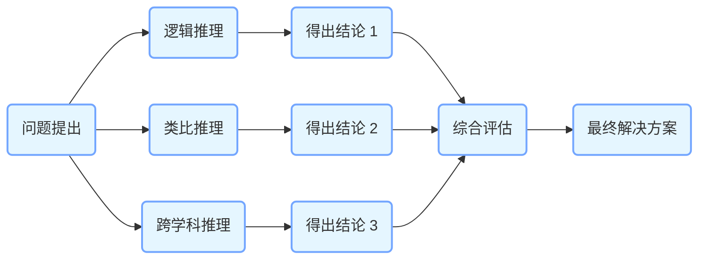

# 多角度推理能力在科技创新过程中的作用研究

> 关键词：多角度推理能力、科技创新、逻辑思维、跨学科融合、创新思维培养

> 摘要：本文深入探讨了多角度推理能力在科技创新过程中的重要作用。通过对多角度推理能力的核心概念、算法原理、数学模型等方面的分析，结合实际案例阐述其在科技创新中的具体应用。同时，介绍了相关的学习资源、开发工具和研究论文，总结了未来发展趋势与挑战，并对常见问题进行解答。旨在揭示多角度推理能力如何推动科技创新，为科研人员和创新者提供有益的参考。

## 1. 背景介绍 
### 1.1 目的和范围
本研究的目的在于全面分析多角度推理能力在科技创新过程中的具体作用，揭示其内在机制和影响因素。通过对多角度推理能力的深入研究，为科技创新提供理论支持和实践指导。研究范围涵盖了多角度推理能力的各个方面，包括其核心概念、算法原理、数学模型以及在不同领域的实际应用。

### 1.2 预期读者
本文预期读者主要包括科研人员、科技创新从业者、相关专业的学生以及对科技创新和推理能力感兴趣的人士。这些读者可以从本文中获取关于多角度推理能力在科技创新中的应用知识，为其研究和实践提供参考。

### 1.3 文档结构概述
本文将按照以下结构进行阐述：首先介绍多角度推理能力的核心概念与联系，包括其原理和架构，并通过文本示意图和 Mermaid 流程图进行直观展示；接着详细讲解核心算法原理和具体操作步骤，使用 Python 源代码进行说明；然后阐述相关的数学模型和公式，并举例说明；通过项目实战展示代码实际案例并进行详细解释；探讨多角度推理能力在实际应用场景中的作用；推荐相关的学习资源、开发工具和研究论文；总结未来发展趋势与挑战；解答常见问题；最后提供扩展阅读和参考资料。

### 1.4 术语表
#### 1.4.1 核心术语定义
- **多角度推理能力**：指从多个不同的角度、层面和维度对问题进行分析、思考和推理的能力，能够综合运用多种思维方式和知识体系来解决问题。
- **科技创新**：指创造和应用新知识、新技术、新工艺，采用新的生产方式和经营管理模式，开发新产品，提高产品质量，提供新服务的过程。
- **逻辑思维**：是人的理性认识阶段，人运用概念、判断、推理等思维类型反映事物本质与规律的认识过程。
- **跨学科融合**：指不同学科之间相互交叉、渗透和整合，打破学科界限，实现知识和方法的共享与互补。

#### 1.4.2 相关概念解释
- **演绎推理**：是从一般性的前提出发，通过推导即“演绎”，得出具体陈述或个别结论的过程。
- **归纳推理**：是一种由个别到一般的推理。由一定程度的关于个别事物的观点过渡到范围较大的观点，由特殊具体的事例推导出一般原理、原则的解释方法。
- **类比推理**：是根据两个或两类对象有部分属性相同，从而推出它们的其他属性也相同的推理。

#### 1.4.3 缩略词列表
本文暂未涉及缩略词。

## 2. 核心概念与联系 

### 核心概念原理
多角度推理能力基于多种思维方式和知识体系的综合运用。它要求个体能够突破单一思维模式的限制，从不同的视角审视问题。例如，在科技创新中，不仅要运用逻辑思维进行严谨的推导，还要结合创造性思维提出新颖的想法。逻辑思维为推理提供了严谨的框架，确保结论的可靠性；而创造性思维则为创新提供了灵感和可能性。

### 架构的文本示意图
多角度推理能力的架构可以看作是一个多维度的网络结构。中心节点代表问题本身，周围的节点代表不同的推理角度，如逻辑推理、类比推理、跨学科推理等。这些角度之间相互连接、相互影响，共同构成了一个完整的推理体系。通过从不同角度对问题进行分析和推理，可以更全面、深入地理解问题，从而找到更有效的解决方案。

### Mermaid 流程图


这个流程图展示了多角度推理的基本过程。首先提出问题，然后分别从逻辑推理、类比推理和跨学科推理三个角度进行分析，得出不同的结论。最后对这些结论进行综合评估，得到最终的解决方案。

## 3. 核心算法原理 & 具体操作步骤 

### 算法原理讲解
多角度推理的核心算法可以看作是一个信息整合和推理的过程。以下是一个简化的 Python 代码示例，用于演示如何从不同角度进行推理并综合结果：

```python
# 定义不同的推理函数
def logical_reasoning(problem):
    # 简单的逻辑推理示例：如果问题包含特定关键词，则得出相应结论
    if "key_word_1" in problem:
        return "Logical conclusion 1"
    else:
        return "Logical conclusion 2"

def analogical_reasoning(problem):
    # 类比推理示例：根据问题与已知案例的相似度得出结论
    similar_case = "Similar problem with solution X"
    if problem in similar_case:
        return "Analogical conclusion: X"
    else:
        return "Analogical conclusion: No match"

def interdisciplinary_reasoning(problem):
    # 跨学科推理示例：结合不同学科知识得出结论
    if "science_term" in problem and "math_term" in problem:
        return "Interdisciplinary conclusion based on science and math"
    else:
        return "Interdisciplinary conclusion: No relevant knowledge"

# 综合推理结果
def comprehensive_reasoning(problem):
    logical_result = logical_reasoning(problem)
    analogical_result = analogical_reasoning(problem)
    interdisciplinary_result = interdisciplinary_reasoning(problem)
    
    # 简单的综合评估，这里可以根据实际情况设计更复杂的评估方法
    all_results = [logical_result, analogical_result, interdisciplinary_result]
    final_result = ", ".join(all_results)
    return final_result

# 测试问题
test_problem = "This is a problem with key_word_1 and science_term"
result = comprehensive_reasoning(test_problem)
print(result)
```

### 具体操作步骤
1. **问题定义**：明确需要解决的问题，并对问题进行详细的描述和分析。
2. **选择推理角度**：根据问题的特点和需求，选择合适的推理角度，如逻辑推理、类比推理、跨学科推理等。
3. **进行推理**：针对每个选择的推理角度，运用相应的推理方法进行分析和推导，得出各自的结论。
4. **综合评估**：对不同推理角度得出的结论进行综合评估，考虑各结论的可靠性、合理性和适用性。
5. **得出最终解决方案**：根据综合评估的结果，确定最终的解决方案。

## 4. 数学模型和公式 & 详细讲解 & 举例说明 

### 数学模型
多角度推理可以用一个多元函数来表示。设问题为 $P$，推理角度为 $A_1, A_2, \cdots, A_n$，每个推理角度得出的结论为 $C_1, C_2, \cdots, C_n$，最终结论为 $C$。则可以表示为：

$$C = f(C_1, C_2, \cdots, C_n)$$

其中，$f$ 是一个综合评估函数，用于将各个推理角度的结论进行整合。

### 公式详细讲解
综合评估函数 $f$ 的具体形式可以根据实际情况进行设计。例如，可以采用加权平均的方法：

$$C = \sum_{i=1}^{n} w_i C_i$$

其中，$w_i$ 是第 $i$ 个推理角度的权重，表示该角度在综合评估中的重要程度，且 $\sum_{i=1}^{n} w_i = 1$。

### 举例说明
假设在一个科技创新项目中，需要对一个新产品的市场潜力进行评估。采用三个推理角度：市场调研数据的逻辑分析（角度 $A_1$）、类似产品的类比分析（角度 $A_2$）和行业趋势的跨学科分析（角度 $A_3$）。

- 逻辑分析得出的结论 $C_1$ 为该产品有 70% 的市场成功率。
- 类比分析得出的结论 $C_2$ 为该产品有 60% 的市场成功率。
- 跨学科分析得出的结论 $C_3$ 为该产品有 80% 的市场成功率。

假设三个角度的权重分别为 $w_1 = 0.3$，$w_2 = 0.3$，$w_3 = 0.4$。则最终结论 $C$ 为：

$$C = 0.3 \times 70\% + 0.3 \times 60\% + 0.4 \times 80\%$$
$$C = 21\% + 18\% + 32\%$$
$$C = 71\%$$

即综合考虑三个角度的推理结果，该新产品的市场成功率约为 71%。

## 5. 项目实战：代码实际案例和详细解释说明 

### 5.1  开发环境搭建
- **操作系统**：可以选择 Windows、Linux 或 macOS。
- **编程语言**：Python，建议使用 Python 3.7 及以上版本。
- **开发工具**：推荐使用 PyCharm 或 Jupyter Notebook。
- **依赖库**：在本案例中，不需要额外的第三方库，使用 Python 内置的功能即可。

### 5.2  源代码详细实现和代码解读
以下是一个更完整的科技创新项目中多角度推理的代码示例：

```python
# 定义不同的推理模块
class LogicalReasoning:
    def __init__(self, market_data):
        self.market_data = market_data

    def reason(self):
        # 假设市场数据中有一个关键指标，如果该指标大于某个阈值，则市场潜力大
        if self.market_data["key_metric"] > 100:
            return "High market potential based on logical analysis"
        else:
            return "Low market potential based on logical analysis"

class AnalogicalReasoning:
    def __init__(self, similar_products):
        self.similar_products = similar_products

    def reason(self):
        successful_count = 0
        total_count = len(self.similar_products)
        for product in self.similar_products:
            if product["success"]:
                successful_count += 1
        success_rate = successful_count / total_count
        if success_rate > 0.5:
            return f"High market potential based on analogical analysis ({success_rate * 100}% success rate)"
        else:
            return f"Low market potential based on analogical analysis ({success_rate * 100}% success rate)"

class InterdisciplinaryReasoning:
    def __init__(self, industry_trends):
        self.industry_trends = industry_trends

    def reason(self):
        # 假设行业趋势中有一个增长指标，如果该指标为正，则市场潜力大
        if self.industry_trends["growth_rate"] > 0:
            return "High market potential based on interdisciplinary analysis"
        else:
            return "Low market potential based on interdisciplinary analysis"

# 综合推理类
class ComprehensiveReasoning:
    def __init__(self, logical, analogical, interdisciplinary):
        self.logical = logical
        self.analogical = analogical
        self.interdisciplinary = interdisciplinary

    def reason(self):
        logical_result = self.logical.reason()
        analogical_result = self.analogical.reason()
        interdisciplinary_result = self.interdisciplinary.reason()

        # 简单的综合评估，统计认为市场潜力大的结论数量
        positive_count = 0
        all_results = [logical_result, analogical_result, interdisciplinary_result]
        for result in all_results:
            if "High market potential" in result:
                positive_count += 1
        if positive_count >= 2:
            return "Overall high market potential"
        else:
            return "Overall low market potential"

# 模拟数据
market_data = {"key_metric": 120}
similar_products = [{"success": True}, {"success": False}, {"success": True}]
industry_trends = {"growth_rate": 0.05}

# 创建推理对象
logical = LogicalReasoning(market_data)
analogical = AnalogicalReasoning(similar_products)
interdisciplinary = InterdisciplinaryReasoning(industry_trends)

# 进行综合推理
comprehensive = ComprehensiveReasoning(logical, analogical, interdisciplinary)
final_result = comprehensive.reason()
print(final_result)
```

### 代码解读与分析
- **LogicalReasoning 类**：负责从逻辑角度进行推理，根据市场数据中的关键指标判断市场潜力。
- **AnalogicalReasoning 类**：进行类比推理，通过分析类似产品的成功率来评估市场潜力。
- **InterdisciplinaryReasoning 类**：从跨学科角度，结合行业趋势的增长指标进行推理。
- **ComprehensiveReasoning 类**：将三个推理角度的结果进行综合评估，根据认为市场潜力大的结论数量来得出最终结论。

通过这个项目实战，我们可以看到如何在实际的科技创新项目中运用多角度推理能力来解决问题。

## 6. 实际应用场景 
### 产品研发
在产品研发过程中，多角度推理能力可以帮助研发团队从不同方面考虑产品的设计和功能。例如，从用户需求的逻辑分析角度，确定产品需要满足的基本功能；通过类比其他成功产品，获取设计灵感和改进方向；结合材料科学、工程学等跨学科知识，选择合适的材料和制造工艺。这样可以提高产品的质量和竞争力。

### 市场预测
在市场预测中，多角度推理能力可以综合考虑市场数据的逻辑关系、类似产品的市场表现以及行业的发展趋势。通过逻辑推理分析市场数据中的规律和趋势；运用类比推理预测新产品的市场反应；结合经济学、社会学等跨学科知识，考虑宏观经济环境和社会因素对市场的影响。从而更准确地预测市场需求和产品的市场潜力。

### 战略规划
企业在制定战略规划时，需要从多个角度进行分析和决策。逻辑推理可以帮助企业评估自身的优势和劣势，制定合理的目标和策略；类比推理可以借鉴其他企业的成功经验和失败教训，避免走弯路；跨学科推理可以考虑技术发展、政策法规等外部因素的影响，使战略规划更具前瞻性和适应性。

### 问题解决
在科技创新过程中，会遇到各种各样的问题。多角度推理能力可以帮助团队从不同角度审视问题，找到问题的根源和解决方案。例如，对于技术难题，可以从技术原理的逻辑分析、类似问题的解决方法类比以及不同学科知识的融合等角度进行思考，从而找到创新的解决方案。

## 7. 工具和资源推荐
### 7.1 学习资源推荐
#### 7.1.1 书籍推荐
- 《思考，快与慢》：作者丹尼尔·卡尼曼，这本书介绍了人类思维的两种模式，帮助读者了解不同的推理方式和思维陷阱。
- 《创新者的窘境》：克莱顿·克里斯坦森所著，探讨了科技创新中的困境和机遇，通过实际案例展示了如何运用创新思维解决问题。
- 《跨学科研究：过程与理论》：详细介绍了跨学科研究的方法和理论，对于培养跨学科推理能力有很大帮助。

#### 7.1.2 在线课程
- Coursera 上的“逻辑推理基础”课程，系统地介绍了逻辑推理的基本概念和方法。
- edX 上的“创新思维与设计”课程，教授如何运用创新思维进行产品设计和问题解决。
- Udemy 上的“跨学科学习与研究”课程，帮助学习者掌握跨学科的学习和研究方法。

#### 7.1.3 技术博客和网站
- Medium 上有许多关于科技创新和思维方法的优质博客文章，可以获取最新的研究成果和实践经验。
- 36氪、虎嗅网等科技媒体网站，提供了大量的科技创新案例和行业分析，有助于拓宽视野和培养创新思维。

### 7.2 开发工具框架推荐
#### 7.2.1 IDE和编辑器
- PyCharm：功能强大的 Python 集成开发环境，提供了代码编辑、调试、版本控制等丰富的功能。
- Jupyter Notebook：交互式的编程环境，适合进行数据分析和模型验证，方便展示代码和结果。

#### 7.2.2 调试和性能分析工具
- PDB：Python 内置的调试工具，可以帮助开发者逐行调试代码，查找问题。
- cProfile：用于分析 Python 代码的性能，找出性能瓶颈。

#### 7.2.3 相关框架和库
- Pandas：用于数据处理和分析的 Python 库，在逻辑推理和数据分析中非常有用。
- Scikit-learn：机器学习库，提供了丰富的算法和工具，可用于类比推理和数据建模。

### 7.3 相关论文著作推荐
#### 7.3.1 经典论文
- Simon, H. A. (1969). The Sciences of the Artificial. 这篇论文探讨了人工科学的概念和方法，对科技创新中的推理和设计有重要的启示。
- Kuhn, T. S. (1962). The Structure of Scientific Revolutions. 该论文提出了科学革命的结构理论，对于理解科学创新中的思维转变有很大帮助。

#### 7.3.2 最新研究成果
可以关注顶级学术期刊如《Science》《Nature》《Journal of Artificial Intelligence Research》等，获取关于多角度推理和科技创新的最新研究成果。

#### 7.3.3 应用案例分析
许多知名企业的案例研究报告可以在企业官网、行业研究机构网站上获取。例如，苹果公司的产品研发案例、谷歌公司的创新管理案例等，通过分析这些案例可以学习到实际应用中的多角度推理方法。

## 8. 总结：未来发展趋势与挑战
### 未来发展趋势
- **智能化融合**：随着人工智能技术的发展，多角度推理能力将与智能化工具更紧密地融合。例如，智能推理系统可以自动从多个数据源获取信息，运用多种推理方法进行分析和决策，提高推理的效率和准确性。
- **跨学科深度融合**：未来的科技创新将越来越依赖于跨学科的深度融合。多角度推理能力将促使不同学科之间的知识和方法更加紧密地结合，产生更多的创新成果。
- **数据驱动的推理**：大数据的发展为多角度推理提供了丰富的数据支持。未来的推理将更多地基于数据进行分析和挖掘，通过数据驱动的方法发现新的规律和趋势。

### 挑战
- **知识整合难度大**：多角度推理需要整合不同领域的知识和信息，这对个人和团队的知识储备和整合能力提出了很高的要求。如何有效地获取、理解和整合不同学科的知识是一个挑战。
- **算法复杂度高**：随着推理角度的增加和问题的复杂化，推理算法的复杂度也会相应提高。如何设计高效、准确的推理算法是一个亟待解决的问题。
- **伦理和法律问题**：在智能化推理和数据驱动的推理过程中，会涉及到伦理和法律问题，如数据隐私、算法偏见等。如何确保推理过程的合法性和公正性是未来需要关注的问题。

## 9. 附录：常见问题与解答
### 如何培养多角度推理能力？
可以通过阅读不同领域的书籍、参加跨学科的课程和活动、进行案例分析和讨论等方式来培养多角度推理能力。同时，要注重思维的训练，学会从不同的角度思考问题。

### 多角度推理是否适用于所有的科技创新问题？
虽然多角度推理能力在大多数科技创新问题中都有一定的应用价值，但并不是所有问题都需要或适合从多个角度进行推理。对于一些简单的问题，可能单一的推理角度就可以解决。在实际应用中，需要根据问题的特点和需求选择合适的推理方法。

### 如何确定不同推理角度的权重？
确定不同推理角度的权重需要综合考虑多个因素，如问题的性质、数据的可靠性、推理方法的准确性等。可以通过专家评估、历史数据分析、实验验证等方法来确定权重。在实际应用中，也可以根据具体情况进行调整。

## 10. 扩展阅读 & 参考资料
- 《人工智能：一种现代的方法》
- 《创新的艺术》
- 相关学术论文：“Multi - perspective Reasoning in Scientific Discovery”“The Role of Cross - disciplinary Reasoning in Technological Innovation”等

作者：AI天才研究院/AI Genius Institute & 禅与计算机程序设计艺术 /Zen And The Art of Computer Programming