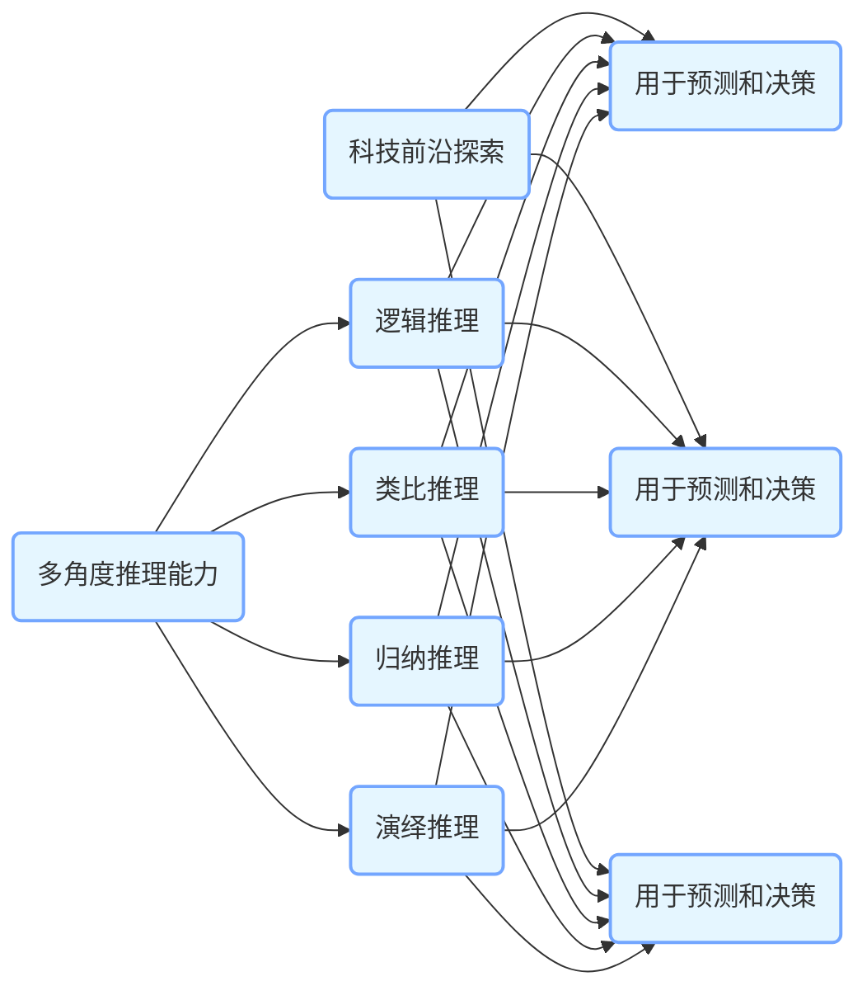

# 多角度推理能力在科技前沿探索中的作用研究

> 关键词：多角度推理能力、科技前沿探索、逻辑思维、创新思维、跨学科融合

> 摘要：本文深入探讨了多角度推理能力在科技前沿探索中的重要作用。通过详细分析多角度推理能力的核心概念、算法原理、数学模型等内容，结合实际项目案例展示其具体应用。阐述了多角度推理能力在不同科技前沿领域的应用场景，推荐了相关的学习资源、开发工具和论文著作。最后总结了其未来发展趋势与挑战，并对常见问题进行了解答。多角度推理能力有助于打破传统思维局限，促进跨学科知识融合，推动科技前沿的创新发展。

## 1. 背景介绍 
### 1.1 目的和范围
本研究旨在全面剖析多角度推理能力在科技前沿探索中的关键作用。科技前沿领域不断涌现新的问题和挑战，传统的单一推理方式往往难以满足解决复杂问题的需求。多角度推理能力能够整合不同领域的知识和思维方式，为科技前沿的突破提供有力支持。研究范围涵盖了多角度推理能力的理论基础、实际应用案例以及未来发展趋势等方面。

### 1.2 预期读者
本文预期读者包括科技研究人员、工程师、程序员、人工智能爱好者以及对科技前沿探索感兴趣的各界人士。对于专业的科研人员，本文可提供新的思维方法和研究思路；对于初学者，能帮助他们了解多角度推理能力在科技领域的重要性和应用方式。

### 1.3 文档结构概述
本文首先介绍了多角度推理能力的背景知识，包括目的、预期读者和文档结构。接着阐述了核心概念与联系，通过文本示意图和 Mermaid 流程图进行直观展示。然后详细讲解了核心算法原理和具体操作步骤，并给出了 Python 源代码。之后介绍了数学模型和公式，通过举例进行说明。再通过项目实战案例，展示了多角度推理能力的实际应用。随后探讨了实际应用场景，推荐了相关的工具和资源。最后总结了未来发展趋势与挑战，解答了常见问题，并提供了扩展阅读和参考资料。

### 1.4 术语表
#### 1.4.1 核心术语定义
- **多角度推理能力**：指综合运用多种不同的推理方式和思维角度，对问题进行全面、深入分析和解决的能力。包括逻辑推理、类比推理、归纳推理、演绎推理等多种方式。
- **科技前沿探索**：在科学技术的最新领域进行研究和创新，探索未知的知识和技术，解决尚未解决的问题。
- **跨学科融合**：将不同学科的知识、方法和理论进行整合，以解决复杂的实际问题。

#### 1.4.2 相关概念解释
- **逻辑推理**：依据逻辑规则，从已知的前提推导出结论的过程。常见的逻辑推理形式有三段论、假言推理等。
- **类比推理**：根据两个或两类对象在某些属性上相同，推出它们在其他属性上也相同的推理方式。
- **归纳推理**：从个别事实中概括出一般结论的推理方法。通过对多个具体事例的观察和分析，总结出普遍规律。
- **演绎推理**：从一般性的前提出发，通过推导即“演绎”，得出具体陈述或个别结论的过程。

#### 1.4.3 缩略词列表
- AI：Artificial Intelligence，人工智能
- ML：Machine Learning，机器学习
- DL：Deep Learning，深度学习

## 2. 核心概念与联系 

### 核心概念原理
多角度推理能力的核心在于能够灵活运用多种推理方式，从不同的视角审视问题。逻辑推理为推理过程提供了严谨的结构和规则，确保推理的准确性和可靠性。类比推理可以帮助我们将已有的知识和经验迁移到新的问题中，快速找到解决问题的思路。归纳推理则有助于从大量的数据和实例中发现规律，为进一步的研究提供基础。演绎推理则可以根据已有的理论和规律，推导出具体的结论。

在科技前沿探索中，不同的推理方式相互补充、相互促进。例如，在进行人工智能算法的研究时，逻辑推理可以用于设计算法的结构和规则，类比推理可以借鉴其他领域的算法思想进行创新，归纳推理可以从大量的数据中学习到模型的参数，演绎推理可以根据训练好的模型进行预测和决策。

### 架构的文本示意图
```plaintext
多角度推理能力
|-- 逻辑推理
|   |-- 三段论推理
|   |-- 假言推理
|-- 类比推理
|   |-- 属性类比
|   |-- 关系类比
|-- 归纳推理
|   |-- 完全归纳推理
|   |-- 不完全归纳推理
|-- 演绎推理
|   |-- 直言演绎推理
|   |-- 选言演绎推理

科技前沿探索
|-- 人工智能
|   |-- 机器学习
|   |-- 深度学习
|-- 生物科技
|   |-- 基因编辑
|   |-- 生物制药
|-- 量子计算
|   |-- 量子算法
|   |-- 量子通信

多角度推理能力与科技前沿探索的联系
|-- 逻辑推理为科技前沿探索提供严谨的理论支持
|-- 类比推理促进科技前沿领域的知识迁移和创新
|-- 归纳推理帮助从科技前沿的数据中发现规律
|-- 演绎推理用于科技前沿的预测和决策
```

### Mermaid 流程图


## 3. 核心算法原理 & 具体操作步骤 

### 逻辑推理算法原理及 Python 实现
逻辑推理中常见的三段论推理，其原理是：如果所有的 A 都是 B，C 是 A，那么 C 是 B。以下是一个简单的 Python 实现：
```python
# 定义一个类来表示逻辑规则
class Syllogism:
    def __init__(self, all_A_are_B, C_is_A):
        self.all_A_are_B = all_A_are_B
        self.C_is_A = C_is_A

    def infer(self):
        if self.all_A_are_B and self.C_is_A:
            return True
        return False

# 示例使用
all_dogs_are_mammals = True
fido_is_a_dog = True
syllogism = Syllogism(all_dogs_are_mammals, fido_is_a_dog)
result = syllogism.infer()
print(f"Fido is a mammal: {result}")
```
具体操作步骤：
1. 定义逻辑规则的前提条件，如 `all_A_are_B` 和 `C_is_A`。
2. 创建 `Syllogism` 类的实例，将前提条件传入。
3. 调用 `infer` 方法进行推理，得到推理结果。

### 类比推理算法原理及 Python 实现
类比推理的一种简单实现是基于属性相似度的类比。假设我们有两个对象，每个对象有多个属性，我们可以计算它们属性的相似度来进行类比。以下是一个简单的 Python 实现：
```python
def similarity(obj1, obj2):
    common_attributes = set(obj1.keys()) & set(obj2.keys())
    total_attributes = set(obj1.keys()) | set(obj2.keys())
    similarity_score = len(common_attributes) / len(total_attributes)
    return similarity_score

# 示例对象
object1 = {'color': 'red', 'shape': 'circle', 'size': 'large'}
object2 = {'color': 'red', 'shape': 'square', 'weight': 'heavy'}
sim_score = similarity(object1, object2)
print(f"Similarity score: {sim_score}")
```
具体操作步骤：
1. 定义两个对象，每个对象用字典表示，键为属性名，值为属性值。
2. 计算两个对象的公共属性和总属性数量。
3. 通过公共属性数量除以总属性数量得到相似度得分。

### 归纳推理算法原理及 Python 实现
归纳推理可以通过机器学习中的聚类算法来实现。以下是使用 Python 的 `scikit-learn` 库进行 K-Means 聚类的示例：
```python
from sklearn.cluster import KMeans
import numpy as np

# 示例数据
X = np.array([[1, 2], [1, 4], [1, 0], [4, 2], [4, 4], [4, 0]])
kmeans = KMeans(n_clusters=2, random_state=0).fit(X)
labels = kmeans.labels_
print(f"Cluster labels: {labels}")
```
具体操作步骤：
1. 准备数据，将数据表示为二维数组。
2. 创建 `KMeans` 聚类模型，指定聚类的数量。
3. 使用 `fit` 方法对数据进行训练。
4. 获取聚类标签，完成归纳推理。

### 演绎推理算法原理及 Python 实现
演绎推理可以通过条件判断来实现。以下是一个简单的示例：
```python
def is_even(num):
    if num % 2 == 0:
        return True
    return False

number = 4
result = is_even(number)
print(f"{number} is even: {result}")
```
具体操作步骤：
1. 定义演绎推理的规则，如判断一个数是否为偶数的规则。
2. 传入具体的数据进行判断。
3. 根据判断结果得到演绎推理的结论。

## 4. 数学模型和公式 & 详细讲解 & 举例说明 

### 逻辑推理中的数学模型
逻辑推理中常用的布尔代数模型。布尔代数中有三个基本运算：与（AND）、或（OR）、非（NOT）。设 $A$ 和 $B$ 是两个布尔变量，它们的取值为 $True$ 或 $False$。则与运算的定义为：
$$
A \land B = 
\begin{cases}
True, & \text{if } A = True \text{ and } B = True \\
False, & \text{otherwise}
\end{cases}
$$
或运算的定义为：
$$
A \lor B = 
\begin{cases}
True, & \text{if } A = True \text{ or } B = True \\
False, & \text{otherwise}
\end{cases}
$$
非运算的定义为：
$$
\neg A = 
\begin{cases}
True, & \text{if } A = False \\
False, & \text{if } A = True
\end{cases}
$$

举例说明：假设 $A$ 表示“今天是晴天”，$B$ 表示“我要去散步”。那么 $A \land B$ 表示“今天是晴天并且我要去散步”，只有当 $A$ 和 $B$ 都为 $True$ 时，$A \land B$ 才为 $True$。

### 类比推理中的数学模型
类比推理中常用的相似度计算模型是余弦相似度。对于两个向量 $\vec{A}=(a_1,a_2,\cdots,a_n)$ 和 $\vec{B}=(b_1,b_2,\cdots,b_n)$，余弦相似度的计算公式为：
$$
\text{cosine similarity}(\vec{A},\vec{B}) = \frac{\vec{A} \cdot \vec{B}}{\|\vec{A}\| \|\vec{B}\|} = \frac{\sum_{i=1}^{n} a_i b_i}{\sqrt{\sum_{i=1}^{n} a_i^2} \sqrt{\sum_{i=1}^{n} b_i^2}}
$$

举例说明：假设有两个文本向量 $\vec{A}=(1,2,3)$ 和 $\vec{B}=(2,4,6)$。首先计算分子：
$$
\vec{A} \cdot \vec{B} = 1\times2 + 2\times4 + 3\times6 = 2 + 8 + 18 = 28
$$
然后计算分母：
$$
\|\vec{A}\| = \sqrt{1^2 + 2^2 + 3^2} = \sqrt{1 + 4 + 9} = \sqrt{14}
$$
$$
\|\vec{B}\| = \sqrt{2^2 + 4^2 + 6^2} = \sqrt{4 + 16 + 36} = \sqrt{56} = 2\sqrt{14}
$$
则余弦相似度为：
$$
\text{cosine similarity}(\vec{A},\vec{B}) = \frac{28}{\sqrt{14} \times 2\sqrt{14}} = \frac{28}{2\times14} = 1
$$

### 归纳推理中的数学模型
在 K-Means 聚类算法中，其目标是最小化所有数据点到其所属聚类中心的距离之和。设数据集为 $X = \{x_1,x_2,\cdots,x_n\}$，聚类中心为 $C = \{c_1,c_2,\cdots,c_k\}$，其中 $k$ 是聚类的数量。每个数据点 $x_i$ 被分配到一个聚类 $j$，使得：
$$
J = \sum_{i=1}^{n} \|x_i - c_{j_i}\|^2
$$
最小化 $J$ 的过程就是 K-Means 聚类的核心。

举例说明：假设有三个数据点 $x_1=(1,1)$，$x_2=(2,2)$，$x_3=(10,10)$，初始聚类中心 $c_1=(1,1)$，$c_2=(10,10)$。计算每个数据点到聚类中心的距离：
- 对于 $x_1$，到 $c_1$ 的距离为 $\|x_1 - c_1\|^2 = (1 - 1)^2 + (1 - 1)^2 = 0$，到 $c_2$ 的距离为 $\|x_1 - c_2\|^2 = (1 - 10)^2 + (1 - 10)^2 = 81 + 81 = 162$，所以 $x_1$ 被分配到 $c_1$ 所在的聚类。
- 对于 $x_2$，到 $c_1$ 的距离为 $\|x_2 - c_1\|^2 = (2 - 1)^2 + (2 - 1)^2 = 2$，到 $c_2$ 的距离为 $\|x_2 - c_2\|^2 = (2 - 10)^2 + (2 - 10)^2 = 64 + 64 = 128$，所以 $x_2$ 被分配到 $c_1$ 所在的聚类。
- 对于 $x_3$，到 $c_1$ 的距离为 $\|x_3 - c_1\|^2 = (10 - 1)^2 + (10 - 1)^2 = 81 + 81 = 162$，到 $c_2$ 的距离为 $\|x_3 - c_2\|^2 = (10 - 10)^2 + (10 - 10)^2 = 0$，所以 $x_3$ 被分配到 $c_2$ 所在的聚类。

然后更新聚类中心，重复上述过程，直到聚类中心不再变化或达到最大迭代次数。

### 演绎推理中的数学模型
演绎推理可以用条件命题来表示。设 $P$ 是前提，$Q$ 是结论，条件命题可以表示为 $P \to Q$。其真值表如下：
| $P$ | $Q$ | $P \to Q$ |
| --- | --- | --- |
| True | True | True |
| True | False | False |
| False | True | True |
| False | False | True |

举例说明：设 $P$ 表示“一个数是偶数”，$Q$ 表示“这个数能被 2 整除”。那么 $P \to Q$ 表示“如果一个数是偶数，那么这个数能被 2 整除”。当 $P$ 为 $True$（即这个数是偶数），$Q$ 也为 $True$（这个数能被 2 整除）时，$P \to Q$ 为 $True$。

## 5. 项目实战：代码实际案例和详细解释说明 

### 5.1  开发环境搭建
本次项目实战使用 Python 进行开发，推荐使用 Anaconda 来管理 Python 环境。以下是具体的搭建步骤：
1. 下载并安装 Anaconda：从 Anaconda 官方网站（https://www.anaconda.com/products/individual）下载适合自己操作系统的 Anaconda 安装包，然后按照安装向导进行安装。
2. 创建虚拟环境：打开 Anaconda Prompt（Windows）或终端（Linux/Mac），输入以下命令创建一个新的虚拟环境：
```sh
conda create -n multi_angle_reasoning python=3.8
```
这里创建了一个名为 `multi_angle_reasoning` 的虚拟环境，使用 Python 3.8 版本。
3. 激活虚拟环境：在 Anaconda Prompt 或终端中输入以下命令激活虚拟环境：
```sh
conda activate multi_angle_reasoning
```
4. 安装必要的库：在激活的虚拟环境中，使用 `pip` 或 `conda` 安装所需的库，如 `numpy`、`scikit-learn` 等：
```sh
pip install numpy scikit-learn
```

### 5.2  源代码详细实现和代码解读
以下是一个综合运用多角度推理能力的项目案例，用于预测鸢尾花的类别。

```python
import numpy as np
from sklearn.datasets import load_iris
from sklearn.model_selection import train_test_split
from sklearn.neighbors import KNeighborsClassifier
from sklearn.metrics import accuracy_score

# 加载鸢尾花数据集
iris = load_iris()
X = iris.data  # 特征数据
y = iris.target  # 标签数据

# 逻辑推理：数据划分
# 这里使用逻辑推理来决定将数据集划分为训练集和测试集
# 按照 80% 训练集和 20% 测试集的比例进行划分
X_train, X_test, y_train, y_test = train_test_split(X, y, test_size=0.2, random_state=42)

# 类比推理：选择模型
# 类比其他分类问题，选择 K 近邻分类器
knn = KNeighborsClassifier(n_neighbors=3)

# 归纳推理：模型训练
# 通过归纳推理，从训练数据中学习模型的参数
knn.fit(X_train, y_train)

# 演绎推理：模型预测
# 根据训练好的模型，对测试数据进行演绎推理，得到预测结果
y_pred = knn.predict(X_test)

# 评估模型性能
accuracy = accuracy_score(y_test, y_pred)
print(f"模型准确率: {accuracy}")
```

### 5.3  代码解读与分析
1. **数据加载**：使用 `load_iris` 函数从 `sklearn` 库中加载鸢尾花数据集，将特征数据存储在 `X` 中，标签数据存储在 `y` 中。
2. **逻辑推理 - 数据划分**：使用 `train_test_split` 函数将数据集划分为训练集和测试集。这里的逻辑是按照 80% 和 20% 的比例进行划分，确保模型能够在未见过的数据上进行测试。
3. **类比推理 - 模型选择**：类比其他分类问题，选择 K 近邻分类器作为预测模型。K 近邻分类器是一种简单而有效的分类算法，在很多分类问题中都有较好的表现。
4. **归纳推理 - 模型训练**：使用 `fit` 方法对 K 近邻分类器进行训练，从训练数据中学习特征和标签之间的关系。
5. **演绎推理 - 模型预测**：使用训练好的模型对测试数据进行预测，根据已学习到的规律推导出测试数据的标签。
6. **模型评估**：使用 `accuracy_score` 函数计算模型的准确率，评估模型的性能。

## 6. 实际应用场景 
### 人工智能领域
在人工智能领域，多角度推理能力可以帮助开发更加智能的系统。例如，在自然语言处理中，逻辑推理可以用于语义理解和推理，类比推理可以借鉴其他语言的处理方法，归纳推理可以从大量的文本数据中学习语言模式，演绎推理可以根据学习到的模式生成自然语言文本。在计算机视觉中，多角度推理能力可以用于图像识别、目标检测和图像生成等任务。

### 生物科技领域
在生物科技领域，多角度推理能力对于基因编辑、生物制药等研究具有重要意义。逻辑推理可以用于设计基因编辑方案，类比推理可以参考其他物种的基因信息，归纳推理可以从大量的生物实验数据中发现基因的功能和相互作用规律，演绎推理可以根据这些规律预测基因编辑的效果。

### 量子计算领域
在量子计算领域，多角度推理能力有助于解决量子算法设计和量子通信中的复杂问题。逻辑推理可以用于设计量子算法的逻辑结构，类比推理可以借鉴经典计算算法的思想，归纳推理可以从量子实验数据中总结量子系统的特性，演绎推理可以根据量子力学原理预测量子计算的结果。

### 新能源领域
在新能源领域，多角度推理能力可以用于新能源的开发和利用。例如，在太阳能电池的研发中，逻辑推理可以用于设计电池的结构和工作原理，类比推理可以参考其他能源转换技术，归纳推理可以从实验数据中优化电池的性能参数，演绎推理可以预测电池在不同环境下的工作效率。

## 7. 工具和资源推荐
### 7.1 学习资源推荐
#### 7.1.1 书籍推荐
- 《人工智能：一种现代的方法》：全面介绍了人工智能的各个领域，包括逻辑推理、机器学习、自然语言处理等，是学习人工智能的经典教材。
- 《机器学习》：由周志华教授编写，系统地介绍了机器学习的基本概念、算法和应用，对于理解归纳推理在机器学习中的应用非常有帮助。
- 《数学之美》：吴军博士的著作，用通俗易懂的语言介绍了数学在计算机科学、自然语言处理等领域的应用，有助于培养多角度推理的思维方式。

#### 7.1.2 在线课程
- Coursera 上的“人工智能基础”课程：由知名教授授课，涵盖了人工智能的基本概念、算法和应用，通过视频讲解、作业和测验等方式帮助学习者掌握相关知识。
- edX 上的“机器学习”课程：提供了丰富的学习资源，包括视频教程、在线实验和论坛讨论，适合初学者和有一定基础的学习者。
- 中国大学 MOOC 上的“逻辑与批判性思维”课程：帮助学习者提高逻辑推理能力，培养批判性思维方式。

#### 7.1.3 技术博客和网站
- Medium：上面有很多关于科技前沿和人工智能的文章，作者来自世界各地的专家和爱好者，可以了解到最新的技术动态和研究成果。
- arXiv：一个预印本数据库，提供了大量的学术论文，涵盖了人工智能、量子计算、生物科技等多个领域，可以及时了解到最新的研究进展。
- 开源中国：国内知名的技术社区，有很多关于软件开发、人工智能等方面的技术文章和经验分享。

### 7.2 开发工具框架推荐
#### 7.2.1 IDE和编辑器
- PyCharm：一款专门为 Python 开发设计的集成开发环境，提供了代码编辑、调试、版本控制等功能，适合开发大型的 Python 项目。
- Jupyter Notebook：一种交互式的开发环境，可以将代码、文本、图像等组合在一起，方便进行数据分析和模型实验。
- Visual Studio Code：一款轻量级的代码编辑器，支持多种编程语言，有丰富的插件可以扩展功能，适合快速开发和调试代码。

#### 7.2.2 调试和性能分析工具
- PDB：Python 自带的调试器，可以在代码中设置断点，逐步执行代码，查看变量的值和程序的执行流程。
- cProfile：Python 的性能分析工具，可以分析代码的运行时间和函数调用次数，帮助找出性能瓶颈。
- TensorBoard：TensorFlow 提供的可视化工具，可以用于可视化训练过程中的损失函数、准确率等指标，方便调整模型参数。

#### 7.2.3 相关框架和库
- TensorFlow：一个开源的机器学习框架，提供了丰富的工具和函数，用于构建和训练深度学习模型。
- PyTorch：另一个流行的深度学习框架，具有动态图的特点，易于使用和调试，在学术界和工业界都有广泛的应用。
- scikit-learn：一个简单而有效的机器学习库，提供了多种机器学习算法的实现，适合初学者和快速开发。

### 7.3 相关论文著作推荐
#### 7.3.1 经典论文
- “A Logical Calculus of the Ideas Immanent in Nervous Activity”：由 Warren McCulloch 和 Walter Pitts 发表，提出了人工神经网络的基本模型，为人工智能的发展奠定了基础。
- “Learning Representations by Back-propagating Errors”：由 David Rumelhart、Geoffrey Hinton 和 Ronald Williams 发表，介绍了反向传播算法，是深度学习发展的重要里程碑。
- “The Nature of Statistical Learning Theory”：由 Vladimir Vapnik 撰写，系统地阐述了统计学习理论，为机器学习的理论研究提供了重要的基础。

#### 7.3.2 最新研究成果
- 在 arXiv 上搜索“Multi-angle Reasoning in Technological Frontiers”等关键词，可以找到关于多角度推理能力在科技前沿探索中的最新研究成果。
- 关注顶级学术会议，如 NeurIPS（神经信息处理系统大会）、ICML（国际机器学习会议）等，这些会议上会发表很多最新的研究论文。

#### 7.3.3 应用案例分析
- 《人工智能案例集》：收集了很多人工智能在不同领域的应用案例，包括医疗、金融、交通等，通过分析这些案例可以了解多角度推理能力在实际应用中的具体方法和效果。
- 一些知名科技公司的技术博客，如 Google AI Blog、Microsoft Research Blog 等，会分享他们在科技前沿探索中的应用案例和技术经验。

## 8. 总结：未来发展趋势与挑战
### 未来发展趋势
- **跨学科融合加深**：随着科技的不断发展，不同学科之间的界限越来越模糊，多角度推理能力将促进更多的跨学科研究和创新。例如，人工智能与生物学、物理学等学科的融合将产生新的研究方向和技术突破。
- **智能化程度提高**：在科技前沿探索中，多角度推理能力将与人工智能技术相结合，实现更加智能化的决策和问题解决。例如，智能机器人可以运用多角度推理能力进行自主学习和决策，提高其在复杂环境中的适应能力。
- **数据驱动的推理**：随着大数据技术的发展，大量的数据将为多角度推理提供更加丰富的信息。通过对数据的挖掘和分析，可以发现更多的规律和模式，从而提高推理的准确性和可靠性。

### 挑战
- **数据质量和隐私问题**：在数据驱动的推理中，数据的质量和隐私是关键问题。低质量的数据可能导致推理结果的不准确，而数据隐私问题则可能影响数据的获取和使用。
- **计算资源需求**：多角度推理通常需要大量的计算资源，特别是在处理复杂的问题和大规模的数据时。如何有效地利用计算资源，提高推理效率，是一个亟待解决的问题。
- **跨学科知识融合的难度**：跨学科研究需要研究者具备多个学科的知识和技能，这对人才的培养和团队的组建提出了更高的要求。如何打破学科壁垒，促进跨学科知识的融合，是一个挑战。

## 9. 附录：常见问题与解答
### 问题 1：多角度推理能力与单一推理方式有什么区别？
解答：单一推理方式通常只使用一种推理规则或方法，如逻辑推理只遵循逻辑规则进行推导，类比推理只依靠类比的方式进行思考。而多角度推理能力则综合运用多种推理方式，从不同的视角审视问题，能够更全面、深入地分析和解决问题。例如，在解决一个复杂的科技问题时，单一推理方式可能只能从一个方面入手，而多角度推理能力可以结合逻辑推理、类比推理、归纳推理等多种方式，找到更多的解决方案。

### 问题 2：如何培养多角度推理能力？
解答：培养多角度推理能力可以从以下几个方面入手：
- 学习不同学科的知识：了解不同学科的思维方式和方法，拓宽自己的知识面和视野。
- 阅读经典的推理案例：通过分析经典的推理案例，学习不同的推理技巧和策略。
- 进行思维训练：例如做逻辑推理题、玩智力游戏等，锻炼自己的思维能力。
- 参与跨学科项目：在实际项目中与不同学科的人合作，学习他们的思维方式和解决问题的方法。

### 问题 3：多角度推理能力在实际项目中如何应用？
解答：在实际项目中，多角度推理能力可以应用于项目的各个阶段。在项目的需求分析阶段，可以使用逻辑推理来明确项目的目标和要求，使用类比推理来借鉴类似项目的经验。在项目的设计阶段，可以使用归纳推理从已有的数据和案例中总结出设计原则，使用演绎推理根据设计原则推导出具体的设计方案。在项目的实施阶段，可以使用逻辑推理来确保代码的正确性，使用类比推理来解决遇到的类似问题。在项目的评估阶段，可以使用归纳推理来分析项目的效果和性能，使用演绎推理来预测项目的未来发展。

### 问题 4：多角度推理能力对科技前沿探索有什么重要意义？
解答：多角度推理能力对科技前沿探索具有重要意义。科技前沿领域往往面临着复杂的问题和未知的挑战，传统的单一推理方式难以满足解决这些问题的需求。多角度推理能力可以帮助研究者打破传统思维的局限，从不同的角度思考问题，发现新的研究方向和解决方案。同时，多角度推理能力还可以促进跨学科知识的融合，将不同学科的优势结合起来，推动科技前沿的创新发展。

## 10. 扩展阅读 & 参考资料
### 扩展阅读
- 《思考，快与慢》：作者丹尼尔·卡尼曼是诺贝尔经济学奖得主，书中介绍了人类思维的两种模式，对于理解推理能力和思维方式有很大的帮助。
- 《创新算法：TRIZ、系统创新和技术创造力》：介绍了 TRIZ 创新方法，通过分析大量的专利和发明案例，总结出了一系列的创新原理和方法，对于培养创新思维和多角度推理能力有启发作用。
- 《复杂》：作者梅拉妮·米歇尔探讨了复杂系统的基本概念和原理，包括自组织、涌现等，对于理解科技前沿领域中的复杂问题和多角度推理有一定的参考价值。

### 参考资料
- 相关学术论文和研究报告：可以从学术数据库（如 IEEE Xplore、ACM Digital Library 等）中查找关于多角度推理能力和科技前沿探索的学术论文和研究报告。
- 行业标准和规范：在实际项目中，需要遵循相关的行业标准和规范，这些标准和规范可以从行业协会的官方网站或相关的标准制定机构获取。
- 开源代码库：如 GitHub 上有很多关于人工智能、机器学习等领域的开源代码库，可以参考这些代码库中的实现方法和技术细节。

作者：AI天才研究院/AI Genius Institute & 禅与计算机程序设计艺术 /Zen And The Art of Computer Programming