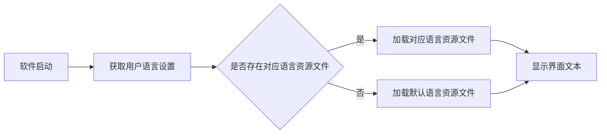

# 多语言支持

> 关键词：多语言支持、国际化、本地化、i18n、l10n、翻译管理、多语言框架

> 摘要：本文深入探讨了多语言支持这一重要的技术领域。首先介绍了多语言支持的背景知识，包括目的、预期读者、文档结构和相关术语。接着阐述了核心概念与联系，通过文本示意图和Mermaid流程图进行清晰展示。详细讲解了核心算法原理，并给出Python源代码示例。从数学模型和公式的角度进行了理论分析，辅以具体例子加深理解。通过项目实战，介绍了开发环境搭建、源代码实现及解读。探讨了多语言支持的实际应用场景，推荐了相关的学习资源、开发工具框架和论文著作。最后总结了未来发展趋势与挑战，还提供了常见问题解答和扩展阅读参考资料，旨在帮助开发者全面掌握多语言支持技术，提升软件的国际化和本地化水平。

## 1. 背景介绍 
### 1.1 目的和范围
在当今全球化的时代，软件和应用程序需要满足不同语言和文化背景用户的需求。多语言支持的目的就是使软件能够在不同语言环境下正常运行，并以用户熟悉的语言呈现界面、提示信息等内容。本文章的范围涵盖了多语言支持的核心概念、算法原理、数学模型、项目实战、实际应用场景以及相关的工具和资源推荐等方面，旨在为开发者提供全面且深入的指导，帮助他们在自己的项目中实现有效的多语言支持。

### 1.2 预期读者
本文的预期读者主要包括软件开发者、软件架构师、测试人员以及对多语言支持技术感兴趣的技术爱好者。对于开发者而言，他们可以从中学习到实现多语言支持的具体方法和技巧；软件架构师可以了解如何在系统架构层面考虑多语言支持的设计；测试人员可以掌握多语言环境下的测试要点；而技术爱好者则可以通过本文对多语言支持有一个较为系统的认识。

### 1.3 文档结构概述
本文首先介绍多语言支持的背景知识，包括目的、预期读者、文档结构和相关术语。然后阐述核心概念与联系，通过示意图和流程图进行直观展示。接着详细讲解核心算法原理，并给出Python代码示例。从数学模型和公式的角度进行理论分析，结合具体例子帮助理解。通过项目实战，介绍开发环境搭建、源代码实现及解读。探讨实际应用场景，推荐相关的学习资源、开发工具框架和论文著作。最后总结未来发展趋势与挑战，提供常见问题解答和扩展阅读参考资料。

### 1.4 术语表
#### 1.4.1 核心术语定义
- **国际化（Internationalization，i18n）**：指在设计和开发软件时，使其具有能够适应不同语言和文化环境的特性，而无需对软件的核心代码进行大量修改。
- **本地化（Localization，l10n）**：是在国际化的基础上，将软件的界面、提示信息等内容翻译成特定语言和文化背景下的表达，以满足当地用户的需求。
- **翻译管理系统（Translation Management System，TMS）**：用于管理软件中各种文本的翻译过程，包括翻译任务分配、翻译进度跟踪、翻译记忆库管理等功能。
- **语言代码**：用于标识不同语言的标准化代码，例如“en”表示英语，“zh”表示中文等。

#### 1.4.2 相关概念解释
- **资源文件**：在多语言支持中，资源文件是存储不同语言文本信息的文件。常见的资源文件格式有.properties、.xml、.json等。通过加载不同语言的资源文件，软件可以实现界面文本的切换。
- **翻译记忆库（Translation Memory，TM）**：是一个存储已翻译文本的数据库。在翻译过程中，翻译人员可以利用翻译记忆库查找相似的已翻译内容，提高翻译效率和一致性。
- **伪本地化（Pseudo-localization）**：是一种在不进行实际翻译的情况下，模拟软件在不同语言环境下的显示效果的技术。通过对原始文本进行一些特殊处理，如在文本前后添加标记、将字母替换为特殊字符等，可以快速发现软件中可能存在的多语言显示问题。

#### 1.4.3 缩略词列表
- **i18n**：Internationalization
- **l10n**：Localization
- **TMS**：Translation Management System
- **TM**：Translation Memory

## 2. 核心概念与联系 
### 核心概念原理
多语言支持的核心原理是将软件中的文本信息与代码分离，存储在独立的资源文件中。在软件运行时，根据用户的语言设置，动态加载相应语言的资源文件，并将其中的文本信息显示在界面上。这样，当需要支持新的语言时，只需要添加对应的资源文件，而无需修改软件的核心代码。

### 架构的文本示意图
```plaintext
+----------------------+
|       软件代码       |
+----------------------+
|  多语言资源管理器  |
+----------------------+
|  不同语言资源文件  |
|  - 英语资源文件     |
|  - 中文资源文件     |
|  - 其他语言文件     |
+----------------------+
```

### Mermaid流程图


在这个流程图中，软件启动后首先获取用户的语言设置，然后检查是否存在对应语言的资源文件。如果存在，则加载该文件；如果不存在，则加载默认语言的资源文件。最后，将资源文件中的文本信息显示在界面上。

## 3. 核心算法原理 & 具体操作步骤 
### 核心算法原理
多语言支持的核心算法主要涉及资源文件的加载和文本替换。具体来说，软件需要根据用户的语言设置，从资源文件中查找对应的文本信息，并将界面上的占位符替换为实际的文本。

### Python源代码示例
以下是一个简单的Python示例，演示了如何实现多语言支持：

```python
import json

# 定义资源文件路径
resource_files = {
    "en": "resources/en.json",
    "zh": "resources/zh.json"
}

def load_resources(language):
    """
    加载指定语言的资源文件
    :param language: 语言代码
    :return: 资源字典
    """
    try:
        with open(resource_files[language], 'r', encoding='utf-8') as f:
            return json.load(f)
    except FileNotFoundError:
        # 如果指定语言的资源文件不存在，加载默认语言（英语）的资源文件
        with open(resource_files["en"], 'r', encoding='utf-8') as f:
            return json.load(f)

def translate(text, resources):
    """
    根据资源字典翻译文本
    :param text: 待翻译的文本
    :param resources: 资源字典
    :return: 翻译后的文本
    """
    return resources.get(text, text)

# 模拟用户语言设置
user_language = "zh"

# 加载资源文件
resources = load_resources(user_language)

# 待翻译的文本
texts = ["Welcome to our application!", "Please log in."]

# 翻译文本
translated_texts = [translate(text, resources) for text in texts]

# 输出翻译结果
for text, translated_text in zip(texts, translated_texts):
    print(f"{text} -> {translated_text}")
```

### 具体操作步骤
1. **定义资源文件路径**：在代码中定义不同语言的资源文件路径，使用字典进行存储。
2. **加载资源文件**：编写一个函数，根据用户的语言设置加载对应的资源文件。如果指定语言的资源文件不存在，则加载默认语言的资源文件。
3. **翻译文本**：编写一个函数，根据资源字典将待翻译的文本替换为对应的翻译文本。如果资源字典中不存在该文本，则返回原文本。
4. **模拟用户语言设置**：在代码中模拟用户的语言设置，调用加载资源文件和翻译文本的函数，输出翻译结果。

## 4. 数学模型和公式 & 详细讲解 & 举例说明 
### 数学模型和公式
在多语言支持中，可以用以下数学模型来描述文本的翻译过程。

设 $T$ 为待翻译的文本集合，$L$ 为语言集合，$R_l$ 为语言 $l \in L$ 的资源文件，其中包含了文本的翻译信息。对于每个文本 $t \in T$，其在语言 $l$ 下的翻译结果 $t_l$ 可以表示为：

$$
t_l = \begin{cases}
R_l(t) & \text{if } t \in R_l \\
t & \text{otherwise}
\end{cases}
$$

其中，$R_l(t)$ 表示资源文件 $R_l$ 中对应文本 $t$ 的翻译信息。如果 $t$ 不在 $R_l$ 中，则返回原文本 $t$。

### 详细讲解
这个数学模型的核心思想是，对于每个待翻译的文本，首先检查该文本是否存在于对应的语言资源文件中。如果存在，则返回资源文件中的翻译信息；如果不存在，则返回原文本。这样可以确保在没有翻译信息的情况下，软件仍然能够正常显示文本。

### 举例说明
假设我们有以下待翻译的文本集合 $T = \{"Hello", "World"\}$，语言集合 $L = \{"en", "zh"\}$，英语资源文件 $R_{en} = \{"Hello": "Hello", "World": "World"\}$，中文资源文件 $R_{zh} = \{"Hello": "你好", "World": "世界"\}$。

当用户选择英语时，$l = "en"$，则翻译结果为：

$t_{en}("Hello") = R_{en}("Hello") = "Hello"$

$t_{en}("World") = R_{en}("World") = "World"$

当用户选择中文时，$l = "zh"$，则翻译结果为：

$t_{zh}("Hello") = R_{zh}("Hello") = "你好"$

$t_{zh}("World") = R_{zh}("World") = "世界"$

## 5. 项目实战：代码实际案例和详细解释说明 
### 5.1  开发环境搭建
#### 项目创建
首先，创建一个新的Python项目目录，例如 `multi_language_project`。在该目录下，创建以下子目录和文件：

```plaintext
multi_language_project/
├── main.py
├── resources/
│   ├── en.json
│   └── zh.json
```

#### 安装依赖
本项目只使用Python的内置库，无需额外安装依赖。

#### 资源文件准备
在 `resources` 目录下，创建 `en.json` 和 `zh.json` 文件，分别存储英语和中文的翻译信息。

`en.json` 内容如下：
```json
{
    "Welcome to our application!": "Welcome to our application!",
    "Please log in.": "Please log in."
}
```

`zh.json` 内容如下：
```json
{
    "Welcome to our application!": "欢迎使用我们的应用程序！",
    "Please log in.": "请登录。"
}
```

### 5.2  源代码详细实现和代码解读
以下是 `main.py` 文件的完整代码：

```python
import json

# 定义资源文件路径
resource_files = {
    "en": "resources/en.json",
    "zh": "resources/zh.json"
}

def load_resources(language):
    """
    加载指定语言的资源文件
    :param language: 语言代码
    :return: 资源字典
    """
    try:
        with open(resource_files[language], 'r', encoding='utf-8') as f:
            return json.load(f)
    except FileNotFoundError:
        # 如果指定语言的资源文件不存在，加载默认语言（英语）的资源文件
        with open(resource_files["en"], 'r', encoding='utf-8') as f:
            return json.load(f)

def translate(text, resources):
    """
    根据资源字典翻译文本
    :param text: 待翻译的文本
    :param resources: 资源字典
    :return: 翻译后的文本
    """
    return resources.get(text, text)

def main():
    # 模拟用户语言设置
    user_language = input("Please enter your language code (en/zh): ")

    # 加载资源文件
    resources = load_resources(user_language)

    # 待翻译的文本
    texts = ["Welcome to our application!", "Please log in."]

    # 翻译文本
    translated_texts = [translate(text, resources) for text in texts]

    # 输出翻译结果
    for text, translated_text in zip(texts, translated_texts):
        print(f"{text} -> {translated_text}")

if __name__ == "__main__":
    main()
```

### 代码解读与分析
1. **资源文件路径定义**：使用字典 `resource_files` 存储不同语言的资源文件路径，方便后续根据语言代码加载相应的资源文件。
2. **加载资源文件函数 `load_resources`**：该函数接受一个语言代码作为参数，尝试打开对应的资源文件并解析为JSON格式。如果文件不存在，则加载默认语言（英语）的资源文件。
3. **翻译函数 `translate`**：该函数接受一个待翻译的文本和资源字典作为参数，使用字典的 `get` 方法查找对应的翻译信息。如果找不到，则返回原文本。
4. **主函数 `main`**：首先通过用户输入获取语言代码，然后调用 `load_resources` 函数加载资源文件。接着定义待翻译的文本列表，调用 `translate` 函数进行翻译，并输出翻译结果。

## 6. 实际应用场景 
### 软件应用开发
在软件开发中，多语言支持是实现软件国际化和本地化的关键。例如，一款全球知名的办公软件，需要支持多种语言，以满足不同国家和地区用户的需求。通过实现多语言支持，软件可以在不同语言环境下正常运行，提供一致的用户体验。

### 网站开发
对于面向全球用户的网站，多语言支持可以提高网站的可用性和用户满意度。用户可以根据自己的语言偏好选择网站的显示语言，方便浏览和使用网站内容。例如，一些国际新闻网站、电商网站等都提供了多语言版本。

### 移动应用开发
移动应用市场竞争激烈，为了扩大用户群体，开发者需要考虑多语言支持。通过支持多种语言，移动应用可以吸引不同国家和地区的用户，提高应用的下载量和使用率。例如，社交类应用、游戏类应用等都需要实现多语言支持。

### 在线教育平台
在线教育平台通常有来自不同国家和地区的学员，多语言支持可以让学员以自己熟悉的语言学习课程内容。平台可以提供课程视频字幕、课件文本等的多语言翻译，提高学员的学习效果。

## 7. 工具和资源推荐
### 7.1 学习资源推荐
#### 7.1.1 书籍推荐
- 《软件国际化与本地化实战》：本书详细介绍了软件国际化和本地化的基本概念、方法和实践经验，通过大量的案例和代码示例，帮助读者掌握多语言支持的技术。
- 《Python编程实战：多语言应用开发》：以Python语言为例，介绍了如何在Python项目中实现多语言支持，包括资源文件的管理、翻译工具的使用等内容。

#### 7.2.2 在线课程
- Coursera上的“Software Internationalization and Localization”课程：由知名高校的教授授课，系统地讲解了软件国际化和本地化的理论和实践知识。
- Udemy上的“Multilingual Application Development with Python”课程：通过实际项目案例，教授如何使用Python开发多语言应用程序。

#### 7.2.3 技术博客和网站
- i18next官方博客：提供了关于多语言支持的最新技术和最佳实践，包括i18next框架的使用教程和案例分析。
- Stack Overflow：一个知名的技术问答社区，在上面可以找到关于多语言支持的各种问题和解决方案。

### 7.2 开发工具框架推荐
#### 7.2.1 IDE和编辑器
- PyCharm：一款功能强大的Python集成开发环境，支持多语言开发，提供了丰富的代码编辑、调试和部署功能。
- Visual Studio Code：一款轻量级的代码编辑器，具有丰富的插件生态系统，可以通过安装相关插件来支持多语言开发。

#### 7.2.2 调试和性能分析工具
- Sentry：一个开源的错误跟踪和性能监控平台，可以帮助开发者及时发现和解决多语言应用程序中的错误和性能问题。
- New Relic：一款性能监控工具，可以实时监控多语言应用程序的性能指标，如响应时间、吞吐量等。

#### 7.2.3 相关框架和库
- i18next：一个功能强大的国际化框架，支持多种语言和多种文件格式，提供了丰富的API和插件，方便开发者实现多语言支持。
- gettext：一个广泛使用的国际化工具，支持多种编程语言，提供了一套完整的翻译管理解决方案。

### 7.3 相关论文著作推荐
#### 7.3.1 经典论文
- “A Framework for Software Internationalization”：该论文提出了一种软件国际化的框架，为后续的多语言支持研究和实践提供了重要的理论基础。
- “Localization and Internationalization in Software Engineering”：详细探讨了软件本地化和国际化的概念、方法和挑战，对多语言支持的发展产生了深远的影响。

#### 7.3.2 最新研究成果
- “Machine Learning for Automatic Translation in Multilingual Applications”：研究了如何利用机器学习技术实现多语言应用程序中的自动翻译，提高翻译效率和质量。
- “Adaptive Multilingual User Interfaces for Mobile Applications”：提出了一种自适应的多语言用户界面设计方法，以提高移动应用在不同语言环境下的用户体验。

#### 7.3.3 应用案例分析
- “Multilingual E-commerce Platform: A Case Study”：通过一个电商平台的案例，分析了多语言支持在电商领域的应用场景和实现方法，为相关企业提供了参考。
- “Localization Strategies for Global Software Products”：结合多个全球知名软件产品的案例，探讨了不同的本地化策略和实践经验。

## 8. 总结：未来发展趋势与挑战
### 未来发展趋势
- **自动化翻译技术的应用**：随着机器学习和自然语言处理技术的不断发展，自动化翻译技术将越来越成熟。未来，多语言支持将更多地依赖于自动化翻译工具，提高翻译效率和质量。
- **多模态多语言支持**：除了文本翻译，未来的多语言支持将扩展到语音、图像、视频等多种模态。例如，语音导航系统可以支持多种语言的语音提示，视频平台可以提供多语言的字幕和语音解说。
- **自适应多语言界面设计**：根据用户的语言习惯和使用场景，自动调整界面的布局和显示方式，提供更加个性化的多语言用户体验。

### 挑战
- **翻译质量问题**：虽然自动化翻译技术在不断进步，但目前仍然存在翻译不准确、语义理解偏差等问题。如何提高翻译质量，确保软件在不同语言环境下的准确性和一致性，是一个亟待解决的问题。
- **文化差异处理**：不同语言和文化背景下，用户的习惯和需求存在很大差异。在多语言支持中，如何处理这些文化差异，避免出现文化冲突和误解，是一个挑战。
- **性能优化**：随着软件支持的语言数量增加，资源文件的大小和加载时间也会相应增加。如何优化多语言支持的性能，确保软件在不同语言环境下都能快速响应，是一个需要关注的问题。

## 9. 附录：常见问题与解答
### 问题1：如何确定软件需要支持哪些语言？
解答：可以根据软件的目标用户群体、市场需求和业务发展战略来确定需要支持的语言。例如，如果软件主要面向欧美市场，可以优先支持英语、法语、德语等语言；如果软件有拓展亚洲市场的计划，可以考虑支持中文、日语、韩语等语言。

### 问题2：如何管理大量的翻译文本？
解答：可以使用翻译管理系统（TMS）来管理大量的翻译文本。TMS可以帮助分配翻译任务、跟踪翻译进度、管理翻译记忆库等，提高翻译效率和质量。

### 问题3：在多语言支持中，如何处理动态文本？
解答：对于动态文本，可以在代码中使用占位符，在运行时根据实际情况进行替换。例如，在显示用户名称时，可以使用 `{username}` 作为占位符，在运行时将其替换为实际的用户名称。

### 问题4：如何测试多语言支持的软件？
解答：可以采用以下方法进行测试：
- 功能测试：检查软件在不同语言环境下的各项功能是否正常运行。
- 翻译测试：检查翻译文本的准确性和一致性，避免出现错别字、语法错误等问题。
- 显示测试：检查界面文本的显示效果，确保没有截断、重叠等问题。
- 伪本地化测试：通过伪本地化技术，模拟软件在不同语言环境下的显示效果，快速发现潜在的多语言显示问题。

## 10. 扩展阅读 & 参考资料
- 《国际化与本地化技术手册》
- 《Python核心编程》
- i18next官方文档：https://www.i18next.com/
- gettext官方文档：https://www.gnu.org/software/gettext/
- Sentry官方网站：https://sentry.io/
- New Relic官方网站：https://newrelic.com/

作者：AI天才研究院/AI Genius Institute & 禅与计算机程序设计艺术 /Zen And The Art of Computer Programming