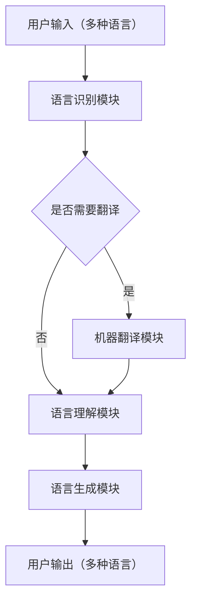

# 多语言支持：构建国际化的AI Agent

> 关键词：多语言支持、国际化、AI Agent、自然语言处理、机器学习

> 摘要：本文围绕构建具备多语言支持能力的国际化AI Agent展开。首先介绍了相关背景，包括目的范围、预期读者等内容。接着深入阐述了核心概念与联系，通过文本示意图和Mermaid流程图展示其原理和架构。详细讲解了核心算法原理，结合Python源代码进行说明，并给出数学模型和公式及具体例子。在项目实战部分，从开发环境搭建到源代码实现和解读都进行了细致描述。还探讨了实际应用场景，推荐了学习资源、开发工具框架以及相关论文著作。最后总结了未来发展趋势与挑战，解答常见问题并提供扩展阅读和参考资料，旨在为开发者提供全面的指导，助力构建高效的国际化AI Agent。

## 1. 背景介绍 
### 1.1 目的和范围
在当今全球化的时代，人们的交流和互动跨越了语言和地域的界限。AI Agent作为一种智能交互工具，若能支持多种语言，将极大地拓展其应用范围和用户群体。构建具备多语言支持的国际化AI Agent的目的在于打破语言障碍，为不同语言背景的用户提供一致、高效、智能的交互体验。

本文章的范围涵盖了从多语言支持的基本概念和原理，到核心算法的实现，再到实际项目开发的全流程。同时，也会探讨多语言AI Agent在不同领域的应用场景，以及为开发者提供相关的学习资源、工具和参考资料。

### 1.2 预期读者
本文的预期读者主要包括以下几类人群：
- **AI开发者**：希望在自己的项目中集成多语言支持功能，提升AI Agent的通用性和适用性。
- **自然语言处理研究者**：对多语言处理技术和算法感兴趣，探索如何优化和改进多语言AI Agent的性能。
- **企业技术负责人**：关注如何利用多语言AI Agent提升企业的服务质量和竞争力，拓展国际市场。
- **对人工智能和多语言技术有兴趣的爱好者**：希望了解多语言AI Agent的基本原理和开发过程，拓宽自己的技术视野。

### 1.3 文档结构概述
本文将按照以下结构进行组织：
- **核心概念与联系**：介绍多语言支持和AI Agent的核心概念，以及它们之间的联系，并通过文本示意图和Mermaid流程图展示其架构。
- **核心算法原理 & 具体操作步骤**：详细讲解实现多语言支持的核心算法，结合Python源代码进行说明。
- **数学模型和公式 & 详细讲解 & 举例说明**：给出相关的数学模型和公式，并通过具体例子进行详细讲解。
- **项目实战：代码实际案例和详细解释说明**：从开发环境搭建开始，逐步实现一个多语言AI Agent的示例项目，并对代码进行详细解读。
- **实际应用场景**：探讨多语言AI Agent在不同领域的实际应用场景。
- **工具和资源推荐**：推荐相关的学习资源、开发工具框架和论文著作。
- **总结：未来发展趋势与挑战**：总结多语言AI Agent的未来发展趋势和面临的挑战。
- **附录：常见问题与解答**：解答读者在学习和开发过程中常见的问题。
- **扩展阅读 & 参考资料**：提供相关的扩展阅读材料和参考资料。

### 1.4 术语表
#### 1.4.1 核心术语定义
- **AI Agent**：人工智能代理，是一种能够感知环境、做出决策并采取行动的智能实体。
- **多语言支持**：指系统或应用程序能够处理和支持多种不同语言的能力。
- **自然语言处理（NLP）**：研究如何让计算机理解、处理和生成人类自然语言的技术。
- **机器翻译**：利用计算机技术将一种自然语言翻译成另一种自然语言的过程。
- **语言模型**：一种基于概率统计的模型，用于预测文本序列中下一个词的概率。

#### 1.4.2 相关概念解释
- **国际化（Internationalization）**：设计和开发软件系统，使其能够适应不同语言、文化和地域的需求，而无需对代码进行大量修改。
- **本地化（Localization）**：将国际化的软件系统进行定制，使其符合特定语言和文化环境的过程，包括翻译界面文本、调整日期和时间格式等。
- **语料库**：用于训练和评估自然语言处理模型的大规模文本数据集合。

#### 1.4.3 缩略词列表
- **NLP**：自然语言处理（Natural Language Processing）
- **MT**：机器翻译（Machine Translation）
- **LM**：语言模型（Language Model）
- **API**：应用程序编程接口（Application Programming Interface）

## 2. 核心概念与联系 

### 核心概念原理
多语言支持的AI Agent的核心原理是将自然语言处理技术与多语言能力相结合，使得AI Agent能够理解和处理不同语言的输入，并生成相应的输出。主要涉及以下几个方面：

- **语言识别**：首先需要识别用户输入的语言，以便选择合适的处理策略和模型。可以使用基于规则的方法或机器学习模型来实现语言识别。
- **机器翻译**：如果用户输入的语言与AI Agent的默认语言不同，需要将输入文本翻译成默认语言进行处理。机器翻译技术可以分为基于规则的方法、统计机器翻译和神经机器翻译等。
- **语言理解**：对翻译后的文本进行语义分析和理解，提取关键信息和意图。可以使用词法分析、句法分析、语义分析等技术来实现语言理解。
- **语言生成**：根据用户的意图和需求，生成相应的回复或建议。语言生成技术可以分为模板生成、基于规则的生成和基于深度学习的生成等。

### 架构的文本示意图
```plaintext
用户输入（多种语言）
|
|-- 语言识别模块
|       |
|       |-- 识别结果
|
|-- 机器翻译模块（可选）
|       |
|       |-- 翻译后文本
|
|-- 语言理解模块
|       |
|       |-- 意图和关键信息
|
|-- 语言生成模块
|       |
|       |-- 回复文本
|
用户输出（多种语言）
```

### Mermaid流程图


## 3. 核心算法原理 & 具体操作步骤 

### 语言识别算法原理及Python实现
语言识别的目的是确定输入文本所属的语言。一种简单而有效的方法是基于字符频率统计。不同语言的字符出现频率有一定的差异，通过统计输入文本中字符的频率，并与预先训练好的各语言字符频率模型进行比较，可以判断输入文本的语言。

以下是一个基于字符频率统计的语言识别Python示例代码：
```python
import collections

# 定义各语言的字符频率模型
language_models = {
    'en': collections.Counter("abcdefghijklmnopqrstuvwxyz "),
    'fr': collections.Counter("abcdefghijklmnopqrstuvwxyzàâæçéèêëîïôœùûüÿ "),
    'es': collections.Counter("abcdefghijklmnopqrstuvwxyzáéíóúüñ ")
}

def language_recognition(text):
    text = text.lower()
    text_counter = collections.Counter(text)
    scores = {}
    for lang, model in language_models.items():
        score = 0
        for char, count in text_counter.items():
            if char in model:
                score += count * model[char]
        scores[lang] = score
    return max(scores, key=scores.get)

# 测试示例
text = "Hello, how are you?"
print(language_recognition(text))  
```

### 机器翻译算法原理及Python实现
神经机器翻译是目前最先进的机器翻译技术，它基于深度学习模型，如Transformer架构。在实际应用中，我们可以使用开源的机器翻译库，如`transformers`。

以下是一个使用`transformers`库进行机器翻译的Python示例代码：
```python
from transformers import MarianMTModel, MarianTokenizer

# 加载预训练的翻译模型和分词器
model_name = 'Helsinki-NLP/opus-mt-en-fr'
tokenizer = MarianTokenizer.from_pretrained(model_name)
model = MarianMTModel.from_pretrained(model_name)

# 待翻译的文本
input_text = "Hello, how are you?"
input_ids = tokenizer.encode(input_text, return_tensors='pt')

# 进行翻译
outputs = model.generate(input_ids)
translated_text = tokenizer.decode(outputs[0], skip_special_tokens=True)

print(translated_text)  
```

### 语言理解算法原理及Python实现
语言理解的一个重要任务是意图识别。可以使用基于机器学习的方法，如朴素贝叶斯分类器。以下是一个使用`sklearn`库实现的简单意图识别示例代码：
```python
from sklearn.feature_extraction.text import CountVectorizer
from sklearn.naive_bayes import MultinomialNB

# 训练数据
training_data = [
    ("Hello", "greeting"),
    ("How are you?", "greeting"),
    ("What's the weather like?", "weather"),
    ("Play music", "music")
]

X = [text for text, _ in training_data]
y = [label for _, label in training_data]

# 特征提取
vectorizer = CountVectorizer()
X_vectorized = vectorizer.fit_transform(X)

# 训练模型
model = MultinomialNB()
model.fit(X_vectorized, y)

# 测试示例
test_text = "What's the weather today?"
test_vectorized = vectorizer.transform([test_text])
predicted_label = model.predict(test_vectorized)

print(predicted_label[0])  
```

### 语言生成算法原理及Python实现
语言生成可以使用基于模板的方法。以下是一个简单的语言生成示例代码：
```python
intents = {
    "greeting": ["Hello!", "Hi!", "Nice to see you!"],
    "weather": ["I don't know the weather. You can check a weather app."],
    "music": ["Playing music now!"]
}

def generate_response(intent):
    if intent in intents:
        import random
        return random.choice(intents[intent])
    return "I don't understand."

# 测试示例
intent = "greeting"
print(generate_response(intent))  
```

## 4. 数学模型和公式 & 详细讲解 & 举例说明 

### 语言识别的数学模型
在基于字符频率统计的语言识别中，我们使用了一个简单的得分函数。设输入文本的字符频率向量为 $\mathbf{x}=(x_1,x_2,\cdots,x_n)$，其中 $x_i$ 表示第 $i$ 个字符的出现频率；某语言的字符频率模型向量为 $\mathbf{y}=(y_1,y_2,\cdots,y_n)$。则输入文本与该语言的得分 $S$ 定义为：

$$S=\sum_{i=1}^{n}x_iy_i$$

我们选择得分最高的语言作为识别结果。

**举例说明**：假设输入文本为 "Hello"，统计其字符频率向量 $\mathbf{x}=(1, 1, 2, 1, 0,\cdots)$，英语的字符频率模型向量 $\mathbf{y}_{en}$ 和法语的字符频率模型向量 $\mathbf{y}_{fr}$。分别计算得分 $S_{en}$ 和 $S_{fr}$，如果 $S_{en}>S_{fr}$，则识别结果为英语。

### 机器翻译的数学模型
神经机器翻译通常基于编码器 - 解码器架构，如Transformer。编码器将输入文本编码为一系列的隐藏状态 $\mathbf{h}=(h_1,h_2,\cdots,h_T)$，解码器根据这些隐藏状态生成目标语言的翻译结果。

Transformer模型使用了多头自注意力机制，其核心公式为：

$$\text{Attention}(Q, K, V)=\text{softmax}\left(\frac{QK^T}{\sqrt{d_k}}\right)V$$

其中 $Q$ 是查询矩阵，$K$ 是键矩阵，$V$ 是值矩阵，$d_k$ 是键向量的维度。

### 语言理解的数学模型
在朴素贝叶斯分类器中，我们使用贝叶斯定理进行意图识别。设 $C$ 表示意图类别，$X$ 表示输入文本的特征向量。根据贝叶斯定理，后验概率 $P(C|X)$ 可以表示为：

$$P(C|X)=\frac{P(X|C)P(C)}{P(X)}$$

由于 $P(X)$ 对于所有类别都是相同的，我们可以忽略它，只比较 $P(X|C)P(C)$ 的大小。在朴素贝叶斯假设下，$P(X|C)$ 可以分解为各个特征的条件概率的乘积：

$$P(X|C)=\prod_{i=1}^{n}P(x_i|C)$$

其中 $x_i$ 是特征向量 $X$ 的第 $i$ 个特征。

**举例说明**：假设我们有两个意图类别 "greeting" 和 "weather"，输入文本为 "What's the weather like?"。我们计算 $P(\text{greeting}|X)$ 和 $P(\text{weather}|X)$，并选择概率较大的类别作为识别结果。

### 语言生成的数学模型
基于模板的语言生成相对简单，没有复杂的数学模型。我们只是根据意图类别从预定义的模板集合中随机选择一个模板作为生成的回复。

## 5. 项目实战：代码实际案例和详细解释说明 

### 5.1  开发环境搭建
#### 安装Python
首先，确保你已经安装了Python 3.x 版本。可以从Python官方网站（https://www.python.org/downloads/） 下载并安装。

#### 安装必要的库
我们需要安装一些必要的Python库，如`transformers`、`sklearn`、`collections`等。可以使用`pip`命令进行安装：
```sh
pip install transformers scikit-learn
```

### 5.2  源代码详细实现和代码解读
以下是一个完整的多语言AI Agent的示例代码：
```python
import collections
from transformers import MarianMTModel, MarianTokenizer
from sklearn.feature_extraction.text import CountVectorizer
from sklearn.naive_bayes import MultinomialNB
import random

# 语言识别模块
language_models = {
    'en': collections.Counter("abcdefghijklmnopqrstuvwxyz "),
    'fr': collections.Counter("abcdefghijklmnopqrstuvwxyzàâæçéèêëîïôœùûüÿ "),
    'es': collections.Counter("abcdefghijklmnopqrstuvwxyzáéíóúüñ ")
}

def language_recognition(text):
    text = text.lower()
    text_counter = collections.Counter(text)
    scores = {}
    for lang, model in language_models.items():
        score = 0
        for char, count in text_counter.items():
            if char in model:
                score += count * model[char]
        scores[lang] = score
    return max(scores, key=scores.get)

# 机器翻译模块
def translate(text, source_lang, target_lang):
    if source_lang == target_lang:
        return text
    model_name = f'Helsinki-NLP/opus-mt-{source_lang}-{target_lang}'
    tokenizer = MarianTokenizer.from_pretrained(model_name)
    model = MarianMTModel.from_pretrained(model_name)
    input_ids = tokenizer.encode(text, return_tensors='pt')
    outputs = model.generate(input_ids)
    translated_text = tokenizer.decode(outputs[0], skip_special_tokens=True)
    return translated_text

# 语言理解模块
training_data = [
    ("Hello", "greeting"),
    ("How are you?", "greeting"),
    ("What's the weather like?", "weather"),
    ("Play music", "music")
]

X = [text for text, _ in training_data]
y = [label for _, label in training_data]

vectorizer = CountVectorizer()
X_vectorized = vectorizer.fit_transform(X)

model = MultinomialNB()
model.fit(X_vectorized, y)

def intent_recognition(text):
    text_vectorized = vectorizer.transform([text])
    predicted_label = model.predict(text_vectorized)
    return predicted_label[0]

# 语言生成模块
intents = {
    "greeting": ["Hello!", "Hi!", "Nice to see you!"],
    "weather": ["I don't know the weather. You can check a weather app."],
    "music": ["Playing music now!"]
}

def generate_response(intent):
    if intent in intents:
        return random.choice(intents[intent])
    return "I don't understand."

# 主函数
def main():
    user_input = input("Please enter your message: ")
    source_lang = language_recognition(user_input)
    target_lang = 'en'  # 默认目标语言为英语
    translated_text = translate(user_input, source_lang, target_lang)
    intent = intent_recognition(translated_text)
    response = generate_response(intent)
    final_response = translate(response, 'en', source_lang)
    print(final_response)

if __name__ == "__main__":
    main()
```

### 5.3  代码解读与分析
- **语言识别模块**：通过统计输入文本中字符的频率，并与预定义的各语言字符频率模型进行比较，选择得分最高的语言作为识别结果。
- **机器翻译模块**：使用`transformers`库中的预训练模型进行机器翻译。根据源语言和目标语言选择合适的模型，将输入文本进行翻译。
- **语言理解模块**：使用朴素贝叶斯分类器进行意图识别。首先对训练数据进行特征提取，然后训练模型，最后对输入文本进行意图分类。
- **语言生成模块**：根据意图类别从预定义的模板集合中随机选择一个模板作为生成的回复。
- **主函数**：接收用户输入，进行语言识别、机器翻译、意图识别和语言生成，最后将回复翻译回用户的源语言并输出。

## 6. 实际应用场景 
### 客户服务
在跨国企业的客户服务中，多语言AI Agent可以自动识别客户的语言，并提供相应的服务和解答。例如，客户可以使用自己的母语与AI Agent交流，AI Agent能够准确理解客户的问题，并提供专业的解决方案，大大提高了客户服务的效率和质量。

### 旅游行业
在旅游领域，多语言AI Agent可以为游客提供多语言的导游服务。游客可以使用自己的母语询问景点信息、交通指南、美食推荐等问题，AI Agent能够及时准确地回答，为游客的旅行提供便利。

### 教育领域
在在线教育平台上，多语言AI Agent可以为不同语言背景的学生提供学习支持。学生可以使用自己的母语提问，AI Agent能够理解问题并提供相应的学习资源和解答，促进跨文化的学习和交流。

### 国际贸易
在国际贸易中，多语言AI Agent可以帮助企业进行商务沟通和谈判。它可以实时翻译双方的语言，理解双方的意图，并提供相应的建议和解决方案，降低语言障碍对贸易的影响。

## 7. 工具和资源推荐
### 7.1 学习资源推荐
#### 7.1.1 书籍推荐
- 《自然语言处理入门》：介绍了自然语言处理的基本概念、算法和技术，适合初学者入门。
- 《深度学习》：详细讲解了深度学习的原理和应用，对于理解神经机器翻译等技术有很大帮助。
- 《统计自然语言处理》：深入探讨了自然语言处理中的统计方法和模型。

#### 7.1.2 在线课程
- Coursera上的“Natural Language Processing Specialization”：由知名教授授课，系统地介绍了自然语言处理的各个方面。
- edX上的“Deep Learning for Natural Language Processing”：专注于深度学习在自然语言处理中的应用。

#### 7.1.3 技术博客和网站
- Medium上的自然语言处理相关博客：有很多优秀的技术文章和实践经验分享。
- Hugging Face官方博客：提供了关于预训练模型、自然语言处理技术的最新动态和使用教程。

### 7.2 开发工具框架推荐
#### 7.2.1 IDE和编辑器
- PyCharm：一款功能强大的Python集成开发环境，提供了代码编辑、调试、版本控制等功能。
- Visual Studio Code：轻量级的代码编辑器，支持多种编程语言和插件扩展。

#### 7.2.2 调试和性能分析工具
- pdb：Python自带的调试器，可以帮助开发者定位和解决代码中的问题。
- TensorBoard：用于可视化深度学习模型的训练过程和性能指标。

#### 7.2.3 相关框架和库
- transformers：Hugging Face开发的自然语言处理库，提供了丰富的预训练模型和工具。
- NLTK：自然语言工具包，包含了许多自然语言处理的工具和数据集。
- SpaCy：高效的自然语言处理库，提供了快速的文本处理和分析功能。

### 7.3 相关论文著作推荐
#### 7.3.1 经典论文
- “Attention Is All You Need”：介绍了Transformer架构，是神经机器翻译和自然语言处理领域的经典论文。
- “A Neural Probabilistic Language Model”：提出了神经语言模型的概念，为后续的语言模型研究奠定了基础。

#### 7.3.2 最新研究成果
- 关注ACL（Association for Computational Linguistics）、EMNLP（Conference on Empirical Methods in Natural Language Processing）等顶级自然语言处理会议的最新论文，了解该领域的前沿研究成果。

#### 7.3.3 应用案例分析
- 一些企业和研究机构会发布多语言AI Agent的应用案例分析报告，可以从中学习到实际应用中的经验和技巧。

## 8. 总结：未来发展趋势与挑战
### 未来发展趋势
- **更强大的语言理解能力**：未来的多语言AI Agent将能够更准确地理解不同语言的语义和语境，处理更加复杂的语言表达。
- **个性化交互体验**：根据用户的语言习惯、文化背景和偏好，提供个性化的交互服务。
- **跨语言知识融合**：实现不同语言之间的知识共享和融合，提高AI Agent的智能水平。
- **与其他技术的融合**：与语音识别、图像识别等技术相结合，提供更加丰富的交互方式。

### 挑战
- **语言多样性和复杂性**：世界上有数千种语言，每种语言都有其独特的语法、词汇和文化背景，处理语言的多样性和复杂性是一个巨大的挑战。
- **数据稀缺问题**：对于一些小语种，可用的训练数据非常有限，这会影响模型的性能和泛化能力。
- **文化差异**：不同语言背后蕴含着不同的文化，理解和处理文化差异对于多语言AI Agent来说是一个难题。
- **计算资源需求**：神经机器翻译等技术需要大量的计算资源，如何在有限的资源下实现高效的多语言处理是一个挑战。

## 9. 附录：常见问题与解答
### 问题1：如何提高语言识别的准确率？
答：可以使用更复杂的机器学习模型，如深度学习模型，来进行语言识别。同时，增加训练数据的多样性和规模，也可以提高识别的准确率。

### 问题2：机器翻译的质量如何评估？
答：常见的评估指标有BLEU（Bilingual Evaluation Understudy）、ROUGE（Recall-Oriented Understudy for Gisting Evaluation）等。这些指标通过比较翻译结果与参考译文的相似度来评估翻译质量。

### 问题3：如何处理多语言中的歧义问题？
答：可以结合上下文信息、语境分析和知识图谱等技术，来消除歧义。同时，使用更强大的语言模型也有助于提高对歧义的处理能力。

### 问题4：如何优化多语言AI Agent的性能？
答：可以从以下几个方面进行优化：选择合适的算法和模型，增加训练数据，进行模型调优，优化计算资源的使用等。

## 10. 扩展阅读 & 参考资料
### 扩展阅读
- 《人工智能时代的自然语言处理》：深入探讨了自然语言处理在人工智能时代的发展和应用。
- 《多语言信息处理技术》：专门介绍了多语言信息处理的相关技术和方法。

### 参考资料
- Hugging Face官方文档：https://huggingface.co/docs
- NLTK官方文档：https://www.nltk.org/
- SpaCy官方文档：https://spacy.io/

作者：AI天才研究院/AI Genius Institute & 禅与计算机程序设计艺术 /Zen And The Art of Computer Programming