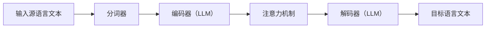

# 多语言翻译 AI Agent：LLM 在跨语言交流中的应用

> 关键词：多语言翻译、AI Agent、大语言模型（LLM）、跨语言交流、自然语言处理

> 摘要：本文聚焦于多语言翻译 AI Agent 在跨语言交流中的应用。详细阐述了相关核心概念、算法原理、数学模型，通过实际代码案例展示其实现过程。分析了多语言翻译 AI Agent 在不同场景下的应用，推荐了学习资源、开发工具及相关论文著作。最后对其未来发展趋势与挑战进行了总结，并提供常见问题解答与扩展阅读参考资料，旨在为读者全面深入地介绍多语言翻译 AI Agent 及其在跨语言交流中的重要作用。

## 1. 背景介绍 
### 1.1 目的和范围
在全球化的时代背景下，跨语言交流的需求日益增长。多语言翻译 AI Agent 作为一种强大的工具，能够打破语言障碍，促进不同语言群体之间的信息传递和文化交流。本文的目的在于深入探讨多语言翻译 AI Agent 的技术原理、实现方法以及在跨语言交流中的具体应用。范围涵盖从核心概念的解释到算法原理的分析，从数学模型的建立到实际项目的案例展示，还包括对相关工具和资源的推荐以及未来发展趋势的展望。

### 1.2 预期读者
本文预期读者包括对自然语言处理、人工智能领域感兴趣的科研人员、开发者、学生，以及希望了解多语言翻译技术在跨语言交流中应用的企业管理人员和相关从业者。无论您是初学者想要了解基础知识，还是专业人士寻求技术创新和应用拓展，本文都能为您提供有价值的信息。

### 1.3 文档结构概述
本文将按照以下结构展开：首先介绍多语言翻译 AI Agent 相关的核心概念和它们之间的联系，包括文本示意图和 Mermaid 流程图；接着详细阐述核心算法原理，并给出具体的 Python 代码实现；然后介绍相关的数学模型和公式，并通过举例进行说明；之后通过实际项目案例，展示多语言翻译 AI Agent 的开发环境搭建、源代码实现和代码解读；再探讨其实际应用场景；推荐学习资源、开发工具和相关论文著作；最后总结未来发展趋势与挑战，提供常见问题解答和扩展阅读参考资料。

### 1.4 术语表
#### 1.4.1 核心术语定义
- **多语言翻译 AI Agent**：一种具备人工智能能力的智能体，能够自动处理多种语言之间的翻译任务，通过学习大量的多语言数据，实现准确、流畅的语言转换。
- **大语言模型（LLM）**：基于深度学习技术，在大规模文本数据上进行训练的语言模型，具有强大的语言理解和生成能力，能够处理各种自然语言处理任务，如文本生成、问答系统等。
- **跨语言交流**：不同语言背景的个体或群体之间进行信息传递、思想交流和文化互动的过程。
- **自然语言处理（NLP）**：研究如何让计算机理解、处理和生成人类自然语言的技术领域，包括分词、词性标注、句法分析、机器翻译等任务。

#### 1.4.2 相关概念解释
- **注意力机制**：在深度学习中，注意力机制允许模型在处理序列数据时，自动关注序列中不同部分的重要性，从而提高模型的性能。在多语言翻译中，注意力机制可以帮助模型更好地捕捉源语言和目标语言之间的对应关系。
- **Transformer 架构**：一种基于注意力机制的深度学习架构，在自然语言处理领域取得了巨大成功。Transformer 架构具有并行计算的优势，能够处理长序列数据，并且在多语言翻译任务中表现出色。

#### 1.4.3 缩略词列表
- **LLM**：Large Language Model（大语言模型）
- **NLP**：Natural Language Processing（自然语言处理）
- **API**：Application Programming Interface（应用程序编程接口）

## 2. 核心概念与联系 
### 核心概念原理
多语言翻译 AI Agent 是基于大语言模型（LLM）构建的智能系统，其核心原理是利用 LLM 的强大语言理解和生成能力，实现不同语言之间的翻译。LLM 通过在大规模的多语言文本数据上进行预训练，学习到语言的语法、语义和语用信息，从而能够理解输入的源语言文本，并生成对应的目标语言文本。

在翻译过程中，多语言翻译 AI Agent 首先对输入的源语言文本进行编码，将其转换为模型能够处理的向量表示。然后，模型利用注意力机制对源语言文本的不同部分进行加权处理，关注重要的信息。最后，模型根据编码后的信息生成目标语言文本，通过解码过程将向量表示转换为自然语言句子。

### 架构的文本示意图
```plaintext
输入源语言文本 -> 分词器 -> 编码器（LLM） -> 注意力机制 -> 解码器（LLM） -> 目标语言文本
```
上述示意图展示了多语言翻译 AI Agent 的基本架构。输入的源语言文本首先经过分词器进行分词处理，将文本分割成一个个单词或子词。然后，分词后的文本输入到编码器中，编码器利用 LLM 对文本进行编码，得到文本的向量表示。注意力机制在编码过程中发挥作用，帮助模型关注重要的信息。最后，解码器根据编码后的信息生成目标语言文本。

### Mermaid 流程图


## 3. 核心算法原理 & 具体操作步骤 
### 核心算法原理
多语言翻译 AI Agent 通常基于 Transformer 架构的大语言模型实现，其核心算法包括编码器和解码器两部分。

#### 编码器
编码器的主要作用是将输入的源语言文本转换为向量表示。Transformer 编码器由多个相同的编码层组成，每个编码层包含多头自注意力机制和前馈神经网络。多头自注意力机制允许模型在不同的表示子空间中关注输入序列的不同部分，从而提高模型的表达能力。前馈神经网络则对注意力机制的输出进行非线性变换。

#### 解码器
解码器的作用是根据编码器的输出生成目标语言文本。解码器同样由多个相同的解码层组成，每个解码层包含多头自注意力机制、编码器 - 解码器注意力机制和前馈神经网络。编码器 - 解码器注意力机制允许解码器关注编码器的输出，从而获取源语言文本的信息。

### 具体操作步骤
以下是使用 Python 和 Hugging Face 的 Transformers 库实现简单多语言翻译的具体步骤和代码示例：

```python
from transformers import AutoTokenizer, AutoModelForSeq2SeqLM

# 步骤 1：加载预训练的分词器和模型
tokenizer = AutoTokenizer.from_pretrained("Helsinki-NLP/opus-mt-en-fr")
model = AutoModelForSeq2SeqLM.from_pretrained("Helsinki-NLP/opus-mt-en-fr")

# 步骤 2：输入源语言文本
source_text = "Hello, how are you?"

# 步骤 3：对源语言文本进行分词
input_ids = tokenizer(source_text, return_tensors="pt").input_ids

# 步骤 4：使用模型进行翻译
outputs = model.generate(input_ids)

# 步骤 5：将模型输出的向量转换为目标语言文本
target_text = tokenizer.decode(outputs[0], skip_special_tokens=True)

print("源语言文本：", source_text)
print("目标语言文本：", target_text)
```

### 代码解释
1. **加载预训练的分词器和模型**：使用 `AutoTokenizer` 和 `AutoModelForSeq2SeqLM` 从 Hugging Face 的模型库中加载预训练的分词器和翻译模型。这里使用的是 `Helsinki-NLP/opus-mt-en-fr` 模型，该模型可以实现英语到法语的翻译。
2. **输入源语言文本**：定义需要翻译的源语言文本。
3. **分词**：使用分词器对源语言文本进行分词处理，将文本转换为模型能够处理的输入 ID。
4. **翻译**：使用模型的 `generate` 方法对输入的 ID 进行翻译，生成目标语言文本的 ID。
5. **解码**：使用分词器的 `decode` 方法将模型输出的 ID 转换为自然语言文本。

## 4. 数学模型和公式 & 详细讲解 & 举例说明 
### 多头自注意力机制
多头自注意力机制是 Transformer 架构的核心组件之一，其数学模型可以表示为：

$$
\text{MultiHead}(Q, K, V) = \text{Concat}(\text{head}_1, \ldots, \text{head}_h)W^O
$$

其中，$\text{head}_i = \text{Attention}(QW_i^Q, KW_i^K, VW_i^V)$，$W_i^Q \in \mathbb{R}^{d_{\text{model}} \times d_k}$，$W_i^K \in \mathbb{R}^{d_{\text{model}} \times d_k}$，$W_i^V \in \mathbb{R}^{d_{\text{model}} \times d_v}$，$W^O \in \mathbb{R}^{hd_v \times d_{\text{model}}}$ 是可学习的参数矩阵，$h$ 是头的数量，$d_{\text{model}}$ 是模型的维度，$d_k$ 和 $d_v$ 分别是键和值的维度。

注意力函数定义为：

$$
\text{Attention}(Q, K, V) = \text{softmax}\left(\frac{QK^T}{\sqrt{d_k}}\right)V
$$

### 详细讲解
多头自注意力机制通过将输入的查询（$Q$）、键（$K$）和值（$V$）分别投影到多个子空间中，然后在每个子空间中计算注意力得分，最后将各个子空间的注意力结果拼接起来并进行线性变换得到最终的输出。这种机制允许模型在不同的表示子空间中关注输入序列的不同部分，从而提高模型的表达能力。

### 举例说明
假设我们有一个输入序列 $x = [x_1, x_2, x_3]$，其中每个 $x_i$ 是一个 $d_{\text{model}}$ 维的向量。我们可以将 $x$ 作为查询、键和值输入到多头自注意力机制中。首先，我们将 $x$ 分别与 $W_i^Q$、$W_i^K$ 和 $W_i^V$ 相乘，得到 $Q_i$、$K_i$ 和 $V_i$。然后，我们计算注意力得分：

$$
\text{scores}_{ij} = \frac{(Q_i)_j(K_i)^T}{\sqrt{d_k}}
$$

其中，$(Q_i)_j$ 是 $Q_i$ 的第 $j$ 行。接着，我们对得分进行 softmax 操作，得到注意力权重：

$$
\text{weights}_{ij} = \text{softmax}(\text{scores}_{ij})
$$

最后，我们根据注意力权重对 $V_i$ 进行加权求和，得到每个头的输出：

$$
\text{head}_i = \sum_{j} \text{weights}_{ij} (V_i)_j
$$

将所有头的输出拼接起来并进行线性变换，就得到了多头自注意力机制的最终输出。

## 5. 项目实战：代码实际案例和详细解释说明 
### 5.1  开发环境搭建
#### 安装 Python
首先，确保你已经安装了 Python 3.6 或更高版本。你可以从 Python 官方网站（https://www.python.org/downloads/）下载并安装 Python。

#### 创建虚拟环境
为了避免不同项目之间的依赖冲突，建议使用虚拟环境。可以使用 `venv` 模块创建虚拟环境：

```bash
python -m venv myenv
```

激活虚拟环境：

- 在 Windows 上：
```bash
myenv\Scripts\activate
```

- 在 Linux 或 macOS 上：
```bash
source myenv/bin/activate
```

#### 安装依赖库
在虚拟环境中安装所需的依赖库，包括 `transformers`、`torch` 等：

```bash
pip install transformers torch
```

### 5.2  源代码详细实现和代码解读
以下是一个更完整的多语言翻译项目的代码示例，支持多种语言之间的翻译：

```python
from transformers import AutoTokenizer, AutoModelForSeq2SeqLM

# 支持的语言对映射
language_pairs = {
    "en-fr": "Helsinki-NLP/opus-mt-en-fr",
    "fr-en": "Helsinki-NLP/opus-mt-fr-en",
    "en-de": "Helsinki-NLP/opus-mt-en-de",
    "de-en": "Helsinki-NLP/opus-mt-de-en"
}

def translate_text(source_text, source_language, target_language):
    # 构建语言对的键
    language_pair = f"{source_language}-{target_language}"
    
    # 检查语言对是否支持
    if language_pair not in language_pairs:
        print(f"不支持的语言对：{language_pair}")
        return None
    
    # 加载预训练的分词器和模型
    model_name = language_pairs[language_pair]
    tokenizer = AutoTokenizer.from_pretrained(model_name)
    model = AutoModelForSeq2SeqLM.from_pretrained(model_name)
    
    # 对源语言文本进行分词
    input_ids = tokenizer(source_text, return_tensors="pt").input_ids
    
    # 使用模型进行翻译
    outputs = model.generate(input_ids)
    
    # 将模型输出的向量转换为目标语言文本
    target_text = tokenizer.decode(outputs[0], skip_special_tokens=True)
    
    return target_text

# 示例使用
source_text = "Hello, how are you?"
source_language = "en"
target_language = "fr"

translated_text = translate_text(source_text, source_language, target_language)
if translated_text:
    print(f"源语言文本：{source_text}")
    print(f"目标语言文本：{translated_text}")
```

### 代码解读与分析
1. **语言对映射**：定义了一个字典 `language_pairs`，用于存储支持的语言对和对应的预训练模型名称。
2. **翻译函数 `translate_text`**：该函数接受源语言文本、源语言和目标语言作为输入，返回翻译后的目标语言文本。
    - 首先，构建语言对的键，并检查该语言对是否支持。
    - 然后，根据语言对加载对应的预训练分词器和模型。
    - 接着，对源语言文本进行分词，将其转换为模型能够处理的输入 ID。
    - 使用模型的 `generate` 方法进行翻译，生成目标语言文本的 ID。
    - 最后，使用分词器的 `decode` 方法将模型输出的 ID 转换为自然语言文本。
3. **示例使用**：定义了源语言文本、源语言和目标语言，并调用 `translate_text` 函数进行翻译，将翻译结果打印输出。

## 6. 实际应用场景 
### 跨境电商
在跨境电商领域，多语言翻译 AI Agent 可以帮助商家将商品信息、产品描述等内容翻译成多种语言，以便更好地服务不同国家和地区的客户。同时，也可以帮助客户将自己的需求和反馈翻译成商家的语言，促进沟通和交易。

### 国际会议
在国际会议中，多语言翻译 AI Agent 可以实时将演讲内容翻译成多种语言，方便不同语言背景的参会人员理解。同时，也可以为参会人员提供多语言的会议资料和信息，提高会议的效率和参与度。

### 教育领域
在教育领域，多语言翻译 AI Agent 可以帮助学生学习不同语言的知识，将教材、课件等内容翻译成学生熟悉的语言。同时，也可以为教师提供多语言的教学资源和工具，促进国际教育交流与合作。

### 旅游行业
在旅游行业，多语言翻译 AI Agent 可以帮助游客在国外旅游时进行语言交流，将景点介绍、餐厅菜单、交通信息等内容翻译成游客的母语。同时，也可以为旅游从业者提供多语言的服务和支持，提高旅游服务的质量。

## 7. 工具和资源推荐
### 7.1 学习资源推荐
#### 7.1.1 书籍推荐
- 《自然语言处理入门》：作者何晗，本书系统地介绍了自然语言处理的基本概念、方法和技术，适合初学者入门。
- 《深度学习》：作者 Ian Goodfellow、Yoshua Bengio 和 Aaron Courville，本书是深度学习领域的经典教材，详细介绍了深度学习的理论和实践。
- 《Attention Is All You Need》：这篇论文介绍了 Transformer 架构，是自然语言处理领域的重要文献。

#### 7.1.2 在线课程
- Coursera 上的 “Natural Language Processing Specialization”：由斯坦福大学的教授授课，涵盖了自然语言处理的多个方面，包括机器翻译、情感分析等。
- edX 上的 “Deep Learning Specialization”：由 Andrew Ng 教授授课，深入介绍了深度学习的原理和应用。

#### 7.1.3 技术博客和网站
- Hugging Face 官方博客（https://huggingface.co/blog）：提供了关于自然语言处理和深度学习的最新技术和研究成果。
- Towards Data Science（https://towardsdatascience.com）：是一个数据科学和机器学习领域的技术博客，有很多关于自然语言处理的文章。

### 7.2 开发工具框架推荐
#### 7.2.1 IDE和编辑器
- PyCharm：是一款专业的 Python 集成开发环境，提供了丰富的代码编辑、调试和项目管理功能。
- Visual Studio Code：是一款轻量级的代码编辑器，支持多种编程语言，并且有丰富的插件扩展。

#### 7.2.2 调试和性能分析工具
- TensorBoard：是 TensorFlow 提供的可视化工具，可以帮助开发者可视化模型的训练过程、性能指标等。
- Py-Spy：是一个用于 Python 代码性能分析的工具，可以帮助开发者找出代码中的性能瓶颈。

#### 7.2.3 相关框架和库
- Transformers：是 Hugging Face 开发的一个开源库，提供了多种预训练的自然语言处理模型，包括 BERT、GPT 等。
- Torch：是 PyTorch 的核心库，提供了丰富的深度学习工具和函数。

### 7.3 相关论文著作推荐
#### 7.3.1 经典论文
- 《Neural Machine Translation by Jointly Learning to Align and Translate》：提出了基于注意力机制的神经机器翻译模型。
- 《BERT: Pre-training of Deep Bidirectional Transformers for Language Understanding》：介绍了 BERT 模型，是自然语言处理领域的重要突破。

#### 7.3.2 最新研究成果
- 《GPT-3: Language Models are Few-Shot Learners》：介绍了 GPT-3 模型，展示了大语言模型在少样本学习方面的强大能力。
- 《XLNet: Generalized Autoregressive Pretraining for Language Understanding》：提出了 XLNet 模型，在多个自然语言处理任务上取得了优异的成绩。

#### 7.3.3 应用案例分析
- 《Machine Translation in the Real World: A Case Study of Google Translate》：分析了 Google Translate 在实际应用中的情况和面临的挑战。
- 《Multilingual Machine Translation for Cross-Lingual Communication in the European Union》：研究了多语言机器翻译在欧盟跨语言交流中的应用。

## 8. 总结：未来发展趋势与挑战
### 未来发展趋势
- **模型性能提升**：随着计算资源的不断增加和算法的不断改进，多语言翻译 AI Agent 的性能将不断提升，翻译的准确性和流畅性将进一步提高。
- **多模态翻译**：未来的多语言翻译 AI Agent 将不仅仅局限于文本翻译，还将支持图像、音频、视频等多模态信息的翻译，实现更加全面的跨语言交流。
- **个性化翻译**：根据用户的语言习惯、文化背景等因素，提供个性化的翻译服务，提高翻译的质量和用户体验。
- **与其他技术的融合**：多语言翻译 AI Agent 将与语音识别、语音合成、知识图谱等技术进行融合，实现更加智能化的跨语言交流。

### 挑战
- **数据质量和数量**：高质量的多语言数据是训练多语言翻译 AI Agent 的关键，但目前多语言数据的质量和数量仍然存在不足，需要进一步收集和整理。
- **语言多样性**：世界上存在着数千种语言，每种语言都有其独特的语法、语义和语用特点，如何处理语言的多样性是一个挑战。
- **文化差异**：不同语言背后蕴含着不同的文化背景，在翻译过程中需要考虑文化差异，避免出现误解和歧义。
- **伦理和法律问题**：多语言翻译 AI Agent 的应用可能会涉及到隐私保护、数据安全、知识产权等伦理和法律问题，需要制定相应的规范和标准。

## 9. 附录：常见问题与解答
### 问题 1：多语言翻译 AI Agent 可以处理所有语言吗？
答：目前的多语言翻译 AI Agent 还不能处理所有语言。虽然已经有一些模型支持多种语言，但仍然存在一些语言由于数据稀缺、语言结构复杂等原因，无法得到很好的处理。不过，随着技术的发展和数据的不断积累，支持的语言种类会逐渐增加。

### 问题 2：多语言翻译 AI Agent 的翻译质量如何保证？
答：保证多语言翻译 AI Agent 的翻译质量需要从多个方面入手。首先，使用高质量的训练数据进行模型训练，数据的准确性和多样性对翻译质量有很大影响。其次，采用先进的算法和架构，如 Transformer 架构和注意力机制，提高模型的性能。此外，还可以通过人工评估和反馈，不断优化模型。

### 问题 3：多语言翻译 AI Agent 的部署成本高吗？
答：多语言翻译 AI Agent 的部署成本取决于多个因素，如模型的大小、计算资源的需求、使用的云服务等。一些开源的预训练模型可以在本地部署，成本相对较低；而一些大型的商业模型可能需要使用云服务，成本会相对较高。在实际应用中，可以根据具体需求和预算选择合适的部署方式。

### 问题 4：多语言翻译 AI Agent 可以实时翻译吗？
答：一些轻量级的多语言翻译 AI Agent 可以实现实时翻译，但对于一些复杂的任务和大型模型，实时翻译可能会受到计算资源和网络延迟的影响。为了实现实时翻译，需要优化模型结构、提高计算效率，并采用合适的硬件设备和网络环境。

## 10. 扩展阅读 & 参考资料
- 《自然语言处理实战：基于Python和深度学习》
- 《人工智能：现代方法》
- Hugging Face 官方文档（https://huggingface.co/docs/transformers/index）
- OpenAI 官方网站（https://openai.com/）

作者：AI天才研究院/AI Genius Institute & 禅与计算机程序设计艺术 /Zen And The Art of Computer Programming