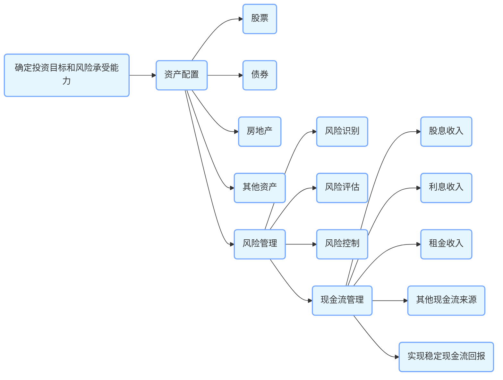

# 多资产收益策略：构建稳定现金流的投资组合

> 关键词：多资产收益策略、投资组合、稳定现金流、资产配置、风险管理

> 摘要：本文深入探讨了多资产收益策略，旨在帮助投资者构建能够产生稳定现金流的投资组合。首先介绍了该策略的背景知识，包括目的、预期读者等内容。接着阐述了核心概念与联系，详细讲解了核心算法原理及具体操作步骤，给出了相关数学模型和公式并举例说明。通过项目实战，展示了如何在实际中运用该策略构建投资组合并进行代码实现与分析。同时分析了该策略的实际应用场景，推荐了相关的工具和资源。最后总结了未来发展趋势与挑战，提供了常见问题解答及扩展阅读参考资料，帮助读者全面了解和应用多资产收益策略。

## 1. 背景介绍 
### 1.1 目的和范围
在金融市场中，投资者往往面临着多种挑战，如市场波动、单一资产风险集中等问题。多资产收益策略的目的在于通过合理配置不同类型的资产，降低投资组合的整体风险，同时实现稳定的现金流回报。本文章的范围涵盖了多资产收益策略的基本概念、原理、算法、数学模型、实际应用以及相关工具资源等方面，旨在为投资者和金融从业者提供全面的指导，帮助他们理解和运用该策略来构建有效的投资组合。

### 1.2 预期读者
本文预期读者包括但不限于个人投资者、金融分析师、投资顾问、基金经理以及对金融投资领域感兴趣的学生和研究人员。无论您是初涉投资领域，希望了解如何构建稳定投资组合的新手，还是经验丰富的专业人士，寻求优化投资策略的方法，都能从本文中获得有价值的信息。

### 1.3 文档结构概述
本文将按照以下结构展开：首先介绍多资产收益策略的背景知识，包括目的、预期读者和文档结构概述等内容。然后深入探讨核心概念与联系，通过文本示意图和 Mermaid 流程图展示其原理和架构。接着详细讲解核心算法原理及具体操作步骤，并给出 Python 源代码示例。之后介绍相关的数学模型和公式，并进行详细讲解和举例说明。通过项目实战，展示如何在实际中运用该策略构建投资组合并进行代码实现与分析。分析该策略的实际应用场景，推荐相关的工具和资源。最后总结未来发展趋势与挑战，提供常见问题解答及扩展阅读参考资料。

### 1.4 术语表
#### 1.4.1 核心术语定义
- **多资产收益策略**：一种投资策略，通过同时投资于多种不同类型的资产，如股票、债券、房地产等，以实现风险分散和稳定的现金流回报。
- **投资组合**：由多种资产组成的集合，投资者通过合理配置不同资产的比例，来实现投资目标。
- **稳定现金流**：指投资组合在一定时期内能够持续产生相对稳定的现金流入，如股息、利息、租金等。
- **资产配置**：确定投资组合中不同资产的种类和比例的过程，是多资产收益策略的核心环节。
- **风险管理**：识别、评估和控制投资组合风险的过程，旨在降低投资损失的可能性。

#### 1.4.2 相关概念解释
- **风险分散**：通过投资于多种不同的资产，降低单一资产对投资组合的影响，从而减少整体风险。不同资产在不同市场环境下的表现可能不同，因此将它们组合在一起可以平衡投资组合的风险和收益。
- **资产相关性**：衡量不同资产之间价格变动的关联程度。相关性较低的资产组合可以更好地实现风险分散，因为当一种资产价格下跌时，另一种资产价格可能不受影响或上涨。
- **现金流折现**：将未来的现金流按照一定的折现率折算为当前的价值，用于评估投资项目的价值和可行性。

#### 1.4.3 缩略词列表
- **ETF**：交易型开放式指数基金（Exchange Traded Fund）
- **REITs**：房地产投资信托基金（Real Estate Investment Trusts）
- **CAPM**：资本资产定价模型（Capital Asset Pricing Model）

## 2. 核心概念与联系 

### 核心概念原理
多资产收益策略的核心原理在于通过资产配置和风险分散，实现投资组合的稳定现金流回报。不同类型的资产具有不同的风险和收益特征，例如股票具有较高的收益潜力，但风险也相对较高；债券则收益相对稳定，风险较低。通过将不同类型的资产组合在一起，可以在降低风险的同时，实现较为稳定的现金流。

资产配置是多资产收益策略的关键环节，它需要考虑投资者的风险承受能力、投资目标、投资期限等因素。合理的资产配置可以使投资组合在不同市场环境下都能保持较好的表现。

风险管理也是多资产收益策略的重要组成部分，通过对投资组合的风险进行识别、评估和控制，可以降低投资损失的可能性。常用的风险管理方法包括分散投资、止损、套期保值等。

### 架构的文本示意图
```plaintext
多资产收益策略
├── 资产配置
│   ├── 股票
│   ├── 债券
│   ├── 房地产
│   ├── 其他资产（如商品、现金等）
├── 风险管理
│   ├── 风险识别
│   ├── 风险评估
│   ├── 风险控制
├── 现金流管理
│   ├── 股息收入
│   ├── 利息收入
│   ├── 租金收入
│   ├── 其他现金流来源
```

### Mermaid 流程图


## 3. 核心算法原理 & 具体操作步骤 

### 核心算法原理
多资产收益策略的核心算法主要涉及资产配置和风险评估。一种常用的资产配置方法是现代投资组合理论（Modern Portfolio Theory, MPT），该理论由哈里·马科维茨（Harry Markowitz）提出，通过计算资产的预期收益率、方差和协方差，来确定最优的资产配置比例，以实现投资组合的风险最小化或收益最大化。

另一种常用的方法是风险平价策略（Risk Parity Strategy），该策略通过平衡不同资产的风险贡献，来实现投资组合的风险均衡。在风险平价策略中，每个资产的风险贡献与其在投资组合中的权重成正比，通过调整资产的权重，使每个资产的风险贡献相等。

### 具体操作步骤
1. **确定投资目标和风险承受能力**：投资者需要明确自己的投资目标，如长期资本增值、短期收益、稳定现金流等，并评估自己的风险承受能力。
2. **选择资产类别**：根据投资目标和风险承受能力，选择适合的资产类别，如股票、债券、房地产、商品等。
3. **收集资产数据**：收集所选资产的历史数据，包括收益率、波动率、相关性等。
4. **计算资产的预期收益率、方差和协方差**：根据历史数据，计算每个资产的预期收益率、方差和协方差。
5. **确定资产配置比例**：使用现代投资组合理论或风险平价策略等方法，确定每个资产在投资组合中的最优配置比例。
6. **构建投资组合**：根据确定的资产配置比例，购买相应的资产，构建投资组合。
7. **监控和调整投资组合**：定期监控投资组合的表现，根据市场变化和投资者的需求，调整资产配置比例。

### Python 源代码示例
```python
import numpy as np
import pandas as pd
from scipy.optimize import minimize

# 假设我们有三种资产：股票、债券和现金
# 资产的预期收益率
expected_returns = np.array([0.1, 0.05, 0.02])
# 资产的协方差矩阵
cov_matrix = np.array([[0.2, 0.05, 0.02],
                       [0.05, 0.1, 0.01],
                       [0.02, 0.01, 0.005]])

# 定义目标函数：最小化投资组合的方差
def portfolio_variance(weights, cov_matrix):
    return np.dot(weights.T, np.dot(cov_matrix, weights))

# 定义约束条件：权重之和为 1
def weight_constraint(weights):
    return np.sum(weights) - 1

# 定义边界条件：权重范围在 0 到 1 之间
bounds = [(0, 1) for _ in range(len(expected_returns))]

# 初始权重
initial_weights = np.ones(len(expected_returns)) / len(expected_returns)

# 优化问题
constraints = [{'type': 'eq', 'fun': weight_constraint}]
result = minimize(portfolio_variance, initial_weights, args=(cov_matrix,),
                  method='SLSQP', bounds=bounds, constraints=constraints)

# 最优权重
optimal_weights = result.x
print("最优权重：", optimal_weights)
```

## 4. 数学模型和公式 & 详细讲解 & 举例说明 

### 现代投资组合理论（MPT）
现代投资组合理论的核心是通过计算投资组合的预期收益率和方差，来确定最优的资产配置比例。

#### 投资组合的预期收益率
投资组合的预期收益率 $E(R_p)$ 是每个资产预期收益率的加权平均值，计算公式为：
$$E(R_p) = \sum_{i=1}^{n} w_i E(R_i)$$
其中，$w_i$ 是第 $i$ 个资产的权重，$E(R_i)$ 是第 $i$ 个资产的预期收益率，$n$ 是资产的数量。

#### 投资组合的方差
投资组合的方差 $\sigma_p^2$ 计算公式为：
$$\sigma_p^2 = \sum_{i=1}^{n} \sum_{j=1}^{n} w_i w_j \sigma_{ij}$$
其中，$\sigma_{ij}$ 是资产 $i$ 和资产 $j$ 的协方差。

#### 举例说明
假设我们有两种资产：股票和债券。股票的预期收益率为 10%，波动率为 20%；债券的预期收益率为 5%，波动率为 10%。两种资产的相关系数为 0.2。我们将投资组合的权重分别设为 $w_1$ 和 $w_2$，且 $w_1 + w_2 = 1$。

股票的预期收益率 $E(R_1) = 0.1$，方差 $\sigma_1^2 = 0.2^2 = 0.04$；债券的预期收益率 $E(R_2) = 0.05$，方差 $\sigma_2^2 = 0.1^2 = 0.01$。

协方差 $\sigma_{12} = \rho_{12} \sigma_1 \sigma_2 = 0.2 \times 0.2 \times 0.1 = 0.004$

投资组合的预期收益率 $E(R_p) = w_1 \times 0.1 + w_2 \times 0.05$

投资组合的方差 $\sigma_p^2 = w_1^2 \times 0.04 + w_2^2 \times 0.01 + 2 \times w_1 \times w_2 \times 0.004$

### 风险平价策略
风险平价策略的核心是平衡不同资产的风险贡献，使每个资产的风险贡献相等。

#### 资产的风险贡献
资产 $i$ 的风险贡献 $RC_i$ 计算公式为：
$$RC_i = w_i \frac{\partial \sigma_p}{\partial w_i}$$
其中，$\frac{\partial \sigma_p}{\partial w_i}$ 是投资组合方差关于资产 $i$ 权重的偏导数。

#### 举例说明
假设我们有三种资产：股票、债券和现金。投资组合的权重分别为 $w_1$、$w_2$ 和 $w_3$。通过计算每个资产的风险贡献，并调整权重，使 $RC_1 = RC_2 = RC_3$，即可实现风险平价。

## 5. 项目实战：代码实际案例和详细解释说明 

### 5.1  开发环境搭建
- **Python 环境**：建议使用 Python 3.7 及以上版本。可以从 Python 官方网站（https://www.python.org/downloads/）下载并安装。
- **必要的库**：需要安装 `numpy`、`pandas`、`scipy` 等库。可以使用以下命令进行安装：
```sh
pip install numpy pandas scipy
```

### 5.2  源代码详细实现和代码解读
```python
import numpy as np
import pandas as pd
from scipy.optimize import minimize

# 读取资产数据
def read_data():
    # 这里假设我们有一个 CSV 文件，包含三种资产的历史收益率数据
    data = pd.read_csv('asset_returns.csv')
    returns = data.pct_change().dropna()
    return returns

# 计算资产的预期收益率和协方差矩阵
def calculate_stats(returns):
    expected_returns = returns.mean()
    cov_matrix = returns.cov()
    return expected_returns, cov_matrix

# 定义目标函数：最小化投资组合的方差
def portfolio_variance(weights, cov_matrix):
    return np.dot(weights.T, np.dot(cov_matrix, weights))

# 定义约束条件：权重之和为 1
def weight_constraint(weights):
    return np.sum(weights) - 1

# 定义边界条件：权重范围在 0 到 1 之间
def get_bounds(num_assets):
    return [(0, 1) for _ in range(num_assets)]

# 优化资产配置
def optimize_portfolio(expected_returns, cov_matrix):
    num_assets = len(expected_returns)
    initial_weights = np.ones(num_assets) / num_assets
    bounds = get_bounds(num_assets)
    constraints = [{'type': 'eq', 'fun': weight_constraint}]
    result = minimize(portfolio_variance, initial_weights, args=(cov_matrix,),
                      method='SLSQP', bounds=bounds, constraints=constraints)
    optimal_weights = result.x
    return optimal_weights

# 主函数
def main():
    returns = read_data()
    expected_returns, cov_matrix = calculate_stats(returns)
    optimal_weights = optimize_portfolio(expected_returns, cov_matrix)
    print("最优权重：", optimal_weights)

if __name__ == "__main__":
    main()
```

### 5.3  代码解读与分析
- **read_data 函数**：用于读取资产的历史收益率数据。这里假设数据存储在一个 CSV 文件中，通过 `pandas` 库读取并计算收益率。
- **calculate_stats 函数**：计算资产的预期收益率和协方差矩阵。预期收益率通过计算历史收益率的平均值得到，协方差矩阵通过 `pandas` 的 `cov` 方法计算。
- **portfolio_variance 函数**：定义了目标函数，即最小化投资组合的方差。通过矩阵运算计算投资组合的方差。
- **weight_constraint 函数**：定义了约束条件，即权重之和为 1。
- **get_bounds 函数**：定义了边界条件，即权重范围在 0 到 1 之间。
- **optimize_portfolio 函数**：使用 `scipy` 的 `minimize` 函数进行优化，求解最优的资产配置权重。
- **main 函数**：主函数，调用上述函数完成数据读取、统计计算和优化过程，并输出最优权重。

## 6. 实际应用场景 
### 个人投资者
对于个人投资者来说，多资产收益策略可以帮助他们构建适合自己风险承受能力和投资目标的投资组合，实现资产的保值增值和稳定的现金流回报。例如，一位即将退休的投资者可以通过配置一定比例的债券和房地产投资信托基金（REITs），获得稳定的利息和租金收入，同时适当配置一些股票，以实现资产的增值。

### 机构投资者
机构投资者，如养老基金、保险公司等，通常需要长期稳定的现金流来满足其负债需求。多资产收益策略可以帮助他们降低投资组合的风险，提高收益的稳定性。例如，养老基金可以通过投资于多种资产，如股票、债券、房地产等，实现资产的多元化配置，降低单一资产的风险。

### 基金管理公司
基金管理公司可以运用多资产收益策略来开发各种类型的基金产品，满足不同投资者的需求。例如，一些平衡型基金通过合理配置股票和债券，在追求资产增值的同时，提供相对稳定的收益。

## 7. 工具和资源推荐
### 7.1 学习资源推荐
#### 7.1.1 书籍推荐
- 《聪明的投资者》（The Intelligent Investor）：本杰明·格雷厄姆（Benjamin Graham）著，被誉为投资界的圣经，介绍了价值投资的基本原理和方法。
- 《漫步华尔街》（A Random Walk Down Wall Street）：伯顿·马尔基尔（Burton Malkiel）著，全面介绍了投资的理论和实践，包括资产配置、风险管理等内容。
- 《现代投资组合理论与投资分析》（Modern Portfolio Theory and Investment Analysis）：埃德温·J·埃尔顿（Edwin J. Elton）等著，深入讲解了现代投资组合理论的原理和应用。

#### 7.1.2 在线课程
- Coursera 上的“投资学原理”（Principles of Investing）：由哥伦比亚大学教授授课，介绍了投资的基本概念、资产定价模型、投资组合理论等内容。
- edX 上的“金融市场”（Financial Markets）：由耶鲁大学教授授课，涵盖了金融市场的各个方面，包括股票、债券、衍生品等。

#### 7.1.3 技术博客和网站
- 雪球（https://xueqiu.com/）：国内知名的投资社区，提供股票、基金、债券等投资产品的信息和分析。
- 晨星（https://www.morningstar.com/）：全球知名的基金评级机构，提供基金的评级、分析和研究报告。
- 金融界（https://www.jrj.com.cn/）：国内专业的金融资讯网站，提供股票、基金、债券等金融产品的行情、资讯和分析。

### 7.2 开发工具框架推荐
#### 7.2.1 IDE和编辑器
- PyCharm：一款功能强大的 Python 集成开发环境，提供代码编辑、调试、版本控制等功能。
- Jupyter Notebook：一个交互式的开发环境，适合进行数据分析和可视化。

#### 7.2.2 调试和性能分析工具
- `pdb`：Python 内置的调试器，可以帮助开发者定位和解决代码中的问题。
- `cProfile`：Python 内置的性能分析工具，可以分析代码的运行时间和函数调用情况。

#### 7.2.3 相关框架和库
- `numpy`：Python 中用于科学计算的基础库，提供了高效的数组操作和数学函数。
- `pandas`：用于数据处理和分析的库，提供了数据结构和数据分析工具。
- `scipy`：用于科学计算和优化的库，提供了线性代数、优化算法等功能。

### 7.3 相关论文著作推荐
#### 7.3.1 经典论文
- Markowitz, H. M. (1952). Portfolio Selection. The Journal of Finance, 7(1), 77-91. 这篇论文提出了现代投资组合理论，奠定了投资组合优化的基础。
- Sharpe, W. F. (1964). Capital Asset Prices: A Theory of Market Equilibrium Under Conditions of Risk. The Journal of Finance, 19(3), 425-442. 该论文提出了资本资产定价模型（CAPM），用于解释资产的预期收益率与风险之间的关系。

#### 7.3.2 最新研究成果
- 可以关注《金融研究》、《管理科学学报》等国内金融领域的顶级期刊，以及《Journal of Finance》、《Review of Financial Studies》等国际知名金融期刊，了解多资产收益策略的最新研究成果。

#### 7.3.3 应用案例分析
- 可以参考一些大型金融机构的研究报告和案例分析，了解他们在实际应用多资产收益策略时的经验和做法。例如，高盛、摩根大通等金融机构会定期发布投资策略报告和市场分析报告。

## 8. 总结：未来发展趋势与挑战
### 未来发展趋势
- **智能化和自动化**：随着人工智能和机器学习技术的发展，多资产收益策略将越来越智能化和自动化。通过使用大数据和人工智能算法，可以更准确地预测市场趋势和资产价格，实现更优化的资产配置和风险管理。
- **多元化资产配置**：未来投资者将更加注重多元化资产配置，不仅会投资于传统的股票、债券等资产，还会增加对新兴资产的投资，如数字货币、私募股权等。
- **可持续投资**：随着社会对环境、社会和治理（ESG）问题的关注度不断提高，可持续投资将成为多资产收益策略的重要组成部分。投资者将更加倾向于投资那些具有良好 ESG 表现的企业和项目。

### 挑战
- **市场不确定性**：金融市场充满了不确定性，如宏观经济环境变化、政策调整、地缘政治风险等，这些因素都会影响资产的价格和投资组合的表现。投资者需要不断调整投资策略，以应对市场的变化。
- **数据质量和隐私问题**：多资产收益策略的实施需要大量的数据支持，数据的质量和隐私问题将成为挑战。投资者需要确保数据的准确性和可靠性，同时保护好数据的隐私。
- **模型风险**：投资组合优化模型是基于历史数据和假设条件建立的，模型的准确性和可靠性存在一定的风险。投资者需要对模型进行不断的验证和改进，以降低模型风险。

## 9. 附录：常见问题与解答
### 1. 多资产收益策略适合所有投资者吗？
多资产收益策略并不适合所有投资者，它需要投资者具备一定的投资知识和风险承受能力。对于风险承受能力较低的投资者，可能更适合选择较为保守的投资策略；而对于风险承受能力较高的投资者，可以考虑采用多资产收益策略来实现更高的收益。

### 2. 如何确定自己的风险承受能力？
可以通过风险测评问卷来评估自己的风险承受能力。风险测评问卷通常会考虑投资者的年龄、收入、投资经验、投资目标等因素，根据投资者的回答给出相应的风险承受等级。

### 3. 资产配置比例应该如何调整？
资产配置比例应该根据市场变化、投资者的风险承受能力和投资目标等因素进行调整。一般来说，当市场行情发生变化时，投资者可以适当调整资产配置比例，以实现投资组合的风险和收益平衡。

### 4. 多资产收益策略能保证稳定的现金流吗？
多资产收益策略不能保证绝对稳定的现金流，因为金融市场存在不确定性，资产的价格和收益都会受到市场因素的影响。但是，通过合理的资产配置和风险管理，可以降低现金流的波动性，提高现金流的稳定性。

## 10. 扩展阅读 & 参考资料
- 格雷厄姆, B., & 多德, D. L. (2013). 证券分析. 中国人民大学出版社.
- 马尔基尔, B. G. (2012). 漫步华尔街. 机械工业出版社.
- Elton, E. J., Gruber, M. J., Brown, S. J., & Goetzmann, W. N. (2013). Modern Portfolio Theory and Investment Analysis. Wiley.
- Markowitz, H. M. (1952). Portfolio Selection. The Journal of Finance, 7(1), 77-91.
- Sharpe, W. F. (1964). Capital Asset Prices: A Theory of Market Equilibrium Under Conditions of Risk. The Journal of Finance, 19(3), 425-442.

作者：AI天才研究院/AI Genius Institute & 禅与计算机程序设计艺术 /Zen And The Art of Computer Programming