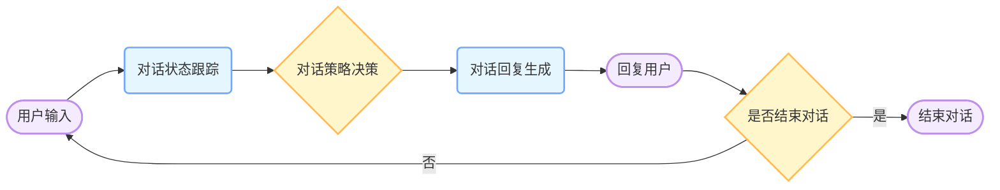

# 多轮对话管理：提升AI Agent的交互体验

> 关键词：多轮对话管理、AI Agent、交互体验、对话状态跟踪、对话策略决策

> 摘要：本文聚焦于多轮对话管理在提升AI Agent交互体验方面的重要作用。首先介绍了多轮对话管理的背景知识，包括目的、预期读者和文档结构等。接着详细阐述了核心概念与联系，通过文本示意图和Mermaid流程图展示其架构。在核心算法原理部分，使用Python代码进行了深入讲解，并给出了相应的数学模型和公式。通过项目实战案例，展示了开发环境搭建、源代码实现及代码解读。同时探讨了多轮对话管理的实际应用场景，推荐了相关的学习资源、开发工具框架和论文著作。最后总结了未来发展趋势与挑战，并提供了常见问题解答和扩展阅读参考资料，旨在帮助读者全面深入地理解多轮对话管理，以提升AI Agent的交互能力。

## 1. 背景介绍 
### 1.1 目的和范围
多轮对话管理在人工智能领域具有至关重要的地位，其主要目的是让AI Agent能够与用户进行自然、流畅且有意义的多轮交互。在当今数字化时代，人们对智能交互的需求日益增长，无论是智能客服、语音助手还是聊天机器人等应用场景，都需要AI Agent具备良好的多轮对话能力，以准确理解用户意图、提供合适的回复，从而提升用户体验。

本文的范围涵盖了多轮对话管理的核心概念、算法原理、数学模型、项目实战、应用场景等多个方面。通过系统的介绍和分析，旨在帮助读者全面掌握多轮对话管理的技术要点和实现方法，为开发高性能的AI Agent提供理论和实践指导。

### 1.2 预期读者
本文预期读者包括但不限于以下几类人群：
- 人工智能领域的开发者和研究人员，希望深入了解多轮对话管理技术，为其项目开发提供技术支持。
- 软件架构师和CTO，需要掌握多轮对话管理的整体架构和设计思路，以便在企业级项目中进行合理的技术选型和架构设计。
- 对人工智能和自然语言处理感兴趣的学生和爱好者，通过阅读本文可以了解多轮对话管理的基本原理和应用场景，为进一步学习和研究打下基础。

### 1.3 文档结构概述
本文将按照以下结构进行详细阐述：
- 核心概念与联系：介绍多轮对话管理的基本概念和架构，通过文本示意图和Mermaid流程图进行直观展示。
- 核心算法原理 & 具体操作步骤：使用Python代码详细讲解多轮对话管理的核心算法原理和具体实现步骤。
- 数学模型和公式 & 详细讲解 & 举例说明：给出多轮对话管理的数学模型和公式，并结合具体例子进行详细解释。
- 项目实战：代码实际案例和详细解释说明，包括开发环境搭建、源代码实现和代码解读。
- 实际应用场景：探讨多轮对话管理在不同领域的实际应用场景。
- 工具和资源推荐：推荐相关的学习资源、开发工具框架和论文著作。
- 总结：未来发展趋势与挑战：总结多轮对话管理的未来发展趋势和面临的挑战。
- 附录：常见问题与解答：提供常见问题的解答，帮助读者更好地理解和应用多轮对话管理技术。
- 扩展阅读 & 参考资料：提供相关的扩展阅读资料和参考文献，方便读者进一步深入学习。

### 1.4 术语表
#### 1.4.1 核心术语定义
- **多轮对话管理**：是指在与用户进行多轮交互的过程中，AI Agent能够跟踪对话状态、理解用户意图、做出合理的决策并生成合适回复的技术。
- **AI Agent**：是指能够自主执行任务、与环境进行交互的智能实体，在多轮对话场景中，AI Agent负责与用户进行对话交流。
- **对话状态跟踪**：是多轮对话管理的重要组成部分，用于记录和更新对话过程中的各种信息，如用户意图、上下文信息等。
- **对话策略决策**：根据对话状态跟踪的结果，AI Agent需要选择合适的回复策略，以满足用户需求。

#### 1.4.2 相关概念解释
- **自然语言处理（NLP）**：是一门研究如何让计算机理解和处理人类自然语言的学科，多轮对话管理是NLP的一个重要应用领域。
- **机器学习**：是一种让计算机通过数据学习模式和规律的技术，在多轮对话管理中，机器学习算法可以用于对话状态跟踪和对话策略决策。
- **深度学习**：是机器学习的一个分支，通过构建深层神经网络来学习数据的复杂特征，在多轮对话管理中，深度学习模型可以提高对话理解和生成的准确性。

#### 1.4.3 缩略词列表
- **NLP**：Natural Language Processing（自然语言处理）
- **ML**：Machine Learning（机器学习）
- **DL**：Deep Learning（深度学习）
- **RNN**：Recurrent Neural Network（循环神经网络）
- **LSTM**：Long Short-Term Memory（长短期记忆网络）
- **GRU**：Gated Recurrent Unit（门控循环单元）

## 2. 核心概念与联系 
多轮对话管理的核心概念主要包括对话状态跟踪、对话策略决策和对话回复生成。这些概念相互关联，共同构成了多轮对话管理的整体架构。

### 文本示意图
```plaintext
多轮对话管理
├── 对话状态跟踪
│   ├── 记录用户意图
│   ├── 记录上下文信息
│   ├── 更新对话状态
├── 对话策略决策
│   ├── 根据对话状态选择回复策略
│   ├── 考虑用户偏好和历史对话
├── 对话回复生成
│   ├── 根据回复策略生成回复内容
│   ├── 保证回复的自然流畅性
```

### Mermaid流程图


从上述示意图和流程图可以看出，多轮对话管理的工作流程如下：
1. 用户输入对话内容，AI Agent首先进行对话状态跟踪，记录用户意图和上下文信息，并更新对话状态。
2. 根据对话状态，AI Agent进行对话策略决策，选择合适的回复策略。
3. 基于选定的回复策略，AI Agent生成对话回复内容，并将其返回给用户。
4. 判断是否结束对话，如果未结束，则继续进行下一轮对话；如果结束，则终止对话。

## 3. 核心算法原理 & 具体操作步骤 
### 对话状态跟踪算法原理
对话状态跟踪的主要目的是记录和更新对话过程中的各种信息，以便AI Agent能够理解当前对话的上下文。一种常见的对话状态跟踪算法是基于规则的方法，下面是一个使用Python实现的简单示例：

```python
class DialogueStateTracker:
    def __init__(self):
        # 初始化对话状态
        self.dialogue_state = {}

    def update_state(self, user_input):
        # 简单的规则：如果用户输入包含特定关键词，则更新对话状态
        if "预订酒店" in user_input:
            self.dialogue_state["task"] = "预订酒店"
        elif "查询天气" in user_input:
            self.dialogue_state["task"] = "查询天气"
        return self.dialogue_state
```

### 具体操作步骤
1. **初始化对话状态**：在对话开始时，创建一个空的对话状态字典，用于存储对话过程中的信息。
2. **接收用户输入**：获取用户输入的对话内容。
3. **更新对话状态**：根据用户输入，使用预设的规则更新对话状态。在上述示例中，如果用户输入包含“预订酒店”，则将对话状态中的“task”字段设置为“预订酒店”。
4. **返回更新后的对话状态**：将更新后的对话状态返回给调用者。

### 对话策略决策算法原理
对话策略决策的目标是根据对话状态选择合适的回复策略。一种简单的对话策略决策方法是基于规则的策略表，下面是一个使用Python实现的示例：

```python
class DialoguePolicy:
    def __init__(self):
        # 定义对话策略表
        self.policy_table = {
            "预订酒店": "询问酒店位置和日期",
            "查询天气": "询问查询地点"
        }

    def get_response_strategy(self, dialogue_state):
        task = dialogue_state.get("task")
        if task in self.policy_table:
            return self.policy_table[task]
        return "未知任务，请重新描述"
```

### 具体操作步骤
1. **定义对话策略表**：在初始化时，创建一个字典，存储不同对话状态对应的回复策略。
2. **获取当前对话状态**：从对话状态跟踪器中获取当前的对话状态。
3. **查找回复策略**：根据对话状态中的任务信息，在策略表中查找对应的回复策略。
4. **返回回复策略**：如果找到对应的回复策略，则返回该策略；否则，返回默认的回复信息。

### 对话回复生成算法原理
对话回复生成是根据对话策略生成具体的回复内容。一种简单的方法是使用模板填充，下面是一个使用Python实现的示例：

```python
class ResponseGenerator:
    def generate_response(self, strategy):
        if strategy == "询问酒店位置和日期":
            return "请问您想预订哪个城市的酒店，以及入住和退房的日期？"
        elif strategy == "询问查询地点":
            return "请问您想查询哪个城市的天气？"
        return "抱歉，我不太明白您的意思，请您详细描述一下。"
```

### 具体操作步骤
1. **接收回复策略**：从对话策略决策模块中获取选定的回复策略。
2. **生成回复内容**：根据回复策略，使用预设的模板生成具体的回复内容。
3. **返回回复内容**：将生成的回复内容返回给用户。

### 整合代码示例
```python
# 创建对话状态跟踪器
tracker = DialogueStateTracker()
# 创建对话策略决策器
policy = DialoguePolicy()
# 创建对话回复生成器
generator = ResponseGenerator()

# 模拟用户输入
user_input = "我想预订酒店"

# 更新对话状态
state = tracker.update_state(user_input)
# 获取回复策略
strategy = policy.get_response_strategy(state)
# 生成回复内容
response = generator.generate_response(strategy)

print("用户输入:", user_input)
print("对话状态:", state)
print("回复策略:", strategy)
print("回复内容:", response)
```

通过上述代码，我们实现了一个简单的多轮对话管理系统，包括对话状态跟踪、对话策略决策和对话回复生成三个核心模块。

## 4. 数学模型和公式 & 详细讲解 & 举例说明 
### 对话状态表示模型
在多轮对话管理中，对话状态可以用一个向量来表示。假设对话状态包含 $n$ 个特征，如用户意图、请求参数、对话历史等，则对话状态向量 $\mathbf{s}$ 可以表示为：

$$
\mathbf{s} = [s_1, s_2, \cdots, s_n]^T
$$

其中，$s_i$ 表示第 $i$ 个特征的值。例如，在一个酒店预订对话中，对话状态向量可以包含以下特征：

- $s_1$：用户是否有预订酒店的意图（0 表示否，1 表示是）
- $s_2$：用户想要预订的城市
- $s_3$：用户想要入住的日期
- $s_4$：用户想要退房的日期

### 对话策略决策模型
对话策略决策可以看作是一个从对话状态到回复策略的映射。假设对话状态空间为 $\mathcal{S}$，回复策略空间为 $\mathcal{A}$，则对话策略 $\pi$ 可以表示为：

$$
\pi: \mathcal{S} \rightarrow \mathcal{A}
$$

在实际应用中，对话策略可以使用机器学习或深度学习模型来学习。例如，使用一个多层感知机（MLP）来实现对话策略决策：

$$
\mathbf{a} = \text{MLP}(\mathbf{s})
$$

其中，$\mathbf{a}$ 是输出的回复策略向量，$\text{MLP}$ 表示多层感知机模型。

### 举例说明
假设我们有一个简单的对话状态向量 $\mathbf{s} = [1, \text{"北京"}, \text{"2024-01-01"}, \text{"2024-01-05"}]$，表示用户有预订北京酒店的意图，入住日期为 2024 年 1 月 1 日，退房日期为 2024 年 1 月 5 日。

使用上述的对话策略决策模型，我们可以将对话状态向量输入到多层感知机中，得到输出的回复策略向量 $\mathbf{a}$。假设 $\mathbf{a}$ 对应的回复策略是“提供符合条件的酒店列表”，则 AI Agent 可以根据这个策略生成相应的回复内容，如“以下是北京 2024 年 1 月 1 日至 2024 年 1 月 5 日的酒店列表：……”。

## 5. 项目实战：代码实际案例和详细解释说明 
### 5.1  开发环境搭建
为了实现一个完整的多轮对话管理系统，我们需要搭建相应的开发环境。以下是具体的步骤：

#### 安装Python
首先，确保你已经安装了 Python 3.x 版本。你可以从 Python 官方网站（https://www.python.org/downloads/）下载并安装适合你操作系统的 Python 版本。

#### 安装必要的库
我们需要安装一些必要的 Python 库，如 `numpy`、`pandas` 等。可以使用以下命令进行安装：

```bash
pip install numpy pandas
```

#### 选择开发工具
推荐使用 PyCharm 或 Jupyter Notebook 作为开发工具。PyCharm 是一款功能强大的 Python 集成开发环境（IDE），提供了代码编辑、调试、版本控制等丰富的功能；Jupyter Notebook 则是一个交互式的开发环境，适合进行代码实验和演示。

### 5.2  源代码详细实现和代码解读
下面是一个更完整的多轮对话管理系统的源代码实现：

```python
import numpy as np

class DialogueStateTracker:
    def __init__(self):
        # 初始化对话状态
        self.dialogue_state = {
            "task": None,
            "city": None,
            "check_in_date": None,
            "check_out_date": None
        }

    def update_state(self, user_input):
        if "预订酒店" in user_input:
            self.dialogue_state["task"] = "预订酒店"
            # 简单解析城市信息
            if "北京" in user_input:
                self.dialogue_state["city"] = "北京"
            # 简单解析日期信息（这里只是示例，实际需要更复杂的处理）
            if "2024-01-01" in user_input:
                self.dialogue_state["check_in_date"] = "2024-01-01"
            if "2024-01-05" in user_input:
                self.dialogue_state["check_out_date"] = "2024-01-05"
        elif "查询天气" in user_input:
            self.dialogue_state["task"] = "查询天气"
            if "北京" in user_input:
                self.dialogue_state["city"] = "北京"
        return self.dialogue_state

class DialoguePolicy:
    def __init__(self):
        # 定义对话策略表
        self.policy_table = {
            ("预订酒店", None, None, None): "询问酒店位置和日期",
            ("预订酒店", "北京", None, None): "询问入住和退房日期",
            ("预订酒店", "北京", "2024-01-01", None): "询问退房日期",
            ("预订酒店", "北京", "2024-01-01", "2024-01-05"): "提供符合条件的酒店列表",
            ("查询天气", None): "询问查询地点",
            ("查询天气", "北京"): "提供北京的天气信息"
        }

    def get_response_strategy(self, dialogue_state):
        task = dialogue_state["task"]
        city = dialogue_state["city"]
        check_in_date = dialogue_state["check_in_date"]
        check_out_date = dialogue_state["check_out_date"]
        state_tuple = (task, city, check_in_date, check_out_date)
        if state_tuple in self.policy_table:
            return self.policy_table[state_tuple]
        return "未知任务，请重新描述"

class ResponseGenerator:
    def generate_response(self, strategy):
        if strategy == "询问酒店位置和日期":
            return "请问您想预订哪个城市的酒店，以及入住和退房的日期？"
        elif strategy == "询问入住和退房日期":
            return "请问您想什么时候入住和退房呢？"
        elif strategy == "询问退房日期":
            return "请问您什么时候退房呢？"
        elif strategy == "提供符合条件的酒店列表":
            return "以下是北京 2024 年 1 月 1 日至 2024 年 1 月 5 日的酒店列表：……"
        elif strategy == "询问查询地点":
            return "请问您想查询哪个城市的天气？"
        elif strategy == "提供北京的天气信息":
            return "北京当前的天气是……"
        return "抱歉，我不太明白您的意思，请您详细描述一下。"

# 创建对话状态跟踪器
tracker = DialogueStateTracker()
# 创建对话策略决策器
policy = DialoguePolicy()
# 创建对话回复生成器
generator = ResponseGenerator()

# 模拟多轮对话
user_inputs = [
    "我想预订酒店",
    "我想在北京预订酒店",
    "我想 2024 年 1 月 1 日入住",
    "我 2024 年 1 月 5 日退房"
]

for user_input in user_inputs:
    # 更新对话状态
    state = tracker.update_state(user_input)
    # 获取回复策略
    strategy = policy.get_response_strategy(state)
    # 生成回复内容
    response = generator.generate_response(strategy)

    print("用户输入:", user_input)
    print("对话状态:", state)
    print("回复策略:", strategy)
    print("回复内容:", response)
    print()
```

### 5.3  代码解读与分析
#### 对话状态跟踪器（DialogueStateTracker）
- **初始化**：在 `__init__` 方法中，初始化对话状态字典，包含任务、城市、入住日期和退房日期等信息。
- **更新状态**：在 `update_state` 方法中，根据用户输入更新对话状态。使用简单的规则解析用户输入中的关键词，更新相应的状态信息。

#### 对话策略决策器（DialoguePolicy）
- **初始化**：在 `__init__` 方法中，定义对话策略表，存储不同对话状态对应的回复策略。
- **获取策略**：在 `get_response_strategy` 方法中，根据当前对话状态生成状态元组，在策略表中查找对应的回复策略。

#### 对话回复生成器（ResponseGenerator）
- **生成回复**：在 `generate_response` 方法中，根据回复策略使用预设的模板生成具体的回复内容。

#### 模拟多轮对话
通过循环模拟多轮对话，依次处理用户输入，更新对话状态，选择回复策略，生成回复内容，并输出相应的信息。

通过上述代码，我们实现了一个简单的多轮对话管理系统，能够处理预订酒店和查询天气等任务，并根据对话状态提供合适的回复。

## 6. 实际应用场景 
多轮对话管理在多个领域都有广泛的应用，以下是一些常见的实际应用场景：

### 智能客服
在电商、金融、电信等行业，智能客服系统可以使用多轮对话管理技术与用户进行交互。用户可以通过对话提出问题、咨询产品信息、办理业务等，智能客服能够跟踪对话状态，理解用户意图，提供准确的回复和解决方案。例如，用户咨询某款手机的价格和配置，智能客服可以先确认用户感兴趣的手机型号，再提供详细的价格和配置信息，并根据用户的进一步需求，如是否有优惠活动、能否分期付款等，进行相应的回复。

### 语音助手
语音助手如 Siri、小爱同学、小度等，广泛应用于智能手机、智能音箱等设备中。用户可以通过语音与语音助手进行多轮对话，完成各种任务，如查询天气、设置闹钟、播放音乐等。语音助手通过多轮对话管理技术，能够准确理解用户的语音指令，处理复杂的任务需求。例如，用户说“明天北京的天气怎么样”，语音助手查询并回复天气信息后，用户可能接着问“后天呢”，语音助手能够根据对话上下文，准确理解用户的意图，提供后天北京的天气信息。

### 聊天机器人
聊天机器人在社交、娱乐等领域有着广泛的应用。它们可以与用户进行自然流畅的对话，提供陪伴、娱乐、知识问答等服务。多轮对话管理技术可以让聊天机器人更好地理解用户的情感和意图，进行有针对性的回复。例如，在一个情感陪伴聊天机器人中，用户向机器人倾诉自己的烦恼，机器人可以通过多轮对话了解用户的具体情况，给予安慰和建议，帮助用户缓解情绪。

### 智能医疗
在医疗领域，多轮对话管理技术可以用于智能问诊系统。患者可以通过与智能问诊系统进行多轮对话，描述自己的症状、病史等信息，系统可以根据对话状态进行初步的诊断和建议。例如，患者描述自己头痛、发热、咳嗽等症状，智能问诊系统可以进一步询问症状的持续时间、是否有其他伴随症状等，然后根据这些信息提供可能的疾病诊断和就医建议。

### 智能教育
在智能教育领域，多轮对话管理技术可以应用于智能辅导系统。学生可以与智能辅导系统进行对话，提出问题、寻求帮助，系统可以根据学生的问题和对话状态，提供个性化的学习指导和解答。例如，学生在学习数学时遇到难题，向智能辅导系统求助，系统可以通过多轮对话了解学生的解题思路和困惑点，然后针对性地提供解题方法和步骤。

## 7. 工具和资源推荐
### 7.1 学习资源推荐
#### 7.1.1 书籍推荐
- 《自然语言处理入门》：由何晗编著，本书系统地介绍了自然语言处理的基本概念、算法和技术，适合初学者入门学习。
- 《深度学习》：由 Ian Goodfellow、Yoshua Bengio 和 Aaron Courville 合著，这本书是深度学习领域的经典教材，涵盖了深度学习的基本原理、模型架构和应用案例。
- 《Python 自然语言处理实战：核心技术与算法》：由何运宁编著，本书结合 Python 语言，详细介绍了自然语言处理的各种技术和算法，包括文本分类、情感分析、命名实体识别等。

#### 7.1.2 在线课程
- Coursera 上的“Natural Language Processing Specialization”：由 DeepLearning.AI 提供，该课程由深度学习领域的知名专家授课，涵盖了自然语言处理的多个方面，包括词嵌入、序列模型、注意力机制等。
- edX 上的“Introduction to Artificial Intelligence”：由麻省理工学院（MIT）提供，该课程介绍了人工智能的基本概念、算法和应用，其中包括自然语言处理和多轮对话管理的相关内容。
- 网易云课堂上的“Python 自然语言处理实战教程”：该课程结合实际案例，详细介绍了使用 Python 进行自然语言处理的方法和技巧。

#### 7.1.3 技术博客和网站
- Medium：Medium 上有许多关于人工智能和自然语言处理的优秀博客文章，作者们会分享最新的研究成果、技术应用和实践经验。
- Towards Data Science：这是一个专注于数据科学和人工智能领域的技术博客平台，提供了大量的高质量文章和教程。
- arXiv：arXiv 是一个预印本数据库，收录了许多计算机科学、数学、物理学等领域的最新研究论文，你可以在上面找到多轮对话管理领域的前沿研究成果。

### 7.2 开发工具框架推荐
#### 7.2.1 IDE和编辑器
- PyCharm：是一款功能强大的 Python 集成开发环境，提供了代码编辑、调试、版本控制等丰富的功能，适合专业的 Python 开发者使用。
- Jupyter Notebook：是一个交互式的开发环境，支持多种编程语言，适合进行代码实验和演示。你可以在 Jupyter Notebook 中编写和运行 Python 代码，同时可以添加文本说明、图表等，方便进行数据分析和模型训练。
- Visual Studio Code：是一款轻量级的代码编辑器，支持多种编程语言和插件扩展。它具有丰富的代码编辑功能和调试功能，同时可以通过安装插件来支持 Python 开发。

#### 7.2.2 调试和性能分析工具
- PySnooper：是一个简单易用的 Python 调试工具，它可以自动记录函数的调用过程和变量的值，帮助你快速定位代码中的问题。
- cProfile：是 Python 内置的性能分析工具，它可以统计代码的运行时间和函数调用次数，帮助你找出代码中的性能瓶颈。
- TensorBoard：是 TensorFlow 提供的一个可视化工具，它可以用于可视化深度学习模型的训练过程、损失函数曲线、模型结构等，帮助你更好地理解和优化模型。

#### 7.2.3 相关框架和库
- NLTK（Natural Language Toolkit）：是一个广泛使用的 Python 自然语言处理库，提供了丰富的语料库、工具和算法，包括分词、词性标注、命名实体识别等。
- SpaCy：是另一个流行的 Python 自然语言处理库，它具有高效的处理速度和丰富的语言支持，适合处理大规模的文本数据。
- TensorFlow 和 PyTorch：是两个主流的深度学习框架，提供了丰富的神经网络模型和工具，可用于构建和训练多轮对话管理模型。

### 7.3 相关论文著作推荐
#### 7.3.1 经典论文
- “A Survey of Available Technologies for Building Conversational Agents”：该论文对构建对话代理的现有技术进行了全面的综述，包括对话状态跟踪、对话策略决策、对话回复生成等方面。
- “End-to-End Task-Completion Neural Dialogue Systems”：提出了一种端到端的任务完成神经对话系统，通过深度学习模型直接从输入到输出进行训练，避免了传统方法中复杂的模块划分和手工特征工程。
- “Attention Is All You Need”：介绍了注意力机制在自然语言处理中的应用，提出了 Transformer 模型，该模型在机器翻译、文本生成等任务中取得了优异的性能。

#### 7.3.2 最新研究成果
- 关注 ACL（Association for Computational Linguistics）、EMNLP（Conference on Empirical Methods in Natural Language Processing）等自然语言处理领域的顶级会议，这些会议上会发表许多关于多轮对话管理的最新研究成果。
- 查阅顶级学术期刊如 Journal of Artificial Intelligence Research（JAIR）、Artificial Intelligence 等，这些期刊会刊登自然语言处理领域的高质量研究论文。

#### 7.3.3 应用案例分析
- 研究一些知名的多轮对话系统的应用案例，如 Siri、小爱同学等。分析它们的设计思路、技术实现和用户体验，从中获取灵感和经验。
- 参考一些企业级的多轮对话管理系统的应用案例，了解它们在实际业务中的应用场景、面临的挑战和解决方案。

## 8. 总结：未来发展趋势与挑战
### 未来发展趋势
#### 更自然的交互体验
未来的多轮对话管理系统将更加注重用户的自然交互体验，能够更好地理解用户的语言习惯、情感和意图。例如，系统可以识别用户的语气、表情等非语言信息，根据用户的情绪状态提供更加个性化的回复和服务。

#### 多模态交互
随着技术的发展，多轮对话管理系统将不仅仅局限于文本和语音交互，还将支持图像、视频等多模态交互方式。用户可以通过上传图片、拍摄视频等方式与系统进行交互，系统能够综合处理多种模态的信息，提供更加全面和准确的回复。

#### 跨领域和多任务处理
未来的多轮对话管理系统将具备更强的跨领域和多任务处理能力。系统可以在不同的领域之间自由切换，处理多种类型的任务，为用户提供一站式的服务。例如，用户可以在同一个对话中既咨询旅游信息，又办理金融业务。

#### 与其他技术的融合
多轮对话管理技术将与其他人工智能技术如计算机视觉、知识图谱等进行深度融合。通过结合计算机视觉技术，系统可以识别图像和视频中的信息，为用户提供更加直观的回复；通过结合知识图谱技术，系统可以获取更丰富的知识，提高对话的准确性和智能性。

### 面临的挑战
#### 语义理解的准确性
虽然自然语言处理技术已经取得了很大的进展，但在语义理解方面仍然存在一定的挑战。用户的语言表达往往具有多样性和歧义性，系统需要准确理解用户的真实意图，避免误解和误判。

#### 对话状态的复杂性
在多轮对话中，对话状态会随着对话的进行而不断变化，并且可能涉及到多个领域和任务的信息。如何有效地跟踪和管理复杂的对话状态，是多轮对话管理面临的一个重要挑战。

#### 数据的质量和规模
深度学习模型在多轮对话管理中取得了很好的效果，但这些模型需要大量的高质量数据进行训练。获取和标注大规模的对话数据是一项艰巨的任务，同时数据的质量也会直接影响模型的性能。

#### 隐私和安全问题
在多轮对话过程中，系统会收集和处理用户的大量信息，包括个人隐私信息。如何保障用户的隐私和数据安全，防止信息泄露和滥用，是多轮对话管理系统需要解决的重要问题。

## 9. 附录：常见问题与解答
### 问题 1：多轮对话管理和单轮对话有什么区别？
单轮对话是指用户与系统之间只进行一轮交互，系统根据用户的输入直接给出回复，不考虑对话的上下文信息。而多轮对话管理则需要在多轮交互过程中跟踪对话状态，理解用户的意图，并根据上下文信息做出合理的决策和回复。多轮对话管理能够处理更复杂的任务和场景，提供更加自然和流畅的交互体验。

### 问题 2：如何评估多轮对话管理系统的性能？
评估多轮对话管理系统的性能可以从多个方面进行，常见的评估指标包括：
- **准确率**：指系统正确理解用户意图和提供正确回复的比例。
- **召回率**：指系统能够识别和处理的有效对话的比例。
- **F1 值**：是准确率和召回率的调和平均值，综合考虑了系统的准确性和完整性。
- **用户满意度**：通过用户调查和反馈来评估用户对系统交互体验的满意程度。

### 问题 3：多轮对话管理系统是否需要大量的训练数据？
如果使用基于机器学习或深度学习的方法来实现多轮对话管理系统，通常需要大量的训练数据。训练数据的质量和规模会直接影响模型的性能。足够的训练数据可以帮助模型学习到更多的语言模式和对话策略，提高系统的准确性和泛化能力。但如果使用基于规则的方法，对训练数据的依赖相对较小。

### 问题 4：如何处理用户输入的噪声和错误信息？
处理用户输入的噪声和错误信息可以采用以下方法：
- **文本预处理**：对用户输入进行清洗和预处理，如去除标点符号、转换为小写等，减少噪声的影响。
- **纠错机制**：使用拼写检查和语法纠错工具，对用户输入中的拼写错误和语法错误进行纠正。
- **上下文理解**：结合对话上下文信息，对用户输入进行更准确的理解，避免因个别错误信息导致的误解。
- **询问澄清**：如果系统无法确定用户的意图，可以通过询问澄清的方式，让用户进一步明确需求。

### 问题 5：多轮对话管理系统能否应用于实时交互场景？
多轮对话管理系统可以应用于实时交互场景，但需要满足一定的性能要求。为了实现实时交互，系统需要具备快速的处理能力和响应速度。可以采用以下方法来提高系统的实时性能：
- **优化算法**：选择高效的算法和模型，减少计算复杂度。
- **并行计算**：利用多核处理器和 GPU 等硬件资源，进行并行计算，提高处理速度。
- **缓存机制**：使用缓存技术，缓存一些常用的结果和中间数据，减少重复计算。

## 10. 扩展阅读 & 参考资料
### 扩展阅读
- 《对话系统：技术原理与应用实践》：深入介绍了对话系统的技术原理和应用实践，包括多轮对话管理、对话生成、对话评估等方面的内容。
- 《人工智能：现代方法》：这是一本经典的人工智能教材，涵盖了人工智能的各个领域，包括自然语言处理、机器学习、知识表示等，对多轮对话管理的理论基础有详细的介绍。
- 《自然语言处理实战：基于深度学习的方法》：结合深度学习技术，介绍了自然语言处理的各种应用场景和实现方法，包括多轮对话管理系统的构建。

### 参考资料
- 相关学术论文和研究报告，可以从 ACM Digital Library、IEEE Xplore、ScienceDirect 等学术数据库中获取。
- 开源代码库和项目，如 GitHub 上的一些多轮对话管理相关的开源项目，可以参考其代码实现和技术思路。
- 行业报告和白皮书，如 Gartner、Forrester 等机构发布的关于人工智能和自然语言处理的行业报告，了解行业的发展趋势和应用案例。

作者：AI天才研究院/AI Genius Institute & 禅与计算机程序设计艺术 /Zen And The Art of Computer Programming