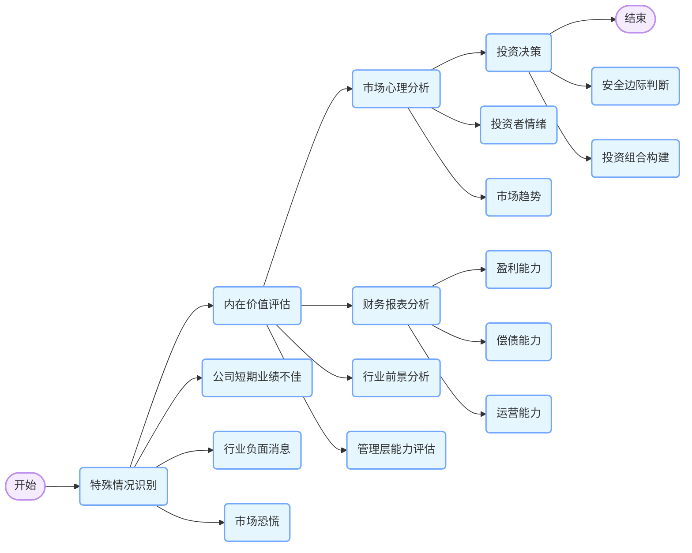

# 大卫·德雷曼的特殊情况价值投资

> 关键词：大卫·德雷曼、特殊情况价值投资、价值投资策略、市场心理、财务分析

> 摘要：本文深入探讨了大卫·德雷曼的特殊情况价值投资理论与方法。首先介绍了该投资理念的背景，包括目的、预期读者、文档结构等内容。接着阐述了特殊情况价值投资的核心概念、算法原理以及相关数学模型。通过项目实战部分的代码案例，详细解释了如何运用相关理论进行投资分析。同时，列举了该投资方法的实际应用场景，并推荐了学习所需的工具和资源。最后对特殊情况价值投资的未来发展趋势与挑战进行总结，还提供了常见问题解答和扩展阅读参考资料，旨在帮助投资者深入理解和运用大卫·德雷曼的投资思想。

## 1. 背景介绍 
### 1.1 目的和范围
大卫·德雷曼是价值投资领域的重要人物，他所提出的特殊情况价值投资理论为投资者提供了一种独特的投资视角。本文的目的在于全面剖析这一投资理论，详细阐述其核心概念、算法原理、实际应用等方面内容。范围涵盖从理论基础的讲解到实际投资案例的分析，以及相关学习资源和工具的推荐，旨在帮助投资者系统地了解和掌握特殊情况价值投资方法，从而在投资实践中做出更明智的决策。

### 1.2 预期读者
本文的预期读者主要包括对价值投资感兴趣的个人投资者、专业投资机构的分析师和交易员、金融领域的学生以及研究人员等。无论是初涉投资领域的新手，希望通过学习价值投资理论来构建自己的投资体系；还是有一定经验的投资者，想要拓展投资思路、丰富投资策略，都能从本文中获得有价值的信息。

### 1.3 文档结构概述
本文将按照以下结构展开：首先介绍特殊情况价值投资的背景知识，包括目的、读者对象和文档结构等；接着深入探讨核心概念与联系，通过文本示意图和 Mermaid 流程图进行清晰展示；然后详细讲解核心算法原理，并给出具体操作步骤的 Python 代码实现；再阐述相关的数学模型和公式，并举例说明；之后通过项目实战，展示代码实际案例并进行详细解释；随后列举实际应用场景；接着推荐学习所需的工具和资源；最后对特殊情况价值投资的未来发展趋势与挑战进行总结，同时提供常见问题解答和扩展阅读参考资料。

### 1.4 术语表
#### 1.4.1 核心术语定义
- **特殊情况价值投资**：大卫·德雷曼提出的一种投资策略，聚焦于那些因特殊情况导致股价被低估的公司，通过深入分析公司的基本面和市场心理，挖掘其潜在价值并进行投资。
- **价值投资**：一种投资理念，强调通过对公司内在价值的评估，寻找价格低于内在价值的股票进行投资，以获取长期的投资回报。
- **市场心理**：投资者在市场中的情绪和行为表现，如恐惧、贪婪等，这些心理因素会影响股票价格的波动。

#### 1.4.2 相关概念解释
- **安全边际**：指股票的市场价格低于其内在价值的幅度，是价值投资中重要的概念，用于降低投资风险。
- **市盈率（P/E）**：股票价格与每股收益的比率，反映了市场对公司盈利的预期，是评估股票估值的常用指标。
- **市净率（P/B）**：股票价格与每股净资产的比率，用于衡量公司的账面价值与市场价格的关系。

#### 1.4.3 缩略词列表
- **P/E**：市盈率（Price-to-Earnings Ratio）
- **P/B**：市净率（Price-to-Book Ratio）

## 2. 核心概念与联系 
特殊情况价值投资的核心在于识别那些由于特殊情况而被市场低估的股票。这些特殊情况可能包括公司的短期业绩不佳、行业负面消息、市场恐慌等，但公司本身具有良好的基本面和长期发展潜力。

### 核心概念原理
投资者需要通过对公司的财务报表、行业前景、管理层能力等方面进行深入分析，评估公司的内在价值。同时，要考虑市场心理因素对股价的影响，当市场情绪过度悲观时，股票价格可能会大幅下跌，从而产生投资机会。

### 架构的文本示意图
```plaintext
特殊情况价值投资
|-- 特殊情况识别
|   |-- 公司短期业绩不佳
|   |-- 行业负面消息
|   |-- 市场恐慌
|-- 内在价值评估
|   |-- 财务报表分析
|   |   |-- 盈利能力
|   |   |-- 偿债能力
|   |   |-- 运营能力
|   |-- 行业前景分析
|   |-- 管理层能力评估
|-- 市场心理分析
|   |-- 投资者情绪
|   |-- 市场趋势
|-- 投资决策
|   |-- 安全边际判断
|   |-- 投资组合构建
```

### Mermaid 流程图


## 3. 核心算法原理 & 具体操作步骤 
### 核心算法原理
特殊情况价值投资的核心算法主要围绕对公司内在价值的评估和安全边际的计算。内在价值的评估可以采用多种方法，如现金流折现法（DCF）、相对估值法等。安全边际则通过比较股票的市场价格和内在价值来确定。

### 具体操作步骤
1. **数据收集**：收集公司的财务报表、行业数据、市场数据等。
2. **内在价值评估**：选择合适的方法计算公司的内在价值。
3. **安全边际计算**：计算股票的市场价格与内在价值的差值，确定安全边际。
4. **投资决策**：根据安全边际的大小和其他因素，决定是否投资以及投资的比例。

### Python 代码实现
```python
import pandas as pd

# 假设我们有一个包含公司财务数据的 DataFrame
data = {
    'EPS': [2.5, 2.8, 3.0],  # 每股收益
    'BookValue': [20, 22, 25],  # 每股净资产
    'MarketPrice': [30, 32, 35]  # 市场价格
}
df = pd.DataFrame(data)

# 计算市盈率和市净率
df['PE'] = df['MarketPrice'] / df['EPS']
df['PB'] = df['MarketPrice'] / df['BookValue']

# 假设我们使用相对估值法，根据行业平均市盈率和市净率来评估内在价值
industry_avg_pe = 15
industry_avg_pb = 2

df['IntrinsicValuePE'] = df['EPS'] * industry_avg_pe
df['IntrinsicValuePB'] = df['BookValue'] * industry_avg_pb

# 取两种方法评估的内在价值的平均值作为最终内在价值
df['IntrinsicValue'] = (df['IntrinsicValuePE'] + df['IntrinsicValuePB']) / 2

# 计算安全边际
df['MarginOfSafety'] = (df['IntrinsicValue'] - df['MarketPrice']) / df['IntrinsicValue']

print(df)
```

### 代码解释
1. **数据收集**：通过创建一个包含公司每股收益、每股净资产和市场价格的 DataFrame 来模拟数据收集过程。
2. **内在价值评估**：计算市盈率和市净率，并根据行业平均市盈率和市净率计算内在价值。
3. **安全边际计算**：计算内在价值与市场价格的差值，并将其除以内在价值得到安全边际。
4. **结果展示**：打印包含内在价值和安全边际的 DataFrame。

## 4. 数学模型和公式 & 详细讲解 & 举例说明 
### 现金流折现法（DCF）
现金流折现法是一种常用的评估公司内在价值的方法，其基本思想是将公司未来的现金流折现到当前时刻。

#### 数学公式
$$V = \sum_{t=1}^{n} \frac{CF_t}{(1 + r)^t} + \frac{TV}{(1 + r)^n}$$

其中：
- $V$ 表示公司的内在价值
- $CF_t$ 表示第 $t$ 期的现金流
- $r$ 表示折现率
- $TV$ 表示终值
- $n$ 表示预测期数

#### 详细讲解
1. **现金流预测**：需要对公司未来的现金流进行预测，这通常需要考虑公司的业务模式、市场前景、竞争优势等因素。
2. **折现率确定**：折现率反映了投资者对投资风险的预期，通常可以使用加权平均资本成本（WACC）作为折现率。
3. **终值计算**：终值表示预测期结束后公司的价值，可以采用永续增长模型等方法进行计算。

#### 举例说明
假设一家公司未来 5 年的现金流分别为 100 万元、120 万元、150 万元、180 万元和 200 万元，折现率为 10%，预测期结束后公司的现金流以 3% 的增长率永续增长。

首先计算预测期内现金流的现值：
$$PV_1 = \frac{100}{(1 + 0.1)^1} = 90.91$$
$$PV_2 = \frac{120}{(1 + 0.1)^2} = 99.17$$
$$PV_3 = \frac{150}{(1 + 0.1)^3} = 112.69$$
$$PV_4 = \frac{180}{(1 + 0.1)^4} = 122.94$$
$$PV_5 = \frac{200}{(1 + 0.1)^5} = 124.18$$

然后计算终值：
$$TV = \frac{200 \times (1 + 0.03)}{0.1 - 0.03} = 2942.86$$

终值的现值为：
$$PV_{TV} = \frac{2942.86}{(1 + 0.1)^5} = 1827.67$$

最后计算公司的内在价值：
$$V = 90.91 + 99.17 + 112.69 + 122.94 + 124.18 + 1827.67 = 2377.56$$

### 相对估值法
相对估值法是通过比较公司与同行业其他公司的估值指标来评估公司的内在价值。

#### 数学公式
- **市盈率法**：$V = EPS \times P/E_{industry}$
- **市净率法**：$V = BV \times P/B_{industry}$

其中：
- $V$ 表示公司的内在价值
- $EPS$ 表示每股收益
- $BV$ 表示每股净资产
- $P/E_{industry}$ 表示行业平均市盈率
- $P/B_{industry}$ 表示行业平均市净率

#### 详细讲解
相对估值法的关键在于选择合适的同行业公司和准确的估值指标。通常需要对同行业公司进行筛选和分析，以确保比较的合理性。

#### 举例说明
假设一家公司的每股收益为 2 元，行业平均市盈率为 15；每股净资产为 10 元，行业平均市净率为 2。

使用市盈率法计算内在价值：
$$V_{PE} = 2 \times 15 = 30$$

使用市净率法计算内在价值：
$$V_{PB} = 10 \times 2 = 20$$

可以取两种方法计算结果的平均值作为最终的内在价值：
$$V = \frac{30 + 20}{2} = 25$$

## 5. 项目实战：代码实际案例和详细解释说明 
### 5.1  开发环境搭建
为了实现特殊情况价值投资的代码案例，我们需要搭建以下开发环境：
1. **Python 安装**：建议安装 Python 3.7 及以上版本，可以从 Python 官方网站（https://www.python.org/downloads/）下载并安装。
2. **开发工具**：可以选择使用 PyCharm、Jupyter Notebook 等开发工具。PyCharm 是一款功能强大的 Python 集成开发环境，适合大型项目的开发；Jupyter Notebook 则更适合交互式编程和数据分析。
3. **必要的库安装**：需要安装 pandas、numpy 等库，用于数据处理和分析。可以使用以下命令进行安装：
```sh
pip install pandas numpy
```

### 5.2  源代码详细实现和代码解读
```python
import pandas as pd
import numpy as np

# 模拟收集公司财务数据
data = {
    'Year': [2018, 2019, 2020, 2021, 2022],
    'Revenue': [1000, 1200, 1300, 1400, 1500],  # 营业收入
    'NetIncome': [100, 120, 130, 140, 150],  # 净利润
    'EPS': [1, 1.2, 1.3, 1.4, 1.5],  # 每股收益
    'BookValue': [10, 11, 12, 13, 14],  # 每股净资产
    'MarketPrice': [15, 18, 20, 22, 25]  # 市场价格
}
df = pd.DataFrame(data)

# 计算增长率
df['RevenueGrowthRate'] = df['Revenue'].pct_change()
df['NetIncomeGrowthRate'] = df['NetIncome'].pct_change()

# 计算市盈率和市净率
df['PE'] = df['MarketPrice'] / df['EPS']
df['PB'] = df['MarketPrice'] / df['BookValue']

# 假设行业平均市盈率为 15，市净率为 2
industry_avg_pe = 15
industry_avg_pb = 2

# 计算内在价值
df['IntrinsicValuePE'] = df['EPS'] * industry_avg_pe
df['IntrinsicValuePB'] = df['BookValue'] * industry_avg_pb

# 取两种方法评估的内在价值的平均值作为最终内在价值
df['IntrinsicValue'] = (df['IntrinsicValuePE'] + df['IntrinsicValuePB']) / 2

# 计算安全边际
df['MarginOfSafety'] = (df['IntrinsicValue'] - df['MarketPrice']) / df['IntrinsicValue']

# 筛选出安全边际大于 20% 的股票
selected_stocks = df[df['MarginOfSafety'] > 0.2]

print(selected_stocks)
```

### 代码解读与分析
1. **数据模拟**：使用字典创建一个包含公司多年财务数据的 DataFrame，模拟数据收集过程。
2. **增长率计算**：使用 `pct_change()` 方法计算营业收入和净利润的增长率，用于评估公司的发展趋势。
3. **估值指标计算**：计算市盈率和市净率，并根据行业平均市盈率和市净率计算内在价值。
4. **安全边际计算**：计算内在价值与市场价格的差值，并将其除以内在价值得到安全边际。
5. **股票筛选**：筛选出安全边际大于 20% 的股票，作为潜在的投资对象。

通过以上步骤，我们可以对公司的财务状况进行分析，评估其内在价值和安全边际，从而做出投资决策。

## 6. 实际应用场景 
### 股票投资
特殊情况价值投资在股票投资领域具有广泛的应用。投资者可以通过识别那些因特殊情况而被低估的股票，如公司短期业绩不佳但具有良好的长期发展潜力、行业受到负面消息影响但公司基本面未发生实质性变化等，进行投资。当市场情绪恢复正常，股票价格回归其内在价值时，投资者可以获得丰厚的回报。

### 基金投资
基金经理也可以运用特殊情况价值投资策略来构建投资组合。通过对不同行业和公司的分析，选择具有安全边际的股票纳入基金组合，以降低投资风险并提高收益。

### 企业并购
在企业并购中，特殊情况价值投资的理念也可以发挥重要作用。收购方可以通过对目标公司的财务状况和内在价值进行评估，寻找那些被低估的公司进行收购，从而实现协同效应和价值提升。

### 风险投资
风险投资机构在寻找投资项目时，也可以借鉴特殊情况价值投资的方法。关注那些处于特殊发展阶段、具有潜在价值但尚未被市场充分认识的创业公司，进行投资布局。

## 7. 工具和资源推荐
### 7.1 学习资源推荐
#### 7.1.1 书籍推荐
- 《逆向投资策略：市场赢家的投资心理》（大卫·德雷曼著）：大卫·德雷曼的经典著作，深入阐述了他的投资理念和策略。
- 《聪明的投资者》（本杰明·格雷厄姆著）：价值投资领域的经典之作，对价值投资的基本原理和方法进行了系统介绍。
- 《巴菲特致股东的信：股份公司教程》（沃伦·巴菲特著）：通过巴菲特致股东的信，学习他的投资思想和决策方法。

#### 7.1.2 在线课程
- Coursera 上的“投资学原理”课程：由知名高校教授授课，系统讲解投资学的基本原理和方法。
- 网易云课堂上的“价值投资实战教程”：结合实际案例，介绍价值投资的实践操作。

#### 7.1.3 技术博客和网站
- 雪球网：一个投资者交流社区，提供丰富的股票分析和投资经验分享。
- 价值投资网：专注于价值投资领域的资讯和研究，提供专业的投资分析报告。

### 7.2 开发工具框架推荐
#### 7.2.1 IDE和编辑器
- PyCharm：功能强大的 Python 集成开发环境，适合大型项目的开发。
- Jupyter Notebook：交互式编程环境，方便进行数据分析和代码演示。

#### 7.2.2 调试和性能分析工具
- PDB：Python 自带的调试工具，用于调试 Python 代码。
- cProfile：Python 性能分析工具，用于分析代码的性能瓶颈。

#### 7.2.3 相关框架和库
- pandas：用于数据处理和分析的 Python 库，提供了丰富的数据结构和函数。
- numpy：用于科学计算的 Python 库，提供了高效的数组操作和数学函数。

### 7.3 相关论文著作推荐
#### 7.3.1 经典论文
- “The Intelligent Investor”（Benjamin Graham）：本杰明·格雷厄姆的经典论文，奠定了价值投资的理论基础。
- “Security Analysis”（Benjamin Graham and David Dodd）：另一篇价值投资领域的经典论文，对证券分析的方法和原则进行了详细阐述。

#### 7.3.2 最新研究成果
- 定期关注金融领域的学术期刊，如《Journal of Finance》《Review of Financial Studies》等，了解价值投资领域的最新研究成果。

#### 7.3.3 应用案例分析
- 可以通过查阅相关的财经报道和研究报告，了解特殊情况价值投资在实际案例中的应用和效果。

## 8. 总结：未来发展趋势与挑战
### 未来发展趋势
1. **数据驱动的投资决策**：随着大数据和人工智能技术的发展，投资者将能够获取更多、更准确的数据，并运用数据分析和机器学习算法进行投资决策。特殊情况价值投资也将更加注重数据的挖掘和分析，以提高投资的准确性和效率。
2. **跨领域融合**：特殊情况价值投资将与其他投资策略和领域进行更深入的融合，如量化投资、风险管理等。通过综合运用多种方法和技术，投资者可以构建更加多元化和稳健的投资组合。
3. **国际化投资**：随着全球经济一体化的发展，投资者将有更多的机会进行国际化投资。特殊情况价值投资也将拓展到全球市场，投资者需要关注不同国家和地区的经济、政治和市场环境，寻找具有投资价值的特殊情况。

### 挑战
1. **数据质量和可靠性**：虽然数据的获取变得更加容易，但数据的质量和可靠性仍然是一个挑战。投资者需要对数据进行严格的筛选和验证，以确保投资决策的准确性。
2. **市场不确定性**：市场环境充满不确定性，特殊情况的出现和发展往往难以预测。投资者需要具备较强的风险管理能力，及时调整投资策略，以应对市场的变化。
3. **投资者心理因素**：投资者的心理因素对投资决策有着重要的影响。在特殊情况价值投资中，投资者需要克服恐惧和贪婪等情绪，保持理性和冷静，做出明智的投资决策。

## 9. 附录：常见问题与解答
### 问题 1：特殊情况价值投资与传统价值投资有什么区别？
特殊情况价值投资是传统价值投资的一种延伸和细化。传统价值投资更注重公司的基本面和内在价值，而特殊情况价值投资则聚焦于那些因特殊情况导致股价被低估的公司。这些特殊情况可能是短期的、偶然的，需要投资者具备更强的洞察力和分析能力。

### 问题 2：如何识别特殊情况？
识别特殊情况需要投资者关注公司的公告、行业动态、市场新闻等信息。常见的特殊情况包括公司的业绩下滑、管理层变动、行业竞争加剧、政策变化等。同时，投资者还需要对公司的基本面进行深入分析，判断特殊情况是否会对公司的长期发展产生实质性影响。

### 问题 3：安全边际的大小如何确定？
安全边际的大小没有固定的标准，通常取决于投资者的风险偏好和投资目标。一般来说，安全边际越大，投资风险越低。投资者可以根据公司的行业特点、财务状况、市场环境等因素，综合考虑确定合适的安全边际。

### 问题 4：特殊情况价值投资的投资期限一般是多长？
特殊情况价值投资通常是一种长期投资策略，投资期限可能从几年到十几年不等。因为特殊情况的改善和公司价值的回归需要一定的时间，投资者需要有足够的耐心等待投资回报。

## 10. 扩展阅读 & 参考资料
### 扩展阅读
- 《金融炼金术》（乔治·索罗斯著）：探讨了金融市场的运行规律和投资者的心理因素，对理解市场波动和特殊情况具有重要启示。
- 《黑天鹅：如何应对不可预知的未来》（纳西姆·尼古拉斯·塔勒布著）：介绍了黑天鹅事件的概念和影响，提醒投资者关注市场中的不确定性。

### 参考资料
- 大卫·德雷曼的相关著作和文章
- 金融领域的学术期刊和研究报告
- 财经媒体的报道和分析

作者：AI天才研究院/AI Genius Institute & 禅与计算机程序设计艺术 /Zen And The Art of Computer Programming