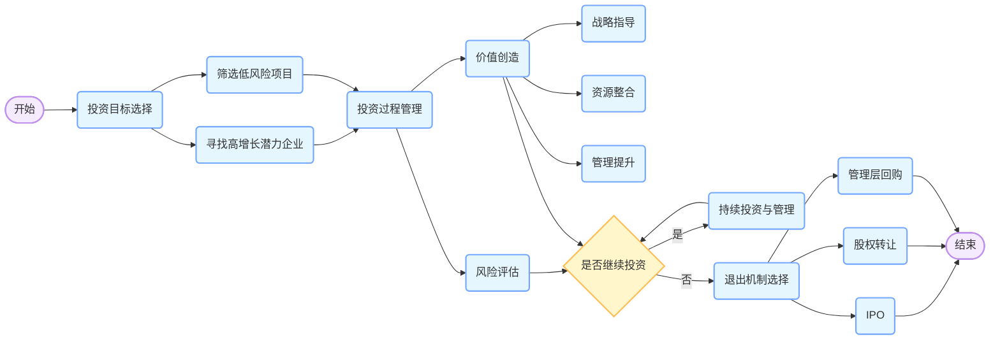

# 大卫·艾伦·科恩的私募股权投资策略

> 关键词：大卫·艾伦·科恩、私募股权投资、投资策略、风险评估、价值创造

> 摘要：本文聚焦于大卫·艾伦·科恩的私募股权投资策略，深入剖析其核心概念、算法原理、数学模型等内容。通过详细的项目实战案例，展示其策略在实际应用中的具体操作和效果。同时，探讨该策略的实际应用场景，推荐相关的学习工具和资源。最后，总结其未来发展趋势与挑战，并提供常见问题解答和扩展阅读参考资料，旨在为读者全面呈现大卫·艾伦·科恩私募股权投资策略的全貌。

## 1. 背景介绍 
### 1.1 目的和范围
本文章旨在全面解析大卫·艾伦·科恩的私募股权投资策略。通过深入研究其策略的各个方面，包括核心概念、算法原理、实际应用等，为读者提供一个系统、深入的理解。范围涵盖了该策略的理论基础、操作步骤、实际案例以及未来发展趋势等多个维度，帮助读者不仅了解策略本身，还能掌握其在实际投资中的应用和潜在影响。

### 1.2 预期读者
本文预期读者包括对私募股权投资领域感兴趣的投资者、金融从业者、研究人员以及相关专业的学生。对于投资者而言，希望通过了解该策略，为自身的投资决策提供参考和借鉴；金融从业者可以从中学习先进的投资理念和方法，提升自身的专业能力；研究人员则可以将其作为研究私募股权投资策略的案例，深入探究相关理论和实践；学生群体可以通过阅读本文，增加对私募股权投资领域的认识和理解，为未来的学习和职业发展打下基础。

### 1.3 文档结构概述
本文将按照以下结构进行阐述：首先介绍背景信息，包括目的、预期读者和文档结构概述等内容；接着深入讲解核心概念与联系，通过文本示意图和 Mermaid 流程图展示其原理和架构；然后详细阐述核心算法原理和具体操作步骤，并使用 Python 源代码进行说明；随后介绍数学模型和公式，并举例说明；通过项目实战案例，展示该策略在实际中的应用和实现；探讨实际应用场景；推荐相关的工具和资源；总结未来发展趋势与挑战；提供常见问题解答；最后列出扩展阅读和参考资料。

### 1.4 术语表
#### 1.4.1 核心术语定义
- **私募股权投资（Private Equity Investment）**：指通过私募形式对非上市企业进行的权益性投资，在交易实施过程中附带考虑了将来的退出机制，即通过上市、并购或管理层回购等方式，出售持股获利。
- **风险评估（Risk Assessment）**：在投资过程中，对可能面临的各种风险进行识别、分析和评估的过程，以确定风险的大小和可能性，为投资决策提供依据。
- **价值创造（Value Creation）**：投资者通过对被投资企业的资源整合、战略规划、管理提升等手段，提高企业的价值和竞争力，从而实现投资回报的过程。

#### 1.4.2 相关概念解释
- **投资组合（Investment Portfolio）**：投资者将资金分散投资于多种不同的资产或项目中，以降低风险并实现预期收益的一种投资方式。在私募股权投资中，投资组合通常包括多个不同行业、不同发展阶段的企业。
- **退出机制（Exit Strategy）**：投资者在投资一定期限后，通过某种方式将所持有的股权变现的计划。常见的退出机制包括首次公开募股（IPO）、股权转让、管理层回购等。

#### 1.4.3 缩略词列表
- **IPO（Initial Public Offering）**：首次公开募股，指一家企业第一次将它的股份向公众出售。
- **PE（Private Equity）**：私募股权，即私募股权投资的简称。

## 2. 核心概念与联系 

### 核心概念原理
大卫·艾伦·科恩的私募股权投资策略基于对市场的深入洞察和对企业价值的精准评估。其核心原理在于通过寻找具有高增长潜力的非上市企业，进行权益性投资，并在投资过程中积极参与企业的管理和运营，实现企业价值的提升，最终通过合适的退出机制获得投资回报。

该策略强调风险与收益的平衡，在投资前进行全面的风险评估，选择具有良好发展前景和较低风险的项目。同时，注重价值创造，通过为被投资企业提供战略指导、资源整合、管理提升等支持，帮助企业实现快速发展，从而提高投资的回报率。

### 架构的文本示意图
```plaintext
大卫·艾伦·科恩私募股权投资策略
|
|-- 投资目标选择
|   |-- 高增长潜力企业
|   |-- 低风险项目
|
|-- 投资过程管理
|   |-- 风险评估
|   |-- 价值创造
|       |-- 战略指导
|       |-- 资源整合
|       |-- 管理提升
|
|-- 退出机制
|   |-- IPO
|   |-- 股权转让
|   |-- 管理层回购
```

### Mermaid 流程图


## 3. 核心算法原理 & 具体操作步骤 

### 核心算法原理
大卫·艾伦·科恩的私募股权投资策略涉及多个算法和模型，其中风险评估和价值评估是核心算法。以下是一个简化的风险评估算法示例，使用 Python 实现：

```python
import numpy as np

def risk_assessment(financial_ratios, market_conditions):
    """
    风险评估函数
    :param financial_ratios: 企业财务比率列表，如资产负债率、利润率等
    :param market_conditions: 市场环境指标，如市场增长率、行业竞争程度等
    :return: 风险评分
    """
    # 定义财务比率权重
    financial_weights = np.array([0.3, 0.2, 0.2, 0.3])
    # 定义市场环境权重
    market_weights = np.array([0.6, 0.4])
    
    # 计算财务比率得分
    financial_score = np.dot(financial_ratios, financial_weights)
    # 计算市场环境得分
    market_score = np.dot(market_conditions, market_weights)
    
    # 综合得分
    total_score = 0.7 * financial_score + 0.3 * market_score
    
    return total_score

# 示例数据
financial_ratios = [0.6, 0.2, 0.1, 0.1]
market_conditions = [0.8, 0.2]

risk_score = risk_assessment(financial_ratios, market_conditions)
print(f"风险评分: {risk_score}")
```

### 具体操作步骤
1. **投资目标选择**
    - **市场调研**：对不同行业的市场规模、增长趋势、竞争格局等进行深入研究，筛选出具有高增长潜力的行业。
    - **企业筛选**：在选定的行业中，通过各种渠道寻找具有良好发展前景的非上市企业。评估企业的财务状况、管理团队、技术实力、市场竞争力等因素。
    - **初步评估**：对筛选出的企业进行初步的风险评估和价值评估，确定是否值得进一步深入研究。

2. **投资过程管理**
    - **尽职调查**：对确定投资意向的企业进行全面的尽职调查，包括财务、法律、业务等方面，以了解企业的真实情况和潜在风险。
    - **投资决策**：根据尽职调查结果，结合风险评估和价值评估，做出投资决策。确定投资金额、投资方式、股权比例等。
    - **投后管理**：投资完成后，积极参与企业的管理和运营。为企业提供战略指导、资源整合、管理提升等支持，帮助企业实现快速发展。

3. **退出机制选择**
    - **时机判断**：根据企业的发展情况和市场环境，判断合适的退出时机。一般来说，当企业达到一定的发展阶段，市场估值较高时，是较好的退出时机。
    - **方式选择**：根据企业的具体情况和市场条件，选择合适的退出方式，如 IPO、股权转让、管理层回购等。

## 4. 数学模型和公式 & 详细讲解 & 举例说明 

### 风险评估模型
风险评估是私募股权投资中的重要环节，通过建立数学模型可以更准确地评估投资风险。以下是一个常用的风险评估模型：

#### 模型公式
$$R = w_f \times F + w_m \times M$$

其中：
- $R$ 表示综合风险评分
- $w_f$ 表示财务风险权重
- $F$ 表示财务风险得分
- $w_m$ 表示市场风险权重
- $M$ 表示市场风险得分

#### 详细讲解
财务风险得分 $F$ 可以通过多个财务比率指标计算得出，如资产负债率、利润率、流动比率等。每个财务比率指标都有相应的权重，通过加权平均的方式得到财务风险得分。市场风险得分 $M$ 则考虑市场环境因素，如市场增长率、行业竞争程度等，同样通过加权平均计算得出。综合风险评分 $R$ 是财务风险得分和市场风险得分的加权和，权重 $w_f$ 和 $w_m$ 根据具体情况进行设定。

#### 举例说明
假设某企业的财务比率指标如下：资产负债率为 0.6，利润率为 0.2，流动比率为 0.1，速动比率为 0.1。财务比率权重分别为 0.3、0.2、0.2、0.3。市场环境指标中，市场增长率为 0.8，行业竞争程度为 0.2，市场环境权重分别为 0.6、0.4。财务风险权重 $w_f$ 为 0.7，市场风险权重 $w_m$ 为 0.3。

首先计算财务风险得分 $F$：
$$F = 0.3 \times 0.6 + 0.2 \times 0.2 + 0.2 \times 0.1 + 0.3 \times 0.1 = 0.27$$

然后计算市场风险得分 $M$：
$$M = 0.6 \times 0.8 + 0.4 \times 0.2 = 0.56$$

最后计算综合风险评分 $R$：
$$R = 0.7 \times 0.27 + 0.3 \times 0.56 = 0.357$$

### 价值评估模型
价值评估是确定投资价格和投资回报的关键。常用的价值评估模型有现金流折现模型（DCF）。

#### 模型公式
$$V = \sum_{t=1}^{n} \frac{CF_t}{(1 + r)^t} + \frac{TV}{(1 + r)^n}$$

其中：
- $V$ 表示企业的价值
- $CF_t$ 表示第 $t$ 期的现金流量
- $r$ 表示折现率
- $n$ 表示预测期数
- $TV$ 表示终值

#### 详细讲解
现金流折现模型的基本思想是将企业未来的现金流量折现到当前时刻，得到企业的现值。预测期内的现金流量 $CF_t$ 可以根据企业的历史数据和未来发展规划进行预测。折现率 $r$ 反映了投资的风险和机会成本，一般根据市场利率、行业风险等因素确定。终值 $TV$ 表示预测期结束后企业的价值，可以通过多种方法估算，如永续增长模型。

#### 举例说明
假设某企业未来 5 年的现金流量预测如下：$CF_1 = 100$ 万元，$CF_2 = 120$ 万元，$CF_3 = 150$ 万元，$CF_4 = 180$ 万元，$CF_5 = 200$ 万元。折现率 $r = 10\%$，预测期结束后企业的终值 $TV = 2000$ 万元。

首先计算各期现金流量的现值：
$$PV_1 = \frac{100}{(1 + 0.1)^1} \approx 90.91$$ 万元
$$PV_2 = \frac{120}{(1 + 0.1)^2} \approx 99.17$$ 万元
$$PV_3 = \frac{150}{(1 + 0.1)^3} \approx 112.69$$ 万元
$$PV_4 = \frac{180}{(1 + 0.1)^4} \approx 122.94$$ 万元
$$PV_5 = \frac{200}{(1 + 0.1)^5} \approx 124.18$$ 万元

然后计算终值的现值：
$$PV_{TV} = \frac{2000}{(1 + 0.1)^5} \approx 1241.84$$ 万元

最后计算企业的价值 $V$：
$$V = 90.91 + 99.17 + 112.69 + 122.94 + 124.18 + 1241.84 = 1791.73$$ 万元

## 5. 项目实战：代码实际案例和详细解释说明 

### 5.1  开发环境搭建
本项目使用 Python 进行开发，需要安装以下库：
- `numpy`：用于数值计算
- `pandas`：用于数据处理和分析
- `matplotlib`：用于数据可视化

可以使用以下命令进行安装：
```sh
pip install numpy pandas matplotlib
```

### 5.2  源代码详细实现和代码解读
以下是一个完整的私募股权投资项目实战代码示例，包括数据加载、风险评估、价值评估和结果可视化：

```python
import numpy as np
import pandas as pd
import matplotlib.pyplot as plt

# 数据加载
def load_data():
    # 模拟企业财务数据和市场环境数据
    financial_data = pd.DataFrame({
        '资产负债率': [0.6, 0.5, 0.4, 0.3],
        '利润率': [0.2, 0.25, 0.3, 0.35],
        '流动比率': [0.1, 0.15, 0.2, 0.25],
        '速动比率': [0.1, 0.12, 0.15, 0.18]
    })
    market_data = pd.DataFrame({
        '市场增长率': [0.8, 0.7, 0.6, 0.5],
        '行业竞争程度': [0.2, 0.3, 0.4, 0.5]
    })
    return financial_data, market_data

# 风险评估
def risk_assessment(financial_data, market_data):
    financial_weights = np.array([0.3, 0.2, 0.2, 0.3])
    market_weights = np.array([0.6, 0.4])
    risk_scores = []
    for i in range(len(financial_data)):
        financial_ratios = financial_data.iloc[i].values
        market_conditions = market_data.iloc[i].values
        financial_score = np.dot(financial_ratios, financial_weights)
        market_score = np.dot(market_conditions, market_weights)
        total_score = 0.7 * financial_score + 0.3 * market_score
        risk_scores.append(total_score)
    return risk_scores

# 价值评估（简化的现金流折现模型）
def value_assessment(cash_flows, discount_rate):
    n = len(cash_flows)
    present_values = []
    for t in range(n):
        pv = cash_flows[t] / ((1 + discount_rate) ** (t + 1))
        present_values.append(pv)
    value = sum(present_values)
    return value

# 主函数
def main():
    # 加载数据
    financial_data, market_data = load_data()
    
    # 风险评估
    risk_scores = risk_assessment(financial_data, market_data)
    
    # 价值评估
    cash_flows = [100, 120, 150, 180]
    discount_rate = 0.1
    value = value_assessment(cash_flows, discount_rate)
    
    # 结果可视化
    plt.figure(figsize=(12, 6))
    plt.subplot(1, 2, 1)
    plt.bar(range(len(risk_scores)), risk_scores)
    plt.xlabel('企业编号')
    plt.ylabel('风险评分')
    plt.title('企业风险评估')
    plt.subplot(1, 2, 2)
    plt.bar(['企业价值'], [value])
    plt.ylabel('价值（万元）')
    plt.title('企业价值评估')
    plt.show()

if __name__ == "__main__":
    main()
```

### 5.3  代码解读与分析
- **数据加载**：`load_data` 函数模拟了企业的财务数据和市场环境数据，使用 `pandas` 库将数据存储为 `DataFrame` 格式，方便后续处理。
- **风险评估**：`risk_assessment` 函数根据前面介绍的风险评估模型，对每个企业的财务比率和市场环境指标进行加权计算，得到综合风险评分。
- **价值评估**：`value_assessment` 函数实现了简化的现金流折现模型，将未来的现金流量折现到当前时刻，得到企业的价值。
- **主函数**：`main` 函数调用上述函数，完成数据加载、风险评估、价值评估和结果可视化。使用 `matplotlib` 库绘制柱状图，直观展示企业的风险评分和价值评估结果。

通过这个项目实战，我们可以更深入地理解大卫·艾伦·科恩的私募股权投资策略在实际中的应用，包括数据处理、风险评估、价值评估和结果可视化等环节。

## 6. 实际应用场景 
### 新兴行业投资
在新兴行业中，如人工智能、生物技术、新能源等，企业往往具有高增长潜力，但也伴随着较高的风险。大卫·艾伦·科恩的私募股权投资策略可以帮助投资者在这些行业中筛选出具有良好发展前景的企业，通过深入的风险评估和价值创造，实现投资回报。例如，在人工智能领域，投资者可以选择具有核心技术和创新能力的企业进行投资，通过提供战略指导和资源整合，帮助企业快速发展，在企业达到一定规模后通过 IPO 等方式退出，获得高额回报。

### 传统行业转型升级
传统行业在面临市场竞争和技术变革的压力下，需要进行转型升级。私募股权投资可以为传统行业企业提供资金和资源支持，帮助其进行技术创新、管理提升和市场拓展。例如，在制造业中，投资者可以投资于具有转型升级潜力的企业，通过引入先进的生产技术和管理理念，提高企业的生产效率和产品质量，增强企业的市场竞争力。在企业转型升级成功后，投资者可以通过股权转让等方式实现退出。

### 企业并购重组
在企业并购重组过程中，私募股权投资机构可以作为战略投资者，参与并购交易。通过对目标企业的深入评估和分析，确定合理的投资价格和交易方案。同时，在并购后，为企业提供整合资源、优化管理等支持，实现协同效应，提升企业的价值。例如，在某行业的整合过程中，私募股权投资机构可以帮助优势企业并购劣势企业，实现资源的优化配置和市场份额的扩大，最终通过企业的发展和上市获得投资回报。

## 7. 工具和资源推荐
### 7.1 学习资源推荐
#### 7.1.1 书籍推荐
- 《私募股权投资基金运作：机制与策略》：全面介绍了私募股权投资基金的运作流程、投资策略、风险管理等方面的内容，是学习私募股权投资的经典书籍。
- 《价值投资：从格雷厄姆到巴菲特》：深入阐述了价值投资的理念和方法，对于理解私募股权投资中的价值评估和投资决策具有重要的参考价值。
- 《金融炼金术》：乔治·索罗斯的著作，探讨了金融市场的运行规律和投资策略，对私募股权投资领域的投资者具有启发作用。

#### 7.1.2 在线课程
- Coursera 平台上的“私募股权投资与风险投资”课程：由知名高校的教授授课，系统介绍了私募股权投资的理论和实践知识。
- edX 平台上的“金融市场与投资”课程：涵盖了金融市场的各个方面，包括私募股权投资，帮助学习者建立全面的金融知识体系。

#### 7.1.3 技术博客和网站
- 私募通：提供私募股权投资行业的最新资讯、数据统计、案例分析等内容，是了解行业动态的重要平台。
- 投中网：专注于私募股权投资领域的媒体平台，发布行业研究报告、专家观点等内容，为投资者提供有价值的参考。

### 7.2 开发工具框架推荐
#### 7.2.1 IDE和编辑器
- PyCharm：功能强大的 Python 集成开发环境，提供代码编辑、调试、版本控制等功能，适合进行私募股权投资相关的数据分析和模型开发。
- Jupyter Notebook：交互式的开发环境，方便进行数据探索、模型验证和结果展示，对于快速验证投资策略和算法非常有用。

#### 7.2.2 调试和性能分析工具
- pdb：Python 自带的调试工具，可以帮助开发者定位代码中的问题和错误。
- cProfile：Python 的性能分析工具，用于分析代码的运行时间和资源消耗，优化代码性能。

#### 7.2.3 相关框架和库
- scikit-learn：用于机器学习的 Python 库，提供了丰富的算法和工具，可用于风险评估和价值预测模型的开发。
- TensorFlow：开源的深度学习框架，可用于处理复杂的数据分析和预测任务，在私募股权投资领域有一定的应用前景。

### 7.3 相关论文著作推荐
#### 7.3.1 经典论文
- “The Performance of Private Equity Funds”：研究了私募股权投资基金的业绩表现和影响因素，为投资者评估基金的投资能力提供了重要的参考。
- “Value Creation in Private Equity”：探讨了私募股权投资中价值创造的机制和方法，对于理解私募股权投资的核心业务具有重要意义。

#### 7.3.2 最新研究成果
- 关注顶尖学术期刊，如《Journal of Finance》《Review of Financial Studies》等，这些期刊经常发表私募股权投资领域的最新研究成果。
- 参加相关的学术会议，如美国金融协会年会（AFA）、欧洲金融协会年会（EFA）等，了解行业的前沿动态和研究趋势。

#### 7.3.3 应用案例分析
- 阅读知名私募股权投资机构的案例分析报告，如红杉资本、KKR 等，学习他们的投资策略、决策过程和风险管理经验。
- 分析上市公司的并购重组案例，了解私募股权投资在企业并购中的作用和操作方法。

## 8. 总结：未来发展趋势与挑战
### 未来发展趋势
- **多元化投资策略**：随着市场环境的变化和投资机会的增多，私募股权投资将越来越注重多元化投资策略。除了传统的行业投资，将更多地涉足新兴行业、跨境投资等领域，以降低投资风险，提高投资回报。
- **科技赋能**：科技的快速发展将为私募股权投资带来新的机遇和挑战。人工智能、大数据、区块链等技术将在投资决策、风险评估、投后管理等环节得到更广泛的应用，提高投资效率和决策的准确性。
- **社会责任投资**：投资者越来越关注企业的社会责任和可持续发展。未来，私募股权投资将更加注重投资具有良好社会形象和环境友好型的企业，推动企业实现经济、社会和环境的可持续发展。

### 挑战
- **市场竞争加剧**：随着私募股权投资市场的不断发展，参与者越来越多，市场竞争日益激烈。投资者需要具备更强的投资能力和资源整合能力，才能在市场中脱颖而出。
- **风险管理难度加大**：市场环境的不确定性和复杂性增加，投资风险也随之增大。投资者需要不断完善风险管理体系，提高风险识别、评估和应对能力，以保障投资的安全和收益。
- **监管政策变化**：私募股权投资行业受到严格的监管。监管政策的变化可能会对投资业务产生重大影响。投资者需要密切关注监管政策的动态，及时调整投资策略，确保合规经营。

## 9. 附录：常见问题与解答
### 私募股权投资的风险有哪些？
私募股权投资的风险主要包括市场风险、行业风险、企业经营风险、流动性风险等。市场风险是指由于宏观经济环境、市场供求关系等因素导致的投资价值波动；行业风险是指特定行业的发展趋势、竞争格局等因素对投资的影响；企业经营风险是指被投资企业的管理水平、技术创新能力、市场竞争力等因素导致的经营不善风险；流动性风险是指由于私募股权投资的非公开性和长期性，导致投资难以在短期内变现的风险。

### 如何评估私募股权投资项目的价值？
评估私募股权投资项目的价值可以采用多种方法，如现金流折现模型（DCF）、可比公司分析法、重置成本法等。现金流折现模型是将企业未来的现金流量折现到当前时刻，得到企业的现值；可比公司分析法是通过比较同行业类似企业的估值指标，来评估目标企业的价值；重置成本法是估算重新构建目标企业所需的成本，作为企业的价值。在实际应用中，通常会综合使用多种方法，以提高价值评估的准确性。

### 私募股权投资的退出方式有哪些？
私募股权投资的退出方式主要包括首次公开募股（IPO）、股权转让、管理层回购、清算等。IPO 是指企业首次将其股份向公众出售，投资者可以通过在股票市场上出售股份实现退出；股权转让是指投资者将其持有的股权转让给其他投资者或战略投资者；管理层回购是指企业管理层以一定的价格回购投资者持有的股份；清算是指在企业经营不善或无法继续经营时，对企业的资产进行清算，投资者按照股权比例获得剩余资产。

## 10. 扩展阅读 & 参考资料
### 扩展阅读
- 《聪明的投资者》：本杰明·格雷厄姆的经典著作，阐述了价值投资的基本原理和方法，对于私募股权投资领域的投资者具有重要的启示作用。
- 《穷查理宝典》：收录了查理·芒格的演讲和文章，分享了他的投资理念、思维方式和人生智慧，对私募股权投资从业者有很大的借鉴意义。

### 参考资料
- 相关学术期刊和研究报告，如《金融研究》《证券市场导报》等。
- 私募股权投资行业协会发布的行业数据和研究报告。
- 知名私募股权投资机构的官方网站和公开资料。

作者：AI天才研究院/AI Genius Institute & 禅与计算机程序设计艺术 /Zen And The Art of Computer Programming