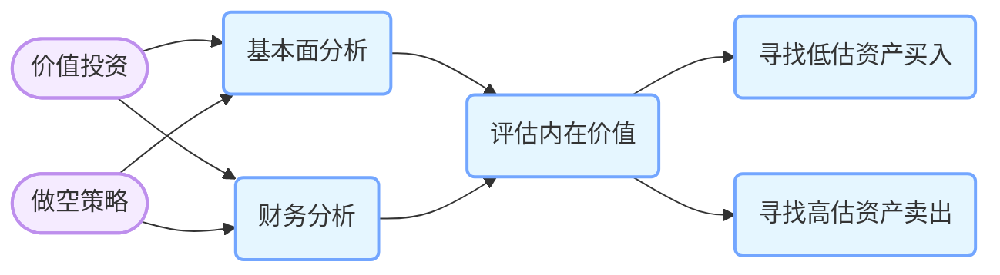

# 大卫·艾因霍恩的做空策略：价值投资的另一面

> 关键词：大卫·艾因霍恩、做空策略、价值投资、财务分析、市场洞察

> 摘要：本文深入探讨了大卫·艾因霍恩的做空策略，将其视为价值投资的另一面进行剖析。首先介绍了研究的背景、目的、预期读者等内容。接着阐述了做空策略和价值投资的核心概念及其联系，分析了艾因霍恩做空策略的核心算法原理与具体操作步骤，并给出了相关的数学模型和公式。通过项目实战案例展示了其策略的实际应用，包括开发环境搭建、源代码实现与解读。同时探讨了该策略的实际应用场景，推荐了学习、开发相关的工具和资源，还对相关论文著作进行了介绍。最后总结了该策略未来的发展趋势与挑战，并解答了常见问题，提供了扩展阅读和参考资料，旨在帮助读者全面理解大卫·艾因霍恩的做空策略及其在价值投资领域的独特意义。

## 1. 背景介绍 
### 1.1 目的和范围
本研究旨在全面深入地剖析大卫·艾因霍恩的做空策略，并将其置于价值投资的框架下进行探讨。通过对艾因霍恩的投资理念、方法和实践案例的研究，揭示做空策略在价值投资中的作用和意义，为投资者和金融从业者提供有价值的参考。研究范围涵盖了艾因霍恩的投资生涯中的主要做空案例、相关的财务分析方法、市场判断依据以及与传统价值投资理念的关联等方面。

### 1.2 预期读者
本文的预期读者包括专业投资者、金融分析师、投资机构从业者、对金融市场和投资策略感兴趣的学生以及希望深入了解价值投资和做空策略的普通投资者。通过阅读本文，读者可以获得对大卫·艾因霍恩做空策略的系统认识，学习到实用的投资分析方法和市场判断技巧。

### 1.3 文档结构概述
本文将按照以下结构进行组织：首先介绍核心概念，包括做空策略和价值投资的定义、原理和相互关系；然后详细阐述艾因霍恩做空策略的核心算法原理和具体操作步骤，并给出相关的数学模型和公式；接着通过项目实战案例展示该策略的实际应用；之后探讨该策略在不同市场环境下的实际应用场景；再推荐相关的学习、开发工具和资源以及论文著作；最后总结该策略的未来发展趋势与挑战，解答常见问题，并提供扩展阅读和参考资料。

### 1.4 术语表
#### 1.4.1 核心术语定义
- **做空策略**：是一种投资策略，投资者预期某一资产价格将会下跌，通过借入该资产并卖出，待价格下跌后再买入归还，从而获取差价利润。
- **价值投资**：是一种投资理念，投资者通过分析资产的内在价值，寻找价格低于内在价值的资产进行投资，期望在资产价格回归内在价值时获得收益。
- **财务造假**：指企业通过伪造、篡改财务数据等手段，虚增或虚减利润、资产等财务指标，以达到欺骗投资者、债权人等目的的行为。
- **基本面分析**：是一种通过研究公司的财务报表、行业前景、管理层能力等基本面因素，来评估公司内在价值和投资价值的分析方法。

#### 1.4.2 相关概念解释
- **卖空机制**：是指允许投资者在没有实际持有某一资产的情况下，通过借入该资产并卖出的交易机制。卖空机制为投资者提供了在市场下跌时获利的机会，同时也增加了市场的流动性和有效性。
- **内在价值**：是指资产在未来所能产生的现金流的现值。内在价值是价值投资的核心概念，投资者通过评估资产的内在价值，来判断资产的价格是否被低估或高估。
- **市场情绪**：是指投资者对市场的整体看法和预期，包括乐观、悲观、恐慌等情绪。市场情绪会影响投资者的决策和市场的价格走势。

#### 1.4.3 缩略词列表
- **EPS**：Earnings Per Share，每股收益，是指公司净利润除以发行在外的普通股股数，反映了每股普通股的盈利水平。
- **P/E**：Price-to-Earnings Ratio，市盈率，是指股票价格除以每股收益，反映了市场对公司盈利的预期和估值水平。
- **ROE**：Return on Equity，净资产收益率，是指公司净利润除以净资产，反映了公司运用自有资本的效率和盈利能力。

## 2. 核心概念与联系 

### 2.1 做空策略原理
做空策略的基本原理是投资者预期某一资产价格将会下跌，通过借入该资产并卖出，待价格下跌后再买入归还，从而获取差价利润。例如，投资者认为某只股票的价格过高，未来将会下跌，于是向券商借入该股票并卖出，获得现金。当股票价格下跌后，投资者再用现金买入该股票归还券商，从而获得差价收益。

做空策略的风险在于，如果资产价格不跌反涨，投资者将面临损失。因为投资者需要以更高的价格买入资产归还券商，从而产生亏损。此外，做空策略还面临着借入资产的成本、市场流动性不足等风险。

### 2.2 价值投资原理
价值投资的核心原理是投资者通过分析资产的内在价值，寻找价格低于内在价值的资产进行投资，期望在资产价格回归内在价值时获得收益。价值投资的创始人是本杰明·格雷厄姆，他在《证券分析》一书中提出了价值投资的基本理念和方法。

价值投资的分析方法主要包括基本面分析和财务分析。基本面分析是指通过研究公司的行业前景、管理层能力、竞争优势等基本面因素，来评估公司的内在价值和投资价值。财务分析是指通过研究公司的财务报表，如资产负债表、利润表、现金流量表等，来评估公司的财务状况和盈利能力。

### 2.3 做空策略与价值投资的联系
做空策略可以被视为价值投资的另一面。价值投资强调寻找被低估的资产进行买入，而做空策略则强调寻找被高估的资产进行卖出。两者的核心都是对资产的内在价值进行评估，只是投资方向相反。

大卫·艾因霍恩的做空策略正是基于价值投资的理念。他通过深入的基本面分析和财务分析，寻找那些存在财务造假、经营困境或估值过高的公司进行做空。他认为，这些公司的股价被市场高估，未来将会下跌，通过做空这些公司可以获得丰厚的收益。

### 2.4 核心概念架构示意图


该流程图展示了价值投资和做空策略的核心概念及其联系。价值投资和做空策略都依赖于基本面分析和财务分析来评估资产的内在价值。价值投资通过寻找被低估的资产进行买入，而做空策略则通过寻找被高估的资产进行卖出。

## 3. 核心算法原理 & 具体操作步骤 

### 3.1 核心算法原理
大卫·艾因霍恩的做空策略核心算法原理基于对公司基本面和财务数据的深入分析，以识别公司的潜在问题和估值泡沫。具体来说，他的算法主要包括以下几个步骤：

#### 3.1.1 数据收集
收集公司的财务报表、行业报告、新闻资讯等相关数据，建立数据仓库。这些数据将作为后续分析的基础。

#### 3.1.2 财务指标分析
计算公司的关键财务指标，如市盈率（P/E）、市净率（P/B）、净资产收益率（ROE）、每股收益（EPS）等，并与同行业公司进行比较。通过分析这些指标，可以初步判断公司的估值水平和盈利能力。

#### 3.1.3 财务造假检测
运用财务造假检测模型，对公司的财务数据进行分析，识别可能存在的财务造假迹象。常见的财务造假检测方法包括比率分析、现金流量分析、关联交易分析等。

#### 3.1.4 业务分析
深入研究公司的业务模式、市场竞争力、行业前景等，评估公司的可持续发展能力。如果公司的业务存在重大问题，如市场份额下降、产品竞争力不足等，可能会导致公司的股价下跌。

#### 3.1.5 风险评估
综合考虑以上分析结果，对公司的风险进行评估。如果公司存在较高的风险，如财务造假、经营困境等，且股价被高估，那么可以考虑对该公司进行做空。

### 3.2 具体操作步骤

#### 3.2.1 筛选目标公司
根据上述算法原理，筛选出可能存在问题的目标公司。可以通过行业研究、财务报表分析、新闻资讯等途径，发现那些估值过高、财务数据异常或业务存在问题的公司。

#### 3.2.2 深入研究
对筛选出的目标公司进行深入研究，收集更多的信息和数据，进行详细的财务分析和业务分析。可以与公司的管理层进行沟通，了解公司的经营情况和未来发展规划。

#### 3.3.3 建立做空仓位
在确定目标公司存在做空机会后，通过券商借入该公司的股票并卖出，建立做空仓位。在建立仓位时，需要考虑风险控制和资金管理，合理确定做空的规模和止损点。

#### 3.4.4 跟踪和监控
建立做空仓位后，需要密切跟踪和监控目标公司的情况。关注公司的财务报表发布、重大事件公告、行业动态等信息，及时调整做空策略。如果公司的情况发生变化，如财务状况改善、股价上涨等，需要及时平仓止损。

### 3.3 Python源代码实现

```python
import pandas as pd
import numpy as np

# 假设已经获取到公司的财务数据，存储在DataFrame中
# 这里简单模拟一个财务数据DataFrame
data = {
    '公司名称': ['公司A', '公司B', '公司C'],
    '市盈率': [20, 30, 15],
    '市净率': [2, 3, 1.5],
    '净资产收益率': [0.1, 0.08, 0.12],
    '每股收益': [1, 0.8, 1.2]
}
df = pd.DataFrame(data)

# 计算综合评分，用于筛选目标公司
# 这里简单假设各指标的权重相同
weights = {
    '市盈率': 0.25,
    '市净率': 0.25,
    '净资产收益率': 0.25,
    '每股收益': 0.25
}

# 对各指标进行标准化处理
df['市盈率_标准化'] = (df['市盈率'] - df['市盈率'].mean()) / df['市盈率'].std()
df['市净率_标准化'] = (df['市净率'] - df['市净率'].mean()) / df['市净率'].std()
df['净资产收益率_标准化'] = (df['净资产收益率'] - df['净资产收益率'].mean()) / df['净资产收益率'].std()
df['每股收益_标准化'] = (df['每股收益'] - df['每股收益'].mean()) / df['每股收益'].std()

# 计算综合评分
df['综合评分'] = (df['市盈率_标准化'] * weights['市盈率'] +
                  df['市净率_标准化'] * weights['市净率'] +
                  df['净资产收益率_标准化'] * weights['净资产收益率'] +
                  df['每股收益_标准化'] * weights['每股收益'])

# 筛选出综合评分较高（可能存在高估）的公司
target_companies = df[df['综合评分'] > df['综合评分'].mean()]['公司名称']

print("可能的目标公司：", target_companies)
```

### 3.4 代码解释
上述代码实现了一个简单的目标公司筛选算法。首先，创建了一个包含公司财务数据的DataFrame。然后，对各财务指标进行标准化处理，消除不同指标之间的量纲影响。接着，根据各指标的权重计算综合评分。最后，筛选出综合评分高于平均值的公司作为可能的目标公司。

需要注意的是，这只是一个简单的示例，实际的做空策略需要更复杂的分析和判断，包括对公司业务的深入研究、财务造假检测等。

## 4. 数学模型和公式 & 详细讲解 & 举例说明 

### 4.1 财务指标分析公式
#### 4.1.1 市盈率（P/E）
市盈率是指股票价格除以每股收益，反映了市场对公司盈利的预期和估值水平。其计算公式为：
$$P/E = \frac{股票价格}{每股收益}$$
例如，某公司的股票价格为50元，每股收益为2元，则该公司的市盈率为：
$$P/E = \frac{50}{2} = 25$$
一般来说，市盈率越高，说明市场对公司的盈利预期越高，股票的估值也越高；反之，市盈率越低，说明市场对公司的盈利预期越低，股票的估值也越低。

#### 4.1.2 市净率（P/B）
市净率是指股票价格除以每股净资产，反映了市场对公司净资产的估值水平。其计算公式为：
$$P/B = \frac{股票价格}{每股净资产}$$
例如，某公司的股票价格为30元，每股净资产为10元，则该公司的市净率为：
$$P/B = \frac{30}{10} = 3$$
一般来说，市净率越高，说明市场对公司净资产的估值越高，股票的估值也越高；反之，市净率越低，说明市场对公司净资产的估值越低，股票的估值也越低。

#### 4.1.3 净资产收益率（ROE）
净资产收益率是指公司净利润除以净资产，反映了公司运用自有资本的效率和盈利能力。其计算公式为：
$$ROE = \frac{净利润}{净资产}$$
例如，某公司的净利润为1000万元，净资产为5000万元，则该公司的净资产收益率为：
$$ROE = \frac{1000}{5000} = 0.2 = 20\%$$
一般来说，净资产收益率越高，说明公司运用自有资本的效率越高，盈利能力越强；反之，净资产收益率越低，说明公司运用自有资本的效率越低，盈利能力越弱。

### 4.2 财务造假检测模型
#### 4.2.1 比率分析
比率分析是一种常用的财务造假检测方法，通过计算公司的各项财务比率，并与同行业公司进行比较，来识别可能存在的财务造假迹象。常见的财务比率包括流动比率、速动比率、资产负债率、毛利率、净利率等。

例如，某公司的毛利率远高于同行业平均水平，而净利率却远低于同行业平均水平，这可能意味着该公司存在成本虚增或收入虚减的情况，需要进一步深入调查。

#### 4.2.2 现金流量分析
现金流量分析是指通过分析公司的现金流量表，来评估公司的现金生成能力和资金运作情况。如果公司的净利润很高，但经营活动现金流量却很低，这可能意味着公司的利润存在水分，存在财务造假的可能。

例如，某公司的净利润为5000万元，但经营活动现金流量仅为1000万元，这可能说明公司的销售收入存在大量的应收账款，实际收到的现金很少，利润的质量不高。

### 4.3 举例说明
假设我们要对一家名为ABC公司的股票进行分析，判断是否存在做空机会。我们收集到了ABC公司和同行业其他公司的财务数据，如下表所示：

| 公司名称 | 市盈率 | 市净率 | 净资产收益率 | 毛利率 | 净利率 | 经营活动现金流量/净利润 |
| ---- | ---- | ---- | ---- | ---- | ---- | ---- |
| ABC公司 | 30 | 4 | 15% | 40% | 10% | 0.3 |
| 同行业平均 | 20 | 3 | 20% | 30% | 15% | 0.8 |

#### 4.3.1 财务指标分析
- **市盈率**：ABC公司的市盈率为30，高于同行业平均水平20，说明市场对ABC公司的盈利预期较高，股票的估值也较高。
- **市净率**：ABC公司的市净率为4，高于同行业平均水平3，说明市场对ABC公司的净资产估值较高，股票的估值也较高。
- **净资产收益率**：ABC公司的净资产收益率为15%，低于同行业平均水平20%，说明ABC公司运用自有资本的效率较低，盈利能力较弱。

#### 4.3.2 财务造假检测
- **毛利率和净利率**：ABC公司的毛利率为40%，高于同行业平均水平30%，而净利率为10%，低于同行业平均水平15%，这可能意味着ABC公司存在成本虚增或收入虚减的情况。
- **经营活动现金流量/净利润**：ABC公司的经营活动现金流量/净利润为0.3，远低于同行业平均水平0.8，说明ABC公司的净利润质量不高，可能存在财务造假的可能。

综合以上分析，ABC公司的股票估值较高，盈利能力较弱，且存在财务造假的可能，因此可以考虑对ABC公司的股票进行做空。

## 5. 项目实战：代码实际案例和详细解释说明 

### 5.1  开发环境搭建
#### 5.1.1 安装Python
首先，需要安装Python开发环境。可以从Python官方网站（https://www.python.org/downloads/）下载适合自己操作系统的Python安装包，并按照安装向导进行安装。建议安装Python 3.x版本。

#### 5.1.2 安装必要的库
在Python中，有许多库可以用于数据处理、分析和可视化。为了实现大卫·艾因霍恩的做空策略，需要安装以下几个常用的库：
- **pandas**：用于数据处理和分析。可以使用以下命令进行安装：
```sh
pip install pandas
```
- **numpy**：用于数值计算。可以使用以下命令进行安装：
```sh
pip install numpy
```
- **matplotlib**：用于数据可视化。可以使用以下命令进行安装：
```sh
pip install matplotlib
```

#### 5.1.3 数据获取
为了进行财务分析和做空策略的研究，需要获取公司的财务数据。可以通过以下几种途径获取数据：
- **金融数据提供商**：如东方财富、同花顺等，这些平台提供了丰富的金融数据，可以通过API接口获取数据。
- **证券交易所网站**：如上海证券交易所、深圳证券交易所等，这些网站提供了上市公司的财务报表和公告等信息，可以通过爬虫技术获取数据。
- **第三方数据平台**：如Wind、Bloomberg等，这些平台提供了专业的金融数据服务，但需要付费使用。

### 5.2  源代码详细实现和代码解读

```python
import pandas as pd
import numpy as np
import matplotlib.pyplot as plt

# 假设已经获取到公司的财务数据，存储在CSV文件中
# 读取数据
data = pd.read_csv('financial_data.csv')

# 计算关键财务指标
data['市盈率'] = data['股票价格'] / data['每股收益']
data['市净率'] = data['股票价格'] / data['每股净资产']
data['净资产收益率'] = data['净利润'] / data['净资产']

# 筛选出可能存在问题的公司
# 假设市盈率大于30，市净率大于4，净资产收益率小于10%的公司存在问题
problem_companies = data[(data['市盈率'] > 30) & (data['市净率'] > 4) & (data['净资产收益率'] < 0.1)]

# 可视化分析
plt.figure(figsize=(12, 6))

# 绘制市盈率分布直方图
plt.subplot(1, 3, 1)
plt.hist(data['市盈率'], bins=20, edgecolor='k')
plt.title('市盈率分布')
plt.xlabel('市盈率')
plt.ylabel('频数')

# 绘制市净率分布直方图
plt.subplot(1, 3, 2)
plt.hist(data['市净率'], bins=20, edgecolor='k')
plt.title('市净率分布')
plt.xlabel('市净率')
plt.ylabel('频数')

# 绘制净资产收益率分布直方图
plt.subplot(1, 3, 3)
plt.hist(data['净资产收益率'], bins=20, edgecolor='k')
plt.title('净资产收益率分布')
plt.xlabel('净资产收益率')
plt.ylabel('频数')

plt.tight_layout()
plt.show()

# 输出可能存在问题的公司
print("可能存在问题的公司：")
print(problem_companies[['公司名称', '市盈率', '市净率', '净资产收益率']])
```

### 5.3  代码解读与分析
#### 5.3.1 数据读取
使用`pandas`库的`read_csv`函数读取存储在CSV文件中的公司财务数据。

#### 5.3.2 财务指标计算
根据前面介绍的财务指标计算公式，计算公司的市盈率、市净率和净资产收益率。

#### 5.3.3 筛选目标公司
根据设定的条件，筛选出市盈率大于30，市净率大于4，净资产收益率小于10%的公司，这些公司可能存在估值过高或盈利能力较弱的问题。

#### 5.3.4 可视化分析
使用`matplotlib`库绘制市盈率、市净率和净资产收益率的分布直方图，直观地展示数据的分布情况。

#### 5.3.5 输出结果
输出可能存在问题的公司的名称和相关财务指标，为后续的做空决策提供参考。

## 6. 实际应用场景 
### 6.1 金融市场投资
大卫·艾因霍恩的做空策略在金融市场投资中具有重要的应用价值。投资者可以通过运用该策略，识别那些存在财务造假、经营困境或估值过高的公司，进行做空操作，从而在市场下跌时获得收益。例如，在2008年金融危机期间，艾因霍恩成功做空了雷曼兄弟等金融机构，为投资者带来了丰厚的回报。

### 6.2 风险管理
做空策略还可以作为一种风险管理工具，用于对冲投资组合的风险。当投资者持有多头头寸时，如果市场出现下跌趋势，通过做空一些相关的资产，可以降低投资组合的整体风险。例如，投资者持有某行业的多只股票，可以通过做空该行业的指数或一些表现不佳的公司股票，来对冲市场下跌的风险。

### 6.3 公司治理监督
做空策略还可以对公司治理起到监督作用。当投资者发现某公司存在财务造假或经营问题时，通过做空该公司的股票，可以引起市场的关注，促使公司管理层改善公司治理，提高公司的经营质量。例如，艾因霍恩对绿诺科技的做空，揭露了该公司的财务造假行为，最终导致绿诺科技被摘牌。

## 7. 工具和资源推荐
### 7.1 学习资源推荐
#### 7.1.1 书籍推荐
- 《证券分析》（本杰明·格雷厄姆）：价值投资的经典著作，详细介绍了价值投资的理念和方法。
- 《聪明的投资者》（本杰明·格雷厄姆）：也是价值投资的经典之作，适合初学者阅读。
- 《金融炼金术》（乔治·索罗斯）：介绍了索罗斯的投资哲学和交易策略，对理解市场的不确定性和波动性有很大帮助。
- 《说谎者的扑克牌》（迈克尔·刘易斯）：以华尔街的真实故事为背景，生动地描述了金融市场的运作和投资银行的文化。

#### 7.1.2 在线课程
- Coursera上的“投资学原理”：由知名大学教授授课，系统地介绍了投资学的基本原理和方法。
- edX上的“金融市场”：涵盖了金融市场的各个方面，包括股票市场、债券市场、衍生品市场等。
- 网易云课堂上的“价值投资实战”：结合实际案例，讲解价值投资的实战技巧和方法。

#### 7.1.3 技术博客和网站
- 雪球网：国内知名的投资社区，提供了丰富的股票分析、投资策略和财经新闻等内容。
- 东方财富网：提供了全面的金融数据和财经资讯，是投资者获取信息的重要渠道。
- Seeking Alpha：国外知名的投资分析网站，汇聚了众多专业投资者和分析师的观点和研究报告。

### 7.2 开发工具框架推荐
#### 7.2.1 IDE和编辑器
- PyCharm：功能强大的Python集成开发环境，提供了代码编辑、调试、版本控制等一系列功能。
- Jupyter Notebook：交互式的开发环境，适合进行数据探索和分析，支持Python、R等多种编程语言。
- Visual Studio Code：轻量级的代码编辑器，支持多种编程语言和插件扩展，具有良好的用户体验。

#### 7.2.2 调试和性能分析工具
- PDB：Python自带的调试工具，可以帮助开发者定位代码中的问题。
- cProfile：Python的性能分析工具，可以分析代码的运行时间和函数调用情况，帮助开发者优化代码性能。
- Py-Spy：一个用于分析Python程序性能的工具，可以实时监控程序的CPU使用情况和函数调用栈。

#### 7.2.3 相关框架和库
- pandas：用于数据处理和分析的Python库，提供了丰富的数据结构和函数，方便进行数据清洗、转换和分析。
- numpy：用于数值计算的Python库，提供了高效的数组和矩阵运算功能。
- matplotlib：用于数据可视化的Python库，支持多种图表类型的绘制，如折线图、柱状图、散点图等。
- scikit-learn：用于机器学习的Python库，提供了丰富的机器学习算法和工具，如分类、回归、聚类等。

### 7.3 相关论文著作推荐
#### 7.3.1 经典论文
- “Security Analysis”（Benjamin Graham and David Dodd）：价值投资的奠基之作，提出了价值投资的基本理念和方法。
- “The Efficient Market Hypothesis and Its Critics”（Andrei Shleifer）：对有效市场假说进行了深入的探讨和批判，为行为金融学的发展奠定了基础。
- “On Persistence in Mutual Fund Performance”（Mark M. Carhart）：研究了共同基金的业绩持续性问题，对投资者选择基金具有重要的参考价值。

#### 7.3.2 最新研究成果
- “The Impact of Short Selling on Market Efficiency and Corporate Governance”（Xin Chang, et al.）：研究了卖空机制对市场效率和公司治理的影响。
- “Financial Statement Fraud Detection Using Machine Learning Techniques”（Yehuda Bar-Yosef and Oded Livne）：探讨了如何运用机器学习技术检测财务报表造假。
- “Value Investing: The Use of Historical Financial Statement Information to Separate Winners from Losers”（Joseph D. Piotroski）：提出了一种基于财务报表信息的价值投资策略。

#### 7.3.3 应用案例分析
- “The Short Selling of Lehman Brothers: A Case Study”：对雷曼兄弟的做空案例进行了详细的分析，探讨了做空策略在金融危机中的应用。
- “The Green Mountain Coffee Roasters Short Sale: A Lesson in Due Diligence”：分析了绿山咖啡的做空案例，强调了尽职调查在做空策略中的重要性。
- “The Valeant Pharmaceuticals Short: A Story of Accounting Fraud and Market Manipulation”：讲述了威朗制药的做空故事，揭示了公司的财务造假和市场操纵行为。

## 8. 总结：未来发展趋势与挑战
### 8.1 未来发展趋势
#### 8.1.1 技术创新推动
随着人工智能、大数据、区块链等技术的不断发展，做空策略将更加智能化和精准化。例如，利用人工智能算法可以对大量的财务数据和市场信息进行快速分析和处理，识别潜在的做空机会；利用区块链技术可以实现交易的透明化和可追溯性，降低做空交易的风险。

#### 8.1.2 全球化趋势加强
随着全球金融市场的一体化程度不断提高，做空策略的应用范围也将不断扩大。投资者可以在全球范围内寻找做空机会，进行跨市场、跨行业的投资。同时，国际间的监管合作也将不断加强，以应对做空交易带来的风险。

#### 8.1.3 多元化发展
未来，做空策略将不仅仅局限于股票市场，还将拓展到债券市场、期货市场、外汇市场等其他金融市场。同时，做空策略的形式也将更加多元化，除了传统的卖空股票外，还将出现更多的衍生品和结构化产品。

### 8.2 挑战
#### 8.2.1 监管风险
做空交易可能会对市场稳定造成一定的影响，因此受到监管机构的严格监管。投资者在进行做空交易时，需要遵守相关的法律法规和监管要求，否则可能会面临法律风险和监管处罚。

#### 8.2.2 市场风险
做空交易的风险在于资产价格不跌反涨，投资者将面临损失。市场的不确定性和波动性较大，很难准确预测资产价格的走势。因此，投资者在进行做空交易时，需要具备较强的风险意识和风险管理能力。

#### 8.2.3 信息不对称
在金融市场中，信息不对称是一个普遍存在的问题。投资者可能无法获取到公司的全部信息，或者获取的信息存在误差，这可能会影响投资者的决策和做空交易的效果。因此，投资者需要通过多种渠道获取信息，进行深入的分析和研究。

## 9. 附录：常见问题与解答
### 9.1 做空交易是否合法？
做空交易在大多数国家和地区都是合法的，但受到监管机构的严格监管。投资者在进行做空交易时，需要遵守相关的法律法规和监管要求，如保证金要求、披露要求等。

### 9.2 做空交易有哪些风险？
做空交易的主要风险包括：
- **价格上涨风险**：如果资产价格不跌反涨，投资者将面临损失。
- **借入成本风险**：投资者在进行做空交易时，需要借入资产，可能需要支付一定的借入成本。
- **市场流动性风险**：如果市场流动性不足，投资者可能无法及时买入资产归还券商，从而导致损失。

### 9.3 如何选择做空目标？
选择做空目标需要综合考虑多个因素，如公司的基本面、财务状况、行业前景、估值水平等。可以通过深入的基本面分析和财务分析，寻找那些存在财务造假、经营困境或估值过高的公司进行做空。

### 9.4 做空策略与价值投资是否冲突？
做空策略与价值投资并不冲突，而是价值投资的另一面。价值投资强调寻找被低估的资产进行买入，而做空策略则强调寻找被高估的资产进行卖出。两者的核心都是对资产的内在价值进行评估，只是投资方向相反。

## 10. 扩展阅读 & 参考资料
### 10.1 扩展阅读
- 《金融的本质》（本·伯南克）：深入探讨了金融市场的运行机制和金融危机的成因。
- 《漫步华尔街》（伯顿·马尔基尔）：介绍了各种投资策略和市场理论，帮助投资者理性投资。
- 《大空头》（迈克尔·刘易斯）：讲述了2008年金融危机期间一些投资者通过做空次级抵押贷款市场获利的故事。

### 10.2 参考资料
- 大卫·艾因霍恩的公开演讲和研究报告。
- 各大金融媒体和财经网站的相关报道和分析。
- 学术期刊上关于做空策略和价值投资的研究论文。

作者：AI天才研究院/AI Genius Institute & 禅与计算机程序设计艺术 /Zen And The Art of Computer Programming