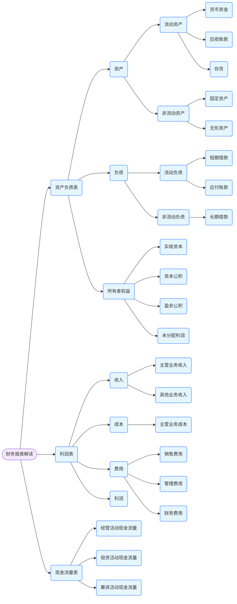

# 大卫德雷曼的财务报表解读

> 关键词：大卫德雷曼、财务报表解读、财务分析、投资决策、财务指标

> 摘要：本文围绕大卫德雷曼的财务报表解读方法展开，详细阐述了财务报表解读在投资领域的重要性和意义。介绍了核心概念，包括财务报表的种类和构成要素，分析了核心算法原理和具体操作步骤，运用数学模型和公式深入剖析财务指标。通过项目实战案例，展示了如何将理论应用于实际财务报表分析。探讨了实际应用场景，如企业估值、投资风险评估等。同时推荐了相关的学习资源、开发工具框架和论文著作。最后总结了未来财务报表解读的发展趋势与挑战，并提供常见问题解答和扩展阅读参考资料，旨在帮助读者全面掌握大卫德雷曼的财务报表解读方法，提升投资决策能力。

## 1. 背景介绍 
### 1.1 目的和范围
财务报表是企业经营状况的重要反映，对其进行准确解读能够帮助投资者、管理者等利益相关者了解企业的财务健康状况、经营成果和现金流量等信息。大卫德雷曼作为投资领域的知名专家，他的财务报表解读方法具有独特的视角和价值。本文的目的在于深入剖析大卫德雷曼的财务报表解读方法，详细介绍其核心概念、算法原理、操作步骤等内容，并通过实际案例展示其在投资决策中的应用。范围涵盖了财务报表的各个方面，包括资产负债表、利润表和现金流量表，以及相关的财务指标分析。

### 1.2 预期读者
本文预期读者主要包括投资者，无论是个人投资者还是机构投资者，都可以通过学习大卫德雷曼的财务报表解读方法，提升自己的投资分析能力，做出更明智的投资决策；企业管理者，他们可以借助这些方法深入了解企业的财务状况，发现经营中的问题并及时调整战略；财务分析师，能够从本文中获取新的分析思路和方法，完善自己的分析体系；以及对财务分析和投资领域感兴趣的学生和爱好者，为他们提供专业的知识和学习方向。

### 1.3 文档结构概述
本文首先介绍背景信息，包括目的、预期读者和文档结构概述，让读者对文章有一个整体的了解。接着阐述核心概念与联系，通过文本示意图和 Mermaid 流程图展示财务报表的相关概念和架构。然后详细讲解核心算法原理和具体操作步骤，结合 Python 源代码进行说明。之后介绍数学模型和公式，并举例说明其应用。通过项目实战部分，展示如何在实际中运用这些方法进行财务报表分析。探讨实际应用场景，让读者了解财务报表解读在不同领域的应用。推荐相关的工具和资源，包括学习资源、开发工具框架和论文著作。最后总结未来发展趋势与挑战，提供常见问题解答和扩展阅读参考资料。

### 1.4 术语表
#### 1.4.1 核心术语定义
- **财务报表**：是企业向外界展示其财务状况和经营成果的书面文件，主要包括资产负债表、利润表和现金流量表。
- **资产负债表**：反映企业在某一特定日期财务状况的报表，展示了企业的资产、负债和所有者权益的情况。
- **利润表**：反映企业在一定会计期间经营成果的报表，体现了企业的收入、成本、费用和利润等信息。
- **现金流量表**：反映企业在一定会计期间现金和现金等价物流入和流出的报表，揭示了企业的现金来源和使用情况。
- **财务指标**：用于衡量企业财务状况和经营成果的一系列数据，如毛利率、净利率、资产负债率等。

#### 1.4.2 相关概念解释
- **权责发生制**：是会计核算的基础，指企业在确认收入和费用时，以权利和责任的发生为标准，而不是以现金的收付为标准。
- **收付实现制**：与权责发生制相对，是以现金的实际收付为标准来确认收入和费用。
- **流动比率**：是流动资产与流动负债的比率，用于衡量企业短期偿债能力。
- **速动比率**：是速动资产与流动负债的比率，速动资产是指流动资产减去存货后的余额，比流动比率更能准确反映企业的短期偿债能力。

#### 1.4.3 缩略词列表
- **ROE**：Return on Equity，净资产收益率，反映股东权益的收益水平。
- **ROA**：Return on Assets，总资产收益率，衡量企业运用全部资产的获利能力。
- **EPS**：Earnings Per Share，每股收益，反映普通股的获利水平。

## 2. 核心概念与联系 

### 财务报表的种类和构成要素
财务报表主要包括资产负债表、利润表和现金流量表。资产负债表由资产、负债和所有者权益三部分构成，其基本等式为 $资产 = 负债 + 所有者权益$。资产包括流动资产和非流动资产，如货币资金、应收账款、存货、固定资产等；负债包括流动负债和非流动负债，如短期借款、应付账款、长期借款等；所有者权益包括实收资本、资本公积、盈余公积和未分配利润等。

利润表主要由收入、成本、费用和利润等要素构成，其基本公式为 $利润 = 收入 - 成本 - 费用$。收入包括主营业务收入和其他业务收入；成本主要是主营业务成本；费用包括销售费用、管理费用、财务费用等。

现金流量表分为经营活动现金流量、投资活动现金流量和筹资活动现金流量三部分，反映了企业现金的来源和使用情况。

### 核心概念原理和架构的文本示意图
```plaintext
财务报表解读
|-- 资产负债表
|   |-- 资产
|   |   |-- 流动资产
|   |   |   |-- 货币资金
|   |   |   |-- 应收账款
|   |   |   |-- 存货
|   |   |-- 非流动资产
|   |       |-- 固定资产
|   |       |-- 无形资产
|   |-- 负债
|   |   |-- 流动负债
|   |   |   |-- 短期借款
|   |   |   |-- 应付账款
|   |   |-- 非流动负债
|   |       |-- 长期借款
|   |-- 所有者权益
|       |-- 实收资本
|       |-- 资本公积
|       |-- 盈余公积
|       |-- 未分配利润
|-- 利润表
|   |-- 收入
|   |   |-- 主营业务收入
|   |   |-- 其他业务收入
|   |-- 成本
|   |   |-- 主营业务成本
|   |-- 费用
|   |   |-- 销售费用
|   |   |-- 管理费用
|   |   |-- 财务费用
|   |-- 利润
|-- 现金流量表
|   |-- 经营活动现金流量
|   |-- 投资活动现金流量
|   |-- 筹资活动现金流量
```

### Mermaid 流程图


## 3. 核心算法原理 & 具体操作步骤 

### 核心算法原理
大卫德雷曼的财务报表解读方法核心在于通过对财务报表中的各项数据进行分析和计算，得出一系列财务指标，以此来评估企业的财务状况和经营成果。例如，通过计算毛利率、净利率等指标来评估企业的盈利能力；通过计算资产负债率、流动比率等指标来评估企业的偿债能力。

### 具体操作步骤
#### 数据收集
首先需要收集企业的财务报表数据，包括资产负债表、利润表和现金流量表。这些数据可以从企业的官方网站、证券交易所网站、金融数据库等渠道获取。

#### 数据清洗和整理
对收集到的数据进行清洗和整理，去除无效数据、错误数据和重复数据。将数据按照一定的格式进行整理，以便后续的分析和计算。

#### 财务指标计算
根据财务报表数据计算各项财务指标，以下是使用 Python 代码实现部分财务指标计算的示例：
```python
import pandas as pd

# 假设已经获取并整理好财务报表数据，存储在 DataFrame 中
# 示例数据，实际使用时需要替换为真实数据
data = {
    '营业收入': [1000, 1200, 1500],
    '营业成本': [600, 700, 800],
    '净利润': [200, 250, 300],
    '流动资产': [500, 600, 700],
    '流动负债': [300, 350, 400],
    '总资产': [1500, 1800, 2000],
    '总负债': [800, 900, 1000]
}
df = pd.DataFrame(data)

# 计算毛利率
df['毛利率'] = (df['营业收入'] - df['营业成本']) / df['营业收入']

# 计算净利率
df['净利率'] = df['净利润'] / df['营业收入']

# 计算流动比率
df['流动比率'] = df['流动资产'] / df['流动负债']

# 计算资产负债率
df['资产负债率'] = df['总负债'] / df['总资产']

print(df)
```
#### 指标分析和评估
对计算得到的财务指标进行分析和评估，与同行业其他企业进行比较，分析企业在盈利能力、偿债能力、营运能力等方面的优势和劣势。结合企业的发展战略和市场环境，对企业的未来发展进行预测和判断。

## 4. 数学模型和公式 & 详细讲解 & 举例说明 

### 盈利能力指标
#### 毛利率
公式：$毛利率 = \frac{营业收入 - 营业成本}{营业收入} \times 100\%$
详细讲解：毛利率反映了企业在扣除直接成本后，每一元营业收入能够带来的毛利金额。毛利率越高，说明企业在产品或服务定价、成本控制等方面具有优势，盈利能力越强。
举例说明：假设企业 A 的营业收入为 1000 万元，营业成本为 600 万元，则其毛利率为 $\frac{1000 - 600}{1000} \times 100\% = 40\%$。这意味着企业 A 每实现 1 元的营业收入，扣除营业成本后能够获得 0.4 元的毛利。

#### 净利率
公式：$净利率 = \frac{净利润}{营业收入} \times 100\%$
详细讲解：净利率是企业净利润与营业收入的比率，反映了企业最终的盈利能力。净利率考虑了所有成本和费用，包括销售费用、管理费用、财务费用等，更全面地反映了企业的盈利水平。
举例说明：假设企业 B 的营业收入为 1200 万元，净利润为 240 万元，则其净利率为 $\frac{240}{1200} \times 100\% = 20\%$。说明企业 B 每实现 1 元的营业收入，最终能够获得 0.2 元的净利润。

### 偿债能力指标
#### 流动比率
公式：$流动比率 = \frac{流动资产}{流动负债}$
详细讲解：流动比率衡量了企业流动资产对流动负债的覆盖程度，反映了企业短期偿债能力。一般来说，流动比率越高，企业短期偿债能力越强，但过高的流动比率可能意味着企业资金闲置，利用效率不高。
举例说明：假设企业 C 的流动资产为 800 万元，流动负债为 400 万元，则其流动比率为 $\frac{800}{400} = 2$。这表明企业 C 的流动资产是流动负债的 2 倍，短期偿债能力较强。

#### 资产负债率
公式：$资产负债率 = \frac{总负债}{总资产} \times 100\%$
详细讲解：资产负债率反映了企业负债总额占资产总额的比例，衡量了企业长期偿债能力。资产负债率越高，说明企业负债越多，偿债压力越大，财务风险越高。
举例说明：假设企业 D 的总资产为 2000 万元，总负债为 1000 万元，则其资产负债率为 $\frac{1000}{2000} \times 100\% = 50\%$。表示企业 D 的负债占资产的一半，存在一定的偿债压力。

### 营运能力指标
#### 应收账款周转率
公式：$应收账款周转率 = \frac{营业收入}{平均应收账款余额}$
其中，$平均应收账款余额 = \frac{期初应收账款余额 + 期末应收账款余额}{2}$
详细讲解：应收账款周转率反映了企业应收账款周转速度的快慢及管理效率的高低。周转率越高，表明企业收账速度快，平均收账期短，坏账损失少，资产流动快，偿债能力强。
举例说明：假设企业 E 营业收入为 1500 万元，期初应收账款余额为 200 万元，期末应收账款余额为 300 万元，则平均应收账款余额为 $\frac{200 + 300}{2} = 250$ 万元，应收账款周转率为 $\frac{1500}{250} = 6$ 次。这意味着企业 E 的应收账款在一年内周转了 6 次。

## 5. 项目实战：代码实际案例和详细解释说明 

### 5.1  开发环境搭建
#### 安装 Python
首先需要安装 Python 编程语言，建议使用 Python 3.7 及以上版本。可以从 Python 官方网站（https://www.python.org/downloads/）下载对应操作系统的安装包，按照安装向导进行安装。

#### 安装必要的库
使用 Python 进行财务报表分析需要安装一些必要的库，如 Pandas、Numpy 等。可以使用以下命令进行安装：
```sh
pip install pandas numpy
```

### 5.2  源代码详细实现和代码解读
```python
import pandas as pd
import numpy as np

# 读取财务报表数据，假设数据存储在 CSV 文件中
file_path = 'financial_statements.csv'
try:
    df = pd.read_csv(file_path)
except FileNotFoundError:
    print(f"文件 {file_path} 未找到，请检查文件路径。")
    exit(1)

# 数据清洗和预处理
# 去除缺失值
df = df.dropna()

# 计算财务指标
# 毛利率
df['毛利率'] = (df['营业收入'] - df['营业成本']) / df['营业收入']

# 净利率
df['净利率'] = df['净利润'] / df['营业收入']

# 流动比率
df['流动比率'] = df['流动资产'] / df['流动负债']

# 资产负债率
df['资产负债率'] = df['总负债'] / df['总资产']

# 应收账款周转率
df['平均应收账款余额'] = (df['期初应收账款'] + df['期末应收账款']) / 2
df['应收账款周转率'] = df['营业收入'] / df['平均应收账款余额']

# 保存结果到新的 CSV 文件
output_file = 'financial_analysis_result.csv'
df.to_csv(output_file, index=False)
print(f"分析结果已保存到 {output_file}")
```
### 代码解读与分析
1. **导入必要的库**：导入 Pandas 和 Numpy 库，Pandas 用于数据处理和分析，Numpy 用于数值计算。
2. **读取财务报表数据**：使用 `pd.read_csv()` 函数读取存储在 CSV 文件中的财务报表数据。如果文件不存在，会捕获 `FileNotFoundError` 异常并输出错误信息。
3. **数据清洗和预处理**：使用 `dropna()` 函数去除数据中的缺失值，确保数据的完整性。
4. **计算财务指标**：根据前面介绍的公式，计算毛利率、净利率、流动比率、资产负债率和应收账款周转率等财务指标，并将结果添加到 DataFrame 中。
5. **保存结果**：使用 `to_csv()` 函数将分析结果保存到新的 CSV 文件中，方便后续查看和分析。

## 6. 实际应用场景 
### 投资决策
投资者可以通过解读企业的财务报表，评估企业的盈利能力、偿债能力和营运能力等，从而判断企业的投资价值。例如，毛利率和净利率较高、资产负债率较低的企业，通常具有较强的盈利能力和较低的财务风险，可能是较好的投资对象。

### 企业估值
在企业并购、重组等过程中，需要对企业进行估值。财务报表解读可以为企业估值提供重要的依据，通过分析企业的财务数据，预测企业未来的现金流和盈利情况，从而确定企业的合理价值。

### 风险评估
银行等金融机构在发放贷款时，需要评估企业的偿债能力和信用风险。通过解读企业的财务报表，分析流动比率、资产负债率等指标，可以判断企业的短期和长期偿债能力，评估贷款风险。

### 企业战略规划
企业管理者可以通过分析财务报表，了解企业的经营状况和财务状况，发现企业存在的问题和优势。根据分析结果，制定合理的企业战略，如调整产品结构、优化成本控制、拓展市场等。

## 7. 工具和资源推荐
### 7.1 学习资源推荐
#### 7.1.1 书籍推荐
- 《财务报表分析与股票估值》：本书详细介绍了财务报表分析的方法和技巧，并结合股票估值的案例，帮助读者将财务分析应用于投资决策。
- 《手把手教你读财报》：以通俗易懂的语言，介绍了财务报表的基本知识和解读方法，适合初学者阅读。
- 《聪明的投资者》：价值投资领域的经典著作，虽然不是专门关于财务报表解读的书籍，但其中涉及到了很多通过财务分析进行投资决策的理念和方法。

#### 7.1.2 在线课程
- Coursera 平台上的“Financial Accounting”课程：由知名大学的教授授课，系统地介绍了财务会计的基本知识和财务报表的编制与分析方法。
- 网易云课堂上的“财务报表分析实战”课程：结合实际案例，详细讲解了财务报表分析的方法和技巧，具有很强的实用性。

#### 7.1.3 技术博客和网站
- 雪球网：是一个投资者交流社区，上面有很多关于财务报表分析和投资的文章和讨论，可以学习到其他投资者的经验和见解。
- 东方财富网：提供丰富的财经数据和资讯，包括企业的财务报表数据，可以方便地获取和分析相关信息。

### 7.2 开发工具框架推荐
#### 7.2.1 IDE和编辑器
- PyCharm：是一款专业的 Python 集成开发环境，具有代码编辑、调试、自动补全、代码分析等功能，适合进行 Python 代码开发。
- Jupyter Notebook：是一个交互式的开发环境，支持多种编程语言，特别适合进行数据分析和可视化。可以在浏览器中编写和运行代码，方便展示和分享分析结果。

#### 7.2.2 调试和性能分析工具
- PDB：是 Python 自带的调试工具，可以在代码中设置断点，逐行调试代码，帮助查找和解决代码中的问题。
- cProfile：是 Python 的性能分析工具，可以分析代码的运行时间和函数调用情况，找出代码中的性能瓶颈。

#### 7.2.3 相关框架和库
- Pandas：是 Python 中用于数据处理和分析的强大库，提供了丰富的数据结构和数据操作方法，非常适合处理财务报表数据。
- Numpy：是 Python 中用于数值计算的基础库，提供了高效的多维数组对象和各种数学函数，为财务指标的计算提供了支持。
- Matplotlib：是 Python 中用于数据可视化的库，可以绘制各种图表，如折线图、柱状图、饼图等，帮助直观地展示财务分析结果。

### 7.3 相关论文著作推荐
#### 7.3.1 经典论文
- “The Quality of Earnings”：该论文探讨了盈余质量的概念和评估方法，对理解企业的盈利真实性和可持续性具有重要意义。
- “Financial Ratios and the Probabilistic Prediction of Bankruptcy”：研究了财务比率与企业破产概率之间的关系，为企业风险评估提供了理论依据。

#### 7.3.2 最新研究成果
可以通过学术数据库，如知网、万方、Web of Science 等，搜索关于财务报表分析、企业财务风险评估等方面的最新研究论文，了解该领域的前沿动态和研究方法。

#### 7.3.3 应用案例分析
一些专业的财经杂志和网站会发布企业财务报表分析的应用案例，如《财经》杂志、《证券市场周刊》等。通过阅读这些案例，可以学习到实际应用中的分析方法和技巧。

## 8. 总结：未来发展趋势与挑战
### 未来发展趋势
#### 数字化和智能化
随着信息技术的不断发展，财务报表数据的获取、处理和分析将越来越数字化和智能化。利用大数据、人工智能等技术，可以更快速、准确地对海量财务数据进行分析，挖掘出有价值的信息。

#### 非财务信息的融合
未来的财务报表解读将不仅仅局限于财务数据，还会融合更多的非财务信息，如企业的市场份额、品牌影响力、创新能力等。综合考虑这些因素，可以更全面地评估企业的价值和发展潜力。

#### 国际化和标准化
随着经济全球化的发展，企业的跨国经营越来越普遍。财务报表的编制和解读也将更加国际化和标准化，以便不同国家和地区的投资者和利益相关者能够更好地理解和比较企业的财务状况。

### 挑战
#### 数据质量和可靠性
财务报表数据的质量和可靠性是进行准确分析的基础。然而，在实际中，可能存在数据造假、数据不准确等问题，这给财务报表解读带来了挑战。需要加强对数据的审核和验证，提高数据质量。

#### 技术更新换代快
信息技术发展迅速，新的数据分析技术和工具不断涌现。财务报表分析人员需要不断学习和掌握新的技术，以适应市场的变化和需求。

#### 复杂的经济环境
全球经济环境日益复杂，宏观经济政策、市场波动等因素都会对企业的财务状况产生影响。在进行财务报表解读时，需要考虑这些复杂因素，提高分析的准确性和可靠性。

## 9. 附录：常见问题与解答
### 如何判断财务报表数据的真实性？
可以通过以下方法判断财务报表数据的真实性：查看审计报告，审计报告是由专业的审计机构对企业财务报表进行审计后出具的意见，如果审计报告为无保留意见，说明财务报表在重大方面是真实可靠的；分析财务数据的合理性，如毛利率、净利率等指标是否与同行业水平相符，是否存在异常波动；进行实地考察和调查，了解企业的实际经营情况。

### 财务指标的正常范围是多少？
不同行业的财务指标正常范围可能会有所不同。一般来说，毛利率在 20% - 50% 之间比较合理，但一些高附加值行业的毛利率可能会更高；净利率在 5% - 20% 之间较为常见；流动比率一般认为在 2 左右比较合适，但也需要结合行业特点进行分析；资产负债率一般不宜超过 70%。

### 如何进行同行业比较分析？
可以通过以下步骤进行同行业比较分析：确定同行业的可比企业，可以参考行业分类标准和相关的行业研究报告；收集可比企业的财务报表数据；计算可比企业的相同财务指标；将目标企业的财务指标与可比企业的指标进行对比，分析目标企业在盈利能力、偿债能力、营运能力等方面的优势和劣势。

## 10. 扩展阅读 & 参考资料
### 扩展阅读
- 《财务分析与决策》：进一步深入介绍了财务分析的方法和决策应用，内容更加全面和深入。
- 《价值评估：公司价值的衡量与管理》：专注于企业价值评估的理论和方法，对于理解财务报表解读在企业估值中的应用有很大帮助。

### 参考资料
- 企业会计准则：是企业编制财务报表的依据，了解企业会计准则有助于准确理解财务报表中的数据和信息。
- 相关行业研究报告：可以从行业协会、咨询机构等获取，了解行业的发展趋势、竞争格局等信息，为财务报表解读提供背景支持。

作者：AI天才研究院/AI Genius Institute & 禅与计算机程序设计艺术 /Zen And The Art of Computer Programming