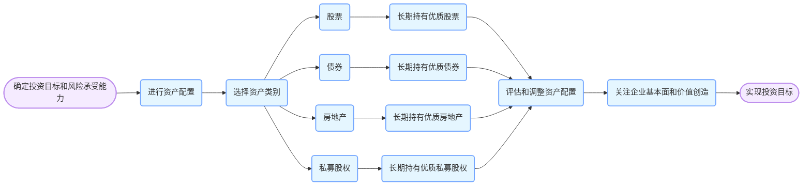

# 大卫斯文森的耐心资本理念

> 关键词：大卫斯文森、耐心资本、投资理念、长期投资、资产配置、机构投资、价值创造

> 摘要：本文深入探讨了大卫斯文森的耐心资本理念。大卫斯文森作为投资领域的传奇人物，其耐心资本理念对全球的投资界产生了深远影响。文章首先介绍了该理念产生的背景，包括目的、预期读者等内容。接着阐述了耐心资本理念的核心概念与联系，通过清晰的示意图和流程图进行呈现。然后详细讲解了相关核心算法原理、数学模型和公式，并结合具体例子进行说明。在项目实战部分，给出了基于该理念的代码实际案例及详细解读。同时分析了耐心资本理念的实际应用场景，推荐了学习该理念的相关工具和资源，包括书籍、在线课程、开发工具等。最后总结了耐心资本理念的未来发展趋势与挑战，还设置了常见问题解答和扩展阅读参考资料，旨在全面、深入地剖析大卫斯文森的耐心资本理念，为投资者和相关研究人员提供有价值的参考。

## 1. 背景介绍 
### 1.1 目的和范围
大卫斯文森的耐心资本理念旨在为投资者提供一种区别于短期投机的长期投资策略，以实现资产的稳健增长和价值的持续创造。该理念的范围不仅适用于个人投资者，对于机构投资者如大学捐赠基金、养老基金等也具有重要的指导意义。它强调通过合理的资产配置和长期持有优质资产，来应对市场的波动和不确定性，从而在长期的投资过程中获得丰厚的回报。

### 1.2 预期读者
本文的预期读者包括广大的投资者，无论是个人投资者希望通过合理投资实现财富增值，还是机构投资者寻求优化投资组合和提升投资绩效。同时，金融领域的研究人员、学者也可以从本文中深入了解耐心资本理念的理论和实践，为进一步的学术研究提供参考。此外，对投资领域感兴趣的学生和爱好者也能通过本文初步认识和学习这一重要的投资理念。

### 1.3 文档结构概述
本文将按照以下结构展开：首先介绍大卫斯文森耐心资本理念的背景信息，包括目的、读者群体和文档结构概述等。接着阐述耐心资本理念的核心概念与联系，通过示意图和流程图帮助读者理解。然后详细讲解核心算法原理和具体操作步骤，结合Python代码进行说明。之后介绍相关的数学模型和公式，并举例说明。在项目实战部分，展示代码实际案例并进行详细解释。再分析该理念的实际应用场景，推荐相关的工具和资源。最后总结耐心资本理念的未来发展趋势与挑战，设置常见问题解答和扩展阅读参考资料。

### 1.4 术语表
#### 1.4.1 核心术语定义
- **耐心资本**：指投资者愿意长期投入资金，不追求短期的快速回报，而是着眼于资产的长期增值和价值创造的资本。
- **资产配置**：将资金分配到不同类型的资产中，如股票、债券、房地产等，以实现风险分散和收益最大化的投资策略。
- **长期投资**：投资期限较长，通常超过数年甚至数十年，以获取资产在长期内的增值收益。

#### 1.4.2 相关概念解释
- **价值创造**：通过投资具有潜力的资产，参与企业的成长和发展，为社会创造实际价值，同时实现自身资产的增值。
- **市场波动**：指市场价格在短期内的上下变动，是市场的正常现象，但会对投资者的情绪和决策产生影响。

#### 1.4.3 缩略词列表
- **ETF**：交易型开放式指数基金（Exchange Traded Fund）
- **PE**：私募股权投资（Private Equity）

## 2. 核心概念与联系 

### 核心概念原理
大卫斯文森的耐心资本理念核心在于强调长期投资和合理的资产配置。耐心资本意味着投资者要有足够的耐心，不被短期的市场波动所干扰，长期持有优质资产。资产配置则是根据不同资产的风险和收益特征，将资金分散投资到多个领域，以降低单一资产的风险。通过长期投资，投资者可以分享企业成长带来的红利，实现资产的复利增长。同时，合理的资产配置可以在不同市场环境下平衡风险和收益，提高投资组合的稳定性。

### 架构的文本示意图
耐心资本理念的架构可以用以下文本描述：投资者以耐心资本为基础，根据自身的投资目标和风险承受能力，进行资产配置。资产配置包括股票、债券、房地产、私募股权等多种资产类别。在长期投资过程中，不断评估和调整资产配置，以适应市场变化和实现投资目标。同时，投资者要关注企业的基本面和价值创造能力，选择具有潜力的资产进行投资。

### Mermaid 流程图


## 3. 核心算法原理 & 具体操作步骤 

### 核心算法原理
在耐心资本理念中，一个重要的算法原理是基于均值 - 方差优化的资产配置算法。该算法的目标是在给定的风险水平下，最大化投资组合的预期收益；或者在给定的预期收益水平下，最小化投资组合的风险。其基本思想是通过计算不同资产之间的协方差矩阵和预期收益率，来确定最优的资产配置比例。

### Python 源代码实现
```python
import numpy as np
import pandas as pd
from scipy.optimize import minimize

# 假设有三种资产，它们的预期收益率
expected_returns = np.array([0.1, 0.15, 0.2])
# 三种资产的协方差矩阵
cov_matrix = np.array([[0.04, 0.02, 0.01],
                       [0.02, 0.09, 0.03],
                       [0.01, 0.03, 0.16]])

# 定义目标函数：最小化投资组合的风险（方差）
def portfolio_variance(weights, cov_matrix):
    return np.dot(weights.T, np.dot(cov_matrix, weights))

# 定义约束条件：权重之和为 1
constraints = ({'type': 'eq', 'fun': lambda x: np.sum(x) - 1})
# 权重的边界范围：0 到 1
bounds = [(0, 1) for _ in range(len(expected_returns))]
# 初始权重猜测
initial_weights = np.ones(len(expected_returns)) / len(expected_returns)

# 进行优化求解
result = minimize(portfolio_variance, initial_weights, args=(cov_matrix,),
                  method='SLSQP', bounds=bounds, constraints=constraints)

# 最优权重
optimal_weights = result.x
print("最优资产配置权重:", optimal_weights)
```

### 具体操作步骤
1. **确定资产范围**：首先要确定投资的资产范围，例如股票、债券、房地产等不同类型的资产。
2. **估计预期收益率和协方差矩阵**：通过历史数据或专业的分析方法，估计每种资产的预期收益率和资产之间的协方差矩阵。
3. **定义目标函数和约束条件**：根据投资目标，定义目标函数，如最小化风险或最大化收益。同时，设置约束条件，如权重之和为 1，权重非负等。
4. **选择优化算法**：使用合适的优化算法，如上述代码中的 SLSQP 算法，来求解最优的资产配置权重。
5. **实施和调整**：根据求解得到的最优权重，进行资产配置。在投资过程中，定期评估和调整资产配置，以适应市场变化。

## 4. 数学模型和公式 & 详细讲解 & 举例说明 

### 数学模型和公式
#### 投资组合的预期收益率
投资组合的预期收益率 $E(R_p)$ 可以表示为：
$$E(R_p)=\sum_{i=1}^{n} w_i E(R_i)$$
其中，$w_i$ 是第 $i$ 种资产的权重，$E(R_i)$ 是第 $i$ 种资产的预期收益率，$n$ 是资产的数量。

#### 投资组合的方差
投资组合的方差 $\sigma_p^2$ 可以表示为：
$$\sigma_p^2=\sum_{i=1}^{n} \sum_{j=1}^{n} w_i w_j \sigma_{ij}$$
其中，$\sigma_{ij}$ 是第 $i$ 种资产和第 $j$ 种资产的协方差。

### 详细讲解
- **预期收益率公式**：该公式表明投资组合的预期收益率是每种资产预期收益率的加权平均值，权重为每种资产在投资组合中的比例。通过合理调整资产的权重，可以改变投资组合的预期收益率。
- **方差公式**：投资组合的方差反映了投资组合的风险程度。它不仅考虑了每种资产自身的方差，还考虑了资产之间的协方差。当资产之间的相关性较低时，通过资产配置可以降低投资组合的风险。

### 举例说明
假设有两种资产 A 和 B，资产 A 的预期收益率为 10%，资产 B 的预期收益率为 15%。资产 A 的方差为 0.04，资产 B 的方差为 0.09，资产 A 和 B 的协方差为 0.02。投资者将资金的 60% 投资于资产 A，40% 投资于资产 B。

- **计算预期收益率**：
$E(R_p)=0.6\times0.1 + 0.4\times0.15 = 0.12$，即投资组合的预期收益率为 12%。

- **计算方差**：
$\sigma_p^2 = 0.6^2\times0.04 + 0.4^2\times0.09 + 2\times0.6\times0.4\times0.02 = 0.0336$
则投资组合的标准差 $\sigma_p=\sqrt{0.0336}\approx0.183$

通过这个例子可以看出，通过合理的资产配置，可以在一定程度上平衡预期收益率和风险。

## 5. 项目实战：代码实际案例和详细解释说明 

### 5.1  开发环境搭建
- **Python 安装**：首先要安装 Python 环境，建议使用 Python 3.7 及以上版本。可以从 Python 官方网站（https://www.python.org/downloads/） 下载并安装。
- **相关库安装**：使用以下命令安装所需的库：
```sh
pip install numpy pandas scipy
```

### 5.2  源代码详细实现和代码解读
```python
import numpy as np
import pandas as pd
from scipy.optimize import minimize

# 读取历史数据
# 假设数据文件名为 'historical_data.csv'，包含每种资产的历史收益率
data = pd.read_csv('historical_data.csv')

# 计算每种资产的预期收益率
expected_returns = data.mean()

# 计算协方差矩阵
cov_matrix = data.cov()

# 定义目标函数：最小化投资组合的风险（方差）
def portfolio_variance(weights, cov_matrix):
    return np.dot(weights.T, np.dot(cov_matrix, weights))

# 定义约束条件：权重之和为 1
constraints = ({'type': 'eq', 'fun': lambda x: np.sum(x) - 1})
# 权重的边界范围：0 到 1
bounds = [(0, 1) for _ in range(len(expected_returns))]
# 初始权重猜测
initial_weights = np.ones(len(expected_returns)) / len(expected_returns)

# 进行优化求解
result = minimize(portfolio_variance, initial_weights, args=(cov_matrix,),
                  method='SLSQP', bounds=bounds, constraints=constraints)

# 最优权重
optimal_weights = result.x
print("最优资产配置权重:", optimal_weights)
```
### 代码解读与分析
1. **数据读取**：使用 `pandas` 库的 `read_csv` 函数读取历史数据文件，该文件包含每种资产的历史收益率。
2. **预期收益率和协方差矩阵计算**：使用 `mean` 方法计算每种资产的预期收益率，使用 `cov` 方法计算资产之间的协方差矩阵。
3. **目标函数定义**：定义 `portfolio_variance` 函数，用于计算投资组合的方差，作为目标函数进行优化。
4. **约束条件和边界设置**：设置权重之和为 1 的约束条件，以及权重在 0 到 1 之间的边界范围。
5. **优化求解**：使用 `scipy.optimize.minimize` 函数，选择 SLSQP 算法进行优化求解，得到最优的资产配置权重。

通过这个代码案例，可以根据历史数据来确定最优的资产配置，实现基于耐心资本理念的投资组合优化。

## 6. 实际应用场景 
### 大学捐赠基金管理
大学捐赠基金通常具有长期的投资目标，旨在为学校的教学、科研等活动提供持续的资金支持。大卫斯文森的耐心资本理念非常适合大学捐赠基金的管理。通过合理的资产配置，将资金分散投资到股票、债券、私募股权、房地产等多个领域，长期持有优质资产。例如，耶鲁大学捐赠基金在大卫斯文森的管理下，取得了优异的长期投资业绩，为学校的发展提供了坚实的资金保障。

### 养老基金投资
养老基金的投资目标是确保在长期内有足够的资金来支付养老金。耐心资本理念可以帮助养老基金实现这一目标。养老基金可以通过长期投资，分享经济增长的红利，同时通过合理的资产配置降低风险。例如，一些国家的养老基金通过投资优质的股票和债券，以及参与基础设施等长期项目的投资，实现了资产的稳健增长。

### 家族财富传承
对于家族财富的传承，耐心资本理念可以帮助家族实现财富的长期保值和增值。家族可以通过长期投资具有潜力的企业和资产，实现财富的持续增长。同时，合理的资产配置可以降低家族财富受到市场波动的影响。例如，一些家族通过投资私募股权、房地产等领域，实现了家族财富的代代相传。

## 7. 工具和资源推荐
### 7.1 学习资源推荐
#### 7.1.1 书籍推荐
- 《机构投资的创新之路》（Pioneering Portfolio Management）：大卫斯文森的经典著作，详细阐述了他的投资理念和实践经验。
- 《聪明的投资者》（The Intelligent Investor）：本杰明·格雷厄姆的著作，强调了价值投资和长期投资的重要性。
- 《漫步华尔街》（A Random Walk Down Wall Street）：伯顿·马尔基尔的著作，介绍了各种投资策略和市场理论。

#### 7.1.2 在线课程
- Coursera 上的“投资学原理”课程：系统介绍了投资的基本原理和方法。
- edX 上的“金融市场”课程：深入讲解了金融市场的运作和投资策略。

#### 7.1.3 技术博客和网站
- Seeking Alpha：提供专业的投资分析和研究报告。
- Bloomberg：全球知名的金融信息网站，提供丰富的市场数据和分析。

### 7.2 开发工具框架推荐
#### 7.2.1 IDE和编辑器
- PyCharm：功能强大的 Python 集成开发环境，适合进行数据分析和算法实现。
- Jupyter Notebook：交互式的开发环境，方便进行代码编写和数据可视化。

#### 7.2.2 调试和性能分析工具
- IPython：增强的 Python 交互式解释器，方便进行代码调试。
- cProfile：Python 内置的性能分析工具，用于分析代码的性能瓶颈。

#### 7.2.3 相关框架和库
- NumPy：用于科学计算的 Python 库，提供高效的数组操作。
- Pandas：用于数据处理和分析的 Python 库，提供强大的数据结构和数据分析工具。
- Scipy：用于科学计算和优化的 Python 库，提供多种优化算法。

### 7.3 相关论文著作推荐
#### 7.3.1 经典论文
- Markowitz, H. M. (1952). Portfolio Selection. The Journal of Finance, 7(1), 77-91. 该论文提出了现代投资组合理论，是资产配置领域的经典之作。
- Sharpe, W. F. (1964). Capital Asset Prices: A Theory of Market Equilibrium under Conditions of Risk. The Journal of Finance, 19(3), 425-442. 该论文提出了资本资产定价模型（CAPM），对投资理论和实践产生了深远影响。

#### 7.3.2 最新研究成果
- 可以关注顶级金融学术期刊，如 The Journal of Finance、The Review of Financial Studies 等，了解资产配置和投资领域的最新研究成果。

#### 7.3.3 应用案例分析
- 一些金融机构和研究机构会发布关于大学捐赠基金、养老基金等投资案例的分析报告，可以从中