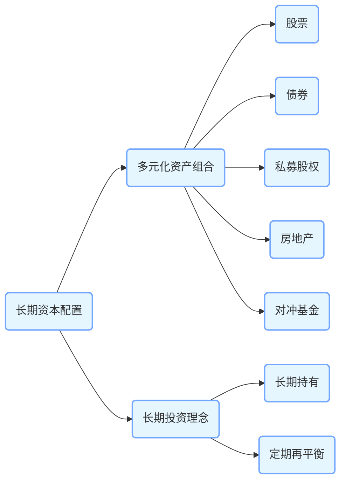

# 大卫斯文森的长期资本配置

> 关键词：大卫斯文森、长期资本配置、资产组合理论、投资策略、多元化投资

> 摘要：本文深入探讨了大卫·斯文森的长期资本配置理念与方法。大卫·斯文森作为耶鲁大学捐赠基金的传奇投资管理人，其独特的长期资本配置策略取得了卓越的投资业绩。文章首先介绍了相关背景，包括目的、预期读者等。接着阐述核心概念，分析其资本配置的原理和架构。详细讲解核心算法原理及操作步骤，通过数学模型和公式深入剖析。结合项目实战，给出实际案例及代码解读。探讨了其在不同场景下的应用，推荐了学习、开发相关的工具和资源。最后总结未来发展趋势与挑战，解答常见问题，并提供扩展阅读和参考资料，旨在为投资者和金融从业者提供全面且深入的关于大卫·斯文森长期资本配置的知识体系。

## 1. 背景介绍 
### 1.1 目的和范围
本文的目的是全面深入地研究大卫·斯文森的长期资本配置策略。通过对其投资理念、方法、实践案例的分析，为投资者、金融从业者以及对投资领域感兴趣的人士提供系统的知识和实用的借鉴。研究范围涵盖了斯文森长期资本配置的核心概念、算法原理、数学模型、实际应用等多个方面，旨在揭示其成功的奥秘和可复制性。

### 1.2 预期读者
预期读者包括专业的投资者，如基金经理、投资顾问等，他们可以从本文中获取新的投资思路和策略优化方法；金融专业的学生和学者，有助于他们深入理解投资理论和实践的结合；以及普通的个人投资者，能够学习到长期资本配置的基本方法和原则，提升自己的投资能力。

### 1.3 文档结构概述
本文将按照以下结构进行阐述：首先介绍相关背景知识，包括目的、读者和文档结构等；接着阐述核心概念，展示其原理和架构；然后讲解核心算法原理和具体操作步骤，结合Python代码进行说明；再通过数学模型和公式深入分析；进行项目实战，给出代码案例和详细解读；探讨实际应用场景；推荐相关的工具和资源；最后总结未来发展趋势与挑战，解答常见问题，并提供扩展阅读和参考资料。

### 1.4 术语表
#### 1.4.1 核心术语定义
- **长期资本配置**：指投资者根据自身的投资目标、风险承受能力等因素，将资金在不同资产类别（如股票、债券、房地产等）之间进行长期的分配和布局，以实现资产的保值增值。
- **多元化投资**：通过投资于多种不同类型的资产，降低单一资产波动对整体投资组合的影响，分散风险的投资策略。
- **资产组合理论**：研究如何通过合理的资产组合，在风险和收益之间达到最优平衡的理论。

#### 1.4.2 相关概念解释
- **风险溢价**：投资者因承担额外风险而获得的超过无风险收益率的额外收益。
- **流动性**：资产能够以合理价格快速变现的能力。

#### 1.4.3 缩略词列表
- **ETF**：交易型开放式指数基金（Exchange Traded Fund）
- **REITs**：房地产投资信托基金（Real Estate Investment Trusts）

## 2. 核心概念与联系 

### 核心概念原理
大卫·斯文森的长期资本配置核心原理基于现代资产组合理论，强调多元化投资和长期投资。他认为，通过将资金分散投资于不同的资产类别，并且长期持有，可以在降低风险的同时获得较为稳定的收益。斯文森打破了传统的以股票和债券为主的投资组合模式，引入了大量的另类资产，如私募股权、房地产、对冲基金等。

### 架构示意图


### 概念联系分析
多元化资产组合是长期资本配置的核心手段，不同资产类别之间的相关性较低，当某一类资产表现不佳时，其他资产可能表现良好，从而降低整个投资组合的波动性。长期投资理念则是实现长期资本配置目标的保障，通过长期持有和定期再平衡，可以避免短期市场波动的干扰，确保投资组合始终符合投资者的风险偏好和目标。

## 3. 核心算法原理 & 具体操作步骤 

### 核心算法原理
斯文森的长期资本配置算法核心在于根据不同资产类别的预期收益率、风险水平和相关性，确定最优的资产配置比例。常用的方法是均值 - 方差优化模型，该模型通过最大化投资组合的预期收益率，同时最小化投资组合的方差（风险）来确定最优配置。

### Python代码实现
```python
import numpy as np
import pandas as pd
from scipy.optimize import minimize

# 假设我们有三种资产：股票、债券、房地产
# 历史收益率
returns = np.array([0.1, 0.05, 0.08])
# 协方差矩阵
cov_matrix = np.array([[0.1, 0.02, 0.03],
                       [0.02, 0.05, 0.01],
                       [0.03, 0.01, 0.06]])

# 目标收益率
target_return = 0.07

# 定义目标函数：最小化方差
def portfolio_variance(weights, cov_matrix):
    return np.dot(weights.T, np.dot(cov_matrix, weights))

# 定义约束条件：权重之和为1，预期收益率等于目标收益率
constraints = [{'type': 'eq', 'fun': lambda x: np.sum(x) - 1},
               {'type': 'eq', 'fun': lambda x: np.dot(x, returns) - target_return}]

# 定义权重范围
bounds = [(0, 1) for _ in range(len(returns))]

# 初始权重猜测
initial_weights = np.ones(len(returns)) / len(returns)

# 进行优化
result = minimize(portfolio_variance, initial_weights, args=(cov_matrix,),
                  method='SLSQP', constraints=constraints, bounds=bounds)

# 最优权重
optimal_weights = result.x

print("最优权重：", optimal_weights)
```

### 具体操作步骤
1. **数据收集**：收集不同资产类别的历史收益率和协方差矩阵。
2. **确定目标收益率**：根据投资者的风险承受能力和投资目标，确定一个合理的目标收益率。
3. **定义目标函数和约束条件**：目标函数是最小化投资组合的方差，约束条件包括权重之和为1和预期收益率等于目标收益率。
4. **进行优化**：使用优化算法（如上述代码中的`minimize`函数）求解最优权重。
5. **实施配置**：根据最优权重，将资金分配到不同的资产类别中。

## 4. 数学模型和公式 & 详细讲解 & 举例说明 

### 数学模型
均值 - 方差优化模型的数学表达式如下：

$$
\begin{aligned}
\min_{w} &\quad w^T \Sigma w \\
\text{s.t.} &\quad w^T \mu = r_p \\
&\quad \sum_{i=1}^{n} w_i = 1 \\
&\quad 0 \leq w_i \leq 1, \quad i = 1, \cdots, n
\end{aligned}
$$

其中，$w$ 是资产权重向量，$\Sigma$ 是资产收益率的协方差矩阵，$\mu$ 是资产的预期收益率向量，$r_p$ 是目标收益率，$n$ 是资产的数量。

### 详细讲解
目标函数 $w^T \Sigma w$ 表示投资组合的方差，即风险。我们的目标是在满足一定预期收益率的前提下，最小化投资组合的风险。约束条件 $w^T \mu = r_p$ 确保投资组合的预期收益率等于目标收益率，$\sum_{i=1}^{n} w_i = 1$ 保证权重之和为1，$0 \leq w_i \leq 1$ 限制权重在合理范围内。

### 举例说明
假设我们有两种资产：股票和债券。股票的预期收益率为 $0.1$，标准差为 $0.2$；债券的预期收益率为 $0.05$，标准差为 $0.1$。两者的相关系数为 $0.2$。目标收益率为 $0.07$。

首先计算协方差矩阵：
$$
\Sigma = \begin{bmatrix}
0.2^2 & 0.2 \times 0.1 \times 0.2 \\
0.2 \times 0.1 \times 0.2 & 0.1^2
\end{bmatrix} = \begin{bmatrix}
0.04 & 0.004 \\
0.004 & 0.01
\end{bmatrix}
$$

预期收益率向量 $\mu = \begin{bmatrix} 0.1 \\ 0.05 \end{bmatrix}$。

使用上述优化模型求解最优权重，最终得到股票和债券的最优权重分别为 $w_1$ 和 $w_2$，使得投资组合在满足目标收益率 $0.07$ 的情况下，风险最小。

## 5. 项目实战：代码实际案例和详细解释说明 

### 5.1  开发环境搭建
- **Python环境**：建议使用Python 3.7及以上版本。可以通过Anaconda或Python官方网站进行安装。
- **必要库**：安装`numpy`、`pandas`、`scipy`等库。可以使用以下命令进行安装：
```sh
pip install numpy pandas scipy
```

### 5.2  源代码详细实现和代码解读
```python
import numpy as np
import pandas as pd
from scipy.optimize import minimize

# 模拟数据：假设有四种资产
# 历史收益率
returns = np.array([0.12, 0.08, 0.06, 0.1])
# 协方差矩阵
cov_matrix = np.array([[0.15, 0.03, 0.02, 0.04],
                       [0.03, 0.1, 0.01, 0.02],
                       [0.02, 0.01, 0.08, 0.01],
                       [0.04, 0.02, 0.01, 0.12]])

# 目标收益率
target_return = 0.09

# 定义目标函数：最小化方差
def portfolio_variance(weights, cov_matrix):
    return np.dot(weights.T, np.dot(cov_matrix, weights))

# 定义约束条件：权重之和为1，预期收益率等于目标收益率
constraints = [{'type': 'eq', 'fun': lambda x: np.sum(x) - 1},
               {'type': 'eq', 'fun': lambda x: np.dot(x, returns) - target_return}]

# 定义权重范围
bounds = [(0, 1) for _ in range(len(returns))]

# 初始权重猜测
initial_weights = np.ones(len(returns)) / len(returns)

# 进行优化
result = minimize(portfolio_variance, initial_weights, args=(cov_matrix,),
                  method='SLSQP', constraints=constraints, bounds=bounds)

# 最优权重
optimal_weights = result.x

print("最优权重：", optimal_weights)

# 计算最优投资组合的预期收益率和标准差
portfolio_return = np.dot(optimal_weights, returns)
portfolio_std = np.sqrt(np.dot(optimal_weights.T, np.dot(cov_matrix, optimal_weights)))

print("最优投资组合的预期收益率：", portfolio_return)
print("最优投资组合的标准差：", portfolio_std)
```

### 代码解读与分析
1. **数据准备**：定义了四种资产的历史收益率和协方差矩阵，以及目标收益率。
2. **目标函数**：`portfolio_variance` 函数用于计算投资组合的方差，即风险。
3. **约束条件**：使用字典列表定义了两个约束条件，分别是权重之和为1和预期收益率等于目标收益率。
4. **权重范围**：通过 `bounds` 列表限制了每个资产的权重在 $[0, 1]$ 之间。
5. **优化求解**：使用 `minimize` 函数进行优化，求解最优权重。
6. **结果计算**：根据最优权重计算最优投资组合的预期收益率和标准差。

通过这个案例，我们可以看到如何使用Python实现大卫·斯文森的长期资本配置方法，根据不同资产的收益率和风险特征，确定最优的资产配置比例。

## 6. 实际应用场景 
### 机构投资者
对于大型机构投资者，如大学捐赠基金、养老基金等，大卫·斯文森的长期资本配置策略具有重要的应用价值。这些机构通常具有长期的投资目标和较高的风险承受能力，可以通过多元化投资，将资金分配到不同的资产类别中，包括另类资产，以实现资产的长期增值。例如，耶鲁大学捐赠基金在斯文森的管理下，通过长期资本配置，取得了优异的投资业绩，为学校的发展提供了强大的资金支持。

### 个人投资者
个人投资者也可以借鉴斯文森的长期资本配置理念。虽然个人投资者可能无法直接投资于一些另类资产，但可以通过投资相关的基金产品来实现多元化投资。例如，投资股票型基金、债券型基金、房地产投资信托基金（REITs）等，构建一个多元化的投资组合。同时，坚持长期投资，避免频繁交易，定期对投资组合进行再平衡，以确保投资组合符合自己的风险偏好和目标。

### 金融顾问
金融顾问可以将大卫·斯文森的长期资本配置策略作为为客户制定投资方案的重要参考。根据客户的风险承受能力、投资目标和投资期限等因素，为客户设计合理的资产配置方案。在实际操作中，金融顾问可以帮助客户选择合适的投资产品，进行投资组合的构建和管理，并定期对投资组合进行评估和调整。

## 7. 工具和资源推荐
### 7.1 学习资源推荐
#### 7.1.1 书籍推荐
- 《不落俗套的成功：最好的个人投资方法》（*Unconventional Success: A Fundamental Approach to Personal Investment*）：大卫·斯文森所著，详细阐述了个人投资者如何运用长期资本配置策略进行投资。
- 《漫步华尔街》（*A Random Walk Down Wall Street*）：介绍了投资的基本原理和策略，对长期资本配置有深入的探讨。
- 《聪明的投资者》（*The Intelligent Investor*）：本杰明·格雷厄姆的经典著作，强调了价值投资和长期投资的重要性。

#### 7.1.2 在线课程
- Coursera上的“投资学原理”课程：系统介绍了投资的基本理论和方法，包括资产组合理论和资本配置。
- edX上的“金融市场”课程：由耶鲁大学教授罗伯特·席勒讲授，涵盖了金融市场的各个方面，对长期资本配置有很好的讲解。

#### 7.1.3 技术博客和网站
- 雪球网：提供了丰富的投资资讯和投资者交流平台，可以学习到不同的投资策略和经验。
- 价值漫步：专注于价值投资和长期投资的博客，有很多关于资本配置的文章和分析。

### 7.2 开发工具框架推荐
#### 7.2.1 IDE和编辑器
- PyCharm：功能强大的Python集成开发环境，适合进行Python代码的开发和调试。
- Jupyter Notebook：交互式的开发环境，方便进行数据分析和代码演示。

#### 7.2.2 调试和性能分析工具
- `pdb`：Python自带的调试工具，可以帮助我们定位代码中的问题。
- `cProfile`：用于分析Python代码的性能，找出性能瓶颈。

#### 7.2.3 相关框架和库
- `numpy`：用于进行数值计算和矩阵运算。
- `pandas`：用于数据处理和分析。
- `scipy`：提供了优化算法等科学计算工具。

### 7.3 相关论文著作推荐
#### 7.3.1 经典论文
- Harry Markowitz的《资产组合选择》（*Portfolio Selection*）：奠定了现代资产组合理论的基础，对长期资本配置有重要的理论指导意义。
- William Sharpe的《资本资产定价模型：风险条件下的市场均衡理论》（*Capital Asset Prices: A Theory of Market Equilibrium under Conditions of Risk*）：提出了资本资产定价模型（CAPM），为资产定价和资本配置提供了重要的理论框架。

#### 7.3.2 最新研究成果
- 近年来关于多元化投资和长期资本配置的研究不断涌现，可以通过学术数据库（如IEEE Xplore、ACM Digital Library等）查找相关的最新论文。

#### 7.3.3 应用案例分析
- 可以关注一些知名机构投资者（如耶鲁大学捐赠基金、哈佛大学捐赠基金等）的年度报告和研究报告，了解他们在长期资本配置方面的实践经验和案例分析。

## 8. 总结：未来发展趋势与挑战
### 未来发展趋势
- **多元化资产配置的深化**：随着金融市场的不断发展和创新，将会有更多的资产类别可供投资者选择，长期资本配置将更加注重多元化。例如，加密货币、绿色能源投资等新兴资产类别可能会逐渐纳入投资组合。
- **科技与投资的融合**：人工智能、大数据等技术将在长期资本配置中发挥越来越重要的作用。通过数据分析和机器学习算法，可以更准确地预测资产的收益率和风险，优化资产配置方案。
- **社会责任投资的兴起**：投资者越来越关注企业的社会责任和可持续发展，未来长期资本配置可能会更多地考虑环境、社会和治理（ESG）因素，将资金投向符合可持续发展理念的企业和项目。

### 挑战
- **市场不确定性增加**：全球政治经济形势的不确定性增加，如贸易摩擦、地缘政治冲突等，给资产价格带来了更大的波动，增加了长期资本配置的难度。
- **另类资产投资风险**：另类资产（如私募股权、对冲基金等）通常具有较高的风险和较低的流动性，对投资者的专业知识和风险承受能力要求较高。如何在追求高收益的同时，有效控制另类资产的投资风险是一个挑战。
- **技术应用的局限性**：虽然科技在投资领域的应用带来了很多便利，但也存在一定的局限性。例如，机器学习模型可能存在过拟合问题，导致预测结果不准确。同时，数据的质量和安全性也是需要关注的问题。

## 9. 附录：常见问题与解答
### 问题1：长期资本配置是否适合所有投资者？
解答：长期资本配置适合大多数具有一定投资期限和风险承受能力的投资者。但对于短期有资金需求或风险承受能力极低的投资者，可能不太适合。例如，即将退休且需要大量资金用于养老生活的投资者，可能更倾向于保守的投资策略，而不是长期资本配置。

### 问题2：如何确定自己的目标收益率？
解答：确定目标收益率需要考虑多个因素，包括个人的财务状况、投资目标、风险承受能力和投资期限等。可以参考历史市场收益率，结合自己的实际情况，制定一个合理的目标收益率。例如，如果投资者的投资期限较长，风险承受能力较高，可以适当提高目标收益率；反之，则应降低目标收益率。

### 问题3：长期资本配置是否需要定期调整？
解答：是的，长期资本配置需要定期调整。由于市场环境和资产价格的变化，投资组合的权重可能会偏离初始配置。定期调整可以确保投资组合始终符合投资者的风险偏好和目标。一般建议每年或每半年进行一次投资组合的再平衡。

### 问题4：另类资产投资有哪些风险？
解答：另类资产投资的风险包括流动性风险、市场风险、信用风险等。例如，私募股权的投资期限较长，在投资期间可能难以变现；对冲基金的业绩可能受到市场波动和基金管理人能力的影响；房地产投资可能受到宏观经济和房地产市场周期的影响。投资者在投资另类资产时，需要充分了解其风险特征，并做好风险控制。

## 10. 扩展阅读 & 参考资料
### 扩展阅读
- 《投资最重要的事》（*The Most Important Thing: Uncommon Sense for the Thoughtful Investor*）：霍华德·马克斯所著，探讨了投资中的重要理念和策略。
- 《黑天鹅：如何应对不可预知的未来》（*The Black Swan: The Impact of the Highly Improbable*）：纳西姆·尼古拉斯·塔勒布的著作，提醒投资者关注市场中的不确定性和黑天鹅事件。

### 参考资料
- 大卫·斯文森的相关著作和演讲。
- 金融学术期刊上关于资产组合理论和长期资本配置的研究论文。
- 各大金融机构的研究报告和市场分析。

作者：AI天才研究院/AI Genius Institute & 禅与计算机程序设计艺术 /Zen And The Art of Computer Programming