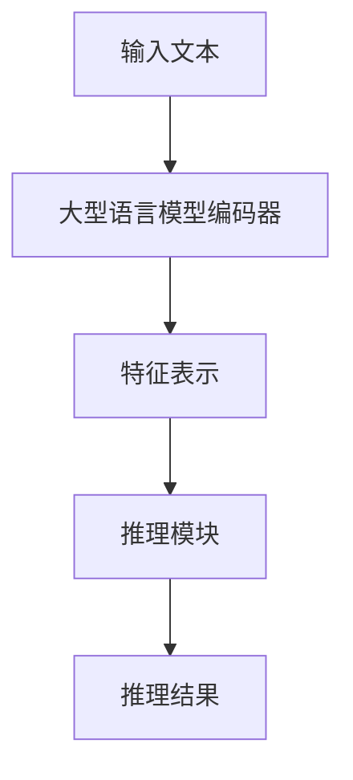

# 大型语言模型在复杂推理任务中的性能优化

> 关键词：大型语言模型、复杂推理任务、性能优化、推理算法、应用场景

> 摘要：本文围绕大型语言模型在复杂推理任务中的性能优化展开深入探讨。首先介绍了研究的背景、目的、预期读者和文档结构，对相关术语进行了清晰定义。接着阐述了大型语言模型和复杂推理任务的核心概念及联系，给出了原理和架构的文本示意图与 Mermaid 流程图。详细讲解了核心算法原理，用 Python 代码进行了具体操作步骤的说明，并给出了数学模型和公式。通过项目实战，展示了代码实际案例及详细解释。分析了大型语言模型在复杂推理任务中的实际应用场景，推荐了学习资源、开发工具框架和相关论文著作。最后总结了未来发展趋势与挑战，解答了常见问题并提供了扩展阅读和参考资料，旨在为提升大型语言模型在复杂推理任务中的性能提供全面且深入的指导。

## 1. 背景介绍 
### 1.1 目的和范围
随着人工智能技术的飞速发展，大型语言模型（LLMs）如 GPT - 3、BERT 等在自然语言处理领域取得了显著成就。然而，在处理复杂推理任务时，这些模型仍面临诸多挑战，如推理精度不足、推理速度慢等问题。本研究的目的在于深入探讨如何优化大型语言模型在复杂推理任务中的性能，以提高其在各种实际应用场景下的表现。研究范围涵盖了从核心概念的理解到具体算法的实现，再到实际项目的应用，全面剖析大型语言模型在复杂推理任务中的性能优化方法。

### 1.2 预期读者
本文预期读者包括人工智能领域的研究人员、程序员、软件架构师以及对大型语言模型和复杂推理任务感兴趣的技术爱好者。对于研究人员，本文可为其深入研究提供理论和实践参考；对于程序员和软件架构师，可作为实际项目开发中的技术指南；对于技术爱好者，能帮助他们更好地理解大型语言模型在复杂推理任务中的工作原理和优化方法。

### 1.3 文档结构概述
本文共分为十个部分。第一部分为背景介绍，阐述研究的目的、范围、预期读者和文档结构；第二部分介绍核心概念与联系，包括大型语言模型和复杂推理任务的原理、架构及它们之间的关系；第三部分详细讲解核心算法原理，并给出具体操作步骤的 Python 代码；第四部分给出数学模型和公式，并进行详细讲解和举例说明；第五部分通过项目实战展示代码实际案例及详细解释；第六部分分析大型语言模型在复杂推理任务中的实际应用场景；第七部分推荐学习资源、开发工具框架和相关论文著作；第八部分总结未来发展趋势与挑战；第九部分解答常见问题；第十部分提供扩展阅读和参考资料。

### 1.4 术语表
#### 1.4.1 核心术语定义
- **大型语言模型（Large Language Model, LLM）**：是一种基于深度学习技术，通过在大规模文本数据上进行训练得到的语言模型。它具有强大的语言理解和生成能力，能够处理各种自然语言处理任务。
- **复杂推理任务**：指需要模型进行多步骤、多维度的逻辑推理才能完成的任务，如数学证明、逻辑谜题求解、复杂文本的语义推理等。
- **性能优化**：通过对模型的结构、算法、训练方法等进行改进，提高模型在特定任务上的表现，如提高推理精度、降低推理时间等。

#### 1.4.2 相关概念解释
- **注意力机制（Attention Mechanism）**：是一种在深度学习中广泛应用的技术，它允许模型在处理序列数据时，有选择地关注输入序列的不同部分，从而更好地捕捉序列中的长距离依赖关系。
- **强化学习（Reinforcement Learning）**：是一种机器学习范式，智能体通过与环境进行交互，根据环境反馈的奖励信号来学习最优的行为策略。

#### 1.4.3 缩略词列表
- **LLM**：Large Language Model（大型语言模型）
- **NLP**：Natural Language Processing（自然语言处理）
- **GPT**：Generative Pretrained Transformer（生成式预训练变换器）
- **BERT**：Bidirectional Encoder Representations from Transformers（基于变换器的双向编码器表示）

## 2. 核心概念与联系 
### 核心概念原理
#### 大型语言模型原理
大型语言模型通常基于深度学习中的神经网络架构，如 Transformer 架构。Transformer 架构由编码器和解码器组成，其中编码器负责对输入的文本进行特征提取和表示，解码器则根据编码器的输出生成目标文本。模型通过在大规模文本数据上进行无监督学习，学习到语言的统计规律和语义信息。在训练过程中，模型的目标是最小化预测输出与真实标签之间的损失函数，如交叉熵损失函数。

#### 复杂推理任务原理
复杂推理任务要求模型能够理解问题的语义，进行逻辑分析和推理，最终得出合理的结论。这需要模型具备良好的语言理解能力、知识表示能力和推理能力。在处理复杂推理任务时，模型通常需要将问题分解为多个子问题，逐步进行推理和求解。

### 架构的文本示意图
```plaintext
输入文本 -> 大型语言模型（编码器） -> 特征表示 -> 推理模块 -> 推理结果
```
在这个架构中，输入文本首先经过大型语言模型的编码器进行特征提取和表示，得到文本的特征向量。然后，这些特征向量被输入到推理模块中，推理模块根据问题的要求进行逻辑推理和计算，最终输出推理结果。

### Mermaid 流程图


## 3. 核心算法原理 & 具体操作步骤 
### 核心算法原理
在优化大型语言模型在复杂推理任务中的性能时，常用的算法之一是基于强化学习的微调算法。该算法的基本思想是在预训练的大型语言模型基础上，通过强化学习的方法对模型进行微调，以提高模型在复杂推理任务上的表现。

具体来说，我们将复杂推理任务的求解过程看作一个序列决策问题，智能体（即大型语言模型）在每个时间步根据当前的状态（输入文本和之前的推理步骤）选择一个动作（生成一个推理步骤），并根据环境反馈的奖励信号来调整自己的行为策略。奖励信号可以根据推理结果的正确性、推理步骤的合理性等因素进行设计。

### 具体操作步骤及 Python 代码
以下是一个简化的基于强化学习的微调算法的 Python 代码示例：

```python
import torch
import torch.nn as nn
import torch.optim as optim
from transformers import GPT2LMHeadModel, GPT2Tokenizer

# 加载预训练的大型语言模型和分词器
model = GPT2LMHeadModel.from_pretrained('gpt2')
tokenizer = GPT2Tokenizer.from_pretrained('gpt2')

# 定义奖励函数
def reward_function(output, target):
    # 这里简单假设奖励为预测结果与目标结果的匹配程度
    if output == target:
        return 1
    else:
        return -1

# 定义优化器
optimizer = optim.Adam(model.parameters(), lr=1e-5)

# 训练循环
num_epochs = 10
for epoch in range(num_epochs):
    # 假设这里有一个复杂推理任务的数据集
    dataset = [("问题描述", "正确答案")]
    for question, answer in dataset:
        # 对输入问题进行分词
        input_ids = tokenizer.encode(question, return_tensors='pt')
        
        # 前向传播
        outputs = model(input_ids)
        logits = outputs.logits
        predicted_token_id = torch.argmax(logits, dim=-1)
        predicted_answer = tokenizer.decode(predicted_token_id[0])
        
        # 计算奖励
        reward = reward_function(predicted_answer, answer)
        
        # 反向传播
        loss = -reward  # 负奖励作为损失
        optimizer.zero_grad()
        loss.backward()
        optimizer.step()
    
    print(f'Epoch {epoch+1}/{num_epochs}, Loss: {loss.item()}')
```

在这个代码示例中，我们首先加载了预训练的 GPT - 2 模型和分词器。然后定义了一个简单的奖励函数，用于评估模型的推理结果。在训练循环中，我们遍历数据集，对每个问题进行前向传播得到预测结果，计算奖励，并根据奖励进行反向传播和参数更新。

## 4. 数学模型和公式 & 详细讲解 & 举例说明 
### 数学模型
在基于强化学习的微调算法中，我们可以使用策略梯度算法来优化大型语言模型的参数。策略梯度算法的核心思想是通过最大化期望奖励来更新模型的策略。

设 $\theta$ 为大型语言模型的参数，$\pi_{\theta}(a|s)$ 为在状态 $s$ 下选择动作 $a$ 的概率，$R$ 为奖励函数。则策略梯度算法的目标是最大化期望奖励：

$$J(\theta) = \mathbb{E}_{\tau \sim \pi_{\theta}}[R(\tau)]$$

其中，$\tau = (s_0, a_0, s_1, a_1, \cdots)$ 表示一个轨迹，即智能体在环境中的一系列状态和动作序列。

### 公式详细讲解
根据策略梯度定理，$J(\theta)$ 关于 $\theta$ 的梯度可以表示为：

$$\nabla_{\theta} J(\theta) = \mathbb{E}_{\tau \sim \pi_{\theta}}\left[\sum_{t=0}^{T} \nabla_{\theta} \log \pi_{\theta}(a_t|s_t) R(\tau)\right]$$

在实际实现中，我们可以通过采样多个轨迹来近似计算这个梯度。具体来说，我们从当前策略 $\pi_{\theta}$ 中采样 $N$ 个轨迹 $\tau_1, \tau_2, \cdots, \tau_N$，然后计算梯度的估计值：

$$\hat{\nabla}_{\theta} J(\theta) = \frac{1}{N} \sum_{i=1}^{N} \sum_{t=0}^{T} \nabla_{\theta} \log \pi_{\theta}(a_{t}^i|s_{t}^i) R(\tau_i)$$

其中，$a_{t}^i$ 和 $s_{t}^i$ 分别表示第 $i$ 个轨迹在时间步 $t$ 的动作和状态。

### 举例说明
假设我们有一个简单的复杂推理任务：判断一个数是否为质数。状态 $s$ 可以表示为输入的数字，动作 $a$ 可以表示为模型的判断结果（是质数或不是质数）。奖励函数 $R$ 可以定义为：如果模型的判断结果正确，则奖励为 1；否则奖励为 - 1。

我们使用策略梯度算法来优化模型的参数。在每个训练步骤中，我们从当前策略中采样一些输入数字，让模型进行判断，根据判断结果计算奖励，然后使用上述公式计算梯度并更新模型的参数。通过不断地训练，模型的判断准确率会逐渐提高。

## 5. 项目实战：代码实际案例和详细解释说明 
### 5.1  开发环境搭建
#### 操作系统
推荐使用 Linux 系统，如 Ubuntu 18.04 或更高版本。Linux 系统在人工智能开发中具有良好的稳定性和兼容性。

#### Python 环境
安装 Python 3.7 或更高版本。可以使用 Anaconda 来管理 Python 环境，具体安装步骤如下：
1. 从 Anaconda 官方网站下载适合你操作系统的 Anaconda 安装包。
2. 运行安装包，按照提示进行安装。
3. 创建一个新的 Python 环境：
```bash
conda create -n rl_llm python=3.8
conda activate rl_llm
```

#### 依赖库安装
在激活的 Python 环境中，安装所需的依赖库：
```bash
pip install torch transformers numpy
```

### 5.2  源代码详细实现和代码解读
```python
import torch
import torch.nn as nn
import torch.optim as optim
from transformers import GPT2LMHeadModel, GPT2Tokenizer
import numpy as np

# 加载预训练的大型语言模型和分词器
model = GPT2LMHeadModel.from_pretrained('gpt2')
tokenizer = GPT2Tokenizer.from_pretrained('gpt2')

# 定义奖励函数
def reward_function(output, target):
    # 这里简单假设奖励为预测结果与目标结果的匹配程度
    if output == target:
        return 1
    else:
        return -1

# 定义优化器
optimizer = optim.Adam(model.parameters(), lr=1e-5)

# 模拟复杂推理任务的数据集
dataset = [
    ("判断 7 是否为质数", "是"),
    ("判断 8 是否为质数", "否")
]

# 训练循环
num_epochs = 10
for epoch in range(num_epochs):
    total_loss = 0
    for question, answer in dataset:
        # 对输入问题进行分词
        input_ids = tokenizer.encode(question, return_tensors='pt')
        
        # 前向传播
        outputs = model(input_ids)
        logits = outputs.logits
        predicted_token_id = torch.argmax(logits, dim=-1)
        predicted_answer = tokenizer.decode(predicted_token_id[0])
        
        # 计算奖励
        reward = reward_function(predicted_answer, answer)
        
        # 反向传播
        loss = -reward  # 负奖励作为损失
        optimizer.zero_grad()
        loss.backward()
        optimizer.step()
        
        total_loss += loss.item()
    
    average_loss = total_loss / len(dataset)
    print(f'Epoch {epoch+1}/{num_epochs}, Average Loss: {average_loss}')
```

### 代码解读与分析
1. **模型和分词器加载**：使用 `transformers` 库加载预训练的 GPT - 2 模型和分词器。
2. **奖励函数**：定义了一个简单的奖励函数，根据模型的预测结果与目标结果的匹配程度来计算奖励。
3. **优化器**：使用 Adam 优化器来更新模型的参数。
4. **数据集**：模拟了一个简单的复杂推理任务的数据集，包含问题和正确答案。
5. **训练循环**：在每个训练步骤中，对输入问题进行分词，进行前向传播得到预测结果，计算奖励，根据奖励进行反向传播和参数更新。最后输出每个 epoch 的平均损失。

通过不断地训练，模型在这个简单的复杂推理任务上的性能会逐渐提高。

## 6. 实际应用场景 
### 数学推理
在数学领域，大型语言模型可以用于解决各种数学问题，如代数方程求解、几何证明等。通过优化模型在复杂推理任务中的性能，可以提高模型在数学推理中的准确性和效率。例如，在解决复杂的微积分问题时，模型可以更好地理解问题的语义，进行合理的推理和计算，得出正确的答案。

### 法律推理
在法律领域，大型语言模型可以用于法律条文的解读、案例分析和法律推理等任务。优化后的模型可以更准确地理解法律条文的含义，分析案件的事实和证据，进行合理的法律推理，为律师和法官提供辅助决策。例如，在处理合同纠纷案件时，模型可以帮助分析合同条款的合法性和有效性，预测案件的判决结果。

### 医疗诊断推理
在医疗领域，大型语言模型可以用于医疗诊断推理。通过对患者的症状、病史和检查结果进行分析，模型可以辅助医生进行疾病的诊断和治疗方案的制定。优化后的模型可以提高诊断的准确性和效率，减少误诊和漏诊的发生。例如，在诊断癌症时，模型可以根据患者的影像学检查结果和病理报告，进行更准确的癌症分期和治疗建议。

## 7. 工具和资源推荐
### 7.1 学习资源推荐
#### 7.1.1 书籍推荐
- 《深度学习》（Deep Learning）：由 Ian Goodfellow、Yoshua Bengio 和 Aaron Courville 所著，是深度学习领域的经典教材，涵盖了深度学习的基本原理、算法和应用。
- 《自然语言处理入门》（Natural Language Processing with Python）：由 Steven Bird、Ewan Klein 和 Edward Loper 所著，介绍了使用 Python 进行自然语言处理的基本方法和技术。
- 《强化学习：原理与Python实现》（Reinforcement Learning: An Introduction）：由 Richard S. Sutton 和 Andrew G. Barto 所著，是强化学习领域的经典教材，详细介绍了强化学习的基本概念、算法和应用。

#### 7.1.2 在线课程
- Coursera 上的“深度学习专项课程”（Deep Learning Specialization）：由吴恩达教授讲授，包括深度学习的基础、卷积神经网络、循环神经网络等内容。
- edX 上的“自然语言处理”（Natural Language Processing）：由哈佛大学和麻省理工学院联合开设，介绍了自然语言处理的基本概念、算法和应用。
- Udemy 上的“强化学习实战”（Reinforcement Learning in Action）：通过实际项目介绍强化学习的应用和实现。

#### 7.1.3 技术博客和网站
- arXiv：一个预印本论文库，提供了大量关于人工智能、机器学习和自然语言处理的最新研究成果。
- Medium：一个技术博客平台，有许多人工智能领域的专家分享他们的研究成果和经验。
- Towards Data Science：一个专注于数据科学和人工智能的技术博客，提供了许多实用的教程和案例分析。

### 7.2 开发工具框架推荐
#### 7.2.1 IDE和编辑器
- PyCharm：一款专业的 Python 集成开发环境，提供了丰富的代码编辑、调试和项目管理功能。
- Jupyter Notebook：一个交互式的开发环境，适合进行数据分析、模型训练和实验验证。
- Visual Studio Code：一款轻量级的代码编辑器，支持多种编程语言和插件扩展。

#### 7.2.2 调试和性能分析工具
- TensorBoard：一个用于可视化深度学习模型训练过程的工具，可以查看模型的损失函数、准确率等指标的变化情况。
- PyTorch Profiler：PyTorch 提供的性能分析工具，可以帮助开发者找出模型训练过程中的性能瓶颈。
- cProfile：Python 内置的性能分析工具，可以分析代码的运行时间和函数调用次数。

#### 7.2.3 相关框架和库
- PyTorch：一个开源的深度学习框架，提供了丰富的神经网络层和优化算法，支持 GPU 加速。
- TensorFlow：另一个广泛使用的深度学习框架，具有强大的分布式训练和模型部署能力。
- Transformers：Hugging Face 开发的一个自然语言处理库，提供了大量预训练的语言模型和工具，方便开发者进行自然语言处理任务的开发。

### 7.3 相关论文著作推荐
#### 7.3.1 经典论文
- “Attention Is All You Need”：提出了 Transformer 架构，是现代大型语言模型的基础。
- “BERT: Pre-training of Deep Bidirectional Transformers for Language Understanding”：介绍了 BERT 模型，开创了预训练语言模型的先河。
- “Proximal Policy Optimization Algorithms”：提出了近端策略优化算法（PPO），是一种高效的强化学习算法。

#### 7.3.2 最新研究成果
- 关注 arXiv 上关于大型语言模型和复杂推理任务的最新论文，了解该领域的前沿研究动态。
- 参加国际人工智能会议，如 NeurIPS、ICML、ACL 等，获取最新的研究成果和技术趋势。

#### 7.3.3 应用案例分析
- 一些科技公司的博客和研究报告，如 OpenAI、Google AI 等，会分享他们在大型语言模型应用方面的案例和经验。
- 相关的学术期刊和会议论文集，如 Journal of Artificial Intelligence Research（JAIR）、ACM Transactions on Intelligent Systems and Technology（TIST）等，会发表一些大型语言模型在实际应用中的案例分析。

## 8. 总结：未来发展趋势与挑战
### 未来发展趋势
#### 模型架构创新
未来，大型语言模型的架构可能会不断创新，以提高模型的性能和效率。例如，可能会出现更高效的注意力机制、更灵活的网络结构等。

#### 多模态融合
将语言信息与图像、音频等其他模态的信息进行融合，使模型能够处理更复杂的多模态推理任务。例如，在医疗领域，结合医学影像和病历文本进行疾病诊断。

#### 个性化推理
根据用户的个性化需求和偏好，为用户提供更精准的推理结果。例如，在智能客服中，根据用户的历史对话记录和偏好，提供个性化的解决方案。

### 挑战
#### 数据隐私和安全
大型语言模型需要大量的数据进行训练，这些数据可能包含用户的隐私信息。如何在保证模型性能的同时，保护用户的数据隐私和安全是一个重要的挑战。

#### 计算资源需求
训练和部署大型语言模型需要大量的计算资源，如 GPU、TPU 等。如何降低模型的计算成本，提高资源利用效率是一个亟待解决的问题。

#### 可解释性和可靠性
大型语言模型通常是一个黑盒模型，其推理过程和决策依据难以解释。在一些关键领域，如医疗、法律等，模型的可解释性和可靠性至关重要。如何提高模型的可解释性和可靠性是一个挑战。

## 9. 附录：常见问题与解答
### 问题 1：如何选择合适的奖励函数？
选择合适的奖励函数需要根据具体的复杂推理任务来确定。一般来说，奖励函数应该能够反映模型的推理结果的质量和合理性。例如，在数学推理任务中，可以根据模型的答案的正确性来定义奖励；在法律推理任务中，可以根据推理结果的合法性和合理性来定义奖励。

### 问题 2：如何处理大型语言模型的过拟合问题？
处理大型语言模型的过拟合问题可以采用以下方法：
- 增加训练数据：收集更多的训练数据，使模型能够学习到更广泛的语言模式和推理规则。
- 正则化：使用 L1 或 L2 正则化来约束模型的参数，防止模型过拟合。
- 早停：在模型训练过程中，监控验证集的性能，当验证集的性能不再提升时，停止训练。

### 问题 3：如何评估大型语言模型在复杂推理任务中的性能？
可以使用以下指标来评估大型语言模型在复杂推理任务中的性能：
- 准确率：模型的推理结果与真实答案的匹配程度。
- 召回率：模型能够正确推理出的结果占所有真实结果的比例。
- F1 值：综合考虑准确率和召回率的指标。
- 推理时间：模型完成一次推理任务所需的时间。

## 10. 扩展阅读 & 参考资料
### 扩展阅读
- 《人工智能：一种现代的方法》（Artificial Intelligence: A Modern Approach）：全面介绍了人工智能的基本概念、算法和应用。
- 《深度学习实战》（Deep Learning in Practice）：通过实际项目介绍深度学习的应用和实现。
- 《自然语言处理实战》（Natural Language Processing in Action）：介绍了自然语言处理的实际应用和技术实现。

### 参考资料
- Hugging Face 官方文档：https://huggingface.co/docs
- PyTorch 官方文档：https://pytorch.org/docs/stable/index.html
- TensorFlow 官方文档：https://www.tensorflow.org/api_docs

作者：AI天才研究院/AI Genius Institute & 禅与计算机程序设计艺术 /Zen And The Art of Computer Programming