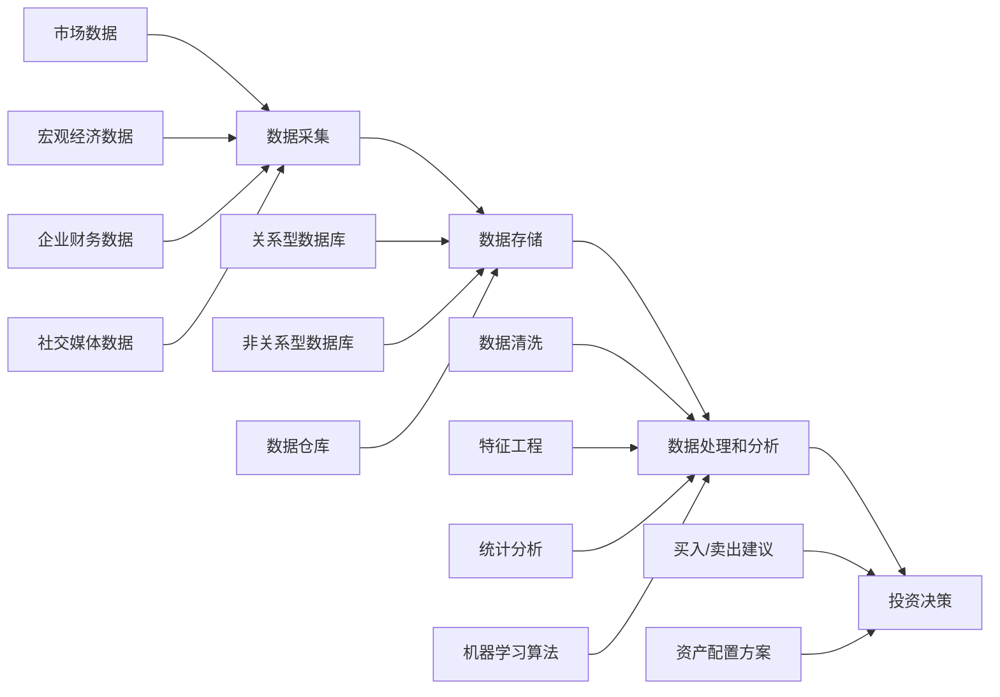

# 大数据分析在投资研究中的应用

> 关键词：大数据分析、投资研究、数据挖掘、机器学习、金融市场、风险评估、投资决策

> 摘要：本文深入探讨了大数据分析在投资研究领域的应用。首先介绍了相关背景，包括目的范围、预期读者等内容。接着阐述了大数据分析与投资研究的核心概念及联系，通过文本示意图和Mermaid流程图进行清晰展示。详细讲解了核心算法原理及操作步骤，并给出Python源代码示例。同时介绍了相关数学模型和公式，辅以举例说明。通过项目实战，展示了代码实际案例及详细解释。分析了大数据分析在投资研究中的实际应用场景，推荐了学习资源、开发工具框架以及相关论文著作。最后总结了未来发展趋势与挑战，还给出了常见问题解答和扩展阅读参考资料，旨在为投资者和相关从业者提供全面的大数据分析在投资研究方面的知识和应用指导。

## 1. 背景介绍 
### 1.1 目的和范围
在当今数字化时代，金融市场产生的数据量呈爆炸式增长。这些数据涵盖了股票交易记录、宏观经济指标、社交媒体情绪、企业财务报表等多个方面。大数据分析技术的出现为投资研究带来了新的机遇和挑战。本文的目的在于深入探讨大数据分析在投资研究中的应用，包括如何利用大数据挖掘有价值的信息、如何构建有效的投资模型以及如何评估投资风险等。范围涵盖了股票、债券、基金等多种投资领域，同时涉及到数据采集、清洗、分析、建模等多个环节。

### 1.2 预期读者
本文预期读者主要包括金融投资领域的从业者，如基金经理、投资分析师、交易员等，他们希望借助大数据分析技术提升投资研究的效率和准确性。同时，也适合对金融科技和大数据分析感兴趣的学生和研究人员阅读，帮助他们了解大数据在投资领域的实际应用。此外，对于个人投资者而言，本文也能提供一些利用大数据进行投资决策的思路和方法。

### 1.3 文档结构概述
本文将按照以下结构进行阐述：首先介绍大数据分析和投资研究的核心概念及它们之间的联系，通过文本示意图和流程图直观展示。接着详细讲解核心算法原理和具体操作步骤，结合Python代码进行说明。然后介绍相关的数学模型和公式，并举例说明其应用。通过项目实战部分，展示大数据分析在投资研究中的具体实现过程，包括开发环境搭建、源代码实现和代码解读。分析大数据分析在不同投资场景中的实际应用。推荐相关的学习资源、开发工具框架和论文著作。最后总结大数据分析在投资研究中的未来发展趋势与挑战，并提供常见问题解答和扩展阅读参考资料。

### 1.4 术语表
#### 1.4.1 核心术语定义
- **大数据分析**：指对海量、多样化的数据进行采集、存储、处理和分析，以发现有价值的信息和模式的过程。
- **投资研究**：通过对各种金融数据和市场信息的分析，评估投资机会和风险，为投资决策提供依据的过程。
- **数据挖掘**：从大量数据中发现潜在模式、关联和趋势的技术。
- **机器学习**：让计算机通过数据学习模式和规律，从而进行预测和决策的技术。
- **风险评估**：对投资可能面临的风险进行量化和分析的过程。

#### 1.4.2 相关概念解释
- **结构化数据**：具有固定格式和结构的数据，如数据库中的表格数据。
- **非结构化数据**：没有固定格式和结构的数据，如文本、图像、视频等。
- **数据清洗**：去除数据中的噪声、缺失值和异常值，提高数据质量的过程。
- **特征工程**：从原始数据中提取和选择有价值的特征，以提高模型性能的过程。

#### 1.4.3 缩略词列表
- **API**：Application Programming Interface，应用程序编程接口
- **ETL**：Extract, Transform, Load，数据抽取、转换和加载
- **ML**：Machine Learning，机器学习
- **AI**：Artificial Intelligence，人工智能
- **NLP**：Natural Language Processing，自然语言处理

## 2. 核心概念与联系 
### 核心概念原理
大数据分析在投资研究中的应用基于以下几个核心概念：

#### 数据采集
投资研究需要收集各种类型的数据，包括市场数据（如股票价格、成交量）、宏观经济数据（如GDP、通货膨胀率）、企业财务数据（如营收、利润）以及社交媒体数据（如投资者情绪）等。数据采集可以通过API、网络爬虫等方式进行。

#### 数据存储
采集到的数据需要进行有效的存储，以便后续的处理和分析。常见的数据存储方式包括关系型数据库（如MySQL、Oracle）、非关系型数据库（如MongoDB、Redis）和数据仓库（如Hadoop、Spark）等。

#### 数据处理和分析
数据处理包括数据清洗、转换和集成等步骤，以提高数据质量。数据分析则采用各种统计方法和机器学习算法，挖掘数据中的模式和规律。例如，可以使用回归分析预测股票价格，使用聚类分析对投资者进行分类。

#### 投资决策
通过对数据分析结果的评估，投资者可以做出更明智的投资决策。例如，根据股票的估值和风险评估，决定是否买入、持有或卖出股票。

### 架构的文本示意图
```plaintext
+-----------------+
| 数据采集        |
|  - 市场数据     |
|  - 宏观经济数据 |
|  - 企业财务数据 |
|  - 社交媒体数据 |
+-----------------+
         |
         v
+-----------------+
| 数据存储        |
|  - 关系型数据库 |
|  - 非关系型数据库 |
|  - 数据仓库     |
+-----------------+
         |
         v
+-----------------+
| 数据处理和分析  |
|  - 数据清洗     |
|  - 特征工程     |
|  - 统计分析     |
|  - 机器学习算法 |
+-----------------+
         |
         v
+-----------------+
| 投资决策        |
|  - 买入/卖出建议 |
|  - 资产配置方案 |
+-----------------+
```

### Mermaid 流程图


## 3. 核心算法原理 & 具体操作步骤 
### 核心算法原理
在大数据分析用于投资研究中，常用的算法包括线性回归、逻辑回归、决策树、随机森林和支持向量机等。下面以线性回归为例进行详细讲解。

线性回归是一种用于建立自变量和因变量之间线性关系的统计方法。假设我们有一组自变量 $X = [x_1, x_2,..., x_n]$ 和一个因变量 $y$，线性回归模型可以表示为：

$$y = \beta_0 + \beta_1x_1 + \beta_2x_2 +... + \beta_nx_n + \epsilon$$

其中，$\beta_0$ 是截距，$\beta_1, \beta_2,..., \beta_n$ 是回归系数，$\epsilon$ 是误差项。

线性回归的目标是找到一组最优的回归系数 $\beta = [\beta_0, \beta_1,..., \beta_n]$，使得预测值 $\hat{y}$ 与实际值 $y$ 之间的误差最小。常用的误差度量方法是均方误差（MSE）：

$$MSE = \frac{1}{m}\sum_{i=1}^{m}(y_i - \hat{y}_i)^2$$

其中，$m$ 是样本数量，$y_i$ 是第 $i$ 个样本的实际值，$\hat{y}_i$ 是第 $i$ 个样本的预测值。

### 具体操作步骤
#### 步骤 1：数据准备
首先，我们需要收集和整理用于线性回归分析的数据。假设我们要预测股票价格，我们可以选择一些可能影响股票价格的因素作为自变量，如公司的营收、利润、市盈率等，股票价格作为因变量。

#### 步骤 2：数据预处理
对收集到的数据进行清洗和预处理，包括去除缺失值、异常值，对数据进行标准化处理等。

#### 步骤 3：模型训练
使用训练数据来拟合线性回归模型，找到最优的回归系数。

#### 步骤 4：模型评估
使用测试数据来评估模型的性能，常用的评估指标包括均方误差（MSE）、均方根误差（RMSE）和决定系数（$R^2$）等。

#### 步骤 5：预测
使用训练好的模型对新的数据进行预测。

### Python 源代码示例
```python
import numpy as np
from sklearn.linear_model import LinearRegression
from sklearn.model_selection import train_test_split
from sklearn.metrics import mean_squared_error, r2_score

# 生成示例数据
np.random.seed(0)
X = np.random.rand(100, 3)  # 自变量
y = 2 * X[:, 0] + 3 * X[:, 1] + 4 * X[:, 2] + np.random.randn(100)  # 因变量

# 划分训练集和测试集
X_train, X_test, y_train, y_test = train_test_split(X, y, test_size=0.2, random_state=42)

# 创建线性回归模型
model = LinearRegression()

# 模型训练
model.fit(X_train, y_train)

# 模型预测
y_pred = model.predict(X_test)

# 模型评估
mse = mean_squared_error(y_test, y_pred)
r2 = r2_score(y_test, y_pred)

print(f"均方误差 (MSE): {mse}")
print(f"决定系数 (R^2): {r2}")
```

## 4. 数学模型和公式 & 详细讲解 & 举例说明 
### 线性回归模型
#### 数学公式
如前面所述，线性回归模型的一般形式为：

$$y = \beta_0 + \beta_1x_1 + \beta_2x_2 +... + \beta_nx_n + \epsilon$$

其中，$y$ 是因变量，$x_1, x_2,..., x_n$ 是自变量，$\beta_0, \beta_1,..., \beta_n$ 是回归系数，$\epsilon$ 是误差项。

#### 详细讲解
回归系数 $\beta_i$ 表示自变量 $x_i$ 对因变量 $y$ 的影响程度。截距 $\beta_0$ 表示当所有自变量都为 0 时，因变量的取值。误差项 $\epsilon$ 表示模型无法解释的随机误差。

线性回归的目标是最小化均方误差（MSE），可以通过最小二乘法来求解回归系数。最小二乘法的原理是找到一组回归系数，使得所有样本点到回归直线的垂直距离的平方和最小。

#### 举例说明
假设我们要预测某只股票的价格 $y$，选择公司的营收 $x_1$ 和利润 $x_2$ 作为自变量。我们收集了 100 个样本数据，使用线性回归模型进行拟合。得到的回归方程为：

$$y = 10 + 0.5x_1 + 2x_2$$

这意味着当公司的营收增加 1 个单位时，股票价格预计增加 0.5 个单位；当公司的利润增加 1 个单位时，股票价格预计增加 2 个单位。截距 10 表示当公司的营收和利润都为 0 时，股票价格的预测值。

### 逻辑回归模型
#### 数学公式
逻辑回归是一种用于分类问题的模型，它的输出是一个概率值。逻辑回归模型的数学公式为：

$$P(y = 1|X) = \frac{1}{1 + e^{-(\beta_0 + \beta_1x_1 + \beta_2x_2 +... + \beta_nx_n)}}$$

其中，$P(y = 1|X)$ 表示在自变量 $X = [x_1, x_2,..., x_n]$ 的条件下，因变量 $y$ 取值为 1 的概率。

#### 详细讲解
逻辑回归模型通过将线性回归的输出经过逻辑函数（也称为 sigmoid 函数）转换为概率值。逻辑函数的取值范围是 $(0, 1)$，可以将其解释为概率。当 $P(y = 1|X) > 0.5$ 时，我们预测 $y = 1$；当 $P(y = 1|X) < 0.5$ 时，我们预测 $y = 0$。

逻辑回归的目标是最大化似然函数，即找到一组回归系数，使得模型对训练数据的预测概率最大。

#### 举例说明
假设我们要预测某只股票在未来一个月内是否会上涨（$y = 1$ 表示上涨，$y = 0$ 表示下跌），选择公司的市盈率 $x_1$ 和市净率 $x_2$ 作为自变量。使用逻辑回归模型进行训练后，得到的回归方程为：

$$P(y = 1|X) = \frac{1}{1 + e^{-(2 - 0.1x_1 + 0.2x_2)}}$$

如果某只股票的市盈率为 20，市净率为 3，代入上述方程可以得到：

$$P(y = 1|X) = \frac{1}{1 + e^{-(2 - 0.1\times20 + 0.2\times3)}} \approx 0.73$$

由于 $P(y = 1|X) > 0.5$，我们预测这只股票在未来一个月内会上涨。

## 5. 项目实战：代码实际案例和详细解释说明 
### 5.1  开发环境搭建
#### 操作系统
可以选择 Windows、Linux 或 macOS 操作系统。

#### Python 环境
建议使用 Python 3.7 及以上版本。可以通过 Anaconda 或 Miniconda 来管理 Python 环境。

#### 安装必要的库
在命令行中使用以下命令安装必要的库：
```sh
pip install numpy pandas scikit-learn matplotlib seaborn
```

### 5.2  源代码详细实现和代码解读
#### 项目背景
假设我们要使用大数据分析来预测股票的涨跌情况。我们选择了某只股票的历史价格数据、成交量数据以及一些宏观经济数据作为自变量，股票的涨跌情况（上涨为 1，下跌为 0）作为因变量。

#### 代码实现
```python
import numpy as np
import pandas as pd
from sklearn.model_selection import train_test_split
from sklearn.linear_model import LogisticRegression
from sklearn.metrics import accuracy_score, confusion_matrix
import matplotlib.pyplot as plt
import seaborn as sns

# 读取数据
data = pd.read_csv('stock_data.csv')

# 数据预处理
X = data.drop('label', axis=1)  # 自变量
y = data['label']  # 因变量

# 划分训练集和测试集
X_train, X_test, y_train, y_test = train_test_split(X, y, test_size=0.2, random_state=42)

# 创建逻辑回归模型
model = LogisticRegression()

# 模型训练
model.fit(X_train, y_train)

# 模型预测
y_pred = model.predict(X_test)

# 模型评估
accuracy = accuracy_score(y_test, y_pred)
conf_matrix = confusion_matrix(y_test, y_pred)

print(f"模型准确率: {accuracy}")
print("混淆矩阵:")
print(conf_matrix)

# 可视化混淆矩阵
plt.figure(figsize=(8, 6))
sns.heatmap(conf_matrix, annot=True, fmt='d', cmap='Blues')
plt.xlabel('预测值')
plt.ylabel('实际值')
plt.title('混淆矩阵')
plt.show()
```

#### 代码解读
1. **数据读取**：使用 `pandas` 库的 `read_csv` 函数读取存储在 `stock_data.csv` 文件中的数据。
2. **数据预处理**：将数据分为自变量 `X` 和因变量 `y`。
3. **划分训练集和测试集**：使用 `train_test_split` 函数将数据划分为训练集和测试集，测试集占比为 20%。
4. **创建模型**：创建一个逻辑回归模型。
5. **模型训练**：使用训练集数据对模型进行训练。
6. **模型预测**：使用训练好的模型对测试集数据进行预测。
7. **模型评估**：使用 `accuracy_score` 函数计算模型的准确率，使用 `confusion_matrix` 函数计算混淆矩阵。
8. **可视化**：使用 `seaborn` 库的 `heatmap` 函数可视化混淆矩阵。

### 5.3  代码解读与分析
#### 准确率分析
模型的准确率是指模型预测正确的样本数占总样本数的比例。在上述代码中，准确率越高，说明模型的预测性能越好。

#### 混淆矩阵分析
混淆矩阵是一个 $2\times2$ 的矩阵，用于展示模型的预测结果与实际结果之间的关系。矩阵的左上角表示真正例（实际为正例，预测也为正例）的数量，右上角表示假正例（实际为负例，预测为正例）的数量，左下角表示假反例（实际为正例，预测为负例）的数量，右下角表示真反例（实际为负例，预测也为负例）的数量。

通过分析混淆矩阵，我们可以了解模型在不同类别上的预测性能，例如模型是否容易将正例误判为负例，或者将负例误判为正例。

## 6. 实际应用场景 
### 股票投资
#### 股票价格预测
通过收集和分析股票的历史价格数据、公司财务数据、宏观经济数据等，使用机器学习算法建立股票价格预测模型。投资者可以根据预测结果做出买入、持有或卖出的决策。

#### 股票风险评估
分析股票的波动率、贝塔系数等指标，评估股票的风险水平。同时，结合宏观经济环境和行业趋势，预测股票未来可能面临的风险。

#### 选股策略
利用大数据分析筛选出具有潜力的股票。例如，通过分析公司的财务报表、市场份额、创新能力等指标，选择具有高增长潜力的股票。

### 基金投资
#### 基金业绩评估
通过分析基金的历史收益率、夏普比率、信息比率等指标，评估基金的业绩表现。同时，对比不同基金的业绩，选择表现优秀的基金进行投资。

#### 基金风格分析
分析基金的持仓结构、投资策略等，确定基金的风格，如价值型、成长型、平衡型等。投资者可以根据自己的风险偏好和投资目标选择适合的基金。

#### 基金组合优化
利用大数据分析和优化算法，构建最优的基金组合。通过分散投资降低风险，同时提高组合的收益率。

### 债券投资
#### 债券信用风险评估
分析债券发行人的财务状况、信用评级等信息，评估债券的信用风险。投资者可以根据信用风险评估结果选择信用等级较高的债券进行投资。

#### 债券收益率预测
通过分析宏观经济数据、利率走势等因素，预测债券的收益率。投资者可以根据收益率预测结果选择合适的债券投资时机。

### 宏观经济分析
#### 经济指标预测
收集和分析各种宏观经济指标，如 GDP、通货膨胀率、失业率等，使用时间序列分析等方法预测经济指标的未来走势。投资者可以根据经济指标预测结果调整投资策略。

#### 政策影响分析
分析政府的财政政策、货币政策等对金融市场的影响。投资者可以根据政策变化及时调整投资组合，降低风险，提高收益。

## 7. 工具和资源推荐
### 7.1 学习资源推荐
#### 7.1.1 书籍推荐
- 《Python 数据分析实战》：介绍了使用 Python 进行数据分析的基本方法和技巧，包括数据采集、清洗、分析和可视化等方面。
- 《机器学习实战》：通过实际案例介绍了机器学习的基本算法和应用，适合初学者入门。
- 《金融数据分析与挖掘》：结合金融领域的实际问题，介绍了数据分析和挖掘的方法和技术。

#### 7.1.2 在线课程
- Coursera 上的“机器学习”课程：由斯坦福大学教授 Andrew Ng 讲授，是机器学习领域的经典课程。
- edX 上的“数据科学微硕士”课程：提供了全面的数据科学知识和技能培训，包括数据分析、机器学习、深度学习等方面。
- 网易云课堂上的“Python 金融数据分析实战”课程：结合金融领域的实际案例，介绍了使用 Python 进行金融数据分析的方法和技巧。

#### 7.1.3 技术博客和网站
- Towards Data Science：一个专注于数据科学和机器学习的技术博客，提供了大量的技术文章和案例分析。
- Kaggle：一个数据科学竞赛平台，提供了丰富的数据集和竞赛项目，适合学习者进行实践和交流。
- 金融界网站：提供了丰富的金融数据和市场信息，适合投资者进行研究和分析。

### 7.2 开发工具框架推荐
#### 7.2.1 IDE和编辑器
- PyCharm：一款专业的 Python 集成开发环境，提供了丰富的代码编辑、调试和部署功能。
- Jupyter Notebook：一个交互式的编程环境，适合进行数据探索和分析。
- Visual Studio Code：一款轻量级的代码编辑器，支持多种编程语言和插件扩展。

#### 7.2.2 调试和性能分析工具
- pdb：Python 自带的调试工具，可以帮助开发者定位和解决代码中的问题。
- cProfile：Python 自带的性能分析工具，可以分析代码的运行时间和内存使用情况。
- TensorBoard：一个用于可视化深度学习模型训练过程的工具，可以帮助开发者监控模型的性能和调试模型。

#### 7.2.3 相关框架和库
- NumPy：一个用于科学计算的 Python 库，提供了高效的数组操作和数学函数。
- Pandas：一个用于数据处理和分析的 Python 库，提供了数据结构和数据操作工具。
- Scikit-learn：一个用于机器学习的 Python 库，提供了丰富的机器学习算法和工具。
- TensorFlow：一个开源的深度学习框架，提供了高效的模型训练和部署功能。

### 7.3 相关论文著作推荐
#### 7.3.1 经典论文
- Fama, E. F., & French, K. R. (1992). The cross-section of expected stock returns. The Journal of Finance, 47(2), 427-465. 提出了著名的 Fama-French 三因子模型，用于解释股票收益率的差异。
- Sharpe, W. F. (1964). Capital asset prices: A theory of market equilibrium under conditions of risk. The Journal of Finance, 19(3), 425-442. 提出了资本资产定价模型（CAPM），用于计算资产的预期收益率。

#### 7.3.2 最新研究成果
- Gu, S., Kelly, B., & Xiu, D. (2020). Empirical asset pricing via machine learning. Review of Financial Studies, 33(5), 2223-2273. 探讨了机器学习在实证资产定价中的应用。
- Lopez-Lira, G., & Tang, Y. (2023). Retail investor sentiment and return predictability. The Review of Financial Studies, 36(6), 2259-2299. 研究了零售投资者情绪对股票收益率的预测能力。

#### 7.3.3 应用案例分析
- 《大数据金融：创新、应用与监管》：介绍了大数据在金融领域的应用案例，包括风险管理、信贷评估、投资决策等方面。
- 《金融科技：发展趋势与监管》：分析了金融科技的发展趋势和应用案例，探讨了监管政策和挑战。

## 8. 总结：未来发展趋势与挑战
### 未来发展趋势
#### 融合多种数据源
未来，大数据分析在投资研究中将融合更多类型的数据源，如卫星图像、物联网数据、区块链数据等。这些数据源将提供更全面、更实时的信息，帮助投资者做出更准确的决策。

#### 人工智能和机器学习的深入应用
人工智能和机器学习技术将在投资研究中得到更深入的应用。例如，深度学习算法可以处理更复杂的数据和模式，强化学习可以优化投资策略。同时，人工智能将与量化投资相结合，实现自动化交易和智能投资决策。

#### 实时数据分析和预测
随着数据处理技术的不断发展，实时数据分析和预测将成为投资研究的重要趋势。投资者可以实时获取市场信息和分析结果，及时调整投资策略，应对市场变化。

#### 个性化投资服务
大数据分析将使投资服务更加个性化。根据投资者的风险偏好、投资目标和财务状况，为投资者提供定制化的投资建议和资产配置方案。

### 挑战
#### 数据质量和安全
大数据分析依赖于大量的数据，但数据质量和安全是一个重要的挑战。数据可能存在噪声、缺失值和错误，需要进行有效的清洗和预处理。同时，数据安全问题也需要得到重视，防止数据泄露和滥用。

#### 算法复杂度和可解释性
人工智能和机器学习算法往往具有较高的复杂度，难以理解和解释。在投资研究中，投资者需要了解算法的原理和决策过程，以便做出合理的投资决策。因此，提高算法的可解释性是一个重要的挑战。

#### 法律法规和监管
大数据分析在投资研究中的应用涉及到法律法规和监管问题。例如，数据的收集、使用和共享需要遵守相关的法律法规，算法的设计和应用需要符合监管要求。投资者和金融机构需要关注法律法规的变化，确保合规运营。

#### 人才短缺
大数据分析和人工智能领域的人才短缺是一个全球性的问题。在投资研究领域，需要既懂金融又懂技术的复合型人才。培养和吸引这类人才是金融机构面临的一个挑战。

## 9. 附录：常见问题与解答
### 问题 1：大数据分析在投资研究中的应用是否会取代人类分析师？
解答：大数据分析在投资研究中可以提供更全面、更准确的信息和分析结果，但不会完全取代人类分析师。人类分析师具有丰富的经验、判断力和创造力，可以对大数据分析的结果进行解读和评估，做出更合理的投资决策。大数据分析和人类分析师可以相互补充，共同提高投资研究的效率和准确性。

### 问题 2：如何选择适合投资研究的大数据分析算法？
解答：选择适合投资研究的大数据分析算法需要考虑多个因素，如数据类型、问题类型、模型复杂度和可解释性等。例如，如果是预测股票价格，可以选择线性回归、时间序列分析等算法；如果是分类问题，如预测股票的涨跌情况，可以选择逻辑回归、决策树、随机森林等算法。同时，需要根据数据的特点和问题的需求进行模型选择和调优。

### 问题 3：大数据分析在投资研究中面临的最大挑战是什么？
解答：大数据分析在投资研究中面临的最大挑战包括数据质量和安全、算法复杂度和可解释性、法律法规和监管以及人才短缺等方面。数据质量和安全问题可能影响分析结果的准确性和可靠性；算法复杂度和可解释性问题可能导致投资者难以理解和信任分析结果；法律法规和监管问题需要投资者和金融机构遵守相关规定，确保合规运营；人才短缺问题则限制了大数据分析在投资研究中的应用和发展。

### 问题 4：如何评估大数据分析模型在投资研究中的性能？
解答：评估大数据分析模型在投资研究中的性能可以使用多种指标，如准确率、召回率、F1 值、均方误差、均方根误差、决定系数等。对于分类问题，可以使用准确率、召回率和 F1 值来评估模型的分类性能；对于回归问题，可以使用均方误差、均方根误差和决定系数来评估模型的预测性能。同时，还可以使用交叉验证、留一法等方法来评估模型的稳定性和泛化能力。

## 10. 扩展阅读 & 参考资料
### 扩展阅读
- 《数据挖掘：概念与技术》：深入介绍了数据挖掘的基本概念、算法和应用，适合进一步学习大数据分析技术。
- 《人工智能：现代方法》：全面介绍了人工智能的基本理论、算法和应用，适合了解人工智能在投资研究中的应用原理。
- 《智能金融：重塑金融行业的未来》：探讨了智能金融的发展趋势和应用案例，包括大数据分析、人工智能、区块链等技术在金融领域的应用。

### 参考资料
- Fama, E. F., & French, K. R. (1992). The cross-section of expected stock returns. The Journal of Finance, 47(2), 427-465.
- Sharpe, W. F. (1964). Capital asset prices: A theory of market equilibrium under conditions of risk. The Journal of Finance, 19(3), 425-442.
- Gu, S., Kelly, B., & Xiu, D. (2020). Empirical asset pricing via machine learning. Review of Financial Studies, 33(5), 2223-2273.
- Lopez-Lira, G., & Tang, Y. (2023). Retail investor sentiment and return predictability. The Review of Financial Studies, 36(6), 2259-2299.

作者：AI天才研究院/AI Genius Institute & 禅与计算机程序设计艺术 /Zen And The Art of Computer Programming