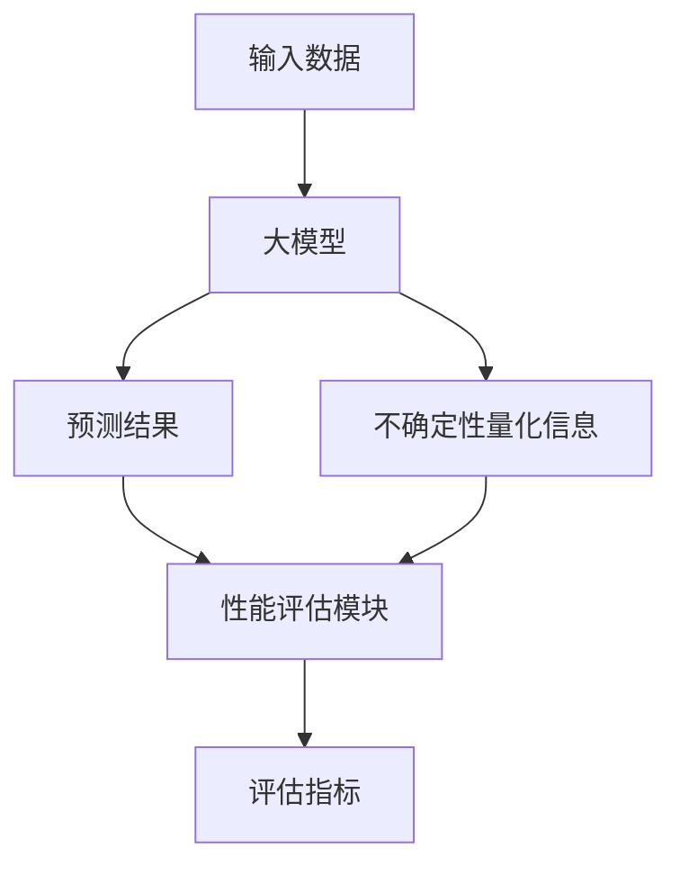

# 大模型在不确定性量化推理任务中的性能评估

> 关键词：大模型、不确定性量化推理、性能评估、评估指标、推理任务

> 摘要：本文聚焦于大模型在不确定性量化推理任务中的性能评估。随着大模型在诸多领域的广泛应用，其在不确定性量化推理任务中的表现评估变得至关重要。文章首先介绍了相关背景，包括目的范围、预期读者等内容；接着阐述了核心概念与联系，通过文本示意图和 Mermaid 流程图进行清晰展示；详细讲解了核心算法原理并给出 Python 源代码示例；介绍了相关数学模型和公式并举例说明；通过项目实战展示了代码实现与解读；探讨了实际应用场景；推荐了学习资源、开发工具框架以及相关论文著作；最后总结了未来发展趋势与挑战，还提供了常见问题解答和扩展阅读参考资料，旨在为深入理解和评估大模型在不确定性量化推理任务中的性能提供全面的技术指导。

## 1. 背景介绍 
### 1.1 目的和范围
在当今的人工智能领域，大模型如 GPT 系列、BERT 等取得了显著的进展，在自然语言处理、计算机视觉等众多任务中展现出强大的能力。然而，在许多实际应用场景中，数据和问题往往存在不确定性，例如医疗诊断中的病情判断、金融市场的风险预测等。不确定性量化推理任务旨在对这种不确定性进行合理的量化和推理，以便更好地支持决策。本文章的目的在于系统地探讨如何对大模型在不确定性量化推理任务中的性能进行评估，范围涵盖了常见的评估指标、评估方法以及相关的实际应用场景等方面。

### 1.2 预期读者
本文预期读者包括人工智能领域的研究人员、开发者、数据科学家、机器学习工程师等对大模型和不确定性量化推理任务感兴趣的专业人士，也适合相关专业的学生作为学习参考资料。

### 1.3 文档结构概述
本文将按照以下结构展开：首先介绍核心概念与联系，让读者对大模型、不确定性量化推理等关键概念有清晰的认识；接着讲解核心算法原理并给出具体操作步骤，通过 Python 代码详细阐述；然后介绍相关的数学模型和公式，并进行详细讲解和举例说明；之后通过项目实战展示代码的实际案例和详细解释；探讨实际应用场景；推荐相关的工具和资源；总结未来发展趋势与挑战；提供常见问题与解答；最后给出扩展阅读和参考资料。

### 1.4 术语表
#### 1.4.1 核心术语定义
- **大模型**：通常指具有大量参数和强大计算能力的人工智能模型，如基于 Transformer 架构的语言模型，这些模型在大规模数据集上进行训练，能够学习到丰富的语言模式和知识。
- **不确定性量化推理**：对数据或问题中存在的不确定性进行量化表示，并基于这些量化结果进行推理和决策的过程。
- **性能评估**：通过一系列的指标和方法，对模型在特定任务中的表现进行评价和分析。

#### 1.4.2 相关概念解释
- **模型校准**：确保模型预测的不确定性与实际的不确定性相匹配的过程。一个校准良好的模型，其预测的置信度应该与实际的准确率相符。
- **置信区间**：在统计学中，置信区间是一个区间估计，它给出了一个包含未知参数的可能取值范围，并且具有一定的置信水平。

#### 1.4.3 缩略词列表
- **NLL**：Negative Log Likelihood（负对数似然）
- **ECE**：Expected Calibration Error（预期校准误差）
- **MSE**：Mean Squared Error（均方误差）

## 2. 核心概念与联系 
### 核心概念原理
#### 大模型
大模型通常基于深度学习架构，如 Transformer 等。Transformer 架构通过自注意力机制能够有效地捕捉序列数据中的长距离依赖关系。大模型在大规模的无监督学习任务中进行预训练，学习到丰富的语言和特征表示。例如，在自然语言处理中，大模型可以学习到词语之间的语义关系、语法结构等知识。

#### 不确定性量化推理
不确定性量化推理的核心在于对不确定性进行合理的表示和处理。常见的不确定性来源包括数据的噪声、模型的局限性以及问题本身的固有不确定性。在不确定性量化推理中，我们通常使用概率分布来表示不确定性。例如，在分类任务中，模型不仅输出预测的类别，还输出每个类别对应的概率分布，通过这个概率分布可以量化模型对每个预测结果的不确定性。

#### 性能评估
性能评估是对大模型在不确定性量化推理任务中的表现进行评价的过程。评估指标可以分为两类：一类是衡量模型预测准确性的指标，如准确率、均方误差等；另一类是衡量模型不确定性量化准确性的指标，如负对数似然、预期校准误差等。

### 架构的文本示意图
大模型接收输入数据，经过一系列的计算和处理后，输出预测结果和对应的不确定性量化信息。性能评估模块根据这些输出和真实标签，计算各种评估指标，以评价大模型在不确定性量化推理任务中的性能。整个过程可以表示为：

输入数据 -> 大模型 -> 预测结果 + 不确定性量化信息 -> 性能评估模块 -> 评估指标

### Mermaid 流程图


## 3. 核心算法原理 & 具体操作步骤 
### 核心算法原理
在不确定性量化推理任务中，常见的算法包括贝叶斯深度学习方法、蒙特卡罗 Dropout 等。下面以蒙特卡罗 Dropout 为例进行讲解。

蒙特卡罗 Dropout 是一种简单而有效的不确定性量化方法，它基于 Dropout 技术。Dropout 是一种正则化方法，在训练过程中随机丢弃一些神经元，以防止过拟合。在蒙特卡罗 Dropout 中，在推理阶段也使用 Dropout，通过多次前向传播得到不同的预测结果，这些结果的分布可以用来量化模型的不确定性。

### Python 源代码详细阐述
```python
import torch
import torch.nn as nn
import torch.optim as optim

# 定义一个简单的神经网络模型
class SimpleNet(nn.Module):
    def __init__(self, input_size, hidden_size, output_size):
        super(SimpleNet, self).__init__()
        self.fc1 = nn.Linear(input_size, hidden_size)
        self.dropout = nn.Dropout(0.5)  # 设置 Dropout 概率
        self.fc2 = nn.Linear(hidden_size, output_size)

    def forward(self, x):
        x = torch.relu(self.fc1(x))
        x = self.dropout(x)
        x = self.fc2(x)
        return x

# 初始化模型
input_size = 10
hidden_size = 20
output_size = 1
model = SimpleNet(input_size, hidden_size, output_size)

# 训练模型（这里省略训练过程）

# 蒙特卡罗 Dropout 推理
num_samples = 100
input_data = torch.randn(1, input_size)  # 示例输入数据
predictions = []

model.train()  # 设置模型为训练模式，启用 Dropout
for _ in range(num_samples):
    output = model(input_data)
    predictions.append(output.detach().numpy())

# 计算预测结果的均值和标准差，作为不确定性的量化
import numpy as np
predictions = np.array(predictions)
mean_prediction = np.mean(predictions, axis=0)
std_prediction = np.std(predictions, axis=0)

print("Mean prediction:", mean_prediction)
print("Standard deviation:", std_prediction)
```
### 具体操作步骤
1. **定义模型**：定义一个包含 Dropout 层的神经网络模型。
2. **训练模型**：使用训练数据对模型进行训练，优化模型的参数。
3. **蒙特卡罗 Dropout 推理**：在推理阶段，将模型设置为训练模式，多次进行前向传播，得到多个预测结果。
4. **不确定性量化**：计算这些预测结果的均值和标准差，均值作为最终的预测结果，标准差作为不确定性的量化。

## 4. 数学模型和公式 & 详细讲解 & 举例说明 
### 数学模型和公式
#### 负对数似然（NLL）
负对数似然是一种常用的衡量模型预测概率分布与真实标签之间差异的指标。对于分类任务，假设模型输出的预测概率分布为 $p(y|x)$，其中 $x$ 是输入数据，$y$ 是真实标签。则负对数似然的计算公式为：
$$NLL = -\frac{1}{N}\sum_{i=1}^{N}\log p(y_i|x_i)$$
其中 $N$ 是样本数量。

#### 预期校准误差（ECE）
预期校准误差用于衡量模型的校准程度。将预测的置信度划分为多个区间，对于每个区间，计算该区间内预测的平均置信度和实际准确率之间的差异，然后加权平均得到 ECE。计算公式为：
$$ECE = \sum_{m=1}^{M}\frac{|B_m|}{N}|acc(B_m) - conf(B_m)|$$
其中 $M$ 是置信度区间的数量，$B_m$ 是第 $m$ 个置信度区间内的样本集合，$|B_m|$ 是该集合的样本数量，$acc(B_m)$ 是该集合内的实际准确率，$conf(B_m)$ 是该集合内的平均置信度。

### 详细讲解
#### 负对数似然
负对数似然越小，说明模型输出的预测概率分布与真实标签越接近。当模型对真实标签的预测概率为 1 时，负对数似然为 0。因此，负对数似然可以作为模型预测准确性的一个度量。

#### 预期校准误差
ECE 衡量了模型预测的置信度与实际准确率之间的差异。一个校准良好的模型，其 ECE 应该接近 0。如果 ECE 较大，说明模型的预测置信度与实际准确率不匹配，模型可能过于自信或过于保守。

### 举例说明
假设我们有一个二分类任务，模型对 10 个样本的预测概率分布和真实标签如下：

| 样本编号 | 预测概率（类别 1） | 真实标签 |
|---|---|---|
| 1 | 0.8 | 1 |
| 2 | 0.7 | 1 |
| 3 | 0.6 | 0 |
| 4 | 0.5 | 0 |
| 5 | 0.4 | 0 |
| 6 | 0.3 | 0 |
| 7 | 0.2 | 1 |
| 8 | 0.1 | 0 |
| 9 | 0.9 | 1 |
| 10 | 0.65 | 1 |

#### 计算负对数似然
首先，根据预测概率和真实标签计算对数似然。对于样本 1，预测概率为 0.8，真实标签为 1，则对数似然为 $\log(0.8)$。对于样本 3，预测概率为 0.6，真实标签为 0，则对数似然为 $\log(1 - 0.6)$。依次计算每个样本的对数似然，然后求和并取负平均，得到负对数似然。

```python
import numpy as np

predictions = np.array([0.8, 0.7, 0.6, 0.5, 0.4, 0.3, 0.2, 0.1, 0.9, 0.65])
labels = np.array([1, 1, 0, 0, 0, 0, 1, 0, 1, 1])

log_likelihoods = []
for i in range(len(predictions)):
    if labels[i] == 1:
        log_likelihoods.append(np.log(predictions[i]))
    else:
        log_likelihoods.append(np.log(1 - predictions[i]))

nll = -np.mean(log_likelihoods)
print("Negative Log Likelihood:", nll)
```

#### 计算预期校准误差
将预测的置信度划分为 3 个区间：$[0, 0.3]$，$[0.3, 0.7]$，$[0.7, 1]$。分别计算每个区间内的平均置信度和实际准确率，然后根据公式计算 ECE。

```python
# 划分置信度区间
bins = [0, 0.3, 0.7, 1]
confidences = []
accuracies = []
bin_sizes = []

for i in range(len(bins) - 1):
    bin_indices = np.where((predictions >= bins[i]) & (predictions < bins[i + 1]))[0]
    bin_size = len(bin_indices)
    if bin_size > 0:
        bin_confidence = np.mean(predictions[bin_indices])
        bin_accuracy = np.mean(labels[bin_indices])
        confidences.append(bin_confidence)
        accuracies.append(bin_accuracy)
        bin_sizes.append(bin_size)
    else:
        confidences.append(0)
        accuracies.append(0)
        bin_sizes.append(0)

ece = 0
total_samples = len(predictions)
for i in range(len(bins) - 1):
    ece += (bin_sizes[i] / total_samples) * np.abs(accuracies[i] - confidences[i])

print("Expected Calibration Error:", ece)
```

## 5. 项目实战：代码实际案例和详细解释说明 
### 5.1  开发环境搭建
#### 安装 Python
首先，确保你已经安装了 Python 3.6 或更高版本。可以从 Python 官方网站（https://www.python.org/downloads/） 下载并安装。

#### 安装依赖库
使用以下命令安装所需的依赖库：
```sh
pip install torch numpy matplotlib
```

### 5.2  源代码详细实现和代码解读
以下是一个完整的项目实战代码示例，用于评估大模型在不确定性量化推理任务中的性能。

```python
import torch
import torch.nn as nn
import torch.optim as optim
import numpy as np
import matplotlib.pyplot as plt

# 定义一个简单的神经网络模型
class SimpleNet(nn.Module):
    def __init__(self, input_size, hidden_size, output_size):
        super(SimpleNet, self).__init__()
        self.fc1 = nn.Linear(input_size, hidden_size)
        self.dropout = nn.Dropout(0.5)
        self.fc2 = nn.Linear(hidden_size, output_size)

    def forward(self, x):
        x = torch.relu(self.fc1(x))
        x = self.dropout(x)
        x = self.fc2(x)
        return x

# 生成示例数据
input_size = 10
output_size = 1
num_samples = 1000
X = torch.randn(num_samples, input_size)
y = torch.sum(X, dim=1, keepdim=True) + torch.randn(num_samples, 1) * 0.1  # 添加噪声

# 划分训练集和测试集
train_size = int(num_samples * 0.8)
X_train, X_test = X[:train_size], X[train_size:]
y_train, y_test = y[:train_size], y[train_size:]

# 初始化模型
hidden_size = 20
model = SimpleNet(input_size, hidden_size, output_size)

# 定义损失函数和优化器
criterion = nn.MSELoss()
optimizer = optim.Adam(model.parameters(), lr=0.001)

# 训练模型
num_epochs = 100
for epoch in range(num_epochs):
    outputs = model(X_train)
    loss = criterion(outputs, y_train)

    optimizer.zero_grad()
    loss.backward()
    optimizer.step()

    if (epoch + 1) % 10 == 0:
        print(f'Epoch [{epoch + 1}/{num_epochs}], Loss: {loss.item():.4f}')

# 蒙特卡罗 Dropout 推理
num_samples_mc = 100
predictions = []

model.train()
for _ in range(num_samples_mc):
    output = model(X_test)
    predictions.append(output.detach().numpy())

predictions = np.array(predictions)
mean_prediction = np.mean(predictions, axis=0)
std_prediction = np.std(predictions, axis=0)

# 计算均方误差
mse = np.mean((mean_prediction - y_test.numpy()) ** 2)
print("Mean Squared Error:", mse)

# 可视化不确定性
plt.figure(figsize=(10, 6))
plt.scatter(y_test.numpy(), mean_prediction, label='Predictions')
plt.errorbar(y_test.numpy(), mean_prediction, yerr=std_prediction, fmt='none', color='r', label='Uncertainty')
plt.xlabel('True Values')
plt.ylabel('Predictions')
plt.title('Predictions with Uncertainty')
plt.legend()
plt.show()
```

### 5.3  代码解读与分析
1. **数据生成**：生成示例数据，包括输入特征 $X$ 和对应的标签 $y$，并添加了一些噪声以模拟实际情况。
2. **模型定义**：定义了一个简单的神经网络模型，包含一个 Dropout 层用于蒙特卡罗 Dropout 推理。
3. **模型训练**：使用均方误差损失函数和 Adam 优化器对模型进行训练。
4. **蒙特卡罗 Dropout 推理**：在推理阶段，将模型设置为训练模式，多次进行前向