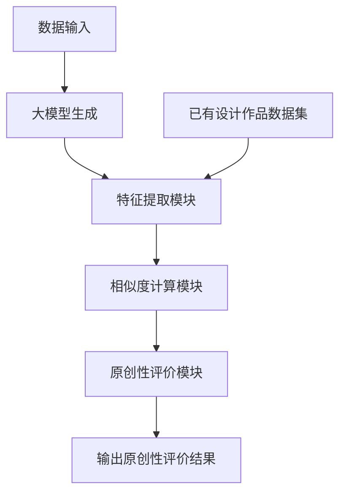

# 大模型在创意设计推理任务中的原创性评价指标研究

> 关键词：大模型、创意设计推理、原创性评价指标、人工智能、设计创新

> 摘要：本文聚焦于大模型在创意设计推理任务中的原创性评价指标。随着人工智能大模型在创意设计领域的广泛应用，如何准确评价其生成成果的原创性成为关键问题。文章首先介绍研究背景，包括目的、预期读者等内容。接着阐述核心概念与联系，深入分析相关原理和架构。详细讲解核心算法原理，结合Python代码进行说明。同时给出数学模型和公式，并举例解释。通过项目实战，展示代码实现和解读过程。探讨实际应用场景，推荐相关工具和资源。最后总结未来发展趋势与挑战，提供常见问题解答和参考资料，旨在为大模型在创意设计推理任务中的原创性评价提供全面且深入的研究。

## 1. 背景介绍 
### 1.1 目的和范围
在当今数字化时代，大模型如GPT系列、DALL - E等在创意设计推理任务中展现出强大的能力，能够快速生成各种设计方案。然而，其生成内容的原创性却备受争议。本研究的目的在于构建一套科学、合理、有效的原创性评价指标体系，以准确评估大模型在创意设计推理任务中输出成果的原创程度。

研究范围涵盖多种类型的创意设计领域，如平面设计、工业设计、服装设计等，同时涉及不同架构和训练方式的大模型，旨在为广泛的创意设计实践和大模型应用提供具有普遍适用性的原创性评价方法。

### 1.2 预期读者
本文预期读者包括人工智能领域的研究人员，他们可以从本研究中获取关于大模型原创性评价的新理论和新方法，为进一步的学术研究提供参考；创意设计从业者，有助于他们在使用大模型辅助设计时，更好地判断生成设计的原创价值，提升设计质量；以及对人工智能与创意设计融合发展感兴趣的爱好者，能够帮助他们深入理解大模型在创意设计中的作用和评价标准。

### 1.3 文档结构概述
本文共分为十个部分。第一部分背景介绍，阐述研究的目的、范围、预期读者和文档结构概述，并给出相关术语表。第二部分探讨核心概念与联系，包括原理和架构的文本示意图以及Mermaid流程图。第三部分详细讲解核心算法原理，并结合Python源代码进行说明。第四部分给出数学模型和公式，并进行详细讲解和举例。第五部分通过项目实战，展示开发环境搭建、源代码实现和代码解读。第六部分讨论实际应用场景。第七部分推荐相关工具和资源，包括学习资源、开发工具框架和相关论文著作。第八部分总结未来发展趋势与挑战。第九部分为附录，提供常见问题与解答。第十部分列出扩展阅读和参考资料。

### 1.4 术语表
#### 1.4.1 核心术语定义
- **大模型**：指具有大量参数和强大计算能力的人工智能模型，通常通过大规模数据训练得到，能够在多种任务中表现出优异的性能。
- **创意设计推理任务**：指利用人工智能技术，根据给定的设计需求和约束条件，生成具有创新性和实用性的设计方案的过程。
- **原创性**：指设计成果具有独特性、新颖性和创造性，与已有的设计作品有明显的区别。

#### 1.4.2 相关概念解释
- **设计空间**：指所有可能的设计方案的集合，包括各种设计元素、风格和表现形式。
- **特征提取**：指从设计作品中提取出能够代表其本质特征的信息，如颜色、形状、纹理等。
- **相似度计算**：指比较两个设计作品之间的相似程度，通常通过计算它们的特征向量之间的距离来实现。

#### 1.4.3 缩略词列表
- **GPT**：Generative Pretrained Transformer，生成式预训练变换器
- **DALL - E**：一种由OpenAI研发的文本到图像生成模型

## 2. 核心概念与联系 

### 核心概念原理
大模型在创意设计推理任务中的原创性评价涉及多个核心概念。首先，大模型通过对大量数据的学习和理解，能够生成与设计任务相关的方案。这些方案的原创性取决于其与已有设计的差异程度。

设计空间是一个抽象的概念，它包含了所有可能的设计方案。大模型在设计空间中搜索和生成设计方案，而原创性评价就是判断这些生成方案在设计空间中的位置和独特性。

特征提取是原创性评价的关键步骤。通过提取设计作品的特征，可以将设计作品转化为向量表示，便于进行相似度计算。相似度计算则是衡量两个设计作品之间的相似程度，相似度越低，说明设计作品的原创性越高。

### 架构的文本示意图
大模型在创意设计推理任务中的原创性评价架构主要包括以下几个部分：
1. **数据输入**：包括设计任务的描述、已有设计作品的数据集等。
2. **大模型生成**：大模型根据输入的数据生成设计方案。
3. **特征提取模块**：对生成的设计方案和已有设计作品进行特征提取。
4. **相似度计算模块**：计算生成设计方案与已有设计作品之间的相似度。
5. **原创性评价模块**：根据相似度计算结果，对生成设计方案的原创性进行评价。

### Mermaid流程图


## 3. 核心算法原理 & 具体操作步骤 

### 核心算法原理
本研究采用基于特征向量相似度的原创性评价算法。其核心思想是将设计作品表示为特征向量，然后计算生成设计方案的特征向量与已有设计作品特征向量之间的相似度。相似度越低，说明生成设计方案的原创性越高。

### 具体操作步骤
1. **数据预处理**：对输入的设计作品数据进行清洗、归一化等处理，确保数据的质量和一致性。
2. **特征提取**：使用合适的特征提取算法，如卷积神经网络（CNN）提取图像特征，词嵌入模型提取文本特征，将设计作品转化为特征向量。
3. **相似度计算**：选择合适的相似度计算方法，如欧几里得距离、余弦相似度等，计算生成设计方案的特征向量与已有设计作品特征向量之间的相似度。
4. **原创性评价**：根据相似度计算结果，设定合适的阈值，判断生成设计方案的原创性。如果相似度低于阈值，则认为生成设计方案具有较高的原创性。

### Python源代码实现
```python
import numpy as np
from sklearn.feature_extraction.text import TfidfVectorizer
from sklearn.metrics.pairwise import cosine_similarity

# 模拟已有设计作品数据集
existing_designs = ["This is a sample design description 1",
                    "Another sample design description 2",
                    "A different design description 3"]

# 模拟大模型生成的设计方案
generated_design = "A brand new design description"

# 数据预处理和特征提取
vectorizer = TfidfVectorizer()
existing_vectors = vectorizer.fit_transform(existing_designs)
generated_vector = vectorizer.transform([generated_design])

# 相似度计算
similarities = cosine_similarity(generated_vector, existing_vectors)

# 原创性评价
threshold = 0.3
is_original = all(similarities[0] < threshold)

print(f"Generated design is original: {is_original}")
```

## 4. 数学模型和公式 & 详细讲解 & 举例说明 

### 数学模型和公式
#### 特征向量表示
设设计作品 $x$ 经过特征提取后得到的特征向量为 $\mathbf{v}_x=(v_{x1},v_{x2},\cdots,v_{xn})$，其中 $n$ 为特征向量的维度。

#### 相似度计算
- **欧几里得距离**：两个特征向量 $\mathbf{v}_x$ 和 $\mathbf{v}_y$ 之间的欧几里得距离定义为：
$$d(\mathbf{v}_x,\mathbf{v}_y)=\sqrt{\sum_{i = 1}^{n}(v_{xi}-v_{yi})^2}$$
- **余弦相似度**：两个特征向量 $\mathbf{v}_x$ 和 $\mathbf{v}_y$ 之间的余弦相似度定义为：
$$\text{cosine}(\mathbf{v}_x,\mathbf{v}_y)=\frac{\mathbf{v}_x\cdot\mathbf{v}_y}{\|\mathbf{v}_x\|\|\mathbf{v}_y\|}=\frac{\sum_{i = 1}^{n}v_{xi}v_{yi}}{\sqrt{\sum_{i = 1}^{n}v_{xi}^2}\sqrt{\sum_{i = 1}^{n}v_{yi}^2}}$$

#### 原创性评价
设生成设计方案的特征向量为 $\mathbf{v}_g$，已有设计作品的特征向量集合为 $\{\mathbf{v}_{e1},\mathbf{v}_{e2},\cdots,\mathbf{v}_{em}\}$，相似度阈值为 $\tau$。如果 $\text{sim}(\mathbf{v}_g,\mathbf{v}_{ei})<\tau$ 对于所有 $i = 1,2,\cdots,m$ 都成立，则认为生成设计方案具有较高的原创性，其中 $\text{sim}$ 表示相似度计算函数。

### 详细讲解
欧几里得距离衡量的是两个特征向量在空间中的实际距离，距离越大，说明两个设计作品越不相似。余弦相似度衡量的是两个特征向量的方向相似度，值越接近 1 表示越相似，越接近 - 1 表示越不相似。

在原创性评价中，通过设定合适的阈值，可以判断生成设计方案与已有设计作品的差异程度。如果所有相似度都低于阈值，则认为生成设计方案具有较高的原创性。

### 举例说明
假设有两个设计作品 $x$ 和 $y$，其特征向量分别为 $\mathbf{v}_x=(1,2,3)$ 和 $\mathbf{v}_y=(4,5,6)$。

- **欧几里得距离计算**：
$$d(\mathbf{v}_x,\mathbf{v}_y)=\sqrt{(1 - 4)^2+(2 - 5)^2+(3 - 6)^2}=\sqrt{9 + 9+9}=\sqrt{27}\approx5.2$$
- **余弦相似度计算**：
$$\text{cosine}(\mathbf{v}_x,\mathbf{v}_y)=\frac{1\times4 + 2\times5+3\times6}{\sqrt{1^2 + 2^2+3^2}\sqrt{4^2 + 5^2+6^2}}=\frac{4 + 10+18}{\sqrt{14}\sqrt{77}}=\frac{32}{\sqrt{1078}}\approx0.97$$

如果设定相似度阈值 $\tau = 0.8$，由于余弦相似度大于阈值，说明这两个设计作品比较相似，原创性较低。

## 5. 项目实战：代码实际案例和详细解释说明 

### 5.1  开发环境搭建
#### 安装Python
首先，确保你已经安装了Python 3.x 版本。可以从Python官方网站（https://www.python.org/downloads/） 下载并安装适合你操作系统的Python版本。

#### 安装必要的库
使用pip命令安装项目所需的库，如numpy、scikit - learn等。
```sh
pip install numpy scikit-learn
```

### 5.2  源代码详细实现和代码解读
```python
import numpy as np
from sklearn.feature_extraction.text import TfidfVectorizer
from sklearn.metrics.pairwise import cosine_similarity

# 模拟已有设计作品数据集
existing_designs = ["This is a sample design description 1",
                    "Another sample design description 2",
                    "A different design description 3"]

# 模拟大模型生成的设计方案
generated_design = "A brand new design description"

# 数据预处理和特征提取
vectorizer = TfidfVectorizer()
# 使用TfidfVectorizer对已有设计作品数据集进行拟合和转换，得到特征向量矩阵
existing_vectors = vectorizer.fit_transform(existing_designs)
# 使用已经拟合好的TfidfVectorizer对生成的设计方案进行转换，得到其特征向量
generated_vector = vectorizer.transform([generated_design])

# 相似度计算
# 计算生成设计方案的特征向量与已有设计作品特征向量之间的余弦相似度
similarities = cosine_similarity(generated_vector, existing_vectors)

# 原创性评价
# 设定相似度阈值
threshold = 0.3
# 判断生成设计方案是否具有较高的原创性
is_original = all(similarities[0] < threshold)

print(f"Generated design is original: {is_original}")
```

### 5.3  代码解读与分析
- **数据准备**：`existing_designs` 列表存储了已有设计作品的描述，`generated_design` 存储了大模型生成的设计方案描述。
- **特征提取**：`TfidfVectorizer` 是一种常用的文本特征提取方法，它将文本转换为词频 - 逆文档频率（TF - IDF）特征向量。`fit_transform` 方法用于对已有设计作品数据集进行拟合和转换，`transform` 方法用于对生成的设计方案进行转换。
- **相似度计算**：`cosine_similarity` 函数计算生成设计方案的特征向量与已有设计作品特征向量之间的余弦相似度。
- **原创性评价**：通过设定阈值 `threshold`，判断生成设计方案的原创性。如果所有相似度都低于阈值，则认为生成设计方案具有较高的原创性。

## 6. 实际应用场景 
### 平面设计
在平面设计领域，大模型可以根据用户的需求生成海报、广告、图标等设计作品。原创性评价指标可以帮助设计师快速判断生成设计的独特性，避免设计作品的同质化。例如，设计师在使用大模型生成海报时，可以通过原创性评价指标筛选出具有较高原创性的设计方案，然后在此基础上进行进一步的修改和完善。

### 工业设计
在工业设计中，大模型可以辅助设计师进行产品外观、结构等方面的设计。原创性评价指标可以帮助企业评估大模型生成的设计方案是否具有创新性和市场竞争力。例如，汽车制造商在开发新车型时，可以使用大模型生成多种设计方案，然后通过原创性评价指标选择最具原创性的方案进行进一步的研发。

### 服装设计
在服装设计领域，大模型可以根据流行趋势和用户需求生成服装款式、图案等设计。原创性评价指标可以帮助服装设计师保护自己的知识产权，同时也可以促进服装设计行业的创新发展。例如，服装品牌在推出新系列时，可以使用原创性评价指标筛选出具有独特设计的服装款式，提高品牌的竞争力。

## 7. 工具和资源推荐
### 7.1 学习资源推荐
#### 7.1.1 书籍推荐
- 《人工智能：一种现代的方法》：这本书全面介绍了人工智能的基本概念、算法和应用，是学习人工智能的经典教材。
- 《Python机器学习》：详细介绍了Python在机器学习中的应用，包括数据预处理、特征提取、模型训练等内容。
- 《设计心理学》：帮助读者理解设计的本质和用户需求，对于创意设计领域的研究和实践具有重要的指导意义。

#### 7.1.2 在线课程
- Coursera上的“Machine Learning”课程：由斯坦福大学的Andrew Ng教授主讲，是学习机器学习的优质课程。
- edX上的“Artificial Intelligence”课程：提供了人工智能领域的系统学习内容。
- Udemy上的“Creative Design with AI”课程：专门介绍了人工智能在创意设计中的应用。

#### 7.1.3 技术博客和网站
- Medium：上面有很多关于人工智能和创意设计的技术博客和文章，涵盖了最新的研究成果和实践经验。
- Towards Data Science：专注于数据科学和人工智能领域的技术分享和交流。
- Design Week：提供设计行业的最新动态和趋势分析。

### 7.2 开发工具框架推荐
#### 7.2.1 IDE和编辑器
- PyCharm：是一款专业的Python集成开发环境，提供了丰富的代码编辑、调试和分析功能。
- Visual Studio Code：是一款轻量级的代码编辑器，支持多种编程语言，并且有大量的扩展插件可以使用。

#### 7.2.2 调试和性能分析工具
- PDB：Python自带的调试工具，可以帮助开发者调试代码。
- cProfile：Python的性能分析工具，可以分析代码的运行时间和资源占用情况。

#### 7.2.3 相关框架和库
- TensorFlow：是一个开源的机器学习框架，提供了丰富的深度学习模型和工具。
- PyTorch：是另一个流行的深度学习框架，具有动态图的优势，易于使用和调试。
- Scikit - learn：是一个简单易用的机器学习库，提供了多种机器学习算法和工具。

### 7.3 相关论文著作推荐
#### 7.3.1 经典论文
- “Attention Is All You Need”：介绍了Transformer架构，是自然语言处理领域的经典论文。
- “Generative Adversarial Nets”：提出了生成对抗网络（GAN）的概念，在图像生成等领域有广泛的应用。

#### 7.3.2 最新研究成果
- 关注顶级学术会议如NeurIPS、ICML、CVPR等的最新论文，了解大模型和创意设计领域的最新研究进展。

#### 7.3.3 应用案例分析
- 可以参考一些知名企业和研究机构发布的应用案例报告，如OpenAI关于DALL - E的应用案例，了解大模型在创意设计中的实际应用效果。

## 8. 总结：未来发展趋势与挑战
### 未来发展趋势
- **多模态融合**：未来大模型将更加注重多模态信息的融合，如文本