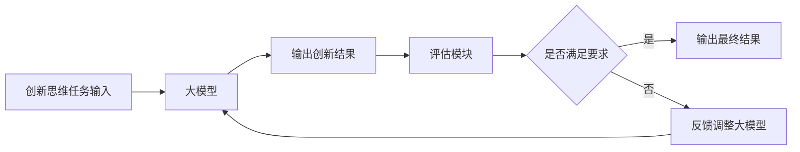

# 大模型在创新思维任务中的表现评估

> 关键词：大模型、创新思维任务、表现评估、评估指标、应用场景

> 摘要：本文围绕大模型在创新思维任务中的表现评估展开深入探讨。首先介绍了研究的背景、目的、预期读者、文档结构及相关术语。接着阐述了大模型和创新思维任务的核心概念及联系，并给出相应的示意图和流程图。详细讲解了用于评估的核心算法原理及具体操作步骤，结合Python代码进行说明。通过数学模型和公式进一步分析评估的科学性，并举例说明。以实际项目案例展示评估过程，包括开发环境搭建、源代码实现与解读。探讨了大模型在创新思维任务中的实际应用场景，推荐了学习资源、开发工具框架以及相关论文著作。最后总结了大模型在创新思维任务评估方面的未来发展趋势与挑战，解答了常见问题，并提供了扩展阅读和参考资料。

## 1. 背景介绍 
### 1.1 目的和范围
随着人工智能技术的飞速发展，大模型如GPT系列、BERT等在自然语言处理、图像生成等多个领域取得了显著的成果。创新思维任务对于解决复杂问题、推动科学技术进步和社会发展至关重要。评估大模型在创新思维任务中的表现，有助于了解大模型的优势和局限性，为进一步优化大模型、拓展其在创新领域的应用提供依据。

本文章的范围主要涵盖大模型在创新思维任务中的表现评估方法、指标体系、实际应用案例以及相关的工具和资源推荐等方面。重点关注自然语言处理领域的创新思维任务，如创意写作、问题解决、概念生成等，但也会涉及一些跨领域的创新思维应用。

### 1.2 预期读者
本文预期读者包括人工智能领域的研究人员、开发者、软件架构师、CTO等技术专业人士，他们对大模型的性能评估和创新应用感兴趣，希望深入了解大模型在创新思维任务中的表现。同时，也适合对人工智能和创新思维有一定了解的爱好者，帮助他们更好地认识大模型在创新方面的潜力和挑战。

### 1.3 文档结构概述
本文共分为十个部分。第一部分为背景介绍，阐述了研究的目的、范围、预期读者和文档结构。第二部分介绍大模型和创新思维任务的核心概念及联系，通过示意图和流程图进行说明。第三部分详细讲解评估大模型在创新思维任务中表现的核心算法原理及具体操作步骤，并给出Python代码示例。第四部分介绍评估所涉及的数学模型和公式，并举例说明。第五部分通过实际项目案例展示评估的具体过程，包括开发环境搭建、源代码实现与解读。第六部分探讨大模型在创新思维任务中的实际应用场景。第七部分推荐相关的学习资源、开发工具框架和论文著作。第八部分总结大模型在创新思维任务评估方面的未来发展趋势与挑战。第九部分为附录，解答常见问题。第十部分提供扩展阅读和参考资料。

### 1.4 术语表
#### 1.4.1 核心术语定义
- **大模型**：指具有大量参数和强大计算能力的人工智能模型，通常基于深度学习架构，如Transformer架构，通过在大规模数据集上进行训练得到。
- **创新思维任务**：需要创造性思维和新颖解决方案的任务，如创意写作、问题解决、概念生成、设计创新等。
- **表现评估**：对大模型在完成创新思维任务时的性能进行量化和定性的评价，以确定其在创新能力、准确性、多样性等方面的表现。

#### 1.4.2 相关概念解释
- **生成式模型**：一类能够根据输入生成新的输出的模型，大模型通常属于生成式模型，如GPT系列可以生成文本、图像生成模型可以生成图像等。
- **创新能力**：大模型在完成创新思维任务时表现出的创造新颖、有价值的解决方案或内容的能力。
- **多样性**：大模型生成的结果在内容、形式、风格等方面的差异程度，多样性越高表示模型能够生成更丰富的结果。

#### 1.4.3 缩略词列表
- **NLP**：Natural Language Processing，自然语言处理
- **GPT**：Generative Pretrained Transformer，生成式预训练变换器
- **BERT**：Bidirectional Encoder Representations from Transformers，基于变换器的双向编码器表示

## 2. 核心概念与联系 

### 核心概念原理
#### 大模型原理
大模型通常基于深度学习的神经网络架构，如Transformer架构。Transformer架构采用了自注意力机制（Self-Attention Mechanism），能够捕捉输入序列中不同位置之间的依赖关系，从而更好地处理长序列数据。大模型通过在大规模的文本、图像等数据上进行无监督预训练，学习到语言、图像等的通用特征和模式。在预训练完成后，可以通过微调（Fine-Tuning）的方式将大模型应用到具体的任务中。

#### 创新思维任务原理
创新思维任务需要打破常规思维模式，从不同的角度思考问题，生成新颖、有价值的解决方案或内容。创新思维过程通常包括问题定义、信息收集、创意生成、评估和选择等阶段。在创新思维任务中，需要综合运用发散思维和收敛思维，既要产生大量的创意想法，又要对这些想法进行筛选和优化。

### 架构的文本示意图
```plaintext
大模型
|
|-- 输入层（接收创新思维任务的输入，如问题描述、提示信息等）
|
|-- 中间层（由多个Transformer块组成，进行特征提取和转换）
|
|-- 输出层（生成创新思维任务的输出，如创意文本、解决方案等）
|
|-- 评估模块（对输出结果进行评估，反馈评估结果以优化模型）
```

### Mermaid流程图


## 3. 核心算法原理 & 具体操作步骤 

### 核心算法原理
评估大模型在创新思维任务中的表现通常需要综合考虑多个指标，如创新能力、准确性、多样性等。以下是一种常用的评估算法原理：

#### 创新能力评估
可以通过计算生成结果与已有数据的相似度来评估创新能力。相似度越低，说明生成结果越新颖，创新能力越强。常用的相似度计算方法有余弦相似度、编辑距离等。

#### 准确性评估
对于一些有明确答案的创新思维任务，可以通过计算生成结果与标准答案的匹配程度来评估准确性。对于没有明确答案的任务，可以通过人工评估或众包评估的方式来确定结果的合理性和准确性。

#### 多样性评估
可以通过计算生成结果之间的差异程度来评估多样性。例如，可以计算不同生成结果的词向量之间的距离，距离越大，说明多样性越高。

### 具体操作步骤
#### 步骤1：数据准备
收集创新思维任务的输入数据和对应的标准答案（如果有），以及大模型生成的结果数据。

#### 步骤2：指标计算
- **创新能力指标计算**：
```python
import numpy as np
from sklearn.metrics.pairwise import cosine_similarity

def calculate_innovation_score(generated_texts, existing_texts):
    generated_embeddings = [get_embedding(text) for text in generated_texts]
    existing_embeddings = [get_embedding(text) for text in existing_texts]
    similarity_scores = []
    for gen_emb in generated_embeddings:
        similarities = [cosine_similarity([gen_emb], [exist_emb])[0][0] for exist_emb in existing_embeddings]
        min_similarity = min(similarities)
        similarity_scores.append(min_similarity)
    innovation_scores = [1 - score for score in similarity_scores]
    return np.mean(innovation_scores)

def get_embedding(text):
    # 这里使用一个简单的词向量表示，实际应用中可以使用更复杂的模型
    # 例如，使用预训练的词向量模型如Word2Vec、GloVe等
    words = text.split()
    embeddings = [np.random.rand(100) for _ in words]
    return np.mean(embeddings, axis=0)
```
- **准确性指标计算**：
```python
def calculate_accuracy_score(generated_texts, ground_truths):
    correct_count = 0
    for gen_text, gt_text in zip(generated_texts, ground_truths):
        if gen_text == gt_text:
            correct_count += 1
    return correct_count / len(generated_texts)
```
- **多样性指标计算**：
```python
def calculate_diversity_score(generated_texts):
    generated_embeddings = [get_embedding(text) for text in generated_texts]
    num_texts = len(generated_texts)
    total_distance = 0
    for i in range(num_texts):
        for j in range(i + 1, num_texts):
            distance = np.linalg.norm(generated_embeddings[i] - generated_embeddings[j])
            total_distance += distance
    num_pairs = num_texts * (num_texts - 1) / 2
    diversity_score = total_distance / num_pairs
    return diversity_score
```

#### 步骤3：综合评估
根据创新能力、准确性和多样性指标的权重，计算综合评估得分。
```python
def calculate_composite_score(innovation_score, accuracy_score, diversity_score, weights):
    composite_score = weights[0] * innovation_score + weights[1] * accuracy_score + weights[2] * diversity_score
    return composite_score
```

## 4. 数学模型和公式 & 详细讲解 & 举例说明 

### 创新能力评估公式
设 $G = \{g_1, g_2, \cdots, g_n\}$ 为大模型生成的 $n$ 个结果，$E = \{e_1, e_2, \cdots, e_m\}$ 为已有数据。对于每个生成结果 $g_i$，计算其与已有数据的最小余弦相似度 $s_{i}$：
$$s_{i} = \min_{j = 1}^{m} \text{cosine\_similarity}(g_i, e_j)$$
创新能力得分 $I$ 定义为：
$$I = \frac{1}{n} \sum_{i = 1}^{n} (1 - s_{i})$$

### 准确性评估公式
设 $G = \{g_1, g_2, \cdots, g_n\}$ 为大模型生成的 $n$ 个结果，$T = \{t_1, t_2, \cdots, t_n\}$ 为标准答案。准确性得分 $A$ 定义为：
$$A = \frac{1}{n} \sum_{i = 1}^{n} \delta(g_i, t_i)$$
其中，$\delta(g_i, t_i)$ 为指示函数，当 $g_i = t_i$ 时，$\delta(g_i, t_i) = 1$，否则 $\delta(g_i, t_i) = 0$。

### 多样性评估公式
设 $G = \{g_1, g_2, \cdots, g_n\}$ 为大模型生成的 $n$ 个结果，其对应的词向量表示为 $\mathbf{v}_1, \mathbf{v}_2, \cdots, \mathbf{v}_n$。多样性得分 $D$ 定义为：
$$D = \frac{2}{n(n - 1)} \sum_{1 \leq i < j \leq n} \|\mathbf{v}_i - \mathbf{v}_j\|$$

### 综合评估公式
设创新能力得分、准确性得分和多样性得分分别为 $I$、$A$ 和 $D$，对应的权重分别为 $w_1$、$w_2$ 和 $w_3$，且 $w_1 + w_2 + w_3 = 1$。综合评估得分 $S$ 定义为：
$$S = w_1 I + w_2 A + w_3 D$$

### 举例说明
假设大模型生成了 3 个结果 $G = \{g_1, g_2, g_3\}$，已有数据 $E = \{e_1, e_2\}$，标准答案 $T = \{t_1, t_2, t_3\}$。

- **创新能力评估**：
计算 $g_1$ 与 $e_1$、$e_2$ 的余弦相似度分别为 0.2 和 0.3，$g_2$ 与 $e_1$、$e_2$ 的余弦相似度分别为 0.1 和 0.4，$g_3$ 与 $e_1$、$e_2$ 的余弦相似度分别为 0.3 和 0.2。则 $s_1 = 0.2$，$s_2 = 0.1$，$s_3 = 0.2$，创新能力得分 $I = \frac{(1 - 0.2) + (1 - 0.1) + (1 - 0.2)}{3} = 0.9$。

- **准确性评估**：
假设 $g_1 = t_1$，$g_2 \neq t_2$，$g_3 = t_3$，则准确性得分 $A = \frac{2}{3} \approx 0.67$。

- **多样性评估**：
假设 $g_1$、$g_2$、$g_3$ 的词向量分别为 $\mathbf{v}_1$、$\mathbf{v}_2$、$\mathbf{v}_3$，且 $\|\mathbf{v}_1 - \mathbf{v}_2\| = 0.5$，$\|\mathbf{v}_1 - \mathbf{v}_3\| = 0.6$，$\|\mathbf{v}_2 - \mathbf{v}_3\| = 0.4$。则多样性得分 $D = \frac{2}{3\times(3 - 1)} \times (0.5 + 0.6 + 0.4) = 0.5$。

- **综合评估**：
假设权重 $w_1 = 0.4$，$w_2 = 0.3$，$w_3 = 0.3$，则综合评估得分 $S = 0.4\times0.9 + 0.3\times0.67 + 0.3\times0.5 = 0.721$。

## 5. 项目实战：代码实际案例和详细解释说明 

### 5.1  开发环境搭建
#### 操作系统
建议使用Linux系统，如Ubuntu 18.04及以上版本，也可以使用Windows 10或macOS。

#### 编程语言和环境
使用Python 3.7及以上版本，推荐使用Anaconda来管理Python环境。可以通过以下命令创建一个新的Python环境：
```bash
conda create -n innovation_eval python=3.8
conda activate innovation_eval
```

#### 依赖库安装
安装必要的Python库，如`numpy`、`scikit-learn`等：
```bash
pip install numpy scikit-learn
```

### 5.2  源代码详细实现和代码解读
以下是一个完整的代码示例，用于评估大模型在创新思维任务中的表现：

```python
import numpy as np
from sklearn.metrics.pairwise import cosine_similarity

# 模拟获取词向量的函数
def get_embedding(text):
    words = text.split()
    embeddings = [np.random.rand(100) for _ in words]
    return np.mean(embeddings, axis=0)

# 计算创新能力得分
def calculate_innovation_score(generated_texts, existing_texts):
    generated_embeddings = [get_embedding(text) for text in generated_texts]
    existing_embeddings = [get_embedding(text) for text in existing_texts]
    similarity_scores = []
    for gen_emb in generated_embeddings:
        similarities = [cosine_similarity([gen_emb], [exist_emb])[0][0] for exist_emb in existing_embeddings]
        min_similarity = min(similarities)
        similarity_scores.append(min_similarity)
    innovation_scores = [1 - score for score in similarity_scores]
    return np.mean(innovation_scores)

# 计算准确性得分
def calculate_accuracy_score(generated_texts, ground_truths):
    correct_count = 0
    for gen_text, gt_text in zip(generated_texts, ground_truths):
        if gen_text == gt_text:
            correct_count += 1
    return correct_count / len(generated_texts)

# 计算多样性得分
def calculate_diversity_score(generated_texts):
    generated_embeddings = [get_embedding(text) for text in generated_texts]
    num_texts = len(generated_texts)
    total_distance = 0
    for i in range(num_texts):
        for j in range(i + 1, num_texts):
            distance = np.linalg.norm(generated_embeddings[i] - generated_embeddings[j])
            total_distance += distance
    num_pairs = num_texts * (num_texts - 1) / 2
    diversity_score = total_distance / num_pairs
    return diversity_score

# 计算综合评估得分
def calculate_composite_score(innovation_score, accuracy_score, diversity_score, weights):
    composite_score = weights[0] * innovation_score + weights[1] * accuracy_score + weights[2] * diversity_score
    return composite_score

# 示例数据
generated_texts = ["This is a creative idea", "Another unique thought", "A fresh perspective"]
existing_texts = ["This is a common idea", "A regular thought"]
ground_truths = ["This is a creative idea", "Another unique thought", "A different answer"]
weights = [0.4, 0.3, 0.3]

# 计算各项得分
innovation_score = calculate_innovation_score(generated_texts, existing_texts)
accuracy_score = calculate_accuracy_score(generated_texts, ground_truths)
diversity_score = calculate_diversity_score(generated_texts)

# 计算综合得分
composite_score = calculate_composite_score(innovation_score, accuracy_score, diversity_score, weights)

print(f"创新能力得分: {innovation_score}")
print(f"准确性得分: {accuracy_score}")
print(f"多样性得分: {diversity_score}")
print(f"综合评估得分: {composite_score}")
```

### 5.3  代码解读与分析
- **`get_embedding` 函数**：该函数用于模拟获取文本的词向量表示。在实际应用中，可以使用预训练的词向量模型如Word2Vec、GloVe或基于深度学习的语言模型如BERT来获取更准确的词向量。
- **`calculate_innovation_score` 函数**：通过计算生成结果与已有数据的最小余弦相似度，再取平均值得到创新能力得分。相似度越低，创新能力得分越高。
- **`calculate_accuracy_score` 函数**：通过比较生成结果与标准答案的匹配程度，计算准确性得分。
- **`calculate_diversity_score` 函数**：通过计算生成结果之间的词向量距离，取平均值得到多样性得分。距离越大，多样性得分越高。
- **`calculate_composite_score` 函数**：根据创新能力、准确性和多样性得分的权重，计算综合评估得分。
- **示例数据部分**：定义了生成结果、已有数据、标准答案和权重，调用上述函数计算各项得分并输出结果。

## 6. 实际应用场景 
### 创意写作
在创意写作领域，大模型可以用于生成故事、诗歌、广告语等。通过评估大模型在创意写作任务中的表现，可以选择更适合的模型和参数，提高创意写作的质量和效率。例如，评估模型生成的故事在情节创新性、语言优美度和逻辑合理性等方面的表现，为作家和编剧提供参考。

### 问题解决
在解决复杂问题时，大模型可以提供多种解决方案。通过评估模型在问题解决任务中的表现，可以筛选出更具创新性和可行性的解决方案。例如，在工程领域，评估模型提出的设计方案在创新性、成本效益和技术可行性等方面的表现，帮助工程师做出更优的决策。

### 概念生成
在科研、产品设计等领域，需要不断生成新的概念和想法。大模型可以通过对已有知识的学习和推理，生成新的概念。评估模型在概念生成任务中的表现，可以促进创新思维的发展。例如，在科技研发中，评估模型提出的新技术概念在创新性、前瞻性和实用性等方面的表现，为科研人员提供灵感。

### 设计创新
在工业设计、平面设计等领域，大模型可以辅助设计师生成创新的设计方案。通过评估模型在设计创新任务中的表现，可以提高设计的质量和独特性。例如，评估模型生成的产品外观设计在创新性、美观性和功能性等方面的表现，为设计师提供更多的选择。

## 7. 工具和资源推荐
### 7.1 学习资源推荐
#### 7.1.1 书籍推荐
- 《深度学习》（Deep Learning）：由Ian Goodfellow、Yoshua Bengio和Aaron Courville撰写，是深度学习领域的经典教材，介绍了深度学习的基本原理、算法和应用。
- 《自然语言处理入门》：作者何晗，适合初学者快速入门自然语言处理，涵盖了自然语言处理的基本概念、方法和技术。
- 《Python自然语言处理》（Natural Language Processing with Python）：由Steven Bird、Ewan Klein和Edward Loper编写，通过Python代码介绍了自然语言处理的各种技术和应用。

#### 7.1.2 在线课程
- Coursera上的“深度学习专项课程”（Deep Learning Specialization）：由Andrew Ng教授授课，系统介绍了深度学习的理论和实践，包括神经网络、卷积神经网络、循环神经网络等。
- edX上的“自然语言处理基础”（Foundations of Natural Language Processing）：由哥伦比亚大学的教授授课，深入讲解了自然语言处理的基本原理和算法。
- 哔哩哔哩上有很多关于人工智能和自然语言处理的免费教程，如“李宏毅机器学习”系列课程，讲解生动易懂。

#### 7.1.3 技术博客和网站
- Medium：有很多人工智能领域的专家和从业者在Medium上分享最新的研究成果和实践经验，如Towards Data Science板块。
- arXiv：是一个预印本服务器，提供了大量的人工智能领域的研究论文，包括大模型、创新思维等方面的最新研究。
- 机器之心：专注于人工智能领域的科技媒体，提供了丰富的技术文章、行业动态和研究报告。

### 7.2 开发工具框架推荐
#### 7.2.1 IDE和编辑器
- PyCharm：是一款专门为Python开发设计的集成开发环境（IDE），具有代码自动补全、调试、版本控制等功能，适合开发大型Python项目。
- Jupyter Notebook：是一个交互式的开发环境，支持Python、R等多种编程语言，适合进行数据分析、模型训练和实验。
- Visual Studio Code：是一款轻量级的代码编辑器，支持多种编程语言和插件扩展，可通过安装Python相关插件来进行Python开发。

#### 7.2.2 调试和性能分析工具
- TensorBoard：是TensorFlow提供的可视化工具，可以用于监控模型训练过程中的损失函数、准确率等指标，以及可视化模型的结构和参数。
- Py-Spy：是一个用于Python代码性能分析的工具，可以实时监控Python程序的CPU使用情况、函数调用时间等，帮助开发者找出性能瓶颈。
- cProfile：是Python标准库中的性能分析模块，可以统计函数调用的时间和次数，分析代码的性能。

#### 7.2.3 相关框架和库
- PyTorch：是一个开源的深度学习框架，提供了丰富的神经网络层和优化算法，易于使用和扩展，广泛应用于自然语言处理、计算机视觉等领域。
- Hugging Face Transformers：是一个用于自然语言处理的开源库，提供了大量预训练的语言模型，如GPT、BERT等，方便开发者快速进行模型的微调应用。
- scikit-learn：是一个用于机器学习的Python库，提供了多种机器学习算法和工具，如分类、回归、聚类等，可用于数据预处理、模型评估等任务。

### 7.3 相关论文著作推荐
#### 7.3.1 经典论文
- “Attention Is All You Need”：提出了Transformer架构，是大模型发展的重要里程碑，为后续的GPT、BERT等模型奠定了基础。
- “BERT: Pre-training of Deep Bidirectional Transformers for Language Understanding”：介绍了BERT模型，通过双向预训练的方式在自然语言处理任务中取得了优异的成绩。
- “Generative Adversarial Networks”：提出了生成对抗网络（GAN）的概念，为生成式模型的发展提供了新的思路。

#### 7.3.2 最新研究成果
- 关注arXiv上关于大模型、创新思维等领域的最新论文，了解该领域的前沿研究动态。例如，一些关于大模型在创意生成、问题解决等方面的应用研究。
- 参加人工智能领域的顶级学术会议，如NeurIPS、ICML、ACL等，会议上会有很多最新的研究成果发表。

#### 7.3.3 应用案例分析
- 可以参考一些人工智能领域的应用案例书籍和报告，了解大模型在不同行业的创新应用。例如，一些关于大模型在医疗、金融、教育等领域的应用案例分析。

## 8. 总结：未来发展趋势与挑战
### 未来发展趋势
#### 模型性能提升
随着计算资源的不断增加和算法的不断改进，大模型的性能将不断提升。模型的参数规模可能会进一步增大，能够学习到更丰富的知识和模式，从而在创新思维任务中表现出更强的能力。

#### 跨领域融合
大模型将与其他领域的技术进行更深入的融合，如计算机视觉、语音识别、机器人技术等。通过跨领域的融合，大模型可以处理更复杂的创新思维任务，为解决实际问题提供更全面的解决方案。

#### 个性化创新
未来的大模型将能够根据用户的个性化需求和偏好，生成更符合用户期望的创新结果。例如，在创意写作中，模型可以根据用户的风格偏好生成不同风格的故事和诗歌。

#### 评估体系完善
随着大模型在创新思维任务中的应用越来越广泛，评估体系也将不断完善。除了现有的创新能力、准确性和多样性等指标外，可能会引入更多的评估维度，如实用性、可解释性等，以更全面地评估大模型的表现。

### 挑战
#### 数据质量和数量
大模型的训练需要大量高质量的数据，但获取和标注这些数据是一个巨大的挑战。数据的质量和数量直接影响模型的性能和创新能力，如何解决数据的瓶颈问题是未来需要解决的重要问题。

#### 计算资源需求
大模型的训练和推理需要大量的计算资源，这不仅增加了成本，还对环境造成了一定的压力。如何在有限的计算资源下提高模型的效率和性能，是一个亟待解决的问题。

#### 可解释性和可信度
大模型通常是一个黑盒模型，其决策过程和结果难以解释。在创新思维任务中，用户需要了解模型的决策依据，以确保结果的可信度。如何提高大模型的可解释性和可信度，是未来研究的重要方向。

#### 伦理和法律问题
大模型在创新思维任务中的应用可能会带来一些伦理和法律问题，如知识产权保护、数据隐私、虚假信息传播等。如何制定相应的伦理和法律规范，确保大模型的合理应用，是需要关注的问题。

## 9. 附录：常见问题与解答
### 问题1：如何选择合适的评估指标？
答：选择合适的评估指标需要根据具体的创新思维任务和应用场景来确定。对于有明确答案的任务，准确性指标可能更重要；对于需要创意和新颖性的任务，创新能力和多样性指标可能更关键。可以根据任务的特点和需求，综合考虑多个指标，并为每个指标分配合适的权重。

### 问题2：大模型的创新能力是否可以完全替代人类的创新思维？
答：目前大模型的创新能力虽然在某些方面表现出色，但还不能完全替代人类的创新思维。人类的创新思维具有独特的情感、直觉和创造力，能够从不同的角度思考问题，产生新颖的想法。大模型主要是基于已有的数据和模式进行学习和生成，缺乏人类的主观意识和情感体验。因此，大模型可以作为人类创新思维的辅助工具，帮助人类提高创新效率和质量。

### 问题3：如何提高大模型在创新思维任务中的表现？
答：可以从以下几个方面提高大模型在创新思维任务中的表现：
- **优化训练数据**：使用高质量、多样化的训练数据，让模型学习到更丰富的知识和模式。
- **调整模型架构和参数**：选择合适的模型架构和参数，如增加模型的层数、调整学习率等，以提高模型的性能。
- **引入外部知识**：将外部知识如常识知识、领域知识等引入到模型中，帮助模型更好地理解和处理创新思维任务。
- **采用强化学习等方法**：通过强化学习等方法对模型进行优化，让模型在完成创新思维任务时获得更好的奖励。

### 问题4：评估大模型在创新思维任务中的表现是否具有主观性？
答：评估大模型在创新思维任务中的表现存在一定的主观性。例如，在评估创新能力和准确性时，对于一些没有明确答案的任务，不同的评估者可能会有不同的看法。为了减少主观性，可以采用多人评估、众包评估等方式，综合多个评估者的意见。同时，也可以使用一些客观的评估指标和方法，如相似度计算、距离计算等，来提高评估的客观性。

## 10. 扩展阅读 & 参考资料
### 扩展阅读
- 《人工智能时代的创新与创业》：探讨了人工智能技术对创新和创业的影响，以及如何在人工智能时代进行创新和创业。
- 《创新算法：TRIZ、系统创新和技术创造力》：介绍了TRIZ理论和创新算法，帮助读者提高创新思维能力。
- 《未来简史：从智人到神人》：作者尤瓦尔·赫拉利在书中探讨了人工智能、生物技术等新兴技术对人类未来的影响，引发读者对未来创新的思考。

### 参考资料
- Goodfellow, I. J., Bengio, Y., & Courville, A. (2016). Deep Learning. MIT Press.
- Devlin, J., Chang, M. W., Lee, K., & Toutanova, K. (2018). BERT: Pre-training of Deep Bidirectional Transformers for Language Understanding. arXiv preprint arXiv:1810.04805.
- Vaswani, A., Shazeer, N., Parmar, N., Uszkoreit, J., Jones, L., Gomez, A. N.,... & Polosukhin, I. (2017). Attention Is All You Need. Advances in neural information processing systems, 5998-6008.

作者：AI天才研究院/AI Genius Institute & 禅与计算机程序设计艺术 /Zen And The Art of Computer Programming