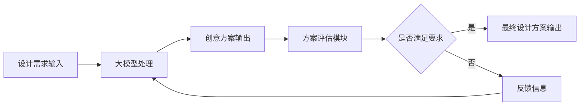

# 大模型在创新设计推理任务中的表现

> 关键词：大模型、创新设计推理、表现评估、设计思维、技术应用

> 摘要：本文聚焦于大模型在创新设计推理任务中的表现。首先介绍了相关背景，包括目的范围、预期读者等。接着阐述核心概念，分析大模型与创新设计推理的联系。详细讲解核心算法原理及操作步骤，并给出数学模型和公式。通过项目实战展示代码实现与解读，探讨实际应用场景。同时推荐了学习资源、开发工具框架及相关论文著作。最后总结未来发展趋势与挑战，解答常见问题并提供扩展阅读与参考资料，旨在全面剖析大模型在创新设计推理任务中的多方面表现。

## 1. 背景介绍 
### 1.1 目的和范围
本研究的主要目的是深入评估大模型在创新设计推理任务中的表现。创新设计推理涵盖了从概念生成到方案优化的多个阶段，涉及艺术、工程、科技等多个领域。我们将研究大模型如何理解设计需求、生成创意方案、进行方案评估和改进等方面的能力。范围包括不同类型的大模型，如基于深度学习的语言模型、图像生成模型等，以及多种创新设计推理任务，如产品设计、平面设计、建筑设计等。

### 1.2 预期读者
本文预期读者包括人工智能研究人员、设计师、创新领域从业者以及对大模型和创新设计感兴趣的爱好者。对于研究人员，本文可提供大模型在创新设计推理方面的研究思路和评估方法；对于设计师，能帮助他们了解如何利用大模型提升设计效率和创意水平；对于从业者和爱好者，可增进对大模型在创新领域应用的认识。

### 1.3 文档结构概述
本文将按照以下结构展开：首先介绍核心概念与联系，明确大模型和创新设计推理的基本原理和相互关系；接着阐述核心算法原理和具体操作步骤，通过 Python 代码进行详细说明；然后给出数学模型和公式，并举例说明；再通过项目实战展示代码实际案例和详细解释；探讨实际应用场景；推荐相关的工具和资源；总结未来发展趋势与挑战；最后提供附录解答常见问题，并给出扩展阅读和参考资料。

### 1.4 术语表
#### 1.4.1 核心术语定义
- **大模型**：指具有大量参数和强大计算能力的人工智能模型，通常基于深度学习架构，如 Transformer 等，能够处理大规模数据和复杂任务。
- **创新设计推理**：在设计过程中，运用逻辑思维、创造性思维和领域知识，从设计需求出发，生成新颖、可行的设计方案，并对方案进行评估和优化的过程。
- **设计需求**：用户或市场对设计产品或服务的功能、性能、美学等方面的要求。
- **创意方案**：针对设计需求生成的具有创新性和可行性的设计解决方案。

#### 1.4.2 相关概念解释
- **深度学习**：一种基于人工神经网络的机器学习方法，通过多层神经网络自动学习数据中的特征和模式。
- **Transformer 架构**：一种用于自然语言处理和其他序列处理任务的深度学习架构，具有并行计算和长序列处理能力。
- **生成对抗网络（GAN）**：由生成器和判别器组成的深度学习模型，用于生成逼真的数据，常用于图像生成等任务。

#### 1.4.3 缩略词列表
- **GPT**：Generative Pretrained Transformer，一种基于 Transformer 架构的生成式预训练语言模型。
- **DALL - E**：OpenAI 开发的图像生成模型，能够根据文本描述生成图像。
- **CNN**：Convolutional Neural Network，卷积神经网络，常用于图像和视频处理任务。

## 2. 核心概念与联系 

### 核心概念原理
#### 大模型原理
大模型通常基于深度学习架构，如 Transformer 等。以 GPT 为例，它是一种基于 Transformer 的生成式预训练语言模型。其原理是通过在大规模文本数据上进行无监督学习，学习语言的统计规律和语义信息。在预训练过程中，模型学习预测下一个单词的概率分布，从而掌握语言的结构和语义。在微调阶段，可以针对特定任务进行有监督学习，进一步优化模型的性能。

#### 创新设计推理原理
创新设计推理是一个复杂的认知过程，涉及多个方面的知识和思维方式。它包括以下几个关键步骤：
1. **需求理解**：准确把握设计需求，包括功能需求、用户需求、市场需求等。
2. **创意生成**：运用创造性思维，如头脑风暴、类比推理等，生成多种可能的设计方案。
3. **方案评估**：根据设计目标和约束条件，对生成的方案进行评估和筛选。
4. **方案优化**：对选定的方案进行进一步的改进和完善，以满足设计需求。

### 架构的文本示意图
大模型在创新设计推理任务中的架构可以描述如下：

设计需求输入 -> 大模型处理（包括特征提取、语义理解、创意生成等） -> 创意方案输出 -> 方案评估模块（可以是人工评估或模型评估） -> 反馈信息 -> 大模型再次处理（方案优化） -> 最终设计方案输出

### Mermaid 流程图


## 3. 核心算法原理 & 具体操作步骤 

### 核心算法原理
以基于 GPT 的大模型在创新设计推理中的应用为例，核心算法原理如下：

#### 预训练阶段
GPT 模型在大规模文本数据上进行无监督学习，使用自回归语言模型进行训练。其目标是最大化给定历史文本的条件下预测下一个单词的概率。假设输入文本为 $x_1, x_2, \cdots, x_n$，模型的目标是最大化以下概率：

$$P(x_n|x_1, x_2, \cdots, x_{n - 1})$$

通过多层 Transformer 架构，模型学习到文本中的语义和语法信息。

#### 微调阶段
在创新设计推理任务中，需要对预训练的 GPT 模型进行微调。可以收集与设计任务相关的数据集，包括设计需求描述和对应的创意方案。使用这些数据对模型进行有监督学习，调整模型的参数，使其更好地适应创新设计推理任务。

### 具体操作步骤

#### 数据准备
1. 收集设计需求和创意方案的数据集。可以从设计案例库、设计论坛等渠道获取数据。
2. 对数据进行清洗和预处理，包括去除噪声、分词、标注等操作。

#### 模型加载和微调
以下是使用 Python 和 Hugging Face 的 Transformers 库进行 GPT 模型微调的示例代码：

```python
from transformers import GPT2LMHeadModel, GPT2Tokenizer, TextDataset, DataCollatorForLanguageModeling
from transformers import Trainer, TrainingArguments

# 加载预训练的 GPT 模型和分词器
model = GPT2LMHeadModel.from_pretrained("gpt2")
tokenizer = GPT2Tokenizer.from_pretrained("gpt2")

# 准备数据集
train_dataset = TextDataset(
    tokenizer=tokenizer,
    file_path="train.txt",
    block_size=128
)

data_collator = DataCollatorForLanguageModeling(
    tokenizer=tokenizer, mlm=False
)

# 定义训练参数
training_args = TrainingArguments(
    output_dir='./results',          # 输出目录
    overwrite_output_dir=True,      # 是否覆盖输出目录
    num_train_epochs=3,              # 训练轮数
    per_device_train_batch_size=4,   # 每个设备的训练批次大小
    save_steps=10_000,               # 每多少步保存一次模型
    save_total_limit=2,              # 最多保存的模型数量
    prediction_loss_only=True,
)

# 创建 Trainer 对象进行训练
trainer = Trainer(
    model=model,
    args=training_args,
    data_collator=data_collator,
    train_dataset=train_dataset,
)

# 开始训练
trainer.train()

# 保存微调后的模型
trainer.save_model()
```

#### 创意方案生成
使用微调后的模型生成创意方案。以下是生成创意方案的示例代码：

```python
# 加载微调后的模型
model = GPT2LMHeadModel.from_pretrained("./results")

# 输入设计需求
input_text = "设计一款适合上班族的便携式咖啡杯"

# 对输入文本进行编码
input_ids = tokenizer.encode(input_text, return_tensors='pt')

# 生成创意方案
output = model.generate(input_ids, max_length=200, num_return_sequences=1)

# 解码输出结果
generated_text = tokenizer.decode(output[0], skip_special_tokens=True)
print(generated_text)
```

## 4. 数学模型和公式 & 详细讲解 & 举例说明 

### 预训练阶段的数学模型
在预训练阶段，GPT 模型使用自回归语言模型进行训练。假设输入序列为 $x = (x_1, x_2, \cdots, x_n)$，模型的目标是最大化条件概率 $P(x_n|x_1, x_2, \cdots, x_{n - 1})$。具体来说，模型通过多层 Transformer 架构计算每个位置的隐藏状态 $h_i$，然后使用 softmax 函数计算下一个单词的概率分布。

#### Transformer 架构
Transformer 架构由多头自注意力机制（Multi - Head Self - Attention）和前馈神经网络（Feed - Forward Network）组成。多头自注意力机制可以计算输入序列中不同位置之间的依赖关系，其计算公式如下：

$$Attention(Q, K, V) = softmax(\frac{QK^T}{\sqrt{d_k}})V$$

其中，$Q$、$K$、$V$ 分别是查询矩阵、键矩阵和值矩阵，$d_k$ 是键的维度。

多头自注意力机制将多个单头注意力的结果拼接起来，然后通过线性变换得到最终的输出：

$$MultiHead(Q, K, V) = Concat(head_1, head_2, \cdots, head_h)W^O$$

其中，$head_i = Attention(QW_i^Q, KW_i^K, VW_i^V)$，$W_i^Q$、$W_i^K$、$W_i^V$ 和 $W^O$ 是可学习的参数。

#### 前馈神经网络
前馈神经网络由两个线性层和一个非线性激活函数（通常是 ReLU）组成：

$$FFN(x) = max(0, xW_1 + b_1)W_2 + b_2$$

其中，$W_1$、$W_2$ 是权重矩阵，$b_1$、$b_2$ 是偏置向量。

### 微调阶段的数学模型
在微调阶段，使用有监督学习的方法对预训练模型进行调整。假设训练数据集为 $\{(x^{(i)}, y^{(i)})\}_{i = 1}^N$，其中 $x^{(i)}$ 是设计需求描述，$y^{(i)}$ 是对应的创意方案。模型的目标是最小化损失函数，通常使用交叉熵损失函数：

$$L = -\frac{1}{N}\sum_{i = 1}^N\sum_{j = 1}^{|y^{(i)}|}\log P(y_j^{(i)}|x^{(i)}, y_1^{(i)}, \cdots, y_{j - 1}^{(i)})$$

其中，$|y^{(i)}|$ 是创意方案 $y^{(i)}$ 的长度。

### 举例说明
假设我们有一个简单的设计需求：“设计一款简约风格的椅子”。在预训练阶段，模型学习到了“简约风格”、“椅子”等词汇的语义和语法信息。在微调阶段，我们使用包含类似设计需求和创意方案的数据集对模型进行训练。当输入这个设计需求时，模型通过计算条件概率生成创意方案，例如：“这款椅子采用简洁的线条设计，座椅和靠背为一体式，使用环保塑料材质，颜色为白色，脚架为金属材质，造型时尚大方，适合现代家居环境。”

## 5. 项目实战：代码实际案例和详细解释说明 

### 5.1  开发环境搭建
#### 硬件环境
建议使用具有 GPU 加速的计算机，如 NVIDIA GPU。可以使用 Google Colab 或 Kaggle 等云平台，它们提供了免费的 GPU 资源。

#### 软件环境
- **操作系统**：Windows、Linux 或 macOS。
- **Python 版本**：建议使用 Python 3.7 或以上版本。
- **安装必要的库**：使用以下命令安装所需的库：

```bash
pip install transformers datasets torch
```

### 5.2  源代码详细实现和代码解读
#### 数据准备
首先，我们需要准备训练数据集。假设我们有一个文本文件 `train.txt`，其中每行包含一个设计需求和对应的创意方案，用分隔符（如 `|`）分隔。以下是数据准备的代码：

```python
from datasets import load_dataset

# 加载数据集
dataset = load_dataset('text', data_files='train.txt')

# 定义预处理函数
def preprocess_function(examples):
    inputs = [example.split('|')[0] for example in examples["text"]]
    targets = [example.split('|')[1] for example in examples["text"]]
    model_inputs = tokenizer(inputs, max_length=128, truncation=True)
    labels = tokenizer(targets, max_length=128, truncation=True)
    model_inputs["labels"] = labels["input_ids"]
    return model_inputs

# 对数据集进行预处理
tokenized_dataset = dataset.map(preprocess_function, batched=True)
```

#### 模型加载和微调
以下是加载预训练模型并进行微调的代码：

```python
from transformers import GPT2LMHeadModel, GPT2Tokenizer, TrainingArguments, Trainer

# 加载预训练的 GPT 模型和分词器
model = GPT2LMHeadModel.from_pretrained("gpt2")
tokenizer = GPT2Tokenizer.from_pretrained("gpt2")

# 定义训练参数
training_args = TrainingArguments(
    output_dir='./results',
    overwrite_output_dir=True,
    num_train_epochs=3,
    per_device_train_batch_size=4,
    save_steps=10_000,
    save_total_limit=2,
    prediction_loss_only=True,
)

# 创建 Trainer 对象进行训练
trainer = Trainer(
    model=model,
    args=training_args,
    train_dataset=tokenized_dataset["train"],
)

# 开始训练
trainer.train()

# 保存微调后的模型
trainer.save_model()
```

#### 创意方案生成
以下是使用微调后的模型生成创意方案的代码：

```python
# 加载微调后的模型
model = GPT2LMHeadModel.from_pretrained("./results")

# 输入设计需求
input_text = "设计一款适合户外运动的背包"

# 对输入文本进行编码
input_ids = tokenizer.encode(input_text, return_tensors='pt')

# 生成创意方案
output = model.generate(input_ids, max_length=200, num_return_sequences=1)

# 解码输出结果
generated_text = tokenizer.decode(output[0], skip_special_tokens=True)
print(generated_text)
```

### 5.3  代码解读与分析
#### 数据准备部分
- `load_dataset` 函数用于加载文本数据集。
- `preprocess_function` 函数对数据进行预处理，将设计需求和创意方案分别进行编码，并将创意方案的编码作为标签。
- `map` 方法对数据集的每个样本应用预处理函数。

#### 模型加载和微调部分
- `GPT2LMHeadModel.from_pretrained` 函数加载预训练的 GPT 模型。
- `TrainingArguments` 类定义了训练的参数，如训练轮数、批次大小等。
- `Trainer` 类负责模型的训练和保存。

#### 创意方案生成部分
- 加载微调后的模型。
- 对输入的设计需求进行编码。
- 使用 `generate` 方法生成创意方案。
- 解码生成的方案并打印输出。

## 6. 实际应用场景 
### 产品设计
在产品设计领域，大模型可以根据用户需求生成多种产品设计方案。例如，在手机设计中，大模型可以根据用户对手机功能、外观、尺寸等方面的需求，生成不同风格和特点的手机设计草图。设计师可以在此基础上进行进一步的优化和完善，提高设计效率和创意水平。

### 平面设计
在平面设计中，大模型可以用于生成海报、广告、包装等设计方案。根据设计主题和要求，大模型可以生成不同的色彩搭配、图形元素和文字排版方案，为设计师提供灵感和参考。例如，为一场音乐节设计海报，大模型可以生成多种具有不同风格和氛围的海报设计，如摇滚风格、流行风格等。

### 建筑设计
在建筑设计中，大模型可以根据建筑的功能需求、场地条件和设计风格等因素，生成建筑的初步设计方案。例如，设计一座医院，大模型可以考虑医院的科室布局、流线组织、采光通风等要求，生成不同的建筑平面和外观设计方案。建筑师可以利用这些方案进行深入的设计和分析。

### 服装设计
在服装设计中，大模型可以根据流行趋势、季节特点和用户喜好，生成服装设计方案。例如，设计一款夏季连衣裙，大模型可以考虑面料选择、款式设计、颜色搭配等因素，生成不同风格的连衣裙设计，如简约风格、复古风格等。服装设计师可以根据这些方案进行样品制作和市场推广。

## 7. 工具和资源推荐
### 7.1 学习资源推荐
#### 7.1.1 书籍推荐
- 《深度学习》（Deep Learning）：由 Ian Goodfellow、Yoshua Bengio 和 Aaron Courville 撰写，是深度学习领域的经典教材，涵盖了深度学习的基本原理、算法和应用。
- 《Python 深度学习》（Deep Learning with Python）：由 Francois Chollet 撰写，介绍了如何使用 Python 和 Keras 库进行深度学习模型的开发和训练。
- 《人工智能：一种现代的方法》（Artificial Intelligence: A Modern Approach）：由 Stuart Russell 和 Peter Norvig 撰写，是人工智能领域的权威教材，涵盖了人工智能的各个方面，包括搜索算法、机器学习、自然语言处理等。

#### 7.1.2 在线课程
- Coursera 上的“深度学习专项课程”（Deep Learning Specialization）：由 Andrew Ng 教授授课，包括五门课程，全面介绍了深度学习的理论和实践。
- edX 上的“人工智能导论”（Introduction to Artificial Intelligence）：由麻省理工学院（MIT）的 Patrick Winston 教授授课，介绍了人工智能的基本概念、算法和应用。
- Kaggle 上的“深度学习微课程”（Deep Learning Micro - Courses）：提供了一系列关于深度学习的短课程，包括图像分类、自然语言处理等方面的内容。

#### 7.1.3 技术博客和网站
- Medium：有许多人工智能和深度学习领域的博主分享最新的研究成果和实践经验。
- Towards Data Science：专注于数据科学和机器学习领域的技术博客，提供了大量的教程和案例分析。
- Hugging Face Blog：Hugging Face 官方博客，分享了关于自然语言处理和大模型的最新进展和应用案例。

### 7.2 开发工具框架推荐
#### 7.2.1 IDE和编辑器
- PyCharm：是一款专业的 Python 集成开发环境（IDE），提供了代码编辑、调试、版本控制等功能，适合大规模项目的开发。
- Jupyter Notebook：是一个交互式的开发环境，支持 Python、R 等多种编程语言，适合进行数据分析和模型实验。
- Visual Studio Code：是一款轻量级的代码编辑器，支持多种编程语言和插件扩展，具有丰富的功能和良好的用户体验。

#### 7.2.2 调试和性能分析工具
- TensorBoard：是 TensorFlow 提供的可视化工具，可以用于监控模型的训练过程、查看模型的结构和性能指标等。
- PyTorch Profiler：是 PyTorch 提供的性能分析工具，可以帮助用户分析模型的计算性能和内存使用情况。
- cProfile：是 Python 内置的性能分析工具，可以用于分析 Python 代码的运行时间和函数调用情况。

#### 7.2.3 相关框架和库
- TensorFlow：是 Google 开发的深度学习框架，具有广泛的应用和丰富的工具库，支持多种硬件平台。
- PyTorch：是 Facebook 开发的深度学习框架，具有动态图和易于使用的特点，适合研究和快速开发。
- Hugging Face Transformers：是一个开源的自然语言处理库，提供了多种预训练模型和工具，方便用户进行文本生成、分类、问答等任务。

### 7.3 相关论文著作推荐
#### 7.3.1 经典论文
- “Attention Is All You Need”：提出了 Transformer 架构，是自然语言处理领域的重要突破。
- “Generative Adversarial Nets”：介绍了生成对抗网络（GAN）的基本原理和算法，开创了生成式模型的新领域。
- “ImageNet Classification with Deep Convolutional Neural Networks”：介绍了 AlexNet 模型，开启了深度学习在图像识别领域的应用热潮。

#### 7.3.2 最新研究成果
- 关注 NeurIPS、ICML、CVPR 等顶级学术会议的论文，了解大模型在创新设计推理领域的最新研究进展。
- 关注 ArXiv 预印本平台，及时获取最新的研究成果和技术报告。

#### 7.3.3 应用案例分析
- 查看 ACM SIGGRAPH、Design Computing Conference 等会议的论文和案例，了解大模型在设计领域的实际应用案例和效果评估。

## 8. 总结：未来发展趋势与挑战
### 未来发展趋势
#### 模型性能提升
随着计算能力的不断提高和算法的不断优化，大模型的性能将不断提升。模型将能够处理更复杂的设计任务，生成更高质量、更具创意的设计方案。

#### 跨领域融合
大模型将与其他领域的技术进行更深入的融合，如虚拟现实（VR）、增强现实（AR）、物联网（IoT）等。例如，在建筑设计中，结合 VR 技术可以让设计师更直观地体验设计方案；在产品设计中，结合 IoT 技术可以实现产品的智能化和互联化。

#### 个性化设计
大模型将能够根据用户的个性化需求和偏好，生成更加个性化的设计方案。通过收集和分析用户的行为数据和反馈信息，模型可以不断学习和优化，为用户提供更符合其需求的设计。

### 挑战
#### 数据质量和隐私问题
大模型的训练需要大量的高质量数据。在创新设计推理任务中，获取标注好的设计数据比较困难，且数据的质量和多样性对模型的性能有很大影响。此外，数据隐私问题也是一个重要的挑战，需要确保用户的设计数据不被泄露和滥用。

#### 模型可解释性
大模型通常是黑盒模型，其决策过程和推理机制难以解释。在创新设计推理中，设计师需要了解模型生成方案的依据和原理，以便进行进一步的优化和调整。因此，提高模型的可解释性是一个亟待解决的问题。

#### 伦理和法律问题
大模型在创新设计推理中的应用可能会引发一系列伦理和法律问题。例如，模型生成的设计方案可能会侵犯他人的知识产权；模型的决策可能会受到数据偏差的影响，导致不公平的结果。因此，需要建立相应的伦理和法律规范，确保大模型的合理应用。

## 9. 附录：常见问题与解答
### 问题 1：大模型生成的创意方案是否具有实用性？
解答：大模型生成的创意方案具有一定的参考价值，但不一定完全具有实用性。模型生成的方案是基于训练数据和算法规则，可能存在一些不切实际或无法实现的设计。设计师需要对生成的方案进行评估和优化，结合实际情况进行调整，使其具有实用性。

### 问题 2：如何评估大模型在创新设计推理任务中的表现？
解答：可以从多个方面评估大模型的表现，如创意性、可行性、多样性等。创意性可以通过评估方案的新颖性和独特性来衡量；可行性可以通过考虑方案的技术实现难度、成本等因素来评估；多样性可以通过比较生成的多个方案的差异来衡量。此外，还可以通过用户反馈和实际应用效果来评估模型的表现。

### 问题 3：大模型在创新设计推理中能否替代设计师？
解答：大模型不能完全替代设计师。虽然大模型可以生成创意方案，但设计师具有丰富的专业知识、经验和审美能力，能够从用户需求、市场趋势、文化背景等多个角度进行综合考虑，对生成的方案进行优化和完善。大模型可以作为设计师的辅助工具，帮助设计师提高设计效率和创意水平。

## 10. 扩展阅读 & 参考资料
### 扩展阅读
- 《设计思维：创新者的十堂课》（Design Thinking: Ten Lessons for Innovation）：介绍了设计思维的基本概念和方法，以及如何将其应用于创新设计中。
- 《创新算法：TRIZ 系统创新和技术创造力》（The Innovation Algorithm: TRIZ, Systematic Innovation, and Technical Creativity）：介绍了 TRIZ 创新方法，帮助设计师解决创新过程中的问题。

### 参考资料
- Goodfellow, I. J., Bengio, Y., & Courville, A. (2016). Deep Learning. MIT Press.
- Chollet, F. (2017). Deep Learning with Python. Manning Publications.
- Russell, S. J., & Norvig, P. (2016). Artificial Intelligence: A Modern Approach. Pearson.

作者：AI天才研究院/AI Genius Institute & 禅与计算机程序设计艺术 /Zen And The Art of Computer Programming