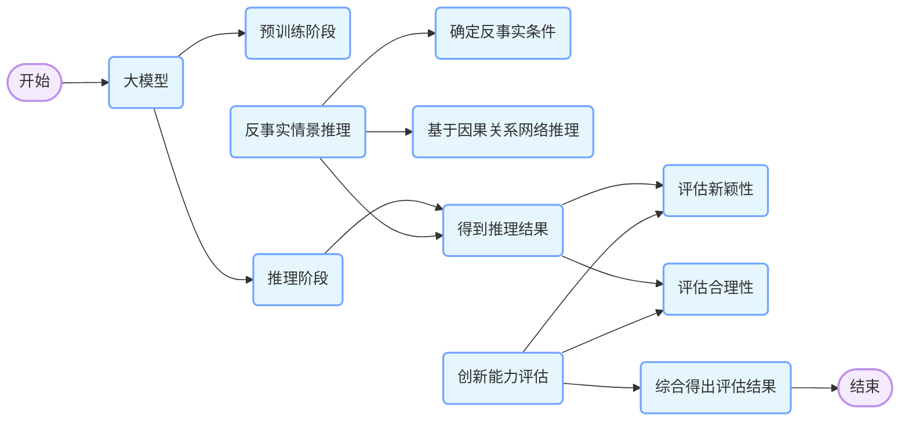

# 大模型在反事实情景推理中的创新能力评估方法

> 关键词：大模型、反事实情景推理、创新能力评估、评估指标、评估方法

> 摘要：本文聚焦于大模型在反事实情景推理中的创新能力评估方法。首先介绍了研究的背景、目的、预期读者和文档结构等内容。接着阐述了大模型、反事实情景推理及创新能力评估的核心概念与联系。详细讲解了核心算法原理，通过Python代码进行说明，并给出相关数学模型和公式。以具体项目实战案例展示代码实现与解读。分析了大模型在反事实情景推理创新能力评估的实际应用场景。推荐了学习资源、开发工具框架以及相关论文著作。最后总结了未来发展趋势与挑战，解答常见问题并提供扩展阅读和参考资料，旨在为该领域的研究和实践提供全面的指导。

## 1. 背景介绍 
### 1.1 目的和范围
在当今人工智能领域，大模型的发展日新月异。大模型在自然语言处理、图像识别等众多领域都展现出了强大的能力。然而，其在反事实情景推理方面的创新能力究竟如何，需要有一套科学合理的评估方法。本研究的目的就是构建一套全面、有效的评估方法，以准确衡量大模型在反事实情景推理中的创新能力。

本研究的范围涵盖了不同类型的大模型，包括基于Transformer架构的模型如GPT系列、BERT等，以及其他深度学习架构的模型。同时，涉及多种反事实情景推理任务，如历史事件反事实推理、科学实验反事实推理、社会现象反事实推理等。

### 1.2 预期读者
本文预期读者主要包括人工智能领域的研究人员，他们可以从中获取关于大模型评估方法的新思路和新方法，为进一步的研究提供参考；软件工程师在开发基于大模型的应用时，能够借鉴本文的评估方法来优化模型性能；高校相关专业的学生可以通过本文深入了解大模型评估的相关知识，拓宽学术视野。

### 1.3 文档结构概述
本文将按照以下结构进行阐述：首先介绍核心概念与联系，明确大模型、反事实情景推理和创新能力评估的基本概念和它们之间的关系；接着讲解核心算法原理和具体操作步骤，通过Python代码详细说明；给出相关的数学模型和公式，并举例说明；进行项目实战，展示代码实际案例并详细解释；分析实际应用场景；推荐相关的工具和资源；最后总结未来发展趋势与挑战，解答常见问题并提供扩展阅读和参考资料。

### 1.4 术语表
#### 1.4.1 核心术语定义
- **大模型**：指具有大量参数和强大计算能力的深度学习模型，通常在大规模数据集上进行预训练，能够学习到丰富的语言知识和模式。
- **反事实情景推理**：是一种基于假设的推理方式，即在已知事实的基础上，假设某些条件发生改变，然后推理可能产生的结果。
- **创新能力评估**：对大模型在反事实情景推理中产生新颖、有价值结果的能力进行量化和定性的评价。

#### 1.4.2 相关概念解释
- **反事实条件**：在反事实情景推理中，对已知事实进行改变的条件。例如，在历史事件反事实推理中，“如果某场战争没有发生”就是一个反事实条件。
- **推理结果的新颖性**：指大模型在反事实情景推理中得出的结果与常规预期或已有知识的差异程度。
- **推理结果的合理性**：指大模型得出的反事实推理结果在逻辑和现实可能性上的合理程度。

#### 1.4.3 缩略词列表
- **GPT**：Generative Pretrained Transformer，生成式预训练变换器。
- **BERT**：Bidirectional Encoder Representations from Transformers，基于变换器的双向编码器表示。

## 2. 核心概念与联系 

### 核心概念原理
#### 大模型
大模型通常基于深度学习架构，如Transformer。Transformer架构通过自注意力机制能够捕捉输入序列中不同位置之间的依赖关系，从而有效地处理长序列数据。大模型在大规模无监督数据上进行预训练，学习到语言的通用模式和知识。在推理阶段，根据输入的任务和数据，利用预训练得到的知识生成相应的输出。

#### 反事实情景推理
反事实情景推理基于反事实条件进行。其原理是在已知的因果关系网络中，对某些原因变量进行干预（即设置反事实条件），然后根据因果关系推理出可能的结果。例如，在一个简单的因果模型中，事件A导致事件B，反事实条件可以是假设事件A没有发生，然后推理事件B是否会发生以及可能的替代结果。

#### 创新能力评估
创新能力评估主要从推理结果的新颖性和合理性两个方面进行。新颖性可以通过与已有知识或常规预期的对比来衡量，合理性则需要结合领域知识和逻辑规则进行判断。评估方法可以采用人工评估和自动评估相结合的方式。

### 架构的文本示意图
```plaintext
大模型
├── 预训练阶段
│   └── 在大规模无监督数据上学习通用语言知识
├── 推理阶段
│   └── 根据输入的反事实情景生成推理结果

反事实情景推理
├── 确定反事实条件
├── 基于因果关系网络进行推理
└── 得到推理结果

创新能力评估
├── 评估推理结果的新颖性
├── 评估推理结果的合理性
└── 综合得出评估结果
```

### Mermaid流程图


## 3. 核心算法原理 & 具体操作步骤 

### 核心算法原理
我们可以采用基于相似度计算的方法来评估大模型在反事实情景推理中的创新能力。具体来说，通过计算推理结果与已有知识和常规预期结果的相似度，来衡量新颖性；通过构建领域知识图谱，检查推理结果与图谱中因果关系的一致性来评估合理性。

### 具体操作步骤
1. **数据准备**：收集大量的反事实情景数据和对应的领域知识数据，构建训练集和测试集。
2. **大模型推理**：将反事实情景输入大模型，得到推理结果。
3. **新颖性评估**：计算推理结果与已有知识和常规预期结果的相似度。可以使用余弦相似度、编辑距离等方法。
4. **合理性评估**：将推理结果与领域知识图谱进行比对，检查是否符合因果关系。
5. **综合评估**：根据新颖性和合理性的评估结果，综合得出创新能力评估得分。

### Python源代码实现
```python
import numpy as np
from sklearn.metrics.pairwise import cosine_similarity
from rdflib import Graph

# 示例数据
existing_knowledge = ["常规结果1", "常规结果2"]
domain_knowledge_graph = Graph()
domain_knowledge_graph.parse("domain_knowledge.ttl", format="ttl")

# 大模型推理结果
model_result = "大模型推理结果"

# 新颖性评估
def novelty_evaluation(model_result, existing_knowledge):
    # 简单示例：将文本转换为向量（实际应用中需要使用更复杂的方法）
    def text_to_vector(text):
        return np.random.rand(10)  # 随机生成向量示例
    model_vector = text_to_vector(model_result)
    existing_vectors = [text_to_vector(result) for result in existing_knowledge]
    similarities = [cosine_similarity([model_vector], [vec])[0][0] for vec in existing_vectors]
    average_similarity = np.mean(similarities)
    novelty_score = 1 - average_similarity
    return novelty_score

# 合理性评估
def rationality_evaluation(model_result, domain_knowledge_graph):
    # 简单示例：检查推理结果是否在知识图谱中存在相关因果关系
    # 实际应用中需要更复杂的逻辑
    query = f"ASK WHERE {{?s?p '{model_result}'}}"
    result = domain_knowledge_graph.query(query)
    if bool(result):
        rationality_score = 1
    else:
        rationality_score = 0
    return rationality_score

# 综合评估
def comprehensive_evaluation(model_result, existing_knowledge, domain_knowledge_graph):
    novelty = novelty_evaluation(model_result, existing_knowledge)
    rationality = rationality_evaluation(model_result, domain_knowledge_graph)
    # 简单加权平均
    evaluation_score = 0.5 * novelty + 0.5 * rationality
    return evaluation_score

# 进行评估
score = comprehensive_evaluation(model_result, existing_knowledge, domain_knowledge_graph)
print(f"创新能力评估得分: {score}")
```

## 4. 数学模型和公式 & 详细讲解 & 举例说明 

### 新颖性评估数学模型
新颖性评估可以使用余弦相似度来衡量推理结果与已有知识的差异。余弦相似度的计算公式为：
$$
\cos(\theta) = \frac{\mathbf{A} \cdot \mathbf{B}}{\|\mathbf{A}\| \|\mathbf{B}\|}
$$
其中，$\mathbf{A}$ 和 $\mathbf{B}$ 分别是推理结果和已有知识的向量表示，$\mathbf{A} \cdot \mathbf{B}$ 是向量的点积，$\|\mathbf{A}\|$ 和 $\|\mathbf{B}\|$ 分别是向量的模。新颖性得分可以表示为：
$$
\text{Novelty} = 1 - \cos(\theta)
$$

### 合理性评估数学模型
合理性评估可以使用布尔值来表示推理结果是否符合领域知识图谱中的因果关系。设 $R$ 为推理结果，$KG$ 为领域知识图谱，合理性得分可以表示为：
$$
\text{Rationality} = 
\begin{cases}
1, & \text{如果 } R \text{ 符合 } KG \text{ 中的因果关系} \\
0, & \text{否则}
\end{cases}
$$

### 综合评估数学模型
综合评估得分可以通过对新颖性得分和合理性得分进行加权平均得到：
$$
\text{Score} = \alpha \times \text{Novelty} + (1 - \alpha) \times \text{Rationality}
$$
其中，$\alpha$ 是权重系数，取值范围为 $[0, 1]$。

### 举例说明
假设推理结果的向量表示为 $\mathbf{A} = [0.2, 0.3, 0.5]$，已有知识的向量表示为 $\mathbf{B} = [0.1, 0.4, 0.5]$。
首先计算余弦相似度：
$$
\mathbf{A} \cdot \mathbf{B} = 0.2 \times 0.1 + 0.3 \times 0.4 + 0.5 \times 0.5 = 0.02 + 0.12 + 0.25 = 0.39
$$
$$
\|\mathbf{A}\| = \sqrt{0.2^2 + 0.3^2 + 0.5^2} = \sqrt{0.04 + 0.09 + 0.25} = \sqrt{0.38} \approx 0.616
$$
$$
\|\mathbf{B}\| = \sqrt{0.1^2 + 0.4^2 + 0.5^2} = \sqrt{0.01 + 0.16 + 0.25} = \sqrt{0.42} \approx 0.648
$$
$$
\cos(\theta) = \frac{0.39}{0.616 \times 0.648} \approx 0.97
$$
新颖性得分：
$$
\text{Novelty} = 1 - 0.97 = 0.03
$$
假设推理结果符合领域知识图谱中的因果关系，则合理性得分 $\text{Rationality} = 1$。
设 $\alpha = 0.5$，则综合评估得分：
$$
\text{Score} = 0.5 \times 0.03 + 0.5 \times 1 = 0.015 + 0.5 = 0.515
$$

## 5. 项目实战：代码实际案例和详细解释说明 

### 5.1  开发环境搭建
#### 安装Python
首先需要安装Python，建议使用Python 3.7及以上版本。可以从Python官方网站（https://www.python.org/downloads/）下载安装包进行安装。

#### 安装必要的库
使用以下命令安装必要的库：
```sh
pip install numpy scikit-learn rdflib
```

### 5.2  源代码详细实现和代码解读
```python
import numpy as np
from sklearn.metrics.pairwise import cosine_similarity
from rdflib import Graph

# 示例数据
existing_knowledge = ["常规结果1", "常规结果2"]
domain_knowledge_graph = Graph()
domain_knowledge_graph.parse("domain_knowledge.ttl", format="ttl")

# 大模型推理结果
model_result = "大模型推理结果"

# 新颖性评估
def novelty_evaluation(model_result, existing_knowledge):
    # 简单示例：将文本转换为向量（实际应用中需要使用更复杂的方法）
    def text_to_vector(text):
        return np.random.rand(10)  # 随机生成向量示例
    model_vector = text_to_vector(model_result)
    existing_vectors = [text_to_vector(result) for result in existing_knowledge]
    similarities = [cosine_similarity([model_vector], [vec])[0][0] for vec in existing_vectors]
    average_similarity = np.mean(similarities)
    novelty_score = 1 - average_similarity
    return novelty_score

# 合理性评估
def rationality_evaluation(model_result, domain_knowledge_graph):
    # 简单示例：检查推理结果是否在知识图谱中存在相关因果关系
    # 实际应用中需要更复杂的逻辑
    query = f"ASK WHERE {{?s?p '{model_result}'}}"
    result = domain_knowledge_graph.query(query)
    if bool(result):
        rationality_score = 1
    else:
        rationality_score = 0
    return rationality_score

# 综合评估
def comprehensive_evaluation(model_result, existing_knowledge, domain_knowledge_graph):
    novelty = novelty_evaluation(model_result, existing_knowledge)
    rationality = rationality_evaluation(model_result, domain_knowledge_graph)
    # 简单加权平均
    evaluation_score = 0.5 * novelty + 0.5 * rationality
    return evaluation_score

# 进行评估
score = comprehensive_evaluation(model_result, existing_knowledge, domain_knowledge_graph)
print(f"创新能力评估得分: {score}")
```
### 代码解读
1. **导入必要的库**：导入 `numpy` 用于数值计算，`cosine_similarity` 用于计算余弦相似度，`Graph` 用于处理知识图谱。
2. **数据准备**：定义示例的已有知识和领域知识图谱，并模拟大模型的推理结果。
3. **新颖性评估函数 `novelty_evaluation`**：将推理结果和已有知识转换为向量，计算余弦相似度，然后计算新颖性得分。
4. **合理性评估函数 `rationality_evaluation`**：通过查询知识图谱，检查推理结果是否存在相关因果关系，返回合理性得分。
5. **综合评估函数 `comprehensive_evaluation`**：综合新颖性得分和合理性得分，通过加权平均得到综合评估得分。
6. **进行评估**：调用综合评估函数，输出创新能力评估得分。

### 5.3  代码解读与分析
- **优点**：代码结构清晰，实现了基本的创新能力评估功能。通过将评估过程分为新颖性评估和合理性评估，便于理解和扩展。
- **不足**：文本向量化部分使用了简单的随机向量，实际应用中需要使用更复杂的方法，如词嵌入、预训练语言模型等。合理性评估部分仅进行了简单的查询，没有考虑更复杂的因果关系推理。

## 6. 实际应用场景 
### 历史研究
在历史研究中，大模型可以进行反事实情景推理，例如假设某场战争没有发生，推理历史的发展走向。通过评估大模型在这些反事实情景推理中的创新能力，可以为历史研究提供新的视角和思路。研究人员可以根据评估结果选择更具创新能力的模型，帮助发现一些被忽视的历史可能性。

### 科学研究
在科学实验中，反事实情景推理可以帮助科学家探索不同实验条件下的结果。评估大模型在科学反事实情景推理中的创新能力，有助于筛选出能够提出新颖实验方案和理论假设的模型，推动科学研究的发展。

### 政策制定
政策制定者可以利用大模型进行反事实情景推理，例如假设某项政策没有实施，评估可能产生的社会经济影响。通过评估模型的创新能力，可以选择更能提供创新政策建议的模型，为政策制定提供更全面的参考。

### 商业决策
在商业领域，大模型可以进行市场趋势的反事实情景推理，如假设竞争对手采取了不同的营销策略，推理本企业的市场份额变化。评估模型的创新能力有助于企业选择能够提供新颖商业策略的模型，增强企业的竞争力。

## 7. 工具和资源推荐
### 7.1 学习资源推荐
#### 7.1.1 书籍推荐
- 《深度学习》（Deep Learning）：由Ian Goodfellow、Yoshua Bengio和Aaron Courville所著，全面介绍了深度学习的基本概念、算法和应用，是深度学习领域的经典教材。
- 《自然语言处理入门》：详细介绍了自然语言处理的基本技术和方法，对于理解大模型在自然语言处理中的应用有很大帮助。
- 《因果推理导论》：帮助读者了解因果关系的基本概念和推理方法，对于反事实情景推理的学习至关重要。

#### 7.1.2 在线课程
- Coursera上的“深度学习专项课程”：由深度学习领域的知名专家Andrew Ng授课，系统地介绍了深度学习的各个方面。
- edX上的“自然语言处理基础”：提供了自然语言处理的基础知识和实践经验。
- Udemy上的“因果推断实战”：通过实际案例讲解因果推断的方法和应用。

#### 7.1.3 技术博客和网站
- arXiv.org：提供了大量的学术论文，包括大模型、反事实推理等领域的最新研究成果。
- Medium上的AI相关博客：有许多专业人士分享的关于大模型评估、反事实推理等方面的文章。
- 机器之心：关注人工智能领域的最新动态和技术进展，提供了丰富的技术文章和案例分析。

### 7.2 开发工具框架推荐
#### 7.2.1 IDE和编辑器
- PyCharm：是一款专门为Python开发设计的集成开发环境，提供了丰富的代码编辑、调试和项目管理功能。
- Jupyter Notebook：交互式的开发环境，适合进行数据分析和模型实验，方便代码的展示和分享。
- Visual Studio Code：轻量级的代码编辑器，支持多种编程语言，有丰富的插件扩展功能。

#### 7.2.2 调试和性能分析工具
- TensorBoard：用于可视化TensorFlow模型的训练过程和性能指标，帮助开发者进行调试和优化。
- Py-Spy：可以对Python代码进行性能分析，找出性能瓶颈。
- cProfile：Python自带的性能分析工具，能够详细记录函数的调用时间和次数。

#### 7.2.3 相关框架和库
- PyTorch：一个开源的深度学习框架，提供了丰富的深度学习模型和工具，便于大模型的开发和训练。
- Hugging Face Transformers：提供了大量预训练的语言模型，如GPT、BERT等，方便进行自然语言处理任务。
- RDFLib：用于处理RDF格式的知识图谱，方便进行知识图谱的构建和查询。

### 7.3 相关论文著作推荐
#### 7.3.1 经典论文
- “Attention Is All You Need”：介绍了Transformer架构，是大模型发展的重要基础。
- “Causal Inference in Statistics: A Primer”：系统地介绍了因果推断的基本概念和方法。
- “Language Models are Few-Shot Learners”：展示了GPT-3等大模型在少样本学习方面的强大能力。

#### 7.3.2 最新研究成果
- 关注顶级学术会议如NeurIPS、ICML、ACL等的论文，了解大模型在反事实情景推理和创新能力评估方面的最新研究进展。
- 一些知名研究机构如OpenAI、Google Research等发布的相关研究报告。

#### 7.3.3 应用案例分析
- 查看一些实际应用中大模型在反事实情景推理的案例分析，了解如何将理论方法应用到实际场景中。例如，某些公司在市场预测、政策评估等方面使用大模型进行反事实推理的案例。

## 8. 总结：未来发展趋势与挑战
### 未来发展趋势
- **多模态融合评估**：未来的评估方法可能会结合图像、语音等多模态信息，更全面地评估大模型在反事实情景推理中的创新能力。例如，在历史研究中，不仅考虑文字描述的反事实情景，还结合历史图片、音频等信息进行推理和评估。
- **自适应评估机制**：随着大模型的不断发展和应用场景的多样化，评估方法需要具备自适应能力，能够根据不同的任务和数据特点自动调整评估指标和权重。
- **与人类智能的融合评估**：将人类的创造力和判断力融入到评估过程中，例如通过人机协作的方式进行评估，充分发挥人类和大模型的优势。

### 挑战
- **数据质量和多样性**：高质量、多样化的反事实情景数据是评估的基础。然而，获取这些数据面临着困难，数据的准确性和完整性也需要保证。
- **评估指标的合理性**：目前的评估指标还存在一定的局限性，需要进一步研究和完善，以更准确地衡量大模型的创新能力。
- **计算资源的需求**：大模型的推理和评估需要大量的计算资源，如何在有限的资源下进行高效的评估是一个挑战。

## 9. 附录：常见问题与解答
### 问题1：如何获取高质量的反事实情景数据？
解答：可以通过以下几种方式获取高质量的反事实情景数据：一是从历史文献、研究报告中挖掘，整理出不同领域的反事实情景描述；二是通过专家知识和领域经验进行构建；三是利用一些模拟工具生成反事实情景数据。

### 问题2：评估指标的权重如何确定？
解答：评估指标的权重可以通过以下方法确定：一是基于专家经验，邀请领域专家根据实际需求和重要性给出权重建议；二是通过实验和优化，在不同的数据集和任务上进行多次实验，找到最优的权重组合。

### 问题3：如何处理大模型推理结果的不确定性？
解答：可以采用以下方法处理推理结果的不确定性：一是使用多个大模型进行推理，然后综合多个结果进行评估；二是引入置信度指标，对推理结果的可靠性进行量化；三是结合领域知识和逻辑规则对推理结果进行筛选和修正。

## 10. 扩展阅读 & 参考资料
### 扩展阅读
- 《人工智能时代的因果推理》：深入探讨了因果推理在人工智能中的应用和发展。
- 《大模型的奥秘》：介绍了大模型的技术原理、训练方法和应用场景。

### 参考资料
- 相关学术论文和研究报告，如在arXiv、ACM Digital Library等平台上搜索到的关于大模型、反事实推理和评估方法的论文。
- 相关的开源项目和代码库，如Hugging Face上的大模型实现和一些评估工具的代码。

作者：AI天才研究院/AI Genius Institute & 禅与计算机程序设计艺术 /Zen And The Art of Computer Programming