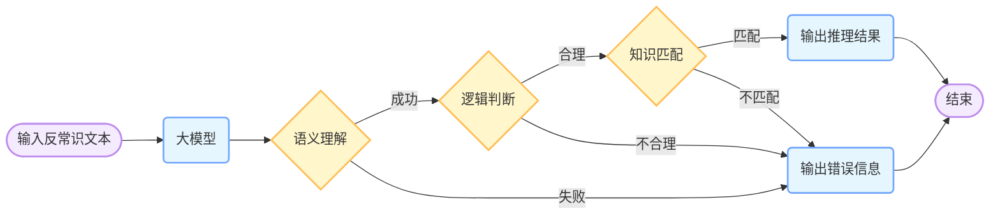

# 大模型在反常识推理中的能力评估

> 关键词：大模型、反常识推理、能力评估、自然语言处理、人工智能

> 摘要：本文聚焦于大模型在反常识推理方面的能力评估。首先介绍了研究背景，包括目的、预期读者、文档结构和相关术语。接着阐述了核心概念，如大模型和反常识推理的原理及联系，并给出了相应的示意图和流程图。深入探讨了用于评估的核心算法原理，通过 Python 代码详细展示操作步骤。对评估涉及的数学模型和公式进行讲解并举例说明。结合项目实战，给出代码案例并详细解读。分析了大模型在反常识推理中的实际应用场景，推荐了相关学习资源、开发工具框架和论文著作。最后总结了未来发展趋势与挑战，提供常见问题解答和扩展阅读参考资料，旨在为全面了解和评估大模型在反常识推理中的能力提供系统的指导。

## 1. 背景介绍 
### 1.1 目的和范围
在人工智能领域，大模型近年来取得了显著进展，在自然语言处理、图像识别等诸多任务中展现出强大的能力。然而，对于大模型在反常识推理方面的能力，目前尚未有全面且深入的评估。本研究的目的在于建立一套科学、有效的评估体系，准确衡量大模型在处理反常识信息时的推理能力。研究范围涵盖了多种常见的大模型，如 GPT 系列、BERT 及其衍生模型等，以及不同类型的反常识推理任务，包括语义理解、逻辑判断、因果推理等方面。

### 1.2 预期读者
本文的预期读者主要包括人工智能领域的研究人员、开发者、学生以及对大模型和反常识推理感兴趣的专业人士。对于研究人员，本文可提供新的研究思路和评估方法；开发者能从中获取在实际项目中应用大模型进行反常识推理的指导；学生则可以作为学习和了解相关领域的参考资料。

### 1.3 文档结构概述
本文将按照以下结构展开：首先介绍背景信息，包括研究目的、预期读者等；接着阐述核心概念，明确大模型和反常识推理的定义及相互关系；详细讲解用于评估的核心算法原理和具体操作步骤，并给出 Python 代码示例；介绍评估所涉及的数学模型和公式，通过实例加深理解；结合项目实战，展示代码实现和解读；分析大模型在反常识推理中的实际应用场景；推荐相关的学习资源、开发工具框架和论文著作；最后总结未来发展趋势与挑战，提供常见问题解答和扩展阅读参考资料。

### 1.4 术语表
#### 1.4.1 核心术语定义
- **大模型**：指具有大量参数和强大计算能力的人工智能模型，通常通过在大规模数据集上进行训练得到，能够处理各种复杂的任务，如语言生成、图像识别等。
- **反常识推理**：在推理过程中，需要突破常规的认知和常识，处理与常识相悖的信息，并根据给定的条件得出合理的结论。
- **能力评估**：通过一系列的指标和方法，对大模型在特定任务（如反常识推理）中的表现进行量化和分析，以确定其能力水平。

#### 1.4.2 相关概念解释
- **自然语言处理（NLP）**：是人工智能的一个重要领域，研究如何让计算机理解、处理和生成自然语言。大模型在 NLP 中应用广泛，而反常识推理是 NLP 中的一个具有挑战性的任务。
- **深度学习**：是一种基于人工神经网络的机器学习方法，大模型通常采用深度学习架构，如多层感知机、卷积神经网络（CNN）、循环神经网络（RNN）及其变体（如 LSTM、GRU）等。

#### 1.4.3 缩略词列表
- **GPT**：Generative Pretrained Transformer，一种基于 Transformer 架构的生成式预训练模型。
- **BERT**：Bidirectional Encoder Representations from Transformers，一种基于 Transformer 架构的双向编码器表示模型。
- **NLP**：Natural Language Processing，自然语言处理。

## 2. 核心概念与联系 
### 核心概念原理
#### 大模型原理
大模型通常基于深度学习架构，如 Transformer 架构。Transformer 由编码器和解码器组成，其核心机制是注意力机制（Attention Mechanism）。注意力机制允许模型在处理序列数据时，动态地关注不同位置的信息，从而捕捉长距离依赖关系。大模型通过在大规模的文本数据上进行无监督预训练，学习到语言的通用模式和特征表示。在预训练过程中，模型通常会进行掩码语言模型（Masked Language Model，MLM）和下一句预测（Next Sentence Prediction，NSP）等任务。例如，在 GPT 系列模型中，主要采用自回归的方式进行预训练，即根据前文预测下一个词；而 BERT 模型则采用双向的方式，通过掩码部分输入词来预测这些被掩码的词。

#### 反常识推理原理
反常识推理要求模型能够识别与常识相悖的信息，并根据给定的上下文和规则进行推理。这需要模型具备以下能力：
- **语义理解**：准确理解输入文本的语义，包括词语的含义、句子的结构和语义关系。
- **逻辑判断**：运用逻辑规则，对输入信息进行分析和判断，确定其合理性和一致性。
- **知识储备**：具备一定的常识知识，以便能够识别反常识信息。例如，常识告诉我们“鸟会飞”，当输入“有一种鸟不会飞”时，模型需要能够识别这是一个反常识信息，并进行相应的推理。

### 架构的文本示意图
```plaintext
大模型
|
|-- 输入层（文本输入）
|
|-- 编码器（如 Transformer 编码器）
|    |
|    |-- 多头注意力机制
|    |-- 前馈神经网络
|
|-- 解码器（可选，如在生成式模型中）
|    |
|    |-- 多头注意力机制
|    |-- 前馈神经网络
|
|-- 输出层（预测结果）

反常识推理任务
|
|-- 输入反常识文本
|
|-- 大模型处理
|    |
|    |-- 语义理解
|    |-- 逻辑判断
|    |-- 知识匹配
|
|-- 输出推理结果
```

### Mermaid 流程图


## 3. 核心算法原理 & 具体操作步骤 
### 核心算法原理
在评估大模型在反常识推理中的能力时，我们可以采用基于问答的方式。给定一系列反常识推理问题，让大模型回答，然后根据回答的准确性来评估其能力。具体算法步骤如下：
1. **数据准备**：收集或生成反常识推理问题数据集，每个问题包含问题描述和正确答案。
2. **模型输入**：将问题输入到大模型中，获取模型的回答。
3. **结果评估**：将模型的回答与正确答案进行比较，计算回答的准确率、召回率等指标。

### Python 代码实现
```python
import torch
from transformers import AutoTokenizer, AutoModelForCausalLM

# 加载预训练模型和分词器
model_name = "gpt2"
tokenizer = AutoTokenizer.from_pretrained(model_name)
model = AutoModelForCausalLM.from_pretrained(model_name)

# 定义反常识推理问题数据集
questions = [
    {
        "question": "如果太阳从西边升起，那么早上起床后看到的太阳在哪个方向？",
        "answer": "西边"
    },
    {
        "question": "假如水在常温下是固态，那么河里的水是什么状态？",
        "answer": "固态"
    }
]

# 评估函数
def evaluate_model(questions, model, tokenizer):
    correct_count = 0
    total_count = len(questions)
    
    for question_data in questions:
        question = question_data["question"]
        answer = question_data["answer"]
        
        # 对问题进行编码
        input_ids = tokenizer.encode(question, return_tensors="pt")
        
        # 生成回答
        output = model.generate(input_ids, max_length=100, num_return_sequences=1)
        generated_text = tokenizer.decode(output[0], skip_special_tokens=True)
        
        # 简单处理生成的文本，提取可能的答案部分
        # 这里只是简单示例，实际应用中可能需要更复杂的处理
        generated_answer = generated_text.split("\n")[0].strip()
        
        # 判断回答是否正确
        if generated_answer.lower() == answer.lower():
            correct_count += 1
    
    # 计算准确率
    accuracy = correct_count / total_count
    return accuracy

# 进行评估
accuracy = evaluate_model(questions, model, tokenizer)
print(f"模型在反常识推理任务中的准确率: {accuracy * 100:.2f}%")
```

### 代码解释
1. **模型加载**：使用 `transformers` 库加载预训练的 GPT-2 模型和对应的分词器。
2. **数据集定义**：定义了一个包含反常识推理问题和正确答案的列表 `questions`。
3. **评估函数**：`evaluate_model` 函数遍历每个问题，将问题输入到模型中生成回答，然后将生成的回答与正确答案进行比较，统计正确回答的数量，最后计算准确率。
4. **结果输出**：调用 `evaluate_model` 函数进行评估，并输出模型在反常识推理任务中的准确率。

## 4. 数学模型和公式 & 详细讲解 & 举例说明 
### 准确率（Accuracy）
准确率是评估模型在反常识推理任务中表现的最常用指标之一，它表示模型正确回答的问题数量占总问题数量的比例。计算公式如下：
$$
\text{Accuracy} = \frac{\text{正确回答的问题数量}}{\text{总问题数量}}
$$

**举例说明**：假设我们有 10 个反常识推理问题，模型正确回答了 7 个问题，那么准确率为：
$$
\text{Accuracy} = \frac{7}{10} = 0.7 = 70\%
$$

### 召回率（Recall）
召回率表示模型能够正确识别出的反常识问题的比例。在反常识推理任务中，我们可以将召回率定义为模型正确回答的反常识问题数量占所有反常识问题数量的比例。计算公式如下：
$$
\text{Recall} = \frac{\text{正确回答的反常识问题数量}}{\text{所有反常识问题数量}}
$$

**举例说明**：假设我们有 20 个反常识问题，模型正确回答了 15 个问题，那么召回率为：
$$
\text{Recall} = \frac{15}{20} = 0.75 = 75\%
$$

### F1 值（F1-score）
F1 值是准确率和召回率的调和平均数，它综合考虑了模型的准确性和召回能力。计算公式如下：
$$
\text{F1-score} = 2 \times \frac{\text{Accuracy} \times \text{Recall}}{\text{Accuracy} + \text{Recall}}
$$

**举例说明**：假设模型在反常识推理任务中的准确率为 0.7，召回率为 0.75，那么 F1 值为：
$$
\text{F1-score} = 2 \times \frac{0.7 \times 0.75}{0.7 + 0.75} \approx 0.72
$$

## 5. 项目实战：代码实际案例和详细解释说明 
### 5.1  开发环境搭建
#### 安装 Python
首先，确保你已经安装了 Python 3.6 或更高版本。你可以从 Python 官方网站（https://www.python.org/downloads/）下载并安装适合你操作系统的 Python 版本。

#### 创建虚拟环境
为了避免不同项目之间的依赖冲突，建议使用虚拟环境。在命令行中执行以下命令创建并激活虚拟环境：
```bash
# 创建虚拟环境
python -m venv myenv

# 激活虚拟环境（Windows）
myenv\Scripts\activate

# 激活虚拟环境（Linux/Mac）
source myenv/bin/activate
```

#### 安装依赖库
在虚拟环境中安装所需的依赖库，包括 `transformers` 和 `torch`：
```bash
pip install transformers torch
```

### 5.2  源代码详细实现和代码解读
```python
import torch
from transformers import AutoTokenizer, AutoModelForCausalLM

# 加载预训练模型和分词器
model_name = "gpt2"
tokenizer = AutoTokenizer.from_pretrained(model_name)
model = AutoModelForCausalLM.from_pretrained(model_name)

# 定义反常识推理问题数据集
questions = [
    {
        "question": "如果所有的猫都怕老鼠，那么家里养的猫看到老鼠会怎样？",
        "answer": "害怕"
    },
    {
        "question": "假如一年只有 100 天，那么每个季节大约有多少天？",
        "answer": "25"
    }
]

# 评估函数
def evaluate_model(questions, model, tokenizer):
    correct_count = 0
    total_count = len(questions)
    
    for question_data in questions:
        question = question_data["question"]
        answer = question_data["answer"]
        
        # 对问题进行编码
        input_ids = tokenizer.encode(question, return_tensors="pt")
        
        # 生成回答
        output = model.generate(input_ids, max_length=100, num_return_sequences=1)
        generated_text = tokenizer.decode(output[0], skip_special_tokens=True)
        
        # 简单处理生成的文本，提取可能的答案部分
        generated_answer = generated_text.split("\n")[0].strip()
        
        # 判断回答是否正确
        if generated_answer.lower() == answer.lower():
            correct_count += 1
    
    # 计算准确率
    accuracy = correct_count / total_count
    return accuracy

# 进行评估
accuracy = evaluate_model(questions, model, tokenizer)
print(f"模型在反常识推理任务中的准确率: {accuracy * 100:.2f}%")
```

### 代码解读与分析
#### 模型加载部分
```python
model_name = "gpt2"
tokenizer = AutoTokenizer.from_pretrained(model_name)
model = AutoModelForCausalLM.from_pretrained(model_name)
```
这部分代码使用 `transformers` 库加载预训练的 GPT-2 模型和对应的分词器。`AutoTokenizer` 会根据模型名称自动选择合适的分词器，`AutoModelForCausalLM` 用于加载生成式语言模型。

#### 数据集定义部分
```python
questions = [
    {
        "question": "如果所有的猫都怕老鼠，那么家里养的猫看到老鼠会怎样？",
        "answer": "害怕"
    },
    {
        "question": "假如一年只有 100 天，那么每个季节大约有多少天？",
        "answer": "25"
    }
]
```
这里定义了一个包含反常识推理问题和正确答案的列表 `questions`，每个元素是一个字典，包含 `question` 和 `answer` 两个键。

#### 评估函数部分
```python
def evaluate_model(questions, model, tokenizer):
    correct_count = 0
    total_count = len(questions)
    
    for question_data in questions:
        question = question_data["question"]
        answer = question_data["answer"]
        
        # 对问题进行编码
        input_ids = tokenizer.encode(question, return_tensors="pt")
        
        # 生成回答
        output = model.generate(input_ids, max_length=100, num_return_sequences=1)
        generated_text = tokenizer.decode(output[0], skip_special_tokens=True)
        
        # 简单处理生成的文本，提取可能的答案部分
        generated_answer = generated_text.split("\n")[0].strip()
        
        # 判断回答是否正确
        if generated_answer.lower() == answer.lower():
            correct_count += 1
    
    # 计算准确率
    accuracy = correct_count / total_count
    return accuracy
```
`evaluate_model` 函数是核心评估函数，它遍历每个问题，将问题编码后输入到模型中生成回答，然后对生成的文本进行简单处理，提取可能的答案部分，最后将其与正确答案进行比较，统计正确回答的数量并计算准确率。

#### 结果输出部分
```python
accuracy = evaluate_model(questions, model, tokenizer)
print(f"模型在反常识推理任务中的准确率: {accuracy * 100:.2f}%")
```
调用 `evaluate_model` 函数进行评估，并将准确率以百分比的形式输出。

## 6. 实际应用场景 
### 智能客服
在智能客服系统中，用户可能会提出一些反常识的问题，例如“我在火星上怎么使用你们的服务”。大模型如果具备良好的反常识推理能力，就能够理解用户的意图，并给出合理的回答，如“目前我们的服务主要面向地球用户，在火星上使用可能会受到通信等方面的限制”，从而提高用户体验。

### 教育领域
在教育中，教师可以利用大模型进行反常识推理的教学。例如，给出一些反常识的科学假设，让大模型进行推理和解释，帮助学生更好地理解科学原理。同时，大模型也可以作为学生学习的辅助工具，当学生提出反常识的问题时，能够给予准确的解答和引导。

### 创意写作
在创意写作领域，反常识的情节和设定常常能够吸引读者的注意力。大模型可以根据作者提供的反常识设定，进行推理和创作，生成富有创意的故事内容。例如，设定“人类可以在水下呼吸”，大模型可以推理出相应的社会、生活场景，并创作出相关的故事。

### 安全监测
在安全监测系统中，可能会出现一些反常识的情况，如异常的行为模式、不符合常理的事件等。大模型可以通过反常识推理，识别这些异常情况，并及时发出警报，帮助保障系统的安全。

## 7. 工具和资源推荐
### 7.1 学习资源推荐
#### 7.1.1 书籍推荐
- 《深度学习》（Deep Learning）：由 Ian Goodfellow、Yoshua Bengio 和 Aaron Courville 所著，是深度学习领域的经典教材，详细介绍了深度学习的基本原理、算法和应用。
- 《自然语言处理入门》：帮助读者快速了解自然语言处理的基本概念、技术和方法，适合初学者。
- 《Attention Is All You Need》：Transformer 架构的原始论文，对理解大模型的核心机制有很大帮助。

#### 7.1.2 在线课程
- Coursera 上的“深度学习专项课程”（Deep Learning Specialization）：由 Andrew Ng 教授授课，涵盖了深度学习的各个方面，包括神经网络、卷积神经网络、循环神经网络等。
- edX 上的“自然语言处理基础”（Foundations of Natural Language Processing）：系统介绍了自然语言处理的基础知识和技术。

#### 7.1.3 技术博客和网站
- Hugging Face 博客（https://huggingface.co/blog）：提供了关于大模型、自然语言处理等方面的最新研究成果和技术分享。
- Medium 上的人工智能相关博客：有很多专业人士分享的关于大模型、反常识推理等方面的文章。

### 7.2 开发工具框架推荐
#### 7.2.1 IDE和编辑器
- PyCharm：一款功能强大的 Python 集成开发环境，提供了代码编辑、调试、版本控制等丰富的功能。
- Visual Studio Code：轻量级的代码编辑器，支持多种编程语言，拥有丰富的插件生态系统。

#### 7.2.2 调试和性能分析工具
- TensorBoard：用于可视化深度学习模型的训练过程和性能指标，帮助开发者更好地理解模型的训练情况。
- Py-Spy：可以对 Python 代码进行性能分析，找出性能瓶颈。

#### 7.2.3 相关框架和库
- Transformers：由 Hugging Face 开发的库，提供了丰富的预训练模型和工具，方便开发者进行自然语言处理任务。
- PyTorch：一个开源的深度学习框架，具有动态图机制，易于使用和调试。

### 7.3 相关论文著作推荐
#### 7.3.1 经典论文
- 《Attention Is All You Need》：提出了 Transformer 架构，为大模型的发展奠定了基础。
- 《BERT: Pre-training of Deep Bidirectional Transformers for Language Understanding》：介绍了 BERT 模型，开启了预训练语言模型的新时代。

#### 7.3.2 最新研究成果
- 关注 ACL（Association for Computational Linguistics）、NeurIPS（Conference on Neural Information Processing Systems）等顶级学术会议的论文，了解大模型在反常识推理等方面的最新研究进展。

#### 7.3.3 应用案例分析
- 可以在相关学术数据库中查找关于大模型在智能客服、教育等领域应用的案例分析论文，学习实际应用中的经验和方法。

## 8. 总结：未来发展趋势与挑战
### 未来发展趋势
#### 模型性能提升
随着计算资源的不断增加和算法的不断优化，大模型在反常识推理方面的能力将不断提升。未来的大模型可能会具备更强的语义理解、逻辑推理和知识融合能力，能够更准确地处理复杂的反常识问题。

#### 多模态融合
将大模型与图像、音频等多模态信息相结合，实现更全面的反常识推理。例如，在处理包含图像和文本的反常识场景时，模型能够综合利用多种信息进行推理，提高推理的准确性和可靠性。

#### 个性化推理
根据用户的偏好、背景知识等因素，为用户提供个性化的反常识推理服务。例如，在教育领域，根据学生的学习进度和知识水平，提供适合的反常识推理问题和解答。

### 挑战
#### 数据质量和多样性
反常识推理需要大量高质量、多样化的数据进行训练。然而，目前反常识数据的收集和标注面临着很大的挑战，数据的质量和多样性不足可能会影响模型的性能。

#### 可解释性
大模型通常是黑盒模型，其推理过程难以解释。在反常识推理中，理解模型的决策过程尤为重要，因为反常识信息往往需要更深入的解释和说明。如何提高大模型的可解释性是一个亟待解决的问题。

#### 计算资源需求
训练和运行大模型需要大量的计算资源，这限制了大模型在反常识推理中的广泛应用。如何降低计算资源需求，提高模型的效率，是未来需要研究的方向。

## 9. 附录：常见问题与解答
### 问题 1：如何选择适合的大模型进行反常识推理评估？
答：可以根据任务的特点和需求选择合适的大模型。如果是生成式任务，可以选择 GPT 系列模型；如果是侧重于语义理解和特征提取，可以选择 BERT 及其衍生模型。同时，还可以考虑模型的参数规模、训练数据等因素。

### 问题 2：如何提高大模型在反常识推理中的准确率？
答：可以从以下几个方面入手：
- 增加高质量的反常识数据进行训练，提高模型的泛化能力。
- 优化模型的架构和训练算法，提高模型的性能。
- 结合外部知识图谱，为模型提供更多的常识知识。

### 问题 3：反常识推理任务与普通推理任务有什么区别？
答：反常识推理任务需要处理与常识相悖的信息，而普通推理任务通常基于常识和常规逻辑进行推理。反常识推理任务对模型的语义理解、逻辑判断和知识储备要求更高，需要模型能够突破常规思维，进行合理的推理。

## 10. 扩展阅读 & 参考资料
### 扩展阅读
- 《人工智能：现代方法》：全面介绍了人工智能的各个领域，包括知识表示、推理、机器学习等。
- 《思考，快与慢》：探讨了人类思维的两种模式，对理解反常识推理的认知机制有一定的帮助。

### 参考资料
- Hugging Face 官方文档（https://huggingface.co/docs）：提供了关于 Transformers 库的详细文档和使用示例。
- PyTorch 官方文档（https://pytorch.org/docs/stable/index.html）：是学习和使用 PyTorch 框架的重要参考资料。

作者：AI天才研究院/AI Genius Institute & 禅与计算机程序设计艺术 /Zen And The Art of Computer Programming