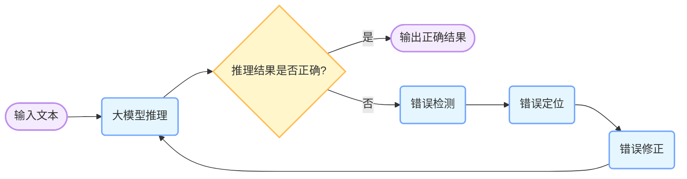

# 大模型在反常识推理任务中的错误修正机制设计与优化

> 关键词：大模型、反常识推理任务、错误修正机制、设计、优化

> 摘要：本文聚焦于大模型在反常识推理任务中的错误修正机制。首先介绍了研究的背景、目的、预期读者以及文档结构等信息，明确了核心术语和相关概念。接着阐述了大模型在反常识推理中的核心概念、原理和架构，并通过Mermaid流程图进行直观展示。详细讲解了核心算法原理，结合Python源代码进行具体操作步骤的说明。运用数学模型和公式对错误修正机制进行深入分析，并举例说明。通过项目实战，从开发环境搭建到源代码实现和解读，展示了错误修正机制的实际应用。探讨了其在不同场景中的实际应用，推荐了相关的学习资源、开发工具框架和论文著作。最后总结了未来发展趋势与挑战，提供了常见问题解答和扩展阅读参考资料，旨在为大模型在反常识推理任务中的错误修正提供全面且深入的技术指导。

## 1. 背景介绍 
### 1.1 目的和范围
在自然语言处理领域，大模型已经取得了显著的进展，但在处理反常识推理任务时仍存在较多错误。反常识推理要求模型能够识别与常识相悖的信息，并进行合理的推理和判断。设计和优化大模型在反常识推理任务中的错误修正机制，目的在于提高模型的推理准确性和可靠性，使其能够更好地处理复杂的反常识问题。本研究的范围涵盖了错误修正机制的设计原理、算法实现、实际应用等方面，从理论到实践全面探讨如何提升大模型在反常识推理任务中的性能。

### 1.2 预期读者
本文预期读者包括自然语言处理领域的研究人员、工程师、开发者，以及对人工智能和大模型技术感兴趣的学生和爱好者。对于从事相关研究和开发工作的专业人士，本文可以提供新的思路和方法，帮助他们优化现有的模型和系统；对于初学者，本文可以作为入门指南，引导他们了解大模型在反常识推理任务中的挑战和解决方案。

### 1.3 文档结构概述
本文共分为十个部分。第一部分为背景介绍，阐述了研究的目的、范围、预期读者和文档结构。第二部分介绍核心概念与联系，包括大模型、反常识推理任务、错误修正机制等核心概念的原理和架构，并通过示意图和流程图进行展示。第三部分详细讲解核心算法原理和具体操作步骤，使用Python源代码进行说明。第四部分运用数学模型和公式对错误修正机制进行分析，并举例说明。第五部分通过项目实战，展示开发环境搭建、源代码实现和解读。第六部分探讨实际应用场景。第七部分推荐相关的学习资源、开发工具框架和论文著作。第八部分总结未来发展趋势与挑战。第九部分为附录，提供常见问题与解答。第十部分列出扩展阅读和参考资料。

### 1.4 术语表
#### 1.4.1 核心术语定义
- **大模型**：指具有大量参数和强大计算能力的深度学习模型，如GPT系列、BERT等，通常在大规模数据上进行预训练，能够处理多种自然语言处理任务。
- **反常识推理任务**：要求模型对与常识相悖的信息进行推理和判断，例如判断“太阳从西边升起”这样的陈述是否合理，并给出相应的推理结果。
- **错误修正机制**：用于检测和纠正大模型在反常识推理任务中产生的错误的一系列方法和策略。

#### 1.4.2 相关概念解释
- **常识知识库**：存储了人类常识信息的数据库，如地理、历史、科学等方面的知识，可用于辅助大模型进行反常识推理。
- **推理置信度**：模型对其推理结果的自信程度，通常用概率值表示，用于评估推理结果的可靠性。

#### 1.4.3 缩略词列表
- **NLP**：Natural Language Processing，自然语言处理
- **GPT**：Generative Pretrained Transformer，生成式预训练变换器
- **BERT**：Bidirectional Encoder Representations from Transformers，基于变换器的双向编码器表示

## 2. 核心概念与联系 
### 核心概念原理
#### 大模型
大模型基于深度学习架构，如Transformer，通过在大规模文本数据上进行无监督预训练来学习语言的模式和规律。在预训练过程中，模型学习到了丰富的语义和语法知识，能够对输入的文本进行编码和解码。例如，GPT系列模型采用了自回归的方式进行预训练，通过预测下一个单词来学习语言的生成能力；BERT模型则采用了掩码语言模型和下一句预测任务进行预训练，学习到了双向的语言表示。

#### 反常识推理任务
反常识推理任务需要模型具备对常识的理解和判断能力。当输入的信息与常识知识库中的内容相悖时，模型需要能够识别这种差异，并进行合理的推理。例如，对于“水在常温下会变成冰”这样的陈述，模型需要根据常识知识判断其不合理性，并给出相应的解释。

#### 错误修正机制
错误修正机制的核心是检测和纠正大模型在反常识推理任务中产生的错误。它可以通过多种方式实现，如引入常识知识库、使用额外的监督信息、进行模型融合等。错误修正机制的目标是提高模型的推理准确性和可靠性，减少错误推理的发生。

### 架构示意图

该流程图展示了大模型在反常识推理任务中的错误修正过程。首先，输入文本经过大模型进行推理，然后判断推理结果是否正确。如果正确，则直接输出结果；如果错误，则进行错误检测、定位和修正，修正后的结果再次输入大模型进行推理，直到得到正确的结果。

## 3. 核心算法原理 & 具体操作步骤 
### 核心算法原理
#### 错误检测算法
错误检测算法的目的是判断大模型的推理结果是否存在错误。一种简单的方法是使用常识知识库进行比对。具体来说，将推理结果与常识知识库中的内容进行匹配，如果存在明显的冲突，则认为推理结果存在错误。例如，对于推理结果“苹果是一种液体”，通过常识知识库可以判断该结果与“苹果是固体水果”的常识相冲突，从而检测出错误。

#### 错误定位算法
错误定位算法用于确定错误发生的位置和原因。可以通过分析模型的中间输出和注意力机制来实现。例如，在Transformer模型中，注意力机制可以反映模型在处理输入文本时对不同部分的关注程度。通过分析注意力权重，可以找出模型在推理过程中可能出现错误的关键位置。

#### 错误修正算法
错误修正算法根据错误定位的结果对推理结果进行修正。一种常见的方法是引入额外的监督信息，如人工标注的反常识推理样本，对模型进行微调。另一种方法是使用模型融合，将多个不同的模型的推理结果进行综合，以提高推理的准确性。

### 具体操作步骤
#### 步骤1：数据准备
收集和整理反常识推理任务的数据集，包括输入文本和对应的正确推理结果。同时，构建常识知识库，将常见的常识信息存储在其中。

#### 步骤2：模型选择和预训练
选择合适的大模型，如GPT或BERT，并在大规模文本数据上进行预训练。预训练后的模型可以学习到丰富的语言知识，为后续的反常识推理任务打下基础。

#### 步骤3：错误检测
将输入文本输入到预训练好的模型中进行推理，得到推理结果。然后，将推理结果与常识知识库进行比对，检测是否存在错误。

#### 步骤4：错误定位
如果检测到错误，使用注意力机制等方法分析模型的中间输出，找出错误发生的位置和原因。

#### 步骤5：错误修正
根据错误定位的结果，采用引入额外监督信息或模型融合等方法对推理结果进行修正。修正后的结果再次输入模型进行推理，直到得到正确的结果。

### Python源代码实现
```python
import torch
from transformers import GPT2LMHeadModel, GPT2Tokenizer

# 加载预训练模型和分词器
tokenizer = GPT2Tokenizer.from_pretrained('gpt2')
model = GPT2LMHeadModel.from_pretrained('gpt2')

# 定义常识知识库
common_knowledge = {
    "苹果": "固体水果",
    "水": "液体"
}

def detect_error(result):
    for entity, property in common_knowledge.items():
        if entity in result and property not in result:
            return True
    return False

def correct_error(input_text):
    input_ids = tokenizer.encode(input_text, return_tensors='pt')
    output = model.generate(input_ids)
    result = tokenizer.decode(output[0], skip_special_tokens=True)
    
    while detect_error(result):
        # 这里简单模拟错误修正，实际应用中可以采用更复杂的方法
        input_text = "根据常识，" + input_text
        input_ids = tokenizer.encode(input_text, return_tensors='pt')
        output = model.generate(input_ids)
        result = tokenizer.decode(output[0], skip_special_tokens=True)
    
    return result

# 示例输入
input_text = "苹果是一种液体"
corrected_result = correct_error(input_text)
print("修正后的结果:", corrected_result)
```
上述代码实现了一个简单的错误修正机制。首先，加载预训练的GPT2模型和分词器。然后，定义了一个常识知识库，用于检测推理结果是否存在错误。`detect_error`函数用于检测错误，`correct_error`函数用于进行错误修正。最后，给出一个示例输入，输出修正后的结果。

## 4. 数学模型和公式 & 详细讲解 & 举例说明 
### 数学模型和公式
#### 推理置信度计算
在反常识推理任务中，推理置信度可以用来评估模型推理结果的可靠性。假设模型的输出为一个概率分布 $P(y|x)$，其中 $x$ 是输入文本，$y$ 是可能的推理结果。推理置信度 $C$ 可以定义为：
$$C = \max_{y} P(y|x)$$
即选择概率最大的推理结果作为最终结果，并将其概率值作为推理置信度。

#### 错误修正损失函数
在引入额外监督信息进行错误修正时，可以使用交叉熵损失函数来衡量模型的预测结果与真实标签之间的差异。假设训练数据集为 $\{(x_i, y_i)\}_{i=1}^{N}$，其中 $x_i$ 是输入文本，$y_i$ 是对应的真实标签。模型的预测概率分布为 $P(y|x_i)$，则交叉熵损失函数 $L$ 可以定义为：
$$L = -\frac{1}{N} \sum_{i=1}^{N} \sum_{y} y_{i,y} \log P(y|x_i)$$
其中 $y_{i,y}$ 是一个指示函数，如果 $y$ 是 $x_i$ 的真实标签，则 $y_{i,y} = 1$，否则 $y_{i,y} = 0$。

### 详细讲解
#### 推理置信度计算
推理置信度反映了模型对其推理结果的自信程度。置信度越高，说明模型对该推理结果越有把握。在实际应用中，可以设置一个置信度阈值，当推理置信度低于该阈值时，认为模型的推理结果可能存在错误，需要进行进一步的检查和修正。

#### 错误修正损失函数
交叉熵损失函数是深度学习中常用的损失函数之一，用于衡量模型的预测结果与真实标签之间的差异。在错误修正过程中，通过最小化交叉熵损失函数，可以使模型的预测结果更加接近真实标签，从而提高模型的推理准确性。

### 举例说明
假设输入文本为“太阳从西边升起”，模型的输出概率分布为 $P(y_1|x) = 0.1$，$P(y_2|x) = 0.9$，其中 $y_1$ 表示“太阳从西边升起是合理的”，$y_2$ 表示“太阳从西边升起是不合理的”。则推理置信度 $C = \max\{0.1, 0.9\} = 0.9$。

假设训练数据集中有一个样本 $(x, y)$，其中 $x$ 是“水在常温下会变成冰”，$y$ 是“水在常温下是液体”。模型的预测概率分布为 $P(y_1|x) = 0.2$，$P(y_2|x) = 0.8$，其中 $y_1$ 表示“水在常温下会变成冰是合理的”，$y_2$ 表示“水在常温下会变成冰是不合理的”。则该样本的交叉熵损失为：
$$L = - (0 \times \log 0.2 + 1 \times \log 0.8) \approx 0.223$$

## 5. 项目实战：代码实际案例和详细解释说明 
### 5.1  开发环境搭建
#### 安装Python和相关库
首先，确保你已经安装了Python 3.6或更高版本。然后，使用以下命令安装所需的库：
```bash
pip install torch transformers
```
`torch` 是PyTorch深度学习框架，`transformers` 是Hugging Face提供的用于自然语言处理的库，包含了许多预训练的模型和工具。

#### 下载预训练模型
可以使用 `transformers` 库提供的函数直接下载预训练的模型。例如，下载GPT2模型：
```python
from transformers import GPT2LMHeadModel, GPT2Tokenizer

tokenizer = GPT2Tokenizer.from_pretrained('gpt2')
model = GPT2LMHeadModel.from_pretrained('gpt2')
```

### 5.2  源代码详细实现和代码解读
```python
import torch
from transformers import GPT2LMHeadModel, GPT2Tokenizer

# 加载预训练模型和分词器
tokenizer = GPT2Tokenizer.from_pretrained('gpt2')
model = GPT2LMHeadModel.from_pretrained('gpt2')

# 定义常识知识库
common_knowledge = {
    "苹果": "固体水果",
    "水": "液体"
}

def detect_error(result):
    for entity, property in common_knowledge.items():
        if entity in result and property not in result:
            return True
    return False

def correct_error(input_text):
    input_ids = tokenizer.encode(input_text, return_tensors='pt')
    output = model.generate(input_ids)
    result = tokenizer.decode(output[0], skip_special_tokens=True)
    
    while detect_error(result):
        # 这里简单模拟错误修正，实际应用中可以采用更复杂的方法
        input_text = "根据常识，" + input_text
        input_ids = tokenizer.encode(input_text, return_tensors='pt')
        output = model.generate(input_ids)
        result = tokenizer.decode(output[0], skip_special_tokens=True)
    
    return result

# 示例输入
input_text = "苹果是一种液体"
corrected_result = correct_error(input_text)
print("修正后的结果:", corrected_result)
```
#### 代码解读
1. **加载预训练模型和分词器**：使用 `transformers` 库的 `GPT2Tokenizer` 和 `GPT2LMHeadModel` 加载预训练的GPT2模型和分词器。
2. **定义常识知识库**：`common_knowledge` 字典存储了常见的常识信息，用于检测推理结果是否存在错误。
3. **错误检测函数 `detect_error`**：遍历常识知识库，检查推理结果中是否包含实体，并且该实体的属性是否与常识知识库中的属性一致。如果不一致，则认为推理结果存在错误。
4. **错误修正函数 `correct_error`**：首先将输入文本编码为模型可以接受的输入格式，然后使用模型生成推理结果。如果检测到推理结果存在错误，则在输入文本前添加“根据常识”，再次进行推理，直到得到正确的结果。
5. **示例输入和输出**：给出一个示例输入“苹果是一种液体”，调用 `correct_error` 函数进行错误修正，并输出修正后的结果。

### 5.3  代码解读与分析
#### 优点
- 代码简单易懂，使用了常见的深度学习库和预训练模型，易于实现和扩展。
- 通过引入常识知识库进行错误检测，能够有效地识别与常识相悖的推理结果。

#### 缺点
- 错误修正方法比较简单，只是在输入文本前添加“根据常识”，实际应用中可能需要更复杂的方法。
- 常识知识库的覆盖范围有限，可能无法处理所有的反常识推理任务。

#### 改进方向
- 可以引入更多的监督信息，如人工标注的反常识推理样本，对模型进行微调，提高模型的推理准确性。
- 可以使用更复杂的错误修正算法，如模型融合、强化学习等，提高错误修正的效果。

## 6. 实际应用场景 
### 智能问答系统
在智能问答系统中，用户可能会提出一些与常识相悖的问题，如“月亮比太阳大吗？”。大模型在回答这些问题时可能会出现错误，通过错误修正机制可以提高回答的准确性。例如，系统可以根据常识知识库判断问题的合理性，并给出正确的回答。

### 文本审核
在文本审核任务中，需要对输入的文本进行反常识推理，判断文本内容是否合理。例如，检测新闻报道中是否存在与事实不符的信息。错误修正机制可以帮助审核系统更准确地识别和纠正这些错误信息。

### 教育领域
在教育领域，大模型可以用于辅助教学和评估学生的回答。当学生提出与常识相悖的观点时，模型可以通过错误修正机制指出错误，并给予正确的指导。例如，在科学课程中，判断学生对物理现象的解释是否正确。

## 7. 工具和资源推荐
### 7.1 学习资源推荐
#### 7.1.1 书籍推荐
- 《深度学习》（Deep Learning）：由Ian Goodfellow、Yoshua Bengio和Aaron Courville所著，是深度学习领域的经典教材，涵盖了深度学习的基本原理、算法和应用。
- 《自然语言处理入门》（Natural Language Processing with Python）：介绍了使用Python进行自然语言处理的基本方法和技术，适合初学者入门。

#### 7.1.2 在线课程
- Coursera上的“深度学习专项课程”（Deep Learning Specialization）：由Andrew Ng教授授课，系统地介绍了深度学习的各个方面，包括神经网络、卷积神经网络、循环神经网络等。
- edX上的“自然语言处理基础”（Foundations of Natural Language Processing）：详细讲解了自然语言处理的基本概念、算法和应用。

#### 7.1.3 技术博客和网站
- Hugging Face博客（https://huggingface.co/blog）：提供了关于自然语言处理、预训练模型等方面的最新研究成果和技术文章。
- Medium上的自然语言处理专区：有许多专业人士分享的自然语言处理相关的技术博客和经验分享。

### 7.2 开发工具框架推荐
#### 7.2.1 IDE和编辑器
- PyCharm：是一款专门为Python开发设计的集成开发环境，具有代码编辑、调试、版本控制等功能，适合开发Python程序。
- Jupyter Notebook：是一个交互式的开发环境，支持Python、R等多种编程语言，适合进行数据分析和模型实验。

#### 7.2.2 调试和性能分析工具
- TensorBoard：是TensorFlow提供的可视化工具，可以用于监控模型的训练过程、可视化模型的结构和性能指标。
- Py-Spy：是一个用于Python程序性能分析的工具，可以帮助开发者找出程序中的性能瓶颈。

#### 7.2.3 相关框架和库
- PyTorch：是一个开源的深度学习框架，具有动态图机制，易于使用和调试，广泛应用于自然语言处理、计算机视觉等领域。
- Transformers：是Hugging Face开发的自然语言处理库，提供了许多预训练的模型和工具，方便开发者进行自然语言处理任务的开发。

### 7.3 相关论文著作推荐
#### 7.3.1 经典论文
- “Attention Is All You Need”：提出了Transformer架构，是自然语言处理领域的重要突破，为后续的大模型发展奠定了基础。
- “BERT: Pre-training of Deep Bidirectional Transformers for Language Understanding”：介绍了BERT模型的预训练方法和应用，在多个自然语言处理任务中取得了优异的成绩。

#### 7.3.2 最新研究成果
- 关注ACL（Association for Computational Linguistics）、EMNLP（Conference on Empirical Methods in Natural Language Processing）等自然语言处理领域的顶级会议，了解最新的研究成果和技术趋势。

#### 7.3.3 应用案例分析
- 可以参考一些实际应用案例的论文，如大模型在智能客服、医疗诊断等领域的应用，学习如何将技术应用到实际场景中。

## 8. 总结：未来发展趋势与挑战
### 未来发展趋势
#### 多模态融合
未来的大模型在反常识推理任务中可能会融合多种模态的信息，如图像、语音等。通过多模态信息的融合，可以更全面地理解输入内容，提高反常识推理的准确性。

#### 强化学习的应用
强化学习可以用于优化大模型的错误修正机制。通过设置合适的奖励函数，让模型在与环境的交互中不断学习和改进，提高推理的性能。

#### 常识知识的自动更新
随着知识的不断更新和发展，常识知识库需要及时更新。未来的研究可能会关注如何实现常识知识的自动更新，以保证模型能够处理最新的反常识推理任务。

### 挑战
#### 常识知识的表示和获取
常识知识具有多样性和复杂性，如何有效地表示和获取常识知识是一个挑战。目前的常识知识库还存在覆盖范围有限、知识表示不精确等问题。

#### 计算资源的需求
大模型通常需要大量的计算资源进行训练和推理，这对于硬件设备和计算成本提出了很高的要求。如何在有限的计算资源下提高模型的性能是一个亟待解决的问题。

#### 可解释性和可靠性
大模型的决策过程往往缺乏可解释性，难以理解模型为什么会做出这样的推理结果。此外，模型的可靠性也是一个问题，如何保证模型在各种情况下都能给出准确和可靠的推理结果是一个挑战。

## 9. 附录：常见问题与解答
### 问题1：如何构建更完善的常识知识库？
可以通过多种方式构建常识知识库。一种方法是从百科全书、教科书等权威资料中提取常识信息，并进行整理和分类。另一种方法是利用众包的方式，让大量的用户参与到常识知识的标注和整理中。此外，还可以使用自然语言处理技术，从互联网上的文本数据中自动提取常识知识。

### 问题2：错误修正机制是否会影响模型的推理速度？
在一定程度上，错误修正机制会影响模型的推理速度。因为错误修正需要进行额外的检测、定位和修正操作，增加了推理的时间。但是，可以通过优化算法和使用高效的计算设备来减少这种影响。例如，采用并行计算的方式进行错误检测和修正，提高处理效率。

### 问题3：如何评估错误修正机制的效果？
可以使用多种指标来评估错误修正机制的效果。常见的指标包括准确率、召回率、F1值等。准确率表示修正后结果的正确比例，召回率表示能够正确修正的错误比例，F1值是准确率和召回率的调和平均数。此外，还可以进行人工评估，让专业人员对修正后的结果进行评价。

## 10. 扩展阅读 & 参考资料
### 扩展阅读
- 《人工智能：现代方法》（Artificial Intelligence: A Modern Approach）：全面介绍了人工智能的各个领域，包括知识表示、推理、机器学习等，适合深入学习人工智能的原理和方法。
- 《自然语言处理综论》（Speech and Language Processing）：详细讲解了自然语言处理的理论和技术，包括词法分析、句法分析、语义分析等。

### 参考资料
- Hugging Face官方文档（https://huggingface.co/docs/transformers/index）：提供了关于Transformers库的详细文档和使用指南。
- PyTorch官方文档（https://pytorch.org/docs/stable/index.html）：是PyTorch深度学习框架的官方文档，包含了API参考、教程等内容。

作者：AI天才研究院/AI Genius Institute & 禅与计算机程序设计艺术 /Zen And The Art of Computer Programming